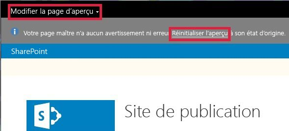

# Comment modifier la page d'aperçu dans le Gestionnaire de conception SharePoint 2013
Découvrez comment définir, créer et modifier la page d'aperçu du Gestionnaire de conception dans SharePoint 2013.
La page d'aperçu est la page de votre site que vous utilisez pour visualiser l'aspect de votre conception. Vous pouvez définir la page d'aperçu pour qu'il s'agisse d'une page spécifique de votre site ou d'une page générique. Si vous choisissez l'aperçu générique, vous visualiserez votre page maître avec seulement un espace réservé pour le contenu. Vous visualiserez également un message dans la bannière vous indiquant que vous affichez actuellement la page maître sans contenu. Si vous choisissez une page spécifique, vous visualiserez le contenu de la page avec le rendu de la page maître et la mise en page adéquate.
  
    
    

Pendant l'interaction avec la page, vous risquez de faire quelque chose qui entraîne la sortie de l'aperçu SharePoint. Par exemple, si vous sélectionnez **Enregistrer** dans le ruban, SharePoint enregistre la page, puis affiche la version réelle de la page (la version réelle de la page utilise la page maître réelle, et non la page maître que vous avez conçue). Vous pouvez revenir à la page d'aperçu en choisissant **Réinitialiser l'aperçu**.
  
    
    

  
    
    

  
    
    

  
    
    

## Définir la page d'aperçu dans le Gestionnaire de conception

Utilisez cette procédure pour configurer la page d'aperçu.
  
    
    

### Pour définir la page d'aperçu

1. Dans la bannière en haut du navigateur web, choisissez **Modifier la page d'aperçu**.
    
  
2. Choisissez **Sélectionner un élément existant**.
    
  
3. Pour utiliser une page d'aperçu générique, sélectionnez **Aperçu générique**.
    
  
4. Pour utiliser une page spécifique comme page d'aperçu, sélectionnez **URL**, puis saisissez l'URL de la page.
    
  
5. Sélectionnez **OK**.
    
  

## Créer une page d'aperçu dans le Gestionnaire de conception

Utilisez cette procédure pour créer une page et la définir comme page d'aperçu.
  
    
    

### Pour créer une page d'aperçu

1. Dans la bannière en haut du navigateur web, choisissez **Modifier la page d'aperçu**.
    
  
2. Sélectionnez **Créer nouveau**.
    
  
3. Saisissez un nom pour la page, puis choisissez **Créer**.
    
    La page est créée et vous êtes dirigé vers une vue à partir de laquelle vous pouvez ajouter du contenu à la nouvelle page.
    
  

## Revenir à la page d'aperçu dans le Gestionnaire de conception

Utilisez cette procédure pour revenir à la page d'aperçu.
  
    
    

### Pour revenir à la page d'aperçu

- Dans le message d'information en haut du navigateur web, sélectionnez **Réinitialiser l'aperçu**.
    
  

## Ressources supplémentaires

-  [Pages maîtres, galerie de pages maîtres et mises en page dans SharePoint 2013](master-pages-the-master-page-gallery-and-page-layouts-in-sharepoint-2013.md)
    
  
-  [Développer la conception de site dans SharePoint 2013](develop-the-site-design-in-sharepoint-2013.md)
    
  
-  [Comment mapper un lecteur réseau sur la galerie Pages maîtres SharePoint 2013](how-to-map-a-network-drive-to-the-sharepoint-2013-master-page-gallery.md)
    
  
-  [Canaux d'appareils du Gestionnaire de conception SharePoint 2013](sharepoint-2013-design-manager-device-channels.md)
    
  
-  [Rendus d'image du Gestionnaire de conception SharePoint 2013](sharepoint-2013-design-manager-image-renditions.md)
    
  

