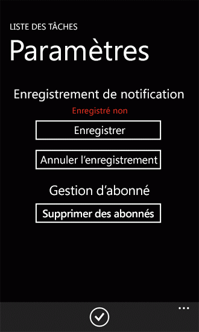
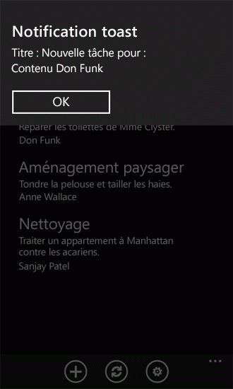
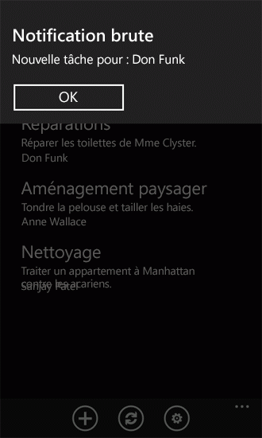
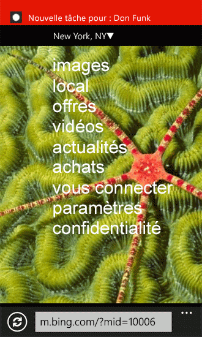

# Procédure : Configurer et utiliser les notifications Push dans les applications SharePoint 2013 pour Windows Phone
Créez une solution dans SharePoint Server pour envoyer des notifications Push et développez une application Windows Phone pour recevoir les notifications.
À l'aide des Services de notifications Push Microsoft, les applications Windows Phone peuvent recevoir des notifications via Internet d'événements déclenchés sur Microsoft SharePoint Server. L'application de téléphone ne doit pas interroger le serveur pour modifier, par exemple, les éléments d'une liste sur laquelle est basée l'application de téléphone. L'application peut être enregistrée pour recevoir des notifications à partir du serveur, et un récepteur d'événements peut lancer une notification et l'envoyer à l'application de réception qui la gère. La notification Push est relayée vers les appareils Windows Phone par les Services de notifications Push Microsoft.
  
    
    

Windows Phone 7 ne prend pas en charge l'exécution simultanée de plusieurs applications. Outre les composants du système d'exploitation Windows Phone proprement dit, une seule application à la fois peut s'exécuter sur le téléphone. Un événement relatif à une application de téléphone donnée peut se produire (par exemple, un élément de liste est ajouté à une liste) lorsque l'application n'est pas exécutée au premier plan sur le téléphone (autrement dit, lorsque l'application est désactivée ou fermée). Vous pouvez développer un service d'arrière-plan sur le téléphone avec une tâche périodique qui peut vérifier les modifications apportées à la liste sur le serveur, mais cette approche consomme des ressources (par exemple, de la bande passante réseau et de la batterie) sur le téléphone. Avec les Services de notifications Push Microsoft et les composants qui prennent en charge les notifications intégrées dans le système d'exploitation Windows Phone 7, le téléphone peut recevoir une notification relative au contexte d'une application donnée (même lorsque cette application n'est pas en cours d'exécution), et l'utilisateur peut lancer l'application appropriée en réponse à la notification. (Pour plus d'informations sur les notifications Push, voir l'article relatif à la  [présentation des notifications Push pour Windows Phone](http://msdn.microsoft.com/fr-fr/library/ff402558%28VS.92%29.aspx) dans la bibliothèque MSDN.)
Dans cette rubrique, vous créez une solution côté serveur pour envoyer des notifications Push vers une application de téléphone basées sur une modification dans la liste sur laquelle se base l'application. Vous créerez ensuite l'application de téléphone pour recevoir ces notifications.
  
    
    


## Créer une solution côté serveur pour envoyer des notifications Push basées sur un événement d'élément de liste
<a name="BKMK_ServerSideSolution"> </a>

La solution côté serveur peut être soit une application SharePoint déployée dans un objet **SPWeb** isolé, soit une solution de batterie de serveurs SharePoint se présentant sous la forme d'un package de solution SharePoint (autrement dit, un fichier .wsp) qui contient une fonctionnalité dont l'étendue correspond au web. Dans les procédures décrites dans cette section, vous développerez une solution SharePoint simple qui créera une liste cible à utiliser par une application Windows Phone et qui activera le mécanisme de notification Push sur le serveur. Dans la section suivante, vous développerez l'application Windows Phone pour recevoir des notifications à partir de la solution côté serveur.
  
    
    

### Pour créer le projet côté serveur


1. Démarrez Visual Studio 2012 en utilisant l'option **Exécuter en tant qu'administrateur**.
    
  
2. Sélectionnez **Fichier**, **Nouveau**, **Projet**.
    
    La boîte de dialogue **Nouveau projet** apparaît.
    
  
3. Dans la boîte de dialogue **Nouveau projet**, développez le nœud **SharePoint** sous **Visual C#**, puis choisissez le nœud **15**.
    
  
4. Dans le volet **Modèles**, sélectionnez **SharePoint 2013 Project** et spécifiez un nom pour le projet, commePushNotificationsList.
    
  
5. Cliquez sur le bouton **OK**. L'Assistant Personnalisation de SharePoint apparaît. Cet Assistant vous permet de sélectionner le site cible pour développer et déboguer le projet et le niveau de confiance de la solution.
    
  
6. Spécifiez l'URL d'un site SharePoint Server. Sélectionnez un site que vous pourrez utiliser ultérieurement dans le développement de l'application de la liste SharePoint pour Windows Phone.
    
  
7. Sélectionnez **Déployer en tant que solution de batterie**, puis cliquez sur **Terminer** pour créer le projet.
    
  
Ensuite, ajoutez un fichier de classe au projet et créez deux classes pour encapsuler et gérer les notifications Push.
  
    
    

### Pour créer les classes pour la gestion des notifications Push


1. Dans l' **Explorateur de solutions**, choisissez le nœud qui représente le projet (nommé PushNotificationsList si vous suivez la convention d'affectation de noms utilisée dans ces procédures).
    
  
2. Dans le menu **Project**, choisissez **Ajouter une classe**. La boîte de dialogue **Ajouter un nouvel élément** s'affiche avec le modèle C# **Class** déjà sélectionné.
    
  
3. Spécifiez PushNotification.cs comme nom du fichier et cliquez sur **Ajouter**. Le fichier de classe est ajouté à la solution et ouvert pour modification.
    
  
4. Remplacez le contenu du fichier par le code suivant.
    
  ```cs
  
using System;
using System.Collections.Generic;
using System.IO;
using System.Linq;
using System.Net;
using System.Text;
using Microsoft.SharePoint;

namespace PushNotificationsList
{
    internal static class WP7Constants
    {
        internal static readonly string[] WP_RESPONSE_HEADERS = 
            {
                "X-MessageID",
                "X-DeviceConnectionStatus",
                "X-SubscriptionStatus",
                "X-NotificationStatus"
            };
    }

    public enum TileIntervalValuesEnum
    {
        ImmediateTile = 1,
        Delay450SecondsTile = 11,
        Delay900SecondsTile = 21,
    }

    public enum ToastIntervalValuesEnum
    {
        ImmediateToast = 2,
        Delay450SecondsToast = 12,
        Delay900SecondsToast = 22,
    }

    public enum RawIntervalValuesEnum
    {
        ImmediateRaw = 3,
        Delay450SecondsRaw = 13,
        Delay900SecondsRaw = 23
    }

    public enum NotificationTypeEnum
    {
        Tile = 1,
        Toast = 2,
        Raw = 3
    }

    class PushNotification
    {
        public PushNotificationResponse PushToast(SPPushNotificationSubscriber subscriber, string toastTitle, string toastMessage, string toastParam, ToastIntervalValuesEnum intervalValue)
        {
            // Construct toast notification message from parameter values.
            string toastNotification = "<?xml version=\\"1.0\\" encoding=\\"utf-8\\"?>" +
            "<wp:Notification xmlns:wp=\\"WPNotification\\">" +
               "<wp:Toast>" +
                    "<wp:Text1>" + toastTitle + "</wp:Text1>" +
                    "<wp:Text2>" + toastMessage + "</wp:Text2>" +
                    "<wp:Param>" + toastParam + "</wp:Param>" +
               "</wp:Toast> " +
            "</wp:Notification>";

            return SendPushNotification(NotificationTypeEnum.Toast, subscriber, toastNotification, (int)intervalValue);
        }

        public PushNotificationResponse PushRaw(SPPushNotificationSubscriber subscriber, string rawMessage, RawIntervalValuesEnum intervalValue)
        {
            return SendPushNotification(NotificationTypeEnum.Raw, subscriber, rawMessage, (int)intervalValue);
        }

        private PushNotificationResponse SendPushNotification(NotificationTypeEnum notificationType, SPPushNotificationSubscriber subscriber, string message, int intervalValue)
        {
            // Create HTTP Web Request object.
            string subscriptionUri = subscriber.ServiceToken;
            HttpWebRequest sendNotificationRequest = (HttpWebRequest)WebRequest.Create(subscriptionUri);

            // MPNS expects a byte array, so convert message accordingly.
            byte[] notificationMessage = Encoding.Default.GetBytes(message);
            
            // Set the notification request properties.
            sendNotificationRequest.Method = WebRequestMethods.Http.Post;
            sendNotificationRequest.ContentLength = notificationMessage.Length;
            sendNotificationRequest.ContentType = "text/xml";
            sendNotificationRequest.Headers.Add("X-MessageID", Guid.NewGuid().ToString());

            switch (notificationType)
            {
                case NotificationTypeEnum.Tile:
                    sendNotificationRequest.Headers.Add("X-WindowsPhone-Target", "token");
                    break;
                case NotificationTypeEnum.Toast:
                    sendNotificationRequest.Headers.Add("X-WindowsPhone-Target", "toast");
                    break;
                case NotificationTypeEnum.Raw:
                    // A value for the X-WindowsPhone-Target header is not specified for raw notifications.
                    break;
            }            

            sendNotificationRequest.Headers.Add("X-NotificationClass", intervalValue.ToString());

            // Merge byte array payload with headers.
            using (Stream requestStream = sendNotificationRequest.GetRequestStream())
            {
                requestStream.Write(notificationMessage, 0, notificationMessage.Length);
            }

            string statCode = string.Empty;
            PushNotificationResponse notificationResponse;

            try
            {
                // Send the notification and get the response.
                HttpWebResponse response = (HttpWebResponse)sendNotificationRequest.GetResponse();
                statCode = Enum.GetName(typeof(HttpStatusCode), response.StatusCode);

                // Create PushNotificationResponse object.
                notificationResponse = new PushNotificationResponse((int)intervalValue, subscriber.ServiceToken);
                notificationResponse.StatusCode = statCode;
                foreach (string header in WP7Constants.WP_RESPONSE_HEADERS)
                {
                    notificationResponse.Properties[header] = response.Headers[header];
                }                
            }
            catch (Exception ex)
            {
                statCode = ex.Message;
                notificationResponse = new PushNotificationResponse((int)intervalValue, subscriber.ServiceToken);
                notificationResponse.StatusCode = statCode;
            }

            return notificationResponse;
        }
    }     

    /// <summary>
    /// Object used for returning notification request results.
    /// </summary>
    class PushNotificationResponse
    {
        private DateTime timestamp;
        private int notificationIntervalValue;
        private string statusCode = string.Empty;
        private string serviceToken;
        private Dictionary<string, string> properties;

        public PushNotificationResponse(int numericalIntervalValue, string srvcToken)
        {
            timestamp = DateTime.UtcNow;
            notificationIntervalValue = numericalIntervalValue;
            serviceToken = srvcToken;
            properties = new Dictionary<string, string>();
        }

        public DateTime TimeStamp
        {
            get { return timestamp; }
        }

        public int NotificationIntervalValue
        {
            get { return notificationIntervalValue; }
        }

        public string StatusCode
        {
            get { return statusCode; }
            set { statusCode = value; }
        }

        public string ServiceToken
        {
            get { return serviceToken; }
        }

        public Dictionary<string, string> Properties
        {
            get { return properties; }
        }
    }
}
  ```

5. Enregistrez le fichier.
    
  
Dans ce code, les méthodes **PushToast** et **PushRaw** prennent les arguments de paramètre appropriés pour le type de notification donné pour envoyer, traiter ces arguments, puis appeler la méthode **SendPushNotification** qui envoie la notification à l'aide des Services de notifications Push Microsoft. (Dans cet exemple de code, une méthode d'envoi de notifications en mosaïque n'a pas été implémentée.) La classe **PushNotificationResponse** est simplement un mécanisme permettant d'encapsuler le résultat reçu de la demande de notification. Ici, la classe ajoute des informations à l'objet (convertie en tant qu'objet **HttpWebResponse**) renvoyé par la méthode **GetResponse** de l'objet **HttpWebRequest**. Le récepteur d'événements que vous créez dans la procédure suivante utilise cette classe **PushNotificationResponse** pour mettre à jour une liste de résultats de notifications sur le serveur.
  
    
    
Créez maintenant une classe de récepteur d'événements qui enverra des notifications Push aux appareils qui ont été enregistrés pour les recevoir. (Vous allez lier ce récepteur d'événements à la liste des tâches créée dans une procédure ultérieure).
  
    
    

### Pour créer la classe de récepteur d'événements pour une liste


1. Dans l' **Explorateur de solutions**, choisissez le nœud qui représente le projet.
    
  
2. Dans le menu **Project**, cliquez sur **Ajouter une classe**. La boîte de dialogue **Ajouter un nouvel élément** s'affiche avec le modèle C# **Class** déjà sélectionné.
    
  
3. Spécifiez ListItemEventReceiver.cs comme nom du fichier et cliquez sur **Ajouter**. Le fichier de classe est ajouté à la solution et ouvert pour modification.
    
  
4. Remplacez le contenu du fichier par le code suivant.
    
  ```cs
  
using System;
using System.Security.Permissions;
using System.Text;
using Microsoft.SharePoint;
using Microsoft.SharePoint.Utilities;

namespace PushNotificationsList
{
    /// <summary>
    /// List Item Events
    /// </summary>
    public class ListItemEventReceiver : SPItemEventReceiver
    {
        internal static string ResultsList = "Push Notification Results";

        /// <summary>
        /// An item was added.
        /// </summary>
        public override void ItemAdded(SPItemEventProperties properties)
        {
            SPWeb spWeb = properties.Web;
            SPPushNotificationSubscriberCollection pushSubscribers = spWeb.PushNotificationSubscribers;
            PushNotification pushNotification = new PushNotification();

            SPListItem listItem = properties.ListItem;

            string jobAssignment = "[Unassigned]";

            // This event receiver is intended to be associated with a specific list,
            // but the list may not have an "AssignedTo" field, so using try/catch here.
            try
            {
                jobAssignment = listItem["AssignedTo"].ToString();
            }
            catch { }

            PushNotificationResponse pushResponse = null;

            foreach (SPPushNotificationSubscriber ps in pushSubscribers)
            {
                // Send a toast notification to be displayed on subscribed phones on which the app is not running.
                pushResponse = pushNotification.PushToast(ps, "New job for:", jobAssignment, string.Empty, ToastIntervalValuesEnum.ImmediateToast);
                UpdateNotificationResultsList(spWeb, ps.User.Name, pushResponse);

                // Also send a raw notification to be displayed on subscribed phones on which the app is running when the item is added.
                pushResponse = pushNotification.PushRaw(ps, string.Format("New job for: {0}", jobAssignment), RawIntervalValuesEnum.ImmediateRaw);
                UpdateNotificationResultsList(spWeb, ps.User.Name, pushResponse);
            }

            base.ItemAdded(properties);
        }

        private void UpdateNotificationResultsList(SPWeb spWeb, string subscriberName, PushNotificationResponse pushResponse)
        {
            SPList resultsList = spWeb.Lists.TryGetList(ResultsList);

            if (resultsList == null)
                return;

            try
            {
                SPListItem resultItem = resultsList.Items.Add();
                resultItem["Title"] = subscriberName;
                resultItem["Notification Time"] = pushResponse.TimeStamp;
                resultItem["Status Code"] = pushResponse.StatusCode;
                resultItem["Service Token"] = pushResponse.ServiceToken;

                StringBuilder builder = new StringBuilder();
                foreach (string key in pushResponse.Properties.Keys)
                {
                    builder.AppendFormat("{0}: {1}; ", key, pushResponse.Properties[key]);
                }
                resultItem["Headers"] = builder.ToString();

                resultItem["Interval Value"] = pushResponse.NotificationIntervalValue;
                resultItem.Update();
            }
            catch
            {
                // Could log to ULS here if adding list item fails.
            }
        }
    }
}
  ```

5. Enregistrez le fichier.
    
  
Dans ce code, une fois qu'un élément est ajouté à la liste à laquelle le récepteur d'événements est lié, des notifications Push sont envoyées aux abonnés qui se sont inscrits pour recevoir des notifications. La valeur du champ AssignedTo de l'élément de liste ajouté est incluse dans le message de notification envoyé aux abonnés. Pour la notification toast, les valeurs du paramètre **toastTitle** (pour la méthode **PushToast** définie dans la procédure précédente) et du paramètre **toastMessage** sont définies. Ces valeurs correspondent aux propriétés **Text1** et **Text2** dans le schéma XML qui définit les notifications toast.
  
    
    
Une chaîne vide est simplement transmise comme la valeur du paramètre **toastParam**, qui correspond à la propriété **Param** dans le schéma XML pour les notifications toast. Ce paramètre vous permet de spécifier, par exemple, une page de l'application de téléphone à ouvrir lorsque l'utilisateur clique sur la notification dans le téléphone. Dans l'exemple d'application de téléphone fourni plus loin dans cette rubrique pour recevoir ces notifications à partir du serveur, la propriété **Param** n'est pas utilisée. Le formulaire de liste (List.xaml) dans l'application est simplement ouvert lorsque l'utilisateur clique sur la notification.
  
    
    

> **REMARQUE**
> La propriété **Param** pour les notifications toast est prise en charge uniquement dans le système d'exploitation Windows Phone 7.1 ou version ultérieure.
  
    
    

Pour la notification brute dans cet exemple, une chaîne qui contient la valeur du champ AssignedTo est transmise à partir de l'élément de liste ajouté.
  
    
    
Notez que la notification toast s'affichera sur les téléphones abonnés (si l'application de téléphone à laquelle la notification est destinée n'est pas en cours d'exécution) et le message affiché sera tronqué s'il contient plus de 41 caractères environ. Les notifications brutes dans les Services de notifications Push Microsoft sont limitées à 1 024 octets (1 Ko). (Le nombre exact de caractères qui peuvent être envoyés dépend du type de codage utilisé, tel que UTF-8). Les notifications en mosaïque sont également soumises à des limitations de taille. Il n'est pas possible d'envoyer de grandes quantités de données à l'aide d'un des types de notifications. Pour utiliser au mieux ces notifications, ne les utilisez pas comme mécanisme de transfert des données, mais comme moyen d'envoyer des messages courts à des téléphones abonnés afin que certaines actions puissent être effectuées sur le téléphone. Ces actions, telles que l'actualisation d'une liste sur le téléphone avec des données issues du serveur, peuvent impliquer de grandes quantités de données, selon la conception de l'application Windows Phone.
  
    
    
L'objet **PushNotificationResponse** renvoyé depuis une demande de notification est transmise à la méthode **UpdateNotificationResultsList**. Cette méthode ajoute des informations sur la demande à une liste SharePoint appelée Résultats de notifications Push (si la liste existe). Il s'agit simplement d'une démonstration d'une façon d'utiliser l'objet renvoyé. L'objet renvoyé peut être utilisé de façon plus sophistiquée dans une solution de production. Par exemple, vous pourriez rechercher des codes d'état particuliers dans l'objet renvoyé lorsqu'une notification est envoyée à un utilisateur donné (par exemple, l'utilisateur désigné pour l'affectation dans le champ AssignedTo) et effectuer l'action appropriée. Dans une application de production, vous ne stockeriez probablement pas toutes ces informations dans une liste sur le serveur. Les informations sont stockées ici pour vous aider à comprendre les propriétés associées aux notifications des Services de notifications Push Microsoft.
  
    
    
Ensuite, vous créez une simple liste SharePoint, appelée Tâches, qui contient une catégorie de tâche, une description d'une tâche et la personne à laquelle la tâche est affectée. En outre, vous créez une liste auxiliaire, nommée Résultats de notifications Push, pour stocker les informations relatives aux demandes de notification envoyées aux téléphones abonnés.
  
    
    
Dans la procédure suivante, vous créez une classe, **ListCreator**, qui inclut une méthode **CreateJobsList** pour créer et configurer la liste des tâches lorsque la solution est activée sur le serveur. La classe ajoute également le récepteur d'événements **ItemAdded** (créé précédemment dans la classe **ListItemEventReceiver**) à la collection **EventReceivers** associée à la liste. La classe **ListCreator** inclut également une méthode pour créer la liste SharePoint des résultats de notifications Push.
  
    
    

### Pour créer une classe pour ajouter et configurer les listes


1. Dans l' **Explorateur de solutions**, choisissez le nœud qui représente le projet (nommé, encore une fois, PushNotificationsList si vous suivez la convention d'affectation de noms utilisée dans ces procédures).
    
  
2. Dans le menu **Project**, cliquez sur **Ajouter une classe**. La boîte de dialogue **Ajouter un nouvel élément** s'affiche avec le modèle C# **Class** déjà sélectionné.
    
  
3. Spécifiez ListCreator.cs comme nom du fichier et cliquez sur **Ajouter**. Le fichier de classe est ajouté à la solution et ouvert pour modification.
    
  
4. Remplacez le contenu du fichier par le code suivant.
    
  ```cs
  
using System;
using System.Collections.Generic;
using System.Linq;
using System.Text;
using System.Xml;
using Microsoft.SharePoint;

namespace PushNotificationsList
{
    class ListCreator
    {
        internal void CreateJobsList(SPWeb spWeb)
        {
            string listTitle = "Jobs";
            string listDescription = "List of jobs and assignments.";
            Dictionary<string, SPFieldType> columns = new Dictionary<string, SPFieldType>();

            // The "Title" column will be added based on the GenericList template. That field
            // will be used as the category name for the job (e.g., Shopping), so only need to add
            // the remaining fields.
            columns.Add("Description", SPFieldType.Text);
            columns.Add("AssignedTo", SPFieldType.Text);

            // Creating list (or retrieving GUID for list if it already exists).
            Guid listId = CreateCustomList(spWeb, listTitle, listDescription, columns, false);
            if (listId.Equals(Guid.Empty))
                return;

            SPList list = spWeb.Lists[listId];

            // Add event receiver (if the current Jobs list is not already associated with the receiver).
            bool ReceiverExists = false;
            string receiverClassName = "PushNotificationsList.ListItemEventReceiver";

            for (int i = 0; i < list.EventReceivers.Count; i++)
            {
                SPEventReceiverDefinition rd = list.EventReceivers[i];
                if (rd.Class == receiverClassName &amp;&amp; rd.Type == SPEventReceiverType.ItemAdded)
                {
                    ReceiverExists = true;
                    break;
                }
            }

            if (ReceiverExists == false)
            {
                SPEventReceiverDefinition eventReceiver = list.EventReceivers.Add();
                // Must specify information here for this specific assembly.
                eventReceiver.Assembly = "PushNotificationsList,
                    Version=1.0.0.0, Culture=Neutral,
                    PublicKeyToken=[YOUR TOKEN VALUE HERE]";
                eventReceiver.Class = receiverClassName;
                eventReceiver.Name = "ItemAdded Event";
                eventReceiver.Type = SPEventReceiverType.ItemAdded;
                eventReceiver.SequenceNumber = 10000;
                eventReceiver.Synchronization = SPEventReceiverSynchronization.Synchronous;
                eventReceiver.Update();
            }
        }

        internal void CreateNotificationResultsList(SPWeb spWeb)
        {
            string listTitle = "Push Notification Results";
            string listDescription = "List for results from push notification operations.";

            Dictionary<string, SPFieldType> columns = new Dictionary<string, SPFieldType>();
            columns.Add("Notification Time", SPFieldType.Text);
            columns.Add("Status Code", SPFieldType.Text);
            columns.Add("Service Token", SPFieldType.Text);
            columns.Add("Headers", SPFieldType.Text);
            columns.Add("Interval Value", SPFieldType.Integer);

            // Creating the list for storing notification results.
            CreateCustomList(spWeb, listTitle, listDescription, columns, true);
        }

        /// <summary>
        /// Creates a SharePoint list (based on the Generic List template).
        /// </summary>
        /// <param name="spWeb">The target Web site for the list.</param>
        /// <param name="listTitle">The title of the list.</param>
        /// <param name="listDescription">A description for the list.</param>
        /// <param name="columns">A Dictionary object containing field names and types.</param>
        /// <param name="replaceExistingList">Indicates whether to overwrite an existing list of the same name on the site.</param>
        /// <returns>A GUID for the created (or existing) list.</returns>
        internal Guid CreateCustomList(SPWeb spWeb, string listTitle, string listDescription, Dictionary<string, SPFieldType> columns, bool replaceExistingList)
        {
            SPList list = spWeb.Lists.TryGetList(listTitle);

            if (list != null)
            {
                if (replaceExistingList == true)
                {
                    try
                    {
                        list.Delete();
                    }
                    catch
                    {
                        return Guid.Empty;
                    }
                }
                else
                {
                    return list.ID;
                }
            }

            try
            {
                Guid listId = spWeb.Lists.Add(listTitle, listDescription, SPListTemplateType.GenericList);
                list = spWeb.Lists[listId];
                SPView view = list.DefaultView;

                foreach (string key in columns.Keys)
                {
                    list.Fields.Add(key, columns[key], false);
                    view.ViewFields.Add(key);
                }
                
                list.Update();
                view.Update();

                return listId;
            }
            catch
            {
                return Guid.Empty;
            }
        }
    }
}
  ```


    N'oubliez pas de spécifier la valeur de clé publique appropriée pour votre assembly. Pour ajouter un outil à Visual Studio et obtenir la valeur de clé publique pour votre assembly, voir  [Procédure : créer un outil pour obtenir la clé publique d'un assembly](http://msdn.microsoft.com/fr-fr/library/ee539398.aspx) dans la bibliothèque MSDN. Notez que vous devrez compiler au moins une fois votre projet pour être en mesure d'obtenir la valeur de clé publique pour votre assembly de sortie.
    
  
5. Enregistrez le fichier.
    
  
Dans ce code, la méthode **CreateJobsList** de la classe **ListCreator** crée la liste (ou obtient la liste si elle existe sur le serveur) et lie le récepteur d'événements créé dans une procédure précédente à la liste en l'ajoutant à la classe **EventReceivers** associée à la liste. La méthode **CreateNotificationResultsList** crée la liste des résultats de notifications Push.
  
    
    
Ensuite, vous ajoutez une fonctionnalité à votre projet pour effectuer des opérations d'initialisation sur le serveur lorsque votre solution est déployée et activée. Vous ajoutez une classe de récepteur d'événements à la fonctionnalité pour gérer les événements **FeatureActivated** et **FeatureDeactivating**.
  
    
    

### Pour ajouter une fonctionnalité à votre projet


1. Dans Visual Studio 2012, dans le menu **Affichage**, pointez sur **Autres fenêtres** puis cliquez sur **Explorateur de package**.
    
  
2. Dans **Explorateur de package**, cliquez avec le bouton droit de la souris sur le nœud qui représente votre projet, puis cliquez sur **Ajouter une fonctionnalité**. Une nouvelle fonctionnalité (appelée « Feature1 » par défaut) est ajoutée à votre projet, sous un nœud **Fonctionnalités** (dans l' **Explorateur de solutions**).
    
  
3. À présent, dans l' **Explorateur de solutions**, sous le nœud **Fonctionnalités**, cliquez avec le bouton droit de la souris sur la fonctionnalité venant d'être ajoutée (autrement dit, **Feature1**), puis cliquez sur **Ajouter un récepteur d'événements**. Un fichier de classe de récepteur d'événements (Feature1.EventReceiver.cs) est ajouté à la fonctionnalité et ouvert pour modification.
    
  
4. Dans l'implémentation (délimitée par des accolades ouvrantes et fermantes) de la classe **Feature1EventReceiver**, ajoutez le code suivant.
    
  ```cs
  
internal const string PushNotificationFeatureId = "41E1D4BF-B1A2-47F7-AB80-D5D6CBBA3092";
  ```


    Cette variable de chaîne stocke l'identificateur pour la fonctionnalité de notification Push sur le serveur.
    
    > **CONSEIL**
      > Vous pouvez obtenir une liste d'identificateurs uniques pour les fonctionnalités sur un SharePoint Server en exécutant la cmdlet Windows PowerShell suivante : >  `Get-SPFeature | Sort -Property DisplayName`> La fonctionnalité de notification Push apparaît comme « PhonePNSubscriber » dans les résultats renvoyés par cette cmdlet. 
5. Le fichier de classe de récepteur d'événements est créé avec des déclarations de méthode par défaut pour la gestion des événements de fonctionnalité. Les déclarations de méthode dans le fichier sont initialement commentées. Remplacez la méthode **FeatureActivated** dans le fichier par le code suivant.
    
  ```cs
  public override void FeatureActivated(SPFeatureReceiverProperties properties)
{
    base.FeatureActivated(properties);
    SPWeb spWeb = (SPWeb)properties.Feature.Parent;

    ListCreator listCreator = new ListCreator();
    listCreator.CreateJobsList(spWeb);
    listCreator.CreateNotificationResultsList(spWeb);

    // Then activate the Push Notification Feature on the server.
    // The Push Notification Feature is not activated by default in a SharePoint Server installation.
    spWeb.Features.Add(new Guid(PushNotificationFeatureId), false);
}
  ```

6. Remplacez la méthode **FeatureDeactivating** dans le fichier par le code suivant.
    
  ```cs
  
public override void FeatureDeactivating(SPFeatureReceiverProperties properties)
{
    base.FeatureDeactivating(properties);
    SPWeb spWeb = (SPWeb)properties.Feature.Parent;

    // Deactivate the Push Notification Feature on the server
    // when the PushNotificationsList Feature is deactivated.
    spWeb.Features.Remove(new Guid(PushNotificationFeatureId), false);
}
  ```

7. Enregistrez le fichier.
    
  
Dans l'implémentation du gestionnaire d'événements **FeatureActivated** ici, une instance de la classe **ListCreator** est instanciée et ses méthodes **CreateJobsList** et **CreateNotificationResultsList** sont appelées, à l'aide de **SPWeb** où la fonctionnalité est déployée et activée comme emplacement dans lequel les listes seront créées. De plus, étant donné que la fonctionnalité de notification Push n'est pas activée par défaut dans une installation standard de SharePoint Server, le gestionnaire d'événements active la fonctionnalité de notification Push sur le serveur. Dans le gestionnaire d'événements **FeatureDeactivating**, la fonctionnalité de notification Push est désactivée lorsque l'application a été désactivée. Il n'est pas nécessaire de gérer cet événement. Vous pouvez désactiver ou non les notifications Push sur le serveur lorsque l'application est désactivée, selon les circonstances de votre installation et si d'autres applications sur le site cible utilisent des notifications Push.
  
    
    

## Créer une application de liste SharePoint Windows Phone pour recevoir des notifications Push
<a name="BKMK_NotificationPhoneApp"> </a>

Dans cette section, vous créez une application Windows Phone à partir du modèle d'application de liste SharePoint Windows Phone, en spécifiant la liste SharePoint créée dans la section précédente comme liste cible pour l'application. Ensuite, vous développez une classe **Notifications** pour vous abonner à des notifications Push, en mettant en œuvre des gestionnaires pour les événements de notification et en stockant les informations liées aux notifications sur le téléphone. Vous ajoutez également une page XAML à votre application avec des contrôles pour permettre aux utilisateurs de s'inscrire ou d'annuler l'inscription pour les notifications Push.
  
    
    
Pour suivre les procédures décrites dans cette section, commencez par effectuer les étapes de la procédure décrite dans  [Comment : créer une application de la liste Windows Phone SharePoint 2013](how-to-create-a-windows-phone-sharepoint-2013-list-app.md) pour créer un projet Visual Studio à partir du modèle d'application de liste SharePoint Windows Phone, à l'aide de la liste de tâches créée dans la section précédente comme liste SharePoint cible pour le projet. Aux fins des procédures décrites dans cette section, il est supposé que le nom spécifié pour le projet estSPListAppForNotifications.
  
    
    

### Pour créer la classe pour gérer les abonnements et les notifications reçues


1. Dans **l'Explorateur**, choisissez le nœud qui représente le projet (nommé SPListAppForNotifications).
    
  
2. Dans le menu **Project**, cliquez sur **Ajouter une classe**. La boîte de dialogue **Ajouter un nouvel élément** s'affiche avec le modèle C# **Class** déjà sélectionné.
    
  
3. Indiquez « Notifications.cs » comme nom du fichier, puis cliquez sur **Ajouter**. Le fichier de classe est ajouté à la solution et ouvert pour modification.
    
  
4. Remplacez le contenu du fichier par le code suivant.
    
  ```cs
  
using System;
using System.Linq;
using System.Net;
using System.Windows;
using Microsoft.Phone.Notification;
using Microsoft.SharePoint.Client;
using System.Diagnostics;
using System.Collections.Generic;
using Microsoft.Phone.Shell;
using System.IO;
using System.IO.IsolatedStorage;

namespace SPListAppForNotifications
{
    public class Notifications
    {
        static HttpNotificationChannel httpChannel;
        private const string RegStatusKey = "RegistrationStatus";
        public static string DeviceAppIdKey = "DeviceAppInstanceId";
        public static string ChannelName = "JobsListNotificationChannel";
        public static ClientContext Context { get; set; }

        public static void OpenNotificationChannel(bool isInitialRegistration)
        {
            try
            {
                // Get channel if it was created in a previous session of the app.
                httpChannel = HttpNotificationChannel.Find(ChannelName);

                // If channel is not found, create one.
                if (httpChannel == null)
                {
                    httpChannel = new HttpNotificationChannel(ChannelName);

                    // Add event handlers. When the Open method is called, the ChannelUriUpdated event will fire.
                    // A call is made to the SubscribeToService method in the ChannelUriUpdated event handler.                    
                    AddChannelEventHandlers();
                    httpChannel.Open();
                }
                else
                {
                    // The channel exists and is already open. Add handlers for channel events.
                    // The ChannelUriUpdated event won't fire in this case.
                    AddChannelEventHandlers();

                    // If app instance is registering for first time
                    // (instead of just starting up again), then call SubscribeToService.
                    if (isInitialRegistration)
                    {
                        SubscribeToService();
                    }
                }
            }
            catch (Exception ex)
            {                
                ShowMessage(ex.Message, "Error Opening Channel");
                CloseChannel();
            }
        }

        private static void AddChannelEventHandlers()
        {
            httpChannel.ChannelUriUpdated += new EventHandler<NotificationChannelUriEventArgs>(httpChannel_ChannelUriUpdated);
            httpChannel.ErrorOccurred += new EventHandler<NotificationChannelErrorEventArgs>(httpChannel_ExceptionOccurred);
            httpChannel.ShellToastNotificationReceived += new EventHandler<NotificationEventArgs>(httpChannel_ShellToastNotificationReceived);
            httpChannel.HttpNotificationReceived += new EventHandler<HttpNotificationEventArgs>(httpChannel_HttpNotificationReceived);
        }

        private static void httpChannel_ChannelUriUpdated(object sender, NotificationChannelUriEventArgs e)
        {
            UpdateChannelUriOnServer();
            SubscribeToService();
        }

        private static void httpChannel_ExceptionOccurred(object sender, NotificationChannelErrorEventArgs e)
        {
            // Simply showing the exception error.
            ShowMessage(e.Message, "Channel Event Error");
        }

        static void httpChannel_ShellToastNotificationReceived(object sender, NotificationEventArgs e)
        {
            if (e.Collection != null)
            {
                Dictionary<string, string> collection = (Dictionary<string, string>)e.Collection;
                ShellToast toast = new ShellToast();
                toast.Title = collection["wp:Text1"];
                toast.Content = collection["wp:Text2"];

                // Note that the Show method for a toast notification won't
                // display the notification in the UI of the phone when the app
                // that calls the method is running (as the foreground app on the phone).
                // toast.Show();
               //Toast and Raw notification will be displayed if user is running the app. Be default only Toast notification
               // will be displayed when the app is tombstoned                                               

                // Showing the toast notification with the ShowMessage method.
                ShowMessage(string.Format("Title: {0}\\r\\nContent: {1}", toast.Title, toast.Content), "Toast Notification");
            }
        }

        static void httpChannel_HttpNotificationReceived(object sender, HttpNotificationEventArgs e)
        {
            Stream messageStream = e.Notification.Body;
            string message = string.Empty;

            // Replacing NULL characters in stream.
            using (var reader = new StreamReader(messageStream))
            {
                message = reader.ReadToEnd().Replace('\\0', ' ');
            }

            // Simply displaying the raw notification.
            ShowMessage(message, "Raw Notification");
        }

        private static void SubscribeToService()
        {
            Guid deviceAppInstanceId = GetSettingValue<Guid>(DeviceAppIdKey, false);

            Context.Load(Context.Web, w => w.Title, w => w.Description);

            PushNotificationSubscriber pushSubscriber = Context.Web.RegisterPushNotificationSubscriber(deviceAppInstanceId, httpChannel.ChannelUri.AbsoluteUri);

            Context.Load(pushSubscriber);

            Context.ExecuteQueryAsync
                (
                    (object sender, ClientRequestSucceededEventArgs args) =>
                        {
                            SetRegistrationStatus(true);

                            // Indicate that tile and toast notifications can be
                            // received by phone shell when phone app is not running.
                            if (!httpChannel.IsShellTileBound)
                                httpChannel.BindToShellTile();

                            if (!httpChannel.IsShellToastBound)
                                httpChannel.BindToShellToast();

                            ShowMessage(
                                string.Format("Subscriber successfully registered: {0}", pushSubscriber.User.LoginName),
                                "Success");
                        },
                    (object sender, ClientRequestFailedEventArgs args) =>
                        {
                            ShowMessage(args.Exception.Message, "Error Subscribing");
                        });
        }

        private static void UpdateChannelUriOnServer()
        {
            Guid deviceAppInstanceId = GetSettingValue<Guid>(DeviceAppIdKey, false);

            Context.Load(Context.Web, w => w.Title, w => w.Description);            

            PushNotificationSubscriber subscriber = Context.Web.GetPushNotificationSubscriber(deviceAppInstanceId);

            Context.Load(subscriber);

            Context.ExecuteQueryAsync(
                    (object sender1, ClientRequestSucceededEventArgs args1) =>
                    {
                        subscriber.ServiceToken = httpChannel.ChannelUri.AbsolutePath;
                        subscriber.Update();
                        Context.ExecuteQueryAsync(
                            (object sender2, ClientRequestSucceededEventArgs args2) =>
                                {
                                    ShowMessage("Channel URI updated on server.", "Success");
                                },
                            (object sender2, ClientRequestFailedEventArgs args2) =>
                                {
                                    ShowMessage(args2.Exception.Message, "Error Upating Channel URI");
                                });
                    },
                   (object sender1, ClientRequestFailedEventArgs args1) =>
                   {
                       // This condition can be ignored. Getting to this point means the subscriber
                       // doesn't yet exist on the server, so updating the Channel URI is unnecessary.
                       //ShowMessage("Subscriber doesn't exist on server.", "DEBUG");
                   });
        }

        public static void UnSubscribe()
        {
            Context.Load(Context.Web, w => w.Title, w => w.Description);
            Guid deviceAppInstanceId = GetSettingValue<Guid>(DeviceAppIdKey, false);

            Context.Web.UnregisterPushNotificationSubscriber(deviceAppInstanceId);

            Context.ExecuteQueryAsync
                (
                    (object sender, ClientRequestSucceededEventArgs args) =>
                    {
                        CloseChannel();
                        SetRegistrationStatus(false);
                        //SetInitializationStatus(false);
                        ShowMessage("Subscriber successfully unregistered.", "Success");
                    },
                    (object sender, ClientRequestFailedEventArgs args) =>
                    {
                        ShowMessage(args.Exception.Message, "Error Unsubscribing");
                    });
        }

        public static void ClearSubscriptionStore()
        {
            Context.Load(Context.Web, w => w.Title, w => w.Description);
            List subscriptionStore = Context.Web.Lists.GetByTitle("Push Notification Subscription Store");
            Context.Load(subscriptionStore);
            ListItemCollection listItems = subscriptionStore.GetItems(new CamlQuery());
            Context.Load(listItems);

            Context.ExecuteQueryAsync
                (
                    (object sender1, ClientRequestSucceededEventArgs args1) =>
                    {
                        foreach (ListItem listItem in listItems.ToList())
                        {
                            listItem.DeleteObject();                            
                        }                        
                        Context.ExecuteQueryAsync(
                                (object sender2, ClientRequestSucceededEventArgs args2) =>
                                {
                                    // Close channel if open and set registration status for current app instance.
                                    CloseChannel();
                                    SetRegistrationStatus(false);

                                    ShowMessage("Subscriber store cleared.", "Success");
                                },
                                (object sender2, ClientRequestFailedEventArgs args2) =>
                                {
                                    ShowMessage(args2.Exception.Message, "Error Deleting Subscribers");
                                });
                    },
                    (object sender1, ClientRequestFailedEventArgs args1) =>
                    {
                        ShowMessage(args1.Exception.Message, "Error Loading Subscribers List");
                    });
        }

        private static void CloseChannel()
        {
            if (httpChannel == null) return;
            try
            {
                httpChannel.UnbindToShellTile();
                httpChannel.UnbindToShellToast();
                httpChannel.Close();
            }
            catch (Exception ex)
            {
                ShowMessage(ex.Message, "Error Closing Channel");
            }
        }

        public static void SaveDeviceAppIdToStorage()
        {
            if (!IsolatedStorageSettings.ApplicationSettings.Contains(DeviceAppIdKey))
            {
                Guid DeviceAppId = Guid.NewGuid();
                SetSettingValue<Guid>(DeviceAppIdKey, DeviceAppId, false);
            }
        }

        public static bool GetRegistrationStatus()
        {
            bool status = GetSettingValue<bool>(RegStatusKey, false);
            return status;
        }

        private static void SetRegistrationStatus(bool isRegistered)
        {
            SetSettingValue<bool>(RegStatusKey, isRegistered, false);
        }

        private static T GetSettingValue<T>(string key, bool fromTransientStorage)
        {
            if (fromTransientStorage == false)
            {
                if (IsolatedStorageSettings.ApplicationSettings.Contains(key))
                    return (T)IsolatedStorageSettings.ApplicationSettings[key];
                return default(T);
            }

            if (PhoneApplicationService.Current.State.ContainsKey(key))
                return (T)PhoneApplicationService.Current.State[key];
            return default(T);
        }

        private static void SetSettingValue<T>(string key, T value, bool toTransientStorage)
        {
            if (toTransientStorage == false)
            {
                if (IsolatedStorageSettings.ApplicationSettings.Contains(key))
                    IsolatedStorageSettings.ApplicationSettings[key] = value;
                else
                    IsolatedStorageSettings.ApplicationSettings.Add(key, value);

                IsolatedStorageSettings.ApplicationSettings.Save();
            }
            else
            {
                if (PhoneApplicationService.Current.State.ContainsKey(key))
                    PhoneApplicationService.Current.State[key] = value;
                else
                    PhoneApplicationService.Current.State.Add(key, value);
            }
        }

        // Method for showing messages on UI thread coming from a different originating thread.
        private static void ShowMessage(string message, string caption)
        {
            Deployment.Current.Dispatcher.BeginInvoke(() =>
            {
                MessageBox.Show(message, caption, MessageBoxButton.OK);
            });
        }
    }
}
  ```

5. Enregistrez le fichier.
    
  
Dans ce code, le **OpenNotificationChannel** crée un canal de notification pour recevoir des notifications des Services de notifications Push Microsoft. Les gestionnaires d'événements sont joints à l'objet de canal pour gérer les événements de notification, puis le canal est ouvert. Dans cet exemple, l'événement **HttpNotificationReceived** (pour recevoir des notifications brutes) est implémenté. Des notifications brutes peuvent être reçues uniquement lorsque l'application de téléphone est en cours d'exécution. Le gestionnaire de l'événement **ShellToastNotificationReceived** (pour recevoir des notifications toast) est également mis en œuvre ici pour démontrer son utilisation. Les notifications en mosaïque peuvent être reçues uniquement lorsque l'application de téléphone abonné n'est pas exécutée. Il est donc inutile d'implémenter un gestionnaire d'événements dans l'application pour recevoir des notifications en mosaïque.
  
    
    
La méthode **SubscribeToService** exécute la méthode **RegisterPushNotificationSubscriber** de l'objet **SPWeb** de façon asynchrone (en transmettant une valeur pour identifier l'application de téléphone et une valeur URI associée au canal de notification) pour s'inscrire auprès du SharePoint Server pour recevoir des notifications Push. Si l'inscription a réussi, le shell Windows Phone est défini pour recevoir (et afficher) des notifications toast et en mosaïque sur le canal de notification particulier inscrit auprès de SharePoint Server lorsque l'application de téléphone elle-même ne fonctionne pas.
  
    
    
La méthode **UnSubscribe** dans ce code appelle la méthode **UnregisterPushNotificationSubscriber** de l'objet SPWeb. Les instructions de développement pour des applications Windows Phone recommandent que les utilisateurs soient autorisés à choisir de s'abonner aux notifications Push ou non. Dans une procédure ultérieure, vous ajouterez un mécanisme pour que l'utilisateur s'inscrive ou non pour des notifications et que cet état d'inscription soit conservé entre les sessions de l'application, évitant ainsi de demander de s'inscrire chaque fois que l'application est démarrée. Grâce à la méthode **GetRegistrationStatus**, l'application de téléphone peut déterminer si l'utilisateur s'est inscrit (dans une session précédente) pour recevoir des notifications Push et le canal de notification est ensuite ouvert. Le **SaveDeviceAppIdToStorage** enregistre l'identificateur (représenté par un GUID) pour l'instance de l'application sur un Windows Phone donné sur un stockage isolé.
  
    
    
La méthode **ClearSubscriptionStore** est incluse ici en tant que démonstration d'une façon d'effacer les abonnés de l'enregistrement des abonnements sur le SharePoint Server. Les abonnés à des notifications Push sont enregistrés dans une liste SharePoint appelée « Push Notification Subscription Store ». Un bouton permettant d'appeler cette méthode de la classe **Notifications** est ajouté à la page des paramètres de notifications ajoutée à l'application dans une procédure ultérieure.
  
    
    
Notez que les opérations qui impliquent l'accès au SharePoint Server pour configurer les paramètres ou préparer les notifications (méthode **RegisterPushNotificationSubscriber**, par exemple) peuvent prendre du temps, selon les conditions du réseau et l'accessibilité du serveur. Par conséquent, ces opérations sont effectuées de façon asynchrone (en particulier, à l'aide de la méthode **ExecuteQueryAsync** d'un objet **ClientContext**) pour permettre à l'application de poursuivre d'autres processus et de maintenir l'interface utilisateur réactive à l'utilisateur.
  
    
    
Ensuite, ajoutez une page à l'application avec des contrôles permettant à un utilisateur de s'inscrire ou d'annuler son inscription à des notifications Push à partir du serveur.
  
    
    

### Pour ajouter une page de paramètres de notification à l'application


1. Dans l' **Explorateur de solutions**, choisissez le nœud qui représente le projet (nommé SPListAppForNotifications si vous suivez la convention d'affectation de noms utilisée dans ces procédures).
    
  
2. Dans le menu **Project**, cliquez sur **Ajouter un nouvel élément**. La boîte de dialogue **Ajouter un nouvel élément** apparaît.
    
  
3. Dans le volet **Modèles**, choisissez le modèle **Page en mode portrait Windows Phone**. Spécifiez Settings.xaml comme nom du fichier pour la page et cliquez sur **Ajouter**. La page est ajoutée au projet et ouverte pour modification.
    
  
4. Dans la vue XAML pour la page, remplacez le contenu entre le crochet fermant de la balise XML qui définit l'élément **PhoneApplicationPage** et la balise de fermeture de l'élément ( `</phone:PhoneApplicationPage>`), par la balise suivante.
    
  ```
  
<Grid x:Name="LayoutRoot" Background="Transparent">
    <Grid.RowDefinitions>
        <RowDefinition Height="Auto"/>
        <RowDefinition Height="*"/>
    </Grid.RowDefinitions>

    <!--TitlePanel contains the name of the application and page title-->
    <StackPanel x:Name="TitlePanel" Grid.Row="0" Margin="12,17,0,28">
        <TextBlock x:Name="ApplicationTitle" Text="JOBS LIST" Style="{StaticResource PhoneTextNormalStyle}"/>
        <TextBlock x:Name="PageTitle" Text="Settings" Margin="9,-7,0,0" Style="{StaticResource PhoneTextTitle1Style}"/>
    </StackPanel>

    <!--ContentPanel - place additional content here-->
    <Grid x:Name="ContentPanel" Grid.Row="1" Margin="12,0,12,0">
        <StackPanel Margin="0,5,0,5">
            <StackPanel Orientation="Vertical" Margin="0,5,0,5">
                <TextBlock TextWrapping="Wrap" HorizontalAlignment="Center" Style="{StaticResource PhoneTextTitle2Style}">Notification Registration</TextBlock>
                <StackPanel Orientation="Vertical" Margin="0,5,0,5">
                    <TextBlock x:Name="txtRegistrationStatus" TextWrapping="Wrap" HorizontalAlignment="Center" Text="Registered: No" Style="{StaticResource PhoneTextAccentStyle}" Foreground="{StaticResource PhoneAccentBrush}" />
                    <Button x:Name="btnRegister" Content="Register" Height="71" Width="260" Click="OnRegisterButtonClick" />
                    <Button x:Name="btnUnregister" Content="Unregister" Height="71" Width="260" Click="OnUnregisterButtonClick" />
                </StackPanel>
            </StackPanel>
            <StackPanel Orientation="Vertical" Margin="0,5,0,5">
                <TextBlock TextWrapping="Wrap" HorizontalAlignment="Center" Style="{StaticResource PhoneTextTitle2Style}">Subscriber Management</TextBlock>
                <Button x:Name="btnDeleteSubscribers" Content="Delete Subscribers" Height="71" Width="260" Click="OnDeleteSubscribersButtonClick" />
            </StackPanel>
        </StackPanel>
    </Grid>
</Grid>
 
<!--Sample code showing usage of ApplicationBar-->
<phone:PhoneApplicationPage.ApplicationBar>
    <shell:ApplicationBar IsVisible="True" IsMenuEnabled="False">
        <shell:ApplicationBarIconButton x:Name="btnOK" IconUri="/Images/appbar.check.rest.png" Text="OK" Click="OnOKButtonClick" />
    </shell:ApplicationBar>
</phone:PhoneApplicationPage.ApplicationBar>
  ```

5. Avec le fichier Settings.xaml sélectionné dans l' **Explorateur de solutions**, appuyez sur F7 pour ouvrir son fichier code-behind associé, Settings.xaml.cs, et le modifier.
    
  
6. Remplacez le contenu du fichier code-behind par le code suivant.
    
  ```cs
  
using System;
using System.Collections.Generic;
using System.Linq;
using System.Net;
using System.Windows;
using Microsoft.Phone.Controls;
using Microsoft.SharePoint.Client;

namespace SPListAppForNotifications
{
    public partial class Settings : PhoneApplicationPage
    {
        private const string RegisteredYesText = "Registered: Yes";
        private const string RegisteredNoText = "Registered: No";

        public Settings()
        {
            InitializeComponent();
        }

        protected override void OnNavigatedTo(System.Windows.Navigation.NavigationEventArgs e)
        {
            this.txtRegistrationStatus.Text = (Notifications.GetRegistrationStatus()) ? RegisteredYesText : RegisteredNoText;
        }

        private void OnOKButtonClick(object sender, EventArgs e)
        {
            NavigationService.Navigate(new Uri("/Views/List.xaml", UriKind.Relative));
        }

        private void OnRegisterButtonClick(object sender, RoutedEventArgs e)
        {
            Notifications.OpenNotificationChannel(true);
            // Navigating back to List form. User will be notified when process is complete.
            NavigationService.Navigate(new Uri("/Views/List.xaml", UriKind.Relative));
        }

        private void OnUnregisterButtonClick(object sender, RoutedEventArgs e)
        {
            Notifications.UnSubscribe();
            // Navigating back to List form. User will be notified when process is complete.
            NavigationService.Navigate(new Uri("/Views/List.xaml", UriKind.Relative));
        }

        private void OnDeleteSubscribersButtonClick(object sender, RoutedEventArgs e)
        {            
            Notifications.ClearSubscriptionStore();
            // Navigating back to List form. User will be notified when process is complete.
            NavigationService.Navigate(new Uri("/Views/List.xaml", UriKind.Relative));
        }
    }
}
  ```

7. Enregistrez le fichier.
    
  
8. Pour ajouter à votre projet le fichier d'image (appbar.check.rest.png) pour le bouton **ApplicationBar** (btnOK) déclaré dans le fichier Settings.xaml, choisissez le nœud de dossier Images dans l' **Explorateur de solutions**.
    
  
9. Dans le menu **Project**, cliquez sur **Ajouter un élément existant**. Une fenêtre **Explorateur de fichiers** s'ouvre.
    
  
10. Accédez au dossier dans lequel les images d'icône Windows Phone standard ont été installées par Windows Phone SDK 7.1.
    
    > **REMARQUE**
      > Les images avec un premier plan clair et un arrière-plan sombre sont dans % PROGRAMFILES %(x86) \\Microsoft SDKs\\Windows Phone\\v7.1\\Icons\\dark dans une installation standard du Kit de développement logiciel (SDK). 
11. Choisissez le fichier image nommé appbar.check.rest.png, puis cliquez sur **Ajouter**. L'image est ajoutée au projet sous le nœud Images.
    
  
12. Dans l' **Explorateur de solutions**, choisissez le fichier image venant d'être ajouté et, dans la **Fenêtre Propriétés** pour le fichier, définissez la propriété **Action de génération** du fichier image sur « Contenu » et la propriété **Copier dans le répertoire de sortie** sur « Copier si plus récent ».
    
  
Ensuite, ajoutez un bouton au formulaire de liste (List.xaml) dans le projet et implémentez le gestionnaire d'événements **Click** du bouton pour accéder à la page des paramètres créée dans les étapes précédentes. Modifiez également le gestionnaire d'événements **OnViewModelInitialization** pour ouvrir un canal de notification (si l'utilisateur a choisi de s'inscrire aux notifications Push).
  
    
    

### Pour modifier le formulaire de liste


1. Dans l' **Explorateur de solutions**, sous le nœud **Affichages**, double-cliquez sur le fichier List.xaml. Le fichier s'ouvre pour modification.
    
  
2. Ajoutez les balises pour déclarer un bouton supplémentaire dans l'élément **ApplicationBar** du fichier, comme dans l'exemple suivant.
    
  ```
  
...
    <phone:PhoneApplicationPage.ApplicationBar>
        <shell:ApplicationBar IsVisible="True" IsMenuEnabled="True">
            <shell:ApplicationBarIconButton x:Name="btnNew" 
                   IconUri="/Images/appbar.new.rest.png" Text="New" 
                    Click="OnNewButtonClick" />
            <shell:ApplicationBarIconButton x:Name="btnRefresh" 
                    IconUri="/Images/appbar.refresh.rest.png" Text="Refresh" IsEnabled="True" 
                    Click="OnRefreshButtonClick" />
            <shell:ApplicationBarIconButton x:Name="btnSettings" IconUri="/Images/appbar.feature.settings.rest.png" Text="Settings" IsEnabled="True" Click="OnSettingsButtonClick" />
        </shell:ApplicationBar>
    </phone:PhoneApplicationPage.ApplicationBar>
...
  ```

3. Avec le fichier List.xaml sélectionné dans l' **Explorateur de solutions**, appuyez sur F7 pour ouvrir son fichier code-behind associé, List.xaml.cs, et le modifier.
    
  
4. Dans le bloc de code (délimité par des accolades ouvrantes et fermantes) qui implémente la classe partielle **ListForm**, ajoutez le gestionnaire d'événements suivant au fichier.
    
  ```cs
  
private void OnSettingsButtonClick(object sender, EventArgs e)
{
    NavigationService.Navigate(new Uri("/Settings.xaml", UriKind.Relative));
}
  ```

5. Recherchez le **OnViewModelInitialization** dans le fichier List.xaml.cs et ajoutez un appel à la méthode **OpenNotificationChannel** de la classe **Notifications** créée précédemment. L'implémentation modifiée du gestionnaire doit ressembler au code suivant.
    
  ```cs
  
private void OnViewModelInitialization(object sender, InitializationCompletedEventArgs e)
{
    this.Dispatcher.BeginInvoke(() =>
    {
        //If initialization has failed, show error message and return
        if (e.Error != null)
        {
            MessageBox.Show(e.Error.Message, e.Error.GetType().Name, MessageBoxButton.OK);
            return;
        }

        App.MainViewModel.LoadData(((PivotItem)Views.SelectedItem).Name);
        this.DataContext = (sender as ListViewModel);
    });

    // Open notification channel here if user has chosen to subscribe to notifications.
    if (Notifications.GetRegistrationStatus() == true)
        Notifications.OpenNotificationChannel(false);
}
  ```

6. Enregistrez le fichier.
    
  
7. Pour ajouter à votre projet le fichier image (appbar.feature.settings.rest.png) pour le bouton **ApplicationBar** (btnSettings) déclaré dans le fichier List.xaml, choisissez le nœud de dossier Images dans l' **Explorateur de solutions**.
    
  
8. Dans le menu **Project**, cliquez sur **Ajouter un élément existant**. Une fenêtre **Explorateur de fichiers** s'ouvre.
    
  
9. Accédez au dossier dans lequel les images d'icône Windows Phone standard ont été installées par Windows Phone SDK 7.1. (Voir la note dans la procédure précédente pour l'emplacement des fichiers image dans une installation standard du Kit de développement logiciel (SDK).)
    
  
10. Choisissez le fichier image nommé appbar.feature.settings.rest.png, puis cliquez sur **Ajouter**. L'image est ajoutée au projet sous le nœud Images.
    
  
11. Dans l' **Explorateur de solutions**, choisissez le fichier image venant d'être ajouté et, dans la **Fenêtre Propriétés** pour le fichier, définissez la propriété **Action de génération** du fichier image sur « Contenu » et la propriété **Copier dans le répertoire de sortie** sur « Copier si plus récent ».
    
  
Enfin, ajoutez du code au gestionnaire d'événements **Application_Launching** dans le fichier App.xaml.cs pour préparer l'application à la réception des notifications Push, à l'aide des propriétés et des méthodes de la classe **Notifications** créée précédemment.
  
    
    

### Pour ajouter du code au fichier App.xaml.cs


1. Dans l' **Explorateur de solutions**, sous le nœud qui représente le projet, choisissez le fichier App.xaml.
    
  
2. Appuyez sur F7 pour ouvrir son fichier code-behind associé App.xaml.cs, et le modifier.
    
  
3. Recherchez le gestionnaire d'événements **Application_Launching** dans le fichier. (Pour les nouveaux projets créés à partir du modèle d'application de liste SharePoint Windows Phone, la signature de la méthode qui gère l'événement **Application_Launching** est incluse, mais aucune logique n'est implémentée dans la méthode.)
    
  
4. Remplacez le gestionnaire d'événements **Application_Launching** par le code suivant.
    
  ```cs
  
private void Application_Launching(object sender, LaunchingEventArgs e)
{
    // Get set up for notifications.
    Notifications.Context = App.DataProvider.Context;
    Notifications.SaveDeviceAppIdToStorage();
}
  ```

5. Enregistrez le fichier.
    
  
Si vous compilez le projet et déployez l'application sur l'émulateur de Windows Phone pour l'exécuter, vous pouvez cliquer sur le bouton **Paramètres** situé sur la **Barre d'Application** pour afficher une page à partir de laquelle vous pouvez vous inscrire à des notifications Push (Figure 1).
  
    
    

**Figure 1. Page Paramètres pour l'inscription aux notifications**

  
    
    

  
    
    

  
    
    
Si vous avez déployé et activé la solution PushNotificationsList (développée dans la section [Créer une solution côté serveur pour envoyer des notifications Push basées sur un événement d'élément de liste](#BKMK_ServerSideSolution) plus haut dans cette rubrique) sur votre SharePoint Server cible, et si l'inscription aux notifications à partir du téléphone réussit, vous pouvez ajouter un élément à la liste des tâches sur le serveur et vous recevrez une notification toast (Figure 2) et, si l'application s'exécute sur le téléphone lorsque l'élément est ajouté à la liste, une notification brute (Figure 3).
  
    
    

**Figure 2. Notification toast (application en cours d'exécution)**

  
    
    

  
    
    

  
    
    
Le message affiché lorsque votre application a reçu une notification toast pendant son exécution dépend de la façon dont vous avez implémenté le gestionnaire d'événements **ShellToastNotificationReceived** dans votre application. Dans la classe **Notifications** pour cet exemple, le titre et le contenu du message sont simplement affichés pour l'utilisateur.
  
    
    

**Figure 3. Notification brute**

  
    
    

  
    
    

  
    
    
Si l'application est arrêtée lorsque l'élément est ajouté à la liste, le téléphone continue à afficher une notification toast (Figure 4).
  
    
    

**Figure 4. Notification toast (application arrêtée)**

  
    
    

  
    
    

  
    
    
Lorsque vous ajoutez un élément à la liste de tâches SharePoint, le code dans le récepteur d'événements associé à la liste tente d'envoyer des notifications à l'aide des Services de notifications Push Microsoft aux téléphones abonné. Cependant, en fonction des conditions du réseau et d'autres facteurs, une notification donnée peut ne pas être reçue par un téléphone. Vous pouvez examiner la liste des résultats de notification Push sur le serveur, en particulier les valeurs dans les colonnes de code d'état et d'en-tête, afin de déterminer l'état et les résultats liés aux notifications individuelles.
  
    
    

## Ressources supplémentaires
<a name="SP15Configurepushnot_addlresources"> </a>


-  [Créer des applications Windows Phone accédant à SharePoint 2013](build-windows-phone-apps-that-access-sharepoint-2013.md)
    
  
-  [vue d'ensemble des notifications Push pour Windows Phone](http://msdn.microsoft.com/fr-fr/library/ff402558%28VS.92%29.aspx)
    
  
-  [Comment : configurer un environnement pour le développement d'applications mobiles pour SharePoint](how-to-set-up-an-environment-for-developing-mobile-apps-for-sharepoint.md)
    
  
-  [Windows Phone SDK 8.0](http://www.microsoft.com/fr-fr/download/details.aspx?id=35471)
    
  
-  [Kit de développement logiciel Microsoft SharePoint pour Windows Phone 8](http://www.microsoft.com/fr-fr/download/details.aspx?id=36818)
    
  
-  [Windows Phone SDK 7.1](http://www.microsoft.com/fr-fr/download/details.aspx?id=27570)
    
  
-  [Microsoft SharePoint SDK pour Windows Phone 7.1](http://www.microsoft.com/en-us/download/details.aspx?id=30476)
    
  

