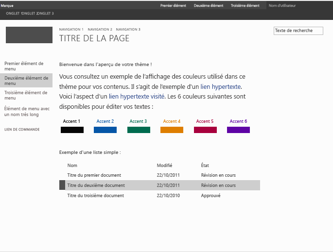

# Comment créer un fichier d'aperçu de page maître dans SharePoint 2013
Découvrez comment créer des fichiers d'aperçu de page maître utilisés dans les thèmes SharePoint pour afficher un aperçu des composants du thème sélectionné.
L'Assistant **Modifier l'apparence** est le point d'entrée vers les thèmes SharePoint. La bibliothèque de présentations est la première page de l'Assistant **Modifier l'apparence** et présente une vue miniatures des conceptions disponibles. Les utilisateurs sélectionnent une conception pour leur site, puis passent à la page suivante dans laquelle ils peuvent personnaliser la conception. Les utilisateurs peuvent ensuite afficher le site avant d'appliquer la conception à celui-ci. Le fichier d'aperçu de page maître est utilisé pour générer les images miniatures et d'aperçu. Si une page maître ne dispose pas de fichier d'aperçu correspondant, elle ne peut pas être utilisée dans l'expérience de thème.
  
    
    

Pour plus d'informations, voir  [Vue d'ensemble des thèmes pour SharePoint 2013](themes-overview-for-sharepoint-2013.md).
## Concepts de base à connaître pour utiliser des fichiers d'aperçu de page maître
<a name="Introduction"> </a>

Le tableau 1 répertorie les articles qui peuvent vous aider à comprendre les concepts de base pour utiliser des fichiers d'aperçu de page maître.
  
    
    

**Tableau 1. Concepts de base pour utiliser des fichiers d'aperçu de page maître**


|**Titre de l'article**|**Description**|
|:-----|:-----|
| [Vue d'ensemble des thèmes pour SharePoint 2013](themes-overview-for-sharepoint-2013.md) <br/> |Apprenez à utiliser des thèmes dans SharePoint 2013.  <br/> |
| [Choisir un thème pour votre site de publication](http://office.microsoft.com/fr-fr/office365-sharepoint-online-enterprise-help/choose-a-theme-for-your-publishing-site-HA102891580.aspx) <br/> |Découvrez comment modifier l'apparence et l'ambiance d'un site SharePoint à l'aide de l'Assistant **Modifier l'apparence**.  <br/> |
   

## Qu'est-ce qu'un fichier d'aperçu de page maître ?
<a name="section1"> </a>

Les fichiers d'aperçu de page maître (fichiers avec l'extension .preview) sont des fichiers avec un format spécial qui disposent de sections de palette de couleurs par défaut, de jeu de polices par défaut et de code HTML tokenisé. Le fichier d'aperçu de page maître doit utiliser le même nom (sans l'extension) que la page maître correspondante. Par exemple, si vous disposez d'une page maître nommée article.master, le fichier d'aperçu de page maître correspondant porte le nom article.preview. Les pages maîtres et les aperçus de page maître sont stockés dans la galerie de pages maîtres.
  
    
    
Un fichier d'aperçu de page maître est structuré de la manière suivante :
  
    
    


```HTML
Default color palette
[SECTION]
Default font scheme
[SECTION]
CSS
[SECTION]
HTML
```

Dans le fichier d'aperçu de page maître :
  
    
    

- L'élément  _Palette de couleur par défaut_ est le fichier .spcolor contenu dans la galerie de thèmes (http:// _SiteColltionName_/_catalogs/theme/15/) que vous souhaitez utiliser en tant que fichier par défaut. La palette de couleur par défaut correspond aux couleurs utilisées pour la page maître dans son état par défaut, c'est-à-dire avant que l'utilisateur sélectionne une palette de couleurs dans l'Assistant **Modifier l'apparence**.
    
  
- L'élément  _Jeu de polices par défaut_ est le fichier .spfont dans la galerie de thèmes (http:// _SiteCollectionName_/_catalogs/theme/15/) que vous souhaitez utiliser par défaut. Le jeu de polices par défaut correspond aux polices utilisées pour la page maître dans son état par défaut, c'est-à-dire avant que l'utilisateur sélectionne un jeu de polices dans l'Assistant **Modifier l'apparence**.
    
  
- L'élément  _CSS_ est la section qui contient les feuilles de style en cascade (CSS). Toutes les classes CSS doivent être précédées de l'élément[ID]. L'exemple suivant montre une partie de la section CSS dans un fichier d'aperçu de page maître.
    
  ```
  
[ID] #dgp-pageContainer
{
    background-color: [T_THEME_COLOR_PAGEBACKGROUND];
    color: [T_THEME_COLOR_BODYTEXT];
    width: 100%;
    height:100%;     
    background-image: url('[T_IMAGE]');       
    background-size: cover;
    font-family: [T_BODY_FONT];   
}
  ```

- L'élément  _HTML_ est la section de code HTML qui définit la structure HTML de l'aperçu.
    
  

> **REMARQUE**
> Toutes les valeurs de dimension doivent être spécifiées en tant qu'unités relatives dans le fichier d'aperçu de page maître. Par exemple, les valeurs de dimension peuvent être indiquées sous forme de pourcentage ou de cadratin. Pour plus d'informations sur les cadratins, reportez-vous à la section  [5.1.1. relative aux unités de mesure em, ex, ch et rem](http://www.w3.org/TR/2012/WD-css3-values-20120308/#font-relative-lengths) dans le projet de module de niveau 3 sur les unités et valeurs CSS W3C.
  
    
    

Les jetons sont utilisés dans l'ensemble du fichier d'aperçu de page maître. Il s'agit de valeurs de chaîne qui seront remplacées par du texte, des valeurs de couleur ou des valeurs de police dans l'aperçu généré. Les sections suivantes décrivent les jetons disponibles et la façon dont ils sont utilisés.
  
    
    

### Jetons divers

Les jetons divers sont remplacés dans l'aperçu par des valeurs de hauteur et de largeur spécifiées.
  
    
    

**Tableau 2. Jetons divers**


|**Nom du jeton**|**Description**|
|:-----|:-----|
|[T_HEIGHT]  <br/> |Hauteur de l'aperçu.  <br/> |
|[T_WIDTH]  <br/> |Largeur de l'aperçu.  <br/> |
|[T_IMAGE]  <br/> |URL d'une image d'arrière-plan facultative.  <br/> |
|[T_IMGHEIGHT]  <br/> |Hauteur de l'image, si nécessaire.  <br/> |
|[T_IMGWIDTH]  <br/> |Largeur de l'image, si nécessaire.  <br/> |
   

### Jetons de couleur

Les jetons de couleur sont remplacés par des valeurs de couleur dans l'image d'aperçu. Le tableau 3 décrit deux formats de jetons de couleur. Remplacez l'élément  _ColorSlot_ par le nom d'annotation de l'emplacement de couleur. Les jetons de couleur doivent être en majuscules (par exemple, [T_THEME_COLOR_PAGEBACKGROUND]). Pour consulter la liste des jetons de couleur disponibles, voir [Mappage des emplacements de couleur](color-palettes-and-fonts-in-sharepoint-2013.md#colorSlots) dans [Palettes de couleurs et polices dans SharePoint 2013](color-palettes-and-fonts-in-sharepoint-2013.md).
  
    
    

**Tableau 3. Jetons de couleur**


|**Nom du jeton**|**Description**|
|:-----|:-----|
|[T_THEME_COLOR_ _ColorSlot_]  <br/> |Utilisez ce format si vous souhaitez utiliser la valeur de couleur de l'emplacement de couleur.  <br/> |
|[T_THEME_COLOR_ _ColorSlot__AA]  <br/> |Utilisez ce format si vous souhaitez utiliser la valeur hexadécimale à 8 chiffres de l'emplacement de couleur. Ce format est utile pour que les valeurs de filtre activent l'opacité et les dégradés dans Internet Explorer.  <br/> |
   

### Jetons de police

Les jetons de police sont remplacés par des valeurs de police dans l'image d'aperçu.
  
    
    

- [T_ _SlotName__FONT]
    
  
Remplacez l'élément  _SlotName_ par le nom d'emplacement de police. Les jetons de police doivent être en majuscules (par exemple, [T_BODY_FONT]). Pour obtenir la liste des emplacements de police et connaître les endroits où ils sont utilisés dans une page, voir [Emplacements de police](color-palettes-and-fonts-in-sharepoint-2013.md#fontSlot) dans [Palettes de couleurs et polices dans SharePoint 2013](color-palettes-and-fonts-in-sharepoint-2013.md).
  
    
    

### Jetons de contenu de texte

Les jetons répertoriés dans le tableau 4 sont utilisés dans la section HTML du fichier d'aperçu de page maître. Ils sont remplacés par des exemples de texte dans l'image d'aperçu dans la bibliothèque de présentations. L'exemple de texte apparaît dans la même langue que le reste du site.
  
    
    

**Tableau 4. Jetons de contenu de texte**


|**Nom du jeton**|**Description**|
|:-----|:-----|
|[BRANDSTRING]  <br/> |Texte de marque qui apparaît sur la page. Dans les thèmes préinstallés, il apparaît dans le coin supérieur gauche : « Marque ».  <br/> |
|[SUITELINK1]  <br/> [SUITELINK2]  <br/> [SUITELINK3]  <br/> |Liens de suite qui apparaissent dans la barre de suite. Voir les éléments « Premier élément », « Deuxième élément » et « Troisième élément » dans la figure 1.  <br/> |
|[WELCOME]  <br/> |Texte du nom d'utilisateur. Voir l'élément « Nom d'utilisateur » dans la figure 1.  <br/> |
|[RIBBONTAB1]  <br/> [RIBBONTAB2]  <br/> [RIBBONTAB3]  <br/> |Noms des onglets du ruban. Voir les éléments « ONGLET 1 », « ONGLET 2 » et « ONGLET 3 » dans la figure 1.  <br/> |
|[SEARCHBOX]  <br/> |Texte dans la zone de recherche. Voir l'élément « Texte de recherche » dans la figure 1.  <br/> |
|[TN1]  <br/> [TN2]  <br/> [TN3]  <br/> |Éléments de navigation horizontale : « NAVIGATION 1 », « NAVIGATION 2 » et « NAVIGATION 3 ».  <br/> |
|[TITLE]  <br/> |Titre de la page : « TITRE DE LA PAGE ».  <br/> |
|[QL1]  <br/> [QL2]  <br/> [QL3]  <br/> [QL4]  <br/> |Éléments de navigation verticale : « Premier élément de menu », « Deuxième élément de menu » et « Troisième élément de menu ».  <br/> |
|[QLADD]  <br/> |Lien en-dessous des éléments de navigation verticale. Voir l'élément « LIEN DE COMMANDE » dans la figure 1.  <br/> |
|[CA TABLE HEADER]  <br/> |Titre au-dessus du texte de la page. Dans la figure 1, il s'agit de l'élément « Bienvenue dans l'aperçu de votre thème ! ».  <br/> |
|[CA TABLE DESCRIPTION]  <br/> |Texte de description. Dans la figure 1, il s'agit de l'élément « Vous avez devant vous un exemple de la façon dont les couleurs seront utilisées dans ce thème pour votre contenu. ».  <br/> |
|[CA ACCENT COLORS]  <br/> |Liste des couleurs et blocs de thème.  <br/> |
|[CA LIST TITLE]  <br/> |Titre de la liste. Dans la figure 1, il s'agit de l'élément « Exemple d'une liste simple ».  <br/> |
|[CA TABLE]  <br/> |Exemple de liste.  <br/> |
|[SITETITLE]  <br/> |Titre du site. Voir l'élément « Titre du site » dans la figure 1.  <br/> |
   

**Figure 1. Thème préinstallé avec un exemple de texte**

  
    
    

  
    
    

  
    
    

  
    
    

  
    
    

## Création d'un fichier d'aperçu de page maître
<a name="section2"> </a>

Pour créer un fichier d'aperçu de page maître, utilisez un aperçu de page maître existant comme point de départ.
  
    
    

### Création d'un aperçu de page maître


1. Faites une copie d'un aperçu de page maître. SharePoint 2013 inclut les éléments oslo.preview et seattle.preview.
    
  
2. Renommez la copie de l'aperçu de page maître afin qu'elle porte le même nom que la page maître correspondante. Par exemple, si votre page maître s'appelle article.master, renommez l'aperçu de page maître article.preview.
    
  
3. Utilisez un éditeur HTML pour modifier le fichier d'aperçu de page maître. Mettez à jour le fichier pour qu'il reflète la disposition et l'apparence de votre page maître.
    
    > **CONSEIL**
      > Les valeurs de dimension sont spécifiées sous forme de pourcentages dans le fichier d'aperçu de page maître. L'exemple suivant présente une méthode de conversion d'une mesure absolue (pixels) en une mesure relative (pourcentage). Supposons que vous disposez d'une taille de navigateur de 1 024 x 768. Si la page maître a un élément de hauteur de 32 pixels et que l'élément parent est le corps de la page, vous obtenez le pourcentage en divisant l'élément de hauteur par la hauteur du navigateur. La mesure relative est donc 4 % (32/768). 
4. Téléchargez le fichier d'aperçu de page maître dans la galerie de pages maîtres.
    
  
5. Utilisez l'Assistant **Modifier l'apparence** pour tester l'aperçu de page maître avec le contenu de votre site.
    
    > **REMARQUE**
      > Vous pouvez également créer une conception qui utilise la nouvelle page maître en ajoutant un élément à la liste de présentations composées. La conception sera disponible dans la bibliothèque de présentations (première page de l'Assistant **Modifier l'apparence**). Pour plus d'informations, consultez la procédure  [Déployer un thème à l'aide de l'interface utilisateur](how-to-deploy-a-custom-theme-in-sharepoint-2013.md#section2) de l'article [Procédure : Déployer un thème personnalisé dans SharePoint 2013](how-to-deploy-a-custom-theme-in-sharepoint-2013.md). 
6. Répétez les étapes 3 à 5, le cas échéant.
    
  

## Ressources supplémentaires
<a name="bk_addresources"> </a>


-  [Développer la conception de site dans SharePoint 2013](develop-the-site-design-in-sharepoint-2013.md)
    
  
-  [Procédure : Déployer un thème personnalisé dans SharePoint 2013](how-to-deploy-a-custom-theme-in-sharepoint-2013.md)
    
  
-  [Palettes de couleurs et polices dans SharePoint 2013](color-palettes-and-fonts-in-sharepoint-2013.md)
    
  
-  [Blog de l'équipe SharePoint : Affichez votre style avec les thèmes SharePoint](http://blogs.office.com/b/sharepoint/archive/2012/10/29/show-off-your-style-with-sharepoint-theming.aspx)
    
  

