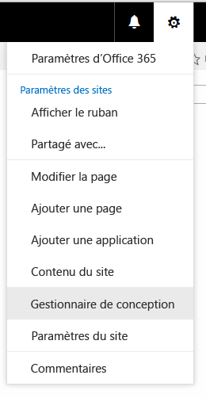

# Procédure : Créer une mise en page dans SharePoint 2013
Lorsque vous utilisez le gestionnaire de conception pour créer une mise en page, deux fichiers sont créés : un fichier .aspx qu'utilise SharePoint et une version HTML de cette mise en page que vous pouvez modifier dans votre éditeur HTML. Le fichier HTML et la mise en page sont associés, de sorte que chaque fois que vous modifiez et enregistrez le fichier HTML, les modifications sont synchronisées avec la mise en page associée.
## Introduction aux mises en page
<a name="Introduction"> </a>

Lorsque vous utilisez le gestionnaire de conception pour créer une mise en page, deux fichiers sont créés : un fichier .aspx qu'utilise SharePoint et une version HTML de cette mise en page que vous pouvez modifier dans votre éditeur HTML. Le fichier HTML et la mise en page sont associés, de sorte que chaque fois que vous modifiez et enregistrez le fichier HTML, les modifications sont synchronisées avec la mise en page associée.
  
    
    
Lorsque vous créez une page maître, vous téléchargez et convertissez un fichier HTML directement en page maître. Cependant, contrairement aux pages maîtres, vous ne convertissez pas directement un fichier HTML en mise en page. Ceci est dû au fait que le but principal d'une mise en page est de contenir des champs de page, et ces champs de page doivent être ajoutés lorsque la mise en page est créée dans le gestionnaire de conception.
  
    
    
Lorsque vous créez une mise en page :
  
    
    

- Un fichier .aspx et un fichier HTML portant le même nom sont créés dans la galerie de pages maîtres.
    
  
- Tout balisage requis par SharePoint est ajouté au fichier .aspx de sorte que la mise en page s'affiche correctement.
    
  
- Tout autre balisage, tel que les commentaires, les balises **<div>**, les extraits de code et les espaces réservés de contenu, est ajouté au fichier HTML.
    
  
- Des champs de page propres au type de contenu sont ajoutés automatiquement à la mise en page. D'autres champs de page sont disponibles pour être ajoutés à partir du ruban dans la galerie d'extraits de code.
    
  
- Le fichier HTML et le fichier .aspx sont associés, de sorte que toutes les modifications ultérieures effectuées dans le fichier HTML sont synchronisées avec le fichier .aspx lorsque le fichier HTML est enregistré. Tout autre balisage, tel que les commentaires, les balises **<div>**, les extraits de code et les espaces réservés de contenu, est ajouté au fichier HTML.
    
  

> **REMARQUE**
> La synchronisation va dans une seule direction. Les modifications apportées à la mise en page HTML sont synchronisées avec le fichier .aspx associé, mais si vous choisissez de modifier le fichier .aspx directement, ces modifications ne sont pas synchronisées avec le fichier HTML. Chaque mise en page HTML (et chaque page maître HTML) possède une propriété nommée **Fichier associé** qui est définie sur **True** par défaut, ce qui crée l'association et la synchronisation entre les fichiers.
  
    
    

Par exemple, si vous disposez de deux fichiers associés (HTML et .aspx) et que vous modifiez le fichier .aspx sans briser l'association, les modifications apportées au fichier .aspx sont enregistrées, mais vous ne pouvez pas archiver ou publier le fichier .aspx. Ces modifications ne sont donc pas enregistrées efficacement. Toutes les modifications apportées au fichier HTML remplacent le fichier .aspx. Si vous archivez ou publiez le fichier HTML, les modifications apportées à ce dernier remplacent toutes les modifications apportées au fichier .aspx. Les modifications apportées au fichier .aspx sont perdues.
  
    
    
Si vous êtes un développeur à l'aise avec ASP.NET, vous pouvez décider de ne travailler qu'avec le fichier .aspx en brisant l'association entre les fichiers. Pour briser l'association entre le fichier HTML et le fichier .aspx, dans le gestionnaire de conception, sélectionnez **Modifier les propriétés** pour le fichier HTML, puis décochez la case **Fichier associé**. Vous pourrez réassocier les fichiers ultérieurement en modifiant les propriétés et en cochant cette case ; dans ce cas, les modifications enregistrées dans le fichier HTML remplaceront de nouveau le fichier .aspx.
  
    
    

## Présentation de la relation entre champs de page et type de contenu
<a name="UnderstandingPageFields"> </a>

Chaque mise en page est associée à un type de contenu, généralement l'un des types de contenu du groupe Mise en page, par exemple, le type de contenu de page d'article qui est associé à la mise en page de page d'article, tous deux inclus dans un site de publication.
  
    
    
Un type de contenu est constitué de colonnes de site, qui définissent ensemble un schéma des types de données autorisés. Vous pouvez voir que les colonnes de site sont propres au type de contenu actuel car la colonne Source est vide. Cela signifie que ces colonnes de site sont définies par le type de contenu actuel et ne sont pas héritées d'un type de contenu parent.
  
    
    
Pour toute mise en page donnée, les colonnes de site qui composent le type de contenu correspondent directement aux champs de page disponibles pour cette mise en page. Le premier groupe de champs de page sur le ruban est constitué de champs qui sont automatiquement ajoutés à la mise en page lors de sa création. SharePoint ajoute automatiquement ces champs car ils sont propres à ce type de contenu, et il est donc probable qu'ils aient été spécifiquement créés pour être utilisés par la mise en page, au lieu de constituer des métadonnées SharePoint générales.
  
    
    
Avant de créer une mise en page dans le gestionnaire de conception, vous devrez peut-être créer un type de contenu qui définit les champs de la page que vous souhaitez pour cette mise en page.
  
    
    

## Présentation de la relation entre les espaces réservés de contenu sur une mise en page et une page maître
<a name="UnderstandingContentPlaceholders"> </a>

Une mise en page et une page maître doivent avoir le même ensemble d'espaces réservés de contenu pour que la mise en page s'affiche correctement. Ce n'est pas un problème si vous utilisez le gestionnaire de conception pour créer des pages maîtres et des mises en page, car l'ensemble correct d'espaces réservés de contenu est ajouté à chaque fichier lors de sa création. Cela garantit que chaque mise en page fonctionne sur tous les canaux qui utilisent une page maître différente. Vous n'êtes pas obligé de connaître ou de travailler avec la plupart de ces espaces réservés de contenu. Ils existent dans la mesure où ils sont requis par SharePoint pour afficher la page correctement.
  
    
    
Néanmoins, si vous modifiez une mise en page HTML et ajoutez manuellement un espace réservé de contenu, vous devez ajouter ce même espace réservé de contenu à chaque page maître qui a besoin de travailler avec cette mise en page. Ce n'est pas un scénario commun.
  
    
    
Si vous utilisez le gestionnaire de conception pour créer des mises en page et des pages maîtres, le scénario le plus courant consiste à travailler uniquement avec les espaces réservés de contenu suivants :
  
    
    

- **PlaceHolderMain** La page maître contient un espace réservé de contenu avec `ID="PlaceholderMain"`, contenant la balise **DefaultContentBlock** **<div>** avec la zone jaune qui affiche **Cette zone sera renseignée par le contenu que vous créez dans vos mises en page**. Vous ne devez pas placer n'importe quel contenu à l'intérieur de cet espace réservé sur la page maître. La mise en page contient un espace réservé de contenu avec le même ID. Vous devez insérer le balisage uniquement dans cet espace réservé, mais pas en dehors de l'espace réservé sur une mise en page. Les ID pour les deux espaces réservés ( **PlaceholderMain**) doivent correspondre.
    
  
- **PlaceHolderAdditionalPageHead** Lorsque vous travaillez avec une mise en page, vous n'insérez généralement pas d'éléments dans la balise **<head>** de la mise en page. Vous ajoutez plutôt des éléments à l'espace réservé de contenu avec `id="PlaceHolderAdditionalPageHead"`. Lorsqu'une page de contenu s'affiche dans le navigateur, cet en-tête de page supplémentaire est fusionné à la fin de l'en-tête de la page maître. 
    
  

## Création d'une mise en page
<a name="CreatePageLayout"> </a>

Avant de commencer, vous devez savoir à quel type de contenu et à quelle page maître la mise en page sera associée.
  
    
    

### Pour créer une mise en page


1. Accédez à votre site de publication.
    
  
2. Dans le coin supérieur droit de la page, sélectionnez l'icône représentant un engrenage, puis **Gestionnaire de conception**.
    
   **Menu de l'icône d'engrenage**

  


  

  

  
3. Dans le gestionnaire de conception, dans le volet de navigation de gauche, sélectionnez **Modifier les mises en page**.
    
  
4. Sélectionnez **Créer une mise en page**.
    
  
5. Dans la boîte de dialogue **Créer une mise en page**, saisissez un nom pour votre mise en page.
    
  
6. Sélectionnez une page maître.
    
    La page maître que vous sélectionnez ici sera affichée dans l'aperçu de cette mise en page. Cette page maître détermine également les espaces réservés de contenu ajoutés à la mise en page.
    
    > **REMARQUE**
      > Après avoir sélectionné cette page maître, vous ne pouvez pas prévisualiser la mise en page avec une autre page maître, même après avoir appliqué une autre page maître au site en direct. 
7. Sélectionnez un type de contenu. Le type de contenu pour cette mise en page détermine les champs de page disponibles pour cette mise en page dans la galerie d'extraits de code.
    
  
8. Sélectionnez **OK**.
    
    À ce stade, SharePoint crée un fichier HTML et un fichier .aspx avec le même nom.
    
    Dans le gestionnaire de conception, votre fichier HTML s'affiche maintenant avec une colonne d'état indiquant l'un des deux états possibles :
    
  - **Avertissements et erreurs**
    
  
  - **La conversion a réussi**
    
  
9. Cliquez sur le lien situé dans la colonne d'état pour prévisualiser le fichier et visualiser les erreurs ou avertissements relatifs à la page maître.
    
    La page de prévisualisation est un aperçu côté serveur en direct de votre mise en page. La partie supérieure de la prévisualisation affiche les avertissements ou erreurs que vous pourriez avoir à résoudre en modifiant le fichier HTML dans un éditeur HTML. Les erreurs doivent être corrigées pour que la prévisualisation puisse afficher la mise en page correctement.
    
    Pour plus d'informations sur la résolution des erreurs et des avertissements, voir  [Procédure : résoudre les erreurs et avertissements lors de l'aperçu d'une page en SharePoint 2013](how-to-resolve-errors-and-warnings-when-previewing-a-page-in-sharepoint-2013.md).
    
    Pour plus d'informations sur la prévisualisation de la mise en page, voir  [Comment modifier la page d'aperçu dans le Gestionnaire de conception SharePoint 2013](how-to-change-the-preview-page-in-sharepoint-2013-design-manager.md).
    
    L'aperçu de la page contient également un lien **Extraits de code** dans le coin supérieur droit. Ce lien ouvre la galerie d'extraits de code, où vous pouvez initier le remplacement de contrôles de maquette dans votre conception par des contrôles dynamiques SharePoint. Pour plus d'informations, voir [Extraits de code du Gestionnaire de conception SharePoint 2013](sharepoint-2013-design-manager-snippets.md).
    
  
10. Pour corriger les erreurs, modifiez le fichier HTML qui réside directement sur le serveur à l'aide d'un éditeur HTML afin d'ouvrir et de modifier le fichier HTML dans le lecteur mappé. Chaque fois que vous enregistrez le fichier HTML, toutes les modifications sont synchronisées sur le fichier .aspx associé.
    
  
11. L'aperçu de la mise en page affiche les champs de page qui ont été ajoutés automatiquement à la mise en page. Ces champs de page sont des colonnes de site propres au type de contenu en cours. Maintenant, vous êtes prêt à appliquer un style à la mise en page en fonction de vos maquettes HTML d'origine.
    
  

## Détermination de l'emplacement des styles pour une mise en page
<a name="WhereStyles"> </a>

Lorsque vous créez des maquettes HTML pour votre site, vous pouvez disposer de fichiers HTML qui représentent différentes catégories de pages, comme une page d'article ou une page de détails d'élément qui contient un composant WebPart pour afficher les détails d'un élément unique à partir d'un catalogue. Après avoir créé la mise en page qui représente cette catégorie de pages, vous êtes prêt à transférer les styles de votre maquette HTML vers la version HTML de votre mise en page.
  
    
    
Vous pouvez vous contenter de placer les styles d'une ou de plusieurs mises en page dans la même feuille de style liée à la page maître. Mais si vous désirez minimiser le poids de la feuille CSS chargée par page, vous pouvez également utiliser différentes feuilles de style pour diverses mises en page. Lorsque vous effectuez cette action, il est important de savoir que le lien vers une feuille de style ne peut pas être placé dans la balise **<head>** d'une mise en page. Au lieu de cela, le lien doit être placé dans l'espace réservé de contenu nommé **PlaceHolderAdditionalPageHead**. 
  
    
    

> **REMARQUE**
> Dans ce balisage, l'attribut  `ms-design-css-conversion="no"` exclut la feuille de style des thèmes. En outre, le lien vers la feuille de style doit apparaître après les lignes commentées **<!--SPM**. 
  
    
    


```HTML

<!--MS:<asp:ContentPlaceHolder id="PlaceHolderAdditionalPageHead" runat="server">-->
            <!--SPM:<%@Register Tagprefix="SharePoint" Namespace="Microsoft.SharePoint.WebControls" Assembly="Microsoft.SharePoint, Version=15.0.0.0, Culture=neutral, PublicKeyToken=71e9bce111e9429c"%>-->
            <!--SPM:<%@Register Tagprefix="Publishing" Namespace="Microsoft.SharePoint.Publishing.WebControls" Assembly="Microsoft.SharePoint.Publishing, Version=15.0.0.0, Culture=neutral, PublicKeyToken=71e9bce111e9429c"%>-->
<link href="MyPageLayout.css" rel="stylesheet" type="text/css" ms-design-css-conversion="no" />
        <!--ME:</asp:ContentPlaceHolder>-->

```

Lorsqu'un visiteur du site parcourt une page qui utilise cette mise en page, cet en-tête de page supplémentaire est fusionné à la fin de l'en-tête de la page maître. Ainsi, les styles de mise en page sont appliqués après les styles de la page maître.
  
    
    
De cette façon, chaque mise en page peut avoir sa propre feuille de style. Par exemple, vous pouvez avoir un élément **<div>** avec `id="xyz"` dans une mise en page qui apparaît à gauche, et à droite sur une autre mise en page.
  
    
    
Chaque mise en page peut également avoir au moins une feuille de style propre au canal d'appareil. Par exemple, vous voulez peut-être que votre mise en page pour téléphones soit différente de celle du bureau. Pour ce faire, vous pouvez inclure un ou plusieurs panneaux de canal d'appareil à l'intérieur de **PlaceHolderAdditionalPageHead**, où chaque panneau de canal comprend un lien vers une feuille de style avec des styles propres au canal. De cette façon, par exemple, un élément **<div>** avec `id="abc"` peut afficher un texte long dans un canal et un texte court dans un autre canal.
  
    
    
Les éléments suivants sont des scénarios communs relatifs à l'emplacement des liens de feuille de style pour les mises en page.
  
    
    

### Lier les styles à partir d'une page maître

Le scénario le plus simple consiste à inclure des styles pour une ou plusieurs mises en page dans la même feuille de style que celle à laquelle la page maître est liée. Sur la page maître, placez le lien vers le fichier .css juste avant la balise de fermeture **</head>**, de sorte qu'elle remplace les feuilles de style SharePoint par défaut, telles que corev15.css.
  
    
    

```HTML

<head>
…
<link rel="stylesheet" type="text/css" href="MyStyleSheet.css" />
</head>

```


### Lier les styles à partir d'une mise en page

Si vous souhaitez réduire le poids de la feuille CSS chargée avec chaque page, vous pouvez disposer de fichiers CSS distincts pour chaque mise en page. Dans ce scénario, les styles pour une mise en page se placent dans l'espace réservé de contenu nommé **PlaceHolderAdditionalPageHead**.
  
    
    

```HTML

<!--MS:<asp:ContentPlaceHolder id="PlaceHolderAdditionalPageHead" runat="server">-->
            <!--SPM:<%@Register Tagprefix="SharePoint" Namespace="Microsoft.SharePoint.WebControls" Assembly="Microsoft.SharePoint, Version=15.0.0.0, Culture=neutral, PublicKeyToken=71e9bce111e9429c"%>-->
            <!--SPM:<%@Register Tagprefix="Publishing" Namespace="Microsoft.SharePoint.Publishing.WebControls" Assembly="Microsoft.SharePoint.Publishing, Version=15.0.0.0, Culture=neutral, PublicKeyToken=71e9bce111e9429c"%>-->
<link href="MyPageLayout.css" rel="stylesheet" type="text/css" ms-design-css-conversion="no" />
        <!--ME:</asp:ContentPlaceHolder>-->

```


### Lier les styles dans la mise en page par canal d'appareil

Si vous disposez de différents canaux d'appareil, vous voudrez probablement que vos mises en page s'affichent différemment pour chaque canal. Dans ce scénario, vous intégrez un ou plusieurs panneaux de canal d'appareil dans **PlaceHolderAdditionalPageHead**, puis un lien vers les fichiers CSS propres au canal dans chaque panneau de canal.
  
    
    

```HTML

<!--MS:<asp:ContentPlaceHolder id="PlaceHolderAdditionalPageHead" runat="server">-->
<div data-name="DeviceChannelPanel">
    <!--CS: Start Device Channel Panel Snippet-->
    <!--SPM:<%@Register Tagprefix="Publishing" Namespace="Microsoft.SharePoint.Publishing.WebControls" Assembly="Microsoft.SharePoint.Publishing, Version=15.0.0.0, Culture=neutral, PublicKeyToken=71e9bce111e9429c"%>-->
    <!--MS:<Publishing:DeviceChannelPanel runat="server" IncludedChannels="Channel1">-->
…..
<link rel="stylesheet" type="text/css" href="MyStyleSheet.css" ms-design-css-conversion="no" />
    <!--ME:</Publishing:DeviceChannelPanel>-->
    <!--CE: End Device Channel Panel Snippet-->
</div><div data-name="DeviceChannelPanel">
    <!--CS: Start Device Channel Panel Snippet-->
    <!--SPM:<%@Register Tagprefix="Publishing" Namespace="Microsoft.SharePoint.Publishing.WebControls" Assembly="Microsoft.SharePoint.Publishing, Version=15.0.0.0, Culture=neutral, PublicKeyToken=71e9bce111e9429c"%>-->
    <!--MS:<Publishing:DeviceChannelPanel runat="server" IncludedChannels="Channel2">-->
…..
<link rel="stylesheet" type="text/css" href="CSS5.css" />
    <!--ME:</Publishing:DeviceChannelPanel>-->
    <!--CE: End Device Channel Panel Snippet-->
</div>

```


## Présentation du balisage dans la mise en page HTML
<a name="UnderstandMarkup"> </a>

Lorsque vous créez une mise en page, un fichier .aspx utilisé par SharePoint est créé et le balisage HTML est ajouté à la version HTML de la mise en page. Lorsque vous modifiez la mise en page HTML dans votre éditeur HTML, il peut être utile de comprendre le but de certaines de ces balises. La grande partie de ce balisage est semblable au balisage ajouté à une page maître HTML. Pour plus d'informations, voir  [Procédure : Convertir un fichier HTML en page maître dans SharePoint 2013](how-to-convert-an-html-file-into-a-master-page-in-sharepoint-2013.md).
  
    
    
Le balisage qui est propre aux mises en page est constitué de champs de page ajoutés à la mise en page selon le type de contenu auquel la mise en page est associée. Les champs de page apparaissent dans l'espace réservé de contenu avec  `id="PlaceHolderMain"`. Par exemple, le balisage suivant pour **PlaceHolderMain** contient deux champs de page qui représentent les champs **Title** et **Page Image** du type de contenu associé.
  
    
    


```HTML

<!--MS:<asp:ContentPlaceHolder ID="PlaceHolderMain" runat="server">-->
            <div>
                <!--CS: Start Page Field: Title Snippet-->
                <!--SPM:<%@Register Tagprefix="PageFieldTextField" Namespace="Microsoft.SharePoint.WebControls" Assembly="Microsoft.SharePoint, Version=15.0.0.0, Culture=neutral, PublicKeyToken=71e9bce111e9429c"%>-->
                <!--SPM:<%@Register Tagprefix="Publishing" Namespace="Microsoft.SharePoint.Publishing.WebControls" Assembly="Microsoft.SharePoint.Publishing, Version=15.0.0.0, Culture=neutral, PublicKeyToken=71e9bce111e9429c"%>-->
                <!--MS:<Publishing:EditModePanel runat="server" CssClass="edit-mode-panel">-->
                    <!--MS:<PageFieldTextField:TextField FieldName="fa564e0f-0c70-4ab9-b863-0177e6ddd247" runat="server">-->
                    <!--ME:</PageFieldTextField:TextField>-->
                <!--ME:</Publishing:EditModePanel>-->
                <!--CE: End Page Field: Title Snippet-->
            </div>
            <div>
                <!--CS: Start Page Field: Page Image Snippet-->
                <!--SPM:<%@Register Tagprefix="PageFieldRichImageField" Namespace="Microsoft.SharePoint.Publishing.WebControls" Assembly="Microsoft.SharePoint.Publishing, Version=15.0.0.0, Culture=neutral, PublicKeyToken=71e9bce111e9429c"%>-->
                <!--MS:<PageFieldRichImageField:RichImageField FieldName="3de94b06-4120-41a5-b907-88773e493458" runat="server">-->
                    <!--PS: Start of READ-ONLY PREVIEW (do not modify)--><div id="ctl02_label" style="display:none">Page Image</div><div id="ctl02__ControlWrapper_RichImageField" class="ms-rtestate-field" style="display:inline" aria-labelledby="ctl02_label"><div align="left" class="ms-formfieldcontainer"><div class="ms-formfieldlabelcontainer" nowrap="nowrap"><span class="ms-formfieldlabel" nowrap="nowrap">Page Image</span></div><div class="ms-formfieldvaluecontainer"><div class="ms-rtestate-field"></div></div></div></div><!--PE: End of READ-ONLY PREVIEW-->
                <!--ME:</PageFieldRichImageField:RichImageField>-->
                <!--CE: End Page Field: Page Image Snippet-->
            </div>
        <!--ME:</asp:ContentPlaceHolder>-->

```


## Ressources supplémentaires
<a name="AdditionalResources"> </a>


-  [Vue d'ensemble du gestionnaire de conception dans SharePoint 2013](overview-of-design-manager-in-sharepoint-2013.md)
    
  
-  [Procédure : Convertir un fichier HTML en page maître dans SharePoint 2013](how-to-convert-an-html-file-into-a-master-page-in-sharepoint-2013.md)
    
  
-  [Extraits de code du Gestionnaire de conception SharePoint 2013](sharepoint-2013-design-manager-snippets.md)
    
  

