# Procédure : Créer des formulaires de flux de travail SharePoint Server 2013 personnalisés avec Visual Studio 2012
Présente les formulaires de flux de travail dans SharePoint Server 2013. Cet article utilise SharePoint Server 2013 avec la mise à jour publique de mars 2013 et les outils de développement Office pour Visual Studio 2012. Tous les éléments de cet article s'appliquent aux déploiements locaux de SharePoint Server 2013, ainsi qu'à Office 365.
 **Fourni par :** [Andrew Connell](http://social.msdn.microsoft.com/profile/andrew%20connell%20%5bmvp%5d/),  [www.AndrewConnell.com](http://www.andrewconnell.com)
  
    
    

Depuis le lancement de Microsoft SharePoint 2007, la plateforme SharePoint prend en charge l'utilisation de flux de travail pour automatiser les processus d'entreprise. La plateforme de flux de travail SharePoint est basée sur Windows Workflow Foundation, qui fait partie de .NET Framework. Si Workflow Foundation fournit de nombreuses fonctionnalités pour la création de flux de travail personnalisés et la gestion automatisée des processus d'entreprise, SharePoint ajoute également l'intégration de l'utilisateur final. Cette intégration est implémentée en deux parties : 
- **Tâches** affectées aux utilisateurs et aux groupes qui peuvent être créées et surveillées par les flux de travail.
    
  
- **Formulaires** qui collectent les informations des utilisateurs lorsque les flux de travail sont associés à un type de contenu (par exemple, un site, une liste ou une bibliothèque) ou lors du démarrage d'un flux de travail.
    
  

## Formulaires de flux de travail dans SharePoint 2007 et SharePoint 2010
<a name="sec1"> </a>

L'implémentation de flux de travail dans SharePoint 2007 et SharePoint 2010 a fourni des améliorations constantes de version en version. Microsoft a en particulier ajouté de nouvelles fonctionnalités à SharePoint 2010, telles que la possibilité d'associer des flux de travail aux sites. Microsoft a également amélioré les outils de création de flux de travail, SharePoint Designer 2010 et Visual Studio 2010 par rapport aux versions précédentes. Cependant, dans SharePoint 2013, l'implémentation des tâches et des formulaires de flux de travail est restée majoritairement inchangée.
  
    
    
Avant SharePoint Server 2013, les développeurs disposaient de deux options pour créer des formulaires de flux de travail. Dans SharePoint 2007, les formulaires InfoPath et les formulaires web ASP.NET étaient recommandés. Chacune de ces méthodes présentait des avantages et des inconvénients. Dans SharePoint 2010, les développeurs ont été incités à utiliser les formulaires web ASP.NET, puisque ces formulaires étaient créés par les outils de développement SharePoint dans Visual Studio 2010 à l'aide des modèles d'élément de projet de formulaire de flux de travail d'association et d'initiation, mais l'implémentation était très semblable à celle utilisée dans SharePoint 2007.
  
    
    

## Modifications apportées aux formulaires de flux de travail dans SharePoint 2013
<a name="sec2"> </a>

SharePoint Server 2013 a introduit une nouvelle plateforme et une nouvelle architecture de flux de travail qui reflètent certains changements fondamentaux dans la conception de SharePoint. Le principal changement porte sur le fait que les flux de travail dans SharePoint Server 2013 ne sont plus gérés et exécutés par le moteur d'exécution SharePoint. À la place, SharePoint Server 2013 utilise un nouveau composant nommé Workflow Manager, qui héberge l'exécution de Windows Workflow Foundation et les services requis par Workflow Foundation. Point important : Workflow Manager est exécuté en dehors de SharePoint. Lors de la publication d'un flux de travail ou du démarrage d'une nouvelle instance d'un flux de travail publié, SharePoint en informe Workflow Manager, qui traite à son tour les épisodes de flux de travail. Lorsque le flux de travail doit accéder à des informations dans SharePoint, telles que des propriétés d'élément de liste ou des propriétés utilisateur, il authentifie l'utilisateur avec le modèle d'autorisation OAuth et communique via les API REST qui ont été introduites dans la version SharePoint Server 2013.
  
    
    
L'orientation générale concernant les personnalisations sur la plateforme SharePoint a également été modifiée dans la version SharePoint Server 2013, bien que ces modifications aient réellement commencé dans SharePoint 2010 et solutions bac à sable. Dans SharePoint Server 2013, Microsoft a introduit des fonctionnalités qui ont déplacé les personnalisations de SharePoint Server vers le navigateur client ou vers d'autres ressources externes. Ces fonctionnalités comprennent le nouveau modèle d'application SharePoint, la prise en charge de l'attribution d'une identité aux applications, l'authentification à l'aide du modèle d'autorisation OAuth, ainsi que les améliorations du modèle CSOM (Client-side Server Object Model) et des API REST.
  
    
    
Quel est l'impact sur les formulaires de flux de travail ? Souvenez-vous que depuis SharePoint 2010, Microsoft incite les développeurs à utiliser les formulaires web ASP.NET lors de la création de formulaires dans les flux de travail créés à l'aide de Visual Studio. Bien sûr, cette approche nécessite que le code côté serveur traite le formulaire et la communication gérée entre ce dernier et le moteur de workflow. Cependant, dans SharePoint Server 2013, cela n'est possible que dans le développement de type solution (c'est-à-dire, le déploiement de packages *.wsp). Le nouveau modèle d'application SharePoint introduit dans SharePoint Server 2013 ne permet pas l'exécution du code côté serveur dans le processus SharePoint.
  
    
    
Pour remédier à cette limitation, Microsoft a étendu le modèle CSOM afin d'inclure une API permettant d'interagir avec le moteur de flux de travail. Pour connecter une batterie de serveurs SharePoint Server 2013 à la batterie de serveurs du Workflow Manager, vous devez installer le Workflow Manager Client sur les serveurs SharePoint. Ce composant est utilisé comme proxy par SharePoint pour communiquer avec la batterie de serveurs du Workflow Manager. L'API CSOM des services de flux de travail est en effet le composant côté client utilisé pour interagir avec le nouveau moteur de flux de travail. Pour plus d'informations sur le modèle CSOM des services de flux de travail SharePoint Server 2013, voir  [Travailler avec le modèle d'objet SharePoint 2013 Workflow Services Client côté](working-with-the-sharepoint-2013-workflow-services-client-side-object-model.md).
  
    
    
Quel est alors l'avantage pour les formulaires de flux de travail SharePoint ? Lors de la création de flux de travail SharePoint Server 2013 à l'aide de Visual Studio 2012, vous créez des formulaires de flux de travail à l'aide de formulaires web ASP.NET. Vous pouvez déployer ces formulaires en tant que solution SharePoint ou (et c'est la partie importante) dans . Cela vous donne accès à tous les contrôles du serveur déjà déployés sur le serveur, comme les contrôles web ASP.NET et d'autres contrôles SharePoint utiles (et quelquefois obligatoires). Vous pouvez également utiliser le nouveau modèle CSOM des services de flux de travail pour effectuer toutes les tâches nécessaires des formulaires d'association et d'initiation, y compris, mais sans s'y limiter, les tâches suivantes :
  
    
    

- Création d'historiques et de tâches de flux de travail
    
  
- Création d'une association de flux de travail sur un site, une liste ou une bibliothèque de documents
    
  
- Démarrage d'une nouvelle instance d'une association de flux de travail existante
    
  
Le modèle CSOM des services de flux de travail est très robuste et vous offre de nombreuses opportunités d'innovation dans les flux de travail, le tout à partir du navigateur ou d'un ordinateur distant.
  
    
    

## Formulaires de flux de travail disponibles dans SharePoint Server 2013
<a name="sec3"> </a>

Avant le lancement de SharePoint Server 2013, vous pouviez créer trois types de formulaires de flux de travail personnalisés : les formulaires d' **initiation**, d' **association** et de **modification de tâche**. Parmi ces trois types de formulaires, les derniers ont perdu de l'ampleur en tant que solution de formulaires personnalisés. Ce phénomène a démarré avec SharePoint 2010, car il manquait aux outils de développement SharePoint Visual Studio 2010 un élément de projet pour les formulaires de tâche, s'appuyant plutôt sur un affichage de liste standard et sur les formulaires de modification pour afficher les tâches.
  
    
    
SharePoint Server 2013 facilite l'utilisation des tâches de flux de travail, car vous pouvez créer des boutons de résultat personnalisés pour des scénarios spécifiques. Vous pouvez également personnaliser l'affichage et le comportement de colonnes spécifiques dans les éléments de tâche à l'aide du nouveau rendu côté client (CSR), qui a été introduit dans SharePoint Server 2013. Notez que le CSR utilise JavaScript exécuté dans le client. Ces sujets sont abordés dans l'article  [Utilisation des tâches dans les flux de travail SharePoint 2013 à l'aide de Visual Studio 2012](working-with-tasks-in-sharepoint-2013-workflows-using-visual-studio-2012.md). Vous pouvez également obtenir plus d'informations dans l'article  [Personnaliser le mode Liste dans les compléments pour SharePoint à l'aide du rendu côté client](http://msdn.microsoft.com/library/8d5cabb2-70d0-46a0-bfe0-9e21f8d67d86%28Office.15%29.aspx).
  
    
    

### Présentation des formulaires d'initiation de flux de travail

Un formulaire d'initiation est ouvert lorsqu'un utilisateur lance manuellement un flux de travail dont la définition est associée au formulaire. Lors du démarrage du flux de travail, l'utilisateur voit le formulaire d'initiation et est invité à saisir les informations nécessaires pour le flux de travail. Par exemple, l'utilisateur peut entrer une justification pour un flux de travail lançant une approbation pour une nouvelle dépense d'entreprise.
  
    
    
En ce qui concerne les formulaires d'initiation, il est important de savoir qu'ils apparaissent uniquement lors du démarrage manuel d'un flux de travail. Les flux de travail configurés pour démarrer automatiquement ne lancent pas le formulaire d'initiation au démarrage. Cette condition peut entraîner des complications pour les flux de travail qui attendent la transmission de données à partir du formulaire. N'oubliez pas que si les flux de travail sont configurés pour démarrer automatiquement et que le flux de travail exige des entrées utilisateur, vous devez utiliser un formulaire d'association, et non un formulaire d'initiation.
  
    
    

### Présentation des formulaires d'association de flux de travail

Les formulaires d'association apparaissent pour les administrateurs la première fois qu'ils décident d'ajouter, ou d'associer, un flux de travail à une liste ou une bibliothèque de documents en particulier. Vous pouvez utiliser les formulaires d'association pour permettre à un administrateur de spécifier les paramètres, les valeurs par défaut et autres informations pour le flux de travail tel qu'il s'applique aux éléments de la liste ou de la bibliothèque.
  
    
    
Ce formulaire d'association par défaut permet à l'administrateur de sélectionner la définition de flux de travail, de fournir le nom d'affichage de l'association, de spécifier les listes qui seront les conteneurs pour les tâches et les éléments d'historique créés par le flux de travail sélectionné dans l'association et de préciser les conditions de démarrage du flux de travail, comme manuellement ou automatiquement, lors de la création ou de la mise à jour des éléments de la liste ou de la bibliothèque.
  
    
    
Vous pouvez également créer des formulaires d'association personnalisés. Si vous avez un formulaire d'association personnalisé sur une définition de flux de travail, SharePoint redirige l'utilisateur vers le formulaire personnalisé une fois le formulaire par défaut rempli. Vous pouvez utiliser le formulaire personnalisé pour recueillir les informations de configuration dont le flux de travail peut avoir besoin, comme l'appel d'un service web externe qui exige que l'appelant s'authentifie avec une clé d'API unique ou la transmette pour bénéficier d'un accès. Il s'agit du type d'information que le développeur ne code pas en dur dans le flux de travail. Vous assistez à ce scénario si un flux de travail est inclus dans une application vendue via le SharePoint Store. Dans ce cas, chaque client a besoin de son propre compte avec le service distant. Il s'agit du type d'information que vous collectez auprès de l'utilisateur lors de la création de l'association de flux de travail.
  
    
    
Autre scénario courant : vous avez besoin de collecter des informations que l'initiateur du flux de travail soumet normalement pour les flux de travail qui démarrent automatiquement. Comme expliqué précédemment, les formulaires d'initiation apparaissent uniquement lorsque les flux de travail démarrent manuellement. Lorsque les flux de travail sont configurés pour démarrer automatiquement et si le flux de travail attend des données dans certains champs du formulaire, la solution privilégiée consiste à utiliser un formulaire d'association personnalisé. 
  
    
    
Ensuite, dans le formulaire d'initiation, ces valeurs par défaut sont présentes lors du démarrage manuel du flux de travail. Lorsqu'il démarre automatiquement, le flux de travail peut détecter qu'aucune donnée n'a été transmise à partir du formulaire d'initiation et revenir aux valeurs spécifiées dans le formulaire d'association.
  
    
    

## Procédure pas à pas : Création et déploiement d'un formulaire d'association personnalisé
<a name="sec4"> </a>

Dans cette procédure pas à pas, nous vous montrons comment créer un formulaire d'association personnalisé et l'utiliser pour collecter des informations qui sont ensuite transmises au flux de travail. Avant de commencer, assurez-vous que vous avez accès à un site de développeur SharePoint Server 2013.
  
    
    

### Création du formulaire d'association personnalisé


1. Créez un flux de travail personnalisé à l'aide de Visual Studio 2012. 
    
  
2. Dans Visual Studio, créez un projet d'application SharePoint Server 2013 et configurez-le en tant qu'application hébergée par SharePoint.
    
  
3. Ajoutez une nouvelle liste d' **annonces** au projet. Cette dernière sera associée au flux de travail et les événements de cette liste déclencheront le flux de travail.
    
  
4. Ajoutez un élément de flux de travail au projet en cliquant avec le bouton droit sur le projet dans **Explorateur de solutions**, puis en sélectionnant **Ajouter** et **Nouvel élément**. Dans la boîte de dialogue **Ajouter un nouvel élément**, sélectionnez l'élément de projet **Flux de travail** dans la catégorie **Office/SharePoint**. Entrez le nom « SampleWorkflow », puis cliquez sur **Suivant**. Lorsque l'Assistant Personnalisation de SharePoint vous y invite, définissez le nouvel élément en tant que **flux de travail de liste**.
    
  
5. La page suivante de l' **Assistant Personnalisation de SharePoint**, présentée dans la figure 1, vous permet de créer automatiquement une association de flux de travail. Cependant, si vous créez un formulaire d'association personnalisé, n'utilisez **pas** cette option. À la place, décochez cette case et cliquez sur **Terminer**.
    
   **Figure 1. Désélection de l'option permettant d'associer automatiquement le flux de travail**

  

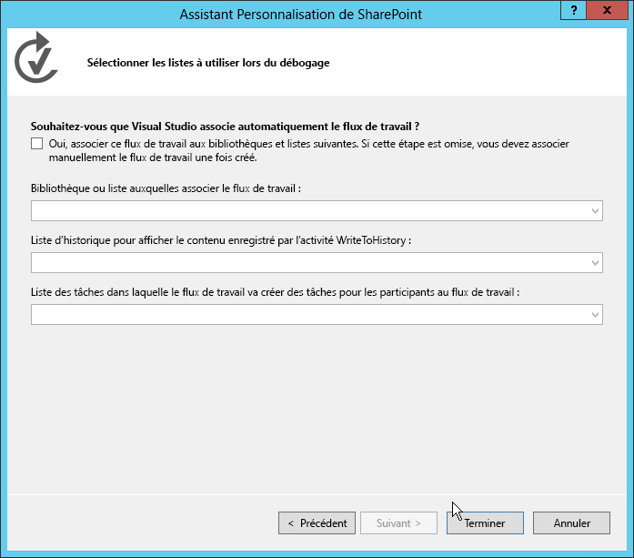
  

  

  
6. Ensuite, ajoutez le formulaire au projet Visual Studio en cliquant avec le bouton droit sur l'élément de flux de travail dans **Explorateur de solutions**, puis en sélectionnant **Ajouter** et **Nouvel élément**. 
    
    Cette dernière étape est importante, car elle indique à la boîte de dialogue **Ajouter un nouvel élément** que le contexte est un élément de flux de travail. La boîte de dialogue **Ajouter un nouvel élément** affiche alors les deux modèles d'élément de projet de formulaire (formulaires d'initiation et d'association) en tant qu'options, comme illustré dans la figure 2.
    

   **Figure 2. Sélection du modèle de formulaire d'association**

  

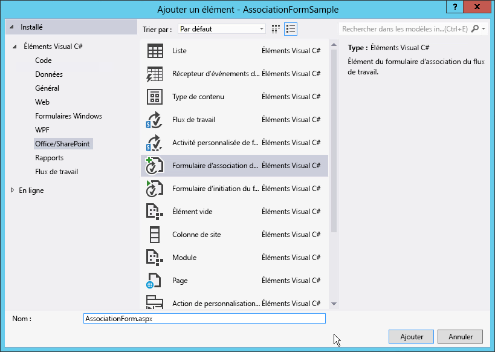
  

  

  
7. Sélectionnez l'élément **Formulaire d'association du flux de travail**, puis supprimez le « 1 » du nom de champ. Cliquez sur Ajouter pour terminer le processus.
    
  

### Mise à jour du langage HTML et de JavaScript dans le formulaire d'association par défaut

Une fois le nouveau formulaire ajouté au projet, Visual Studio l'ouvre automatiquement. À ce stade, il vous suffit d'effectuer deux opérations sur le formulaire pour le rendre compatible avec votre flux de travail :
  
    
    

- Mettez à jour le formulaire HTML pour refléter les éléments de données que vous devez collecter auprès de l'utilisateur et indiquez la façon dont le formulaire doit être affiché.
    
  
- Mettez à jour le langage JavaScript par défaut pour extraire les valeurs du formulaire mis à jour et mettez en correspondance les noms des propriétés avec les noms des arguments que vous avez créés dans le flux de travail.
    
  

1. Ouvrez le formulaire pour afficher le code.
    
  
2. Localisez le contrôle du serveur indiqué dans l'extrait de code suivant :
    
  ```
  
<WorkflowServices:WorkflowAssociationFormContextControl ID="WorkflowAssociationFormContextControl1" runat="server" />
  ```


    Ce contrôle du serveur effectue deux tâches importantes. Tout d'abord, il ajoute les bibliothèques JavaScript nécessaires pour le formulaire d'association. Ensuite, il prend les valeurs de formulaire soumises par le formulaire précédent et les écrit sur la page en tant que contrôles d'entrée HTML masqués. La page précédente est le formulaire d'association SharePoint par défaut, celui où l'utilisateur spécifie la définition de flux de travail, le nom de l'association, la tâche de flux de travail et l'historique, ainsi que les options de démarrage. Ce formulaire utilise une demande POST HTTP pour passer au formulaire d'association personnalisé ajouté au flux de travail. Étant donné qu'il s'agit d'une demande POST HTTP, les valeurs ne sont pas accessibles dans le formulaire, puisque toute logique personnalisée doit être implémentée sans code côté serveur. Par conséquent, SharePoint fournit ce contrôle du serveur pour extraire ces valeurs du pipeline de demandes HTTP et les ajouter à cette page.
    
  
3. Faites défiler le fichier source vers le bas jusqu'à ce que vous localisiez l'exemple de table HTML et remplacez-le par la table suivante :
    
  ```XML
  <table>
    <tr>
      <td colspan="2">
        String:<br /><textarea id="strInput" rows="1" columns="50"/>
      </td>
    </tr>
    <tr>
        <td><button id="Save" onclick="return runAssocWFTask()">Save</button></td>
        <td><button id="Cancel" onclick="location.href = cancelRedirectUrl; return false;">Cancel</button></td>
    </tr>
</table>

  ```


    Cette table affiche une zone de texte HTML simple utilisée pour transmettre des informations dans l'association de flux de travail. Notez que le formulaire comporte deux boutons. Ces boutons sont utilisés pour enregistrer ou annuler le flux de travail. Lorsque vous cliquez sur le bouton **Enregistrer**, le flux de travail appelle la fonction JavaScript **runAssocWfTask()** située quelques lignes plus bas dans le fichier source. C'est ce que nous allons modifier à la prochaine étape.
    
  

### Mise à jour du modèle JSOM des services de flux de travail pour créer l'association de flux de travail

Immédiatement après la section relative au formulaire HTML dans le fichier source, se trouve un bloc de code  _ecmascriptshort_ d'environ 200 lignes. Ce bloc de code illustre l'implémentation de la nouvelle API JSOM (JavaScript Client Side Object Model) des services de flux de travail dans SharePoint Server 2013. Ce code JavaScript doit en grande partie rester tel quel, car il effectue différentes opérations importantes :
  
    
    

- Détermine si une nouvelle liste de tâches de flux de travail associée doit être créée et, le cas échéant, la crée.
    
  
- Détermine si un nouvel historique de flux de travail associé doit être créé et, le cas échéant, le crée.
    
  
- Crée une nouvelle association de flux de travail avec le nom spécifié, la définition de flux de travail, les options de démarrage et les listes associées.
    
  
La partie essentielle dont vous devez vous soucier lors de la création de formulaires d'association personnalisés est celle où les valeurs du formulaire sont collectées et transmises à la nouvelle association. Nous abordons ce thème dans la procédure suivante.
  
    
    

1. Dans le bloc de script JSOM d'association de flux de travail, localisez la fonction JavaScript **associateWF()**.
    
  
2. Dans le bloc de script de cette fonction, localisez les lignes qui définissent un nouveau tableau nommé **metadata**:
  
    
    
 `var metadata = new Object();`
    
  
3. Ensuite, ajoutez une collection de paires nom-valeur représentant les champs de formulaire que vous voulez transmettre dans SharePoint. Pour le formulaire personnalisé de cette procédure pas à pas, tout ce dont vous avez besoin est le langage JavaScript suivant. Par conséquent, mettez à jour le bloc qui définit la variable **metadata** comme suit :
    
  ```XML
  
var strInputValue = document.getElementById("strInput").value;
if (strInputValue) {
  metadata['AssociationFormValue'] = strInputValue;
}
  ```

4. À ce stade, le formulaire d'association personnalisé est complet.
    
  

### Utilisation des valeurs de formulaire d'association dans le flux de travail

Une fois que le formulaire est complet, l'étape suivante consiste à configurer le flux de travail pour utiliser les valeurs transmises depuis le formulaire d'association. Lorsqu'une valeur est transmise à partir du formulaire d'association, elle est transmise en tant que valeur de configuration. Pour ce faire, utilisez une activité spéciale pour extraire la valeur de configuration des métadonnées d'association de flux de travail et stockez-la dans une variable pour utilisation ultérieure.
  
    
    

1. Ouvrez le flux de travail dans Visual Studio, accédez à l'onglet **Variables**, puis créez une variable de chaîne nommée **AssociationFormValue**, comme illustré dans la figure 3.
    
   **Figure 3. Création de la variable AssociationFormValue**

  

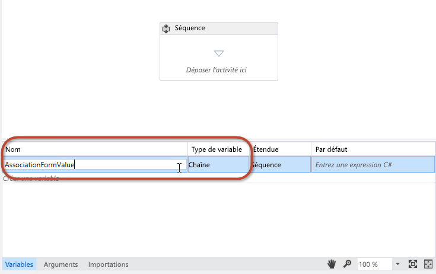
  

  

  
2. Faites glisser et déposez une activité **GetConfigurationValue** sur la surface du concepteur de flux de travail et définissez la propriété **Name** sur le nom de la propriété de métadonnées utilisée dans le formulaire, comme indiqué dans la figure 4.
    
   **Figure 4.**

  

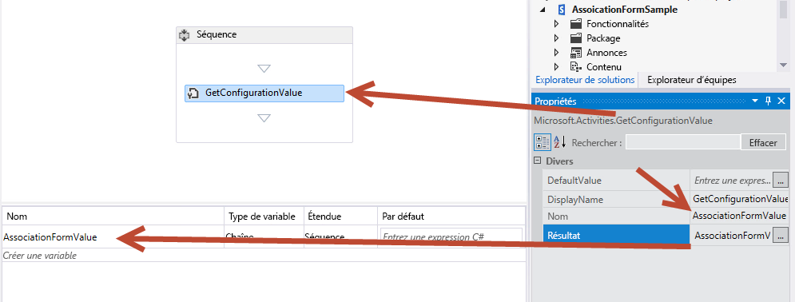
  

  

  
3. Définissez la propriété **Result** sur le nom de la variable, comme indiqué dans la figure 4.
    
    Cette activité extrait la valeur de la propriété **AssociationFormValue** des métadonnées du flux de travail et la stocke dans la variable locale. Pour voir le contenu de la variable, ajoutez une activité **WriteToHistory** au flux de travail et définissez sa propriété **Message** de manière à écrire la valeur de la variable dans l'historique.
    
  
4. Vous avez effectué les étapes nécessaires pour associer les valeurs de formulaire au flux de travail. Enregistrez votre travail et testez le formulaire.
    
  

### Test du formulaire d'association personnalisé


1. Pour tester le flux de travail, appuyez sur **F5** ou cliquez sur le bouton **Démarrer** dans Visual Studio. Cette procédure pas à pas suppose une installation locale sur site de SharePoint Server 2013, afin que Visual Studio lance l'utilitaire d'hôte de service de test du gestionnaire de workflow et déploie le flux de travail sur le site du développeur.
    
  
2. Créez l'association en accédant à la liste d' **annonces**, puis, sur le ruban, sélectionnez l'onglet **Liste** et cliquez sur **Paramètres du flux de travail**, bouton **Paramètres du flux de travail**, puis cliquez sur le lien **Ajouter un flux de travail**. À ce stade, le formulaire d'association SharePoint apparaît.
    
  
3. Dans le formulaire d'association, sélectionnez le flux de travail que vous souhaitez tester et nommez-le.
    
  
4. Choisissez de créer des listes de tâches et des historiques, définissez le démarrage manuel du flux de travail, puis cliquez sur **Suivant**.
    
  
5. Étant donné que vous avez spécifié un formulaire d'association personnalisé dans la définition de flux de travail, le formulaire d'association personnalisé illustré dans la figure 5 apparaît.
    
   **Figure 5. Formulaire d'association de flux de travail personnalisé**

  

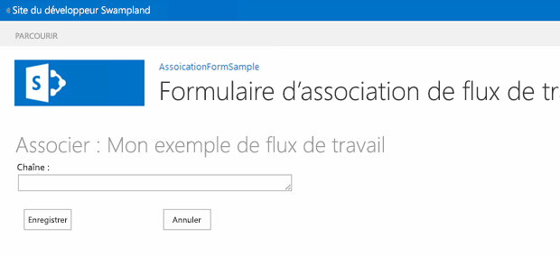
  

  

  
6. Entrez une valeur dans le champ de formulaire, puis cliquez sur **Enregistrer**. Cette action permet de créer l'association et stocke la valeur personnalisée dans les métadonnées pour l'association de flux de travail.
    
  
7. Pour vérifier que le flux de travail peut extraire la valeur des paramètres de configuration, revenez à la liste d' **annonces** et créez un élément. Après avoir créé l'élément, démarrez le flux de travail personnalisé manuellement. Une fois que le flux de travail a démarré, accédez à la page d'état d'instance de flux de travail de l'élément, et assurez-vous que la valeur a été écrite dans l'historique, comme indiqué dans la figure 6.
    
   **Figure 6. Page État du flux de travail**

  

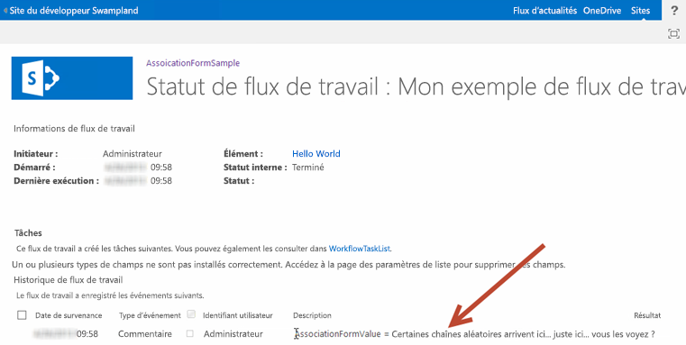
  

  

  

## Procédure pas à pas : Création d'un formulaire d'initiation personnalisé
<a name="sec4"> </a>

Cette procédure pas à pas illustre la création d'un formulaire d'association personnalisé et l'utilisation de ce formulaire pour collecter des informations auprès de l'utilisateur lors du démarrage manuel du flux de travail.
  
    
    

### Création d'un projet de flux de travail


1. Commencez par créer un flux de travail personnalisé à l'aide de Visual Studio 2012 en vous assurant que vous avez accès à un site de développeur SharePoint Server 2013.
    
  
2. Créez un projet SharePoint configuré en tant qu'application hébergée par SharePoint.
    
  
3. Ajoutez une nouvelle liste d' **annonces** au projet. Nous allons utiliser cette liste comme conteneur pour les éléments que nous utilisons pour déclencher le flux de travail.
    
  
4. Ensuite, ajoutez un élément de flux de travail au projet en cliquant avec le bouton droit sur l'icône du projet dans **Explorateur de solutions** et en sélectionnant **Ajouter**, **Nouvel élément**, puis, dans la boîte de dialogue **Ajouter un nouvel élément**, en sélectionnant l'élément de projet **Flux de travail**. 
    
  
5. Nommez le nouveau flux de travail « SampleInitFormWorkflow », puis cliquez sur **Suivant**.
    
  
6. Lorsque vous y êtes invité, définissez le nouvel élément de flux de travail en tant que **flux de travail de liste** associé à la liste d' **annonces** et définissez le flux de travail de sorte qu'il démarre manuellement. (Notez que le formulaire d'initiation ne sera pas affiché si le flux de travail démarre automatiquement.)
    
  
7. À ce stade, le projet apparaît dans **Explorateur de solutions**, comme indiqué dans la figure 7. Notez que certains éléments, comme **WorkflowHistoryList** et **WorkflowTaskList**, ont été ajoutés automatiquement lors de la création de l'association.
    
   **Figure 7. Apparence du projet dans Explorateur de solutions**

  

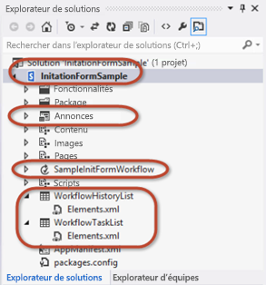
  

  

  

### Ajout d'arguments pour collecter les valeurs de formulaire d'initiation

Le formulaire d'initiation de flux de travail invite les utilisateurs à indiquer deux informations dont le flux de travail a besoin pour démarrer : une chaîne aléatoire, ainsi qu'un utilisateur sélectionné à l'aide du contrôle de sélecteur de personnes. Pour ce faire, vous devez configurer deux arguments dont l'API CSOM des services de flux de travail extraira les valeurs du formulaire lors de sa soumission.
  
    
    

1. Dans le concepteur de flux de travail, cliquez sur l'onglet **Arguments** au bas de l'écran et créez deux arguments, comme indiqué dans la figure 8. Nommez-les **UserLoginName** et **SomeRandomString**. 
    
   **Figure 8. Configuration des arguments du formulaire d'initiation**

  

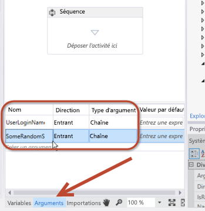
  

  

  
2. Pour les deux arguments, définissez le **type d'argument** sur **String** et la **direction** sur **In**, comme indiqué dans la figure 8.
    
    Vous pouvez considérer la propriété **Direction** comme une propriété sur une classe .NET. Lorsque la direction est définie sur **In**, la propriété dispose d'une méthode **Set** publique, mais d'une méthode **Get** privée. Lorsque la direction est définie sur **Out**, la propriété dispose d'une méthode **Get** publique, mais d'une méthode **Set** privée. Enfin, lorsque la direction est définie sur **In/Out**, les méthodes **Get** et **Set** sont publiques.
    
  
3. Pour afficher le contenu de ces deux arguments, ajoutez deux activités **WriteToHistory** au flux de travail et configurez chacune d'entre elles de sorte qu'elles écrivent le contenu des arguments dans l'historique.
    
    Vous pouvez utiliser ces arguments de la même manière que vous utilisez les variables, mais n'oubliez pas que lorsque vous configurez la **direction**, vous régissez leur capacité de lecture/écriture. La figure 9 montre ce à quoi pourrait ressembler l'une de ces activités une fois configurée :
    

   **Figure 9. Configuration d'une activité WriteToHistory pour tester les arguments**

  

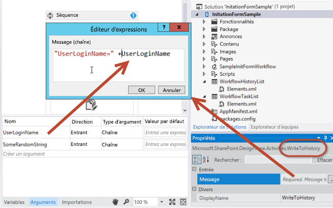
  

  

  

### Ajout de l'élément de projet de formulaire d'initiation

Une fois le flux de travail configuré de manière à accepter deux arguments d'entrée du formulaire, l'étape suivante consiste à ajouter le formulaire au projet.
  
    
    

1. Cliquez avec le bouton droit sur l'élément de flux de travail dans **Explorateur de solutions** et sélectionnez **Ajouter**, puis **Nouvel élément**.
    
  
2. Sélectionnez l'élément de projet **Formulaire d'initiation du flux de travail** et supprimez le chiffre « 1 » du nom, de sorte que le formulaire soit nommé « InitForm.aspx », puis cliquez sur **Ajouter**. Cela entraîne l'ajout par Visual Studio de la nouvelle page ASPX au module **Pages** déjà présent dans l'arborescence du projet. Cela permet de garantir que le formulaire sera approvisionné dans le sous-dossier **Pages** dans l'application. Visual Studio a également modifié les propriétés sur l'élément de flux de travail.
    
  
3. Sélectionnez l'élément de flux de travail **SimpleInitFormWorkflow** dans **Explorateur de solutions** et, dans la grille **Propriétés**, observez les propriétés qui ont été définies sur le formulaire d'initiation. L'une d'elles pointe vers le chemin d'accès relatif du site du formulaire que vous venez d'ajouter au module **Pages**.
    
  

### Vérification et mise à jour du formulaire d'initiation par défaut

Lorsque vous avez ajouté le nouveau formulaire d'initiation au projet, Visual Studio 2012 l'a ouvert automatiquement. Comme pour le formulaire d'association, deux tâches doivent être réalisées pour ce nouveau formulaire d'initiation :
  
    
    

- Mettez à jour le formulaire HTML pour spécifier les éléments de données qui doivent être collectés auprès de l'utilisateur, et spécifiez la présentation du formulaire.
    
  
- Mettez à jour le bloc JavaScript par défaut pour extraire les valeurs entrées par l'utilisateur du formulaire et faire correspondre les noms des propriétés avec les noms des arguments que nous avons créés dans le flux de travail.
    
  

> **REMARQUE**
> Dans le fichier source, notez que le premier espace réservé de contenu ASP.NET, **PlaceHolderAdditionalPageHead**, contient des références à la bibliothèque CSOM des services de flux de travail ( **sp.workflowservices.js** ) et aux bibliothèques CSOM SharePoint Server 2013 principales ( **sp.js** et **sp.runtime.js** ). Immédiatement après cette section de code, se trouve un commentaire côté serveur qui contient une note commentée. Sachez que cette note, présentée dans la figure 10, n'est pas pertinente et doit être ignorée.
  
    
    


**Figure 10. Commentaire de code à ignorer**

  
    
    

  
    
    
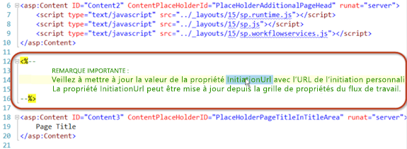
  
    
    

### Mise à jour du formulaire HTML


1. Faites défiler le fichier de code du formulaire vers le bas jusqu'à ce que vous atteigniez l'espace réservé de contenu ASP.NET nommé  `PlaceHolderMain`. La première partie de cette section contient une table HTML qui contient elle-même trois champs de formulaire. Nous n'en avons besoin que de deux.
    
  
2. Mettez à jour cette table HTML en la remplaçant par la suivante :
    
  ```
  
<table>
  <tr>
    <td>
      String:<br />
      <input type="text" id="strInput" />
    </td>
  </tr>
  <tr>
    <td>
      User Picker:<br />
      <SharePoint:PeopleEditor AllowEmpty="false" ValidatorEnabled="true" MultiSelect="false" ID="peoplePicker" runat="server" />
    </td>
  </tr>
  <tr>
    <td>
      <input type="button" name="startWorkflowButton" value="Start" onclick="StartWorkflow()" />
      <input type="button" name="cancelButton" value="Cancel" onclick="RedirFromInitForm()" />
      <br />
    </td>
  </tr>
</table>

  ```

La table contient maintenant deux contrôles d'entrée. Le premier est une zone de texte HTML standard dont l'ID est **strInput**. Le second est un contrôle de sélecteur de personnes SharePoint dont l'ID est **peoplePicker**. Ce dernier est un contrôle côté serveur ; toutefois, il est autorisé sur la page car il a été déployé sur tous les ordinateurs SharePoint Server 2013. En outre, le contrôle est référencé en haut du formulaire d'initiation.
  
    
    
Observez maintenant les deux boutons présents sur le formulaire, **Démarrer** (« startWorkflowButton ») et **Annuler** (« cancelButton »). Un clic sur le bouton Démarrer appelle la fonction **StartWorkflow()**JavaScript. Celle-ci est située dans un bloc de script plus bas dans le fichier de formulaire et fait l'objet de la prochaine modification que nous devons effectuer.
  
    
    

### Mise à jour du bloc de code JSOM pour démarrer le flux de travail


1. Localisez le bloc de code JavaScript qui suit immédiatement la table HTML que nous venons de modifier. Nous allons laisser le code du bloc de script majoritairement inchangé.
    
    Ce code montre la grande puissance et la flexibilité disponibles dans l'API JSOM (JavaScript Client Side Object Model) des services de flux de travail qui a été implémentée dans SharePoint Server 2013. Au niveau général, le code effectue les étapes suivantes.
    
  
2. Localisez la ligne de code suivante :  `var wfParams = new Object();`
    
  
3. Immédiatement après cette ligne, remplacez le code existant par votre propre code pour extraire les valeurs des deux champs de formulaire HTML que nous avons créés il y a quelques instants : **strInput** et **peoplePicker**. Pour ce faire, ajoutez la référence suivante à la bibliothèque jQuery à l'élément **PlaceHolderAdditionalPageHead** dans la balise HTML. Cela facilite l'extraction de valeurs à partir du formulaire.
    
  ```
  
<script type="text/javascript" src="../Scripts/jquery-1.8.2.min.js"></script>
  ```

4. Maintenant, revenez à la portion du bloc de script JSOM où les paramètres sont collectés à partir du formulaire. Remplacez le JavaScript existant par le code suivant :
    
  ```
  var wfParams = new Object();
// get people picker value
var html = $("ctl00_PlaceHolderMain_peoplePicker_upLevelDiv");
wfParams['UserLoginName'] = $("#divEntityData", html).attr("key");

// get string input
var strInputValue = $("strInput").value;
wfParams['SomeRandomString'] = strInputValue

  ```

5. Enregistrez vos modifications.
    
  
Le code que nous avons modifié dans la procédure précédente effectue une grande quantité de travail :
  
    
    

- Obtient ces trois paramètres de la chaîne de requête dans l'URL :
    
  - ID d'élément auquel la nouvelle instance de workflow sera associée, enregistré dans la variable JavaScript **[itemId]**.
    
  
  - ID de l'association de flux de travail sur la liste, la bibliothèque de documents ou le site actuel, enregistré dans la variable JavaScript **[subscriptionId]**.
    
  
  - URL d'accès de l'utilisateur, enregistrée dans la variable JavaScript **[redirectUrl]**. Il s'agit de l'URL vers laquelle l'utilisateur est redirigé lorsqu'il complète le formulaire et que le flux de travail a démarré.
    
  
- Crée un tableau de propriétés à envoyer au flux de travail, enregistré dans la variable JavaScript **[wfParams]**. Il s'agit des valeurs que vous devez collecter à partir du formulaire et de la seconde des deux étapes minimales obligatoires pour la modification du formulaire d'initiation personnalisé.
    
  
- Obtient les références à un contexte client CSOM SharePoint, ainsi que les services de flux de travail nécessaires.
    
  
- Une fois que le script est connecté au service d'abonnement aux services de flux de travail (référencé dans la variable **[subscriptionService]** ), il effectue l'une des tâches suivantes :
    
  
- 
  - Si le script a obtenu un ID d'élément de la chaîne de requête lors de la première étape, il démarre une nouvelle instance du flux de travail sur l'élément de liste spécifié en appelant la fonction **[startWorkflowOnListItem()]** à partir du service d'instance des services de flux de travail.
    
  
  - Si aucun ID n'a été trouvé, il démarre une nouvelle instance du flux de travail sur le site actuel en appelant la fonction **[startWorkflow()]** à partir du service d'instance des services de flux de travail.
    
  

### Test du formulaire d'initiation personnalisé

Testez le flux de travail en appuyant sur F5 ou en cliquant sur le bouton **Démarrer** dans Visual Studio 2012. Si vous testez une installation locale sur site de SharePoint Server 2013, Visual Studio 2012 va démarrer l'utilitaire d'hôte de service de test du gestionnaire de flux de travail et déployer le flux de travail sur le site du développeur. Ce dernier s'ouvre après quelques instants.
  
    
    
Accédez à la liste d' **annonces** et créez un élément. Une fois que vous l'avez créé, démarrez le flux de travail personnalisé.
  
    
    
Étant donné que la définition de flux de travail contient une référence à un formulaire d'initiation, l'utilisateur accède d'abord à ce formulaire. Remplissez les valeurs demandées, puis cliquez sur le bouton **Démarrer**. Cela déclenche JavaScript sur la page, qui démarre l'instance de flux de travail, comme indiqué dans la figure 11.
  
    
    

**Figure 11. Déclenchement du flux de travail**

  
    
    

  
    
    
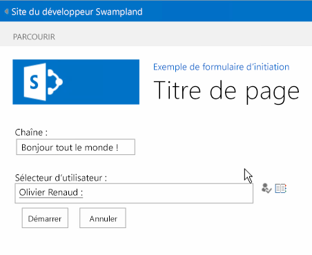
  
    
    
Une fois le flux de travail démarré, la page redirige l'utilisateur vers la page d'origine. Laissez quelques instants au flux de travail pour démarrer, puis revenez à l'élément et consultez la page d'état de l'instance de flux de travail. Notez que l'historique contient les valeurs qui ont été soumises dans le formulaire puis envoyées vers SharePoint une fois l'instance de workflow créée à l'aide de l'API JSOM des services de flux de travail.
  
    
    

**Figure 12. À la fin du flux de travail**

  
    
    

  
    
    

  
    
    

  
    
    

  
    
    

## Conclusion
<a name="sec6"> </a>

SharePoint 2013 a introduit plusieurs améliorations en ce qui concerne les flux de travail. Cet article présente en détail les modifications liées aux formulaires de flux de travail issues des modifications apportées à l'architecture de flux de travail dans SharePoint Server 2013. Cet article décrit également comment créer des formulaires d'association et d'initiation personnalisés pouvant être utilisés pour répondre aux exigences d'automatisation des processus d'entreprise actuels à l'aide de Visual Studio 2012.
  
    
    

## Ressources supplémentaires
<a name="sec7"> </a>


-  [Formulaires d'initiation et d'association de flux de travail (SharePoint Foundation)](http://msdn.microsoft.com/fr-fr/library/office/ms481192%28v=office.14%29.aspx)
    
  
-  [Travailler avec le modèle d'objet SharePoint 2013 Workflow Services Client côté](working-with-the-sharepoint-2013-workflow-services-client-side-object-model.md)
    
  
-  [Personnaliser le mode Liste dans les compléments pour SharePoint à l'aide du rendu côté client](http://msdn.microsoft.com/library/8d5cabb2-70d0-46a0-bfe0-9e21f8d67d86%28Office.15%29.aspx)
    
  

