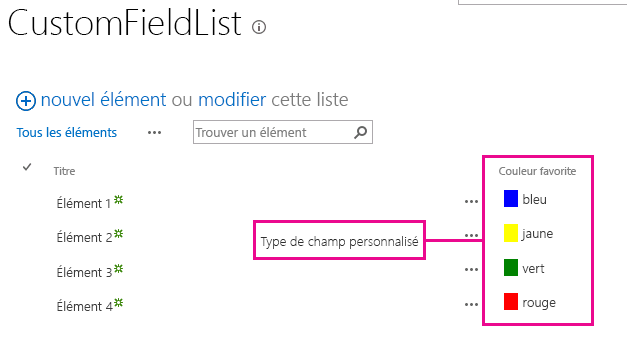
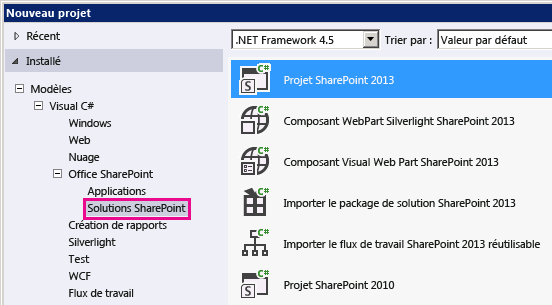
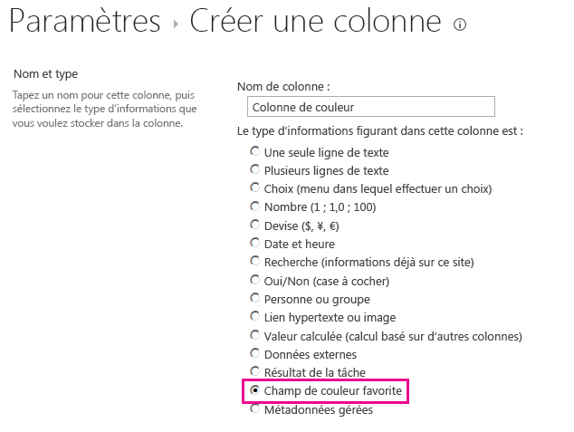

# Procédure : Personnaliser un type de champ à l'aide du rendu côté client
Découvrez comment personnaliser un type de champ à l'aide de la technologie de rendu côté client de SharePoint 2013.
Le rendu côté client propose un mécanisme qui vous permet de produire votre propre destination pour un jeu de contrôles hébergés sur une page SharePoint. Vous pouvez également utiliser des technologies connues, telles que le HTML et JavaScript, afin de définir la logique de rendu des types de champs personnalisés. Avec le rendu côté client, vous pouvez spécifier vos propres ressources JavaScript et les héberger dans les options de stockage de données disponibles pour vos solution de batterie de serveurs, par exemple dans le dossier _Layouts.
  
    
    


## Conditions préalables à l'utilisation des exemples de cet article
<a name="SP15CustomizeafieldtypeusingCSR_Prereq"> </a>

Pour suivre les étapes de cet exemple, vous avez besoin des éléments suivants :
  
    
    

- Microsoft Visual Studio 2012
    
  
- Outils de développement Office pour Visual Studio 2012
    
  
- Un environnement de développement SharePoint 2013
    
  
Pour plus d'informations sur la configuration de votre environnement de développement SharePoint, consultez  [Configurer un environnement de développement général pour SharePoint 2013](set-up-a-general-development-environment-for-sharepoint-2013.md).
  
    
    

### Concepts de base pour vous aider à comprendre le rendu côté client des types de champ

Le tableau suivant répertorie des articles permettant de comprendre les concepts et les étapes liées à un scénario d'action personnalisée.
  
    
    

**Tableau 1. Concepts de base du rendu côté client des types de champ**


|**Titre de l'article**|**Description**|
|:-----|:-----|
| [Créer des solutions de batterie dans SharePoint 2013](build-farm-solutions-in-sharepoint-2013.md) <br/> |En savoir plus sur le développement, la mise en package et le déploiement des extensions d'administration pour SharePoint 2013 à l'aide de solutions de batterie de serveurs.  <br/> |
| [Type de champ personnalisé](http://msdn.microsoft.com/fr-fr/library/ms446361.aspx) <br/> |Obtenez plus d'informations sur la création des types de champ personnalisé. Si vous stockez vos informations professionnelles dans SharePoint 2013, il peut arriver que vos données ne soient pas conformes aux types de champ disponibles dans SharePoint Foundation, ou que vous souhaiterez peut-être seulement personnaliser ces types de champ. Les champs personnalisés peuvent inclure une fonctionnalité de validation personnalisée des données et de rendu de champ personnalisé.  <br/> |
   

## Exemple de code : Personnaliser le processus de rendu d'un type de champ personnalisé dans un formulaire d'affichage
<a name="SP15CustomizeafieldtypeusingCSR_Codeexample"> </a>

Procédez comme suit pour personnaliser le processus de génération d'un type de champ personnalisé :
  
    
    

1. Créez le projet solution de batterie de serveurs.
    
  
2. Ajoutez une classe pour le type de champ personnalisé.
    
  
3. Ajoutez une définition XML pour le type de champ personnalisé.
    
  
4. Ajoutez un fichier JavaScript pour la logique de rendu du type de champ personnalisé.
    
  
La figure 1 présente un formulaire d'affichage contenant le rendu d'un type de champ personnalisé.
  
    
    

**Figure 1. Rendu de champ personnalisé côté client dans un formulaire d'affichage**

  
    
    

  
    
    

  
    
    

### Pour créer le projet solution de batterie de serveurs


1. Ouvrez Visual Studio 2012 en tant qu'administrateur (cliquez avec le bouton droit sur l'icône Visual Studio 2012 dans le menu **Démarrer**, puis sélectionnez **Exécuter en tant qu'administrateur** ).
    
  
2. Créez un projet à l'aide du modèle **Projet SharePoint 2013**.
    
    La figure 2 indique l'emplacement du modèle **Projet SharePoint 2013** dans Visual Studio 2012, sous **Modèles**, **Visual C#**, **Office SharePoint**, **Solutions SharePoint**.
    

   **Figure 2. Modèle Visual Studio de projet SharePoint 2013**

  


  

  

  
3. Indiquez l'URL du site web SharePoint que vous souhaitez utiliser pour le débogage.
    
  
4. Sélectionnez l'option **Déployer en tant que solution de batterie**.
    
  

### Pour ajouter une classe au type de champ personnalisé


1. Cliquez avec le bouton droit sur le projet solution de batterie de serveurs et ajoutez une nouvelle classe. Nommez le fichier de classe FavoriteColorFieldType.cs.
    
  
2. Copiez le code suivant et collez-le dans le fichier FavoriteColorFieldType.cs. Le code réalise les tâches suivantes :
    
  - Il déclare une classe **FavoriteColorField** qui hérite de **SPFieldText**.
    
  
  - Il fournit deux constructeurs pour la classe **FavoriteColorField**.
    
  
  - Il remplace la propriété **JSLink**.
    
    > **REMARQUE**
      > La propriété JSLink n'est pas prise en charge sur les listes d'enquêtes ou d'événements. Un calendrier SharePoint est une liste d'événements. 

  ```cs
  
using System;
using System.Collections.Generic;
using System.Linq;
using System.Text;
using System.Threading.Tasks;

// Additional references for this sample.
using Microsoft.SharePoint;
using Microsoft.SharePoint.WebControls;

namespace Microsoft.SDK.SharePoint.Samples.WebControls
{
    /// <summary>
    /// The FavoriteColorField custom field type 
    /// inherits from SPFieldText.
    /// Users can input the color in the field 
    /// just like in any other text field.
    /// But the field will provide additional 
    /// rendering logic when displaying 
    /// the field in a view form.
    /// </summary>
    public class FavoriteColorField : SPFieldText
    {
        // The solution deploys the JavaScript 
        // file to the CSRAssets folder 
        // in the WFE's layouts folder.
        private const string JSLinkUrl = 
            "~site/_layouts/15/CSRAssets/CSRFieldType.js";

        // You have to provide constructors for SPFieldText.
        public FavoriteColorField(
            SPFieldCollection fields, 
            string name) :
            base(fields, name)
        {

        }
        public FavoriteColorField(
            SPFieldCollection fields, 
            string typename, 
            string name) :
            base(fields, typename, name)
        {

        }

        /// <summary>
        /// Override the JSLink property to return the 
        /// value of our custom JavaScript file.
        /// </summary>
        public override string JSLink
        {
            get
            {
                return JSLinkUrl;
            }
            set
            {
                base.JSLink = value;
            }
        }
    }
}            

  ```


### Pour ajouter une définition XML au type de champ personnalisé


1. Cliquez avec le bouton droit sur le projet solution de batterie de serveurs, puis ajoutez un dossier mappé vers SharePoint. Dans la boîte de dialogue, sélectionnez le dossier **{RacineSharePoint}\\Template\\XML**.
    
  
2. Cliquez avec le bouton droit sur le dossier XML créé lors de l'étape précédente, puis ajoutez un nouveau fichier XML. Nommez le fichier XML fldtypes_FavoriteColorFieldType.xml.
    
  
3. Copiez le balisage suivant et collez-le dans le fichier XML. Le balisage effectue les tâches suivantes :
    
  - Il nomme le type de champ.
    
  
  - Il indique le nom complet de la classe du type de champ. Il s'agit de la classe que vous avez créée dans la procédure précédente.
    
  
  - Il fournit des attributs supplémentaires au type de champ.
    
  

  ```XML
  
<?xml version="1.0" encoding="utf-8" ?>
<FieldTypes>
  <FieldType>
    <Field Name="TypeName">FavoriteColorField</Field>
    <Field Name="TypeDisplayName">Favorite color field</Field>
    <Field Name="TypeShortDescription">Favorite color field</Field>
    <Field Name="FieldTypeClass">Microsoft.SDK.SharePoint.Samples.WebControls.FavoriteColorField, $SharePoint.Project.AssemblyFullName$</Field>
    <Field Name="ParentType">Text</Field>
    <Field Name="Sortable">TRUE</Field>
    <Field Name="Filterable">TRUE</Field>
    <Field Name="UserCreatable">TRUE</Field>
    <Field Name="ShowOnListCreate">TRUE</Field>
    <Field Name="ShowOnSurveyCreate">TRUE</Field>
    <Field Name="ShowOnDocumentLibrary">TRUE</Field>
    <Field Name="ShowOnColumnTemplateCreate">TRUE</Field>
  </FieldType>
</FieldTypes>
  ```


### Pour ajouter un fichier JavaScript à la logique de rendu du type de champ personnalisé


1. Cliquez avec le bouton droit sur le projet solution de batterie de serveurs, puis ajoutez le dossier mappé « Dispositions » SharePoint. Ajoutez un nouveau dossier CSRAssets au dossier « Dispositions » récemment ajouté.
    
  
2. Cliquez avec le bouton droit sur le dossier CSRAssets que vous avez créé lors de l'étape précédente, puis ajoutez un nouveau fichier JavaScript. Nommez le fichier JavaScriptCSRFieldType.js.
    
  
3. Copiez le code suivant et collez-le dans le fichier JavaScript. Le code effectue les tâches suivantes :
    
  - Il crée un modèle pour le champ lorsqu'il est affiché dans un formulaire d'affichage.
    
  
  - Il enregistre le modèle.
    
  
  - Il fournit la logique de rendu du type de champ lorsqu'il est utilisé dans un formulaire affichage.
    
  

  ```
  
(function () {
    var favoriteColorContext = {};

    // You can provide templates for:
    // View, DisplayForm, EditForm and NewForm
    favoriteColorContext.Templates = {};
    favoriteColorContext.Templates.Fields = {
        "FavoriteColorField": {
            "View": favoriteColorViewTemplate
        }
    };

    SPClientTemplates.TemplateManager.RegisterTemplateOverrides(
        favoriteColorContext
        );
})();

// The favoriteColorViewTemplate provides the rendering logic
// the custom field type when it is displayed in the view form.
function favoriteColorViewTemplate(ctx) {
    var color = ctx.CurrentItem[ctx.CurrentFieldSchema.Name];
    return "<span style='background-color : " + color +
        "' >&amp;nbsp;&amp;nbsp;&amp;nbsp;&amp;nbsp;</span>&amp;nbsp;" + color;
}
  ```


### Pour créer et exécuter la solution


1. Appuyez sur la touche F5.
    
    > **REMARQUE**
      > Lorsque vous appuyez sur F5, Visual Studio génère la solution, la déploie, puis ouvre le site web SharePoint où la solution est déployée. 
2. Créez une liste personnalisée et ajoutez une nouvelle colonne Champ de couleur favorite.
    
  
3. Ajoutez un élément à la liste, puis saisissez une valeur pour la colonne Couleur favorite.
    
  
4. La figure 3 illustre la page Créer une colonne contenant le nouveau type de champ personnalisé.
    
   **Figure 3. Création d'une colonne de type de champ personnalisé**

  


  

  

  

****


|**Problème**|**Solution**|
|:-----|:-----|
|Le type de champ **FavoriteColorField** n'est pas installé correctement. Accédez à la page Paramètres de la liste pour supprimer ce champ. <br/> |Exécutez la commande suivante à partir d'une invite de commandes avec élévation de privilèges : **iisreset /noforce**. <br/> > **ATTENTION**> Si vous déployez la solution dans un environnement de production, attendez le bon moment pour réinitialiser le serveur web à l'aide de **iisreset /noforce**.          |
   

## Étapes suivantes
<a name="SP15CustomizeafieldtypeusingCSR_Nextsteps"> </a>

Cet article a expliqué comment personnaliser le processus de rendu d'un type de champ personnalisé. Lors de l'étape suivante, vous pourrez en apprendre davantage sur les types de champ personnalisé. Pour plus d'informations, consultez les rubriques suivantes :
  
    
    

-  [Procédure : créer un type de champ personnalisé](http://msdn.microsoft.com/fr-fr/library/bb862248.aspx)
    
  
-  [Procédure pas à pas : création d'un type de champ personnalisé](http://msdn.microsoft.com/fr-fr/library/bb861799.aspx)
    
  
-  [Personnaliser le mode Liste dans les compléments pour SharePoint à l'aide du rendu côté client](http://msdn.microsoft.com/library/8d5cabb2-70d0-46a0-bfe0-9e21f8d67d86%28Office.15%29.aspx)
    
  

## Ressources supplémentaires
<a name="SP15CustomizeafieldtypeusingCSR_AddResources"> </a>


-  [Configurer un environnement de développement général pour SharePoint 2013](set-up-a-general-development-environment-for-sharepoint-2013.md)
    
  
-  [Créer des sites pour SharePoint](build-sites-for-sharepoint.md)
    
  
-  [Nouveautés pour les développeurs dans SharePoint 2013](what’s-new-for-developers-in-sharepoint-2013.md)
    
  
-  [Ajout de fonctionnalités SharePoint 2013](add-sharepoint-2013-capabilities.md)
    
  
-  [Créer des solutions de batterie dans SharePoint 2013](build-farm-solutions-in-sharepoint-2013.md)
    
  
