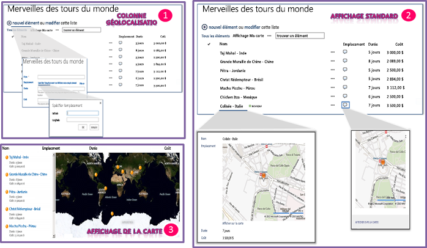

# Intégration de la fonctionnalité d'emplacement et de mappage dans SharePoint 2013
Découvrez comment intégrer des informations d'emplacement et des cartes dans des listes SharePoint et des applications pour SharePoint mobiles et web reposant sur l'emplacement à l'aide du nouveau champ Geolocation et en créant vos propres types de champ reposant sur Geolocation.
## Présentation des fonctionnalités d'emplacement et de carte dans SharePoint 2013

SharePoint 2013 introduit un nouveau type de champ nommé Geolocation qui vous permet d'annoter des listes SharePoint avec des informations d'emplacement. Dans les colonnes de type Geolocation, vous pouvez entrer des informations d'emplacement en tant que paire de coordonnées latitude-longitude en degrés décimaux ou récupérer les coordonnées de l'emplacement actuel de l'utilisateur à partir du navigateur s'il implémente l'API de géolocalisation W3C. Dans la liste, SharePoint 2013 affiche l'emplacement sur une carte optimisée par Bing Cartes. En outre, un nouvel affichage nommé Affichage Carte affiche les éléments de liste sous la forme d'épingles sur un contrôle Ajax Bing Cartes version 7 avec les éléments de liste sous forme de cartes dans le volet gauche. La figure 1 résume les fonctionnalités d'emplacement et de carte par défaut dans SharePoint 2013. Ensemble, le champ Geolocation et l'Affichage Carte vous permettent de donner un contexte spatial aux informations par l'intégration de données à partir de SharePoint dans une expérience de cartographie et vous permettent de vous impliquer via de nouvelles méthodes dans vos applications et solutions mobiles et web.
  
    
    

> **REMARQUE**
> Un package MSI appelé SQLSysClrTypes.msi doit être installé sur chaque serveur web frontal SharePoint pour afficher la valeur du champ Geolocation ou les données dans une liste. Ce package installe les composants qui implémentent les nouveaux types d'ID de géométrie, de géographie et de hiérarchie dans SQL Server 2008. Par défaut, ce fichier est installé pour SharePoint Online. Toutefois, il n'est pas installé pour un déploiement local de SharePoint Server 2013. Vous devez être membre du groupe Administrateurs de batterie pour effectuer cette opération. Pour télécharger SQLSysClrTypes.msi, voir  [Microsoft SQL Server 2008 R2 SP1 Feature Pack](http://www.microsoft.com/fr-fr/download/details.aspx?id=26728) pour SQL Server 2008, ou [Microsoft SQL Server 2012 Feature Pack](http://www.microsoft.com/fr-fr/download/details.aspx?id=29065) pour SQL Server 2012 dans le Centre de téléchargement Microsoft.
  
    
    

**Figure 1.Vue récapitulative des fonctionnalités de carte et d'emplacement par défaut**

  
    
    

  
    
    

  
    
    

  
    
    

  
    
    

## Ce que vous pouvez faire avec les fonctionnalités de carte et d'emplacement

Les fonctionnalités de carte et d'emplacement dans SharePoint 2013 offrent des opportunités uniques aux développeurs pour intégrer des fonctionnalités d'emplacement, de carte et de recherche de proximité dans leurs applications et solutions web et mobiles. Le tableau 1 contient des tâches de base qui vous permettent d'intégrer des fonctionnalités d'emplacement et de carte dans vos applications et solutions.
  
    
    

**Tableau 1. Tâches de base pour l'intégration de fonctionnalités d'emplacement et de carte**

|**Tâche**|**Description**|
|:-----|:-----|
| [Comment : définir la clé de cartes Bing au niveau du web et de la batterie de serveurs en SharePoint 2013](how-to-set-the-bing-maps-key-at-the-web-and-farm-level-in-sharepoint-2013.md)   |SharePoint 2013 utilise les Bing Cartes pour afficher la carte de l'emplacement. Pour pouvoir utiliser la fonctionnalité Bing Cartes, vous devez créer une clé Bing Cartes et définir la clé au niveau du site web ou de la batterie de serveurs. L'article explique les différentes façons dont vous pouvez définir la clé dans SharePoint 2013 et quand choisir quelle option. Un message d'erreur s'affichera sur la carte si vous n'utilisez pas une clé Bing Cartes valide ou si aucune clé n'est définie sur le site web qui contient la liste ou au niveau de la batterie.    |
| [Comment : ajouter une colonne de géolocalisation à une liste par programmation dans SharePoint 2013](how-to-add-a-geolocation-column-to-a-list-programmatically-in-sharepoint-2013.md)   |La colonne Geolocation n'est pas disponible dans les listes SharePoint pour les utilisateurs, par défaut. Pour ajouter la colonne à une liste SharePoint, vous devez écrire du code. Dans cette rubrique, vous allez découvrir comment ajouter le champ Geolocation à une liste par programmation.    |
| [Comment : étendre le type de champ de géolocalisation utilisant le rendu côté client](how-to-extend-the-geolocation-field-type-using-client-side-rendering.md)   |Vous pouvez fournir votre propre affichage pour définir l'interface utilisateur, la logique et le comportement par défaut du champ Geolocation en créant des types de champs personnalisés dérivés du champ Geolocation. SharePoint 2013 simplifie la création de types de champs personnalisés en vous permettant d'exécuter JavaScript en fournissant une nouvelle propriété JSLink dans la classe de champ Geolocation, qui pointe vers un fichier .js personnalisé qui affiche le champ.    |
   

## Ressources supplémentaires

-  [Comment : ajouter une colonne de géolocalisation à une liste par programmation dans SharePoint 2013](how-to-add-a-geolocation-column-to-a-list-programmatically-in-sharepoint-2013.md)
    
  
-  [Comment : définir la clé de cartes Bing au niveau du web et de la batterie de serveurs en SharePoint 2013](how-to-set-the-bing-maps-key-at-the-web-and-farm-level-in-sharepoint-2013.md)
    
  
-  [Comment : étendre le type de champ de géolocalisation utilisant le rendu côté client](how-to-extend-the-geolocation-field-type-using-client-side-rendering.md)
    
  
-  [Comment : intégration de cartes avec des applications Windows Phone et de plusieurs listes SharePoint 2013](how-to-integrate-maps-with-windows-phone-apps-and-sharepoint-2013-lists.md)
    
  
-  [Utiliser le type de champ localisation dans les applications mobiles pour SharePoint 2013](http://technet.microsoft.com/fr-fr/library/fp161355%28v=office.15%29.aspx)
    
  

