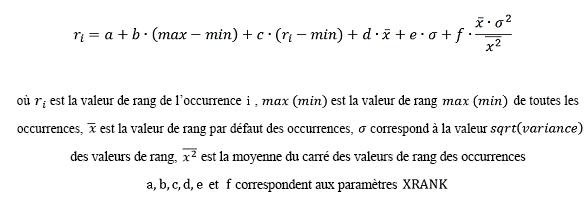

# Référence de syntaxe de langage de requête de mot clé (KQL)
Apprenez à créer des requêtes KQL pour Recherche dans SharePoint 2013. Cette référence de syntaxe décrit les éléments de requête KQL et l'utilisation des restrictions de propriété et les opérateurs dans les requêtes KQL.
## Éléments d'une requête KQL

Une requête KQL se compose des éléments suivants : 
  
    
    

- Mots clés de texte libre (mots ou expressions) 
    
  
- Restrictions de propriété 
    
  
Vous pouvez combiner des éléments de requête KQL avec un ou plusieurs des opérateurs disponibles.
  
    
    
Si la requête KQL est vide ou contient uniquement des opérateurs, elle n'est pas valide. Les requêtes KQL ne respectent pas la casse, mais les opérateurs si (majuscules).
  
    
    

> **REMARQUE**
> La limite de longueur d'une requête KQL varie en fonction de la façon dont vous la créez. Si vous créez la requête KQL à l'aide de la recherche frontale SharePoint par défaut, la limite de longueur est de 2 048 caractères. Cependant, les requêtes KQL que vous créez par programme en utilisant le modèle objet de requête ont une limite de longueur par défaut de 4 096 caractères. Vous pouvez augmenter cette limite à 20 480 caractères à l'aide de la propriété  [MaxKeywordQueryTextLength](https://msdn.microsoft.com/library/Microsoft.Office.Server.Search.Administration.SearchServiceApplication.MaxKeywordQueryTextLength.aspx) ou [DiscoveryMaxKeywordQueryTextLength](https://msdn.microsoft.com/library/Microsoft.Office.Server.Search.Administration.SearchServiceApplication.DiscoveryMaxKeywordQueryTextLength.aspx) (pour eDiscovery).
  
    
    

## Création de requêtes de texte libre à l'aide de KQL

Lorsque vous créez votre requête KQL à l'aide d'expressions de texte libre, Recherche dans SharePoint 2013 correspond aux résultats des termes que vous avez choisis pour la requête en fonction des termes stockés dans l'index de texte intégral. Cela comprend les valeurs des propriétés gérées, où  [FullTextQueriable](https://msdn.microsoft.com/library/Microsoft.Office.Server.Search.Administration.ManagedProperty.FullTextQueriable.aspx) est définie sur **true**.
  
    
    
Les requêtes KQL de texte libre ne respectent pas la casse, mais les opérateurs doivent être en majuscules. Vous pouvez créer des requêtes KQL en utilisant les éléments suivants comme expressions de texte libre :
  
    
    

- Un **word** (inclut un ou plusieurs caractères sans espace ni ponctuation)
    
  
- Une **phrase** (inclut deux ou plusieurs mots, séparés par des espaces ; toutefois, les mots doivent être placés entre guillemets)
    
  
Pour créer des requêtes complexes, vous pouvez combiner plusieurs expressions de texte libre avec les opérateurs de requête KQL. S'il existe plusieurs expressions de texte libre n'incluant aucun opérateur entre elles, le comportement de la requête est le même que pour l'utilisation de l'opérateur **AND**.
  
    
    

### Utilisation de mots dans une requête KQL de texte libre

Lorsque vous utilisez des mots dans une requête KQL de texte libre, Recherche dans SharePoint 2013 renvoie les résultats en fonction des correspondances exactes de vos mots avec les termes stockés dans l'index de texte intégral. Vous ne pouvez utiliser qu'une partie d'un mot, depuis le début du mot, à l'aide de l'opérateur générique (*) pour permettre la correspondance de préfixe. Dans la correspondance de préfixe, Recherche dans SharePoint 2013 renvoie les résultats des termes qui contiennent le mot suivi de zéro ou d'autres caractères.
  
    
    
Par exemple, les requêtes KQL suivantes renvoient les éléments de contenu qui comprennent les termes « federated » et « search » : 
  
    
    
 `federated search`
  
    
    
 `federat* search`
  
    
    
 `search fed*`
  
    
    
Les requêtes KQL ne prennent pas en charge le suffixe correspondant.
  
    
    

### Utilisation d'expressions dans la requête KQL en texte libre

Lorsque vous utilisez des expressions dans une requête KQL de texte libre, Recherche dans SharePoint 2013 renvoie uniquement les éléments dans lesquels les mots de votre expression sont situés côte à côte. Pour spécifier une expression dans une requête KQL, vous devez utiliser des guillemets doubles. 
  
    
    
Les requêtes KQL ne prennent pas en charge le suffixe correspondant, de sorte que vous ne pouvez pas placer l'opérateur générique avant une expression dans les requêtes de texte libre. Cependant, vous pouvez l'utiliser après une expression.
  
    
    

## Requêtes de restriction de propriété dans KQL

KQL permet de créer des requêtes qui utilisent des restrictions de propriété pour limiter le champ de la requête afin d'obtenir uniquement des résultats basés sur une condition spécifiée.
  
    
    

### Spécification de restrictions de propriété

Une restriction de propriété de base comprend les éléments suivants :
  
    
    
 `<Property Name><Property Operator><Property Value>`
  
    
    
Le tableau 1 répertorie des exemples de syntaxe de restriction de propriété valide dans les requêtes KQL.
  
    
    

**Tableau 1. Syntaxe de restriction de propriété valide**

|**Syntaxe**|**Renvoie**|
|:-----|:-----|
| `author:"John Smith"`   |Renvoie les éléments contenus créés par John Smith.    |
| `filetype:docx`   |Renvoie les documents Microsoft Word.    |
| `filename:budget.xlsx`   |Renvoie les éléments de contenu avec le nom de fichier  `budget.xlsx`.    |
   
La restriction de propriété ne doit pas comporter d'espace blanc entre le nom, l'opérateur et la valeur de la propriété. Dans le cas contraire, la restriction de propriété est considérée comme une requête de texte libre. La longueur d'une restriction de propriété est limitée à 2 048 caractères. 
  
    
    
Dans les exemples suivants, l'espace blanc entraîne le renvoi des éléments de contenu incluant les termes « author » et « John Smith », au lieu des éléments de contenu publiés par John Smith :
  
    
    
 `author: "John Smith"`
  
    
    
 `author :"John Smith"`
  
    
    
 `author : "John Smith"`
  
    
    
En d'autres termes, les restrictions de propriété précédentes sont équivalentes à ce qui suit :
  
    
    
 `author "John Smith"`
  
    
    

### Spécification de noms de propriété pour les restrictions de propriété

Vous devez spécifier un nom valide de propriété gérée pour la restriction de propriété. Par défaut, Recherche dans SharePoint 2013 inclut plusieurs propriétés gérées pour les documents.
  
    
    
Pour spécifier la restriction de propriété d'une valeur de propriété analysée, vous devez d'abord mapper la propriété analysée à une propriété gérée. Consultez la rubrique **Propriétés gérées et analysées** dans [Planifier les conditions d'utilisation de la recherche pour l'utilisateur final (Office SharePoint Server)](http://technet.microsoft.com/fr-fr/library/cc263089.aspx). 
  
    
    
La propriété gérée doit être  [Queryable](https://msdn.microsoft.com/library/Microsoft.Office.Server.Search.Administration.ManagedProperty.Queryable.aspx) de sorte que vous puissiez rechercher cette propriété gérée dans un document. En outre, la propriété gérée peut être [Retrievable](https://msdn.microsoft.com/library/Microsoft.Office.Server.Search.Administration.ManagedProperty.Retrievable.aspx) pour la propriété gérée à récupérer. Toutefois, la propriété gérée ne doit pas être [Retrievable](https://msdn.microsoft.com/library/Microsoft.Office.Server.Search.Administration.ManagedProperty.Retrievable.aspx) pour effectuer des recherches de propriétés.
  
    
    

### Opérateurs de propriété pris en charge dans les restrictions de propriété

Recherche dans SharePoint 2013 prend en charge plusieurs opérateurs de propriété pour les restrictions de propriété, comme indiqué dans le tableau 2. 
  
    
    

**Tableau 2. Opérateurs de propriété valides pour les restrictions de propriété**

|**Opérateur**|**Description**|**Type de propriété gérée pris en charge**|
|:-----|:-----|:-----|
|:    |Renvoie les résultats lorsque la valeur spécifiée dans la restriction de propriété est égale à la valeur de propriété stockée dans la base de données de banque de propriétés, ou correspond aux termes individuels dans la valeur de propriété stockée dans l'index de texte intégral.    | [Text](https://msdn.microsoft.com/library/Microsoft.Office.Server.Search.Administration.ManagedDataType.Text.aspx)    [DateTime](https://msdn.microsoft.com/library/Microsoft.Office.Server.Search.Administration.ManagedDataType.DateTime.aspx)    [Integer](https://msdn.microsoft.com/library/Microsoft.Office.Server.Search.Administration.ManagedDataType.Integer.aspx)    [Decimal](https://msdn.microsoft.com/library/Microsoft.Office.Server.Search.Administration.ManagedDataType.Decimal.aspx)    [Double](https://msdn.microsoft.com/library/Microsoft.Office.Server.Search.Administration.ManagedDataType.Double.aspx)    [YesNo](https://msdn.microsoft.com/library/Microsoft.Office.Server.Search.Administration.ManagedDataType.YesNo.aspx)   |
|=    |Renvoie les résultats de recherche lorsque la valeur de propriété est égale à la valeur spécifiée dans la restriction de propriété.    > **REMARQUE**> Nous ne recommandons pas de combiner l'opérateur **=** avec un astérisque ( *****) lorsque vous effectuez une recherche par correspondance exacte.           | [Text](https://msdn.microsoft.com/library/Microsoft.Office.Server.Search.Administration.ManagedDataType.Text.aspx)    [DateTime](https://msdn.microsoft.com/library/Microsoft.Office.Server.Search.Administration.ManagedDataType.DateTime.aspx)    [Integer](https://msdn.microsoft.com/library/Microsoft.Office.Server.Search.Administration.ManagedDataType.Integer.aspx)    [Decimal](https://msdn.microsoft.com/library/Microsoft.Office.Server.Search.Administration.ManagedDataType.Decimal.aspx)    [Double](https://msdn.microsoft.com/library/Microsoft.Office.Server.Search.Administration.ManagedDataType.Double.aspx)    [YesNo](https://msdn.microsoft.com/library/Microsoft.Office.Server.Search.Administration.ManagedDataType.YesNo.aspx)   |
|<    |Renvoie les résultats lorsque la valeur de propriété est inférieure à la valeur spécifiée dans la restriction de propriété.    | [DateTime](https://msdn.microsoft.com/library/Microsoft.Office.Server.Search.Administration.ManagedDataType.DateTime.aspx)    [Integer](https://msdn.microsoft.com/library/Microsoft.Office.Server.Search.Administration.ManagedDataType.Integer.aspx)    [Decimal](https://msdn.microsoft.com/library/Microsoft.Office.Server.Search.Administration.ManagedDataType.Decimal.aspx)    [Double](https://msdn.microsoft.com/library/Microsoft.Office.Server.Search.Administration.ManagedDataType.Double.aspx)   |
|>    |Renvoie les résultats de recherche lorsque la valeur de propriété est supérieure à la valeur spécifiée dans la restriction de propriété.    | [DateTime](https://msdn.microsoft.com/library/Microsoft.Office.Server.Search.Administration.ManagedDataType.DateTime.aspx)    [Integer](https://msdn.microsoft.com/library/Microsoft.Office.Server.Search.Administration.ManagedDataType.Integer.aspx)    [Decimal](https://msdn.microsoft.com/library/Microsoft.Office.Server.Search.Administration.ManagedDataType.Decimal.aspx)    [Double](https://msdn.microsoft.com/library/Microsoft.Office.Server.Search.Administration.ManagedDataType.Double.aspx)   |
|<=    |Renvoie les résultats de recherche lorsque la valeur de propriété est inférieure ou égale à la valeur spécifiée dans la restriction de propriété.    | [DateTime](https://msdn.microsoft.com/library/Microsoft.Office.Server.Search.Administration.ManagedDataType.DateTime.aspx)    [Integer](https://msdn.microsoft.com/library/Microsoft.Office.Server.Search.Administration.ManagedDataType.Integer.aspx)    [Decimal](https://msdn.microsoft.com/library/Microsoft.Office.Server.Search.Administration.ManagedDataType.Decimal.aspx)    [Double](https://msdn.microsoft.com/library/Microsoft.Office.Server.Search.Administration.ManagedDataType.Double.aspx)   |
|>=    |Renvoie les résultats de recherche lorsque la valeur de propriété est supérieure ou égale à la valeur spécifiée dans la restriction de propriété.    | [DateTime](https://msdn.microsoft.com/library/Microsoft.Office.Server.Search.Administration.ManagedDataType.DateTime.aspx)    [Integer](https://msdn.microsoft.com/library/Microsoft.Office.Server.Search.Administration.ManagedDataType.Integer.aspx)    [Decimal](https://msdn.microsoft.com/library/Microsoft.Office.Server.Search.Administration.ManagedDataType.Decimal.aspx)    [Double](https://msdn.microsoft.com/library/Microsoft.Office.Server.Search.Administration.ManagedDataType.Double.aspx)   |
|<>    |Renvoie les résultats de recherche lorsque la valeur de propriété n'est pas égale à la valeur spécifiée dans la restriction de propriété.    | [DateTime](https://msdn.microsoft.com/library/Microsoft.Office.Server.Search.Administration.ManagedDataType.DateTime.aspx)    [Integer](https://msdn.microsoft.com/library/Microsoft.Office.Server.Search.Administration.ManagedDataType.Integer.aspx)    [Decimal](https://msdn.microsoft.com/library/Microsoft.Office.Server.Search.Administration.ManagedDataType.Decimal.aspx)    [Text](https://msdn.microsoft.com/library/Microsoft.Office.Server.Search.Administration.ManagedDataType.Text.aspx)    [Double](https://msdn.microsoft.com/library/Microsoft.Office.Server.Search.Administration.ManagedDataType.Double.aspx)    [YesNo](https://msdn.microsoft.com/library/Microsoft.Office.Server.Search.Administration.ManagedDataType.YesNo.aspx)   |
|..    |Renvoie les résultats de recherche lorsque la valeur de propriété est comprise dans la plage spécifiée dans la restriction de propriété.    Par exemple, la plage A..B représente un ensemble de valeurs comprises entre A et B, où A et B sont inclus. Pour les plages de dates, A indique le début de la journée et B, la fin.    | [DateTime](https://msdn.microsoft.com/library/Microsoft.Office.Server.Search.Administration.ManagedDataType.DateTime.aspx)    [Integer](https://msdn.microsoft.com/library/Microsoft.Office.Server.Search.Administration.ManagedDataType.Integer.aspx)    [Decimal](https://msdn.microsoft.com/library/Microsoft.Office.Server.Search.Administration.ManagedDataType.Decimal.aspx)    [Double](https://msdn.microsoft.com/library/Microsoft.Office.Server.Search.Administration.ManagedDataType.Double.aspx)   |
   

### Spécification des valeurs de propriété

Vous devez spécifier une valeur de propriété étant un type de données valide pour le type de la propriété gérée. Le tableau 3 répertorie ces mappages de types.
  
    
    

**Tableau 3. Mappages de types de données valides pour les types de propriété gérée**

|**Type géré**|**Type de données**|
|:-----|:-----|
| [Text](https://msdn.microsoft.com/library/Microsoft.Office.Server.Search.Administration.ManagedDataType.Text.aspx)   | [String](https://msdn.microsoft.com/library/System.String.aspx)   |
| [Integer](https://msdn.microsoft.com/library/Microsoft.Office.Server.Search.Administration.ManagedDataType.Integer.aspx)   | [Int64](https://msdn.microsoft.com/library/System.Int64.aspx)   |
| [Double](https://msdn.microsoft.com/library/Microsoft.Office.Server.Search.Administration.ManagedDataType.Double.aspx)   | [System.Double](https://msdn.microsoft.com/library/System.Double.aspx)   |
| [Decimal](https://msdn.microsoft.com/library/Microsoft.Office.Server.Search.Administration.ManagedDataType.Decimal.aspx)   | [Decimal](https://msdn.microsoft.com/library/System.Decimal.aspx)   |
| [DateTime()](https://msdn.microsoft.com/library/Microsoft.Office.Server.Search.Administration.ManagedDataType.DateTime.aspx)   | [DateTime](https://msdn.microsoft.com/library/System.DateTime.aspx)   |
| [YesNo](https://msdn.microsoft.com/library/Microsoft.Office.Server.Search.Administration.ManagedDataType.YesNo.aspx)   | [Boolean](https://msdn.microsoft.com/library/System.Boolean.aspx)   |
   

#### Valeurs de propriété de texte

Pour les valeurs de propriété de texte, le comportement de correspondance dépend du stockage de la propriété dans l'index de texte intégral ou dans l'index de recherche. 
  
    
    

#### Valeurs de propriété dans l'index de texte intégral

Les valeurs de propriété sont stockées dans l'index de texte intégral lorsque la propriété **FullTextQueriable** est définie sur **true** pour une propriété gérée. Vous pouvez configurer cette fonction uniquement pour les propriétés de chaîne. Les valeurs de propriété spécifiées dans la requête sont mises en correspondance en fonction des termes individuels stockés dans l'index de texte intégral. Utilisez la propriété [NoWordBreaker](https://msdn.microsoft.com/library/Microsoft.Office.Server.Search.Administration.ManagedProperty.NoWordBreaker.aspx) pour spécifier si les valeurs doivent correspondre à la valeur totale de la propriété.
  
    
    
Par exemple, si vous recherchez un élément de contenu écrit par Paul Shakespear, la requête KQL suivante renvoie les résultats correspondants :
  
    
    
 `author:Shakespear`
  
    
    
 `author:Paul`
  
    
    
La correspondance de préfixe est également prise en charge. Vous pouvez utiliser l'opérateur générique (*), mais cela n'est pas obligatoire lorsque vous spécifiez des mots individuels. Pour revenir à l'exemple précédent, la requête KQL suivante renvoie des éléments de contenu publiés par Paul Shakespear comme correspondances : 
  
    
    
 `author:Shakesp*`
  
    
    
Lorsque vous spécifiez une expression pour la valeur de la propriété, les résultats correspondants doivent contenir l'expression spécifiée dans la valeur de propriété stockée dans l'index de texte intégral. L'exemple de requête suivant renvoie les éléments de contenu avec le texte « Advanced Search » dans le titre, comme « Advanced Search XML », « Learning About the Advanced Search Web Part » etc. :
  
    
    
 `title:"Advanced Search"`
  
    
    
La correspondance de préfixe est également prise en charge avec des expressions spécifiées dans les valeurs de propriété. Toutefois, vous devez utiliser l'opérateur générique (*) dans la requête ; celui-ci est pris en charge uniquement lorsqu'il est situé à la fin de l'expression, comme suit :
  
    
    
 `title:"Advanced Sear*"`
  
    
    
Les requêtes suivantes ne renvoient pas les résultats attendus :
  
    
    
 `title:"Advan* Search"`
  
    
    
 `title:"Advanced Sear"`
  
    
    

#### Valeurs numériques pour les propriétés

Pour les valeurs de propriété numériques qui incluent les types gérés **Integer**, **Double** et **Decimal**, la restriction de propriété correspond à la valeur totale de la propriété. 
  
    
    

### Valeurs de date ou d'heure des propriétés

KQL fournit le type de données **datetime** de date et d'heure. Les formats suivants de date/heure compatibles avec ISO 8601 sont pris en charge dans les requêtes :
  
    
    

- YYYY-MM-DD
    
  
- YYYY-MM-DDThh:mm:ss
    
  
- YYYY-MM-DDThh:mm:ssZ
    
  
- YYYY-MM-DDThh:mm:ssfrZ
    
  
Dans ces formats **datetime**:
  
    
    

-  _YYYY_ spécifie une année à quatre chiffres.
    
    > **REMARQUE**
      > Seules les années à quatre chiffres sont prises en charge. 
-  _MM_ spécifie un mois à deux chiffres. Par exemple, 01 = janvier.
    
  
-  _DD_ spécifie un jour du mois à deux chiffres (01 à 31).
    
  
-  _T_ spécifie la lettre « T ».
    
  
-  _hh_ spécifie une heure à deux chiffres (00 à 23) ; l'indication AM/PM n'est pas autorisée.
    
  
-  _mm_ spécifie une minute à deux chiffres (00 à 59).
    
  
-  _ss_ spécifie une seconde à deux chiffres (00 à 59).
    
  
-  _fr_ spécifie une fraction de secondes facultative, ss, de 1 à 7 chiffres qui suit le point **.** après les secondes. Par exemple : 2012-09-27T11:57:34.1234567.
    
  
Toutes les valeurs de date/d'heure doivent être spécifiées suivant l'UTC (temps universel coordonné), aussi connu comme heure de Greenwich (GMT). L'identificateur de fuseau horaire UTC (caractère « Z » de fin) est facultatif.
  
    
    

#### Intervalles de dates pertinents pris en charge par KQL

KQL vous permet de créer des requêtes de recherche qui prennent en charge la requête de plage de « jour » contenant des mots clés réservés comme indiqué dans le tableau 4. Utilisez des guillemets doubles (" ") pour les intervalles de date et introduisez un espace entre leurs noms.
  
    
    

|**Nom de l'intervalle de dates**|**Description**|
|:-----|:-----|
|today    |Représente le temps écoulé entre le début et la fin du jour en cours.    |
|yesterday    |Représente le temps écoulé entre le début du jour et la fin du jour qui précède celui en cours.    |
|this week    |Représente le temps écoulé entre le début et la fin de la semaine en cours. La culture dans laquelle le texte de la requête a été formulé est prise en compte pour déterminer le premier jour de la semaine.    |
|this month    |Représente le temps écoulé entre le début et la fin du mois en cours.    |
|last month    |Représente l'ensemble du mois qui précède le mois en cours.    |
|this year    |Représente le temps écoulé entre le début et la fin de l'année en cours.    |
|last year    |Représente l'ensemble de l'année qui précède l'année en cours.    |
   

### Utilisation de plusieurs restrictions de propriété au sein d'une requête KQL

Recherche dans SharePoint 2013 prend en charge l'utilisation de plusieurs restrictions de propriété au sein de la même requête KQL. Vous pouvez utiliser la même propriété pour plusieurs restrictions de propriété ou une propriété différente pour chaque restriction de propriété. 
  
    
    
Lorsque vous utilisez plusieurs instances de la même restriction de propriété, les correspondances sont basées sur l'union des restrictions de propriété dans la requête KQL. Les correspondances incluent dans ce cas des éléments de contenu publiés par John Smith ou Jane Smith, comme suit :
  
    
    
 `author:"John Smith" author:"Jane Smith"`
  
    
    
Cette fonctionnalité est identique à l'utilisation de l'opérateur booléen **OR**, comme suit :
  
    
    
 `author:"John Smith" OR author:"Jane Smith"`
  
    
    
Lorsque vous utilisez différentes restrictions de propriété, les correspondances sont basées sur une intersection des restrictions de propriété dans la requête KQL, comme suit :
  
    
    
 `author:"John Smith" filetype:docx`
  
    
    
Les correspondances incluent dans ce cas les documents Microsoft Word rédigés par John Smith. L'utilisation est la même qu'avec l'opérateur booléen **AND**, comme suit :
  
    
    
 `author:"John Smith" AND filetype:docx`
  
    
    

## Opérateurs KQL pour les requêtes complexes

La syntaxe KQL inclut plusieurs opérateurs que vous pouvez utiliser pour construire des requêtes complexes. 
  
    
    

### Opérateurs booléens

Utilisez des opérateurs booléens pour élargir ou affiner votre recherche. Vous pouvez utiliser les opérateurs booléens avec des expressions de texte libre et des restrictions de propriété dans les requêtes KQL. Le tableau 5 répertorie les opérateurs booléens pris en charge.
  
    
    

**Tableau 5. Opérateurs booléens pris en charge dans KQL**

|**Opérateur**|**Description**|
|:-----|:-----|
|**AND**   |Renvoie les résultats de recherche qui incluent toutes les expressions de texte libre ou des restrictions de propriété spécifiées avec l'opérateur **AND**. Vous devez spécifier une expression de texte libre et/ou une restriction de propriété valide avant et après l'opérateur **AND**. L'utilisation est la même qu'avec le signe plus (« + »).    |
|**NOT**   |Renvoie les résultats de recherche qui n'incluent pas les expressions de texte libre ou les restrictions de propriété spécifiées. Vous devez spécifier une expression de texte libre valide ou une restriction de propriété valide suivant l'opérateur **NOT**. L'utilisation est la même qu'avec le signe moins (« - »).    |
|**OR**   |Renvoie les résultats de recherche qui comprennent des expressions de texte libre ou des restrictions de propriété spécifiées. Vous devez spécifier une expression de texte libre et/ou une restriction de propriété valide avant et après l'opérateur **OR**.    |
   

  
    
    

### Opérateurs de proximité

Vous utilisez des opérateurs de proximité pour correspondre aux résultats où les termes de recherche spécifiés sont proches les uns des autres. Les opérateurs de proximité ne peuvent être utilisés qu'avec des expressions de texte libre ; ils ne sont pas pris en charge par les restrictions de propriété dans les requêtes KQL. Il existe deux opérateurs de proximité : **NEAR** et **ONEAR**.
  
    
    

#### Opérateur NEAR

L'opérateur **NEAR** correspond aux résultats où les termes de recherche spécifiés sont proches les uns des autres, sans préserver l'ordre des termes. La syntaxe de **NEAR** est la suivante :
  
    
    
 `<expression> NEAR(n=4) <expression>`
  
    
    
 _n_ est un paramètre facultatif qui indique la distance maximale entre les termes. La valeur de _n_ est un entier >= 0 avec **8** comme valeur par défaut.
  
    
    
Le paramètre  _n_ peut être spécifié sous la forme de `n=v` où _v_ représente la valeur, ou raccourci seulement à _v_, par exemple :  `NEAR(4)` où la valeur de _v_ est 4.
  
    
    
Par exemple :
  
    
    
 `"acquisition" NEAR "debt"`
  
    
    
Cette requête correspond aux éléments où les termes « acquisition » et « dette » apparaissent tous deux, où une instance du terme « acquisition » est suivie d'un nombre maximal de huit autres termes, puis d'une instance du terme « dette » ou vice-versa. L'ordre des termes n'est pas significatif pour la correspondance.
  
    
    
Si votre distance entre les termes doit être inférieure, vous pouvez le spécifier. La requête suivante renvoie les éléments où les termes « acquisition » et « dette » apparaissent dans le même élément, avec une distance maximale de 3 entre les termes. Là encore, l'ordre des termes n'a pas d'incidence sur la correspondance.
  
    
    
 `"acquisition" NEAR(n=3) "debt"`
  
    
    

> **REMARQUE**
> Dans SharePoint 2013, l'opérateur **NEAR** ne conserve plus l'ordre des jetons. En outre, l'opérateur **NEAR** reçoit désormais un paramètre facultatif qui indique la distance maximale du jeton. Toutefois, la valeur par défaut est toujours **8**. Si vous devez utiliser le comportement précédent, utilisez **ONEAR**. 
  
    
    

#### Opérateur ONEAR

L'opérateur **ONEAR** correspond aux résultats où les termes de recherche spécifiés sont proches les uns des autres, tout en préservant l'ordre des termes. La syntaxe de **ONEAR** est la suivante, où _n_ est un paramètre facultatif qui indique la distance maximale entre les termes. La valeur de _n_ est un entier >= 0 avec **8** comme valeur par défaut.
  
    
    
 `<expression> ONEAR(n=4) <expression>`
  
    
    
Le paramètre  _n_ peut être spécifié sous la forme de `n=v` où _v_ représente la valeur, ou raccourci seulement à _v_, par exemple :  `ONEAR(4)` où la valeur de _v_ est 4.
  
    
    
Cette requête correspond aux éléments où les termes « acquisition » et « dette » apparaissent tous deux, où une instance du terme « acquisition » est suivie d'un nombre maximal de huit autres termes, puis d'une instance du terme « dette » ou vice-versa. L'ordre des termes n'est pas significatif pour la correspondance. L'ordre des termes **doit** correspondre pour qu'un élément soit renvoyé :
  
    
    
 `"acquisition" ONEAR "debt"`
  
    
    
Si vous avez besoin d'une distance inférieure entre les termes, vous pouvez le spécifier. La requête suivante renvoie les éléments où les termes « acquisition » et « dette » apparaissent dans le même élément, avec une distance maximale de 3 entre les termes. L'ordre des termes **doit** correspondre pour qu'un élément soit renvoyé :
  
    
    
 `"acquisition" ONEAR(n=3) "debt"`
  
    
    

### Opérateurs de synonyme

Utilisez l'opérateur **WORDS** pour spécifier que les termes de la requête sont synonymes, et que les résultats renvoyés doivent correspondre à l'un des termes spécifiés. Vous ne pouvez utiliser l'opérateur **WORDS** qu'avec les expressions de texte libre ; Celui-ci n'est pas pris en charge avec les restrictions de propriété dans les requêtes KQL.
  
    
    
L'exemple de requête suivant correspond à des résultats qui contiennent soit le terme « TV » soit le terme « télévision ». Ce comportement de correspondance est le même que si vous aviez utilisé la requête suivante :
  
    
    
 `WORDS(TV, Television)`
  
    
    
 `TV OR Television`
  
    
    
Ces requêtes diffèrent dans la façon dont les résultats sont classés. Lorsque vous utilisez l'opérateur **WORDS**, les termes « TV » et « télévision » ne sont pas traités comme des termes différents mais comme des synonymes. Par conséquent, les instances de l'un des deux termes sont classées comme s'il s'agissait d'un même terme. Par exemple, un élément de contenu qui contenait une instance du terme « télévision » et cinq instances du terme « TV » obtiennent un classement identique à un élément de contenu qui comporte six instances du terme « Télévision ».
  
    
    

### Opérateur générique

Utilisez l'opérateur générique (l'astérisque « ***** ») pour permettre la correspondance du préfixe. Vous pouvez spécifier une partie d'un mot, depuis le début du mot, suivie de l'opérateur générique dans votre requête, comme suit. Cette requête correspond aux résultats qui incluent des termes commençant par « serv », suivi de zéro ou d'autres caractères, comme servir, serveur, service, et ainsi de suite :
  
    
    
 `serv*`
  
    
    

### Opérateurs d'inclusion et d'exclusion

Vous pouvez spécifier si les résultats renvoyés doivent inclure ou exclure le contenu qui correspond à la valeur spécifiée dans l'expression de texte libre ou la restriction de propriété, en utilisant les opérateurs d'inclusion et d'exclusion décrits dans le tableau 6.
  
    
    

**Tableau 6. Opérateurs de contenu d'inclusion et d'exclusion dans les résultats**

|**Nom**|**Opérateur**|**Comportement**|
|:-----|:-----|:-----|
|Inclusion    |" **+** "   |Inclut le contenu avec les valeurs correspondant à l'inclusion.    Il s'agit du comportement par défaut si aucun caractère n'est spécifié. L'utilisation est la même qu'avec l'opérateur **AND**.    |
|Exclusion    |" **-** "   |Exclut le contenu qui comporte les valeurs correspondant à l'exclusion. L'utilisation est la même qu'avec un opérateur **NOT**.    |
   

### Opérateur de rang dynamique

utilisez l'opérateur **XRANK** pour améliorer le rang dynamique d'éléments en fonction de certaines occurrences du terme dans l' _match expression_, sans modifier les éléments correspondant à la requête. Une expression **XRANK** contient un composant qui doit être respecté, l' _match expression_, et des composants qui contribuent uniquement au rang dynamique, l' _rank expression_. Au moins **un** des paramètres, excepté _n_, doit être spécifié pour qu'une expression **XRANK** soit valide.
  
    
    
 _Match expressions_ peut être toute expression valide de KQL, y compris des expressions **XRANK** imbriquées. _Rank expressions_ peut être toute expression valide de KQL sans expressions **XRANK**. Si vos requêtes KQL possèdent plusieurs opérateurs **XRANK**, la valeur de rang dynamique finale est calculée comme étant la somme des renforcements sur tous les opérateurs **XRANK**.
  
    
    

> **REMARQUE**
> Utilisez des parenthèses pour indiquer explicitement l'ordre de calcul pour les requêtes KQL ayant plus d'un opérateur **XRANK** au même niveau.
  
    
    

Vous pouvez utiliser l'opérateur **XRANK** dans la syntaxe suivante :
  
    
    
 `<match expression> XRANK(cb=100, rb=0.4, pb=0.4, avgb=0.4, stdb=0.4, nb=0.4, n=200) <rank expression>`
  
    
    
Le calcul du rang dynamique de l'opérateur **XRANK** est calculé selon la formule suivante :
  
    
    

  
    
    

  
    
    
Le tableau 7 répertorie les paramètres de base disponibles pour l'opérateur **XRANK**.
  
    
    

**Tableau 7. Paramètres de l'opérateur XRANK**

|**Paramètre**|**Valeur**|**Description**|
|:-----|:-----|:-----|
| _n_   | _<integer_value>_   |Spécifie le nombre de résultats pour le calcul des statistiques.    Ce paramètre n'a pas d'incidence sur le nombre de résultats auquel contribue le rang dynamique ; il s'agit juste d'un moyen d'exclure les éléments non pertinents des calculs statistiques.    Par défaut : **0**. Une valeur de zéro porte la sémantique de *tous les documents*  .   |
| _nb_   | _<float_value>_   |Le paramètre  _nb_ fait référence à un renforcement normalisé. Ce paramètre indique le facteur multiplié par le produit de la variance et le score moyen des valeurs de rang de l'ensemble des résultats.    _f_ dans la formule XRANK.   |
   
En règle générale, le renforcement normalisé,  _nb_, est le seul paramètre modifié. Il fournit le contrôle nécessaire pour promouvoir ou abaisser un élément en particulier, sans prendre en compte l'écart type. 
  
    
    
Les paramètres avancés suivants sont également disponibles. Cependant, ils ne sont généralement pas utilisés.
  
    
    

**Tableau 8. Paramètres avancés de l'opérateur XRANK**

|**Paramètre**|**Valeur**|**Description**|
|:-----|:-----|:-----|
| _cb_   | _<float_value>_   |Le paramètre  _cb_ fait référence au renforcement constant.   Valeur par défaut : **0**.    _a_ dans la formule XRANK.   |
| _stdb_   | _<float_value>_   |Le paramètre  _stdb_ fait référence à l'augmentation de l'écart type.   Valeur par défaut : **0**.    _e_ dans la formule XRANK.   |
| _avgb_   | _<float_value>_   |Le paramètre  _avgb_ fait référence au renforcement moyen.   Valeur par défaut : **0**.    _d_ dans la formule XRANK.   |
| _rb_   | _<float_value>_   |Le paramètre  _rb_ fait référence au renforcement de la plage. Ce facteur est multiplié par la plage de valeurs de rang dans l'ensemble des résultats.   Valeur par défaut : **0**.    _b_ dans la formule XRANK.   |
| _pb_   | _<float_value>_   |Le paramètre  _pb_ fait référence au renforcement du pourcentage. Ce facteur est multiplié par le rang de chaque élément par rapport à la valeur minimale dans le corpus.   Valeur par défaut : **0**.    _c_ dans la formule XRANK.   |
   

#### Exemples

 **Exemple 1.** L'expression suivante correspond aux éléments pour lesquels l'index de texte intégral par défaut contient les termes « chat » ou « chien ». L'expression augmente le rang dynamique de ces éléments avec un renforcement constant de 100 pour les éléments qui comprennent également les termes « pur-sang ».
  
    
    
 `(cat OR dog) XRANK(cb=100) thoroughbred`
  
    
    
 **Exemple 2.** L'expression suivante correspond aux éléments pour lesquels l'index de texte intégral par défaut contient les termes « chat » ou « chien ». L'expression augmente le rang dynamique de ces éléments avec un renforcement normalisé de 1,5 pour les éléments qui comprennent également les termes « pur-sang ».
  
    
    
 `(cat OR dog) XRANK(nb=1.5) thoroughbred`
  
    
    
 **Exemple 3.** L'expression suivante correspond aux éléments pour lesquels l'index de texte intégral par défaut contient les termes « chat » ou « chien ». L'expression augmente le rang dynamique de ces éléments avec un renforcement constant de 100 et un renforcement normalisé de 1,5 pour les éléments qui comprennent également les termes « pur-sang ».
  
    
    
 `(cat OR dog) XRANK(cb=100, nb=1.5) thoroughbred`
  
    
    
 **Example 4.** L'expression suivante correspond aux éléments contenant le terme « animaux » et augmente le rang dynamique comme suit :
  
    
    

- Le rang dynamique des éléments qui contiennent le terme « chiens » est augmenté de 100 points.
    
  
- Le rang dynamique des éléments qui contiennent le terme « chats » est augmenté de 200 points.
    
  
- Le rang dynamique des éléments qui contiennent les termes « chiens » et « chats » est renforcé de 300 points.
    
  
 `(animals XRANK(cb=100) dogs) XRANK(cb=200) cats`
  
    
    

### Parenthèse

Vous pouvez combiner les différentes parties d'une requête de mot clé en utilisant une parenthèse ouvrante « **(** » et une parenthèse fermante « **)** ». Chaque parenthèse ouvrante « **(** » doit avoir une parenthèse fermante correspondante « **)** ». La présence d'espace avant ou après la parenthèse n'a pas d'incidence sur la requête.
  
    
    

## Ressources supplémentaires

-  [Création de requêtes de recherche dans SharePoint 2013](building-search-queries-in-sharepoint-2013.md)
    
  
