# Vue d'ensemble du modèle de page SharePoint 2013
Découvrez le modèle de page révisé, pages maîtres et mises en page comprises, reconçu pour SharePoint 2013.
## Présentation du modèle de page

Avant de concevoir ou de personnaliser un site SharePoint, vous devez posséder certaines connaissances de base sur les composants d'un site SharePoint et sur la mise en place d'une page SharePoint. Cette rubrique vous offre un aperçu visuel des composants que vous devez envisager à mesure que vous planifiez la personnalisation de votre site. Cette rubrique s'applique spécifiquement aux sites de publication SharePoint 2013.
  
    
    

## Pages maîtres, mises en page et pages

SharePoint utilise des modèles pour définir et afficher les pages d'un site. La structure d'une page SharePoint comprend trois éléments principaux :
  
    
    

- Les pages maîtres définissent les éléments de tramage partagés, ou chrome, de toutes les pages de votre site.
    
  
- Les mises en page définissent la disposition d'une classe spécifique de pages.
    
  
- Les pages sont créées à partir d'une mise en page par les auteurs qui ajoutent du contenu aux champs de page.
    
  

**Figure 1. Page maître, mise en page et page**

  
    
    

  
    
    
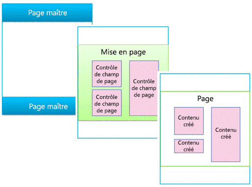
  
    
    

### Pages maîtres

Une page maître définit le chrome (éléments de tramage partagés) de votre site. Ces éléments peuvent inclure l'en-tête et le pied de page, la navigation supérieure, les vues miniatures, la zone de recherche, le logo du site et d'autres éléments de personnalisation. La page maître reste cohérente à mesure que les visiteurs parcourent le site.
  
    
    

**Figure 2. Page maître**

  
    
    

  
    
    
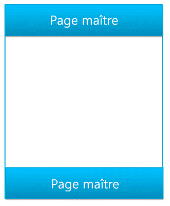
  
    
    
Une page maître définit également les régions (appelées espaces réservés de contenu) qui sont remplies par le contenu des régions correspondantes sur les mises en page. Généralement, le corps d'une page maître contient un seul espace réservé de contenu (appelé **PlaceHolderMain**, créé automatiquement) et tout le contenu d'une mise en page apparaît dans cet espace réservé de contenu (l'espace réservé de contenu **PlaceHolderMain** est indiqué en rouge sur la figure 3).
  
    
    

**Figure 3. Page maître avec mise en page entourée**

  
    
    

  
    
    
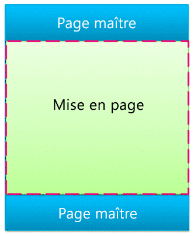
  
    
    
Lorsque vous prévisualisez une page maître dans le gestionnaire de conception, le message suivant apparaît. Cette balise **
** réside dans l'espace réservé de contenu principal. En d'autres termes, la page maître définit le chrome d'une page, et la mise en page définit le corps présent dans l'espace réservé de contenu principal.
  
    
    

**Figure 4. Message de prévisualisation de la page maître**

  
    
    

  
    
    
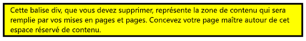
  
    
    

  
    
    

  
    
    

### Mises en page

Une mise en page constitue le modèle d'un type de page spécifique de votre site, comme une page d'article ou une page de détails de produit. Comme son nom l'indique, la mise en page est synonyme de structure du corps de la page.
  
    
    

**Figure 5. Mise en page**

  
    
    

  
    
    
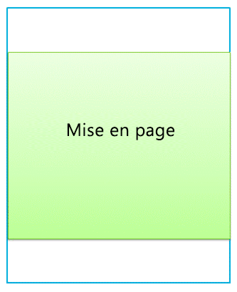
  
    
    
Les mises en page définissent des régions ou des zones de contenu qui mappent les espaces réservés de contenu sur la page maître (en rouge sur la figure 6). Généralement, la mise en page définit une seule zone de contenu qui mappe l'espace réservé de contenu unique automatiquement créé sur une page maître.
  
    
    

**Figure 6. Région de contenu et espace réservé de contenu**

  
    
    

  
    
    
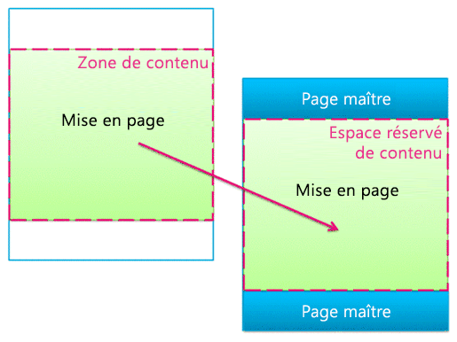
  
    
    

  
    
    

  
    
    

### Contrôles de champ de page

Le principal objectif d'une mise en page est d'organiser les champs de page. Lorsque vous concevez une mise en page, vous insérez, positionnez et définissez le style des éléments appelés contrôles de champ de page. Ces contrôles présentent des contenus lorsqu'un auteur crée une page en fonction de cette mise en page. Outre les champs de page, la mise en page peut également contenir des zones de composants WebPart, dans lesquelles les auteurs de contenu peuvent ajouter des composants WebPart. (Les pages maîtres ne peuvent pas contenir de zones de composants WebPart.)
  
    
    
Le contrôle de champ de page permet de définir les styles utilisés par le contenu. Les auteurs peuvent ajouter du contenu à une page, mais le concepteur exerce le contrôle ultime sur le rendu de ce contenu via la feuille de style CSS appliquée à ces contrôles.
  
    
    

**Figure 7. Mise en page avec contrôles de champ de page**

  
    
    

  
    
    
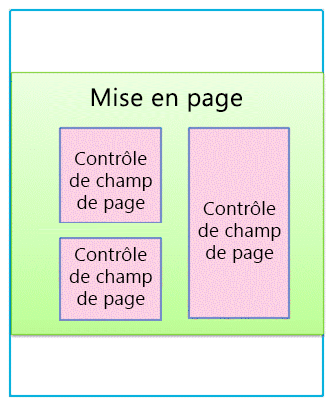
  
    
    
Chaque mise en page est associée à un type de contenu dans la bibliothèque de pages d'un site. Un type de contenu est un schéma de colonnes et de types de données. Les champs de page disponibles pour chaque mise en page correspondent directement aux colonnes définies pour le type de contenu de la mise en page.
  
    
    

### Relation entre les pages maîtres et les mises en page

Ensemble, une page maître et une mise en page créent une page de contenu.
  
    
    

**Figure 8. Page maître avec mise en page**

  
    
    

  
    
    
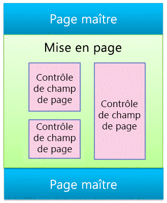
  
    
    
La page maître définit le chrome de toutes les pages du site. C'est pourquoi de nombreuses mises en page (et de nombreuses pages créées à partir de ces mises en page) sont souvent associées à une page maître.
  
    
    

**Figure 9. Une page maître liée à trois mises en page**

  
    
    

  
    
    
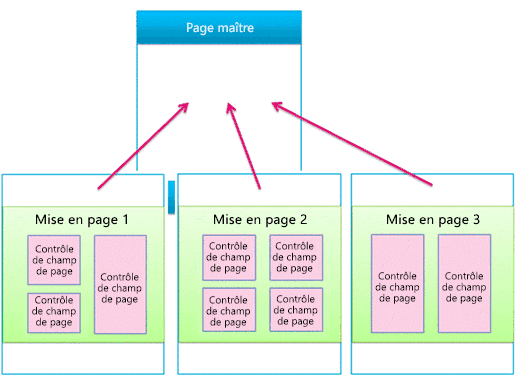
  
    
    
Toutefois, votre site utilisera probablement plusieurs pages maîtres. Par exemple, outre la page maître par défaut, vous pouvez utiliser des pages maîtres pour cibler des appareils spécifiques, tels que les smartphones ou les tablettes. Dans ce cas, une mise en page est utilisée par de nombreuses pages maîtres (voir la section sur les canaux des appareils).
  
    
    
Vous pouvez utiliser une page maître par canal et par site SharePoint.
  
    
    

### Pages

Les auteurs peuvent créer des pages et ajouter du contenu à des champs de page, ainsi que des composants WebPart à des zones de composants WebPart ou des éditeurs de texte enrichi. Les pages sont structurées de telle sorte que les auteurs de contenu ne peuvent pas apporter de modifications à l'extérieur des champs de page.
  
    
    

**Figure 10. Page avec contenu créé**

  
    
    

  
    
    
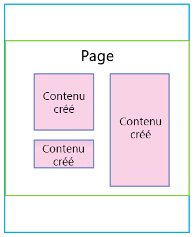
  
    
    
La page affichée représente ce que visualisent les visiteurs du site. Lorsque le navigateur demande une page, la page maître est fusionnée avec une mise en page pour créer une page de contenu, et son contenu est lui-même fusionné dans les champs de cette page dans la bibliothèque de pages.
  
    
    

**Figure 11. Page affichée dans le navigateur**

  
    
    

  
    
    
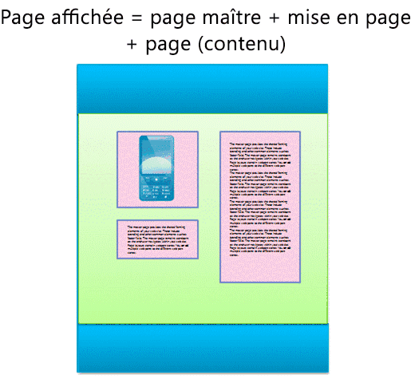
  
    
    

**Figure 12. Page maître, mise en page et page**

  
    
    

  
    
    
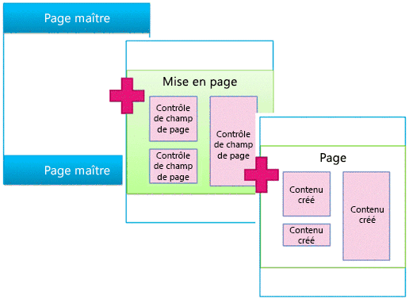
  
    
    

  
    
    

  
    
    

## Composants WebPart de recherche et modèles d'affichage

La section précédente explique les concepts de pages maîtres, mises en page (avec des champs de page) et pages du modèle de page SharePoint. Il s'agit des éléments les plus courants dans un site de publication dans lequel les auteurs créent et publient régulièrement de nouveaux contenus. Concernant l'exposition de ce contenu sur votre site, d'autres éléments entrent en jeu. Que vous soyez connecté à un catalogue externe ou que vous souhaitiez simplement afficher un ensemble de résultats de recherche, les composants WebPart de recherche peuvent vous aider à atteindre votre objectif.
  
    
    
Dans le scénario des pages de recherche, une page SharePoint contient les éléments principaux suivants :
  
    
    

- Pages maîtres
    
  
- Mises en page :
    
  - Les mises en page standard que vous avez créées pour des types de contenu spécifiques, comme décrit précédemment dans cet article
    
  
  - Les mises en page de catégorie et de détails d'élément créées par le biais de la publication intersite d'un catalogue
    
  
- Pages
    
  
- Composants WebPart de recherche, tels que le composant WebPart de recherche de contenu
    
  
- Modèles d'affichage contrôlant les propriétés gérées qui apparaissent dans les résultats de recherche d'un composant WebPart de recherche, ainsi que le style et le comportement de ces résultats de recherche :
    
  - Modèles d'affichage de contrôle, qui contrôlent la mise en page des résultats de recherche et des éléments communs à tous les résultats tels que la pagination, le tri et d'autres liens
    
  
  - Modèles d'affichage d'élément, qui contrôlent la façon dont chaque résultat de recherche est affiché et répété pour chaque résultat
    
  

**Figure 13. Page maître, mise en page et page avec composant WebPart**

  
    
    

  
    
    
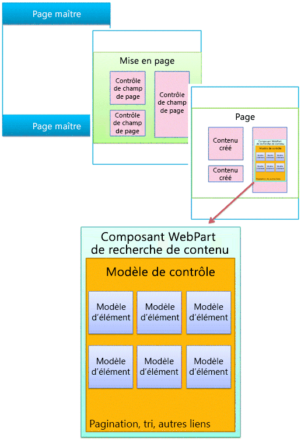
  
    
    

### Composants WebPart de recherche

Les composants WebPart de recherche présentent dynamiquement les informations stockées dans l'index de recherche. La présentation des données dans le composant WebPart de recherche de contenu est contrôlée par des modèles d'affichage situés dans la galerie de pages maîtres avec les pages maîtres et les mises en page.
  
    
    
SharePoint Server 2013 comprend plusieurs modèles d'affichage prêts à être utilisés, tels que des listes et des diaporamas, pour vos composants WebPart de recherche de contenu. Lorsque vous configurez un composant WebPart de recherche de contenu dans le navigateur, choisissez les modèles d'affichage à utiliser.
  
    
    

**Figure 14. Volet d'outils du composant WebPart de recherche de contenu**

  
    
    

  
    
    

  
    
    
Les composants WebPart de recherche de contenu utilisent deux types de modèles d'affichage : contrôle et élément. Dans le cadre de la conception ou de la personnalisation de votre site, vous pouvez créer des modèles d'affichage personnalisés qui utilisent les mises en page, les styles et les comportements que vous définissez.
  
    
    

**Figure 15. Deux diagrammes de composants WebPart de recherche de contenu**

  
    
    

  
    
    
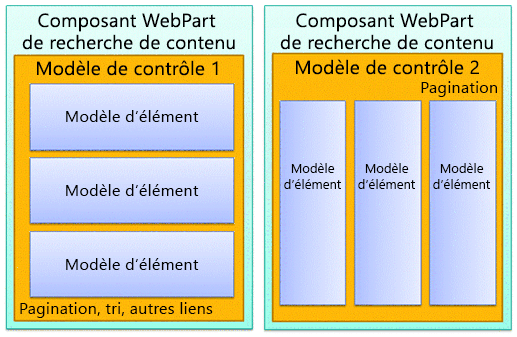
  
    
    

  
    
    

  
    
    

### Modèle d'affichage de contrôle

Le modèle de contrôle détermine la structure et la mise en page générales des résultats de recherche, comme une liste avec pagination ou un diaporama. Chaque composant WebPart de recherche de contenu utilise un modèle de contrôle.
  
    
    
Le modèle de contrôle comprend également une fonctionnalité commune à tous les résultats de recherche, avec la pagination, le tri, les options d'affichage et les séparateurs.
  
    
    

**Figure 16. Modèle de contrôle entouré sur le composant WebPart et la page web**

  
    
    

  
    
    

  
    
    

  
    
    

  
    
    

### Modèle d'affichage d'élément

Le modèle d'élément détermine l'affichage de chaque résultat de l'ensemble et le modèle est répété pour chaque résultat. Un modèle d'élément peut afficher une image, une image contenant du texte, une vidéo et d'autres contenus.
  
    
    
Le modèle d'affichage d'élément détermine également les propriétés gérées et les valeurs affichées par le composant WebPart de recherche de contenu. Dans cet exemple, le modèle d'élément affiche trois propriétés gérées : une image de petite taille, un nom de produit en tant que lien hypertexte et une brève description.
  
    
    

**Figure 17. Modèles d'élément entourés sur le composant WebPart et la page web**

  
    
    

  
    
    
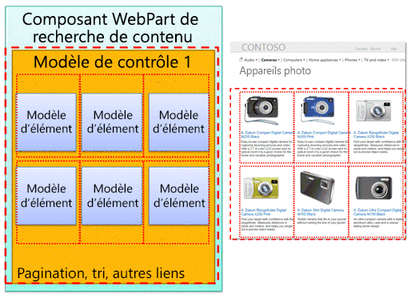
  
    
    

  
    
    

  
    
    

## Canaux des appareils et volets Canaux des appareils

Dans SharePoint 2013, vous pouvez utiliser les canaux des appareils pour obtenir divers affichages de votre site de publication unique en utilisant plusieurs conceptions qui ciblent différents appareils. Créez un site unique avec du contenu en une seule fois. Le site et le contenu peuvent être mappés pour utiliser différentes pages maîtres et feuilles de style afin de cibler un appareil ou un groupe d'appareils spécifique.
  
    
    
Lorsque votre conception concerne plus d'un appareil, prenez en compte les éléments suivants :
  
    
    

- Canaux des appareils :
    
  - Les différentes pages maîtres et feuilles de style CSS par canal permettent de présenter un contenu de page identique de différentes manières pour des appareils spécifiques (par exemple, Windows Phone) ou des groupes d'appareils (tous les smartphones).
    
  
- Mises en page :
    
  - Si vous ne modifiez pas le contenu, utilisez les mêmes mises en page pour tous les canaux des appareils, même si elles peuvent être définies différemment selon les feuilles de style CSS des différentes pages maîtres de chaque canal.
    
  
  - Si vous souhaitez inclure le contenu uniquement pour des appareils spécifiques, utilisez les volets Canaux des appareils.
    
  
- Pages
    
  

### Canaux des appareils

Lorsque vous créez un canal d'appareil, spécifiez les sous-chaînes d'agent utilisateur des appareils que le canal doit cibler. De cette façon, vous exercez un contrôle précis sur les appareils (ou navigateurs) capturés par chaque canal. Ensuite, attribuez une page maître à ce canal ; chaque page maître est attachée à sa propre feuille de style, où la mise en page et les styles sont optimisés pour ce type d'appareil.
  
    
    

**Figure 18. Deux canaux des appareils avec pages maîtres distinctes**

  
    
    

  
    
    
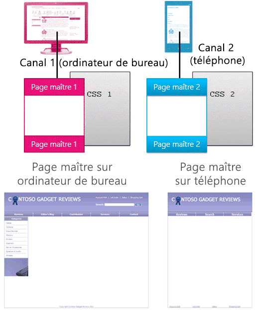
  
    
    
L'utilisation de feuilles de style CSS vous permet d'effectuer de nombreuses opérations. Pour deux canaux différents (par exemple, ordinateur de bureau et téléphone), vous pouvez obtenir des pages maîtres identiques en tout point excepté leur lien, qui renvoie à différentes feuilles de style. Les fichiers CSS utilisent simplement des styles différents pour les mêmes éléments de page.
  
    
    

### Relation entre les pages maîtres et les mises en page

Contrairement aux pages maîtres, n'indiquez pas différentes mises en page pour des canaux des appareils différents. Toutes les mises en page fonctionnent avec tous les canaux que vous créez. Par conséquent, une mise en page s'applique à plusieurs canaux des appareils et pages maîtres.
  
    
    
C'est l'un des principaux avantages des canaux des appareils : la conception est modifiée (page maître et feuille de style CSS), mais le contenu reste le même (mises en page et pages). Toutefois, vous pouvez varier l'affichage du contenu d'une mise en page dans différents canaux à l'aide des volets Canaux des appareils (voir la section suivante).
  
    
    

**Figure 19. Une mise en page fonctionnant avec deux pages maîtres**

  
    
    

  
    
    
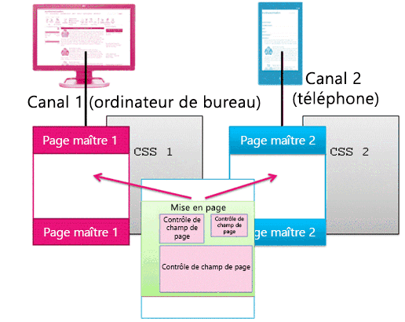
  
    
    

  
    
    

  
    
    

### Volets Canaux des appareils

Le volet Canaux des appareils est un contrôle que vous pouvez ajouter à une page maître, une mise en page ou un modèle d'affichage pour contrôler le rendu du contenu de chaque canal. Le volet Canal est un conteneur qui spécifie un ou plusieurs canaux ; si ces canaux sont actifs lorsque la page est affichée, la totalité du contenu du volet Canal l'est également. Le volet Canal peut inclure tout type de contenu, y compris un lien vers un fichier CSS ou un fichier .js, et constitue un moyen facile d'inclure un contenu spécifique pour chaque canal.
  
    
    
Le scénario le plus courant pour l'utilisation du volet Canal consiste à inclure sélectivement les composants d'une mise en page pour des canaux spécifiques. Par exemple, une mise en page peut avoir des champs de texte séparés pour un message d'accueil bref et un message d'accueil long. En plaçant les champs de page à l'intérieur du volet Canal, vous pouvez afficher le message d'accueil bref uniquement pour les téléphones et le message d'accueil long pour les ordinateurs de bureau. Le contenu d'un volet Canaux des appareils ne s'affiche pas pour les canaux qu'il n'inclut pas ; le contenu à l'intérieur du volet n'est pas affiché, ce qui empêche les octets d'être transférés.
  
    
    

**Figure 20. Mise en page avec volet Canal**

  
    
    

  
    
    
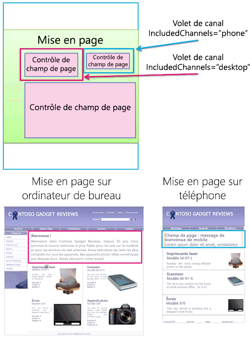
  
    
    
Vous pouvez également utiliser un volet Canal dans les pages maîtres. Par exemple, si votre page maître peut gérer deux appareils différents (ou deux navigateurs différents) avec des modifications minimes, vous pouvez utiliser le volet Canal pour conserver le contenu de la page maître propre à chacun de ces appareils.
  
    
    
En outre, vous pouvez utiliser un volet Canal à l'intérieur du modèle d'affichage d'élément d'un composant WebPart de recherche de contenu pour afficher les propriétés gérées supplémentaires de cet élément dans le catalogue (uniquement pour les ordinateurs de bureau et non les téléphones).
  
    
    

**Figure 21. Mise en page et modèles d'élément avec volets Canal**

  
    
    

  
    
    
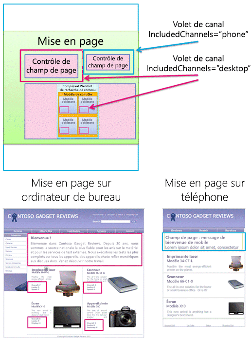
  
    
    

  
    
    

  
    
    

## Ressources supplémentaires

-  [Vue d'ensemble du gestionnaire de conception dans SharePoint 2013](overview-of-design-manager-in-sharepoint-2013.md)
    
  
-  [Créer des sites pour SharePoint](build-sites-for-sharepoint.md)
    
  
-  [Modèles d'affichage du gestionnaire de conception SharePoint 2013](sharepoint-2013-design-manager-display-templates.md)
    
  
-  [Canaux d'appareils du Gestionnaire de conception SharePoint 2013](sharepoint-2013-design-manager-device-channels.md)
    
  

