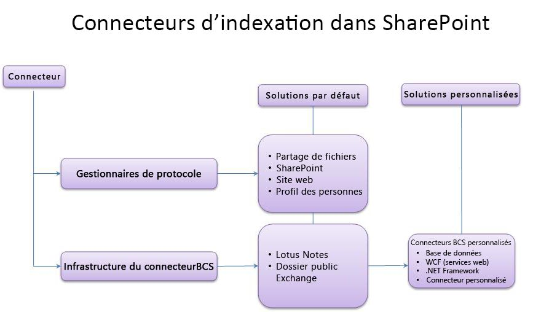
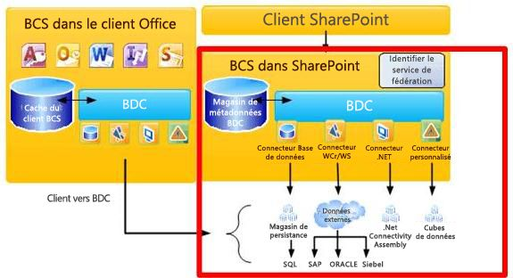
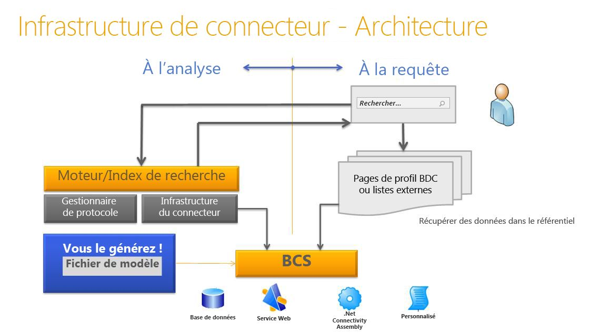

# Infrastructure du connecteur de recherche dans SharePoint 2013
Découvrez les connecteurs d'indexation SharePoint 2013, l'infrastructure de connecteur et la méthode pour créer des connecteurs d'indexation BCS personnalisés afin d'effectuer des recherches dans des systèmes externes.
## Rendre le contenu disponible pour la recherche dans SharePoint 2013

Recherche dans SharePoint 2013 propose deux approches pour traiter les requêtes afin de renvoyer des résultats de recherche : la recherche fédérée et l'analyse du contenu.
  
    
    
 **Recherche fédérée**: dans cette approche, les résultats de la recherche sont renvoyés pour le contenu qui n'est pas analysé par votre serveur de recherche. La requête est transmise à un référentiel de contenu externe dans lequel elle est traitée par le moteur de recherche du référentiel. Le moteur de recherche du référentiel renvoie ensuite les résultats au serveur de recherche. Le serveur de recherche met en forme et restitue les résultats à partir du référentiel externe afin de les afficher sur la page des résultats de la recherche. Cette approche offre les avantages suivants :
  
    
    

- Vous n'avez besoin d'aucune exigence de capacité supplémentaire pour l'index de contenu, car le contenu n'est pas analysé par Recherche dans SharePoint 2013.
    
  
- Vous pouvez tirer parti du moteur de recherche existant d'un référentiel. Par exemple, vous pouvez utiliser un moteur de recherche sur Internet pour effectuer des recherches sur le web.
    
  
- Vous pouvez optimiser le moteur de recherche du référentiel de contenu pour un ensemble de contenu spécifique du référentiel, ce qui peut fournir de meilleures performances de recherche sur l'ensemble de contenu.
    
  
- Vous pouvez accéder aux référentiels qui sont protégés contre les analyses, mais qui sont accessibles par les requêtes de recherche.
    
  
 **Analyse du contenu**: dans cette approche, les résultats sont renvoyés à partir de l'index de contenu de l'application de service de recherche en fonction de la requête de l'utilisateur. L'index de contenu comporte du contenu qui est analysé par l'application de service de recherche, et inclut du contenu de texte et des métadonnées pour chaque élément de contenu. Avec cette approche, vous pouvez :
  
    
    

- trier les résultats par pertinence ;
    
  
- contrôler la fréquence de mise à jour de l'index de contenu ;
    
  
- indiquer les métadonnées qui sont analysées ;
    
  
- effectuer une opération de sauvegarde unique pour le contenu analysé.
    
  

## Analyse de contenu avec des connecteurs d'indexation dans SharePoint 2013

Le robot utilise des connecteurs d'indexation pour accéder au contenu à analyser. Le connecteur d'indexation est le composant qui sait comment se connecter à la source de contenu, qui connaît les éléments à analyser et la façon de les analyser. Dans les versions antérieures de SharePoint, ces connecteurs étaient appelés des gestionnaires de protocole, c'est-à-dire des composants basés sur des interfaces personnalisées exécutant du code C++ non géré. 
  
    
    
Recherche dans SharePoint 2013 comprend une infrastructure de connecteur, introduite dans SharePoint Server 2010 et créée sur Microsoft Business Connectivity Services (BCS), qui fournit une approche plus simple pour développer des connecteurs d'indexation. Avec l'infrastructure de connecteur, le robot utilise des connecteurs d'indexation basés sur BCS pour analyser le contenu externe. SharePoint 2013 utilise des connecteurs d'indexation basés sur le gestionnaire de protocole, ainsi que des connecteurs d'indexation BCS pour analyser le contenu.
  
    
    
La figure 1 donne une vue d'ensemble de l'historique du connecteur d'indexation SharePoint 2013.
  
    
    

  
    
    

  
    
    

  
    
    

  
    
    

## Vue d'ensemble de BCS pour Recherche dans SharePoint 2013

BCS est le parapluie des outils et de l'infrastructure qui vous permet de vous connecter à des systèmes externes à partir de SharePoint. La figure 2 illustre une vue d'ensemble de l'architecture BCS, avec les domaines de recherche pertinents mis en surbrillance.
  
    
    

  
    
    

**Figure 2. Architecture BCS comprenant la recherche**

  
    
    

  
    
    

  
    
    

  
    
    
BCS établit la connexion avec les données externes en fonction de la définition du type de contenu externe dans le magasin de métadonnées. Ce magasin contient les informations suivantes pour un type de contenu externe :
  
    
    

- **Informations sur la connectivité**: expliquent comment se connecter au système externe.
    
  
- **Informations sur l'entité** Décrit la structure des données externes.
    
  
- **Opérations**: décrivent les méthodes utilisées pour accéder aux données externes. Dans le cas des bases de données et des services web, il s'agit des méthodes prises en charge par le système externe : instructions SQL pour les connecteurs de base de données et méthodes web pour des services web. Pour .NET et les connecteurs d'indexation BCS personnalisés, il s'agit de méthodes qui sont implémentées dans l'assembly de connecteur, qui correspond au composant DLL que vous créez pour le connecteur d'indexation.
    
  
Ces informations sont indiquées dans le fichier de modèle BDC du type de contenu externe. Pour plus d'informations sur les modèles BDC et ce qu'ils contiennent, voir  [Infrastructure du modèle BDC](http://msdn.microsoft.com/library/2818ebdd-6cda-4d8f-82b2-7fde9fbf2633%28Office.15%29.aspx).
  
    
    
Pour plus de détails sur l'architecture BCS et ses fonctionnalités, voir  [Services Business Connectivity : vue d'ensemble](http://msdn.microsoft.com/library/91dd7b01-ead2-4f87-804b-b59ef2245c87%28Office.15%29.aspx) et [Principes d'utilisation de Business Connectivity Services](http://msdn.microsoft.com/library/ff3e312b-0fbc-48ed-a752-76c50d286533%28Office.15%29.aspx).
  
    
    

### Utilisation de l'infrastructure du connecteur

Pour analyser des données externes, vous devez ajouter l'un des types de source de contenu prenant en charge la connexion à des données externes. Le tableau 1 répertorie ces types de source de contenu.
  
    
    

**Tableau 1. Types de source de contenu prenant en charge les connecteurs d'indexation BCS**

|**Type de source de contenu**|**Description**|
|:-----|:-----|
|Données métiers    |Utilisez cette source de contenu pour les connecteurs d'indexation BCS de base de données et de service web.    |
|Référentiel personnalisé    |Utilisez cette source de contenu pour les connecteurs d'indexation BCS .NET et personnalisés.    |
   
L'infrastructure du connecteur vous permet de créer des connecteurs d'indexation BCS afin de se connecter au contenu externe que vous souhaitez analyser et inclure dans l'index de contenu. Le connecteur d'indexation BCS est utilisé par le robot pour communiquer avec la source de données externe. Au moment de l'analyse, le robot appelle le connecteur d'indexation BCS pour extraire les données du système externe et les transmettre à l'analyseur. Le connecteur d'indexation BCS analyse également les URL d'accès comprises par la recherche, ainsi que les identificateurs compris par BCS lorsqu'ils sont transmis entre BCS et la recherche au cours du processus d'analyse.
  
    
    
Les connecteurs d'indexation BCS se composent des éléments suivants :
  
    
    

  
    
    
> **Fichier de modèle BDC**: fichier qui fournit la structure des données et les informations de connexion au système externe.
    
  

  
    
    
> **Connecteur**: composant qui contient le code permettant de se connecter au système externe, et qui analyse les URL d'accès et les identificateurs BCS.
    
  
Pour les connecteurs d'indexation BCS basés sur les types de source de contenu de données métiers, la recherche inclut des connecteurs intégrés, vous avez donc besoin de créer uniquement un fichier de modèle BDC. 
  
    
    
Pour les connecteurs d'indexation BCS basés sur les types de source de contenu de référentiel personnalisé, vous devez développer un composant personnalisé en plus d'un fichier de modèle BDC pour vous connecter aux données externes.
  
    
    
La figure 3 présente une vue d'ensemble de l'architecture de l'infrastructure du connecteur de recherche.
  
    
    

**Figure 3. Architecture de l'infrastructure du connecteur de recherche**

  
    
    

  
    
    

  
    
    

  
    
    

  
    
    

### Connecteurs d'indexation BCS

SharePoint 2013 prend en charge les types de connecteurs d'indexation BCS suivants :
  
    
    

- **Connecteur de base de données**: SharePoint 2013 inclut un connecteur BCS prédéfini qui prend en charge la connexion aux bases de données. Vous pouvez donc créer un connecteur d'indexation BCS de base de données sans avoir à écrire de code, créez simplement le fichier de modèle BDC pour le connecteur.
    
  
- **Connecteur WCF (services web)**: SharePoint 2013 inclut un connecteur BCS prédéfini qui prend en charge la connexion aux services web. Vous pouvez donc créer un connecteur d'indexation BCS de service web sans avoir à écrire de code, créez simplement le fichier de modèle BDC pour le connecteur.
    
    > **REMARQUE**
      > Bien que vous n'ayez pas à écrire de code pour créer un connecteur pour les services web, le service web doit inclure des méthodes qui fournissent la même fonctionnalité que le connecteur .NET BCS, afin de transmettre les données métier externes à BCS. Pour plus d'informations sur la création d'un service web, voir  [Création d'assemblies .NET Connectivity Assembly et de services web](http://msdn.microsoft.com/library/9a6c6712-868a-4a9c-9645-3aa448ad5092%28Office.15%29.aspx). Pour obtenir des exemples de code, voir  [Exemple de service web ASP.NET Orders](http://msdn.microsoft.com/library/10e46860-788f-4ed0-a4d8-1e17ada58e83%28Office.15%29.aspx) et [Exemple de service WCF Orders](http://msdn.microsoft.com/library/535277c8-9d5c-41eb-ab23-0ae141d726c5%28Office.15%29.aspx). 
- **Connecteur BCS .NET**: SharePoint 2013 n'inclut pas de connecteur BCS prédéfini pour les connecteurs .NET. C'est pourquoi, en plus de créer un fichier de modèle BDC, vous devez créer un composant .NET pour le connecteur d'indexation BCS. Vous devez implémenter les opérations stéréotypées requises pour prendre en charge l'analyse de données et mettre en œuvre des méthodes pour l'analyse des URL d'accès et des identificateurs BDC.
    
  
- **Connecteur BCS personnalisé**: SharePoint 2013 n'inclut pas de connecteur BCS prédéfini pour les connecteurs .NET personnalisés. C'est pourquoi, en plus de créer un fichier de modèle BDC, vous devez créer un composant .NET pour le connecteur d'indexation BCS, tout comme vous devez le faire pour le connecteur BCS .NET. Vous devez implémenter les opérations stéréotypées requises pour prendre en charge l'analyse de données et mettre en œuvre des méthodes pour l'analyse des URL d'accès et des identificateurs BDC. Vous devez également implémenter l'interface **ISystemUtility**. 
    
  

## Création de connecteurs d'indexation BCS

Lorsque vous développez un connecteur d'indexation BCS, qu'il s'agisse de la création du fichier de modèle BDC pour les connecteurs d'indexation de base de données et de service web, ou de la création du fichier de modèle BDC et du codage du composant de connecteur BCS pour .NET et les connecteurs d'indexation personnalisés, vous devez prendre en considération les éléments suivants :
  
    
    

- **Connectivité**: la façon de se connecter au référentiel de données externes, par exemple, l'adresse du serveur, l'adresse IP ou le nom de l'instance de base de données. La connectivité permet également d'inclure les informations d'authentification utilisées pour se connecter au référentiel de données externes.
    
  
- **Structure du référentiel**: pour lire les données, le connecteur doit connaître la façon dont le référentiel est organisé. Est-il hiérarchique, numérique, ou passe-t-il par des liens ?
    
  
- **Analyses incrémentielles**: afin de réduire la charge des performances sur le référentiel de données externes, autorisez le connecteur à effectuer des analyses incrémentielles en plus des analyses complètes. Pour ce faire, le connecteur doit reconnaître les données qui ont été modifiées depuis la dernière analyse et être en mesure d'analyser uniquement ces données. Cette action peut être réalisée à l'aide d'une analyse incrémentielle basée sur un horodatage ou d'une analyse basée sur le journal des modifications. L'approche que vous implémentez dépend des API fournies par le référentiel et des objectifs d'actualisation du contenu.
    
  
- **Sécurisation des données**: dans la plupart des scénarios, toutes les données ne sont pas accessibles par tous les utilisateurs. Il est important que cela fonctionne également avec la recherche, pour que les utilisateurs effectuant des recherches à l'aide de l'interface utilisateur ne puissent voir que les résultats auxquels ils ont accès. Cela signifie que le connecteur doit savoir comment lire la sécurité du système externe, et importer les informations relatives à la sécurité lors de l'analyse dans l'index. Par exemple, vous pouvez implémenter un stockage au moment de l'analyse des listes de contrôle d'accès NT Windows.
    
  
Le tableau 2 décrit les opérations stéréotypées qui s'appliquent lorsque vous créez un connecteur d'indexation BCS pour SharePoint 2013.
  
    
    

**Tableau 2. Opérations stéréotypées BCS prises en charge par Recherche dans SharePoint 2013**

|**Opération**|**Description**|
|:-----|:-----|
|Finder    |Opération de base requise lorsque vous créez un connecteur BCS. Cette opération récupère la liste des éléments de la source de contenu externe. Voir  [Implémentation de Finder](http://msdn.microsoft.com/library/a0cb7cfe-8758-4057-aa85-03071536745e%28Office.15%29.aspx).    |
|SpecificFinder    |Opération de base requise lorsque vous créez un connecteur BCS. Cette opération récupère des éléments individuels à partir de la source de contenu externe. Voir  [Implémentation de SpecificFinder](http://msdn.microsoft.com/library/9b6effa5-20ce-4ce7-a8dc-0fd601eb0f23%28Office.15%29.aspx).    |
|ChangedIdEnumerator    |Opération requise pour implémenter des analyses incrémentielles basées sur le journal des modifications. Voir  [Implémentation de ChangedIdEnumerator](http://msdn.microsoft.com/library/19d3c942-f6d7-49e7-853f-4d9b61b10422%28Office.15%29.aspx).    |
|DeletedIdEnumerator    |Opération requise pour implémenter des analyses incrémentielles basées sur le journal des modifications. Voir  [Implémentation de DeletedIdEnumerator](http://msdn.microsoft.com/library/aa1c521a-0c9b-4dc0-a32f-fb9e54c52bed%28Office.15%29.aspx).    |
|BinarySecurityDescriptorAccessor    |Opération requise pour implémenter la sécurité au niveau de l'élément. Elle renvoie le descripteur de sécurité pour un élément à partir de la source de contenu externe. Voir  [Implémentation de BinarySecurityDescriptorAccessor](http://msdn.microsoft.com/library/6cf70490-dd3c-49cd-bb13-ed33e938435d%28Office.15%29.aspx).    |
|StreamAccessor    |Opération requise pour activer l'analyse des pièces jointes à partir de la source de contenu externe. Elle renvoie la pièce jointe comme un flux de données. Voir  [Implémentation de StreamAccessor](http://msdn.microsoft.com/library/e3d8053b-90c0-4207-98e3-91e42db13cf1%28Office.15%29.aspx).    |
   

  
    
    

### Support d'outils pour le développement de connecteurs d'indexation BCS

BCS fournit des outils pour les connecteurs BCS dans SharePoint Designer et Visual Studio.
  
    
    

#### Support d'outils SharePoint Designer pour les connecteurs BCS

SharePoint Designer fournit un ensemble limité de fonctionnalités. Vous pouvez l'utiliser pour créer des fichiers modèle BDC pour les types de connecteurs BCS existants, comme une base de données, un service web et des connecteurs BCS .NET. Vous pouvez également l'utiliser pour exporter des fichiers modèle BDC à partir d'une application de service BCS vers une autre.
  
    
    

#### Support d'outils Visual Studio pour les connecteurs BCS

Vous pouvez utiliser Visual Studio afin de créer le composant pour les connecteurs BCS .NET et les connecteurs BCS personnalisés. Pour les connecteurs BCS .NET, Visual Studio fournit le modèle de projet Business Data Connectivity Model, qui comprend un ensemble de concepteurs visuels et de fonctionnalités de gestion de code afin de vous permettre de créer, déboguer et déployer facilement le composant .NET et le fichier de modèle BDC associé pour le connecteur BCS .NET. Il n'existe aucun modèle de projet correspondant pour les connecteurs BCS personnalisés.
  
    
    

## Améliorations de l'infrastructure des connecteurs dans SharePoint 2013

Dans SharePoint 2013, l'infrastructure de connecteur prend en charge les connecteurs BCS récupérant des informations sur les revendications pour le contenu qui est stocké dans des référentiels de données externes personnalisés.
  
    
    
L'infrastructure de connecteur fournit également des exceptions de capture et de journalisation améliorées pour vous aider à dépanner les erreurs rencontrées lors de l'analyse des sources de contenu à l'aide de connecteurs BCS.
  
    
    

## Ressources supplémentaires

-  [Amélioration du fichier de modèle BDC pour la recherche dans SharePoint 2013](enhancing-the-bdc-model-file-for-search-in-sharepoint-2013.md)
    
  
-  [SharePoint 2013 : exemple de connecteur d'indexation BCS personnalisé MyFileConnector](http://code.msdn.microsoft.com/SharePoint-2013-MyFileConne-79d2ea26)
    
  
-  [Procédure : analyser associés à des types de contenu externe dans SharePoint 2013](how-to-crawl-associated-external-content-types-in-sharepoint-2013.md)
    
  
-  [Procédure : analyser des objets BLOB (binary large) dans SharePoint 2013](how-to-crawl-binary-large-objects-blobs-in-sharepoint-2013.md)
    
  
-  [Procédure : analyser associés à des types de contenu externe dans SharePoint 2013](how-to-crawl-associated-external-content-types-in-sharepoint-2013.md)
    
  
-  [Procédure : configurer la sécurité de niveau élément en SharePoint 2013](how-to-configure-item-level-security-in-sharepoint-2013.md)
    
  

