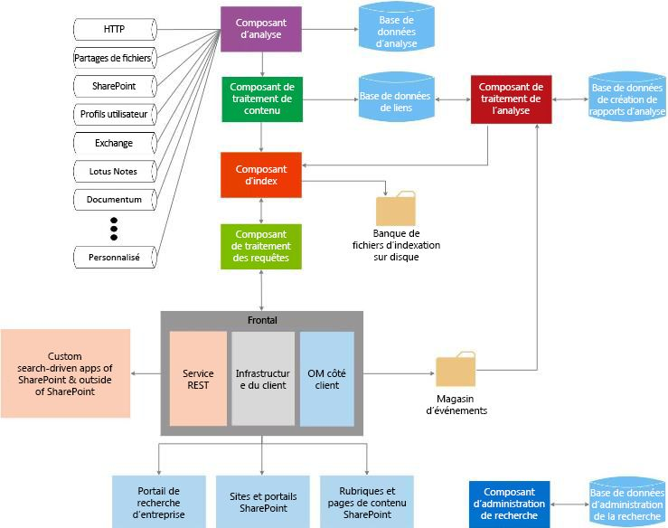

# Recherche dans SharePoint 2013
Comprendre les blocs de construction d'extensibilité dans Recherche dans SharePoint 2013 et la façon dont vous pouvez les mettre à profit en fonction de vos cas d'utilisation.
Recherche dans SharePoint 2013 permet aux utilisateurs de rechercher des informations pertinentes plus rapidement et plus facilement qu'auparavant, et facilite la personnalisation de la recherche pour les administrateurs de recherche. Il fournit également plusieurs ensembles d'API pour bénéficier de solutions et de personnalisations plus avancées.
  
    
    

Consultez les articles suivants pour obtenir une présentation détaillée des concepts de développement SharePoint 2013 généraux. Cela peut s'avérer utile de les consulter avant de commencer :
-  [Configurer un environnement de développement général pour SharePoint 2013](set-up-a-general-development-environment-for-sharepoint-2013.md)
    
  
-  [Choisir l'ensemble d'API approprié dans SharePoint 2013](choose-the-right-api-set-in-sharepoint-2013.md)
    
  
-  [Comparaison des compléments pour SharePoint et des solutions SharePoint](sharepoint-add-ins-compared-with-sharepoint-solutions.md)
    
  
-  [Choix entre SharePoint Add-ins et les solutions SharePoint](deciding-between-sharepoint-add-ins-and-sharepoint-solutions.md)
    
  

## Vue d'ensemble de l'architecture de la recherche

Recherche dans SharePoint 2013 inclut un large éventail d'améliorations et de nouvelles fonctionnalités. Avec cette version, Recherche dans SharePoint 2013 a une nouvelle architecture et se transforme en une plateforme unique de recherche d'entreprise. L'architecture de recherche se compose des éléments suivants :
  
    
    

-  [Traitement de l'analyse et du contenu](#bk_crawl)
    
  
-  [Index](#bk_index)
    
  
-  [Traitement des requêtes](#bk_query)
    
  
-  [Administration de la recherche](#bk_searchadmin)
    
  
-  [Analyse](#bk_analytics)
    
  
Ces éléments sont constitués de composants et de bases de données qui fonctionnent en cohésion pour effectuer l'opération de recherche. La figure 1 donne un aperçu des différents éléments de l'architecture de la recherche, ainsi que des composants et bases de données qui les composent.
  
    
    

**Figure 1. Interaction des composants de la recherche**

  
    
    

  
    
    

  
    
    
Pour obtenir une vue plus détaillée, voir  [Diagrammes techniques - Recherche](http://technet.microsoft.com/fr-fr/library/cc263199.aspx#search) et [Vue d'ensemble de la recherche dans SharePoint Server 2013](http://technet.microsoft.com/fr-fr/library/jj219738.aspx).
  
    
    

### Traitement de l'analyse et du contenu

L'architecture de traitement de l'analyse et du contenu comprend les éléments suivants :
  
    
    
 **Composant de l'analyse**
  
    
    
 : analyse les sources de contenu pour collecter des propriétés et des métadonnées analysées à partir d'éléments analysés et envoie ces informations au composant de traitement du contenu.
  
    
    
 **Base de données de l'analyse**
  
    
    
 : contient des informations sur les éléments analysés, tels que l'heure et l'ID de la dernière analyse, et le type de mise à jour lors de la dernière analyse.
  
    
    
 **Composant de traitement du contenu**
  
    
    
 : analyse les sources de contenu pour collecter des propriétés et des métadonnées analysés à partir d'éléments analysés et envoie ces informations au composant d'index.
  
    
    

### Index

Le composant d'index reçoit les éléments traités du composant de traitement du contenu et les écrit dans l'index de recherche. En outre, ce composant gère les requêtes entrantes, récupère les informations de l'index de recherche et renvoie le jeu de résultats au composant de traitement des requêtes.
  
    
    

### Traitement des requêtes

Le composant de traitement des requêtes analyse et traite les requêtes et les résultats de la recherche. La requête traitée est ensuite envoyée au composant d'index, qui à son tour renvoie un jeu de résultats de recherche pour la requête.
  
    
    

### Administration de la recherche

L'administration de la recherche est constituée du composant d'administration de la recherche et de sa base de données correspondante.
  
    
    
 **Composant d'administration de la recherche**
  
    
    
 : exécute les processus système pour la recherche, et ajoute et initialise de nouvelles instances de composants de la recherche.
  
    
    
 **Base de données d'administration de la recherche**
  
    
    
 : stocke des données de configuration de la recherche.
  
    
    

### Analyse

L'architecture de l'analyse comprend le composant de traitement de l'analyse, la base de données de création de rapports d'analyse et la base de données de lien.
  
    
    
 **Composant de traitement de l'analyse**
  
    
    
 : effectue une analyse de la recherche et de l'utilisation.
  
    
    
 **Base de données de lien**
  
    
    
 : stocke les informations extraites par le composant de traitement du contenu et les informations de clic de recherche.
  
    
    
 **Base de données de rapports d'analyse**
  
    
    
 : stocke les résultats de l'analyse de l'utilisation.
  
    
    
 **Magasin d'événements**
  
    
    
 : stocke les événements d'utilisation qui sont capturés sur la partie frontale.
  
    
    

## Points d'extensibilité de la recherche

L'architecture Recherche dans SharePoint 2013 offre plusieurs points d'extensibilité pour prendre en charge les scénarios de personnalisation. Dans cette section, nous allons décrire ces points et vous indiquer les ressources qui vous permettront d'obtenir plus d'informations sur le développement de ces scénarios.
  
    
    

### Infrastructure du connecteur

Le composant d'analyse analyse le contenu en appelant des connecteurs ou des gestionnaires de protocole qui interagissent avec des sources de contenu pour récupérer des données. Recherche dans SharePoint 2013 comprend une infrastructure de connecteur que vous pouvez utiliser pour personnaliser et créer des connecteurs afin d'analyser de nouvelles sources de contenu. Pour obtenir des informations détaillées sur l'architecture d'infrastructure du connecteur et sur la façon de l'étendre, voir  [Infrastructure du connecteur de recherche dans SharePoint 2013](search-connector-framework-in-sharepoint-2013.md).
  
    
    

### Traitement du contenu personnalisé

Dans le composant de traitement du contenu, vous pouvez utiliser la légende du service web d'enrichissement de contenu pour modifier les propriétés gérées d'éléments analysés avant qu'ils soient ajoutés à l'index de recherche. Cette légende de service web désigne tout service web d'enrichissement de contenu externe que vous créez. Pour plus d'informations, voir  [Traitement de contenu personnalisé avec la légende de service web contenu enrichissement](custom-content-processing-with-the-content-enrichment-web-service-callout.md). Pour une implémentation détaillée d'un service web d'enrichissement de contenu, voir  [Comment : utiliser la légende de service enrichissement de contenu web de SharePoint Server](how-to-use-the-content-enrichment-web-service-callout-for-sharepoint-server.md). Le billet de blog relatif à la  [personnalisation de l'expérience de recherche SharePoint 2013 avec un service web d'enrichissement de contenu](http://blogs.msdn.com/b/sharepointdev/archive/2012/11/13/customize-the-sharepoint-2013-search-experience-with-a-content-enrichment-web-service.aspx) constitue également une excellente ressource.
  
    
    

### API de requête

Recherche dans SharePoint 2013 fournit plusieurs API de requête, vous offrant ainsi de nombreux moyens d'accéder aux résultats de recherche, afin que vous puissiez renvoyer les résultats de recherche dans une variété de types de solutions personnalisées.
  
    
    
Le tableau 1 présente les API que vous pouvez utiliser pour programmer Recherche dans SharePoint 2013 et l'emplacement où les trouver.
  
    
    

**Tableau 1. API de recherche**

|**Nom de l'API**|**Bibliothèque de classes ou schéma et chemin d'accès**|
|:-----|:-----|
|Modèle objet client .NET (CSOM)    |Microsoft.SharePoint.Client.Search.dll          %ProgramFiles%\\Common Files\\Microsoft Shared\\web server extensions\\15\\ISAPI    |
|CSOM Silverlight    |Microsoft.SharePoint.Client.Search.Silverlight.dll          %ProgramFiles%\\Common Files\\Microsoft Shared\\web server extensions\\15\\TEMPLATE\\LAYOUTS\\ClientBin    |
|CSOM JavaScript    |SP.search.js          %ProgramFiles%\\Common Files\\Microsoft Shared\\web server extensions\\15\\TEMPLATE\\LAYOUTS    |
|Points de terminaison de service REST (Representational State Transfer)    |http://server/_api/search/query          http://server/_api/search/suggest    |
|Modèle objet serveur    |Microsoft.Office.Server.Search.dll          %ProgramFiles%\\Common Files\\Microsoft Shared\\web server extensions\\15\\ISAPI    |
   
Pour plus d'informations, voir  [Utilisation des API de requête de recherche SharePoint 2013](using-the-sharepoint-2013-search-query-apis.md).
  
    
    

### Analyse

Pour vous aider à identifier et à afficher le contenu que les utilisateurs considèrent comme le plus utile et pertinent, le composant de traitement de l'analyse analyse le contenu, ainsi que la manière dont les utilisateurs interagissent avec celui-ci. Ces analyses sont effectuées par des travaux du minuteur qui sont chargés d'effectuer les tâches de cycle de vie d'analyse tels que le démarrage, l'arrêt, l'interruption et la reprise d'une tâche d'analyse lorsque cela est nécessaire. Vous pouvez manipuler ces travaux du minuteur via l'espace de noms  [Microsoft.Office.Server.Search.Analytics](https://msdn.microsoft.com/library/Microsoft.Office.Server.Search.Analytics.aspx) . Pour obtenir des informations détaillées sur l'analyse dans SharePoint Server 2013, voir [Vue d'ensemble du traitement de l'analyse dans SharePoint Server 2013](http://technet.microsoft.com/fr-fr/library/jj219554.aspx).
  
    
    

### Modèles de classement personnalisé

Les résultats de la recherche peuvent être classés de diverses façons, y compris par score de classement. Les scores de classement sont calculés par le moteur de recherche à l'aide de modèles de classement. SharePoint Server 2013 fournit quatorze modèles de classement par défaut. Toutefois, si vous n'êtes pas satisfait de la façon dont vos résultats de recherche sont classés, vous pouvez utiliser un modèle de classement personnalisé. Pour en savoir plus sur le processus de création d'un modèle de classement personnalisé et son paramétrage, voir  [Personnalisation des modèles de classement afin d'améliorer la pertinence dans SharePoint 2013](customizing-ranking-models-to-improve-relevance-in-sharepoint-2013.md).
  
    
    

### Filtrage de sécurité personnalisé

La recherche dans SharePoint Server 2013 effectue un filtrage de sécurité des résultats de recherche qui sont basés sur l'identité de l'utilisateur soumettant la requête, au moment de la requête, à l'aide des informations de sécurité obtenues à partir du composant d'analyse. Toutefois, dans certains cas, vous devez implémenter un filtrage de sécurité personnalisé. SharePoint Server 2013 fournit deux interfaces pour accomplir cette tâche :  [ISecurityTrimmerPre](https://msdn.microsoft.com/library/Microsoft.Office.Server.Search.Query.ISecurityTrimmerPre.aspx) et [ISecurityTrimmerPost](https://msdn.microsoft.com/library/Microsoft.Office.Server.Search.Query.ISecurityTrimmerPost.aspx) .
  
    
    
L'interface antérieure au filtrage ( **ISecurityTrimmerPre**) effectue une évaluation avant la requête, pendant laquelle la requête de recherche est réécrite pour ajouter des informations de sécurité avant qu'elle ne soit mise en correspondance avec l'index de recherche. En revanche, l'interface postérieure au filtrage ( **ISecurityTrimmerPost**) exécute une évaluation après la requête, pendant laquelle les résultats de recherche sont nettoyés avant d'être renvoyés à l'utilisateur. Pour plus d'informations sur les deux interfaces, voir  [Ajustement de la sécurité personnalisée pour la recherche dans SharePoint Server 2013](custom-security-trimming-for-search-in-sharepoint-server-2013.md). Pour obtenir des informations détaillées sur la façon d'implémenter une interface de filtrage de sécurité, voir  [Comment : utiliser un découpage de sécurité personnalisé pour les résultats de la recherche de SharePoint Server](how-to-use-a-custom-security-trimmer-for-sharepoint-server-search-results.md).
  
    
    

### Composant WebPart de recherche de contenu

Le composant WebPart de recherche de contenu peut afficher le contenu dynamique qui a été précédemment analysé et ajouté à l'index de recherche. Chaque instance du composant WebPart est associée à une requête de recherche et affiche les résultats de cette requête spécifique. Lorsque les utilisateurs accèdent à une page qui contient un composant WebPart de recherche de contenu, une requête de recherche est automatiquement émise et les résultats correspondants sont renvoyés à partir de l'index de recherche. Vous pouvez utiliser le composant WebPart de recherche de contenu lorsque vous souhaitez afficher du contenu qui est rempli par les requêtes de recherche générées automatiquement. Dans certains cas, vous souhaiterez étendre le composant WebPart de recherche de contenu qui est exposé via l'espace de noms  [Microsoft.Office.Server.Search.WebControls](https://msdn.microsoft.com/library/Microsoft.Office.Server.Search.WebControls.aspx) en tant que [ContentBySearchWebPart](https://msdn.microsoft.com/library/Microsoft.Office.Server.Search.WebControls.ContentBySearchWebPart.aspx) . Pour apprendre comment étendre le composant WebPart [ContentBySearchWebPart](https://msdn.microsoft.com/library/Microsoft.Office.Server.Search.WebControls.ContentBySearchWebPart.aspx) afin qu'il comprenne les propriétés personnalisées, voir [Segmentation de l'utilisateur dans SharePoint 2013](user-segmentation-in-sharepoint-2013.md).
  
    
    

### Applications mobiles basées sur la recherche utilisant les interfaces REST de navigation et de journalisation des événements

SharePoint Server 2013 fournit deux nouvelles interfaces REST : l'une pour la navigation, et l'autre pour la journalisation des événements. Vous pouvez les utiliser pour créer des applications basées sur la recherche pour des appareils mobiles, tels que des téléphones et des tablettes, qui s'exécutent sur des systèmes d'exploitation autres que Windows. Cette fonctionnalité vous permet d'afficher le catalogue de produits sur un appareil mobile d'une autre manière, plutôt que d'utiliser un canal mobile. Voir  [Comment : créer des répondant aux souhaits des recherche des applications mobiles avec les interfaces de Navigation et le reste de la journalisation des événements](how-to-build-search-driven-mobile-apps-with-the-navigation-and-event-logging-res.md) pour obtenir un exemple détaillé de la création d'une telle application.
  
    
    

## Dans cette section

-  [Nouveautés en recherche de SharePoint 2013 pour les développeurs](what-s-new-in-sharepoint-2013-search-for-developers.md)
    
  
-  [Recherche de contenu de nouveau avec de la recherche SharePoint](searching-new-content-with-sharepoint-search.md)
    
  
-  [Configurer la recherche dans SharePoint 2013](configure-search-in-sharepoint-2013.md)
    
  
-  [Création de requêtes de recherche dans SharePoint 2013](building-search-queries-in-sharepoint-2013.md)
    
  
-  [Vue d'ensemble de l'API REST de recherche SharePoint](sharepoint-search-rest-api-overview.md)
    
  
-  [Personnalisation des résultats de recherche dans SharePoint 2013](customizing-search-results-in-sharepoint-2013.md)
    
  
-  [Tri des résultats de recherche dans SharePoint 2013](sorting-search-results-in-sharepoint-2013.md)
    
  
-  [Personnalisation des modèles de classement afin d'améliorer la pertinence dans SharePoint 2013](customizing-ranking-models-to-improve-relevance-in-sharepoint-2013.md)
    
  
-  [Ajustement de la sécurité personnalisée pour la recherche dans SharePoint Server 2013](custom-security-trimming-for-search-in-sharepoint-server-2013.md)
    
  
-  [Exportation et importation des paramètres de configuration de recherche dans SharePoint 2013](exporting-and-importing-search-configuration-settings-in-sharepoint-2013.md)
    
  

## Ressources supplémentaires

-  [Changements entre SharePoint 2010 et SharePoint 2013](http://technet.microsoft.com/fr-fr/library/ff607742.aspx)
    
  
-  [Diagrammes techniques - Recherche](http://technet.microsoft.com/fr-fr/library/cc263199.aspx#search)
    
  
-  [Ajout de fonctionnalités SharePoint 2013](add-sharepoint-2013-capabilities.md)
    
  
