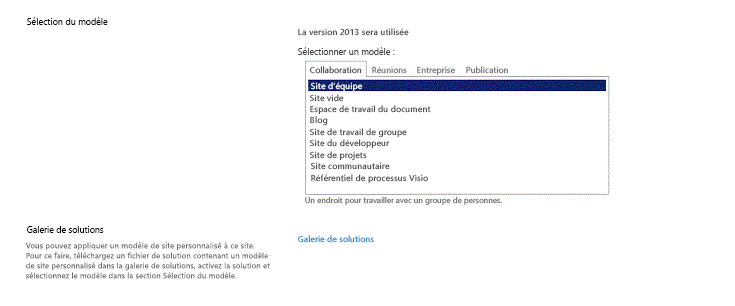

# Configurer un environnement de développement général pour SharePoint 2013
Découvrez les étapes nécessaires pour configurer un environnement de développement SharePoint par l'installation de SharePoint et Visual Studio.
## Déterminer l'environnement de développement SharePoint dont vous avez besoin
<a name="SP15_bk_determinedevenv"> </a>

Vous devez tout d'abord décider de ce que vous souhaitez créer (pour en savoir plus sur les Compléments SharePoint, voir  [Compléments](http://msdn.microsoft.com/library/cd1eda9e-8e54-4223-93a9-a6ea0d18df70%28Office.15%29.aspx)) :
  
    
    

- Si vous souhaitez créer des solutions de batterie de serveurs, la procédure est décrite étape par étape dans cet article.
    
  
- Si vous souhaitez créer des Compléments SharePoint, voir  [Outils et environnement de développement de compléments pour SharePoint](http://msdn.microsoft.com/library/6906eb86-8270-4098-8106-1e8d0d3c212e%28Office.15%29.aspx).
    
  

## Créer un environnement de développement SharePoint sur une machine virtuelle Microsoft Azure
<a name="SP15_bk_devenvazure"> </a>

Si vous avez un abonnement MSDN, vous pouvez configurer rapidement une machine virtuelle dans Azure.
  
    
    
Si vous n'avez pas activé l'avantage Microsoft Azure fourni avec votre abonnement MSDN, vous pouvez en apprendre plus à ce sujet en consultant la page relative aux  [avantages Microsoft Azure pour les abonnés MSDN](http://azure.microsoft.com/fr-fr/pricing/member-offers/msdn-benefits/).
  
    
    

> **REMARQUE**
> La bibliothèque d'images Microsoft Azure ne fournit plus d'images avec SharePoint et Visual Studio préinstallés. Mais une machine virtuelle Microsoft Azure est toujours un bon choix pour un ordinateur de développement. > Connectez-vous au  [portail de gestion Microsoft Azure](https://manage.windowsazure.com). > Créez une machine virtuelle à l'aide d'une des images de la galerie de Windows Server 2008 R2 Service Pack 1 x64, Windows Server 2012 (ou version ultérieure). Suivez les instructions fournies par l'Assistant de création de machine virtuelle. Nous vous recommandons une taille de machine virtuelle **X-Large** pour le développement SharePoint.> Une fois que la machine est configurée et en cours d'exécution, terminez l'installation à l'aide des mêmes procédures que dans la section **Créer un environnement de développement SharePoint sur site** ci-dessous. (Ignorez la section sur l'installation du système d'exploitation.)> Une fois que vous avez configuré votre environnement de développement, vous pouvez accéder au contrôle de code source depuis Visual Studio sur la machine virtuelle en utilisant une connexion Azure de point à site. Voir  [Configuration d'une connexion VPN de point à site à un réseau virtuel](https://azure.microsoft.com/fr-fr/documentation/articles/vpn-gateway-point-to-site-create/) pour obtenir des instructions à ce sujet.
  
    
    


## Créer un environnement de développement SharePoint sur site
<a name="SP15_bk_devenvazure"> </a>


  
    
    

### Installer le système d'exploitation pour l'environnement de développement de vos Compléments SharePoint
<a name="SP15_bk_InstallOS"> </a>

La configuration requise pour un environnement de développement dans une installation SharePoint est moins exigeante que celle requise pour un environnement de production. Dans tout environnement de développement, vous devez utiliser un ordinateur équipé d'une unité centrale avec un système x64 et disposant d'au moins 16 Go de mémoire vive (RAM) pour installer et exécuter SharePoint ; nous recommandons 24 Go de mémoire vive (RAM). En fonction de vos besoins spécifiques et de votre budget, vous pouvez choisir l'une des options suivantes :
  
    
    

- Installez SharePoint sur Windows Server 2008 R2 Service Pack 1 x64 ou Windows Server 2012 (ou version ultérieure).
    
  
- Utilisez Microsoft Hyper-V et installez SharePoint sur un ordinateur virtuel exécutant un système d'exploitation invité Windows Server 2008 R2 Service Pack 1 x64 ou Windows Server 2012. Pour plus d'informations sur la configuration d'un ordinateur virtuel Microsoft Hyper-V pour SharePoint, voir les aspects relatifs à l' [utilisation des configurations recommandées pour les ordinateurs virtuels SharePoint 2013 et l'environnement Hyper-V](http://technet.microsoft.com/fr-fr/library/ff621103%28office.15%29.aspx).
    
  

### Installer les prérequis de développement d'application pour le système d'exploitation et SharePoint 2013
<a name="SP15_bk_prereqsOS"> </a>

SharePoint exige que certains composants prérequis soient installés sur votre système d'exploitation avant le début de l'installation. Pour cette raison, SharePoint inclut l'outil PrerequisiteInstaller.exe qui installe tous les composants prérequis pour vous. Exécutez cet outil avant d'exécuter l'outil Setup.exe.
  
    
    

1. Exécutez l'outil PrerequisiteInstaller.exe.
    
  
2. Exécutez l'outil Setup.exe inclus dans vos fichiers d'installation.
    
  
3. Acceptez les termes du contrat de licence logiciel Microsoft.
    
  
4. Dans la page **Choisir le type d'installation**, sélectionnez **Autonome**.
    
   **Figure 2. Choix du type d'installation**

  


  

  

  
5. Si une erreur se produit au cours de l'installation, vérifiez le fichier journal. Pour trouver le fichier journal, ouvrez une fenêtre de Ligne de commande, puis tapez les commandes suivantes dans l'invite de commande. Un lien vers le fichier journal s'affiche aussi quand l'installation est terminée.
    
  ```
  
cd %temp
dir /od *.log
  ```

6. Une fois l'installation terminée, vous êtes invité à démarrer l'Assistant Configuration des produits et des technologies SharePoint.
    
    > **REMARQUE**
      > L'Assistant Configuration des produits et des technologies SharePoint peut échouer si vous utilisez un ordinateur associé à un domaine, mais non connecté à un contrôleur de domaine. Si vous constatez cet échec, connectez-vous à un contrôleur de domaine directement ou par l'intermédiaire d'une connexion à un réseau privé virtuel (VPN) ou connectez-vous à un compte local doté de privilèges administrateur sur l'ordinateur. 
7. Une fois l'Assistant de configuration terminé, vous voyez la page **Sélection du modèle** du nouveau site SharePoint.
    
   **Figure 3. Choix de la page du modèle de site**

  


  

  

  

### Installer Visual Studio
<a name="SP15_bk_installVS"> </a>

Lorsque vous installez Visual Studio, vous disposez de tous les modèles, outils et assemblys nécessaires au développement de SharePoint sur votre ordinateur de développement local.
  
    
    
Voir  [Installation de Visual Studio](http://msdn.microsoft.com/fr-fr/library/e2h7fzkw%28v=vs.110%29.aspx) pour obtenir des instructions sur l'installation de Visual Studio.
  
    
    

#### Journalisation détaillée dans Visual Studio

Si vous souhaitez activer la journalisation détaillée, procédez comme suit :
  
    
    

1. Ouvrez le Registre et accédez à **HKEY_CURRENT_USER\\Software\\Microsoft\\VisualStudio\\ _nn.n_\\SharePointTools**, où _nn.n_ est la version de Visual Studio, par exemple 12.0 ou 14.0.
    
  
2. Ajoutez une clé DWORD appelée **EnableDiagnostics**.
    
  
3. Attribuez la valeur **1** à la clé.
    
  
Le chemin d'accès au registre sera modifié dans les futures versions de Visual Studio.
  
    
    

## Étapes suivantes
<a name="SP15_bk_devenvazure"> </a>

Si vous souhaitez créer des workflows, passez à  [Installer et configurer le Gestionnaire de workflow SharePoint 2013](set-up-and-configure-sharepoint-2013-workflow-manager.md).
  
    
    

## Ressources supplémentaires
<a name="SP15_bk_AddlResources"> </a>


-  [Installation de Visual Studio](http://msdn.microsoft.com/fr-fr/library/e2h7fzkw%28v=vs.110%29.aspx)
    
  
-  [Outils et environnement de développement de compléments pour SharePoint](http://msdn.microsoft.com/library/6906eb86-8270-4098-8106-1e8d0d3c212e%28Office.15%29.aspx)
    
  

  
    
    

