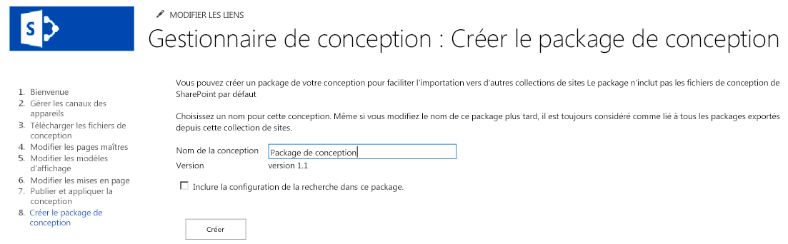

# Packages de conception du Gestionnaire de conception SharePoint 2013
Découvrez comment créer et exporter la conception visuelle d'une collection de sites SharePoint en tant que package.
## Vue d'ensemble des packages de conception

DansSharePoint 2013, le Gestionnaire de conception peut aider les développeurs et les concepteurs web à créer et à exporter la conception visuelle d'une collection de sites SharePoint sous forme de package. Ce package peut facilement être distribué aux clients ou à d'autres groupes, pour qu'ils l'installent sur leurs collections de sites. Cette nouvelle fonctionnalité réduit la complexité du transport des conceptions et facilite aux clients l'externalisation de la conception visuelle de leurs sites. Voici par exemple quelques scénarios d'utilisation :
  
    
    

- **Nouvelle conception**: une entreprise dont les capacités de conception web sont limitées peut s'adresser à une agence pour actualiser son site SharePoint, avec une interprétation plus moderne. Cette agence peut créer le site et en placer le contenu dans un package pour qu'il puisse être facilement importé sur la batterie de serveurs SharePoint de l'entreprise.
    
  
- **Publication intersites**: le département informatique d'une entreprise utilisant la publication intersites dans SharePoint 2013 souhaite partager la même conception visuelle dans plusieurs collections de sites. Il crée le site en interne et souhaite disposer d'un moyen simple pour transposer la nouvelle conception sur plusieurs sites web SharePoint. La fonctionnalité de package de conception du Gestionnaire de périphériques permet de les exporter et de les importer, avec un minimum de complexité et d'implications administratives.
    
  
Cet article peut vous aider à comprendre la création de packages de conception dans SharePoint 2013. Il contient un aperçu de la création des packages et offre des conseils sur les flux de travail d'exportation et d'importation des packages. Il présente également les autorisations nécessaires pour chaque opération et détaille l'architecture des packages de conception.
  
    
    

## Création d'un package de conception

L'utilisateur crée un package de conception, appelé package de solution SharePoint (fichier .wsp) sur son site SharePoint, par le biais du Gestionnaire de conception, dans **Paramètres du site**. L'étape de création du package suit les autres étapes du Gestionnaire de conception pour la personnalisation et la publication d'un site SharePoint, notamment le téléchargement des fichiers de conception, la création d'une page maître et la modification des mises en page. Une fois le site publié, le processus de création du fichier .wsp pour l'exportation est relativement simple.
  
    
    
La Figure 1 présente l'option du Gestionnaire de conception permettant de nommer et de créer le package de conception.
  
    
    

**Figure 1. Exportation d'un package de conception**

  
    
    

  
    
    

  
    
    
Vous pouvez également importer un package de conception depuis une autre collection de sites SharePoint 2013 par le biais du Gestionnaire de conception dans la page d'accueil ou bien en choisissant **Importer un package de conception** dans **Paramètres du site**.
  
    
    

    
> **REMARQUE**
> Pour plus d'informations sur le Gestionnaire de conception et sur le processus de publication, voir  [Vue d'ensemble du gestionnaire de conception dans SharePoint 2013](overview-of-design-manager-in-sharepoint-2013.md). 
  
    
    

Une case à cocher permet d'inclure la configuration de la recherche dans le package de conception. Vous pouvez choisir cette option si vous concevez un site et que vous créez des résultats de recherche conditionnels ou bien pour contrôler l'expérience de recherche. Cette configuration contient des éléments comme les règles de requête, l'origine des résultats, les types de résultats, et les schémas et modèles de classement. Pour vous assurer que l'importation de la configuration de recherche n'échoue pas, aucun nom d'élément de la configuration de recherche ne doit exister en double. Par exemple, si vous avez une règle de requête dans une collection de sites appelée **SampleQueryRule** et que vous l'importez dans une autre collection de sites avec une règle existante nommée **SampleQueryRule**, l'importation de la configuration de recherche échoue. Pour éviter cela, vous pouvez renommer ou supprimer la règle de requête dans la source ou dans la cible. Les origines des résultats, ainsi que le schéma, doivent également porter des noms uniques. Si vous souhaitez inclure une configuration de recherche dans votre package de conception, vous devez activer les fonctionnalités suivantes au niveau du site sous **Gérer les fonctionnalités du site** avant d'exporter le package de conception :
  
    
    

- Types de contenus de données de configuration de la recherche
    
  
- Colonnes de site de données de configuration de la recherche
    
  
- Fonctionnalité d'instance de liste de configuration de la recherche
    
  
- Fonctionnalité de modèle de configuration de la recherche
    
  
Si vous souhaitez que votre conception soit publiée sur la cible, vous devez publier tous les éléments de conception ou désactiver le contrôle des versions principales dans des bibliothèques de conception de la source d'exportation. Le Gestionnaire de conception exporte uniquement la version la plus récente de chaque ressource. Par exemple, si vous disposez de la version 1.1 de la page maître sur la source, celle-ci est copiée vers la cible sous forme de brouillon. Mais la version 1.0 n'est pas copiée. De même, les fichiers actuellement extraits ne sont pas exportés.
  
    
    

## Exportation et importation d'un package de conception

Vous pouvez aborder le flux de travail de création de package de plusieurs façons, votre approche dépendant en grande partie de vos objectifs et des ressources de conception disponibles. Vous pouvez décider de confier la conception à une agence externe ou bien réaliser le travail en interne si vous disposez des ressources nécessaires. Le Tableau 1 contient un exemple de flux de travail entre un client et une agence pour la conception, l'exportation et l'importation du package de conception. Il contient également les autorisations requises pour les opérations de conception et de création du package.
  
    
    

**Tableau 1. Exemple de flux de travail de package de conception**

|**Étape**|**Opération**|**Description**|
|:-----|:-----|:-----|
|1    |Le client fait appel à une agence pour créer la conception visuelle.    | L'agence crée le site en fonction des besoins définis par le client.   > **REMARQUE**>  L'agence doit disposer du niveau d'autorisation **Designers** pour utiliser le Gestionnaire de conception et créer et exporter des packages. Plus spécifiquement, l'autorisation **Design** permet l'affichage, l'ajout, la mise à jour, la suppression, l'approbation et la personnalisation des modèles visuels.          |
|2    |L'agence exporte la conception visuelle dans un package de conception.    | Elle exporte le package de solution SharePoint (fichier .wsp) après avoir terminé les autres étapes de personnalisation et de publication.    Le package de conception est remis au client au moyen d'un canal sécurisé.   |
|3    |Le client importe la conception visuelle dans la collection de sites SharePoint 2013 spécifiée.    | Le client reçoit le package de conception au moyen d'un canal sécurisé.    Dans la page d'accueil du Gestionnaire de conception ou en choisissant **Importer un package de conception** dans **Paramètres du site**, le client importe le fichier .wsp et applique le package de conception à la collection de sites spécifiée.    > **REMARQUE**>  Le client doit disposer du niveau d'autorisation **Designers** pour utiliser le Gestionnaire de conception et importer des packages.          |
   

## Contenu du package de conception

Le fichier .wsp du package de conception contient plusieurs fichiers lorsqu'il est créé via le Gestionnaire de conception. Le processus exporte les fichiers de différentes listes et bibliothèques pour former le package global. Lors de l'importation dans une collection de sites, ces fichiers sont distribués dans différents emplacements en fonction de leur type. Le tableau 2 présente l'emplacement et les types de fichiers exportés pendant le processus d'assemblage.
  
    
    

**Tableau 2. Résumé du contenu du package de conception et emplacements d'exportation des fichiers**

|**Emplacement de l'exportation**|**Éléments exportés**|
|:-----|:-----|
|Bibliothèques de documents    | Galerie de pages maîtres    Galerie des thèmes    Bibliothèque de styles    Bibliothèque d'éléments de site   |
|Types de contenu, champs    | Types de contenu qui héritent du type de contenu Page   |
|Listes    | Galerie de conceptions    Présentations composées    Canaux d'appareils   |
   

> **REMARQUE**
> Dans SharePoint 2013, seuls les fichiers personnalisés sont inclus dans les packages de conception. Le processus de création du package n'exporte pas la plupart des fichiers système non personnalisés par défaut. 
  
    
    

Dans SharePoint 2013, vous ne pouvez pas désinstaller un package de conception importé et vous ne devez jamais essayer de désactiver un package de conception par le biais de la galerie de solutions. Si vous le faites, les types de contenu de mise en page sont supprimés et les utilisateurs risquent de ne pas être en mesure de créer des sous-sites. Pour effectuer la restauration à partir de cet état, vous devez appliquer les étapes suivantes où le site A est la collection de sites d'origine, le site B est la collection de sites avec le package de conception désactivé (mauvais état) et le site C est une collection de sites vide que vous avez créée :
  
    
    

1. Exporter un package de conception depuis le site A
    
  
2. Importer le package de conception dans le site C
    
  
3. Exporter un package de conception depuis le site B
    
  
4. Importer le package de conception dans le site C
    
  
5. Exporter le package de conception depuis le site C
    
  
6. Importer le package de conception dans le site B
    
  
Tous les canaux des appareils créés et leurs configurations sont également importés lors de l'importation du package de conception. Toutefois, vous devrez réassocier les pages maîtres pour les canaux spécifiés, car ces mappages ne seront pas configurés.
  
    
    
Lorsque vous importez un package de conception, aucune URL CSS de remplacement n'est définie, même si elle était configurée dans la source de l'exportation. Les classes CSS doivent être stockées dans un fichier externe dans la galerie de pages maîtres et non dans le fichier de page maître lui-même.
  
    
    

## Ressources supplémentaires

-  [Développer la conception de site dans SharePoint 2013](develop-the-site-design-in-sharepoint-2013.md)
    
  
-  [Vue d'ensemble du gestionnaire de conception dans SharePoint 2013](overview-of-design-manager-in-sharepoint-2013.md)
    
  
-  [Nouveautés du développement de sites SharePoint 2013](what-s-new-with-sharepoint-2013-site-development.md)
    
  
