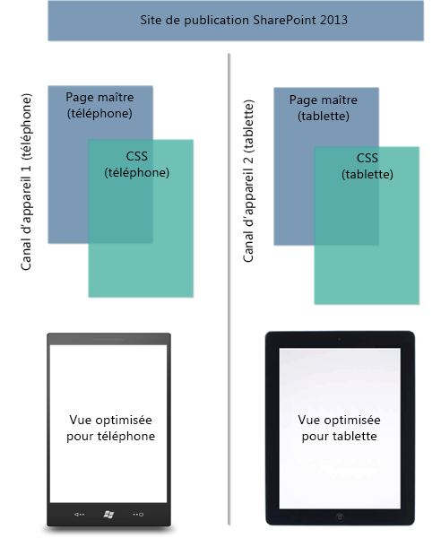
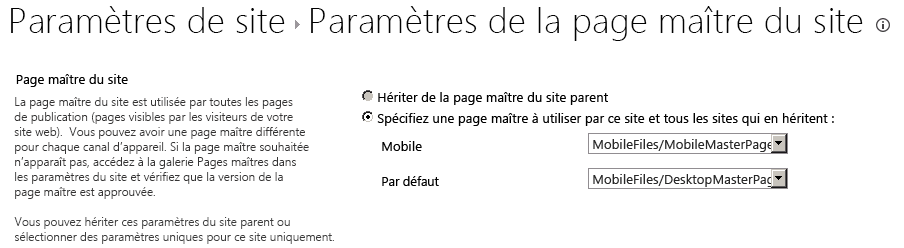

# Canaux d'appareils du Gestionnaire de conception SharePoint 2013
Découvrez comment planifier et configurer des canaux d'appareils sur un site SharePoint 2013.
## Présentation des canaux d'appareils
<a name="Int"> </a>

La navigation sur le web via un appareil mobile est maintenant tellement répandue qu'un site SharePoint doit être optimisé pour une bonne lisibilité et une facilité d'utilisation sur des smartphones et autres appareils mobiles tels que des tablettes. Avec des canaux d'appareils dans SharePoint 2013, vous pouvez restituer un site de publication unique de plusieurs manières à l'aide de diverses conceptions qui ciblent différents appareils. Cet article vous aide à planifier l'utilisation de la fonctionnalité des canaux d'appareils dans SharePoint 2013. Il propose une présentation détaillée de la fonctionnalité elle-même et fournit les informations nécessaires à la création d'un canal d'appareil. En outre, après avoir lu cet article, vous saurez quels canaux d'appareils implémenter et comment les mettre en œuvre.
  
    
    
Les canaux d'appareils sont disponibles uniquement pour les sites de publication SharePoint 2013. Avant d'implémenter des canaux d'appareils, vous devez avoir une connaissance générale des composants d'un site SharePoint, de la façon dont une page SharePoint est constituée et du gestionnaire de conception. Pour plus d'informations sur le modèle de page SharePoint, y compris les pages maîtres et les mises en page, consultez  [Vue d'ensemble du modèle de page SharePoint 2013](overview-of-the-sharepoint-2013-page-model.md). Pour plus d'informations sur le gestionnaire de conception, consultez  [Vue d'ensemble du gestionnaire de conception dans SharePoint 2013](overview-of-design-manager-in-sharepoint-2013.md).
  
    
    

## Qu'est-ce qu'un canal d'appareil ?
<a name="WhatDev"> </a>

Un canal d'appareil fait partie de l'infrastructure de publication SharePoint 2013 qui vous permet d'afficher certains contenus de site, de choisir le style de votre contenu et même de modifier des images, tout en conservant la même URL dans un pool de différents appareils. Par rapport à la version de bureau du site SharePoint, le rendu sur un appareil mobile peut être mis en forme avec une plus petite largeur, bénéficier d'une meilleure navigation avec des cibles tactiles plus larges et afficher un nombre réduit d'informations pour une utilisation plus facile. Vous pouvez créer un site unique, ainsi que créer et modifier le contenu une seule fois pour l'ensemble de vos différents appareils mobiles. Lorsqu'un utilisateur parcourt un site SharePoint à partir d'un appareil mobile tel qu'un smartphone ou une tablette, le navigateur mobile envoie au site une requête HTTP GET qui comprend une chaîne d'agent utilisateur. Cette chaîne contient des informations sur le type d'appareil qui tente d'accéder au site. En fonction de la sous-chaîne de cet appareil, le navigateur de l'appareil peut être redirigé vers un affichage de la page maître spécifique. Par exemple, pour un ensemble d'appareils Windows Phone et iPad, vous pouvez offrir à chaque pool un rendu unique du site de publication SharePoint, à l'aide de canaux d'appareils. À chacun de ces canaux d'appareils peut être attribuée une page maître différente, et donc un fichier CSS différent, pour offrir aux utilisateurs une expérience d'affichage optimale. La figure 1 illustre l'utilisation de deux canaux d'appareils permettant de fournir deux rendus de site uniques pour un téléphone et une tablette.
  
    
    
Figure 1. Utilisation de canaux d'appareils sur différentes plateformes d'appareils
  
    
    

  
    
    

  
    
    
Vous pouvez créer et configurer un canal d'appareil à partir du menu **Paramètres du site** sous la section **Apparence**, ou également via l'option **Gestionnaire de conception** dans la même section. Lorsque vous créez un élément de canal d'appareil, il existe cinq champs obligatoires et facultatifs à remplir. Le tableau 1 répertorie ces champs et décrit le type d'informations à fournir.
  
    
    

**Tableau 1. Champs obligatoires et facultatifs pour la création d'un canal d'appareil**


|**Champ**|**Valeur obligatoire**|**Valeur**|
|:-----|:-----|:-----|
|Nom  <br/> |Oui  <br/> |Il s'agit du nom de votre canal de conception. Il peut s'agir d'un nom convivial qui permet d'identifier le canal.  <br/> |
|Alias  <br/> |Oui  <br/> |Le nom d'alias permet d'identifier votre canal d'appareil dans le code, les volets Canaux d'appareils (présentés plus loin dans cet article), les aperçus et les autres contextes.  <br/> > **IMPORTANTE**> Si vous modifiez ultérieurement l'alias de canal, vous devez manuellement mettre à jour les mappages de la page maître, les volets Canaux d'appareils et tout balisage ou code personnalisé.           |
|Description  <br/> |Non  <br/> |Champ de description générale du canal d'appareil.  <br/> |
|Règles d'inclusion des appareils  <br/> |Oui  <br/> |Un champ pour fournir la sous-chaîne d'agent utilisateur comme Windows Phone OS. La redirection de l'appareil vers une page maître spécifique dépend de ce qui est saisi pour cette valeur. Pour plus d'informations sur les valeurs à fournir dans ce champ, voir la section  [Sous-chaînes d'agent utilisateur et classements des canaux d'appareils](#PlanDeviceChannels_UserAgentSubstrings) dans cet article. <br/> |
|Actif  <br/> |Non  <br/> |La sélection de cette case à cocher active votre canal d'appareil. Si vous travaillez sur un site actif, vous ne devez pas activer le canal avant d'avoir terminé sa création. Pour les tests, vous pouvez utiliser la chaîne de requête  `?DeviceChannel=alias` d'un navigateur afin d'afficher un aperçu de votre site pour une chaîne spécifique. <br/> |
   

  
    
    

    
> **REMARQUE**
> Pour plus d'informations et pour connaître les étapes à suivre pour la création d'un canal d'appareil, consultez la section  [Créer un canal d'appareil](sharepoint-2013-design-manager-device-channels.md#create) de cet article.
  
    
    

Une fois un canal d'appareil créé et activé, la redirection de l'appareil vers une page maître spécifique, par exemple une version mobile, est possible. L'étape suivante consiste à spécifier la page maître qui doit être affichée pour les appareils mobiles au niveau du site, via les **Paramètres de la page maître du site** ou à l'aide de l'option **Publier et appliquer** dans le gestionnaire de conception.
  
    
    

**Figure 2. Définition des pages maîtres pour l'affichage d'appareil mobile et l'affichage d'ordinateur de bureau par défaut**

  
    
    

  
    
    

  
    
    
Comme indiqué dans la figure 2, vous pouvez attribuer une page maître spécifique pour un affichage d'ordinateur de bureau standard du site et une page maître mobile pour la redirection d'appareil. Le rendu des pages maîtres mobiles ou par défaut dépend du canal d'appareil actif configuré. Plus précisément, cela dépend de la sous-chaîne de règle d'inclusion des appareils indiquée dans le processus de création des canaux d'appareils.
  
    
    

### Sous-chaînes d'agent utilisateur et classements des canaux d'appareils
<a name="PlanDeviceChannels_UserAgentSubstrings"> </a>

Lorsque vous créez un canal d'appareil, vous êtes invité à fournir une sous-chaîne d'agent utilisateur qui est responsable de la redirection de l'appareil vers une page maître spécifiée. Si vous ne renseignez pas cette valeur dans le champ **Règles d'inclusion des appareils**, la redirection de l'appareil n'est pas possible et le canal ne peut pas être créé. Le tableau 2 fournit certains exemples de valeurs de sous-chaînes d'agent utilisateur qui peuvent être utilisées lorsque vous créez un canal d'appareil.
  
    
    

**Tableau 2. Exemples de valeurs de sous-chaînes d'agent utilisateur**


|**Appareil**|**Sous-chaînes d'agent utilisateur**|
|:-----|:-----|
|Windows Phone  <br/> | Système d'exploitation Windows Phone 7.5 (spécifique des téléphones Windows Phone 7.5). <br/>  Système d'exploitation Windows Phone (sous-chaîne générique pour toutes les versions de Windows Phone). <br/> |
|iPhone  <br/> |iPhone  <br/> |
|iPad  <br/> |iPad  <br/> |
|Android  <br/> |Android  <br/> |
   
Dans le champ **Règles d'inclusion des appareils**, ajoutez simplement les valeurs de sous-chaîne ou les valeurs pour les appareils que vous souhaitez inclure.
  
    
    

> **IMPORTANTE**
> Les valeurs de sous-chaîne d'agent utilisateur diffèrent d'un fabricant d'appareils à l'autre, et même entres plusieurs appareils de même marque, comme indiqué ci-dessus avec Windows Phone. Pour effectuer la redirection du trafic vers un pool spécifique, vous devez fournir un identificateur unique pour la sous-chaîne d'agent utilisateur. Pour plus d'informations sur la manière d'isoler une sous-chaîne entre différents appareils, consultez la section  [Planifier des canaux d'appareils](sharepoint-2013-design-manager-device-channels.md#plan) de cet article.
  
    
    

Une fois créés, les canaux d'appareils sont triés et stockés dans une liste. Il est possible de prendre en charge jusqu'à 10 canaux d'appareils par site dans SharePoint 2013, de sorte qu'il peut être nécessaire de classer vos canaux pour un routage correct du trafic. Vous devez classer les règles les plus spécifiques avec une priorité plus élevée. Par exemple, vous pouvez avoir plusieurs versions de système d'exploitation pour les appareils Windows Phone dans votre organisation et souhaiter donc un rendu de page maître unique pour les appareils Windows Phone 7.5. Tous les autres appareils Windows Phone doivent recevoir un autre affichage de la page maître mobile. Le tableau 3 présente les deux modèles de classement pouvant être appliqués, ainsi que les effets sur la décision de routage.
  
    
    

> **REMARQUE**
> Pour plus d'informations sur la réorganisation des canaux d'appareils, consultez la section  [Créer un canal d'appareil](sharepoint-2013-design-manager-device-channels.md#create) de cet article.
  
    
    


**Tableau 3. Exemple d'organisation des canaux d'appareils**


|**Organisation 1 (Canaux d'appareils)**|**Organisation 2 (Canaux d'appareils)**|
|:-----|:-----|
|Canal d'appareil 1 -- Système d'exploitation Windows Phone 7.5  <br/> |Canal d'appareil 1 -- Système d'exploitation Windows Phone  <br/> |
|Canal d'appareil 2 -- Système d'exploitation Windows Phone  <br/> |Canal d'appareil 2 -- Système d'exploitation Windows Phone 7.5  <br/> |
|Canal d'appareil 3 -- Valeur par défaut  <br/> |Canal d'appareil 3 -- Valeur par défaut  <br/> |
   
Si vous choisissez l'organisation 1, dans laquelle la sous-chaîne de règles d'inclusion des appareils est définie sur **Windows Phone OS 7.5**, un utilisateur accédant à votre site avec un appareil Windows Phone 7.5 est dirigé vers le canal d'appareil 1. Un utilisateur avec une autre version de Windows Phone est dirigé vers le canal d'appareil 2, et tout utilisateur non Windows Phone reçoit le canal 3. Toutefois, si vous choisissez l'organisation 2, qui donne la priorité à la sous-chaîne de système d'exploitation Windows Phone générique, tout le trafic de Windows Phone est dirigé vers le canal d'appareil 1. Le canal d'appareil 2 n'est pas appelé pour les appareils Windows Phone 7.5 en raison de la hiérarchisation et de la nature générique du canal d'appareil 1. Si vous créez plusieurs canaux, il est important de comprendre les effets de l'organisation et du classement sur la redirection du trafic pour vos pools d'appareils.
  
    
    

> **REMARQUE**
> Pour plus d'informations et pour connaître les étapes à suivre pour l'organisation des canaux d'appareils, consultez la section  [Modifier l'ordre des canaux des appareils](sharepoint-2013-design-manager-device-channels.md#reorder) de cet article.
  
    
    


### Volets Canaux des appareils
<a name="PlanDeviceChannels_UserAgentSubstrings"> </a>

Un volet Canaux des appareils est un conteneur qui peut être utilisé sur une page maître ou une mise en page lorsque vous souhaitez que du contenu spécifique soit affiché en fonction de l'alias d'un canal d'appareil, ou d'un ensemble de canaux. Par exemple, vous avez un composant WebPart ou un contrôle que vous souhaitez faire figurer uniquement sur l'affichage de l'ordinateur de bureau du site et non sur un appareil mobile. Le volet Canaux des appareils vous permet d'encapsuler ce composant WebPart dans le code et de l'afficher uniquement via un canal d'appareil désigné. Le principal avantage des volets Canaux des appareils lors de l'utilisation de  `Display:None` dans une classe CSS repose sur le fait que le contenu à l'intérieur d'un volet Canaux des appareils n'apparaît pas du tout sur les canaux non spécifiés. En outre, les volets Canaux des appareils permettent de réduire la taille de rendu d'une page pour les appareils, en supprimant le contenu volumineux. Vous pouvez ainsi augmenter la réactivité du site sur les appareils à bande passante limitée.
  
    
    
Lorsque vous affichez l'aperçu d'une page maître ou de la mise en page, un extrait de code du volet Canaux des appareils peut être généré à partir de la galerie d'extraits de code. L'exemple de code HTML suivant montre comment créer un volet Canaux des appareils. Dans ce scénario, un paragraphe de texte est inséré et doit être rendu uniquement pour un canal d'appareil spécifique. L'attribut **IncludedChannels** vous permet de spécifier l'alias de votre canal d'appareil configuré. Là encore, un alias est un nom qui est attribué au cours du processus de création de canal d'appareil et qui peut être référencé dans votre code.
  
    
    

  
    
    


```HTML

<div data-name="DeviceChannelPanel">
 <!--CS: Start device channel panel snippet.-->
<!--SPM:<%@Register Tagprefix="Publishing" Namespace="Microsoft.SharePoint.Publishing.WebControls" Assembly="Microsoft.SharePoint.Publishing, Version=15.0.0.0, Culture=neutral, PublicKeyToken=62TDCXXXXXXXXXX
<!--MS:<Publishing:MobilePanel runat="server" IncludedChannels="DEFAULT">-->
<p>
This paragraph of content shows up only in the default channel, which means that you can use the same page layout for all your different devices. You can put HTML content, page fields, web parts, or CSS/JavaScript links within a device channel panel so that the content loads only on your specified channels.
</p>
<!--ME:</Publishing:MobilePanel>-->
<!--CE: End Device Channel Panel Snippet-->
</div>
```

Si vous souhaitez que le contenu soit affiché sur plusieurs canaux, les alias doivent être séparés par des virgules à l'intérieur des guillemets :  `IncludedChannels="alias1, alias2"`. Pour plus d'informations sur le conteneur de volet Canaux des appareils, consultez la rubrique  [Vue d'ensemble du modèle de page SharePoint 2013](overview-of-the-sharepoint-2013-page-model.md). Pour plus d'informations sur l'utilisation d'extraits de code de gestionnaire de conception, consultez la rubrique  [Extraits de code du Gestionnaire de conception SharePoint 2013](sharepoint-2013-design-manager-snippets.md).
  
    
    

## Planifier des canaux d'appareils
<a name="plan"> </a>

Il existe plusieurs questions et éléments qui doivent être collectés et obtenir des réponses avant l'implémentation des canaux d'appareils dans votre organisation. Cette section vous permet de planifier l'utilisation des canaux d'appareils en posant des questions pertinentes sur vos besoins en matière d'appareil et de convivialité. Elle vous offre également des conseils sur l'utilisation de cette fonctionnalité. Les questions de cette section sont prévues pour être lues dans l'ordre, et non indépendamment les unes des autres.
  
    
    

### Comment utiliser le site sur l'ordinateur de bureau et sur mes appareils ?

Comme la plupart des organisations, vous devez faire face à des exigences d'utilisation uniques en fonction des besoins de votre organisation. L'objectif idéal est de s'assurer que cette expérience est traduite de manière optimale pour tout type de facteur de forme, un ordinateur de bureau comme un appareil mobile. Toutefois, malgré cette vaste généralisation, ce processus est toujours très complexe, en particulier lorsque vous travaillez avec différentes résolutions et une zone d'écran réduite pour l'interaction tactile. Peut-être que certains téléphones nécessitent également une personnalisation de l'interface utilisateur unique à laquelle d'autres appareils ne peuvent pas ou ne doivent pas accéder. Le développement web peut être difficile dans ce type de cas et plus encore si vous ne pouvez pas profiter de l'affectation d'une page maître unique pour plusieurs marques d'appareils.
  
    
    
La première tâche consiste à noter ce qui doit être accompli d'un point de vue fonctionnel afin de créer une expérience utilisateur réussie sur plusieurs appareils. Que veulent pouvoir faire les utilisateurs avec votre site de publication SharePoint 2013 sur leur ordinateur, téléphone ou tablette ? Vous pouvez rencontrer différents problèmes, y compris des limitations possibles et les paramètres propres à chaque appareil qui doivent être pris en compte. Enregistrez toutes ces informations dans un format quelconque. Cela vous permettra de comprendre les objectifs spécifiques à mettre en place avec la fonctionnalité des canaux d'appareils et vous aidera à répondre aux questions inhérentes répertoriées ci-dessous, à savoir quels sont les appareils à prendre en charge et combien de canaux d'appareils implémenter.
  
    
    
En outre, il est important de mémoriser certaines fonctions clés fournies par la fonctionnalité des canaux d'appareils qui peuvent résoudre divers problèmes de planification. Les exemples incluent la prise en charge de plusieurs canaux d'appareils pour les mappages de pages maîtres uniques sur plusieurs appareils. En outre, l'utilisation des volets Canaux des appareils pour afficher de manière sélective différents éléments de contenu sur différents pools d'appareils.
  
    
    

### De combien de canaux d'appareils avez-vous besoin ?

Vous pouvez disposer de 10 canaux maximum, y compris la valeur par défaut configurée sur un site spécifique pour une installation locale, et d'un total de deux canaux d'appareils lorsque vous utilisez SharePoint Online. Pour votre organisation, il est très facile de créer un canal d'appareil unique, d'appliquer plusieurs règles d'inclusion d'appareils représentant tous les appareils et de rediriger vers une page maître spécifique. Idéalement, il est préférable de disposer d'aussi peu de canaux que possible. Cependant, en fonction des différents appareils ou de la personnalisation HTML/CSS unique, n'avoir qu'un seul canal est inenvisageable, et des canaux supplémentaires peuvent être requis.
  
    
    
Pour déterminer le nombre de canaux d'appareils, vous devez référencer les informations collectées sur vos objectifs de site entre les différents appareils, les appareils que vous envisagez de prendre en charge et le niveau de personnalisation requis à partir des questions précédentes. Avec ces informations, créez une liste des canaux que vous souhaitez implémenter. Une page maître mobile attribuée à un canal d'appareil peut-elle répondre à toutes les conditions requises ? Ou une association de page maître distincte est-elle nécessaire pour les tablettes, ce qui implique donc plusieurs canaux ? C'est également le bon moment pour nommer vos canaux, et réfléchir à un nom d'alias approprié pour chaque canal, afin qu'ils puissent tous être référencés dans le code. Si vous modifiez l'alias de canal ultérieurement, vous devrez mettre à jour toutes les références.
  
    
    

### Où trouver une liste de toutes les sous-chaînes d'appareils que je peux utiliser ?

Il existe des sous-chaînes d'agent utilisateur de fabricant générique que vous pouvez utiliser pour la redirection des appareils, comme le système d'exploitation Windows Phone ou iPhone, comme indiqué dans le tableau 2. La sous-chaîne nécessaire dans le champ **Règles d'inclusion des appareils** est généralement un sous-ensemble de la chaîne d'agent utilisateur supérieure fournie lorsque l'appareil se connecte au site. Il est recommandé de rechercher une chaîne spécifique de l'appareil en la localisant sur le site web du fabricant ou du fournisseur de logiciel, ou via une recherche générale sur le web. Parfois une sous-chaîne spécifique de version gérée peut être difficile à isoler étant donné les similitudes dans la construction de la chaîne d'agent utilisateur. Le tableau 4 fournit deux exemples de chaînes d'agent utilisateur, pour un ordinateur Windows 8 et une tablette.
  
    
    

> **REMARQUE**
> Les chaînes ci-dessous sont des exemples et non des chaînes authentiques pour les appareils Windows décrits. Elles sont fournies pour illustrer l'isolation d'une sous-chaîne si nécessaire. 
  
    
    


**Tableau 4. Différenciation de chaînes d'agent utilisateur**


|**Appareil**|**Chaîne de l'agent utilisateur**|
|:-----|:-----|
|Ordinateur Windows 8  <br/> |(compatible ; MSIE 10.0 ; Windows NT 6.2 ; WOW64 ; Trident/6.0)  <br/> |
|Tablette Windows 8 (exemple)  <br/> |(compatible ; MSIE 10.0 ; Windows NT 6.2 ; WOW64 ; Trident/6.0 ; tactile)  <br/> |
   
Ces chaînes ont un format similaire. La seule différence repose sur l'inclusion de  `touch` pour l'exemple d'une tablette Windows 8. Pour ce scénario, si vous souhaitez un rendu de page maître spécifique pour la tablette, vous pouvez indiquer `touch` en tant que sous-chaîne lorsque vous créez une règle d'inclusion des appareils. Dans des situations de ce type, la solution consiste à trouver un point de différenciation entre des chaînes similaires. Si vous deviez créer un canal d'appareil avec une règle d'inclusion des appareils à l'aide d'une valeur commune comme **MSIE 10.0**, il y n'aurait aucun moyen de faire la distinction entre l'ordinateur et la tablette.
  
    
    

### Dois-je utiliser les volets Canaux des appareils ?

Non. Les volets Canaux des appareils sont utiles lorsque vous souhaitez autoriser, ajuster ou empêcher le rendu d'un élément d'interface utilisateur différemment selon les appareils. Par exemple, vous voulez qu'un texte ou une commande apparaisse sur iPhone mais vous ne voulez pas que cet élément apparaisse sur un appareil Android, peut-être parce que le facteur de forme a une taille d'écran inférieure et sa facilité d'utilisation en serait affectée. Quelle que soit la raison de votre choix, les volets Canaux des appareils peuvent être attribués à un alias d'un canal d'appareil créé et fournir la flexibilité nécessaire à ce niveau de différenciation. Il est logique de se demander s'il existe une raison de ne pas appliquer une page maître unique à un groupe d'appareils différents dans une organisation. Dans ce cas, un volet Canaux des appareils représente la meilleure option pour obtenir une expérience de développement plus détaillée qui convient aux besoins liés à l'appareil. De même, vous pouvez utiliser les volets Canaux des appareils pour ajouter des feuilles CSS propres au canal pour les mises en page.
  
    
    

### Puis-je utiliser des cookies pour sélectionner un canal d'appareil ?

Oui, vous pouvez forcer ou remplacer la sélection de canal d'appareil au moyen de cookies. Pour ce faire, vous devez créer un cookie de navigateur nommé deviceChannel et lui fournir l'alias de votre canal d'appareil spécifié. Les canaux d'appareils peuvent également définir une variable JavaScript appelée **effectiveDeviceChannel** qui contient l'alias de canal actuel. Cette variable peut être utilisée pour afficher le canal est en cours d'utilisation. Pour que votre site émette la variable JavaScript, ajoutez cette propriété sur le conteneur des propriétés web racine :
  
    
    

```

key = PublishingInformationControlIncludeEffectiveDeviceChannel, value = true
```

Cette variable peut également servir à influer sur le rendu du contenu et des composants WebPart, sur une page.
  
    
    

## Créer un canal d'appareil
<a name="create"> </a>

Utilisez cette procédure pour créer un canal d'appareil.
  
    
    

### Pour créer un canal d'appareil


1. Démarrez le gestionnaire de conception. (Par exemple, dans le menu **Paramètres**, choisissez **Gestionnaire de conception**.)
    
  
2. Dans la liste numérotée, sélectionnez **Gérer les canaux des appareils**.
    
  
3. Dans le gestionnaire de conception, sur la page Gérer les canaux des appareils, choisissez **Créer un canal**.
    
  
4. Sur la page Canaux des appareils - Nouvel élément, dans la zone de texte **Nom**, entrez un nom pour le canal d'appareil.
    
  
5. Dans la zone de texte **Alias**, entrez un alias pour le canal d'appareil. L'alias doit contenir des caractères alphanumériques et ne peut pas contenir d'espaces. Vous utiliserez l'alias pour faire référence au canal d'appareil dans le code et dans d'autres contextes.
    
  
6. Dans la zone de texte **Description**, entrez une brève description des appareils ou des navigateurs qui seront capturés par le canal.
    
  
7. Dans la zone de texte **Règles d'inclusion des appareils**, entrez les sous-chaînes d'agent utilisateur pour le canal. Une demande pour une page web utilisera ce canal si l'une des chaînes que vous fournissez correspond à la chaîne d'agent utilisateur de la demande.
    
  
8. Si vous êtes prêt à rendre ce canal disponible pour afficher des pages, cochez la case **Actif**.
    
  
9. Sélectionnez **Enregistrer**.
    
  

## Modifier un canal d'appareil
<a name="modify"> </a>

Utilisez cette procédure pour modifier un canal d'appareil existant.
  
    
    

> **REMARQUE**
> Vous ne pouvez pas modifier le canal par défaut. 
  
    
    


### Pour modifier un canal d'appareil


1. Démarrez le gestionnaire de conception. (Par exemple, dans le menu **Paramètres**, choisissez **Gestionnaire de conception**.)
    
  
2. Dans la liste numérotée, sélectionnez **Gérer les canaux des appareils**.
    
  
3. Dans le gestionnaire de conception, sur la page Gérer les canaux des appareils, choisissez **Modifier ou réordonner les canaux existants**.
    
  
4. Dans la liste **Canaux des appareils**, sélectionnez le canal d'appareil que vous souhaitez modifier, puis dans l'onglet **ÉLÉMENTS**, cliquez sur **Modifier l'élément**.
    
  
5. Pour modifier le nom du canal d'appareil, entrez un nouveau nom dans la zone de texte **Nom**.
    
  
6. Pour modifier l'alias de canal d'appareil, entrez un nouvel alias dans la zone de texte **Alias**.
    
    > **REMARQUE**
      > Si vous modifiez l'alias d'un canal d'appareil, vous devez le modifier manuellement dans les autres emplacements où vous l'utilisez. Par exemple, vous devez modifier manuellement l'alias dans le balisage ou le code personnalisé, et vous devez modifier manuellement les mappages entre le canal d'appareil et les pages maîtres. 
7. Pour modifier la description du canal d'appareil, entrez une nouvelle description dans la zone de texte **Description**.
    
  
8. Pour modifier les règles d'inclusion des appareils, modifiez les chaînes dans la zone de texte **Règles d'inclusion des appareils**.
    
  
9. Pour activer le canal d'appareil, cochez la case **Actif**. Pour désactiver le canal, désélectionnez la case **Actif**.
    
  
10. Sélectionnez **Enregistrer**.
    
  

## Supprimer un canal d'appareil
<a name="delete"> </a>

Cette procédure permet de supprimer un canal d'appareil existant.
  
    
    

> **REMARQUE**
> Vous ne pouvez pas supprimer le canal par défaut. 
  
    
    


### Pour supprimer un canal d'appareil


1. Démarrez le gestionnaire de conception. (Par exemple, dans le menu **Paramètres**, choisissez **Gestionnaire de conception**.)
    
  
2. Dans la liste numérotée, sélectionnez **Gérer les canaux des appareils**.
    
  
3. Dans le gestionnaire de conception, sur la page Gérer les canaux des appareils, choisissez **Modifier ou réordonner les canaux existants**.
    
  
4. Dans la liste **Canaux**, sélectionnez le canal d'appareil que vous voulez supprimer.
    
  
5. Sur l'onglet **ÉLÉMENTS**, cliquez sur **Supprimer l'élément**.
    
  
6. Sélectionnez **OK**.
    
  

## Modifier l'ordre des canaux des appareils
<a name="reorder"> </a>

Utilisez cette procédure pour modifier l'ordre des canaux des appareils.
  
    
    

### Pour réorganiser les canaux des appareils


1. Démarrez le gestionnaire de conception. (Par exemple, dans le menu **Paramètres**, choisissez **Gestionnaire de conception**.)
    
  
2. Dans la liste numérotée, sélectionnez **Gérer les canaux des appareils**.
    
  
3. Dans le gestionnaire de conception, sur la page Gérer les canaux des appareils, choisissez **Modifier ou réordonner les canaux existants**.
    
  
4. Sur l'onglet **ÉLÉMENTS**, cliquez sur **Réorganiser les canaux**.
    
  
5. Sur la page Réorganisation des canaux des appareils, choisissez le canal dont vous souhaitez modifier l'ordre, puis sélectionnez **Monter** ou **Descendre**.
    
  
6. Une fois les canaux classés comme vous le souhaitez, choisissez **OK**.
    
  

## Ressources supplémentaires
<a name="PlanDeviceChannels_addresources"> </a>


-  [Développer la conception de site dans SharePoint 2013](develop-the-site-design-in-sharepoint-2013.md)
    
  
-  [Vue d'ensemble du modèle de page SharePoint 2013](overview-of-the-sharepoint-2013-page-model.md)
    
  
-  [Vue d'ensemble du gestionnaire de conception dans SharePoint 2013](overview-of-design-manager-in-sharepoint-2013.md)
    
  
