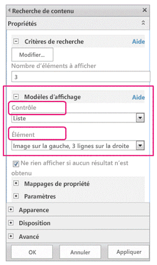
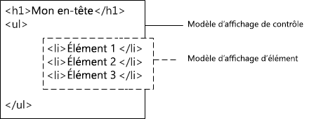

# Modèles d'affichage du gestionnaire de conception SharePoint 2013
Découvrez les modèles d'affichage, y compris la façon dont ils sont liés aux composants WebPart de recherche et la façon dont les modèles sont structurés, et apprenez à mapper des propriétés, à utiliser des variables et jQuery, ainsi qu'à créer un modèle d'affichage personnalisé dans SharePoint Server 2013.
## Présentation des modèles d'affichage
<a name="bk_introduction"> </a>

Les modèles d'affichage dans SharePoint Server 2013 sont des modèles utilisés dans des composants WebPart employant la technologie de recherche (appelés dans le présent article « composants WebPart de recherche ») afin d'afficher les résultats d'une requête envoyée à l'index de recherche. Les modèles d'affichage contrôlent les propriétés gérées qui sont affichées dans les résultats de la recherche et la façon dont elles apparaissent dans le composant WebPart. Chaque modèle d'affichage est composé de deux fichiers : une version HTML du modèle d'affichage que vous pouvez modifier dans votre éditeur HTML et un fichier .js utilisé par SharePoint.
  
    
    

> **REMARQUE**
> Seuls les composants WebPart de recherche peuvent utiliser des modèles d'affichage. Le composant WebPart de requête de contenu n'est pas un composant de recherche et n'utilise donc pas de modèles d'affichage. 
  
    
    

Vous pouvez afficher les modèles d'affichage existants dans le gestionnaire de conception, mais vous ne pouvez pas les créer dans ce dernier de la même façon que vous créez des pages maîtres et des mises en page. Au lieu de cela, vous devez procéder comme suit :
  
    
    

- Ouvrez votre  [lecteur réseau mappé à la galerie de pages maîtres](how-to-map-a-network-drive-to-the-sharepoint-2013-master-page-gallery.md).
    
  
- Ouvrez un des quatre dossiers figurant dans le dossier des **modèles d'affichage**.
    
    > **REMARQUE**
      > Le dossier que vous choisissez dépend du type de modèle d'affichage à utiliser. Par exemple, si votre site utilise la publication intersite, copiez un modèle d'affichage à partir du dossier des **composants WebPart de contenu**. Pour plus d'informations, voir  [Référence des modèles d'affichage dans SharePoint Server 2013](http://technet.microsoft.com/fr-fr/library/jj944947.aspx). 
- Copiez le fichier HTML d'un modèle d'affichage existant semblable au modèle souhaité. L'emplacement précis vers lequel vous copiez le fichier importe peu, tant qu'il se trouve dans la **galerie de pages maîtres**.
    
  
- Ouvrez et modifiez votre copie dans un éditeur HTML.
    
  
Lorsque vous utilisez un modèle d'affichage existant comme point de départ pour un nouveau modèle, vous bénéficiez d'informations utiles sur le processus de personnalisation dans les commentaires des modèles d'affichage par défaut et vous disposez d'une infrastructure pour les tâches de base, telles que le mappage des champs d'entrée. Cela garantit également que vos modèles utilisent la structure de page de base appropriée.
  
    
    
Lorsque vous créez un modèle d'affichage en copiant le fichier HTML d'un modèle existant figurant dans le dossier des **modèles d'affichage** situé dans la **galerie de pages maîtres**:
  
    
    

- Un fichier .js portant le même nom est créé à l'emplacement où vous avez copié le fichier HTML.
    
  
- La totalité des balises requises par SharePoint Server 2013 sont ajoutées au fichier .js, afin que le modèle s'affiche correctement.
    
  
- Le fichier HTML et le fichier .js sont associés, de sorte que toutes les modifications ultérieures effectuées dans le fichier HTML soient synchronisées dans le fichier .js lorsque le fichier HTML est enregistré.
    
  

> **REMARQUE**
> La synchronisation est à sens unique. Les modifications apportées au modèle d'affichage HTML sont synchronisées dans le fichier .js associé. Contrairement aux pages maîtres et aux mises en page, lorsqu'il s'agit des modèles d'affichage, vous ne pouvez pas choisir de travailler uniquement avec le fichier .js en annulant l'association entre les fichiers. Vous devez entrer tous les codes HTML et JavaScript dans le fichier HTML. 
  
    
    


## Comprendre la relation entre les modèles d'affichage et les composants WebPart de recherche
<a name="bk_DTandSWP"> </a>

Il existe deux types de modèles d'affichage principaux :
  
    
    

- **Les modèles de contrôle** déterminent la structure globale de la présentation des résultats. Cela inclut des listes, des listes avec paginations et des diaporamas.
    
  
- **Les modèles d'élément** déterminent le mode d'affichage de chaque résultat dans l'ensemble. Cela inclut des images, du texte, des vidéos et d'autres éléments.
    
  
Pour plus d'informations sur ces modèles d'affichage et d'autres, voir  [Référence des modèles d'affichage dans SharePoint Server 2013](http://technet.microsoft.com/fr-fr/library/jj944947.aspx).
  
    
    
Une fois que vous avez ajouté un composant WebPart de recherche (tel que le composant WebPart de recherche de contenu) à une page, vous devez, pour configurer le composant WebPart, sélectionner à la fois un modèle d'affichage de contrôle et un modèle d'affichage d'élément, comme illustré à la figure 1.
  
    
    

**Figure 1. Volet d'outils du composant WebPart de recherche de contenu**

  
    
    

  
    
    

  
    
    
Le modèle d'affichage de contrôle fournit du code HTML afin de structurer la disposition globale souhaitée pour présenter les résultats de recherche. Par exemple, le modèle d'affichage de contrôle peut fournir le code HTML pour un titre et le début ou la fin d'une liste. Le modèle d'affichage de contrôle n'est rendu qu'une seule fois dans le composant WebPart.
  
    
    
Le modèle d'affichage d'élément fournit du code HTML qui détermine l'affichage de chaque élément dans le jeu de résultats. Par exemple, le modèle d'affichage d'élément peut fournir le code HTML pour un élément de liste contenant une image et trois lignes de texte mappées sur des propriétés gérées différentes associées à l'élément. Le modèle d'affichage d'élément est rendu une fois pour chaque élément du jeu de résultats. Ainsi, si le jeu de résultats contient 10 éléments, le modèle d'affichage d'élément crée une section de code HTML dix fois.
  
    
    
Lorsqu'ils sont utilisés ensemble de cette manière, le modèle d'affichage de contrôle et le modèle d'affichage d'élément sont combinés pour créer un bloc de code HTML cohésif qui est rendu dans le composant WebPart, comme illustré à la figure 2.
  
    
    

**Figure 2. Sortie HTML combinée d'un modèle d'affichage de contrôle et d'un modèle d'affichage d'élément**

  
    
    

  
    
    

  
    
    
Pour plus d'informations sur les modèles d'affichage, reportez-vous à la section « Composants WebPart de recherche et modèles d'affichage » de la page  [Vue d'ensemble du modèle de page SharePoint 2013](overview-of-the-sharepoint-2013-page-model.md).
  
    
    

## Comprendre la structure des modèles d'affichage
<a name="bk_DTstructure"> </a>

Le fichier HTML utilisé pour un modèle d'affichage est un document HTML formé, mais il ne représente pas une page web HTML complète. SharePoint convertit les éléments du fichier HTML du modèle d'affichage en JavaScript. Cette section décrit les quatre parties principales d'un modèle d'affichage.
  
    
    

### Balise de titre

Le texte inclus dans la balise **<title>** d'un fichier de modèle d'affichage est utilisé comme nom d'affichage dans la section **Modèles d'affichage** du Panneau de modification du composant WebPart lorsque le composant WebPart de recherche est en mode Édition. L'exemple suivant concerne le modèle d'affichage d'élément nommé Item_Picture3Lines.html :
  
    
    

```HTML

<title>Picture on left, 3 lines on right</title>
```


### Propriétés de l'en-tête

Immédiatement après la balise **<title>**, un ensemble d'éléments personnalisés liés par la balise suivante apparaît :
  
    
    

```HTML
<!--[if gte mso 9]><xml>
<mso:CustomDocumentProperties>
…
</mso:CustomDocumentProperties>
</xml><![endif]-->

```

Ces éléments et leurs propriétés fournissent des informations importantes sur le modèle d'affichage à l'environnement SharePoint. Le tableau 1 décrit les propriétés personnalisées utilisées dans les modèles d'affichage.
  
    
    

> **REMARQUE**
> Les propriétés personnalisées ne sont pas toutes utilisées dans chacun des modèles d'affichage. Certaines propriétés peuvent également être modifiées en modifiant les propriétés du fichier de modèle d'affichage dans le gestionnaire de conception. 
  
    
    


**Tableau 1. Liste des entrées CustomDocumentProperties**


|**Propriété**|**Description**|
|:-----|:-----|
|**TemplateHidden** <br/> |Valeur booléenne indiquant si le modèle d'affichage doit être masqué dans la liste des modèles disponibles dans le composant WebPart. Cette valeur peut être modifiée dans les propriétés du fichier de modèle d'affichage.  <br/> |
|**ManagedPropertyMapping** <br/> |Mappe les champs affichés par les éléments de résultat de recherche sur les propriétés disponibles pour JavaScript. Utilisé uniquement dans les modèles d'élément.  <br/> |
|**MasterPageDescription** <br/> |Fournit une description conviviale du modèle d'affichage. Les utilisateurs peuvent la voir dans l'environnement d'édition de SharePoint. Cette valeur peut être modifiée dans les propriétés du fichier de modèle d'affichage.  <br/> |
|**ContentTypeId** <br/> |ID du type de contenu associé au modèle d'affichage.  <br/> |
|**TargetControlType** <br/> |Indique le contexte dans lequel le modèle d'affichage est utilisé. Cette valeur peut être modifiée dans les propriétés du fichier de modèle d'affichage.  <br/> |
|**HtmlDesignAssociated** <br/> |Valeur booléenne indiquant si un fichier HTML de modèle d'affichage est associé à un fichier .js.  <br/> |
|**HtmlDesignConversionSucceeded** <br/> |Indique si le processus de conversion a réussi. Cette valeur est automatiquement ajoutée au fichier par SharePoint et elle est utilisée uniquement dans les modèles d'affichage personnalisés.  <br/> |
|**HtmlDesignStatusAndPreview** <br/> |Contient l'URL vers le fichier HTML et le texte de la colonne **Statut** ( **La conversion a réussi** ou **Avertissements et erreurs**). Cette valeur est automatiquement ajoutée au fichier par SharePoint et elle est utilisée uniquement dans les modèles d'affichage personnalisés.  <br/> |
   

### Bloc de script
<a name="bk_scriptblock"> </a>

À l'intérieur de la balise **<body>**, vous pouvez observer la balise **<script>** suivante :
  
    
    

```HTML

<script>
     $includeLanguageScript(this.url, "~sitecollection/_catalogs/masterpage/Display Templates/Language Files/{Locale}/CustomStrings.js");
</script>
```

Par défaut, cette ligne est incluse dans tous les modèles d'affichage. Vous pouvez ajouter davantage de lignes de code dans la balise **<script>** pour référencer des fichiers CSS ou d'autres fichiers JavaScript en dehors de votre fichier HTML de modèle d'affichage principal. Le tableau 2 présente des exemples permettant d'inclure d'autres ressources.
  
    
    

**Tableau 2. Exemples permettant d'inclure des ressources externes dans la balise <script>**


|**Pour inclure :**|**Utilisez le code suivant :**|
|:-----|:-----|
|Un fichier JavaScript faisant partie de la collection de sites actuelle  <br/> | `$includeScript(this.url, "~sitecollection/_catalogs/masterpage/Display Templates/Content Web Parts/MyScripts.js");` <br/> |
|Un fichier JavaScript externe  <br/> | `$includeScript(this.url, "http://www.contoso.com/ExternalScript.js");` <br/> |
|Un fichier CSS faisant partie de la collection de sites actuelle  <br/> | `$includeCSS(this.url, "~sitecollection/_catalogs/masterpage/Display Templates/Content Web Parts/MyCSS.css");` <br/> |
|Un fichier CSS se trouvant dans un emplacement relatif au modèle d'affichage actuel  <br/> | `$includeCSS(this.url,"../../MyStyles/MyCSS.css");` <br/> |
   

> **REMARQUE**
> Si l' **approbation du contenu** est obligatoire pour les éléments de la galerie de pages maîtres, tous les fichiers de ressources (y compris les fichiers CSS et .js) doivent être publiés avant d'être disponibles sur les pages maîtres et les mises en page. Pour plus d'informations, voir [Exiger l'approbation d'éléments dans une liste ou une bibliothèque de site](http://office.microsoft.com/fr-fr/sharepoint-help/require-approval-of-items-in-a-site-list-or-library-HA102853936.aspx?CTT=1). 
  
    
    


### Bloc DIV
<a name="bk_scriptblock"> </a>

Après la balise **<script>** se trouve une balise **<div>** avec un ID. Par défaut, l'ID de cette balise **<div>** correspond au nom du fichier HTML. Tout code HTML ou code devant être fourni par le modèle d'affichage doit être inclus dans cette balise **<div>**. Toutefois, la balise elle-même n'est pas incluse dans le balisage rendu sur la page web au moment de l'exécution. 
  
    
    

> **REMARQUE**
> Si vous souhaitez affecter un style CSS ou un ID au bloc de code HTML rendu sur la page au moment de l'exécution, vous pouvez ajouter une nouvelle balise à l'intérieur de la première balise **<div>**. Vous pouvez également affecter un style CSS ou un ID à l'élément HTML qui entoure la variable  `_#= ctx.RenderGroups(ctx) =#_` dans le modèle de contrôle. La variable `_#= ctx.RenderGroups(ctx) =#_` est utilisée pour rendre le code HTML qui entoure les résultats de la requête qui sont rendus par le modèle d'élément.
  
    
    

Dans la première balise **<div>**, vous observez du code à l'intérieur des blocs de commentaires qui commencent par **<!--#_** et se terminent par **_#-->**. Vous utilisez du code JavaScript à l'intérieur de ces blocs et du code HTML en dehors des blocs. Vous pouvez également utiliser ces blocs pour contrôler le code HTML grâce à des instructions conditionnelles. Pour cela, utilisez un bloc de commentaires avec l'instruction conditionnelle et le crochet ouvrant, suivis par le code HTML, puis par un autre bloc de commentaires et le crochet fermant. Dans l'exemple suivant, la balise d'ancrage est rendue uniquement si la valeur de l'objet **linkURL** n'est pas vide.
  
    
    


```HTML

<!--#_
if(!linkURL.isEmpty)
{
_#-->
     <a class="cbs-pictureImgLink" href="_#= linkURL =#_" title="_#= $htmlEncode(line1.defaultValueRenderer(line1)) =#_" id="_#= pictureLinkId =#_">
<!--#_
}
_#-->

```


## Mapper des propriétés d'entrée et obtenir leurs valeurs
<a name="bk_mapproperties"> </a>

La section d'en-tête d'un modèle d'affichage d'élément possède une propriété de document personnalisée nommée **ManagedPropertyMapping**. Cette propriété prend les propriétés gérées utilisées par la recherche et les mappe sur des valeurs qui peuvent être utilisées par le modèle d'affichage. La propriété est une liste de valeurs séparées par des virgules qui utilise le format suivant : ' _nom d'affichage de la propriété_'{ _nom de la propriété_}:' _propriété gérée_'. Par exemple,  `'Picture URL'{Picture URL}:'PublishingImage;PictureURL;PictureThumbnailURL'`.
  
    
    
Examinons le format plus en détail :
  
    
    

- Le  _nom d'affichage de la propriété_ est le nom de la propriété qui est affiché dans le Panneau de modification du composant WebPart lorsque le modèle d'affichage est sélectionné.
    
  
- Le  _nom de la propriété_ est un identifiant qui utilise les ressources de chaînes localisées pour rechercher le nom de la propriété gérée. C'est également la valeur qui apparaît dans la section **Mappages de propriétés** du menu des paramètres du composant WebPart. Lorsque vous modifiez les paramètres d'un composant WebPart, vous pouvez modifier cette valeur afin de changer la propriété gérée qui est associée au champ qui apparaît dans le composant WebPart.
    
  
- La  _propriété gérée_ est une chaîne d'une ou plusieurs propriétés gérées, séparées par des points-virgules. Au moment de l'exécution, la liste est évaluée de gauche à droite et la première valeur qui correspond au nom de la propriété gérée de l'élément de recherche actuel est mappée sur cet emplacement. Cela vous permet d'écrire un modèle d'affichage qui peut fonctionner avec plusieurs types d'éléments et d'utiliser un rendu cohérent si des propriétés compatibles sont présentes.
    
  
Une fois que vous avez mappé une propriété, vous pouvez obtenir sa valeur dans le script à l'aide du code suivant :  `var pictureURL = $getItemValue(ctx, "Picture URL");`
  
    
    
Le deuxième paramètre transmis à **$getItemValue()** doit correspondre au nom d'affichage de la propriété entre guillemets simples utilisé dans l'élément **ManagedPropertyMapping**. Dans cet exemple, **Picture URL** est le nom de la propriété transmis à **$getItemValue()**.
  
    
    
Ce code renvoie un objet d'information de valeur ( **valueInfoObj**). Cet objet comporte une représentation brute de la valeur d'entrée, ainsi que la valeur avec un codage qui lui est appliqué par défaut.
  
    
    
Vous pouvez utiliser des variables dans les sections de code JavaScript comme vous le feriez habituellement, afin de manipuler des variables et de créer des chaînes HTML destinées à être rendues sur la page au moment de l'exécution. En revanche, pour référencer des variables déclarées dans le script directement dans le code HTML, vous devez utiliser le format suivant : _#=  _nomVariable_ =#_. Par exemple, pour utiliser la variable **pictureURL** comme la valeur d'une image, vous devez utiliser le code HTML suivant : ``
  
    
    

## Utiliser jQuery avec des modèles d'affichage
<a name="bk_jQuery"> </a>

Vous pouvez utiliser jQuery avec vos modèles d'affichage. Toutefois, tenez compte de deux facteurs importants :
  
    
    

- Pour inclure des bibliothèques jQuery dans votre modèle d'affichage, suivez les instructions décrites dans la section  [Bloc de script](#bk_scriptblock), plus haut dans cet article.
    
  
- Si vous utilisez des sélecteurs d'ID dans jQuery, utilisez le code suivant afin de créer une variable pour l'ID :  `var containerQueryId = '#' + '_#= containerId =#_';`
    
    Pour référencer le sélecteur dans jQuery, utilisez le code suivant :  `$('_#= containerQueryId =#_')`
    
  

## Créer un modèle d'affichage
<a name="bk_createDT"> </a>

Pour pouvoir créer un modèle d'affichage à l'aide de la procédure suivante, vous devez disposer d'un lecteur réseau mappé qui pointe vers la **galerie des pages maîtres**. Pour plus d'informations, voir  [Comment mapper un lecteur réseau sur la galerie Pages maîtres SharePoint 2013](how-to-map-a-network-drive-to-the-sharepoint-2013-master-page-gallery.md).
  
    
    

### Pour créer un modèle d'affichage


1. À l'aide de l'Explorateur Windows, ouvrez le lecteur réseau mappé à la **galerie de pages maîtres**.
    
  
2. Ouvrez le dossier des **modèles d'affichage**, puis ouvrez le dossier des **composants WebPart de contenu**.
    
  
3. Copiez le fichier HTML d'un modèle d'affichage semblable à celui que vous voulez créer. Pour obtenir la liste des modèles d'affichage par défaut et leurs descriptions, voir  [Référence des modèles d'affichage dans SharePoint Server 2013](http://technet.microsoft.com/fr-fr/library/jj944947.aspx).
    
    À ce stade, SharePoint Server 2013 copie le fichier HTML et le convertit en fichier .js portant le même nom. Par exemple, si le fichier HTML est nommé Item_Picture3Line_copy.html, un fichier .js correspondant nommé Item_Picture3Lines_copy.js est également créé. Si vous décidez de renommer le fichier, le nom du fichier .js correspondant est aussi modifié.
    
  
4. Pour personnaliser le modèle d'affichage, modifiez le fichier HTML qui réside sur le serveur à l'aide d'un éditeur HTML afin d'ouvrir et de modifier le fichier HTML dans le lecteur mappé. Chaque fois que vous enregistrez le fichier HTML, toutes les modifications sont synchronisées dans le fichier .js associé.
    
  
5. Accédez à votre site de publication.
    
  
6. Dans le coin supérieur droit de la page, sélectionnez **Paramètres**, puis **Gestionnaire de conception**.
    
  
7. Dans le gestionnaire de conception, dans le volet de navigation de gauche, choisissez ** Modifier les modèles d'affichage**. Votre fichier HTML apparaît désormais avec une colonne **Statut** qui affiche l'un des deux statuts suivants :
    
  - **Avertissements et erreurs**
    
  
  - **La conversion a réussi**
    
  

    > **REMARQUE**
      > Contrairement aux pages maîtres et aux mises en page, vous ne pouvez pas utiliser la page d'aperçu pour obtenir un aperçu côté serveur instantané de votre modèle d'affichage. Pour obtenir un aperçu du modèle d'affichage, vous devez ajouter un composant WebPart de recherche de contenu à une page, puis appliquer le modèle d'affichage dans le Panneau de modification du composant WebPart de recherche de contenu. Si le modèle d'affichage comporte des erreurs, le composant WebPart de recherche de contenu affiche un message d'erreur. Les erreurs doivent être corrigées pour que le modèle d'affichage puisse s'afficher correctement. 
8. Pour corriger les erreurs, modifiez le fichier HTML qui réside sur le serveur à l'aide d'un éditeur HTML afin d'ouvrir et de modifier le fichier HTML dans le lecteur mappé. Enregistrez le modèle d'affichage, puis rechargez la page qui contient le composant WebPart de recherche de contenu qui utilise le modèle d'affichage.
    
  

## Ressources supplémentaires
<a name="bk_addresources"> </a>


-  [Vue d'ensemble du gestionnaire de conception dans SharePoint 2013](overview-of-design-manager-in-sharepoint-2013.md)
    
  
-  [Développer la conception de site dans SharePoint 2013](develop-the-site-design-in-sharepoint-2013.md)
    
  
-  [Procédure : Convertir un fichier HTML en page maître dans SharePoint 2013](how-to-convert-an-html-file-into-a-master-page-in-sharepoint-2013.md)
    
  
-  [Procédure : Créer une mise en page dans SharePoint 2013](how-to-create-a-page-layout-in-sharepoint-2013.md)
    
  
-  [Fonctionnalités de personnalisation et la conception de 2013 le gestionnaire de conception SharePoint](sharepoint-2013-design-manager-branding-and-design-capabilities.md)
    
  

