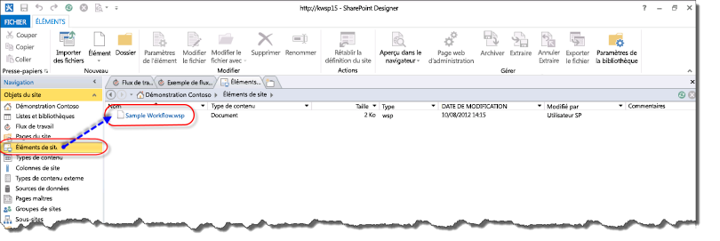
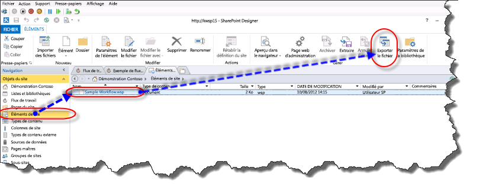
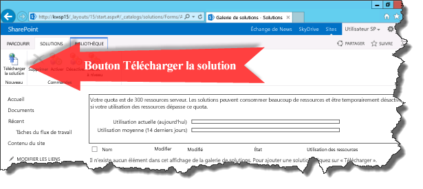
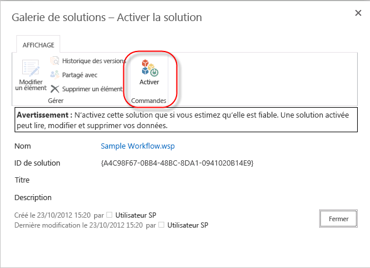
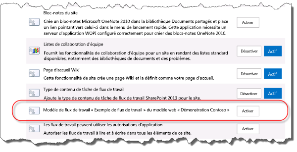

# Comprendre comment empaqueter et déployer des flux de travail dans SharePoint 2013
Découvrez comment créer un package de flux de travail et le déployer dans SharePoint Server 2013 avec SharePoint Designer 2013.
## Présentation des fonctionnalités de création de package de flux de travail de SharePoint Designer 2013

SharePoint Designer 2013 offre la possibilité d'enregistrer un flux de travail en tant que modèle. L'enregistrement d'un flux de travail en tant que modèle est également appelé « création d'un package de flux de travail ». Une fois le flux de travail enregistré en tant que modèle, il peut être importé dans d'autres environnements SharePoint Server 2013 et être utilisé sans que le flux de travail ait besoin d'être redéveloppé. Tous les types de flux de travail ne peuvent pas être enregistrés en tant que modèles. Le tableau suivant indique les types de flux de travail qui peuvent être enregistrés en tant que modèles. 
  
    
    

**Prise en charge par la plateforme, pour l'enregistrement d'un flux de travail en tant que modèle**

|**Type de flux de travail**|**Plateforme de flux de travail SharePoint 2010**|**Plateforme de flux de travail SharePoint 2013**|
|:-----|:-----|:-----|
|Flux de travail de liste    |Non    |Oui    |
|Flux de travail du site    |Non    |Oui    |
|Flux de travail réutilisable    |Oui    |Oui    |
   

  
    
    

  
    
    

> **REMARQUE**
> SharePoint Server 2013 contient deux plateformes de flux de travail différentes : la plateforme de flux de travail SharePoint 2010 et la plateforme de flux de travail SharePoint 2013. Les deux plateformes sont disponibles dans SharePoint Server 2013. Pour plus d'informations sur les deux flux de travail, voir  [Getting started with SharePoint Server 2013 workflow.](http://msdn.microsoft.com/library/cc73be76-a329-449f-90ab-86822b1c2ee8.aspx)
  
    
    

## Création d'un package de flux de travail à l'aide de SharePoint Designer 2013

Le processus de création d'un package de flux de travail implique l'enregistrement du flux de travail dans un fichier modèle à l'aide de SharePoint Designer 2013. Un package de flux de travail se présente sous la forme d'un fichier de WSP (Web Solution Package) et porte une extension .wsp. Pour créer un package de flux de travail, procédez comme suit. 
  
    
    

### Création d'un package de flux de travail

1. Ouvrez un flux de travail existant ou développez un nouveau flux de travail dans SharePoint Designer 2013.
    
  
2. Sur l'onglet **Paramètres du flux de travail** dans le ruban, cliquez sur le bouton **Enregistrer comme modèle** dans la section **Gérer** comme indiqué dans la figure.
    
   **Figure : enregistrement d'un flux de travail en tant que modèle**

  

  

  

  
3. Une boîte de dialogue d'information s'affiche et vous indique que le modèle a été enregistré dans la bibliothèque **Pièces jointes**.
    
  
4. Cliquez sur la bibliothèque Pièces jointes pour afficher le modèle de flux de travail, comme le montre la figure.
    
   **Figure : modèle de flux de travail dans les pièces jointes**

  

  

  

  

  
    
    

> **CONSEIL**
> Les modèles de flux de travail sont automatiquement enregistrés dans la bibliothèque **Pièces jointes** de la collection de sites dans laquelle réside le flux de travail.
  
    
    

## Déploiement d'un package de flux de travail vers SharePoint 2013

Vous pouvez déployer un package de flux de travail vers une batterie de serveurs ou un site SharePoint différent de la batterie de serveurs ou du site dans lequel il a été développé. Pour que le déploiement d'un flux de travail soit réussi, deux conditions doivent être remplies :
  
    
    

- Toutes les dépendances de flux de travail, comme les listes, bibliothèques, colonnes et types de contenu doivent déjà exister sur le nouveau site.
    
  
- Chaque dépendance doit porter exactement le même nom que la dépendance source.
    
  
Si un flux de travail est déployé et que les dépendances exactes n'existent pas, le résultat sera une erreur.
  
    
    
Pour pouvoir déployer un flux de travail, vous devez d'abord exporter le modèle de flux de travail à partir de la batterie de serveurs SharePoint Server 2013 source. Pour exporter un modèle de flux de travail, procédez comme suit.
  
    
    

### Exportation d'un modèle de flux de travail

1. Ouvrez SharePoint Designer 2013 et accédez à la bibliothèque Pièces jointes où se trouve le modèle.
    
  
2. Sélectionnez le modèle de flux de travail à exporter en cliquant dessus.
    
  
3. Cliquez sur le bouton **Exporter le fichier** pour enregistrer le fichier de modèle sur votre ordinateur local ou un lecteur réseau, comme illustré dans la figure.
    
   **Figure : exportation d'un modèle de flux de travail à partir de SharePoint Designer 2013**

  

  

  

  
Pour déployer un package de flux de travail, procédez comme suit.
  
    
    

### Déployer une solution de flux de travail

1. Ouvrez Internet Explorer et accédez à la collection de sites SharePoint Server 2013 où vous souhaitez déployer le flux de travail.
    
  
2. Cliquez sur **Actions du site** et sélectionnez **Paramètres du site**.
    
  
3. Dans la section **Galeries du concepteur web**, cliquez sur **Solutions**.
    
    > **REMARQUE**
      > Vous devez être sur la page **Paramètres du site** de la collection de sites pour voir la galerie **Solutions**. Si vous êtes sur la page **Paramètres du site** d'un sous-site, la galerie **Solutions** n'est pas visible.
4. Cliquez sur le bouton **Télécharger la solution** pour télécharger la solution, comme illustré dans la figure.
    
   **Figure : bouton Télécharger la solution**

  

  

  

  
5. Activez la solution en cliquant sur le bouton **Activer** comme indiqué dans la figure.
    
   **Figure : boîte de dialogue Activer la solution et bouton Activer**

  

  

  

  
Une fois la solution de flux de travail activée pour une collection de sites, celle-ci est disponible en tant que fonctionnalité pour tous les sous-sites. Pour activer la fonctionnalité de flux de travail pour un sous-site, procédez comme suit.
  
    
    

### Activation de la fonctionnalité de flux de travail

1. Ouvrez **Paramètres du site** sur le site où vous souhaitez activer la fonctionnalité de flux de travail.
    
  
2. Dans le groupe **Actions du site**, cliquez sur **Gérer les fonctionnalités du site**.
    
  
3. Cliquez sur **Activer** en regard de la fonctionnalité de flux de travail, comme le montre la figure.
    
  

**Figure : fonctionnalité d'activation du flux de travail pour le site**

  
    
    

  
    
    

  
    
    

  
    
    

  
    
    

## Ressources supplémentaires

-  [Flux de travail dans SharePoint 2013](http://technet.microsoft.com/fr-fr/sharepoint/jj556245.aspx)
    
  
-  [What's new in workflow in SharePoint Server 2013](http://msdn.microsoft.com/library/6ab8a28b-fa2f-4530-8b55-a7f663bf15ea.aspx)
    
  
-  [Getting started with SharePoint Server 2013 workflow](http://msdn.microsoft.com/library/cc73be76-a329-449f-90ab-86822b1c2ee8.aspx)
    
  
-  [Développement de flux de travail dans SharePoint Designer et Visio](workflow-development-in-sharepoint-designer-and-visio.md)
    
  
-  [Référence rapide relative aux actions de flux de travail (plateforme de flux de travail SharePoint 2013)](workflow-actions-quick-reference-sharepoint-2013-workflow-platform.md)
    
  
-  [Article du blog de l'équipe SharePoint Designer : scénario de création de package de flux de travail et de déploiement](http://blogs.msdn.com/b/sharepointdesigner/archive/2012/08/30/packaging-list-site-and-reusable-workflow-and-how-to-deploy-the-package.aspx)
    
  

