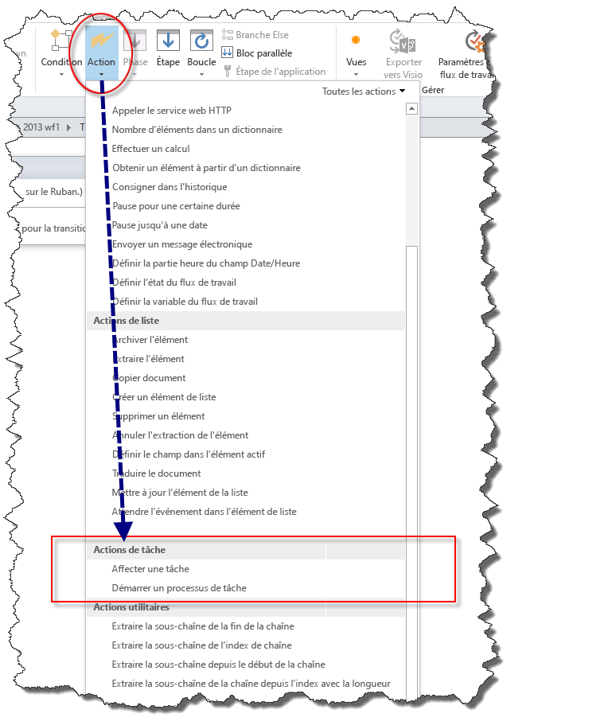
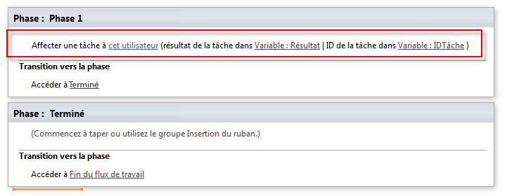
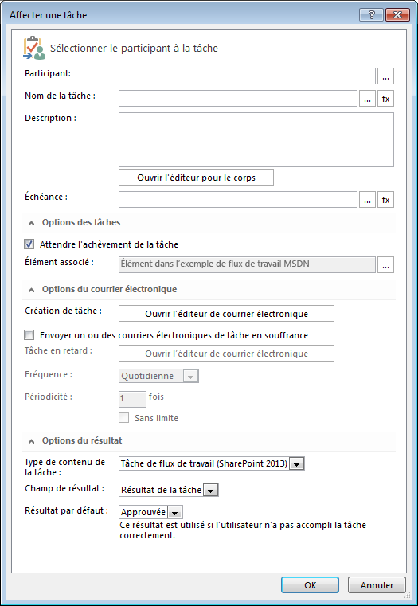
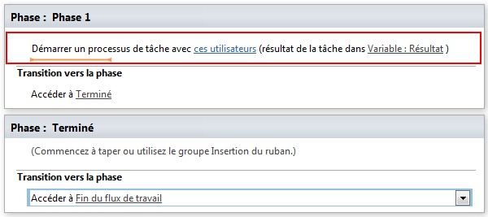
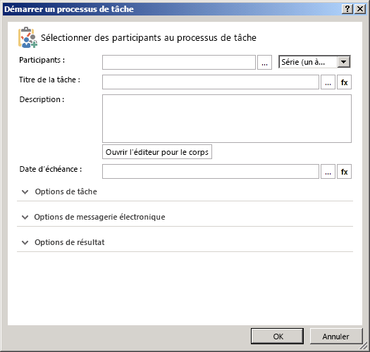

# Présentation des actions de tâche dans SharePoint Designer 2013
Découvrez comment utiliser les actions de tâche dans SharePoint Designer 2013.
||
|:-----|
||
   

## Vue d'ensemble des actions de tâche dans SharePoint Designer 2013

Une tâche dans SharePoint Server 2013 permet d'affecter du travail à une personne ou à un groupe, puis d'effectuer le suivi du travail dans le temps. Dans SharePoint Designer 2013, il existe deux actions de flux de travail conçues pour l'utilisation des tâches.
  
    
    
Ces actions sont les suivantes :
  
    
    

- **Affecter une tâche** est l'action utilisée pour créer une tâche SharePoint 2013 et l'affecter à un seul participant.
    
  
- **Démarrer un processus de tâche** est l'action utilisée pour affecter une tâche à plusieurs participants.
    
  
Les actions de tâche sont accessibles dans le menu déroulant **Action** du ruban de SharePoint Designer 2013, comme illustré dans la figure.
  
    
    

**Figure : actions de tâche dans SharePoint Designer 2013**

  
    
    

  
    
    

  
    
    

  
    
    

  
    
    

## Utilisation des actions de tâche dans SharePoint 2013

Un processus métier se compose souvent de tâches qui doivent être effectuées par des personnes. Un flux de travail orchestre les étapes d'un processus. Un flux de travail utilise des actions de tâche pour affecter des tâches à des personnes. Par exemple, lorsqu'un nouvel employé est embauché, un certain nombre de tâches doit être exécuté. L'une de ces tâches peut être l'orientation du nouvel employé. La tâche doit être effectuée par un membre du service des ressources humaines.
  
    
    
Les actions **Affecter une tâche** et **Démarrer un processus de tâche** sont situées dans le menu déroulant **Actions** du ruban de SharePoint Designer 2013. Vous pouvez ajouter les actions à votre flux de travail, puis les personnaliser pour votre cas précis. L'action **Affecter une tâche** est utilisée pour affecter une tâche à un seul participant. L'action **Démarrer un processus de tâche** est utilisée pour affecter une tâche à plusieurs participants.
  
    
    

### Affecter une tâche

L'action **Affecter une tâche** est illustrée dans la figure.
  
    
    

**Figure : action Affecter une tâche dans SharePoint Designer 2013**

  
    
    

  
    
    

  
    
    

  
    
    

  
    
    
L'action **Affecter une tâche** peut prendre trois valeurs : l'utilisateur à qui affecter une tâche, la variable de résultat et la variable de numéro de tâche.
  
    
    

- **Cet utilisateur**: ouvre la boîte de dialogue **Affecter une tâche** comme illustré dans la figure. La boîte de dialogue permet de définir le participant, le titre de la tâche, la description, la date d'échéance, les options de la tâche, les options de messagerie et les options de résultat.
    
  
- **Variable : résultat**: affecte la variable qui contiendra le résultat de la tâche.
    
  
- **Variable : TaskID**: affecte la variable qui doit contenir l'ID de la tâche.
    
  

**Figure : boîte de dialogue Affecter une tâche**

  
    
    

  
    
    

  
    
    

  
    
    

  
    
    

### Démarrer un processus de tâche

L'action **Démarrer un processus de tâche** est illustrée dans la figure.
  
    
    

**Figure : action Démarrer un processus de tâche.**

  
    
    

  
    
    

  
    
    

  
    
    

  
    
    
L'action **Démarrer un processus de tâche** peut prendre deux valeurs : les utilisateurs qui participent à la tâche et la variable de résultat.
  
    
    

- **Ces utilisateurs**: ouvre la boîte de dialogue **Démarrer un processus de tâche**, comme illustré dans la figure. La boîte de dialogue permet de définir les participants, le titre de la tâche, la description, la date d'échéance, les options de la tâche, les options de messagerie et les options de résultat.
    
  
- **Variable : résultat**: affecte la variable qui détiendra le résultat du processus de tâche.
    
  

**Figure : boîte de dialogue Démarrer un processus de tâche**

  
    
    

  
    
    

  
    
    

  
    
    

  
    
    

## Ressources supplémentaires

-  [What's new in workflow in SharePoint Server 2013](http://msdn.microsoft.com/library/6ab8a28b-fa2f-4530-8b55-a7f663bf15ea.aspx)
    
  
-  [Getting started with SharePoint Server 2013 workflow](http://msdn.microsoft.com/library/cc73be76-a329-449f-90ab-86822b1c2ee8.aspx)
    
  
-  [Développement de flux de travail dans SharePoint Designer et Visio](workflow-development-in-sharepoint-designer-and-visio.md)
    
  
-  [Référence rapide relative aux actions de flux de travail (plateforme de flux de travail SharePoint 2013)](workflow-actions-quick-reference-sharepoint-2013-workflow-platform.md)
    
  

  
    
    

