# Nouveautés pour les développeurs dans SharePoint 2013
Découvrez les nouvelles fonctions et fonctionnalités de SharePoint 2013, dont le nouveau modèle de compléments Cloud, les outils de développement, les améliorations de plateforme, les compléments mobiles et bien plus encore.
## Modèle de compléments Cloud

SharePoint 2013 présente un modèle de compléments Cloud qui vous permet de créer descompléments. Les Compléments SharePoint sont des éléments de fonctionnalité autonomes qui étendent les capacités d'un site web SharePoint. Un complément peut comprendre des composants SharePoint, tels que des listes, des flux de travail et des pages de site, mais il peut aussi faire apparaître une application web distante et des données distantes dans SharePoint. Un complément ne présente que peu ou pas de dépendances avec d'autres logiciels de l'appareil ou de la plateforme où il est installé, à part les composants intégrés dans la plateforme. Cette caractéristique permet d'installer simplement et de désinstaller proprement des compléments. Les compléments ne présentent aucun code personnalisé exécuté sur des serveurs SharePoint. Toute la logique personnalisée est déplacée « vers le cloud » ou « sur les ordinateurs des clients ». En outre, SharePoint 2013 présente un modèle de livraison novateur pour les Compléments SharePoint qui inclut des composants tels que l'Office Store et le catalogue de compléments.
  
    
    
 [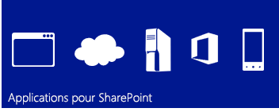
  
    
    
](http://msdn.microsoft.com/library/cd1eda9e-8e54-4223-93a9-a6ea0d18df70%28Office.15%29.aspx) [
  
    
    
](http://msdn.microsoft.com/library/d15a74a7-3c10-485a-9885-7ef11aaa0d90%28Office.15%29.aspx) [
  
    
    
](http://msdn.microsoft.com/library/d15a74a7-3c10-485a-9885-7ef11aaa0d90%28Office.15%29.aspx)
  
    
    

## Modèle de programmation courant utilisant des normes web

SharePoint 2013 permet à tous les développeurs web, y compris ceux qui travaillent sur des piles de plateforme autres que Microsoft, de créer facilement des solutions SharePoint, car SharePoint 2013 est basé sur des normes web courantes comme HTML, CSS et JavaScript. En outre, la mise en œuvre s'appuie sur des protocoles établis comme le protocole Open Data (OData) et OAuth.
  
    
    
 [
  
    
    
](http://msdn.microsoft.com/library/cd1eda9e-8e54-4223-93a9-a6ea0d18df70%28Office.15%29.aspx) [
  
    
    
](using-odata-sources-with-business-connectivity-services-in-sharepoint-2013.md) [
  
    
    
](get-to-know-the-sharepoint-2013-rest-service.md) [
  
    
    
](http://msdn.microsoft.com/library/bde5647a-fff1-4b51-b67b-2139de79ce4a%28Office.15%29.aspx)
  
    
    

## Outils de développement

La version actuelle reflète d'énormes progrès dans l'optimisation des outils de développement existants, tels que Visual Studio et SharePoint Designer, en plus de fournir la version de l'outil basé sur le web récemment mis au point Outils de développement Office 365 Napa pour le développement de compléments. Le nouveau système de projet unifié de Visual Studio vous permet de développer des Compléments SharePoint, des Compléments Office, des Compléments SharePoint qui incluent des Compléments Office ou des Compléments Office hébergées par SharePoint. En plus des modèles de projet SharePoint fournis dans les versions antérieures, Visual Studio 2012 inclut désormais un nouveau modèle de projet de compléments dans le dossier de compléments nommé Compléments pour SharePoint 2013. Plusieurs nouvelles propriétés ont été ajoutées à la fenêtre Propriétés et aux pages Propriétés pour prendre en charge les projets d'Complément SharePoint. Les autres améliorations comprennent une prise en charge complète du développement sur le modèle de compléments Cloud, y compris la prise en charge OData et OAuth, ainsi qu'une prise en charge complète du développement sur la plateforme Workflow Manager Client 1.0.
  
    
    
 [
  
    
    
](http://msdn.microsoft.com/library/82a3645c-0911-4926-9176-236ac8d28bdd%28Office.15%29.aspx) [
  
    
    
](http://msdn.microsoft.com/library/e00dc63f-b4a4-4c08-b058-729fcb09af41%28Office.15%29.aspx) [
  
    
    
](workflow-development-in-sharepoint-designer-and-visio.md)
  
    
    

## Améliorations de la plateforme principale

Sur une plus grande échelle, SharePoint 2013 a été amélioré et renforcé pour prendre en charge la nouvelle architecture en nuage et le cadre de développement axé sur les applications. Des API SharePoint de niveau inférieur à la connectivité en passant par l'intégration des réseaux sociaux, SharePoint 2013 est conçu pour prendre en charge une expérience de développement d'applications riche. En plus de l'utilisation des points de terminaison REST (Representational State Transfer) pour les services web, il existe une toute nouvelle API pour le développement serveur et client. Les récepteurs d'événements à distance sont désormais pris en charge, en plus du rendu côté client. 
  
    
    
 [
  
    
    
](e1ff2979-1c16-4cb0-a57e-9168dfe20a7c.md) [
  
    
    
](choose-the-right-api-set-in-sharepoint-2013.md) [
  
    
    
](how-to-customize-a-field-type-using-client-side-rendering.md) [
  
    
    
](http://msdn.microsoft.com/library/c050d056-8548-4496-a053-016779d723d9%28Office.15%29.aspx)
  
    
    

## Mobilité

Avec SharePoint 2013, vous pouvez combiner des applications Windows Phone 7 avec des services et des applications SharePoint sur site, ou avec des services et des applications SharePoint distants qui s'exécutent dans le nuage (tels que ceux qui utilisent SharePoint Online), afin de créer des applications puissantes qui étendent leurs fonctionnalités au-delà du bureau ou de l'ordinateur portable traditionnels dans un environnement réellement mobile et beaucoup plus accessible. Les nouvelles fonctionnalités de mobilité de SharePoint 2013 se basent sur les outils et technologies Microsoft existants, tels que SharePoint, Windows Phone 7, Visual Studio et Microsoft Silverlight. Vous pouvez créer des applications mobiles basées sur SharePoint pour Windows Phone en utilisant le nouveau modèle d'assistant Application téléphonique SharePoint dans Visual Studio, qui vous permet de créer des applications mobiles simples à partir d'une liste. Vous pouvez intégrer dans vos applications mobiles de nouvelles fonctionnalités introduites dans SharePoint 2013, telles que le type de champ de géolocalisation et les notifications Push de SharePoint Server.
  
    
    
 [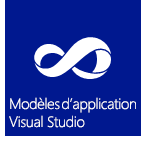
  
    
    
](overview-of-windows-phone-sharepoint-2013-application-templates-in-visual-studio.md) [
  
    
    
](how-to-configure-and-use-push-notifications-in-sharepoint-2013-apps-for-windows.md) [
  
    
    
](integrating-location-and-map-functionality-in-sharepoint-2013.md)
  
    
    

## Mise en réseau et collaboration

Grâce aux nouvelles fonctionnalités améliorées de collaboration et de mise en réseau, il est facile pour les utilisateurs de communiquer et de rester impliqués et informés. L'amélioration du flux d'actualités Site Mon site permet aux utilisateurs de rester informés sur les personnes et le contenu qui les intéressent. La nouvelle fonctionnalité de site communautaire propose une expérience communautaire riche permettant aux utilisateurs de trouver et partager facilement des informations et de trouver des personnes ayant des intérêts similaires.
  
    
    
 [
  
    
    
](work-with-social-feeds-in-sharepoint-2013.md) [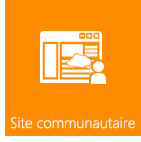
  
    
    
](what-s-new-for-developers-in-social-and-collaboration-features-in-sharepoint-201.md#bkmk_Collab) [
  
    
    
](follow-people-in-sharepoint-2013.md) [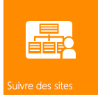
  
    
    
](follow-content-in-sharepoint-2013.md)
  
    
    

## Recherche

La fonction de recherche dans SharePoint 2013 inclut plusieurs améliorations, le traitement de contenu personnalisé avec le service web d'enrichissement du contenu et un nouveau cadre pour la présentation des types de résultats de recherche. En outre, des améliorations importantes ont été apportées à la langue de requête de mot-clé (KQL).
  
    
    
 [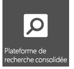
  
    
    
](custom-content-processing-with-the-content-enrichment-web-service-callout.md) [
  
    
    
](what-s-new-in-sharepoint-2013-search-for-developers.md) [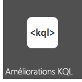
  
    
    
](building-search-queries-in-sharepoint-2013.md)
  
    
    

## Flux de travail

Workflow Manager Client 1.0 est une infrastructure de flux de travail redéfinie basée sur Windows Workflow Foundation 4 qui apporte une puissance et souplesse nouvelles au flux de travail créé dans SharePoint 2013. Un environnement de création entièrement déclaratif permet aux travailleurs de l'information d'utiliser SharePoint Designer 2013 pour créer des flux de travail puissants, et un nouvel ensemble de modèles de projets de flux de travail Visual Studio 2012 permettent aux développeurs d'accéder à des fonctionnalités plus sophistiquées comme les actions personnalisées. De plus, et peut-être le plus important, Workflow Manager Client 1.0 est entièrement intégré dans le modèle de complément SharePoint. En outre, les flux de travail s'exécutent dans le nuage, pas dans SharePoint, ce qui offre une immense flexibilité pour la conception d'Compléments SharePoint basées sur le flux de travail.
  
    
    
 [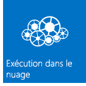
  
    
    
](what-s-new-in-workflows-for-sharepoint-2013.md) [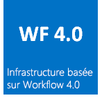
  
    
    
](sharepoint-2013-workflow-fundamentals.md) [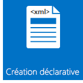
  
    
    
](workflow-development-in-sharepoint-designer-and-visio.md) [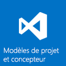
  
    
    
](develop-sharepoint-2013-workflows-using-visual-studio.md)
  
    
    

## Gestion de contenu d'entreprise

Dans SharePoint 2013, vous pouvez désormais utiliser le client .NET, Silverlight, Windows Phone et les API JavaScript, en plus de l'ensemble d'API managées de serveur .NET récemment étendu, afin de personnaliser les expériences et le comportement de la gestion de contenu d'entreprise (ECM, Enterprise Content Management).
  
    
    
 [
  
    
    
](what-s-new-with-sharepoint-2013-site-development.md) [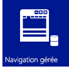
  
    
    
](managed-navigation-in-sharepoint-2013.md) [
  
    
    
](cross-site-publishing-in-sharepoint-2013.md) [
  
    
    
](ediscovery-in-sharepoint-2013.md)
  
    
    

## Business Connectivity Services

Business Connectivity Services (BCS) permet à SharePoint d'accéder aux données à partir de systèmes de données externes tels que SAP, ERP et CRM, en plus d'autres applications axées sur les données qui sont exposées via les services WCF ou les points de terminaison OData. BCS dans SharePoint 2013 a été amélioré et renforcé de plusieurs façons, y compris la connectivité OData, les événements externes, les données externes dans les compléments, le filtrage et le tri, la prise en charge de REST, etc.
  
    
    
 [
  
    
    
](using-odata-sources-with-business-connectivity-services-in-sharepoint-2013.md) [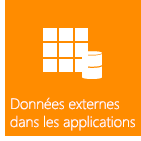
  
    
    
](add-in-scoped-external-content-types-in-sharepoint-2013.md) [
  
    
    
](external-events-and-alerts-in-sharepoint-2013.md)
  
    
    

## Services d'applications

SharePoint Server 2013 inclut plusieurs services pour utiliser les données de vos sites SharePoint. Le service de traduction automatique, qui traduit des sites, des documents et des flux pour la prise en charge multilingue est une nouvelle fonctionnalité SharePoint. SharePoint Server 2013 comprend également Access Services et un nouveau modèle d'accès aux données. Pour convertir le format des fichiers et des flux, SharePoint Server 2013 dispose de Word Automation Services et de PowerPoint Automation Services (une nouvelle fonctionnalité pour SharePoint). SharePoint fournit également des outils d'analyse de données, comme PerformancePoint Services et Visio Services, qui activent l'aide à la décision et de nouvelles fonctionnalités puissantes dans Excel Services.
  
    
    
 [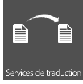
  
    
    
](machine-translation-services-in-sharepoint-2013.md) [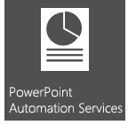
  
    
    
](powerpoint-automation-services-in-sharepoint-2013.md) [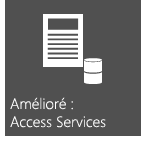
  
    
    
](what-s-new-in-access.md) [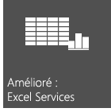
  
    
    
](09e96c8b-cb55-4fd1-a797-b50fbf0f9296.md)
  
    
    

## Ressources supplémentaires

-  [Vue d'ensemble du développement SharePoint 2013](sharepoint-2013-development-overview.md)
    
  
-  [Développer des compléments pour SharePoint](http://msdn.microsoft.com/library/71ddde4b-fac4-4d8c-aa2e-524f9c2c4c99%28Office.15%29.aspx)
    
  
-  [Comparaison des compléments pour SharePoint et des solutions SharePoint](sharepoint-add-ins-compared-with-sharepoint-solutions.md)
    
  
-  [Choisir l'ensemble d'API approprié dans SharePoint 2013](choose-the-right-api-set-in-sharepoint-2013.md)
    
  
-  [Accessibilité dans les produits SharePoint 2013](accessibility-in-sharepoint-2013.md)
    
  

