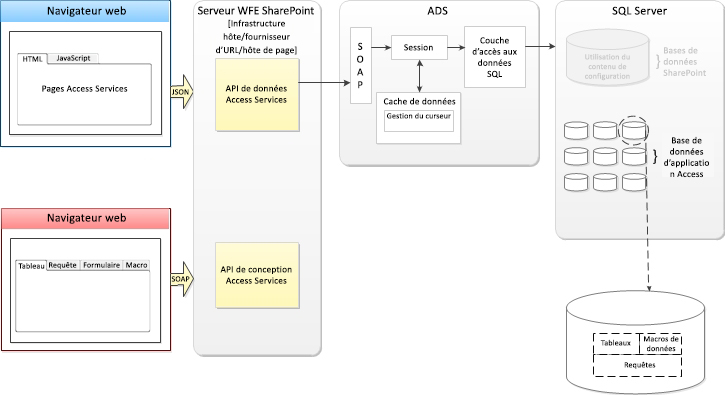

# Nouveautés d'Access
Découvrez les fonctions disponibles dans Access 2013 qui facilitent la création, le déploiement et la gestion d'applications web de collaboration, locales ou dans le cloud.
## Introduction

Access 2013 propose un nouveau modèle d'application conçu dans un seul but : simplifier la programmation web de façon très similaire aux versions d'Access avec développement Windows. Access 2013 permet aux experts de créer rapidement une application utilisable dans le cadre de leur activité. En utilisant Microsoft SharePoint 2013 pour héberger la partie frontale de l'application, et Microsoft SQL Server 2012 comme technologie de stockage des données, Access 2013 permet de gérer et de faire évoluer plus facilement les applications Access. La compatibilité avec Office 365 et SQL Azure étend considérablement la portée des applications Access.
  
    
    

## Architecture

Dans un environnement local, les applications Access 2013 sont hébergées par SharePoint 2013, tandis que les données sont stockées dans SQL Server 2012. SharePoint 2013 assure l'authentification, les autorisations et la sécurité pour les applications Access 2013. Les tables, macros, requêtes et affichages principaux sont stockés dans une base de données SQL Server 2012.
  
    
    
Access 2013, via les services Office 365 et SQL Azure, offre une méthode permettant de déployer une application Access dans le cloud.
  
    
    
La figure 1 donne une vue d'ensemble de l'architecture Access 2013.
  
    
    

**Figure 1. Architecture Access 2013**

  
    
    

  
    
    

  
    
    
Lors de la création d'une application Access, Access Services dans SharePoint Server 2013 crée une Base de données d'application pour stocker les données, requêtes, macros et affichages contenus dans l'application. La base de données système d'Access Services 2013 peut être configurée pour créer une nouvelle Base de données d'application sur un serveur SQL Server 2012 séparé.
  
    
    
L'utilisation de SQL Server 2012 pour le stockage des données permet de gérer et de faire évoluer les applications Access comme jamais auparavant. L'époque où il fallait reconcevoir et réimplémenter une application Access dans un environnement plus puissant est révolue.
  
    
    
Une application Access 2013 est en ligne dès que sa création est terminée. Vous pouvez décider de partager l'application avec d'autres utilisateurs, de la déployer dans le catalogue d'entreprise privé ou de la déployer dans Office Store.
  
    
    

## Développement d'applications Access

Contrairement à de nombreux services d'application SharePoint Server 2013, Access Services 2013 n'affiche pas l'API que vous pouvez utiliser pour développer des applications Access dans Visual Studio. Access 2013 constitue l'environnement que vous utilisez pour développer des applications Access 2013.
  
    
    
Pour plus d'informations sur le développement d'applications Access 2013, voir  [Procédure : Création et personnalisation d'une application web dans Access](http://msdn.microsoft.com/library/628745f4-82e9-4838-9726-6f3e506a654f%28Office.15%29.aspx).
  
    
    

## Ressources supplémentaires

-  [Nouveautés d'Access pour les développeurs](http://msdn.microsoft.com/library/df778f51-d65e-4c30-b618-65003ceb39b3%28Office.15%29.aspx)
    
  
-  [Référence de l'application web personnalisée Access](http://msdn.microsoft.com/library/8d696fa4-a6f2-4fb1-8662-a313bf0b5989%28Office.15%29.aspx)
    
  

