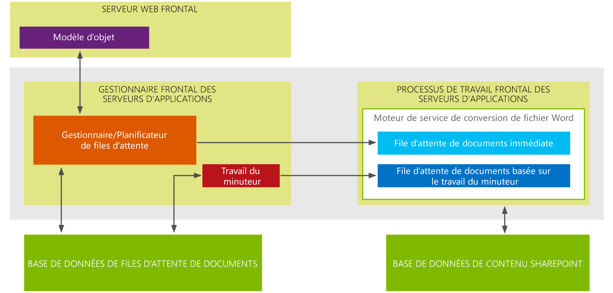

# Nouveautés Word Automation Services pour les développeurs
Cette rubrique fournit une vue d'ensemble des nouveautés et améliorations pour les développeurs dans Word Automation Services. Dans Microsoft SharePoint 2013, le principal ajout de fonctionnalité dans Word Automation Services est la prise en charge des demandes de conversion de fichiers « à la demande ». L'amélioration la plus importante apportée à Word Automation Services est l'ajout de la prise en charge de l'utilisation de flux de données comme entrée et sortie des travaux de conversion.
## Créer une conversion de fichier à la demande

Dans Word Automation Services au sein de Microsoft SharePoint 2013, vous pouvez désormais créer des demandes de conversion de fichier à la demande traitées immédiatement. Dans SharePoint 2010, vous deviez créer un travail de conversion de fichier dans votre code et démarrer la conversion en utilisant la méthode ConversionJob.Start. Le travail de conversion démarrait en fonction de l'intervalle défini dans Word Automation Services pour la fréquence de démarrage des travaux de conversion. Lors de l'intervalle, le travail du minuteur SharePoint démarrait le travail de conversion. À l'aide de la méthode basée sur le travail du minuteur, vous pouviez commencer un travail de conversion au bout d'une minute. 
  
    
    
À présent, dans Word Automation Services au sein de Microsoft SharePoint 2013, vous pouvez créer une demande de conversion de fichier qui est traitée dès que vous la soumettez. La conversion démarre immédiatement et ne dépend pas du travail du minuteur SharePoint. 
  
    
    
Voici une façon d'envisager la différence entre les demandes de conversion de fichier à la demande et les travaux de conversion basés sur le travail du minuteur SharePoint : les demandes de conversion de fichier à la demande sont traitées de façon synchrones alors que les travaux de conversion basés sur le travail du minuteur SharePoint se produisent de manière asynchrone. L'architecture Word Automation Services a été repensée pour prendre en charge aussi bien le nouveau type de demande de conversion de fichier à la demande que les conversions de fichier basées sur le travail du minuteur SharePoint.
  
    
    

**Figure 1. Architecture Word Automation Services 2013**

  
    
    

  
    
    

  
    
    
Dans la figure 1, vous constatez que l'architecture Word Automation Services conserve 2 files d'attente distinctes pour les conversions : une file d'attente pour les demandes de conversion de fichier (immédiates) à la demande et une file d'attente pour les travaux de conversion basés sur le travail du minuteur SharePoint sont placées dans la file d'attente de documents immédiate où les conversions sont traitées immédiatement.
  
    
    
En revanche, les travaux de conversion basés sur le travail du minuteur SharePoint sont placés dans la file d'attente de documents basée sur le travail du minuteur. Les travaux de conversion de ces demandes commencent à l'intervalle défini pour Word Automation Services. Les demandes de conversion de la file d'attente de document immédiate sont toujours prioritaires sur les travaux de conversion de la file d'attente de document basée sur le travail du minuteur.
  
    
    

### Points essentiels

- Une demande de conversion de fichier à la demande est une fonctionnalité supplémentaire qui ne remplace pas le travail de conversion basé sur le travail du minuteur SharePoint existant. Cela signifie que les solutions compilées et exécutées dans SharePoint 2010 continuent à être compilées et exécutées dans SharePoint 2013.
    
  
- Vous pouvez effectuer des demandes de conversion de fichier à la demande pour un seul fichier à la fois
    
  
- Dans Word Automation Services, les travaux de conversion de fichier à la demande ont toujours la priorité sur les travaux de conversion basés sur le travail du minuteur SharePoint. Si Word Automation Services exécute déjà un travail de conversion de fichier qui utilise le travail du minuteur SharePoint, Word Automation Services interrompt ce travail et bascule vers le travail de conversion de fichier à la demande jusqu'à ce que celui-ci soit terminé. Il revient ensuite au travail de conversion basé sur le travail du minuteur SharePoint.
    
  

## Effectuer la conversion de fichier sur des flux de données

L'autre nouvelle fonctionnalité dans Word Automation Services au sein de Microsoft SharePoint 2013 est la prise en charge de la conversion de flux de données. Dans SharePoint 2010, vous pouviez convertir uniquement les fichiers stockés dans des bibliothèques SharePoint. Désormais, vous pouvez également convertir des fichiers stockés en dehors de SharePoint à l'aide de flux de données.
  
    
    

### Points essentiels

- Vous pouvez uniquement utiliser des flux de données en tant qu'entrée lorsque vous créez un travail de conversion de fichier à la demande
    
  
- En raison du point ci-dessus, vous ne pouvez convertir qu'un flux de données à la fois
    
  
Avec l'ajout des demandes de conversion de fichiers à la demande et la prise en charge de la conversion de flux de données, Word Automation Services a été considérablement amélioré et permet un large éventail de scénarios de conversion de documents.
  
    
    

### Ressources supplémentaires

-  [Word Automation Services dans SharePoint Server 2010](http://msdn.microsoft.com/fr-fr/library/ee558278)
    
  
-  [Bibliothèque de classes Word Automation Services](http://msdn.microsoft.com/fr-fr/library/ee559408)
    
  

