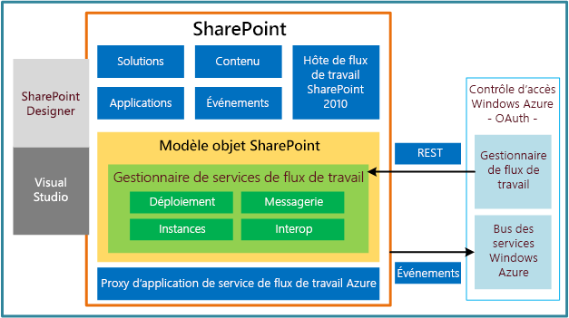

# Nouveautés des flux de travail pour SharePoint 2013
Découvrez les nouvelles fonctionnalités et caractéristiques des flux de travail dans SharePoint 2013.
L'infrastructure de flux de travail dans SharePoint 2013 a beaucoup changé par rapport aux versions précédentes. Les sections suivantes présentent des résumés des principales mises à jour et améliorations apportées à l'infrastructure de flux de travail.
  
    
    

## Infrastructure des flux de travail totalement repensée

Les flux de travail SharePoint 2013 sont alimentés par Windows Workflow Foundation 4 (WF), qui a été considérablement retravaillé par rapport aux versions précédentes. Windows Workflow Foundation est quant à lui basé sur la fonctionnalité de messagerie fournie par  [Windows Communication Foundation (WCF)](http://msdn.microsoft.com/fr-fr/netframework/aa663324).
  
    
    
La caractéristique principale de la nouvelle infrastructure des flux de travail est probablement l'introduction de Microsoft Azure comme nouvel hôte d'exécution du flux de travail. Le moteur d'exécution du flux de travail se trouve désormais en dehors de SharePoint, dans Microsoft Azure. La Figure 1 présente une vue générale de haut niveau de la nouvelle infrastructure des flux de travail. Pour une discussion approfondie des concepts présentés à la Figure 1, consultez la rubrique  [Notions de base sur les flux de travail SharePoint 2013](sharepoint-2013-workflow-fundamentals.md).
  
    
    

**Figure 1. Architecture de haut niveau de l'infrastructure des flux de travail**

  
    
    

  
    
    

  
    
    

  
    
    

  
    
    

## Environnement de création sans code, entièrement déclaratif

Parmi les modifications importantes se trouve le fait que les flux de travail sur la plateforme WF 4 sont entièrement déclaratifs. Autrement dit, les flux de travail ne sont plus compilés dans des assemblys managés ni déployés dans un cache d'assemblys. À la place, des fichiers XAML définissent vos flux de travail et encadrent leur exécution.
  
    
    

## Support pour la création SharePoint Designer 2013 revu et corrigé

SharePoint Designer 2013 a été mis à jour dans le but d'en faire l'environnement de création de choix pour la création de flux de travail SharePoint. SharePoint Designer 2013 apporte aux auteurs de flux de travail une aire de conception et un environnement de création de flux de travail textuel. De plus, vous pouvez développer des actions personnalisées de flux de travail dans Visual Studio 2012, puis les importer dans SharePoint Designer 2013, où elles seront alors accessibles à partir de Workflow Designer.
  
    
    
En bref, les besoins du travailleur de l'information (l'« utilisateur chevronné ») et du développeur ont été regroupés dans les environnements de création de flux de travail et de développement SharePoint.
  
    
    

## Support pour le type de projet de flux de travail Visual Studio 2012

Pour faciliter la collaboration entre le travailleur de l'information et le développeur de logiciels, Visual Studio 2012 fournit des types de projet de flux de travail SharePoint et un type d'élément d'action personnalisée de flux de travail. Pour plus d'informations sur le développement de flux de travail à l'aide de Visual Studio 2012 et pour des informations sur les différences entre SharePoint Designer 2013 et Visual Studio 2012 dans le développement de flux de travail, consultez la rubrique  [Développer des flux de travail SharePoint 2013 à l'aide de Visual Studio](develop-sharepoint-2013-workflows-using-visual-studio.md).
  
    
    

## Support pour la création d'actions personnalisées

De nombreux efforts ont été faits pour anticiper les exigences professionnelles des créateurs de flux de travail au niveau des modèles de flux de travail, des actions et des activités dans SharePoint Designer 2013 et Visual Studio 2012. Toutefois, nous savons également que nous ne pouvons pas anticiper les besoins spécifiques de chaque personne. C'est pour cette raison que Visual Studio 2012 propose un type d'élément d'action personnalisée de flux de travail qui permet aux développeurs de créer des actions personnalisées. Pour plus d'informations sur les actions personnalisées de flux de travail, consultez la rubrique  [Comment : créer et déployer des actions personnalisées de flux de travail](how-to-build-and-deploy-workflow-custom-actions.md).
  
    
    

## Prise en charge des outils pour les flux de travail SharePoint

Visual Studio 2012 propose des modèles et la prise en charge de la création de flux de travail dans l'infrastructure des flux de travail SharePoint 2013. Les flux de travail SharePoint 2013 sont semblables aux versions antérieures des flux de travail, mais ils sont alimentés WF 4 et ils s'exécutent dans Microsoft Azure. De plus, ils sont uniquement déclaratifs (XAML) et conçus pour interagir avec le cloud et fonctionner avec des Compléments SharePoint. L'un de leurs principaux avantages repose sur le fait qu'ils vous permettent d'héberger à distance et d'exécuter des flux de travail en dehors de SharePoint Server.
  
    
    

## Nouvelles actions de flux de travail

Les nouvelles actions de flux de travail suivantes sont fournies dans SharePoint 2013. Pour obtenir le détail complet des nouvelles actions et des actions obsolètes, consultez la rubrique  [Référence d'actions et les activités de flux de travail pour SharePoint 2013](workflow-actions-and-activities-reference-for-sharepoint-2013.md). Une nouveauté dans les flux de travail dans SharePoint 2013 consiste en un ensemble d'actions de flux de travail qui permettent une intégration avec Project 2013 et vous permettent de créer des flux de travail basés sur un projet.
  
    
    

**Tableau 1. Nouvelles actions de flux de travail dans SharePoint 2013**

|**Action**|**Description**|
|:-----|:-----|
|Affecter une tâche    |Affecte une tâche de flux de travail à un utilisateur ou à un groupe.    |
|Démarrer un processus de tâche    |Lance l'exécution d'un processus de tâche.    |
|Accéder à cette étape    |Précise, dans un flux de travail, l'étape suivante vers laquelle le contrôle de flux doit être envoyé.    |
|Appeler le service web HTTP    |Fonctionne comme une méthode d'appel vers un point de terminaison REST (Representational State Transfer).    |
|Démarrer un flux de travail de liste    |Démarre un flux de travail étendu à une liste.    |
|Démarrer un flux de travail de site    |Démarre un flux de travail étendu à un site.    |
|Créer DynamicValue    |Crée une variable de type **DynamicValue**.    |
|Obtenir la propriété de DynamicValue    |Récupère une valeur de propriété d'une variable spécifiée de type **DynamicValue**.    |
|Nombre d'éléments dans DynamicValue    |Renvoie le nombre de lignes dans une variable de type **DynamicValue**.    |
|Découper la chaîne    |Supprime tous les espaces blancs au début et à la fin de la chaîne actuelle.    |
|Rechercher la sous-chaîne dans la chaîne    |Renvoie l'index de base 1 de la première occurrence d'un ou de plusieurs caractères, ou la première occurrence d'une chaîne, dans une chaîne.    |
|Remplacer la sous-chaîne dans la chaîne    |Renvoie une nouvelle chaîne dans laquelle toutes les occurrences d'un caractère spécifié ou d'une chaîne spécifiée sont remplacées par un autre caractère spécifié ou une autre chaîne spécifiée.    |
|Traduire le document    |Fonctionne comme un wrapper de l'activité HTTP qui appelle l'API de traduction synchrone. Vous devez configurer une application de service de traduction automatique pour le site SharePoint sur lequel vous exécutez le flux de travail.    |
|Définir l'état du flux de travail    |Met à jour l'état du flux de travail tel que précisé dans la chaîne de message.    |
|Créer un projet à partir de l'élément actif [Microsoft Project]    |Crée un projet Project Server basé sur l'élément actif.    |
|Définir l'état de phase projet actuelle sur cette valeur [Microsoft Project]    |Définit les deux champs d'état au sein de l'étape actuelle du projet.    |
|Définir le champ d'état dans l'élément de liste d'idées sur cette valeur [Microsoft Project]    |Met à jour le champ d'état de l'élément de liste SharePoint d'origine.    |
|Attendre un événement de projet [Microsoft Project]    |Suspend l'instance actuelle du flux de travail pour attendre un événement de projet spécifié : projet archivé, projet engagé, projet soumis.    |
|Définir ce champ dans le projet sur cette valeur [Microsoft Project]    |Définit la valeur pour le champ personnalisé d'entreprise pour un projet spécifié.    |
   

## Ressources supplémentaires

-  [Mise en route avec les flux de travail dans SharePoint 2013](get-started-with-workflows-in-sharepoint-2013.md)
    
  
-  [Nouveautés pour les développeurs dans SharePoint 2013](what’s-new-for-developers-in-sharepoint-2013.md)
    
  
-  [Référence d'actions et les activités de flux de travail pour SharePoint 2013](workflow-actions-and-activities-reference-for-sharepoint-2013.md)
    
  
-  [Référence rapide relative aux actions de flux de travail (plateforme de flux de travail SharePoint 2013)](workflow-actions-quick-reference-sharepoint-2013-workflow-platform.md)
    
  

