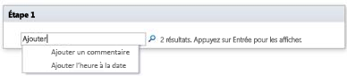

# Référence rapide relative aux actions de flux de travail (plateforme de flux de travail SharePoint 2010)
En savoir plus sur les actions de flux de travail disponibles dans la plateforme de flux de travail SharePoint 2010 dans Microsoft SharePoint Designer 2013.Utilisez cet article  *uniquement*  si vous travaillez dans SharePoint Designer 2013, mais que vous souhaitez continuer à utiliser la plateforme de flux de travail SharePoint 2010.Si vous voulez plutôt utiliser la plateforme de flux de travail SharePoint 2013, consultez  [Référence rapide relative aux actions de flux de travail (plateforme de flux de travail SharePoint 2013)](workflow-actions-quick-reference-sharepoint-2013-workflow-platform.md), ainsi que d'autres articles (mentionnés dans la section « Ressources supplémentaires ») concernant les nouvelles fonctionnalités disponibles dans la nouvelle plateforme.Pour commencer la création d'un flux de travail avec la plateforme de flux de travail 2010, sélectionnez **Flux de travail SharePoint 2010** dans la zone **Type de plateforme** de la boîte de dialogue **Créer le flux de travail**.
## Où trouver les actions de flux de travail

Il y a deux façons d'accéder au menu des actions de flux de travail disponibles.
  
    
    
Lorsque vous apportez des modifications à l'intérieur d'une étape de flux de travail, effectuez une des opérations suivantes :
  
    
    

- Dans l'onglet **Flux de travail**, dans le groupe **Insertion**, cliquez sur **Actions**.
    
  
- Double-cliquez dans l'étape du flux de travail. Dans la zone de recherche qui s'affiche, tapez le texte qui apparaît dans le nom de l'action que vous recherchez (par exemple « ajouter ») et appuyez sur Entrée. Les actions et les conditions qui contiennent le texte que vous avez tapé s'affichent en dessous de la zone de texte.
    

  

  

  
Les actions disponibles lors de la création du flux de travail dépendent du contexte. Par exemple, les actions **Démarrer le processus d'approbation** et **Démarrer le processus de commentaires** ne sont pas disponibles pour les sites basés sur Microsoft SharePoint Foundation 2013. Certaines actions de liste sont disponibles uniquement dans une étape d'emprunt d'identité et d'autres sont disponibles uniquement lorsque votre flux de travail est associé à une bibliothèque de documents ou à un type de contenu de document. Les actions de liste qui fonctionnent sur l'élément actuel, par exemple **Définir le statut d'approbation du contenu** et **Définir le champ dans l'élément actif**, ne sont pas accessibles.
  
    
    
Les actions sont organisées en catégories en fonction de leur domaine d'application dans le flux de travail. Par exemple, les actions qui affectent le comportement des éléments sont répertoriées sous **Actions de liste**, les actions applicables aux ensembles de documents sous **Actions d'ensembles de documents** et les actions de flux de travail personnalisées sous **Actions personnalisées**. Les catégories d'actions sont :
  
    
    

- Actions de base
    
  
- Actions d'ensembles de documents (qui apparaissent uniquement lorsque votre flux de travail est associé à une bibliothèque de documents ou à contenu de type document)
    
  
- Actions de liste
    
  
- Actions relationnelles (qui apparaissent uniquement lorsque votre site SharePoint exécute SharePoint Server 2013)
    
  
- Actions de tâche (qui apparaissent uniquement lorsque votre site SharePoint exécute SharePoint Server 2013)
    
  
- Actions de comportement de tâche (qui apparaissent uniquement lorsque vous personnalisez les tâches dans les actions de flux de travail prédéfinies, par exemple **Démarrer le processus d'approbation** et **Démarrer le processus de commentaires**)
    
  
- Actions utilitaires
    
  
- Actions personnalisées
    
  

## Actions générales

Les actions générales sont les actions qui s'affichent dans la liste d'actions de tous les contextes de flux de travail.
  
    
    

****

|**Action**|**Description**|
|:-----|:-----|
|**Actions de base**   |Les actions de cette catégorie sont les plus couramment utilisées dans les flux de travail.    |
|Ajouter un commentaire    | Cette action s'affiche dans l'étape du flux de travail sous la forme **Commentaire : texte du commentaire**. Cette action permet de laisser des commentaires informatifs dans le concepteur de flux de travail pour référence. Ceci peut être utile lorsque d'autres utilisateurs créent avec vous le flux de travail. Par exemple, si une variable du flux de travail actuel ne possède pas de nom convivial, vous pouvez utiliser cette action pour ajouter un commentaire et indiquer ce que fait cette variable dans le flux de travail.     Voici un exemple de ce à quoi l'action peut ressembler dans une étape de flux de travail :    Commentaire : Cette variable fournit le service de l'initiateur du flux de travail.   > **REMARQUE**>  Toute personne apportant des modifications au flux de travail Microsoft Visio 2013 est également en mesure d'afficher les commentaires.          |
|Ajouter l'heure à la date    | Cette action s'affiche dans l'étape de flux de travail sous la forme **Ajouter 0 minutes à la date (sortie vers la variable : date)**. Utilisez cette action pour ajouter un nombre spécifié de minutes, d'heures, de jours, de mois ou d'années à une date et stocker la valeur de sortie dans une variable. La valeur de date à laquelle l'heure est ajoutée peut être la date actuelle, une date spécifique ou le résultat d'une recherche.     Voici un exemple de ce à quoi l'action peut ressembler dans une étape de flux de travail :    Ajouter7jours àÉlément actuel : modification (sortie vers :Variable : une semaine après la modification)    |
|Effectuer un calcul    | Cette action s'affiche dans l'étape du flux de travail sous la forme **Calculer une valeur plus une valeur (sortie vers la variable : calcul)**. Utilisez cette action pour effectuer un calcul à l'aide de deux valeurs et stocker la valeur de sortie dans une variable. Les calculs possibles sont l'addition, la soustraction, la multiplication et la division.     Voici des exemples de ce à quoi l'action peut ressembler dans une étape de flux de travail :    Calculer36divisé par 9 (sortie vers lavariable : nombre de widgets)     Calculer [fx :: Courses*, Places occupées] plus 1 (Sortie vers la variable : nouvelles places occupées)   |
|Consigner dans l'historique    | Cette action s'affiche dans l'étape du flux de travail sous la forme **Consigner ce message dans l'historique du flux de travail**. Utilisez cette action pour enregistrer un message dans la liste d'historique du flux de travail à propos des actions ou de la progression du flux de travail. Ce message peut être le résumé d'un événement de flux de travail ou de toute autre chose que vous souhaitez enregistrer à propos de l'exécution du flux de travail actuel. Ces messages peuvent être utiles pour résoudre les problèmes des flux de travail. Vous pouvez par exemple noter un message qui enregistre un événement comme **Copié dans la liste A** ou **Envoyé les messages aux relecteurs**. Une fois le flux de travail terminé, vous pouvez accéder à la liste **Historique du flux de travail** et voir les messages affichés dans la colonne **Description**.     Voici un exemple de ce à quoi l'action peut ressembler dans une étape de flux de travail :    EnregistrerUne semaine depuis l'ensemble de variables modifié dans l'historique du flux de travail   > **REMARQUE**>  Si vous voulez qu'une action arrête le flux de travail, puis consigne un message dans l'historique, utilisez plutôt l'action **Arrêter le flux de travail**.           |
|Mettre en pause pour une certaine durée    |Cette action s'affiche dans l'étape du flux de travail sous la forme **Mettre en pause pendant 0 jours, 0 heures, 5 minutes**. Utilisez cette action pour suspendre le flux de travail pour la durée spécifiée en jours, heures et minutes.    > **REMARQUE**> Le délai qui s'affiche initialement reflète l'intervalle des travaux du minuteur, dont la valeur par défaut est de 5 minutes.           |
|Mettre en pause jusqu'à une date donnée    | Cette action s'affiche dans l'étape du flux de travail sous la forme **Mettre en pause jusqu'à une date donnée**. Utilisez cette action pour suspendre le flux de travail en pause jusqu'à une certaine date. Vous pouvez utiliser la date actuelle, une date spécifique ou le résultat d'une recherche.     Voici des exemples de ce à quoi l'action peut ressembler dans une étape de flux de travail :    Mettre en pause jusqu'à1/1/2010 12:00:00 AM    Mettre en pause jusqu'àVariable : une semaine après la modification   |
|Envoyer un courrier électronique    | Cette action s'affiche dans l'étape du flux de travail sous la forme **Envoyer un courrier électronique à ces utilisateurs**. Utilisez cette action pour envoyer un message électronique à un utilisateur ou à un groupe. Elle est généralement utilisée pour envoyer un message de confirmation aux participants du flux de travail. Les destinataires peuvent être un utilisateur ou un groupe de la collection de sites, ou toute autre personne au sein de votre organisation. Vous pouvez désormais spécifier une valeur dynamique dans l'objet, par exemple le résultat d'une recherche ou une chaîne.    > **IMPORTANTE**>  Les messages électroniques sortants doivent être configurés dans l'Administration centrale de SharePoint.           Voici un exemple de ce à quoi l'action peut ressembler dans une étape de flux de travail :    E-mailVariable : approbateurs   |
|Définir la partie heure du champ Date/Heure    | Cette action s'affiche dans l'étape du flux de travail sous la forme **Définir l'heure à 00:00 pour la date (sortie vers la variable : date1)**. Utilisez cette action pour créer un horodatage et stocker la valeur de sortie dans une variable. Vous pouvez définir l'heure en heures et en minutes et ajouter la date actuelle, une date spécifiée ou le résultat d'une recherche. Par exemple, supposons que vous souhaitez ajouter un horodatage à toute nouvelle commande ajoutée à une liste de commandes. Au lieu d'utiliser l'heure de réception de la commande dans l'horodatage, vous souhaitez ajouter une heure spécifique afin de pouvoir demander à votre flux de travail d'effectuer n'importe quelle opération (par exemple, le routage des commandes vers l'entrepôt) sur tous les nouveaux éléments qui ont le même horodatage. Voici un autre exemple. Supposons que vous ayez une présentation prévue pour 9 h 00 un jour précis et que vous souhaitez recevoir un rappel par courrier électronique. Vous pouvez utiliser cette action pour ajouter l'heure à la date, suspendre le flux de travail jusqu'à la veille de la présentation, puis demander au flux de travail de vous envoyer le rappel.     Voici un exemple de ce à quoi l'action peut ressembler dans une étape de flux de travail :    Définir l'heure sur00: 00 pourÉlément actuel :modifié (Sortie vers lavariable d'heure modifiée définie sur minuit)    |
|Définir l'état du flux de travail    | Cette action s'affiche dans l'étape du flux de travail sous la forme **Définir l'état du flux de travail sur Annulé**. Cette action permet de définir le statut du flux de travail. Les options par défaut sont Annulé, Approuvé et Rejeté.     Si vous tapez une nouvelle valeur de statut dans la liste déroulante de l'action, votre nouveau statut est automatiquement ajouté à la liste déroulante pour pouvoir être utilisé ultérieurement. Par exemple, vous pouvez ajouter un statut personnalisé, plus convivial et explicite que **Achevé** ou **Annulé**, par exemple **Note de frais approuvée**.    > **REMARQUE**>  Vous ne pouvez pas renommer ou supprimer la valeur du statut personnalisé une fois que celui-ci a été créé. Toutefois, il n'est jamais obligatoire de l'utiliser.>  Le statut personnalisé s'applique uniquement au flux de travail en cours et ne peut pas être utilisé dans un autre flux de travail.>  Le flux de travail ne peut pas utiliser les valeurs de statut personnalisé que vous définissez dans l'action, si cette dernière est utilisée dans une étape d'emprunt d'identité.           Si l'action **Définir le statut du flux de travail** est la dernière étape du flux de travail dans lequel vous avez également utilisé une valeur personnalisée, vous pouvez voir votre valeur personnalisée dans la colonne **Statut** de la liste lorsque le flux de travail s'interrompt ou se termine.    Voici un exemple de ce à quoi l'action peut ressembler dans une étape de flux de travail :    Définir le statut du flux de travail surStatut de spécification : prêt pour la révision de la conception   |
|Définir la variable de flux de travail    | Cette action s'affiche dans l'étape du flux de travail sous la forme **Définir la variable de flux de travail sur la valeur**. Cette action permet de diriger le flux de travail pour qu'il affecte des données de valeur à une variable.     Voici un exemple de ce à quoi l'action peut ressembler dans une étape de flux de travail :    Définir lavariable : Total de la note de frais surÉlément actuel :Total   |
|**Actions de liste**   |Les actions de cette catégorie effectuent des opérations sur les éléments de liste.    > **REMARQUE**> Certaines actions de cette catégorie s'affichent dans certains contextes de flux de travail, mais pas dans tous. Par exemple, certaines actions de liste s'affichent uniquement lorsque vous cliquez dans une étape d'emprunt d'identité dans votre flux de travail, tandis que certaines apparaissent uniquement lorsque votre flux de travail est joint à une bibliothèque de documents ou au type de contenu document. Pour plus d'informations, consultez  [Actions disponibles uniquement dans une étape d'emprunt d'identité](workflow-actions-quick-reference-sharepoint-2010-workflow-platform.md#section7a) et [Actions disponibles lorsque le flux de travail est associé à une bibliothèque de documents ou à un type de contenu de document](workflow-actions-quick-reference-sharepoint-2010-workflow-platform.md#section6) plus loin dans cet article.          |
|Archiver l'élément    | Cette action s'affiche dans l'étape du flux de travail sous la forme **Archiver cet élément dans la liste avec ce commentaire : commentaire**. Cette action permet d'archiver un élément actuellement extrait.     Voici un exemple de ce à quoi l'action peut ressembler dans une étape de flux de travail :    Archiver l'élément dansNote de frais avec le commentaire :Note de frais approuvée   > **REMARQUE**>  Vous pouvez archiver des éléments uniquement dans les bibliothèques de documents.          |
|Extraire l'élément    | Cette action s'affiche dans l'étape du flux de travail sous la forme **Extraire l'élément de cette liste**. Cette action permet d'extraire un élément actuellement archivé.     Voici un exemple de ce à quoi l'action peut ressembler dans une étape de flux de travail :    Extraire l'élément dansÉlément actif   > **REMARQUE**>  Vous pouvez extraire les éléments uniquement à partir d'une bibliothèque de votre site.>  Avant d'extraire l'élément, le flux de travail vérifie d'abord que cet élément est bien archivé.          |
|Copier l'élément de liste    | Cette action s'affiche dans l'étape du flux de travail sous la forme **Copier l'élément de la liste vers cette liste**. Cette action permet de copier un élément de liste dans une autre liste. (S'il existe déjà un document dans l'élément de liste, le flux de travail copie également le document dans la liste de destination.)     Voici un exemple de ce à quoi l'action peut ressembler dans une étape de flux de travail :    Copier l'élément deÉlément actif versDemandes d'archivage   > **IMPORTANTE**>  Au moins une colonne doit être similaire dans la liste source et la liste de destination.          |
|Créer un élément dans la liste    | Cette action s'affiche dans l'étape du flux de travail sous la forme **Créer un élément dans cette liste (Sortie vers la variable : créer)**. Cette action permet de créer un élément de liste dans la liste que vous spécifiez. Vous pouvez indiquer les champs et les valeurs dans le nouvel élément.     Vous pouvez utiliser cette action chaque fois que vous souhaitez qu'un nouvel élément soit créé avec les informations spécifiées. Par exemple, créez une annonce chaque fois qu'un document important pour l'entreprise (par exemple, un contrat) est approuvé ou archivé.   > **REMARQUE**>  La variable de sortie est l'ID du nouvel élément créé dans la liste.           Voici un exemple de ce à quoi l'action peut ressembler dans une étape de flux de travail :    Créer un élément dansCommandes (Sortie vers la variable : nouvelle référence de commande)   |
|Supprimer l'élément    | Cette action s'affiche dans l'étape du flux de travail sous la forme **Supprimer l'élément de cette liste**. Cette action permet de supprimer un élément dans une liste.     Voici un exemple de ce à quoi l'action peut ressembler dans une étape de flux de travail :    Supprimer l'élément dansDocuments   |
|Annuler l'extraction de l'élément    | Cette action s'affiche dans l'étape du flux de travail sous la forme **Annuler l'extraction de l'élément de cette liste**. Utilisez cette action pour réarchiver un élément sans conserver les modifications apportées depuis la dernière extraction.     Voici un exemple de ce à quoi l'action peut ressembler dans une étape de flux de travail :    Annuler l'extraction de l'élément dansDocuments   |
|Définir le statut d'approbation du contenu    | Cette action s'affiche dans l'étape du flux de travail sous la forme **Définir le statut d'approbation du contenu avec des commentaires**. Cette action permet de définir le champ de statut de l'approbation de contenu sur une valeur comme **Approuvé**, **Rejeté** ou **En attente**. (Vous pouvez également entrer un statut personnalisé dans l'action.)     Voici un exemple de ce à quoi l'action peut ressembler dans une étape de flux de travail :    Définir le statut d'approbation du contenu surApprouvé avecFini   > **REMARQUE**>  L'approbation de contenu doit être activée dans la liste pour que cette action fonctionne.           Cette action fonctionne sur l'élément sur lequel le flux de travail agit et par conséquent n'est pas disponible dans le flux de travail de site.   |
|Définir le champ dans l'élément actif    | Cette action s'affiche dans l'étape du flux de travail sous la forme **Définir le champ sur la valeur**. Cette action permet de définir un champ de l'élément actif sur une valeur précise.     Voici un exemple de ce à quoi l'action peut ressembler dans une étape de flux de travail :    DéfinirID de type de contenu surSpécification   > **REMARQUE**>  Si vous voulez suspendre le flux de travail jusqu'à ce que la valeur du champ change, utilisez plutôt l'action **Attendre la modification du champ dans l'élément actif**. >  L'action **Définir le champ dans l'élément actif** n'est pas disponible lorsque vous travaillez dans un flux de travail de site.          |
|Mettre à jour l'élément de la liste    | Cette action s'affiche dans l'étape du flux de travail sous la forme **Mettre à jour l'élément dans cette liste**. Cette action permet de mettre à jour un élément de liste. Vous pouvez spécifier les champs et les nouvelles valeurs que vous souhaitez leur attribuer.     Voici un exemple de ce à quoi l'action peut ressembler dans une étape de flux de travail :    Mettre à jour l'élément dansDocuments   |
|Attendre la modification du champ dans l'élément actif    | Cette action s'affiche dans l'étape du flux de travail sous la forme **Attendre que le champ soit égal à la valeur**. Cette action suspend le flux de travail jusqu'à ce que le champ spécifié dans l'élément actif prenne la valeur spécifiée.     Voici un exemple de ce à quoi l'action peut ressembler dans une étape de flux de travail :    AttendreStatut d'approbationégal à1;#Rejeté   > **REMARQUE**>  Si vous souhaitez que le flux de travail modifie la valeur du champ, plutôt que le flux de travail attende que le champ change, utilisez l'action **Définir le champ dans l'élément actif**.           |
|**Actions de tâche**   |Les actions de cette catégorie concernent les éléments de tâche.    |
|Assigner un formulaire à un groupe    | Cette action s'affiche dans l'étape du flux de travail sous la forme **Assigner un formulaire personnalisé à ces utilisateurs**. Utilisez cette action pour créer un formulaire de tâche personnalisé et assigner le formulaire à un ou plusieurs participants ou groupes. Les participants notent leurs réponses dans les champs du formulaire et une fois qu'ils ont terminé, ils cliquent sur **Terminer la tâche** dans le formulaire.    Voici un exemple de ce à quoi l'action peut ressembler dans une étape de flux de travail :    AssignerRapport des actifs àMarketing   > **REMARQUE**>  Il n'y a pas de valeur de retour identifiant les données de tâche.          |
|Affecter un élément de tâche    | Cette action s'affiche dans l'étape du flux de travail sous la forme **Affecter un élément de tâche à ces utilisateurs**. Cette action permet d'affecter une tâche à un ou plusieurs participants ou groupes, en les invitant à les effectuer. Une fois qu'ils ont terminé, ils cliquent le bouton **Terminer la tâche** dans le formulaire de tâche.    Voici un exemple de ce à quoi l'action peut ressembler dans une étape de flux de travail :    AffecterEnvoyer note de frais àMarketing   |
|Collecter les données d'un utilisateur    | Cette action s'affiche dans l'étape du flux de travail sous la forme **Collecter les données de cet utilisateur (Sortie vers la variable : collecte)**. Cette action permet d'affecter une tâche au participant, en l'invitant à fournir les informations nécessaires dans un formulaire de tâche personnalisé, puis à cliquer sur le bouton **Terminer la tâche** sur le formulaire de tâche.    Cette action a une clause de sortie, c'est-à-dire que le flux de travail stocke les informations retournées par l'action dans la variable correspondante. L'ID de l'élément de liste de la tâche terminée suite à l'action est stocké dans la variable **collect**.    Voici un exemple de ce à quoi l'action peut ressembler dans une étape de flux de travail :    CollecterNote de frais deMarketing (Sortie vers laVariable : Note de frais marketing)    |
|**Actions utilitaires**   |La plupart des actions de cette catégorie peuvent être utilisées pour extraire des informations à partir de chaînes de texte.    Vous pouvez couper une chaîne de texte et l'utiliser dans différents scénarios dans un flux de travail. Par exemple, supposons que votre société souhaite apposer un cachet sur tous les documents entrants avec un format de nom spécifique, par exemple date_service (par exemple : 07142009_ventes.docx), et que vous souhaitez exécuter des flux de travail qui affectent des tâches à un relecteur en fonction de la date d'horodatage sur ce fichier. Vous pouvez utiliser une action utilitaire pour obtenir les 8 premiers caractères du nom du document (07142009) et les convertir en date à l'aide de contraintes de recherche, afin de pouvoir affecter les tâches qui ont cette date d'échéance.    Pour plus d'informations sur les contraintes de recherche, consultez la section Voir aussi.    |
|Extraire la sous-chaîne de la fin de la chaîne    | Cette action s'affiche dans l'étape du flux de travail sous la forme **Copier 0 caractères à partir de la fin de la chaîne (sortie vers la variable : sous-chaîne)**. Cette action copie un nombre spécifié de caractères à partir de la fin d'une chaîne et stocke la valeur de sortie dans une variable. Vous spécifiez le nombre de caractères que le flux de travail copie à partir de la chaîne.     Voici un exemple de ce à quoi l'action peut ressembler dans une étape de flux de travail :    Copier les15 derniers caractères deÉlément actuel : nom (sortie vers la variable :Copy15CharFromEndOfName)    |
|Extraire la sous-chaîne de l'index de la chaîne    | Cette action s'affiche dans l'étape du flux de travail sous la forme **Copier dans la chaîne, à partir de 0 (sortie vers la variable : sous-chaîne**. Cette action copie tous les caractères à partir d'un caractère spécifique d'une chaîne et stocke la sortie dans une variable.     Voici un exemple de ce à quoi l'action peut ressembler dans une étape de flux de travail :    Copier dansÉlément actuel : nom, en commençant à 4 (sortie vers la variable :CopyStringFromChar4)    |
|Extraire la sous-chaîne depuis le début de la chaîne    | Cette action s'affiche dans l'étape du flux de travail sous la forme **Copier 0 caractères à partir du début de la chaîne (sortie vers la variable : sous-chaîne)**. Cette action copie un nombre spécifié de caractères à partir du début d'une chaîne et stocke la valeur de sortie dans une variable. Vous spécifiez le nombre de caractères que le flux de travail copie à partir de la chaîne.     Voici un exemple de ce à quoi l'action peut ressembler dans une étape de flux de travail :    Copier les15 premiers caractères depuis le début deÉlément actuel : nom (sortie vers la variable :Copy15CharFromStartOfName)    |
|Extraire la sous-chaîne de la chaîne à partir de l'index avec la longueur    | Cette action s'affiche dans l'étape du flux de travail sous la forme **Copier dans la chaîne, 0 caractères à partir de 0 (sortie vers la variable : sous-chaîne)**. Cette action copie un certain nombre de caractères à partir du caractère spécifié dans une chaîne et stocke la sortie dans une variable. Vous spécifiez le nombre de caractères que le flux de travail copie à partir de la chaîne.     Voici un exemple de ce à quoi l'action peut ressembler dans une étape de flux de travail :    Copier dansÉlément actuel : nom, en commençant à 415 caractères (sortie vers la variable :CopyfromChar4for15CharOfName)    |
|Rechercher l'intervalle entre les dates    | Cette action s'affiche dans l'étape du flux de travail sous la forme **Rechercher les minutes entre date et date (sortie vers la variable : heure)**. Utilisez cette action pour calculer la différence, en termes de minutes, d'heures ou de jours, entre deux dates et stocker la sortie dans une variable.     Voici un exemple de ce à quoi l'action peut ressembler dans une étape de flux de travail :    Rechercherminutes entreÉlément actuel : modification etAujourd'hui (sortie vers lavariable : Dernière modification en minutes)    |
   

## Actions disponibles lorsque votre site SharePoint exécute SharePoint Server 2013

Les actions comme **Démarrer le processus d'approbation**, **Déclarer un enregistrement** et **Rechercher le directeur d'un utilisateur** sont disponibles uniquement lorsque votre site SharePoint exécute SharePoint Server 2013.
  
    
    

****

|**Action**|**Description**|
|:-----|:-----|
|**Actions d'ensembles de documents**   |Les actions de cette catégorie concernent l'ensemble de documents. Un ensemble de documents est un dossier dans lequel des documents sont stockés. Dans les flux de travail, les ensembles de documents sont considérés comme un seul élément.    > **REMARQUE**> Pour pouvoir utiliser les ensembles de documents dans votre bibliothèque, vous devez ajouter le type de contenu Ensemble de documents dans la page des paramètres de la bibliothèque de votre site SharePoint.           |
|Démarrer le processus d'approbation de l'ensemble de documents    | Cette action s'affiche dans les étapes du flux de travail sous la forme **Démarrer le processus d'approbation du contenu de cet ensemble de documents avec les utilisateurs spécifiés dans cette colonne**. Cette action permet de démarrer une action d'approbation sur un ensemble de documents et sur tous les documents qu'il contient.     Lorsque vous utilisez cette action, le statut de l'ensemble de documents et le statut de tous les documents qu'il contient sont modifiés (ils passent par exemple à Approuvé ou Rejeté).    En revanche, si vous utilisez l'action **Démarrer le processus d'approbation** sur l'ensemble de documents, seul le statut de l'ensemble de documents est modifié, et non ceux des documents qu'il contient.    Voici un exemple de ce à quoi l'action peut ressembler dans une étape de flux de travail :    Démarrer le processusApprobation de nomenclature pour le contenu de cet ensemble de documents avec les utilisateurs spécifiés parVariable : approbateurs de nomenclature   |
|Capturer une version de l'ensemble de documents    | Cette action s'affiche dans les étapes du flux de travail sous la forme **Capturer une version de l'ensemble de documents qui comprend les versions de type de contenu avec le commentaire : commentaire**. Cette action permet de verrouiller la version de l'ensemble de documents qui contient le niveau de version des documents, mineure ou majeure, que vous spécifiez dans l'action.     Voici un exemple de ce à quoi l'action peut ressembler dans une étape de flux de travail :    Capturer une version de cet ensemble de documents qui inclut ladernière version principale du contenu avec le commentaire :Dernière version principale de la nomenclature   |
|Envoyer l'ensemble de documents au référentiel    | Cette action s'affiche dans les étapes du flux de travail sous la forme **Envoyer l'ensemble de documents avec cette action dans l'organisateur de contenu de destination avec cette explication (sortie vers la variable : envoyer le fichier de résultat)**. Cette action permet de déplacer ou de copier un ensemble de documents dans un référentiel de documents. Le référentiel de documents peut être une bibliothèque de votre site SharePoint ou un site entier (par exemple le centre de documents), qui achemine des enregistrements vers une destination particulière selon les règles que vous définissez.     Voici un exemple de ce à quoi l'action peut ressembler dans une étape de flux de travail :    Envoyer l'ensemble de documents aveccopie dansRéférentiel de documents : GUID avecCopie finale nomenclature dans le référentiel (sortie vers lavariable : Envoyer l'ensemble de documents au référentiel)    > **REMARQUE**>  Avant de pouvoir définir des règles et d'acheminer des documents, vous devez activer la fonctionnalité de site **Organisateur de contenu** dans votre site SharePoint. Pour plus d'informations, consultez la rubrique Configurer l'organisateur de contenu pour acheminer les enregistrements dans la section Voir aussi.          |
|Définir le statut d'approbation du contenu de l'ensemble de documents    | Cette action s'affiche dans l'étape du flux de travail sous la forme **Définir le statut d'approbation du contenu de l'ensemble de documents sur ce statut avec des commentaires**. Cette action permet de définir l'approbation du contenu d'un ensemble de documents sur **Approuvé**, **Rejeté** ou **En attente**.     Voici un exemple de ce à quoi l'action peut ressembler dans une étape de flux de travail :    Définir le statut d'approbation du contenu pour le contenu de cet ensemble de documents surApprouvé avec La nomenclature est approuvée.   > **REMARQUE**>  L'approbation de contenu doit être activée dans la liste avant de pouvoir utiliser cette action.          |
|**Actions de tâche**   |Les actions de cette catégorie sont utilisées dans les scénarios d'approbation. Il existe deux actions de flux de travail prédéfinies dans cette catégorie : **Démarrer le processus d'approbation** et **Démarrer le processus de commentaires**. Les actions prédéfinies fonctionnent en quelque sorte comme des sous-flux de travail, c'est-à-dire que la logique du flux de travail est déjà définie dans ces actions. Il vous suffit de fournir les informations appropriées.    Ces actions sont utilisées dans les flux de travail réutilisables globalement **Approbation - SharePoint 2013** et **Recueillir les commentaires à SharePoint 2013** qui sont fournis avec SharePoint Server 2013. Pour plus d'informations sur l'utilisation de ces flux de travail et quand utiliser ces actions, consultez la section [Quand utiliser les actions d'approbation et de commentaires ?](workflow-actions-quick-reference-sharepoint-2010-workflow-platform.md#section5) de cet article.   Une autre action également disponible est **Démarrer le processus de tâche personnalisée**, qui dispose également d'une logique intégrée, mais qui (contrairement aux deux actions précédentes) n'est pas intégrée dans ce que le flux de travail doit faire à chaque phase.    Une catégorie d'actions appelées **Actions de comportement de tâche** s'affiche dans la liste Actions uniquement lorsque vous personnalisez le comportement d'une action d'approbation comme **Attribuer un élément pour approbation** ou **Attribuer un élément pour obtenir des commentaires**. Pour plus d'informations sur les **Actions de comportement de tâche**, consultez la section  [Actions disponibles dans les actions de tâche](workflow-actions-quick-reference-sharepoint-2010-workflow-platform.md#section4) de cet article.   |
|Démarrer le processus d'approbation    | Cette action s'affiche dans l'étape du flux de travail sous la forme **Démarrer le processus d'approbation sur l'élément actuel avec ces utilisateurs**. Cette action permet d'acheminer un document pour approbation. Les approbateurs peuvent approuver ou rejeter le document, réaffecter la tâche d'approbation ou demander des modifications dans le document.     L'action **Démarrer le processus d'approbation** se comporte comme un flux de travail prédéfini : la logique est déjà définie dans l'action. L'action comporte des phases distinctes intégrées pour définir le comportement des tâches, le comportement des processus de tâches, la journalisation dans l'historique, les notifications par courrier électronique et les conditions d'achèvement. Bien que l'action soit fournie avec cette logique prédéfinie, elle a toujours besoin d'informations de votre part, par exemple qui sont les relecteurs, si les tâches d'approbation sont affectées une par une (« en série », valeur par défaut) ou toutes en même temps (« en parallèle ») et les dates d'échéance ou la durée permise avant la fin de la tâche.    Vous pouvez affecter des tâches aussi bien aux participants internes qu'aux participants externes. Un participant externe peut être un employé de votre organisation qui n'est pas utilisateur de la collection de sites ou toute autre personne extérieure à votre organisation.    Voici un exemple de ce à quoi l'action peut ressembler dans une étape de flux de travail :    Démarrer le processusApprobation de la spécification surÉlément actif avecVariable : Approbateurs   |
|Démarrer le processus de commentaires    | Cette action s'affiche dans l'étape du flux de travail sous la forme **Démarrer le processus de commentaires sur l'élément actuel avec ces utilisateurs**. Cette action permet d'acheminer un document pour commentaire. Les relecteurs peuvent envoyer des commentaires ou réaffecter la tâche de commentaire.     L'action **Démarrer le processus de commentaires** se comporte comme un flux de travail prédéfini : la logique est déjà définie dans l'action. L'action comporte des phases distinctes intégrées pour définir le comportement des tâches, le comportement des processus de tâches, la journalisation dans l'historique, les notifications par courrier électronique et les conditions d'achèvement. Bien que l'action d'approbation soit fournie avec cette logique prédéfinie, elle a toujours besoin d'informations de votre part, par exemple qui sont les relecteurs, si les tâches d'approbation sont affectées une par une (« en série », valeur par défaut) ou toutes en même temps (« en parallèle ») et les dates d'échéance ou la durée permise avant la fin de la tâche.    Vous pouvez affecter des tâches aussi bien aux participants internes qu'aux participants externes. Un participant externe peut être un employé de votre organisation qui n'est pas utilisateur de la collection de sites ou toute autre personne extérieure à votre organisation.    Voici un exemple de ce à quoi l'action peut ressembler dans une étape de flux de travail :    Démarrer le processusCommentaires sur la spécification surÉlément actif avecVariable : Relecteurs   |
|Démarrer le processus de tâche personnalisée    | Cette action s'affiche dans l'étape du flux de travail sous la forme **Démarrer le processus de tâche sur l'élément actuel avec ces utilisateurs**. Utilisez l'action **Démarrer le processus de tâche personnalisée** (modèle de processus d'approbation) si aucune des deux opérations d'approbation précédentes ne répond à vos besoins. L'action **Démarrer le processus de tâche personnalisée** permet également d'intégrer une logique, mais à la différence des deux autres actions d'approbation, elle ne contient pas par défaut les actions dont le flux de travail a besoin à chaque phase. Vous pouvez spécifier vos propres actions et conditions dans les comportements de la tâche ou spécifier les conditions d'achèvement.    Voici un exemple de ce à quoi l'action peut ressembler dans une étape de flux de travail :    Démarrer le processusApprobation de la leçon vidéo surÉlément actif avecVariable : Approbateurs   |
|**Actions de liste**   |Les actions de cette catégorie effectuent des opérations sur les éléments de liste.    |
|Déclarer un enregistrement    |Cette action s'affiche dans l'étape du flux de travail sous la forme **Déclarer cet élément comme enregistrement**. Utilisez cette action pour identifier un document en tant qu'enregistrement et appliquer les paramètres des restrictions liées aux enregistrements que vous avez éventuellement définis dans la page des **paramètres de déclaration d'enregistrement** sur votre site SharePoint.   Il n'y a aucune variable à définir pour cette action.    Vous pouvez définir les paramètres de déclaration d'enregistrement sur le site de niveau supérieur dans votre collection de sites. Les paramètres de déclaration d'enregistrement régissent la façon dont les enregistrements sont traités, par exemple s'ils peuvent être modifiés ou supprimés, les métadonnées qui leur sont appliquées et la stratégie de rétention des enregistrements. Les paramètres de déclaration d'enregistrement spécifient des restrictions qui doivent être appliquées après qu'un élément est déclaré comme enregistrement, ainsi que les rôles d'utilisateur autorisés à déclarer des enregistrements et si la déclaration d'enregistrement est disponible pour tous les utilisateurs du site.    |
|Annuler la déclaration d'un enregistrement    |Cette action s'affiche dans l'étape du flux de travail sous la forme **Annuler la déclaration de l'élément comme enregistrement**. Cette action permet d'annuler les paramètres de déclaration d'enregistrement appliqués à un enregistrement.    Il n'y a aucune variable à définir pour cette action.    Vous pouvez définir les paramètres de déclaration d'enregistrement sur le site de niveau supérieur dans votre collection de sites. Les paramètres de déclaration d'enregistrement régissent la façon dont les enregistrements sont traités, par exemple s'ils peuvent être modifiés ou supprimés, les métadonnées qui sont appliquées à l'enregistrement et la stratégie de rétention des enregistrements. Les paramètres de déclaration d'enregistrement spécifient des restrictions qui doivent être appliquées après qu'un élément est déclaré comme enregistrement, les rôles d'utilisateur autorisés à déclarer des enregistrements et si la déclaration d'enregistrement est disponible pour tous les utilisateurs du site.    |
|**Actions relationnelles**   |L'action de cette catégorie vous permet de rechercher le directeur d'un utilisateur et de stocker cette valeur dans une variable.    |
|Rechercher le directeur d'un utilisateur    | Cette action s'affiche dans l'étape du flux de travail sous la forme **Rechercher le directeur d'un utilisateur (sortie vers la variable : directeur)**. Cette action vous permet de rechercher le directeur d'un utilisateur et de stocker cette valeur dans une variable.     Voici un exemple de ce à quoi l'action peut ressembler dans une étape de flux de travail :    Rechercher le responsable deContexte flux de travail : initiateur (sortie vers lavariable : directeur)    |
   

## Actions disponibles dans les actions de tâche

Les actions comme **Démarrer le processus d'approbation** et **Démarrer le processus de commentaires** peuvent être utilisées dans les flux de travail pour assigner des éléments de liste pour approbation ou pour commentaire. Même si ces actions sont prédéfinies (c'est-à-dire que la majeure partie de la logique de flux de travail est déjà définie dans l'action), vous devez fournir les informations supplémentaires demandées par l'action (par exemple, en identifiant les approbateurs ou les relecteurs auxquels les tâches doivent être affectées).
  
    
    

> **REMARQUE**
> Si ces actions ne répondent pas complètement à vos besoins, vous pouvez les personnaliser dans le navigateur, dans SharePoint Designer 2013, et dans les environnements de développement compatibles avec SharePoint, dont Visual Studio. Vous pouvez également personnaliser l'action **Démarrer le processus de tâche personnalisée** avec les mêmes outils. Cette action est un modèle que vous pouvez utiliser pour définir un nouveau processus de tâche dans votre organisation.
  
    
    

Lorsque vous personnalisez le comportement de la tâche dans les actions comme **Démarrer le processus d'approbation** et **Démarrer le processus de commentaires**, une nouvelle catégorie d'actions appelée **Actions de comportement de tâche** est disponible.
  
    
    

> **REMARQUE**
> Les actions de cette catégorie qui sont disponibles varient en fonction de là où vous vous trouvez dans le flux de travail dans lequel vous travaillez. 
  
    
    

****

|**Action**|**Description**|
|:-----|:-----|
|Terminer le processus de tâche|Cette action s'affiche dans l'étape du flux de travail sous la forme **Terminer le processus de tâche**. Cette action permet de terminer le processus de la tâche. Le flux de travail principal passe à l'action suivante.|
|Définir le statut d'approbation du contenu (comme auteur)|Cette action s'affiche dans l'étape du flux de travail sous la forme **Définir le statut d'approbation de l'élément sur lequel la tâche travaille sur ce statut (exécuter en tant qu'auteur du flux de travail)**. Elle vous permet de définir le statut d'approbation de l'élément de liste sur **Approuvé**, **Rejeté** ou **En attente** en utilisant les autorisations de l'auteur du flux de travail au lieu de celles de la personne qui démarre le flux de travail. Cette action est couramment utilisée si la personne qui démarre le flux de travail d'approbation ne dispose peut-être pas des autorisations nécessaires pour approuver un document.L'élément de liste spécifié dans l'action est l'action en cours d'exécution sur l'élément. Il peut ou non s'agir du même élément que celui sur lequel s'exécute le flux de travail global.> **REMARQUE**> L'approbation de contenu doit être activée dans la liste pour que cette action fonctionne.           |
|Attendre la modification de l'élément traité par la tâche|Cette action s'affiche dans l'étape du flux de travail sous la forme **Attendre la modification de l'élément sur lequel la tâche s'exécute**. Cette action permet de suspendre le traitement par la tâche jusqu'à ce qu'une valeur de l'élément sur lequel le processus d'approbation s'exécute soit modifiée.|
|Attendre la suppression de l'élément traité par la tâche|Cette action s'affiche dans l'étape du flux de travail sous la forme **Attendre la suppression de l'élément traité par la tâche**. Cette action permet de suspendre le traitement par la tâche jusqu'à ce qu'une valeur de l'élément sur lequel le processus d'approbation s'exécute soit supprimée.|
||L'action suivante s'affiche uniquement quand vous personnalisez l'action **Démarrer le processus d'approbation**, cliquez sur **Modifier le comportement d'une seule tâche**, puis cliquez dans l'étape **Avant l'affectation de la tâche**.|
|Définir le champ de tâche|Cette action s'affiche dans l'étape du flux de travail sous la forme **Définir le champ de tâche sur la valeur**. Cette action permet de définir un champ spécifique dans l'élément de tâche actuel sur une valeur spécifiée. Cette action peut être utilisée sur une tâche qui n'a pas encore été créée.|
||Les actions suivantes s'affichent uniquement lorsque quand vous personnalisez l'action **Démarrer le processus d'approbation**, cliquez sur **Modifier le comportement d'une seule tâche**, puis cliquez dans l'étape **Lorsque la tâche est en attente ou Lorsque la tâche expire**.|
|Annuler la tâche|Cette action s'affiche dans l'étape du flux de travail sous la forme **puis Annuler cette tâche**. Cette action permet de terminer la tâche sans résultat.|
|Ajouter une tâche|Cette action s'affiche dans l'étape du flux de travail sous la forme **puis Ajouter une tâche et l'affecter à cet utilisateur**. Cette action permet d'affecter une tâche à l'utilisateur spécifié à la fin de l'étape actuelle dans l'action d'approbation. Si l'étape actuelle était Madeleine;Diane;Olivier, l'ajout de la tâche après Diane change l'étape en Madeleine;Diane;Olivier;Diane.|
|Déléguer la tâche|Cette action s'affiche dans l'étape du flux de travail sous la forme **puis Déléguer cette tâche à cet utilisateur**. Cette action permet d'annuler l'affectation d'une tâche à l'utilisateur actuel, puis d'affecter la même tâche à un autre utilisateur. Si la nouvelle affectation est un groupe, une seule tâche est affectée au groupe dans son ensemble, plutôt qu'une tâche à chaque membre du groupe. Pour affecter une tâche à chaque membre du groupe, utilisez plutôt l'action **Transférer la tâche**.|
|Réaffecter la tâche|Cette action s'affiche dans l'étape du flux de travail sous la forme **Puis Réaffecter cette tâche au responsable du détenteur actuel**. Cette action permet d'affecter la tâche au responsable de l'utilisateur auquel la tâche est actuellement affectée. Il n'y a aucune variable à définir pour cette action.|
|Transférer la tâche|Cette action s'affiche dans l'étape du flux de travail sous la forme **puis Transférer cette tâche à l'utilisateur**. Cette action permet d'annuler l'affectation d'une tâche à l'utilisateur actuel et d'affecter cette même tâche à un autre utilisateur. Si la nouvelle affectation est un groupe, une tâche est affectée à chaque membre du groupe et non uniquement une seule tâche au groupe entier. Pour affecter une seule tâche à l'ensemble du groupe, utilisez plutôt l'action **Déléguer la tâche**.|
|Insérer la tâche|Cette action s'affiche dans l'étape du flux de travail sous la forme **puis Insérer la tâche affectée à cet utilisateur**. Cette action, dans le processus d'approbation, permet d'insérer, à la suite de l'étape actuelle, une nouvelle étape dans laquelle l'utilisateur spécifié est le seul participant.|
|Réaffecter la tâche|Cette action s'affiche dans l'étape du flux de travail sous la forme **puis Réaffecter la tâche à cet utilisateur**. Cette action permet de réaffecter une tâche à un autre utilisateur.|
|Demander une modification|Cette action s'affiche dans l'étape du flux de travail sous la forme **puis Demander une modification de cet utilisateur**. Cette action permet de demander la modification à un autre utilisateur puis, une fois la modification effectuée, d'affecter une nouvelle tâche à l'utilisateur actuel.|
|Envoyer l'e-mail de la tâche|Cette action s'affiche dans l'étape du flux de travail sous la forme **puis Envoyer un e-mail de la tâche à ces utilisateurs**. Cette action permet d'ajouter le bouton **Modifier la tâche** au message de notification de tâche envoyé aux utilisateurs spécifiés.|
   

## Quand utiliser les actions d'approbation et de commentaires ?

Dans Microsoft Office SharePoint Designer 2007, vous utilisiez les actions de tâche dans les scénarios d'approbation. Avec les flux de travail réutilisables prédéfinis dans SharePoint Server 2013, par exemple **Approbation - SharePoint 2013** et **Recueillir les commentaires - SharePoint 2013**, vous vous demandez probablement où se trouvent les différences avec les actions de tâche **Démarrer le processus d'approbation** et **Démarrer le processus de commentaires**. Bien que les actions de tâche et les flux de travail prédéfinis puissent être utilisés dans les scénarios de commentaires et d'approbation, les flux de travail prédéfinis proposent une solution plus sophistiquée et plus complète.
  
    
    
Si les flux de travail réutilisables prédéfinis ne répondent pas à vos besoins, vous pouvez les personnaliser à l'aide de SharePoint Designer 2013. Si la personnalisation d'un flux de travail prédéfini en fonction de vos besoins prend plus de temps que la création d'un flux de travail, vous pouvez réutiliser les actions **Démarrer le processus d'approbation** et **Démarrer le processus de commentaires** dans votre nouveau flux de travail. Si vous souhaitez utiliser la structure de ces actions, mais pas toutes les fonctionnalités préconfigurées, vous pouvez utiliser l'action **Démarrer le processus de tâche personnalisée**.
  
    
    
Notez que les différentes actions de tâche peuvent être utilisées dans des scénarios qui vont au-delà des simples tâches d'approbation ou de commentaires. Par exemple, vous pouvez utiliser une action de tâche pour envoyer des messages pour rappeler aux employés de remplir leur feuille de temps.
  
    
    
Le tableau suivant présente une comparaison entre les trois actions de tâche d'une part et les flux de travail réutilisables prédéfinis d'autre part :
  
    
    

****

|**Fonctionnalité**|**Actions de tâche**|**Création préalable de flux de travail réutilisables**|
|:-----|:-----|:-----|
|Nombre d'utilisateurs impliqués dans le processus    |Un seul utilisateur ou un groupe par action de tâche.    |Dans les flux de travail prédéfinis, plusieurs utilisateurs et groupes peuvent être définis dans plusieurs étapes d'affectation. Chaque étape de l'affectation vous permet d'effectuer deux spécifications : si les tâches sont affectées en série ou en parallèle, et à quels utilisateurs, quels groupes et quels autres participants ces tâches sont affectées.    |
|Logique de flux de travail préinstallée    |Les trois actions de tâche ne disposent pas de logique intégrée. Vous devez utiliser d'autres actions et conditions pour créer un mécanisme d'approbation ou de commentaires.    |Les flux de travail prédéfinis sont déjà équipés de la logique intégrée pour proposer une expérience complète d'approbation ou de commentaires. Vous pouvez utiliser leur logique par défaut ou la personnaliser en fonction de vos besoins.    |
|Ordre d'affectation des tâches    |Dans les trois actions de tâche, les tâches peuvent uniquement être affectées en parallèle, à la fois pour les utilisateurs et pour les membres du groupe. C'est-à-dire que toutes les tâches affectées par une action de tâche sont affectées en même temps, en une seule étape.    |Dans les flux de travail prédéfinis, les tâches peuvent être affectées soit en une seule étape, soit en plusieurs étapes. Dans chacune de ces étapes, les tâches peuvent être affectées en série ou en parallèle.    |
|Liaison des données avec les informations sur la tâche    |Ces trois actions de tâche ne disposent pas de fonctions de recherche prêtes à l'emploi.    **Collecter les données d'un utilisateur** est une action qui contient une clause de sortie : les données générées au moment de l'exécution du flux de travail sont stockées dans la variable dans la clause de sortie. Pour créer vous-même un scénario d'approbation ou de commentaires, vous devez ensuite fournir cette variable dans différentes actions du flux de travail   |Les flux de travail prédéfinis tirent parti des sources de données (dont l'élément actif, les variables et les paramètres prédéfinis du flux de travail, le contexte du flux de travail en cours et les résultats de la tâche), ce qui simplifie la personnalisation du flux de travail en fonction de vos besoins.    Par exemple, pour envoyer un message à la personne à qui la tâche actuelle est affectée, vous pouvez utiliser l'action **Envoyer un courrier électronique** et configurer l'action pour envoyer un message électronique à **Tâche en cours : Affectée à**.    |
|Fonctionnalités spéciales pour les participants à la tâche    |Ces trois actions de tâche n'offrent aucune fonctionnalité spéciale (réaffectation ou options de demande de modification, par exemple) aux participants de la tâche.    |Dans les flux de travail prédéfinis, les actions d'approbation peuvent permettre au participant de la tâche de réaffecter cette tâche à un autre utilisateur ou de demander une modification auprès du propriétaire de la tâche, d'un simple clic.    |
|Fin de la tâche    |Dans les trois actions de tâche, le seul bouton disponible pour indiquer la fin de la tâche est **Terminer la tâche**.    |Dans les flux de travail prédéfinis, vous pouvez ajouter d'autres boutons, par exemple **Approuver** et **Rejeter**, pour préciser le résultat de la tâche.    |
   

## Actions disponibles lorsque le flux de travail est associé à une bibliothèque de documents ou à un type de contenu de document

Certaines actions de flux de travail (comme **Documents partagés**) sont disponibles uniquement lorsque le flux de travail est associé à une bibliothèque de documents ou au type de contenu **Document** ou à l'enfant de ce type de contenu.
  
    
    

****

|**Action**|**Description**|
|:-----|:-----|
|**Actions de base**   ||
|Envoyer le document vers le référentiel    | Cette action s'affiche dans l'étape du flux de travail sous la forme **Envoyer le fichier avec cette action vers cette destination avec cette explication (sortie vers la variable : envoyer le fichier de résultat)**. Cette action permet de déplacer ou de copier le document associé à la liste vers un référentiel de documents. Le référentiel de documents peut être une bibliothèque de votre site SharePoint ou un site entier (par exemple le centre de documents), qui achemine des enregistrements vers une destination particulière selon les règles que vous définissez.     Voici un exemple de ce à quoi l'action peut ressembler dans une étape de flux de travail :    Envoyer le fichier avecDéplacer dansArchive : valeur ID du document avecLe fichier est prêt à être archivé (sortie vers lavariable : envoyer le fichier pour archivage)    |
|**Actions d'ensembles de documents**   |Les actions de cette catégorie concernent l'ensemble de documents. Un ensemble de documents est un dossier dans lequel des documents sont stockés. Dans un flux de travail, l'ensemble de documents et tous les documents qu'il contient sont traités comme un seul élément.    > **REMARQUE**>  Pour pouvoir utiliser les ensembles de documents dans votre bibliothèque, vous devez ajouter le type de contenu Ensemble de documents dans la page des paramètres de la bibliothèque de votre site SharePoint.>  Les ensembles de documents sont une fonction de SharePoint Server 2013.          Pour plus d'informations sur les actions sur les ensembles de documents, consultez la section  [Actions disponibles lorsque votre site SharePoint exécute SharePoint Server 2013](workflow-actions-quick-reference-sharepoint-2010-workflow-platform.md#section3) de cet article.   |
|**Actions de liste**   |Cette catégorie d'actions effectue des opérations sur les éléments de liste.    |
|Supprimer les brouillons    |Cette action s'affiche dans l'étape du flux de travail sous la forme **Supprimer tous les brouillons (versions mineures) de cet élément**. Cette action permet de supprimer tous les brouillons ou toutes les versions mineures de l'élément actuel. Il n'y a aucune variable à définir pour cette action.    > **REMARQUE**> Le contrôle de version avec les versions mineures doit être activé dans la liste SharePoint pour que cette action puisse fonctionner.           |
|Supprimer les versions précédentes    |Cette action s'affiche dans l'étape du flux de travail sous la forme **Supprimer toutes les versions précédentes de cet élément**. Cette action permet de supprimer toutes les versions précédentes de l'élément actuel. Il n'y a aucune variable à définir pour cette action.    > **REMARQUE**> Le contrôle de version doit être activé dans la liste SharePoint pour que cette action puisse fonctionner.           |
   

## Actions disponibles uniquement dans une étape d'emprunt d'identité

Certaines actions de liste sont disponibles uniquement dans une étape d'emprunt d'identité. Les étapes d'emprunt d'identité indiquent au flux de travail qu'il doit effectuer des actions en prenant l'identité de l'auteur du flux de travail au lieu de celle de l'initiateur du flux de travail. Les étapes d'emprunt d'identité sont utiles dans les scénarios tels que l'approbation et la publication au cours desquels les utilisateurs qui envoient du contenu pour approbation ne disposent peut-être pas des mêmes autorisations que les personnes qui approuvent ce contenu. Les étapes d'emprunt d'identité sont également utiles pour automatiser les tâches d'administrateur du site (par exemple dans le cas d'un flux de travail qui affecte automatiquement des autorisations aux utilisateurs).
  
    
    

> **REMARQUE**
>  L'auteur du flux de travail est la personne qui a publié le flux de travail pour la dernière fois.>  Une étape d'emprunt d'identité ne peut être imbriquée dans aucune autre étape.
  
    
    

|**Action**|**Description**|
|:-----|:-----|
|Ajouter des autorisations à l'élément de liste    | Cette action s'affiche dans l'étape du flux de travail sous la forme **Ajouter ces autorisations à l'élément de la liste**. Cette action permet d'accorder aux utilisateurs concernés les niveaux d'autorisation nécessaires pour l'élément spécifié.     Voici un exemple de ce à quoi l'action peut ressembler dans une étape de flux de travail :    AjouterContribuer, Lecture à l'élément dansImages   |
|Hériter des autorisations parentes des éléments de liste    | Cette action s'affiche dans l'étape du flux de travail sous la forme **Hériter des autorisations parentes de l'élément de cette liste**. Utilisez cette action pour forcer un élément de liste qui possède des autorisations uniques à hériter des autorisations du parent de sa liste.     Voici un exemple de ce à quoi l'action peut ressembler dans une étape de flux de travail :    Hériter des autorisations du parent de l'élément dansImages   |
|Supprimer les autorisations associées aux éléments de liste    | Cette action s'affiche dans l'étape du flux de travail sous la forme **Supprimer ces autorisations de l'élément dans la liste**. Cette action permet de retirer aux utilisateurs concernés les niveaux d'autorisation pour l'élément spécifié.     Voici un exemple de ce à quoi l'action peut ressembler dans une étape de flux de travail :    SupprimerContribution de l'élément dansImages   |
|Remplacer les autorisations associées aux éléments de liste    | Cette action s'affiche dans l'étape du flux de travail sous la forme **Remplacer les autorisations de l'élément dans la liste**. Cette action permet de remplacer, pour un ou plusieurs utilisateurs, le niveau d'autorisation actuel sur un élément spécifique par un nouveau niveau d'autorisation.     Voici un exemple de ce à quoi l'action peut ressembler dans une étape de flux de travail :    RemplacerRead dans l'élément parImages   |
   

## Actions au sein d'un flux de travail de site

Le flux de travail de site fonctionne au niveau du site et n'est pas lié aux objets plus spécifiques (par exemple, un type de contenu ou un élément en particulier). Lorsque vous travaillez au sein d'un flux de travail de site, les actions qui fonctionnent sur un élément en cours, par exemple **Définir le statut d'approbation du contenu** et **Définir le champ dans l'élément actif**, ne sont pas accessibles. Pour plus d'informations sur ces actions, consultez la section  [Actions générales](workflow-actions-quick-reference-sharepoint-2010-workflow-platform.md#section2) de cet article.
  
    
    

## Ressources supplémentaires

-  [Référence rapide relative aux actions de flux de travail (plateforme de flux de travail SharePoint 2013)](workflow-actions-quick-reference-sharepoint-2013-workflow-platform.md)
    
  
-  [Nouveautés des flux de travail pour SharePoint 2013](what-s-new-in-workflows-for-sharepoint-2013.md)
    
  
-  [Mise en route avec les flux de travail dans SharePoint 2013](get-started-with-workflows-in-sharepoint-2013.md)
    
  
-  [Développement de flux de travail dans SharePoint Designer et Visio](workflow-development-in-sharepoint-designer-and-visio.md)
    
  

  
    
    
