# Utilisation des tâches dans les flux de travail SharePoint 2013 à l'aide de Visual Studio 2012
Découvrez la nouvelle structure de tâches de flux de travail plus performante désormais proposée dans SharePoint 2013, qui se base sur le nouveau Workflow Manager. 
 **Fourni par :** [Andrew Connell](http://social.msdn.microsoft.com/profile/andrew%20connell%20%5bmvp%5d/),  [AndrewConnell.com](http://www.andrewconnell.com)
  
    
    


  
    
    

> **REMARQUE**
> Cet article est accompagné d'un exemple de code de bout en bout que vous pouvez utiliser pour suivre l'article, ou comme point de départ pour vos propres projets de flux de travail SharePoint. Vous trouverez le code téléchargeable  [ici](http://assets.andrewconnell.com/media/Default/Downloads/SP2013Wf-CustomTasks.zip). 
  
    
    


  
    
    
L'un des principaux avantages que SharePoint offre à la Windows Workflow Foundation est l'implémentation d'une nouvelle structure de gestion des tâches améliorée, qui intègre le nouveau Workflow Manager en tant qu'environnement d'hébergement.
## Récapitulatif des tâches de flux de travail dans SharePoint 2007 et SharePoint 2010

SharePoint 2007 et SharePoint 2010 implémentaient les tâches de flux de travail d'une manière similaire. Lorsque vous créiez une association de flux de travail sur une liste, un type de contenu ou un site (dans SharePoint 2010), vous désigniez une liste spécifique en tant qu'emplacement dans lequel les tâches de flux de travail étaient créées. Cette liste était une liste SharePoint **Task** standard (ID = 107) qui utilisait le type de contenu SharePoint **Task** standard (ID = 0x0108). Les utilisateurs pouvaient ensuite accéder aux éléments de la liste pour afficher, modifier et exécuter la tâche. Les instances de flux de travail surveillaient les éléments de tâche dans la liste des mises à jour, si le flux de travail était configuré pour cela.
  
    
    
Toutefois, le rendu par défaut de la tâche de formulaire dans SharePoint était prédéterminé, même pour les flux de travail personnalisés. Pour une flexibilité totale, vous deviez utiliser les ASP.NET [formulaires web](http://www.asp.net/web-forms) ou les [formulaires InfoPath](http://msdn.microsoft.com/fr-fr/library/ms540731%28v=office.14%29.aspx) lorsque vous créiez des solutions de formulaires personnalisées pour la prise en charge de vos tâches.
  
    
    

## Nouveautés concernant les tâches dans SharePoint 2013

Le mode de création et de gestion des tâches dans SharePoint 2013 a été modifié en raison des changements apportés au niveau de l'architecture SharePoint.
  
    
    
La modification principale concerne les flux de travail qui ne sont plus gérés et traités dans SharePoint. Au lieu de cela, SharePoint 2013 utilise un nouveau composant appelé Workflow Manager, qui s'exécute en externe. Workflow Manager héberge les services d'exécution et les services nécessaires de la Windows Workflow Foundation qui sont requis par la Windows Workflow Foundation. Lorsqu'un flux de travail est publié ou qu'une nouvelle instance d'un flux de travail publié est démarrée, SharePoint informe Workflow Manager, qui à son tour traite les épisodes de flux de travail. Lorsqu'un flux de travail a besoin d'accéder aux informations de SharePoint, telles que les propriétés d'élément de liste ou les propriétés d'utilisateur, il s'authentifie à l'aide d'OAuth et répond à SharePoint avec des appels de service web via les API REST.
  
    
    
La tendance de personnalisation générale pour la plateforme SharePoint est également modifiée dans SharePoint 2013, bien que cette modification ait été initiée lors de l'implémentation de solutions bac à sable dans SharePoint 2010. Dans SharePoint 2013, Microsoft a introduit des modifications qui déplacent les personnalisations en dehors de SharePoint Server, vers le navigateur du client ou sur des ressources externes. Ces modifications incluent le nouveau modèle d'application SharePoint, la prise en charge de l'affectation d'identité de l'application, l'authentification à l'aide d'OAuth, des améliorations pour le modèle objet côté client (CSOM) et les API REST.
  
    
    

## Modifications au niveau de l'architecture pour les tâches de flux de travail dans SharePoint 2013

Comment les changements architecturaux dans SharePoint 2013 affectent-ils les tâches de flux de travail ? Pour les tâches de flux de travail, l'impact n'est pas significatif, sauf lorsque vous travaillez avec des formulaires de tâche personnalisés. Auparavant, vous créiez des formulaires de tâche à l'aide des formulaires web InfoPath ou ASP.NET. Maintenant, SharePoint 2013 utilise le formulaire de rendu d'élément de liste par défaut pour les tâches de flux de travail. 
  
    
    
Vous devez parfois personnaliser l'apparence ou le comportement de champs de tâche. Pour ce faire, créez un type de contenu de tâche personnalisé qui contient une colonne de site. La colonne de site peut ensuite utiliser la nouvelle infrastructure de rendu côté client dans SharePoint 2013, ce qui requiert la création d'un fichier JavaScript qui définit l'apparence du champ et son comportement dans le navigateur. 
  
    
    
Pour plus d'informations sur l'utilisation du rendu côté client, consultez la rubrique  [Procédure : Personnaliser le mode Liste dans les apps pour SharePoint à l'aide du rendu côté client](http://msdn.microsoft.com/fr-fr/library/jj220045.aspx).
  
    
    
Les éléments de tâche individuelle sont basés sur les types de contenu. Important : il existe certaines modifications apportées aux types de contenu dans SharePoint 2013. Dans SharePoint 2007 et SharePoint 2010, les tâches de flux de travail étaient créées avec le type de contenu **Task** (ID = 0x0108). Il s'agit du même type de contenu qui est utilisé pour créer manuellement des tâches non associées à un flux de travail dans les listes de tâches. SharePoint 2013 modifie cela en introduisant un nouveau type de contenu, **Workflow Task (SharePoint 2013)** (ID = 0x0108003365C4474CAE8C42BCE396314E88E51F) qui est basé sur le type de contenu de tâche et qui indique que les tâches doivent être utilisées uniquement pour le flux de travail.
  
    
    
Ce nouveau type de contenu **Workflow Task** diffère du type de contenu **Task** précédent dans la mesure où il contient deux nouvelles colonnes :
  
    
    

- **WorkflowInstanceId**: contient une référence à l'identificateur d'instance de flux de travail qui a créé la tâche, qui est utilisé dans ces emplacements comme page d'état d'instance de flux de travail. La page d'état peut utiliser ce champ pour interroger la liste de tâches de flux de travail associée à tous les éléments de liste dont la colonne **WorkflowInstanceId** contient l'ID spécifié.
    
  
- **TaskOutcome**: champ de choix qui est utilisé dans la présentation du formulaire de tâche pour permettre à l'utilisateur de sélectionner différentes options de critères d'achèvement. Le formulaire de modification de tâche présente les résultats de la tâche de flux de travail spécifiée sous forme de boutons en bas du formulaire, à côté des boutons **Enregistrer** et **Annuler**. Les flux de travail dans SharePoint 2013 ne sont pas limités aux deux seules options **Approved** et **Rejected**, comme illustré dans la figure 1.
    
   **Figure 1. Résultats de tâche de flux de travail**

  

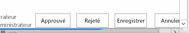
  

  

  
Évidemment, les types de contenu font partie des tâches de flux de travail. Les types de contenu dictent simplement la structure des éléments de liste de tâches. Tout aussi important, le modèle de liste de tâches a également été modifié dans SharePoint 2013.
  
    
    
Avant SharePoint 2013, la liste des tâches de flux de travail utilisait le même modèle de liste que la liste de tâches standard (ID = 107). Il s'agissait d'une liste de tâches SharePoint standard qui pouvait également contenir des tâches non associées à un flux de travail. Mais dans SharePoint 2013, l'approche est différente dans la mesure où est introduit un nouveau type de liste. Cette liste, appelée liste de tâches hiérarchique, présente un affichage chronologique en haut de la page pour afficher la planification des tâches, comme illustré dans la figure 2. Notez qu'elle permet également aux utilisateurs d'afficher les dépendances de tâche.
  
    
    

**Figure 2. Liste de tâches hiérarchique**

  
    
    

  
    
    
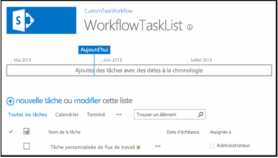
  
    
    

  
    
    

  
    
    

## Création des options de tâche de flux de travail dans SharePoint 2013

SharePoint Designer 2013 et Visual Studio 2012 offrent aux auteurs de flux de travail deux façons de créer des tâches de flux de travail. La première consiste à créer une tâche unique qui est affectée à une personne ou à un groupe. La deuxième consiste à créer une tâche et à l'attribuer à plusieurs personnes. Lorsque vous créez une tâche unique dans un flux de travail personnalisé à l'aide de Visual Studio 2012, utilisez l'activité **SingleTask**. À l'aide de cette activité, vous pouvez modifier les propriétés dans la fenêtre d'outils **Propriétés** ou avec l'assistant, comme indiqué dans la figure 3.
  
    
    

**Figure 3. Assistant de tâche unique**

  
    
    

  
    
    
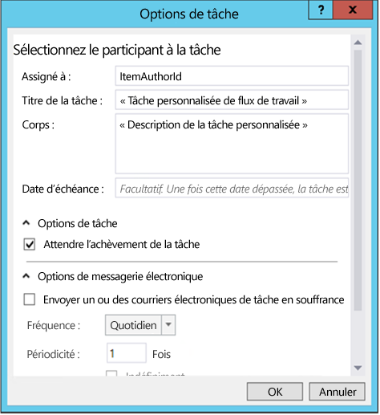
  
    
    
SharePointpermet de spécifier si plusieurs tâches doivent être exécutées en série ou en parallèle et d'indiquer les critères pour l'exécution de la tâche. SharePoint doit-il attendre que toutes les tâches soient terminées, ou qu'un certain pourcentage de ces tâches soit terminé avec un résultat spécifique ? Pour créer plusieurs tâches dans Visual Studio 2012, utilisez l'activité **CompositeTask**, dont l'assistant et les propriétés ressemblent à l'activité **SingleTask**, comme illustré dans la figure 4.
  
    
    

**Figure 4. Assistant de tâche composite**

  
    
    

  
    
    
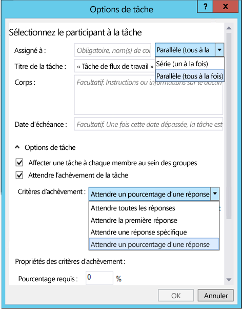
  
    
    

  
    
    

  
    
    

## Procédure : Créer et attribuer des tâches dans des flux de travail personnalisés

Voici une procédure pas à pas qui explique comment créer et attribuer des tâches dans un flux de travail personnalisé. Avant de commencer, assurez-vous d'avoir accès à un site de développeur SharePoint 2013.
  
    
    

### 1. Créer un projet d'application SharePoint 2013


1. Créez un projet d'application SharePoint 2013 et configurez-le projet comme une Application hébergée par SharePoint.
    
  
2. Ajoutez une nouvelle instance de liste **Announcement** au projet. Elle sera utilisée comme conteneur pour les éléments utilisés pour tester le flux de travail.
    
  
3. Ajoutez un élément de flux de travail au projet en cliquant avec le bouton droit sur l'icône du projet dans l' **Explorateur de solutions** et en sélectionnant **Ajouter**, puis **Nouvel élément**.
    
  
4. Dans la boîte de dialogue **Ajouter un nouvel élément**, sélectionnez l'élément de projet **Flux de travail** dans la catégorie **Office/SharePoint** et nommez-le « CustomTaskWorkflow »», puis cliquez sur **Suivant**.
    
  

### 2. Recueillir des informations sur l'élément Nouvelle annonce

Nous allons créer une tâche dans notre workflow et l'affecter à la personne qui a créé l'élément de liste d'annonces qui lance le flux de travail. L'élément de la liste fournira lui-même les informations aux flux de travail. Nous utiliserons une activité **LookupSPListItemProperties**, qui renvoie une valeur dynamique à partir du service web REST qu'il appelle dans SharePoint. Nous stockerons ensuite cette valeur dans une nouvelle variable nommée **AnnouncementItemProperties**, dont nous modifierons le type de données en **DynamicValue**.
  
    
    

1. Créez une variable **AnnouncementItemAuthorId** pour stocker l'ID de la personne qui a créé l'élément de liste, comme indiqué dans la figure 5.
    
   **Figure 5. Activité LookupSPListItemProperties**

  

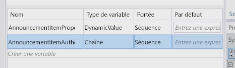
  

  

  
2. Déplacez l'activité **LookupSPListItem** sur l'aire de conception de flux de travail et définissez la propriété **ListID** sur _(current list)_.
    
  
3. Définissez **ItemId** sur _(current item)_.
    
  
4. Définissez la sortie **Result** de la variable **AnnouncementItemProperties** que nous avons créée précédemment.
    
  
5. Pour obtenir l'auteur de l'élément à partir de la variable, cliquez sur le lien **Obtenir les propriétés** dans l'activité **LookupSPListItem** et ajoutez une activité **GetDynamicValueProperties** à l'aire de conception. Définissez sa propriété **Source** sur la sortie de l'activité **LookupSPListItem**.
    
  
6. Cliquez sur le bouton **[...]** sur la propriété **Properties** pour faire apparaître la boîte de dialogue **Propriétés**.
    
  
7. Dans la boîte de dialogue **Propriétés**, définissez le **type d'entité** sur **Élément de liste d'annonces**, comme illustré dans la figure 6.
    
  
8. Attribuez le chemin d'accès **Créé par** à la variable **AnnouncementItemAuthorId**, comme illustré dans la figure 6.
    
   **Figure 6. Boîte de dialogue Propriétés**

  

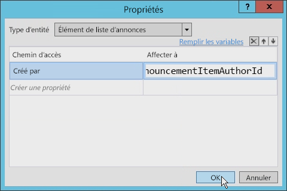
  

  

  

### 3. Créer et affecter la tâche

À ce stade, nous pouvons créer et affecter la tâche à l'auteur de l'élément d'annonce.
  
    
    

1. À partir de la boîte à outils, ajoutez une activité **SingleTask** à l'aire de conception de flux de travail.
    
  
2. Cliquez sur le lien **Configurer** dans l'activité pour ouvrir la boîte de dialogue **Options des tâches**.
    
  
3. Définissez la propriété **Affecté à** sur la variable utilisée pour stocker l'identificateur de l'auteur.
    
  
4. Modifiez le titre et le corps de la tâche, comme indiqué dans la figure 7.
    
   **Figure 7. Boîte de dialogue Options des tâches**

  

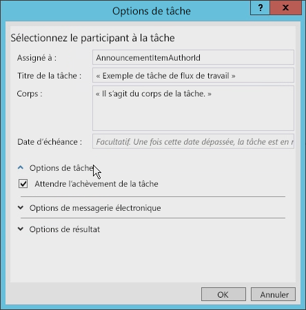
  

  

  
Il existe plusieurs autres options pouvant être définies dans la boîte de dialogue **Options des tâches**. Par exemple, vous pouvez définir le flux de travail pour qu'il patiente jusqu'à ce que la tâche se termine, simplement en cochant la case (voir la figure 7). Pour parvenir au même résultat, les versions précédentes des flux de travail SharePoint nécessitaient une solution de contournement complexe.
  
    
    
La figure 8 illustre les options de messagerie que vous pouvez définir. Entre autres, vous pouvez vous assurer que des messages électroniques sont envoyés chaque fois que la tâche est en retard. Vous pouvez également spécifier la fréquence à laquelle les rappels sont envoyés. 
  
    
    

**Figure 8. Paramètres d'options de messagerie électronique**

  
    
    

  
    
    
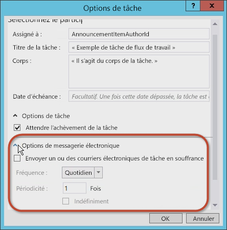
  
    
    
Vous pouvez également définir les options de résultat des tâches. Vous pouvez sélectionner le type de contenu de tâche de flux de travail, le **champ de résultat** et le **résultat par défaut**, comme illustré dans la figure 9.
  
    
    

**Figure 9. Paramètres des options de résultat**

  
    
    

  
    
    
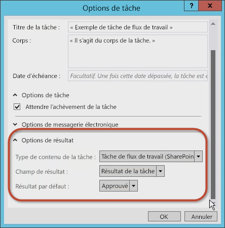
  
    
    

  
    
    

  
    
    

### 4. Examiner et modifier les propriétés de la tâche

Une fois que vous avez accepté les valeurs dans la boîte de dialogue **Options des tâches**, sélectionnez l'activité **SingleTask**, puis examinez la grille **Propriétés** (voir la figure 10).
  
    
    

**Figure 10. Fenêtre de l'outil Propriétés**

  
    
    

  
    
    
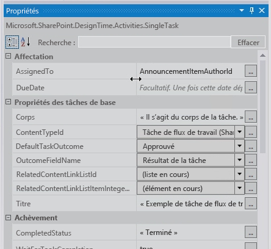
  
    
    
À l'aide de la grille **Propriétés**, vous pouvez spécifier si vous souhaitez attendre que la tâche soit terminée avant de poursuivre, et vous pouvez configurer les messages électroniques générés par la tâche, notamment le message électronique d'affectation initiale, le message électronique indiquant un retard et le message d'annulation d'une tâche.
  
    
    
Notez que la propriété **Outcome** crée automatiquement une variable nommée **outcome_0** pour la tâche. Pour voir ce qui est inclus dans cette variable, ajoutez une activité **WriteToHistory** à l'aire de conception et mettez à jour le message afin d'écrire le résultat, comme illustré dans la figure 11.
  
    
    

**Figure 11. Valeur de propriété de résultat**

  
    
    

  
    
    
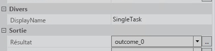
  
    
    

  
    
    

  
    
    

### 5. Tester le flux de travail

Pour tester le flux de travail, procédez comme suit :
  
    
    

1. Pour générer et exécuter le test, appuyez sur la touche **F5** ou cliquez sur le bouton **Démarrer** dans Visual Studio 2012. Si vous effectuez le test dans une installation locale de SharePoint 2013, Visual Studio 2012 démarre l'utilitaire hôte de service de test Workflow Manager et déploie le flux de travail sur le site du développeur. Après quelques instants, le site du développeur s'ouvre.
    
  
2. Accédez à la liste **Annonces** et créez un élément de liste, puis démarrez le flux de travail personnalisé manuellement.
    
  
3. Revenez à la page d'état de l'instance de flux de travail pour rechercher la tâche qui a été créée par le flux de travail. Cliquez sur la tâche pour afficher le formulaire. Notez les champs **Nom de la tâche** et **Affecté à** qui ont été définis dans le flux de travail, comme le montre la figure 12.
    
   **Figure 12. Formulaire de tâche**

  

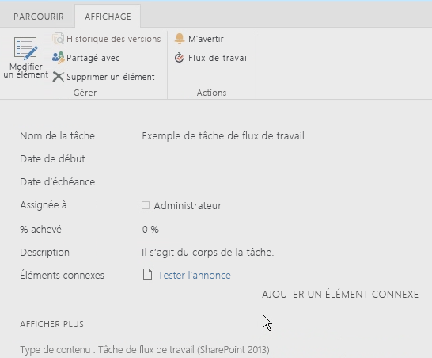
  

  

  
4. Enfin, revenez à la tâche, modifiez le formulaire, puis cliquez sur **Approuver** ou **Rejeter** pour terminer la tâche. Notez que le résultat de la tâche apparaît dans la liste **Historique des flux de travail** pour l'instance de flux de travail, comme le montre la figure 13.
    
   **Figure 13. Liste Historique des flux de travail**

  

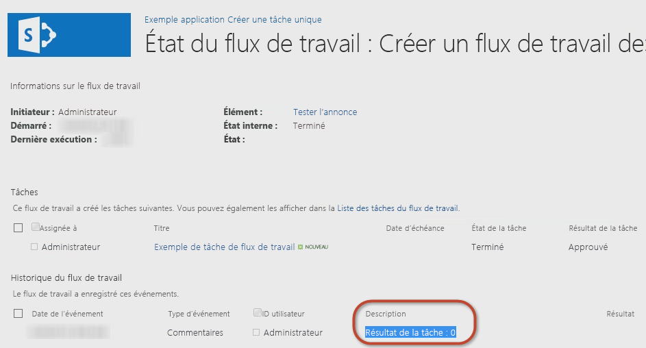
  

  

  

## Procédure : Créer un type de tâche personnalisé avec un résultat personnalisé

La procédure précédente vous a expliqué comment créer une tâche simple et configurer ses propriétés. Toutefois, il peut arriver que les options par défaut ne puissent pas répondre à vos besoins. Par exemple, considérez une tâche qui demande à quelqu'un de réviser un document. Lors de la révision du document brouillon, le réviseur doit choisir entre les deux options suivantes : renvoyer le document brouillon à l'auteur pour révision ou transférer le document à l'éditeur. Malheureusement, aucune des options par défaut ( **Approuvé** et **Rejeté**) ne répond aux besoins du réviseur. Les options plus appropriées seraient « Renvoyer à l'auteur » et « Transférer à l'éditeur ».
  
    
    
Lors de la création de flux de travail à l'aide de SharePoint Designer 2013 ou de Visual Studio 2012, vous pouvez créer des tâches de flux de travail personnalisé qui incluent des résultats de tâche personnalisés. Pour ce faire, vous créez une tâche personnalisée comme un type de contenu spécial, puis ajoutez une colonne de site personnalisée qui définit les résultats souhaités. Vous pouvez dériver la colonne personnalisée du type de champ appelé **OutcomeChoice**, qui est un champ de choix.
  
    
    
Cette approche peut poser un problème, toutefois, dans la mesure où le type de contenu dérivé de la tâche personnalisée est le type de contenu **Workflow Task (SharePoint 2013)**, qui inclut la colonne de site par défaut **TaskOutcome** qui contient les options **Approuvé** et **Rejeté**. Cependant, vous pouvez contourner le paramètre par défaut en supprimant la colonne **TaskOutcome** du type de contenu de la tâche personnalisée, puis vérifier qu'il n'est pas présent dans la liste des tâches de flux de travail. Sinon, plusieurs options seraient affichées. Par exemple, imaginez un résultat personnalisé avec deux options, « Pilule rouge » et « Pilule bleue ». Si le résultat par défaut n'est pas supprimé, toutes les options de sortie disponibles seraient proposées aux utilisateurs exécutant la tâche, comme indiqué dans la figure 14, même si ces options de résultat ne s'appliquent pas à la situation.
  
    
    

**Figure 14. Options de résultat**

  
    
    

  
    
    
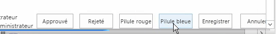
  
    
    
Il est recommandé de créer une liste de tâches de flux de travail différente pour chaque type de tâche que vous créez. 
  
    
    

### Créer un projet d'application SharePoint 2013

Pour commencer la procédure de création d'une tâche de flux de travail personnalisé à l'aide de Visual Studio 2012, assurez-vous tout d'abord que vous avez accès à un site de développeur SharePoint 2013. 
  
    
    

1. Dans Visual Studio 2012, créez un projet d'application SharePoint 2013 qui est configuré comme une Application hébergée par SharePoint.
    
  
2. Ajoutez une nouvelle instance de liste **Announcement** au projet. Vous l'utiliserez comme conteneur pour les éléments utilisés pour tester le flux de travail.
    
  
3. Ensuite, ajoutez un élément de flux de travail au projet en cliquant avec le bouton droit sur l'icône projet dans l' **Explorateur de solutions** et en sélectionnant **Ajouter**, puis **Nouvel élément**.
    
  
4. Dans la boîte de dialogue **Ajouter un nouvel élément**, sélectionnez l'élément de projet **Flux de travail** dans la catégorie **Office/SharePoint** et nommez-le « CustomTaskWorkflow »», puis cliquez sur **Suivant**.
    
  

### Créer la colonne de résultat personnalisée

Une fois la liste **Announcements** créée, nous voulons ensuite créer le type de contenu personnalisé qui contiendra la tâche personnalisée et la colonne de site pour le champ de résultat personnalisé.
  
    
    

1. Cliquez avec le bouton droit et sélectionnez **Ajouter**, puis **Nouvel élément**.
    
  
2. Choisissez maintenant le modèle d'élément de projet **Colonne de site** et définissez le nom de ce champ sur « CustomOutcomeColumn ». Dans le modèle pour la colonne de site, il existe quelques modifications qui doivent être effectuées.
    
  
3. Définissez le type de champ de la colonne sur **OutcomeChoice**, qui est le type de champ obligatoire pour une colonne de résultat.
    
  
4. Supprimez la colonne **Obligatoire**.
    
  
5. Ensuite, étant donné que le type de champ **OutcomeChoice** est basé sur le type de champ de choix, ajoutez quelques options de votre choix.
    
  
Le nouveau balisage de colonne de site personnalisée doit maintenant ressembler à cela :
  
    
    


```XML

<?xml version="1.0" encoding="utf-8"?>
<Elements xmlns="http://schemas.microsoft.com/sharepoint/">  
  <Field
       ID="{7b7edd9e-f5d1-4558-a2c8-e733dcfb0a5e}"
       Name="CustomSiteColumn"
       DisplayName="Better State"
       Type="Choice"
       Required="FALSE"
       Group="Custom Site Columns">
       <CHOICES>
         <CHOICE>Florida</CHOICE>
         <CHOICE>Georgia</CHOICE>
       </CHOICES>
       <Default>Florida</Default>
  </Field>
</Elements>
```


### Créer un type de contenu de tâche personnalisée

Après la création de la colonne de site, l'étape suivante consiste à créer un type de contenu spécialisé pour la tâche personnalisée.
  
    
    

1. Ajoutez un nouvel élément de projet de type de contenu pour le projet avec le nom **CustomTaskContentType**.
    
  
2. Lorsque vous êtes y invité, sélectionnez le type de contenu **Workflow Task (SharePoint 2013)** de base.
    
  
3. Ensuite, ajoutez la colonne de résultat personnalisé à la liste des colonnes disponibles et supprimez la colonne de résultat par défaut afin que le balisage du type de contenu ressemble à l'exemple suivant.
    
  ```XML
  
<?xml version="1.0" encoding="utf-8"?>
<Elements xmlns="http://schemas.microsoft.com/sharepoint/">
  <!-- Parent ContentType: Workflow Task (SharePoint 2013) (0x0108003365C4474CAE8C42BCE396314E88E51F) -->
  <ContentType 
      ID="0x0108003365C4474CAE8C42BCE396314E88E51F00D368DFB2B31A447BB184BA1334E5119E" 
      Name="CustomContentType" 
      Group="Custom Content Types" 
      Description="My Content Type" 
      Inherits="TRUE" Version="0">
      <FieldRefs>
         <FieldRef 
            ID="{7b7edd9e-f5d1-4558-a2c8-e733dcfb0a5e}" 
            DisplayName="Better State" 
            Required="FALSE" 
            Name="CustomSiteColumn" />
            <RemoveFieldRef 
               ID="{55B29417-1042-47F0-9DFF-CE8156667F96}" 
               Name="TaskOutcome" />
      </FieldRefs>
  </ContentType>
</Elements>
  ```


### Créer un flux de travail

Nous allons maintenant créer un flux de travail afin de pouvoir tester la colonne de site personnalisée et le type de contenu. 
  
    
    

1. L'ajout d'un flux de travail au projet le configure comme un flux de travail de liste.
    
  
2. Créez une association avec ce flux de travail à l'aide de la liste **Annonces** que nous avons créée précédemment.
    
  
3. Créez une variable de type **DynamicValue** et nommez-la « ItemProperties ». Nous utiliserons cette variable pour stocker l'élément qui lance les propriétés du flux de travail.
    
  
4. Créez une variable **Int32** et nommez-la « ItemAuthorId », comme illustré dans la figure 15.
    
   **Figure 15. Création d'une variable de flux de travail**

  

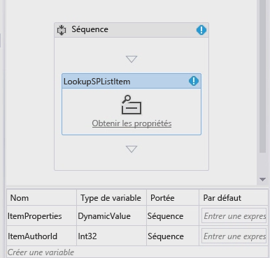
  

  

  

### Collecter les propriétés d'élément de liste

Maintenant, nous collectons les propriétés d'élément de liste.
  
    
    

1. Déplacez l'activité **LookupSPListItem** sur l'aire de conception et définissez la propriété **ListID** sur _(current list)_ et la propriété **ItemId** sur _(current item)_. 
    
  
2. Définissez maintenant la sortie **Result** sur la variable **ItemProperties** **DynamicValue** que nous avons créée auparavant.
    
  
3. Pour obtenir l'auteur de l'élément de la variable, cliquez sur le lien **Obtenir les propriétés** dans l'activité **LookupSPListItem** et ajoutez une activité **GetDynamicValueProperties** sur l'aire de conception.
    
  
4. Définissez automatiquement la propriété **Source** de l'élément à la sortie de l'activité **LookupSPListItem**.
    
  
5. Cliquez sur le bouton **[...]** sur la propriété **Properties** pour faire apparaître la boîte de dialogue **Propriétés**.
    
  
6. Définissez **Entity Type** sur **List Item of Announcements** pour donner à la boîte de dialogue un contexte et pour affecter le chemin d'accès **Created By** à la variable **ItemAuthorId**, comme illustré dans la figure 16.
    
   **Figure 16. Boîte de dialogue Propriétés**

  

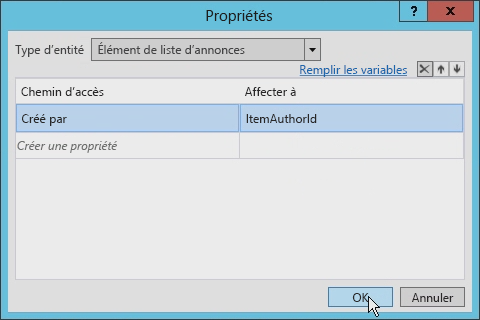
  

  

  

### Créer une tâche unique

Nous pouvons maintenant créer la tâche unique. 
  
    
    

1. Ajoutez une activité **SingleTask** à l'aire de conception.
    
  
2. Cliquez sur le lien **Configurer** dans l'activité pour ouvrir la boîte de dialogue **Options des tâches**.
    
  
3. Définissez le champ **Corps** sur une chaîne (peu importe laquelle), puis définissez la propriété **Affecté à** sur la variable que vous utilisez pour stocker l'identificateur de l'auteur (dans notre cas, **ItemAuthorId**).
    
  
4. Modifiez le titre de la tâche, comme le montre la figure 17.
    
   **Figure 17. Définition du titre de la tâche**

  

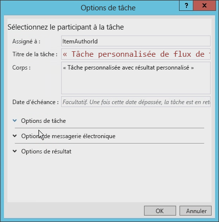
  

  

  
5. Enfin, définissez les **Options d'affichage** pour le nouveau type de contenu personnalisé et la colonne de résultat personnalisé.
    
    La boîte de dialogue détermine les éléments disponibles en indiquant tous les types de contenu dérivés du type de contenu **Workflow Task (SharePoint 2013)**, comme le montre la figure 18.
    

   **Figure 18. Paramètres des options de résultat**

  

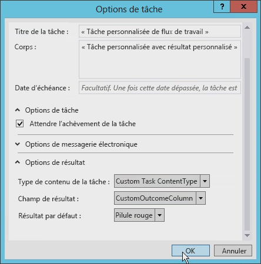
  

  

  

### Mettre à jour le champ Affecté à

Avant de poursuivre, nous devons mettre à jour le champ **Affecté à** sur l'activité **SingleTask** car il attend une chaîne, et non un nombre entier. Pour résoudre ce problème, ajoutez **ToString()** à la fin de l'expression.
  
    
    
En outre, notez que la propriété **Outcome** crée automatiquement une variable nommée **outcome_0**. Pour voir ce que contient cette variable, ajoutez une activité **WriteToHistory** à l'aire de conception et mettez à jour le message pour écrire le résultat.
  
    
    

### Mettre à jour la liste des tâches de flux de travail

L'étape finale consiste à configurer la liste des tâches de flux de travail. Par défaut, la liste des tâches que l'application crée accepte uniquement le type de contenu **Workflow Task (SharePoint 2013)**. Ce flux de travail utilise un type de contenu personnalisé pour le résultat personnalisé. Ouvrez le fichier  `Elements.xml` pour la liste des tâches de flux de travail et modifiez l'attribut **<ContentTypeBinding>** de l'élément **ContentTypeId** à faire correspondre au type de contenu dans le projet, comme indiqué dans l'exemple de code suivant.
  
    
    

```XML

<?xml version="1.0" encoding="utf-8" ?>
<Elements xmlns="http://schemas.microsoft.com/sharepoint/">
  <ListInstance 
      FeatureId="{f9ce21f8-f437-4f7e-8bc6-946378c850f0}"
      TemplateType="171"
      Title="WorkflowTaskList"
      Description="This list instance is used for workflow Task items."
      Url="Lists/WorkflowTaskList"
      RootWebOnly="FALSE" />
  <!-- CustomContentType -->
  <ContentTypeBinding 
      ListUrl="Lists/WorkflowTaskList"
      RootWebOnly="FALSE"
      ContentTypeId="0x0108003365C4474CAE8C42BCE396314E88E51F00D368DFB2B31A447BB184BA1334E5119E"/>
</Elements>
```


### Tester la tâche de contenu personnalisé avec un résultat de tâche personnalisé

Nous allons maintenant tester le flux de travail. 
  
    
    

1. Dans Visual Studio 2012, appuyez sur **F5** ou cliquez sur le bouton **Démarrer**. Si le test est effectué sur une installation locale de SharePoint 2013, Visual Studio 2012 démarre l'utilitaire hôte de service de test Workflow Manager et déploie le flux de travail sur le site du développeur. Après quelques instants, le site du développeur s'ouvre.
    
  
2. Accédez à la liste **Annonces** et créez un élément. Une fois que vous l'avez créé, démarrez manuellement le flux de travail personnalisé.
    
  
3. Revenez ensuite à la page d'état de l'instance de flux de travail pour rechercher la tâche qui a été créée par le flux de travail.
    
  
4. Cliquez sur la tâche et, à l'aide du bouton **Modifier** dans le ruban, basculez en mode d'édition. En bas du formulaire se trouvent quatre boutons. Les deux premiers boutons sont les boutons du résultat personnalisé qui, lorsque vous appuyez dessus, marquent la tâche comme terminée. Les deux autres boutons sont les boutons **Enregistrer** et **Annuler** par défaut qui mettent simplement à jour l'élément de liste sans effectuer la tâche, comme illustré dans la figure 19.
    
   **Figure 19. Boutons de résultat personnalisés**

  

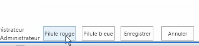
  

  

  

## Conclusion

Microsoft a introduit des flux de travail dans la plateforme SharePoint 2007 et ceux-ci restent quasiment inchangés dans l'architecture, l'implémentation ou le processus SharePoint 2010. Ceci était également vrai pour les tâches de flux de travail SharePoint. Toutefois, SharePoint 2013 a introduit plusieurs modifications au niveau des flux de travail dans l'architecture et l'implémentation.
  
    
    
Cet article décrit les modifications liées aux tâches de flux de travail qui sont dues à des changements apportés au niveau des flux de travail dans SharePoint 2013. Il présente comment créer un flux de travail simple qui influence les tâches dans SharePoint 2013 à l'aide de Visual Studio 2012. Ces types de tâches conviennent à de nombreux développeurs, qui ont parfois besoin de tâches personnalisées et de résultats personnalisés, pouvant être accomplis à l'aide de Visual Studio 2012, comme indiqué.
  
    
    

## Ressources supplémentaires
<a name="bk_addresources"> </a>


-  [Flux de travail dans SharePoint 2013](http://msdn.microsoft.com/fr-fr/library/jj163986.aspx)
    
  
-  [Autorisation et authentification des applications pour SharePoint 2013](http://msdn.microsoft.com/fr-fr/library/office/fp142384.aspx)
    
  
-  [Procédure : Personnaliser le mode Liste dans les apps pour SharePoint à l'aide du rendu côté client](http://msdn.microsoft.com/fr-fr/library/jj220045.aspx)
    
  

