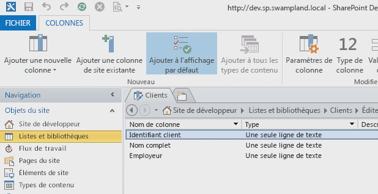
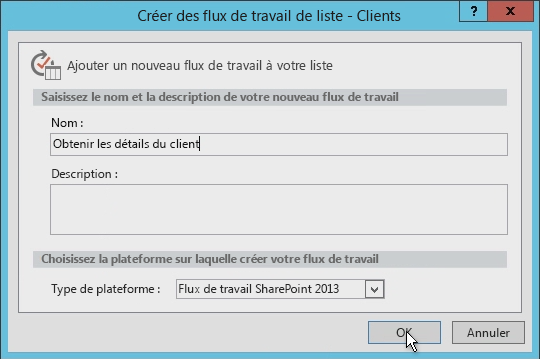
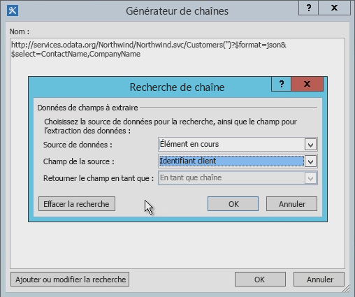
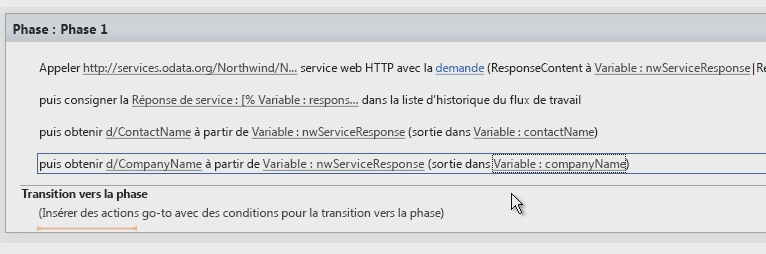
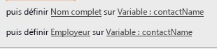
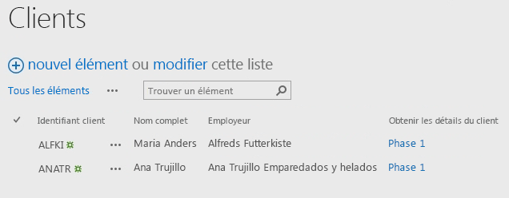

# Utilisation des services web dans les flux de travail SharePoint 2013 à l'aide de SharePoint Designer 2013
Présente l'utilisation des services web dans les flux de travail SharePoint Designer 2013. 
 **Fourni par :** [Andrew Connell](http://social.msdn.microsoft.com/profile/andrew%20connell%20%5bmvp%5d/),  [www.AndrewConnell.com](http://www.andrewconnell.com)
  
    
    

Microsoft a adopté une nouvelle approche des flux de travail dans SharePoint Server 2013. L'équipe chargée des flux de travail a travaillé avec l'équipe de Microsoft Azure afin de créer un produit nommé Workflow Manager. Workflow Manager sert d'hôte pour la dernière version du runtime Windows Workflow Foundation. De plus, il fournit tous les services nécessaires et exploite Microsoft Azure Service Bus afin d'améliorer les performances et l'évolutivité. Une fois déployé, il est exécuté de la même manière dans un déploiement local ou dans le cloud. Notez que SharePoint 2013 transfère toute exécution de flux de travail et toute tâche associée à la batterie de serveurs Workflow Manager, qui est externe à SharePoint 2013.
L'une des modifications les plus importantes de l'architecture de flux de travail est que désormais tous les flux de travail sont créés de façon déclarative dans l'aire du concepteur, y compris ceux créés avec Visual Studio 2012. Dans les versions précédentes de SharePoint, les flux de travail développés avec Visual Studio 2012 n'étaient pas exclusivement déclaratifs. Ils constituaient plutôt un mélange entre XAML déclaratif et assembly compilé, contenant la logique métier de flux de travail.
  
    
    

Pour les clients ayant créé des flux de travail avec SharePoint Designer par le passé, cela n'est pas nouveau. Les flux de travail créés avec SharePoint Designer ont toujours été entièrement déclaratifs. En revanche, cette modification représente un avantage pour les utilisateurs qui créent des flux de travail avec SharePoint Designer 2013, étant donné que les flux de travail SharePoint Designer 2013 prennent désormais en charge l'appel et la consommation de services web.
## Importance des services web pour les flux de travail SharePoint 2013

Commençons par la présentation des scénarios pour lesquels l'utilisation des services web est utile. À l'époque de SharePoint 2007 ou de SharePoint 2010, l'écriture de code personnalisé était courante lors de l'utilisation de Visual Studio pour créer des flux de travail, car c'était la meilleure façon d'effectuer des calculs ou d'implémenter une logique métier personnalisée. Dès que vous rencontriez une situation dans laquelle les activités et les actions prédéfinies ne répondaient pas à vos besoins, vous pouviez revenir au code personnalisé dans un assembly managé.
  
    
    
Par contre, pour les utilisateurs de SharePoint Designer 2013 autres que les développeurs, ce n'était pas si évident. Lorsque vous rencontriez des cas impossibles à gérer avec les actions de flux de travail existantes, vous deviez faire appel à un développeur pour écrire une action personnalisée. Cela s'avérait souvent difficile car les développeurs ne pouvaient créer du code que pour le bac à sable (sandbox) s'il s'agissait d'un environnement hébergé, ou ne pouvaient utiliser que des solutions entièrement fiables s'il s'agissait d'un déploiement local. Dans d'autres cas, le flux de travail devait être confié dans sa totalité à un développeur pour créer le flux en tant que solution entièrement fiable, car vous ne pouviez pas le faire avec SharePoint Designer.
  
    
    
Voici la bonne nouvelle : à l'époque de SharePoint 2013, lorsque SharePoint Designer 2013 ne contient pas l'action dont vous avez besoin, il suffit de créer un service web personnalisé. La création d'un service web personnalisé est bien plus facile que la création d'une action personnalisée. De plus, alors qu'une action personnalisée peut être utilisée uniquement par le flux de travail dans lequel elle est installée (ou, au mieux, uniquement par un flux de travail SharePoint), un service web personnalisé est portable et peut être utilisé par un nombre illimité de clients.
  
    
    
Et voici le meilleur : lorsque vous avez besoin d'accéder à un service web existant, qu'il soit public ou privé, hébergé par votre entreprise, SharePoint Designer 2013 propose désormais une action vous permettant d'appeler le service web. Vous n'avez plus besoin de demander de l'aide à un développeur pour appeler un service web existant.
  
    
    
Bien que SharePoint 2013 puisse consommer tout type de service web, il est plus facile (et recommandé) d'utiliser des services web qui acceptent et renvoient des données dans des formats  [OData](http://www.odata.org/) standard comme [Atom](http://msdn.microsoft.com/fr-fr/library/ff478141.aspx) ou [JSON](http://json.org/) (JavaScript Object Notation).
  
    
    
Nous recommandons l'utilisation de ces services en raison de leur prise en charge de ces formats OData dans les outils de création de flux de travail SharePoint 2013 (SharePoint Designer 2013 et Visual Studio 2012). Les deux outils prennent en charge la création de charges utiles à envoyer au service et la gestion des réponses renvoyées par les services web. En outre, les formats OData prennent en charge la communication avec les services web anonymes et avec ceux protégés par différents types d'authentification. En résumé, vous disposez d'un contrôle total sur la demande et la réponse pour chaque appel de service. Vous pouvez ainsi utiliser une série d'activités dans un flux de travail, d'abord pour vous authentifier en utilisant un service et pour obtenir un jeton OAuth, puis pour inclure ce jeton dans les futures demandes de services sécurisés à l'aide du protocole  [OAuth 2.0](http://oauth.net/2/).
  
    
    

## Exploitation des services web dans les flux de travail SharePoint

L'appel de services web à partir de flux de travail avec SharePoint 2013 s'effectue en deux étapes : d'abord l'appel au service web, puis l'échange de données avec ce dernier.
  
    
    
 Avec les flux de travail SharePoint 2013, vous pouvez appeler un service web à l'aide d'une nouvelle action introduite dans SharePoint 2013 nommée **Call HTTP Web Service**. Grâce à cette action flexible, vous pouvez facilement effectuer des appels simples vers un service web ou, si nécessaire, vous pouvez créer des appels plus complexes à l'aide de verbes HTTP, ainsi qu'ajouter des en-têtes HTTP. La figure 1 présente l'action **Call HTTP Web Service** sur la surface SharePoint Designer 2013.
  
    
    

**Figure 1. Étape représentant l'action Appeler le service web HTTP dans SharePoint Designer 2013**

  
    
    

  
    
    

  
    
    
L'action **Call HTTP Web Service** permet de spécifier une méthode de demande parmi plusieurs existantes, y compris **GET**, **PUT**, **POST** et **DELETE**. Cela permet d'indiquer aux services web, en particulier aux services  [RESTful ](http://msdn.microsoft.com/fr-fr/library/office/jj164022.aspx), quelle opération effectuer sur le service que vous avez spécifié avec la propriété URI sur l'activité.
  
    
    
Par exemple, pour obtenir toutes les propriétés d'un élément spécifique, l'URL du service doit contenir l'adresse unique de l'élément et vous devez définir la méthode sur **GET**. Pour supprimer l'élément, le processus est identique, mais vous devez définir la méthode sur **DELETE**. Il en va de même pour la mise à jour d'un élément, sauf que vous devez définir la méthode sur **POST**. Lorsque vous créez un élément, définissez l'URL sur l'adresse unique de la collection où l'élément doit être créé et définissez la méthode sur **POST**. Lors de la création ou de la mise à jour d'éléments, les services ont généralement besoin des données à utiliser, que vous transmettez en tant que contenu dans la demande, puis indiquez à l'aide de la propriété **request** de l'action **Call HTTP Web Service**.
  
    
    
La deuxième étape de l'utilisation des services web implique l'envoi et la réception de données vers et à partir d'un service web, en utilisant les propriétés **request** ou **response** sur l'action **Call HTTP Web Service**. Toutefois, les données sont transmises en tant que structure complexe et non comme un flux, en utilisant l'objet de  [valeur dynamique](http://msdn.microsoft.com/fr-fr/library/windowsazure/microsoft.activities.dynamicvalue%28v=azure.10%29.aspx). (Pour plus d'informations sur les valeurs dynamiques, consultez la rubrique  [Présentation des valeurs dynamiques](http://msdn.microsoft.com/fr-fr/library/windowsazure/jj193505%28v=azure.10%29.aspx).)
  
    
    
Les structures de données de valeur dynamique sont mises en forme en tant que chaînes JavaScript Object Notation (JSON). Toutefois, au lieu de confier à un développeur la création et la manipulation des chaînes manuellement dans le flux de travail, Microsoft fournit le type d'objet **DynamicValue** à utiliser pour stocker les données hiérarchiques, ainsi que la réponse à un appel de service web.
  
    
    
Une série d'activités est associée au type **DynamicValue** pouvant être utilisé pour compter le nombre d'éléments contenus dans la réponse, extraire les valeurs de la réponse, ou construire une structure pour la mise à jour ou la création d'éléments. SharePoint Designer 2013 ne prend pas en charge l'utilisation directe du type **DynamicValue**; les créateurs de flux de travail utilisent le type **Dictionary**.
  
    
    

## Création de services web pour les flux de travail SharePoint 2013

Nous savons maintenant que SharePoint Designer 2013 prend en charge l'appel de services web, mais ne prend  *pas*  en charge l'appel de code personnalisé à partir de flux de travail. Par conséquent, vous devez savoir comment créer un service web si vous souhaitez développer les fonctionnalités de vos flux de travail au-delà des actions par défaut.
  
    
    
Heureusement, il existe de nombreuses options de création de services web personnalisés à utiliser dans des flux de travail SharePoint 2013. Plus précisément, l'activité **HttpSend**, ainsi que le type de données **DynamicValue**, conviennent parfaitement à la création de services web RESTful conformément au protocole OData.
  
    
    
 OData est un protocole de création et d'utilisation des données suivant les principes des services REST. Il a été développé dans le but de normaliser l'échange de données à l'aide de protocoles HTTP fiables, robustes et aboutis. Une fois terminée la spécification OData, différentes organisations ont implémenté le protocole dans leurs propres piles de technologies. Microsoft a implémenté sa propre version d'OData sous le nom de [services de données WCF](http://msdn.microsoft.com/fr-fr/library/hh487257%28v=vs.103%29.aspx).
  
    
    
Voici deux scénarios courants pour lesquels les services web RESTful sont utiles aux développeurs de flux de travail :
  
    
    

- Implémentation d'opérations CRUD-Q de service OData
    
  
- Implémentation d'opérations de service OData
    
  

### Implémentation d'opérations CRUD-Q de service OData

Les services web sont couramment utilisés afin d'exécuter des opérations simples de création, de lecture, de mise à jour, de suppression et d'interrogation (CRUD-Q) sur des données dans une base de données. Il est relativement facile de créer un service web OData pour un service de données WCF de flux de travail SharePoint 2013 destiné à être utilisé par un flux de travail en utilisant les services de données WCF. Vous pouvez consulter des procédures pas à pas et des exemples de création de services web sur des sites comme  [Services de données WCF](http://msdn.microsoft.com/fr-fr/library/cc668792.aspx),  [www.OData.org](http://www.odata.org), entre autres. 
  
    
    
 Supposons que vous disposiez déjà d'une base de données sur laquelle travailler, vous pouvez suivre ces quatre courtes étapes :
  
    
    

1. Créez un modèle de la base de données à l'aide de Microsoft  [Entity Framework](http://msdn.microsoft.com/fr-fr/data/aa937723). Aucun code n'est nécessaire car la création se fait à l'aide d'un Assistant dans Visual Studio. Pour plus d'informations, consultez les rubriques  [Entity Framework 4.0 et WCF Data Services 4.0 dans Visual Studio 2010](http://msdn.microsoft.com/fr-fr/magazine/ee336128.aspx) et [Entity Framework Designer reçoit de l'attention dans Visual Studio 2012](http://msdn.microsoft.com/fr-fr/magazine/jj721589.aspx).
    
  
2. Créez un service de données WCF. Encore une fois, aucun code n'est nécessaire dans cet Assistant Visual Studio. Pour plus d'informations, consultez la procédure pas à pas :  [Création et utilisation d'un service de données WCF dans Visual Studio](http://msdn.microsoft.com/fr-fr/library/vstudio/cc668184.aspx).
    
  
3. Dans le fichier de code de service, choisissez la source du service comme nom du modèle d'entité créé à l'étape 1. Ensuite, définissez l'accessibilité et l'autorisation pour les entités dans le modèle (ces deux étapes sont implémentées en seulement deux lignes de code).
    
  
4. Publiez le service à un emplacement accessible par Workflow Manager.
    
  

### Implémentation d'opérations de service OData

 Il est fort probable que votre flux de travail nécessite d'exécuter une logique métier qui n'entre pas dans les fonctionnalités limitées du modèle CRUD-Q. Par exemple, il peut y avoir un service OData qui prend en charge les opérations CRUD-Q lors de la création d'un prêt bancaire. Ce service peut également demander aux clients d'appeler le service et de fournir une cote de crédit afin de pouvoir extraire les taux d'intérêt actuels. Une telle tâche dépasse la capacité des opérations CRUD-Q simples, car elle implique l'appel d'une méthode, la transmission d'un nombre entier et la réception d'une réponse.
  
    
    
Toutefois, vous pouvez prendre en charge ce scénario à l'aide de services OData et de données WCF, grâce auxquels vous pouvez implémenter des  [opérations de service](http://msdn.microsoft.com/fr-fr/library/cc668788.aspx). Les opérations de service sont courantes et utilisées dans les services SharePoint 2013. Par exemple, lorsque SharePoint extrait une liste spécifique à l'aide du format d'adresse  `http://[..]/_api/web/lists/GetByTitle('ListTitle')`, la fonction **GetByTitle()** dans l'adresse correspond en réalité à un opérateur de service créé par l'équipe SharePoint 2013. En règle générale, les développeurs créent des opérations de service personnalisées dans des services web créés à l'aide des services de données WCF.
  
    
    

## Création d'un flux de travail avec SharePoint Designer 2013

La procédure pas à pas suivante présente la création d'un flux de travail personnalisé qui appelle le service web OData de la base de données Northwind, service hébergé publiquement sur le site  [www.odata.org](http://www.odata.org). Dans cet exemple, l'utilisateur entre un ID client, puis démarre le flux de travail, qui prend l'ID client et l'utilise pour interroger le service web afin de recueillir des informations supplémentaires sur le client, notamment son nom complet et son employeur. Le flux de travail utilise ensuite ces informations et met à jour l'élément de liste en ajoutant le nom de client et l'employeur de l'utilisateur.
  
    
    

### Création d'une liste de clients

1. Dans SharePoint Designer 2013, créez une liste personnalisée et nommez-la « Clients ».
    
  
2. Renommez le champ **Titre** par l' **ID de client**.
    
  
3. Ajoutez deux nouveaux champs de type **String**, et nommez-les **Nom complet** et **Employeur**, comme illustré dans la figure 2.
    
   **Figure 2. Création de la liste de clients dans SharePoint Designer 2013**

  

  

  

  

### Création du flux de travail

1. Dans le volet de navigation de SharePoint Designer 2013, sélectionnez l'option **Flux de travail**.
    
  
2. Dans le ruban, cliquez sur le bouton **Flux de travail de liste** et sélectionnez **Clients** dans la liste déroulante qui s'affiche.
    
  
3. Nommez le flux de travail « Obtenir des informations sur le client ».
    
  
4. Choisissez **Flux de travail SharePoint 2013** dans la liste **Type de plateforme**, comme illustré dans la figure 3.
    
   **Figure 3. Création d'un flux de travail de liste à l'aide de SharePoint Designer 2013**

  

  

  

  

### Interrogation du service web pour obtenir des informations sur le client

Maintenant que nous avons créé le flux de travail, nous souhaitons qu'il puisse appeler un service web. Pour ce faire, nous ajoutons une action **Appeler le service web HTTP** à l'étape par défaut du flux de travail.
  
    
    

1. Cliquez sur le lien nommé **ceci**.
    
  
2. À droite de la zone de texte **Entrer l'URL du service web HTTP**, cliquez sur le bouton de générateur ( **...**) pour ouvrir la boîte de dialogue **Générateur de chaînes**.
    
  
3. Dans **Générateur de chaînes**, saisissez l'URL suivante :  `http://services.odata.org/Northwind/Northwind.svc/Customers('CUSTOMERID')?$format=json&amp;$select=ContactName,CompanyName`. Notez que la partie «  `$select` » de l'URL extrait uniquement les champs qui s'appliquent à cette liste.
    
  
4. Dans l'URL, recherchez le segment d'URL  `CUSTOMERID` et supprimez-le. Laissez les parenthèses et les apostrophes.
    
  
5. Ensuite, pour créer dynamiquement l'URL complète, cliquez sur le bouton **Ajouter ou modifier la recherche** dans la fenêtre **Générateur de chaînes**.
    
  
6. Dans la boîte de dialogue **Recherche de chaîne** qui apparaît, choisissez la valeur **Élément en cours** dans la liste **Source de données**, et la valeur **ID client** dans la liste **Champ de la source**, comme illustré dans la figure 4.
    
   **Figure 4. Création dynamique de l'URL pour la demande de service web**

  

  

  

  
7. Cliquez sur **OK**, puis à nouveau sur **OK** pour accepter la nouvelle URL.
    
     À présent que nous avons terminé la configuration permettant de recevoir des résultats à partir du service web, nous devons stocker ces résultats dans une autre variable.
    
  
8. Dans l'action **Appeler le service web HTTP**, cliquez sur le lien de la **Réponse** de l'action, puis créez une variable de type **Dictionary** et nommez-la **nwServiceResponse**.
    
     L'action **Appeler le service web HTTP** n'est probablement pas visible dans son ensemble, car il s'agit d'une longue phrase dans le concepteur. Faites défiler vers la droite : le code d'état de la réponse est stocké dans une variable appelée **responseCode**. Ceci est pratique et peut être écrit dans la page de statistiques de l'instance de flux de travail à l'aide de l'historique du flux de travail.
    
  
9. Ajoutez une action **Consigner dans l'historique** après l'action **Appeler le service web HTTP**, puis définissez son **message** de sorte à écrire le code d'état de la réponse dans le journal, comme illustré dans la figure 5.
    
   **Figure 5. Écriture du code de réponse du service web dans l'historique**

  

  

  

  

### Extraction de valeurs à partir de la réponse

Désormais, la réponse du service web est stockée dans la variable **nwServiceResponse**. L'étape suivante consiste à extraire ces valeurs et à les placer dans des variables locales.
  
    
    
Pour ce faire, vous devez ajouter deux actions **Obtenir l'élément du dictionnaire** au flux de travail. Le chemin d'accès à l'élément à partir duquel nous allons extraire une valeur doit correspondre à la structure de la réponse et avoir un format spécifique. Un bon moyen d'effectuer un test consiste à entrer l'URL dans le navigateur pour voir la réponse qui est renvoyée. Les résultats sont imbriqués dans l'objet appelé **d**. Par conséquent, le chemin d'accès au champ **CompanyName** dans la réponse du service web est `d/CompanyName`.
  
    
    

1. Ajoutez deux actions **Obtenir l'élément du dictionnaire** au flux de travail.
    
  
2. Pour la première de ces nouvelles actions, définissez **élément par nom ou chemin d'accès** sur `d/ComopanyName`.
    
  
3. Définissez le lien de **dictionnaire** sur **nwServiceResponse**.
    
  
4. Définissez le lien de l' **élément** sur une nouvelle variable **String** nommée **CompanyName**.
    
  
5. Répétez les étapes 2, 3 et 4 sur la deuxième action **Obtenir l'élément du dictionnaire**, sauf si vous utilisez **ContactName** au lieu de « CompanyName », comme illustré dans la figure 6.
    
   **Figure 6. Extraction de valeurs à partir de la réponse du dictionnaire de service web**

  

  

  

  

### Mise à jour de l'élément de liste

La dernière étape consiste à mettre à jour l'élément de liste à l'aide de deux actions **Définir le champ dans l'élément actif**. Ces actions définissent les champs dans l'élément de liste sur les valeurs stockées dans les variables que nous avons créées, comme illustré dans la figure 7.
  
    
    

**Figure 7. Mise à jour l'élément de liste**

  
    
    

  
    
    

  
    
    
Enfin, nous complétons la section **Transition vers la phase** de l'étape du flux de travail.
  
    
    

1. Ajoutez une action **Accéder à la phase**.
    
  
2. Sélectionnez **Fin du flux de travail**.
    
  
3. Enregistrez et publiez le flux de travail.
    
  

### Test du flux de travail

1. Ouvrez un navigateur et accédez à la liste **Clients**.
    
  
2. Ajoutez les deux ID de client qui se trouvent dans le service Northwind sur les deux nouveaux éléments de liste, **ALFKI** et **ANATR**.
    
  
3. Démarrez manuellement les flux de travail en sélectionnant chaque élément, puis en cliquant sur le bouton **Flux de travail** sur le ruban.
    
  
4. Sélectionnez le flux de travail **Obtenir les détails du client**.
    
    À ce stade, le flux de travail démarre et interroge le service web.
    
  
5.  Revenez à la liste **Clients** et actualisez la page. Certaines actualisations peuvent être nécessaires avant de terminer le flux de travail, mais il doit finir par ressembler à l'image de la Figure 8. Le deux éléments de liste mis à jour avec le nom complet et l'employeur du client doivent apparaître, provenant du service web Northwind.
    
   **Figure 8. Éléments de liste mis à jour par le flux de travail personnalisé**

  

  

  

  

## Conclusion

SharePoint 2013 a introduit une nouvelle architecture de flux de travail facilitée par un nouveau produit, Workflow Manager 1.0. Pour vous assurer que tous les flux de travail personnalisés fonctionnent, quel que soit le choix de développement SharePoint 2013, local ou hébergé dans Office 365, ils sont désormais entièrement déclaratifs. La prise en charge supplémentaire de l'appel de services web à partir des flux de travail créés dans SharePoint Designer 2013 fournit un processus de création de flux de travail plus flexible et puissant que dans les versions précédentes.
  
    
    
 Microsoft a ajouté la prise en charge de l'appel de services web dans Workflow Manager à l'aide de la nouvelle action **Call HTTP Web Service** dans SharePoint Designer 2013. Workflow Manager a également introduit la prise en charge de la création de structures à envoyer aux services web, ainsi que la consommation de leurs réponses à l'aide du type de variable **Dictionary**. Lorsque vous créez des flux de travail, utilisez le type **Dictionary** et les actions associées dans les flux de travail SharePoint qui utilisent des services web externes.
  
    
    

## Ressources supplémentaires

-  [Flux de travail dans SharePoint 2013](workflows-in-sharepoint-2013.md)
    
  
-  [OData](http://www.odata.org/)
    
  
-  [Présentation de JSON](http://json.org/)
    
  
-  [Familiarisation avec le service REST SharePoint 2013](http://msdn.microsoft.com/fr-fr/library/office/fp142380.aspx)
    
  
-  [Entity Framework 4.0 et WCF Data Services 4.0 dans Visual Studio 2010](http://msdn.microsoft.com/fr-fr/magazine/ee336128.aspx)
    
  

  
    
    

