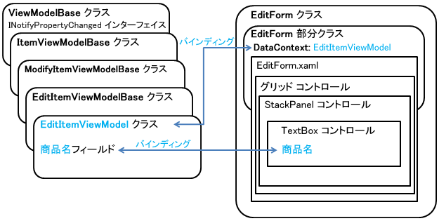

# Windows Phone SharePoint List Application テンプレートのアーキテクチャ
Windows Phone SharePoint リスト アプリケーション テンプレートから作成されたプロジェクトのデザイン パターンについて理解します。
Windows Phone SharePoint Software Development Kit によりインストールされる Windows Phone SharePoint リスト アプリケーション テンプレートは、プロジェクトの一部をさまざまなコンポーネントに分けるパターンに基づいて Windows Phone アプリを生成するように設計されています。このテンプレートは、パターンを確立するクラスおよびファイルを作成する作業を行い、開発者が特定の要件、ビジネス ロジック、およびデータに基づいて、生成されたプロジェクトの拡張に集中できるようにします。
  
    
    

## Windows Phone SharePoint リスト アプリケーション テンプレートと MVVM デザイン パターン

Windows Phone SharePoint リスト アプリケーション テンプレートは、MVVM (View-Model-ViewModel) パターンとして知られるソフトウェア デザイン パターンに従って開発された Silverlight ベースの Windows Phone アプリ用の Visual Studio 2010 プロジェクト生成します。MVVM パターンは、独立して開発、テスト、変更することができる管理可能層にプロジェクト内のコードを調整および区分する手段です。これは、Windows Presentation Foundation (WPF) および Silverlight プロジェクトにとって特に効果的な開発パターンです。それは、いくつかある利点の中で、このパターンを使用すると、指定されたアプリケーションのプレゼンテーション層の基になるデータ構造への厳格な依存を減らすことができ、開発者は、同じ基になるデータ構造を保ちながら、プレゼンテーション層を様々なコンテキスト (たとえば Web ブラウザー、モバイル デバイス インターフェイス、またはデスクトップ アプリケーション) に自由に採用できるためです。
  
    
    
たとえば、Silverlight アプリケーション内の特定の XAML ファイルに関連付けられた分離コード ファイル内にすべてのデータ管理コードを記述する単純なアプローチとは逆に、MVVM パターンに従ってプロジェクトを整理すると、最初に必要なクラス、継承モデル、パターンのコンポーネント間の通信方法を計画および開発する労力が必要になります。Windows Phone SharePoint リスト アプリケーション テンプレートはこの初期構成とパターンを設定する開発作業を担当するため、機能 MVVM アプリケーションを迅速に開発するようにプロジェクトをカスタマイズおよび拡張できます。
  
    
    
MVVM パターンの主な 3 つのコンポーネントまたはレイヤーは、View、Model、ViewModel です。Windows Phone SharePoint リスト アプリケーション テンプレートに基づくプロジェクトでは、これらのコンポーネントは図 1 に示すようなさまざまなプロジェクト ファイルによって実装されます。
  
    
    

**図 1. MVVM パターンの Windows Phone SharePoint リスト アプリケーション ファイル**

  
    
    

  
    
    

  
    
    
以下のセクションでは、これらのコンポーネントの Windows Phone SharePoint リスト アプリケーション テンプレートへの実装についての詳細を説明します。
  
    
    

### Model コンポーネント

MVVM パターンの Model コンポーネントは、アプリケーション用のデータを表すために使用されるクラスおよび構造体を参照します。SharePoint リストに基づくアプリには、リストおよびそのアイテムが基になるデータとして機能します。Windows Phone SharePoint リスト アプリケーションでは、 **ListDataProvider** クラスが SharePoint リストに接続するための標準の SharePoint クライアント オブジェクト モデル操作を行います。たとえば、 **ClientContext** クラスのインスタンスを作成しそのプロパティを設定することなどです。テンプレートの **ListDataProvider** クラスの正確な実装の詳細は、テンプレートに基づいてプロジェクトを作成するときに SharePoint Phone アプリケーション ウィザードの手順で指定したオプションによって異なります。
  
    
    
 **ListDataProvider** クラスの派生元である (Microsoft.SharePoint.Phone.Application.dll 内の) 基本クラス **ListDataProviderBase** は、SharePoint リスト データ用のキャッシュ メカニズムを実装しています。 リスト アイテムがサーバーから取得されると、それらは電話アプリに割り当てられたローカル メモリ内の **ListDataProvider** クラスによってキャッシュされ、これらのアイテムがアプリで必要になったときに、リソースを節約し、サーバーへのトリップを削減するために、このキャッシュが最初に確認されます。
  
    
    
SharePoint リストから取得したデータをフィルター処理する、または取得するデータそのもの指定する場合、(ListDataProvider.cs ファイル内の) **ListDataProvider** クラスのコードを変更することができます。これらの目的で変更の必要の可能性が最もあるファイルの部分は、 **LoadDataFromServer** メソッドと静的な **CamlQueryBuilder** クラスの実装です。 **ListDataProviderBase** クラスから独自のクラスを派生させることもできます。これを行った場合、必ず基本クラス **LoadData** および **LoadItem** から抽象メソッドを実装し、また基本クラスの **Context** プロパティ メンバーを実装し、適切な **get** アクセサー メソッドを提供するようにします。
  
    
    

### View コンポーネント

MVVM パターンの View コンポーネントは、アプリのユーザー インターフェイス (UI) を参照します。Silverlight ベースの Windows Phone アプリでは、View コンポーネントは UI 要素を宣言および修飾する XAML ファイルと、これらの XAML ファイルに関連付けられる、イベント ハンドラーおよびユーザーが UI 要素と対話する方法を決定する他のコードを実装する分離コードファイルから構成されます。
  
    
    
Windows Phone 向けの SharePoint リスト アプリケーションの開発のコンテキストにおいて、"ビュー" という言葉の 2 つの意味を区別することが重要です。SharePoint リストは、たとえば既定のリスト用の [すべてのアイテム] ビューや、Calendar リスト テンプレートに基づいたリスト用の [現在のイベント] ビューなどの 1 つ以上のビューに関連付けられます。これらのビューは、SharePoint リストのリスト アイテムを整理および表示する方法を示します。アプリの対象にする SharePoint リストの種類 (およびカスタム ビューがリストに追加されたかどうか) に応じて、[すべてのタスク] や [現在のイベント] などのリストに関連付けられるビューは、テンプレートからプロジェクトを作成するときに SharePoint Phone アプリケーション ウィザードでアプリに含めるように選択できるようになります。指定したビューを含めると、テンプレートは **PivotItem** コントロール ( **Pivot** コントロール内に含まれる) を生成して、リストのビューを表示します。
  
    
    
この "ビュー" という言葉の意味は、テンプレートの View に適用される言葉の意味とは区別されます。Windows Phone SharePoint リスト アプリケーション テンプレートに基づくプロジェクトでは、View (プロジェクトの Views フォルダーに XAML ファイルとして実装) は、概念的に MVVM パターンの View コンポーネントのことをいいます。つまり、プロジェクトでの View は、指定されたエンティティのデータ (または Model) 用のプレゼンテーション層を表します。この場合、エンティティは SharePoint リストか SharePoint リスト アイテムのいずれかになります。
  
    
    
プロジェクト内の List フォーム (List.xaml) は SharePoint リストに関連付けられた既定のビューに対応すると言えますが、SharePoint リストの既定のビューと List フォームで表される View との概念的な区別は維持すべきです。これは、プロジェクト内の List フォームは必ずしもサーバー上のリストの既定のビューにマップされるとは限らないからです。(たとえば、特定の並べ替え順序を指定する、または他のものではなく特定のフィールドを表示することによって) サーバー上の既定のリスト ビューを変更した場合などは、その変更はプロジェクト内の List フォームを構成する XAML に表されません。サーバー上の SharePoint リストに関連付けられた既定のビューに対して構成された順序とは関係なく、SharePoint Phone アプリケーション ウィザードでの選択に基づいて (または List フォームのその後のカスタマイズに基づいて) アプリの List フォームに表示されるようにアイテムの順序を設定します。
  
    
    
List フォームは SharePoint リスト用の View (またはプレゼンテーション層) を表します。他の 3 つの View ファイルは個々のリスト アイテムに関するもので、それらは SharePoint のリスト アイテム用のリスト アイテム メニューから (通常) 使用できるフォームに対応すると言えます。
  
    
    

- Display フォーム (DisplayForm.xaml) は、SharePoint リストの View Item フォーム (DispForm.aspx) に対応します。このフォームは、SharePoint リストの個々のアイテム用の View を示します。
    
  
- Edit フォーム (EditForm.xaml) は、SharePoint リストの Edit Item フォーム (EditForm.aspx) に対応します。このフォームは、指定のアイテムが編集ために表示される際に View を示します。
    
  
- New フォーム (NewForm.xaml) ファイルは、SharePoint リストの New Item フォーム (NewForm.aspx) に対応します。このフォームは、作成されリストに追加される指定のアイテム用の View を示します。
    
  
List フォームは、既定で常に Windows Phone SharePoint リスト アプリケーション テンプレートに基づいてプロジェクトに含められます。プロジェクトの Views フォルダー内の他のフォーム用の XAML ファイルは、SharePoint Phone アプリケーション ウィザードで選択されたリスト操作 (新規作成、表示、または編集) に基づいて生成されます。
  
    
    

### ViewModel コンポーネント

MVVM パターンの ViewModel コンポーネントは、View コンポーネントと Model コンポーネントとの間の対話を容易にするためのある種のブローカーとして機能するように意図される一方で、Model コンポーネントから View コンポーネントを切り離しているため、他方に悪影響を与えずに一方または他方を変更することが簡単です。厳密に言うと、ViewModel コンポーネントは、View コンポーネントでのプレゼンテーションのために基となるデータを "形作る" ロジックを含めることがよくあるため、プレゼンテーション層の一部と考えられます。Windows Phone SharePoint リスト アプリケーション テンプレートに基づくプロジェクトでは、ViewModel は、Model コンポーネント (つまり **ListDataProvider** クラスのオブジェクト) から取得した SharePoint リスト データを View コンポーネントの一部にある UI コントロール (たとえば Edit フォーム) にバインドするコードを実装しています。リストからのデータの表示に使用されるコントロールの種類およびデータ型 (つまり、リスト アイテムのフィールド型がテキストであるか数値であるか、または SharePoint Choice フィールドのようなものであるかどうか) に応じて、ViewModel はまず指定した UI コントロールにデータをバインドできるように処理または変換します。
  
    
    
特に、プロジェクト内の ViewModel クラス (たとえば、 **EditItemViewModel** クラス) は、(Microsoft.SharePoint.Phone.Application.dll 内の) 基本クラス **ViewModelBase** から派生します。この基本クラスは、基になるデータ内の値が変わったときに、アプリのユーザー インターフェイスを構成している Silverlight コントロールが更新され、(コントロールに対して "双方向" のバインディングが構成されている場合) UI コントロールに保存された値への (他の方向に移動する) 変更を基になるデータに適用できるように、 **INotifyPropertyChanged** インターフェイスを実装しています。
  
    
    
図 2 は **EditItemViewModel** クラスのクラス継承階層、および Edit フォーム内の指定された UI コントロールと ViewModel の対応するフィールドとのバインドを簡単に示しています。
  
    
    

**図 2. EditItemViewModel クラスと EditForm クラス**

  
    
    

  
    
    

  
    
    
 **EditForm** クラス (MVVM パターンからの View コンポーネントを表す) は、EditForm.xaml ファイルとその関連付けられた分離コード ファイル EditForm.xaml.cs の 2 つのファイルによって定義および実装されます。EditForm.xaml.cs ファイルでは、 **EditForm** クラスの **DataContext** プロパティを **EditItemViewModel** クラスのオブジェクトに設定することによって、 **EditItemViewModel** クラス (MVVM パターンの ViewModel コンポーネントを表す) が EditForm.xaml.cs ファイルの View にバインドされます。
  
    
    
MVVM パターンに基づくソフトウェア設計は、ビジネス ロジックおよび検証ルーチンをパターンの Model コンポーネントに制限することがよくあります。ただし、Windows Phone SharePoint リスト アプリケーション テンプレートに基づくプロジェクトでは、一般に Model コンポーネントの一部と考えられる動作のいくつかは、データ層 (Model) とプレゼンテーション層 (ViewModel) との概念的な区別をわずかに不明瞭にする犠牲を払って、開発者がプロジェクトの拡張を行いやすくする ViewModel コンポーネントに実装されています。たとえば、リスト アイテムを編集および作成する ViewModel クラス (つまり、 **EditItemViewModel** クラスと **NewItemViewModel** クラス) は、ユーザーが入力したデータの検証を実装するために開発者が上書きできる **Validate** メソッドを公開します (これらの ViewModel でデータの検証を実装する方法については、「 [SharePoint 2013 用 Windows Phone アプリにビジネス ロジックとデータ検証を実装する方法](how-to-implement-business-logic-and-data-validation-in-a-windows-phone-app-for-s.md)」を参照してください)。
  
    
    

    
> **メモ**
> **ListDataProvider** オブジェクトは、サーバーからのデータの読み込みのみを行います。 **Add**、 **Update**、 **Delete** など、その他の操作は ViewModel 自体で実行され、その後のリフレッシュの呼び出しによって ViewModel データはサーバーから更新されます。こうした設計により、コードが乱雑になるのを抑制できます。
  
    
    

## App.xaml ファイルと Silverlight アプリケーション モデル

App.xaml ファイルとその関連付けられた分離コード ファイルの App.xaml.cs は、管理された Silverlight アプリケーションの標準のコンポーネントです。Silverlight 用のマネージ API を使用するアプリケーションは、Silverlight アプリケーション モデルを実装するために、Silverlight  [Application](http://msdn.microsoft.com/ja-jp/library/system.windows.application%28VS.95%29.aspx) クラスから派生したクラスを含める必要があります。 **Application** クラスは、画像、文字列、XAML テンプレートなどのリソースを管理するアプリケーション ライフサイクル イベントおよび機能をサポートしています。
  
    
    
プロジェクトの App.xaml.cs ファイルへの変更の種類については、App.xaml.cs ファイルにイベント ハンドラーを実装してアプリケーションの状態情報を保持する方法についての「 [[方法] Windows Phone 上に SharePoint リスト アイテムを保存および取得する](how-to-store-and-retrieve-sharepoint-list-items-on-a-windows-phone.md)」と App.xaml.cs において追加の **ListDataProvider** オブジェクトをインスタンス化および構成する方法の「 [[方法] Windows Phone アプリで複数の SharePoint 2013 リストを使用する](how-to-use-multiple-sharepoint-2013-lists-in-a-windows-phone-app.md)」を参照してください。
  
    
    

## その他の技術情報

-  [Model-View-ViewModel パターンの使用](http://msdn.microsoft.com/ja-jp/library/hh821028.aspx)
    
  
-  [Windows Phone の Pivot コントロールのアーキテクチャ](http://msdn.microsoft.com/ja-jp/library/ff941097%28VS.92%29.aspx)
    
  
-  [アプリケーション モデル](http://msdn.microsoft.com/ja-jp/library/cc872869%28VS.95%29.aspx)
    
  
-  [MVVM パターンを使用した Windows Phone アプリケーションの開発](http://msdn.microsoft.com/ja-jp/library/hh848247.aspx)
    
  
-  [Model-View-ViewModel デザイン パターンによる WPF アプリケーション](http://msdn.microsoft.com/ja-jp/magazine/dd419663.aspx)
    
  
-  [Windows Phone SDK 8.0](http://www.microsoft.com/ja-jp/download/details.aspx?id=35471)
    
  
-  [Microsoft SharePoint SDK for Windows Phone 8](http://www.microsoft.com/ja-jp/download/details.aspx?id=36818)
    
  
-  [Microsoft SharePoint SDK for Windows Phone 7.1](http://www.microsoft.com/ja-jp/download/details.aspx?id=30476)
    
  

