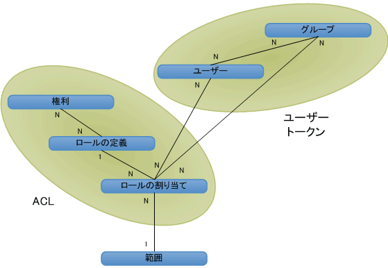

# SharePoint 2013 の認証、ユーザー、グループ、およびオブジェクト モデル

SharePoint 2013では、Web サイト、リスト、フォルダー、リスト アイテムへのアクセスは、ロール ベースのメンバーシップ システムによって制御されます。このシステムでは、ユーザーにロールを割り当て、それによって SharePoint 2013 オブジェクトへのアクセスを承認します。
  
    
    

ユーザーにオブジェクトへのアクセス権を与えるには、既にそのオブジェクトへのアクセス許可が与えられているグループにそのユーザーを追加するか、ロールの割り当てオブジェクトを作成して、ユーザーにロールの割り当てを設定し、必要に応じてそのロールの割り当てを基本的なアクセス許可を持つ適切なロール定義にバインドしてから、その割り当てを目的のリスト アイテム、フォルダー、リスト、Web サイトに対するロールの割り当てのコレクションに追加します。ユーザーをロールに割り当てても、そのロールの割り当てをロール定義にバインドしていない場合、ユーザーにはアクセス許可が与えられません。
SharePoint 2013では、次の方法でそのオブジェクトへのアクセスを制御しています。
  
    
    

- オブジェクトでは、親 Web サイト、リスト、フォルダーと同じアクセス許可を使用することも (親オブジェクトで有効なロールとユーザーの両方とも継承)、固有のアクセス許可を使用することもできます。 
    
  
- 各サイト、リスト、フォルダー、およびアイテムはロールに割り当てられたコレクションを提供するので、オブジェクトへのユーザーのアクセスを詳細に管理できます。
    
  
- グループはユーザーで構成されていますが、ロールに割り当てられている場合と、そうでない場合があります。SharePoint 2013には、既定で以下の 3 つのグループがあります。
    
  - **owners** (管理者)
    
  
  - **members** (投稿者)
    
  
  - **visitors** (閲覧者)
    
  

    ユーザー インターフェイスから固有のアクセス許可が設定された Web サイトを作成すると、サイトのプロビジョニングの一環として、これらのグループにユーザーを割り当てることのできるページが表示されます。
    
  
- 匿名アクセスを使用すると、ユーザーはリストやアンケートに匿名で投稿したり、ページを匿名で表示したりできます。また、匿名アクセスを有効にしなくても、ドメインのすべてのメンバーが Web サイトにアクセスできるように、"すべての認証されたユーザー" にアクセス権を付与することもできます。 
    
  
- サイト作成権限 ( **CreateSSCSite** と **ManageSubwebs**) は、ユーザーが最上位レベルの Web サイト、サブサイト、ワークスペースを作成できるかどうかを制御します。
    
  
ユーザーは、ロールが割り当てられたグループを介して間接的に、またはロールの割り当てによって直接的に SharePoint オブジェクトのメンバーになります。また、グループまたはロールに追加された Microsoft Windows NT ドメイン グループのメンバーにもなれます。ロール定義は、 [Microsoft.SharePoint.SPBasePermissions](https://msdn.microsoft.com/library/Microsoft.SharePoint.SPBasePermissions.aspx) 列挙の値に従って、ユーザーまたはグループに 1 つの権限または権限セットを割り当てます。各ユーザーまたはグループは、それぞれ固有のメンバー [ID](https://msdn.microsoft.com/library/Microsoft.SharePoint.SPMember.ID.aspx) を持ちます。addrole.aspx ファイルと editrole.aspx ファイルの機能を使用する方法以外にも、オブジェクト モデルを使用して、ロールの割り当てと定義を作成したり変更したりできます。ユーザー インターフェイスで表示されるこれらのページとは異なり、オブジェクト モデルでは、権限の依存関係は適用されないので、権限を自由に組み合わせてロール定義を作成できます。ただし、オブジェクト モデルを使用してロール定義やアクセス許可をカスタマイズするときは注意が必要です。ロール定義に対する計画が不十分な場合や、権限の割り当てが不適切な場合、ユーザーの利便性が損なわれる可能性があります。SharePoint 2013の権限について詳しくは、「 [SPBasePermissions](https://msdn.microsoft.com/library/Microsoft.SharePoint.SPBasePermissions.aspx) 」を参照してください。
## セキュリティ ポリシー

セキュリティ ポリシーは、Web アプリケーション (仮想サーバー) 内のすべてのサイト コレクションで一貫したセキュリティを適用する手段です。ポリシーを使用すると、ロール (つまり、権限のコレクション) を個々の SharePoint 2013 ユーザーと、Windows 認証やプラグ可能な認証システムを使用しているドメイン グループ (SharePoint グループを除く) に割り当てることができます。ポリシー エントリごとに、Web アプリケーションのユーザーまたはグループの権限が指定されます。
  
    
    
ポリシーは、論理 Web アプリケーション レベルまたはゾーン レベルで設定されます。たとえば、2 つの Web アプリケーションのコンテンツが同じでも、 `http://Server` と `http://Server.extranet.microsoft.com` ではそれぞれ異なるポリシーがユーザーに適用されます。
  
    
    
権限は、ポリシーによって付与したり、取り消したりできます。権限を付与すると、オブジェクトのローカル権限とは関係なく、Web アプリケーション内のセキュリティで保護されたすべてのオブジェクトに対する権限がユーザーまたはグループに与えられます。権限の取り消しは権限の付与よりも優先度が高くなります。権限を取り消すと、Web アプリケーション内のセキュリティで保護されたすべてのオブジェクトに対するユーザーまたはグループの権限がブロックされます。あるユーザーの権限をすべて取り消すと、特定のコンテンツに対する明示的なアクセス許可がそのユーザーに付与されている場合でも、すべてのコンテンツにアクセスできなくなります。ポリシーは、サイト レベルのアクセス許可を無効にします。
  
    
    
ポリシー ロールでは、ユーザーとグループはセキュリティ識別子 (SID) とログイン名 (またはユーザー名) の組み合わせで識別されます。ポリシー ロールの適用方法は、Web サイト、リスト、フォルダー、ドキュメントに対するアクセス許可の管理方法と要領はほぼ同じで、ユーザーまたはグループを追加し、これにロール定義を 1 つ以上割り当てます。Web アプリケーションごとに固有のポリシー ロールがあります。ポリシー ロールとアクセス許可の管理で異なるのは、サーバー全体の管理者が Web アプリケーション全体に対するユーザーの権限を取り消しできるという点です。
  
    
    

> **メモ**
> サーバーの全体管理のポリシー ロールは、サイト コレクションのロール定義と異なります。 
  
    
    

## ユーザー、グループ、プリンシバル

個々のユーザー ( [SPUser](https://msdn.microsoft.com/library/Microsoft.SharePoint.SPUser.aspx) ) が SharePoint オブジェクトにアクセスするには、個別のロールの割り当てを通じて直接アクセス権を取得するか、ロールの割り当てが設定されたドメイン グループまたは SharePoint グループ ( [SPGroup](https://msdn.microsoft.com/library/Microsoft.SharePoint.SPGroup.aspx) ) を通じて間接的にアクセス権を取得します。直接的なロール割り当てでは、ユーザーがプリンシパル ( [SPPrincipal](https://msdn.microsoft.com/library/Microsoft.SharePoint.SPPrincipal.aspx) ) になります。一方、ドメイン グループまたは SharePoint グループのロールの割り当てでは、ドメイン グループまたは SharePoint グループがプリンシパルになります。
  
    
    
SharePoint Server では、Windows ユーザー (例:  _DOMAIN_\\ _User_Alias_) と (プラグ可能な認証による) 外部ユーザーの両方がサポートされています。ユーザーの ID の保守は、ID 管理システム (Active Directory ディレクトリ サービスなど) によって行われます。ユーザー プロファイル (ユーザーの表示名、電子メール アドレス、その他の情報など) のスコープはサイト コレクション レベルです。表示名を変更すると、サイト コレクション全体に変更が適用されます。
  
    
    
グループは、SharePoint Server でセキュリティの管理に使用されるユーザー コレクションです。ユーザー ベースの管理は、シンプルなサイトでは容易ですが、個別にセキュリティ保護されるリソースの数が増すにつれ複雑になります。たとえば、1 つ目のリストには " **Contribute**" ロール、2 つ目のリストには " **Read**" ロール、3 つ目のリストには " **Design**" ロールが 1 人のユーザーに割り当てられている場合もあります。このモデルはスケールアップに支障をきたします。仮にユーザー数が 50,000 人もいるとすると、個別にセキュリティ保護されるオブジェクトごとのアクセス制御リスト (ACL) に 50,000 個ものアクセス制御エントリ (ACE) が連なることになります。 
  
    
    
グループを使用することで、ユーザー ベースのアクセス権の管理に立ちはだかる管理の複雑さと拡張性の問題が解消されます。グループ ベースの管理は、より抽象的で概念化しにくくなりますが、個別にセキュリティ保護されるオブジェクトを多数抱える複雑なサイトでは、管理を容易にすることができます (たとえば、システム内のさまざまなオブジェクトで適切なロールが既に与えられているグループにユーザーを追加するときなど)。保存の必要なグループの ACE 数は大幅に少なくなるので、グループに対するアクセス権チェックは拡張性に優れています。
  
    
    
SharePoint Server では、ドメイン グループと SharePoint グループの 2 種類のグループがサポートされています。ドメイン グループは、SharePoint Server の管理対象外に留まります。つまり、ユーザーは SharePoint Server を使用して、ドメイン グループのメンバーシップの定義、参照、変更を行うことはできません。SharePoint グループのスコープは、サイト コレクション レベルに限定され、サイト コレクション内でしか使用できません。ドメイン グループは、Active Directory ディレクトリ サービスのスコープ内であれば任意の場所で使用できます。
  
    
    
プリンシパルは、セキュリティ管理に使用されるユーザーまたはグループです。1 つのサイトにユーザーを追加すると、ユーザーがプリンシパルになり、そのサイトにグループを追加するとグループがプリンシパルになります。SharePoint Server でセキュリティをスケールアップするにあたり、スコープ内のプリンシパルを妥当な数に保つことが重要となります。グループを使用すると、少数のプリンシパルで膨大な数のユーザーにアクセス権を与えることができます。
  
    
    

## オブジェクト関係の概観 ? スコープ、ユーザー、グループ、ロール

図 1 は、SharePoint Server セキュリティ管理システムの概観を論理データベース図で示したものです。各ボックスはシステム内のセキュリティ オブジェクトを表し、線はオブジェクト間の関係を表します。また、 **1** と **N** の表記は関係の種類を表します。この図は、どのように権限データがユーザー トークンと ACL に構造化されているかを示しています。
  
    
    

**図 1. 承認オブジェクトの関係**

  
    
    

  
    
    

  
    
    
スコープは、個別にセキュリティ保護される 1 つのオブジェクトまたは複数のオブジェクト セットで示されます。サイト、リスト、フォルダー、アイテムの各レベルをスコープに指定できます。
  
    
    
ユーザーとグループは、多対多の関係 (N - N) にあります。各ユーザー ( [SPUser](https://msdn.microsoft.com/library/Microsoft.SharePoint.SPUser.aspx) ) は複数のグループのメンバーに属することができ、各グループ ( [SPGroup](https://msdn.microsoft.com/library/Microsoft.SharePoint.SPGroup.aspx) ) には複数のユーザーを含めることができます。
  
    
    
権限とロールの定義も、多対多の関係 (N - N) にあります。各権限 ( [SPBasePermissions](https://msdn.microsoft.com/library/Microsoft.SharePoint.SPBasePermissions.aspx) ) は、複数のロール定義に属することができます。たとえば、" **Insert List Items**" 権限は " **Contributor**"、" **Designer**"、" **Administrator**" の各ロール定義に属します。また、各ロール定義 ( [SPRoleDefinition](https://msdn.microsoft.com/library/Microsoft.SharePoint.SPRoleDefinition.aspx) ) にも、複数の権限を含めることができます。たとえば、" **Contributor**" には、リスト アイテムを挿入する権限、更新する権限、削除する権限が含まれます。
  
    
    
ロール定義とロールの割り当て ( [SPRoleAssignment](https://msdn.microsoft.com/library/Microsoft.SharePoint.SPRoleAssignment.aspx) ) は、一対多の関係 (1 - N) にあります。各ロール定義は、複数のロールの割り当ての中で使用されます。リスト 1 の閲覧者とリスト 2 の閲覧者が異なる場合もありますが、そのロールの割り当ては " **Reader**" という 1 つのロール定義を共有できます。
  
    
    
ユーザーまたはグループとロールの割り当ては、多対多の関係 (N - N) にあります。各ユーザーまたはグループは、任意のオブジェクトに対して複数のロールの割り当てのメンバーに属することができます。たとえば、1 人のユーザーが同じオブジェクトに対して " **Designer**" ロールと " **Administrator**" ロールを併せ持つことができます。 
  
    
    
スコープとロールの割り当ては、一対多の関係 (1 - N) にあります。各スコープにはロールの割り当てが複数ありますが、各ロールの割り当てにはスコープが 1 つしかありません。たとえば、あるユーザーがイベント リストの閲覧者になっており、別のユーザーがイベント リストの投稿者となっているとしても、どちらのロールの割り当てもお知らせリストには適用されません。2 つのリストで同じロールの割り当てを共有するには、それぞれの権限を親コンテナーから継承する以外に方法はありません。この場合、セキュリティのスコープは 2 つのリストではなく親コンテナーとなります。
  
    
    

## ユーザー トークンとアクセス制御リスト

SharePoint Server では、権限チェックを速やかに行うため、そのセキュリティ モデル内にユーザー トークンと ACL が実装されています。ユーザー トークンによって、ユーザーに適用される認証プロセスが識別されます。Windows ユーザーは、ユーザー固有の文字列 (SID) と、そのユーザーが属するすべての Windows ドメイン グループのリストで構成される複雑なトークン (例:  _DOMAIN_\\Department 15688) を使用します。Windows 認証が設定されていないユーザーは、ユーザー名に固有の文字列からなる非常にシンプルなトークンを使用する場合もあれば、Windows 認証で表されるようなグループ/ロールのメンバーシップが組み込まれた複雑なトークンを使用する場合もあります。各ユーザーが属する SharePoint グループのメンバーシップはユーザー トークンを使って表されるため、SharePoint Server では、ユーザー トークンを読み取ることにより、現在のユーザーが属するすべてのグループが識別されます。
  
    
    
ACL は、特定のオブジェクトに対するユーザーとグループの権限を指定するバイナリ オブジェクトです。ACL は複数の ACE で構成され、各セキュリティ プリンシパル (ユーザーまたはグループ) が ACL 内で 1 つの ACE となります。権限、ロール定義、ロールの割り当てはスコープごとに ACL に構造化されているため、SharePoint Server では、指定された対象範囲内でユーザーまたはグループごとに許可されているアクションを識別できます。
  
    
    

## オブジェクト モデルの変更: 廃止されたセキュリティ オブジェクト (前方互換性あり)

SharePoint 2013のオブジェクト スコープでは、同じ基本的な権限の管理操作を共有します。SharePoint 2013では、ロール定義によって権限が管理されます。これにより、リスト、フォルダー、アイテムの各レベルで一貫した操作が可能になります。以下のセキュリティ オブジェクトは Windows SharePoint Services 2.0 で使用されていたもので、廃止となりますが、前方互換性を持たせるために引き続き機能します。
  
    
    

-  [Microsoft.SharePoint.SPPermission](https://msdn.microsoft.com/library/Microsoft.SharePoint.SPPermission.aspx)
    
  
-  [Microsoft.SharePoint.SPPermissionCollection](https://msdn.microsoft.com/library/Microsoft.SharePoint.SPPermissionCollection.aspx)
    
  
-  [Microsoft.SharePoint.SPRights](https://msdn.microsoft.com/library/Microsoft.SharePoint.SPRights.aspx)
    
  
-  [Microsoft.SharePoint.SPRole](https://msdn.microsoft.com/library/Microsoft.SharePoint.SPRole.aspx)
    
  
-  [Microsoft.SharePoint.SPRoleCollection](https://msdn.microsoft.com/library/Microsoft.SharePoint.SPRoleCollection.aspx)
    
  
ユーザーをロールに割り当てるには、 [Microsoft.SharePoint.SPRoleAssignment](https://msdn.microsoft.com/library/Microsoft.SharePoint.SPRoleAssignment.aspx) クラスと [Microsoft.SharePoint.SPRoleAssignmentCollection](https://msdn.microsoft.com/library/Microsoft.SharePoint.SPRoleAssignmentCollection.aspx) クラスのメンバーを使用します。 [SPRights](https://msdn.microsoft.com/library/Microsoft.SharePoint.SPRights.aspx) に代わる [SPBasePermisssions](https://msdn.microsoft.com/library/Microsoft.SharePoint.SPBasePermisssions.aspx) 列挙には、追加の権限が含まれます。また、 [SPBasePermisssions](https://msdn.microsoft.com/library/Microsoft.SharePoint.SPBasePermisssions.aspx) 列挙には、 [SPRights](https://msdn.microsoft.com/library/Microsoft.SharePoint.SPRights.aspx) の以前の権限と同じ定数値にマッピングされる従来の権限も含まれます。SharePoint グループの概念は、クロスサイト グループを表す既存の [SPGroup](https://msdn.microsoft.com/library/Microsoft.SharePoint.SPGroup.aspx) オブジェクトと [SPGroupCollection](https://msdn.microsoft.com/library/Microsoft.SharePoint.SPGroupCollection.aspx) オブジェクトに対応付けられます。
  
    
    

### ポリシー ロール: URL ゾーンのセキュリティ ポリシーを作成または変更する

URL ゾーンのセキュリティ ポリシーを作成または変更するには、以下のクラスとそのメンバーを使用します。
  
    
    

-  [Microsoft.SharePoint.Administration.SPPolicy](https://msdn.microsoft.com/library/Microsoft.SharePoint.Administration.SPPolicy.aspx)
    
  
-  [Microsoft.SharePoint.Administration.SPPolicyCollection](https://msdn.microsoft.com/library/Microsoft.SharePoint.Administration.SPPolicyCollection.aspx)
    
  
-  [Microsoft.SharePoint.Administration.SPPolicyRole](https://msdn.microsoft.com/library/Microsoft.SharePoint.Administration.SPPolicyRole.aspx)
    
  
-  [Microsoft.SharePoint.Administration.SPPolicyRoleCollection](https://msdn.microsoft.com/library/Microsoft.SharePoint.Administration.SPPolicyRoleCollection.aspx)
    
  
-  [Microsoft.SharePoint.Administration.SPPolicy.SPPolicyRoleBindingCollection](https://msdn.microsoft.com/library/Microsoft.SharePoint.Administration.SPPolicy.SPPolicyRoleBindingCollection.aspx)
    
  
-  [Microsoft.SharePoint.Administration.SPPolicyPermissions](https://msdn.microsoft.com/library/Microsoft.SharePoint.Administration.SPPolicyPermissions.aspx)
    
  

## 共有リソースに対応するためのゲスト ロール (制限付きアクセス)

ゲスト ロールの概念は、プラットフォームの共有リソースに対応するというものです。たとえば、リスト ビューのページをレンダリングするには、Web サイトのテーマやナビゲーション構造を使用する必要があります。この概念への対応は、フォルダー レベルとリスト レベルの権限にまで広がっています。
  
    
    
従来のオブジェクト モデルとの意味的互換性を保つために、SharePoint オブジェクト モデルはこれまでと同様に " **Guest**" ロールと呼ばれますが、ユーザー インターフェイスでは [ **制限付きアクセス**] と表示されます。 
  
    
    

### フォルダとアイテムの権限が及ぶ範囲

フォルダーに対する権限がユーザーに与えられると、そのフォルダーの親リストとそのリストの親 Web サイト (そのフォルダーの上から最上位の先祖である Web サイトまでの、個別にセキュリティ保護されたすべてのスコープ) に対する " **Guest**" ロールも一緒に与えられます。これは、リスト アイテムにも当てはまります。アイテムに対する権限がユーザーに与えられると、すべての親フォルダー、リスト、最上位の先祖である Web サイトにまでさかのぼった Web サイトに対する " **Guest**" ロールも一緒に与えられます。
  
    
    

## 1 つのスコープまたはすべてのスコープからユーザーを削除する

あるスコープからユーザーを削除すると、現在のスコープより下にある個別にセキュリティ保護されたすべてのスコープからもそのユーザーが削除されます。たとえば、ある Web サイトからユーザーを削除すると、そのサイト内で個別にセキュリティ保護されたリストからもそのユーザーが削除されます。
  
    
    
すべてのスコープからユーザーを削除する唯一の方法は、サイト コレクションからそのユーザーを削除することです。そうすることにより、サイト コレクション内ですべてのスコープのすべてのロールからそのユーザーが削除されます。
  
    
    

## その他の技術情報

-  [SharePoint 2013 での認証、承認、およびセキュリティ](authentication-authorization-and-security-in-sharepoint-2013.md)
    
  
-  [SharePoint 2013 でのロール、継承、権限の昇格、およびパスワードの変更](role-inheritance-elevation-of-privilege-and-password-changes-in-sharepoint-2013.md)
    
  
-  [SharePoint 2013 でのクレームベース ID](claims-based-identity-in-sharepoint-2013.md)
    
  
-  [SharePoint 2013 のクレームベース ID と概念](claims-based-identity-and-concepts-in-sharepoint-2013.md)
    
  
-  [SharePoint 2013 での構成、管理、およびリソース](configuration-administration-and-resources-in-sharepoint-2013.md)
    
  

