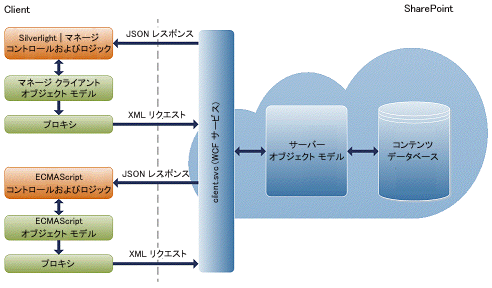
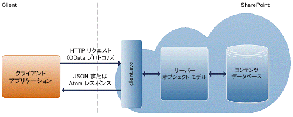

# SharePoint 2013 にアクセスする Windows Phone アプリの作成
SharePoint 2013 と Windows Phone 8 や Windows Phone 7 のようなモバイル機器の統合を実現する SharePoint アドインを作成する方法について説明します。
## SharePoint 2013 を使用したモバイル アプリ作成の概要

SharePoint 2013 を使用すると、開発者はユーザーと共に移動し、対話的で魅力的、しかも時と場所を問わずに作業できるモバイル アプリを作成することができます。Windows Phone 8 および Windows Phone 7 アプリケーションを社内設置型 SharePoint サービスやアプリケーション、またはクラウドで実行するリモートの SharePoint サービスやアプリケーション (SharePoint Online を使用するものなど) と組み合わせることで、従来のデスクトップやノート PC を越えて機能を拡張する強力なアプリケーションを作成し、ポータブルでよりアクセスしやすい環境にすることができます。
  
    
    
SharePoint 2013 が提供する新しいモビリティ機能は、SharePoint、Windows Phone、Visual Studio、Silverlight のような既存の Microsoft のツールと技術を使用して構築されます。これらの技術やその技術に関連するツールに精通している開発者は、SharePoint ベースの Windows Phone 用モバイル アプリを簡単に作成することができます。このセクションでは、Windows Phone 8 および Windows Phone 7 用に作成できる SharePoint ベースのモバイル アプリの種類について、またそれらのアプリケーションをカスタマイズする最も一般的な方法について説明します。SharePoint 2013 が開発者に提供する Visual Studio 2010 プロジェクト テンプレートのようなフレームワークとツールを使用し、SharePoint Online を使用した社内インストールの SharePoint とクラウドの両方において、SharePoint データと対話するモバイル ソリューションを作成することができます。図 1 は Windows Phone に表示されるシンプルなリスト アプリケーションを示します。
  
    
    

**図 1. Windows Phone アプリに表示される SharePoint のリスト項目**

  
    
    

  
    
    

  
    
    

  
    
    

  
    
    

## モバイル アプリ作成に必要なスキル

このセクションは、読者が SharePoint, .NET Framework、Visual Studio 開発システム、そして Visual C# に精通していることを前提にしています。Silverlight を使用した Windows Phone 8 または Windows Phone 7 アプリケーションの経験があることも望ましく、XAML、Windows Phone 用の StackPanel と pivot コントロール、トゥームストーンや Sliverlight のデータ バインディングなどをよく理解していることも役に立ちます。Sliverlight を使用した Windows Phone アプリケーション開発が初めての場合は、次のリソースを参照することをお勧めします。
  
    
    

-  [Windows Phone アプリケーションを最初からすべて開発する](http://msdn.microsoft.com/ja-jp/library/gg680270%28v=pandp.11%29.aspx)
    
  
-  [Windows Phone のユーザー インターフェイス](http://msdn.microsoft.com/ja-jp/library/windowsphone/develop/ff967556%28v=vs.105%29.aspx)
    
  
-  [クイックスタート:XAML での Windows Phone のユーザー インターフェイスの作成](http://msdn.microsoft.com/ja-jp/library/windowsphone/develop/jj207025%28v=vs.105%29.aspx)
    
  
-  [Windows Phone の Pivot コントロールのアーキテクチャ](http://msdn.microsoft.com/ja-jp/library/windowsphone/develop/ff941097%28v=vs.105%29.aspx)
    
  

## SharePoint 2013 を使用したモバイル アプリ開発の概要

SharePoint 2013 を使用してバラエティーに富むモバイル アプリを作成できます。このセクションでは、開発者が簡単にモバイル アプリを開発できるようになる SharePoint 2013 のリリースでの新機能と変更項目を説明します。
  
    
    

### Windows Phone SharePoint 2013 Application テンプレート

これは携帯電話に通常のリストを表示するために作成する、最もシンプルなモバイル アプリの種類です。SharePoint 2013 が提供する Visual Studio テンプレートを使用し、Windows Phone 用の SharePoint のリスト アプリケーションを素早く簡単に作成することができます。たとえば、"タスク一覧" のような Windows Phone アプリケーションを作成できます。アプリケーションは SharePoint からタスク一覧を取り出して Windows Phone に送り、携帯電話を使用して外出先でタスクの状態を更新することができます。他の例としては、営業員が在庫リストの製品カタログを携帯電話で参照できるアプリケーションがあります。Windows Phone SharePoint SDK をインストールすると、2 つの Windows Phone SharePoint Application テンプレートが Visual Studio 2010 または Visual Studio 2010 Express for Windows Phone で使用できるようになります。(「 [[方法]: SharePoint 用モバイル アプリの開発環境をセットアップする](how-to-set-up-an-environment-for-developing-mobile-apps-for-sharepoint.md)」を参照してください。) Windows Phone SharePoint List Application テンプレートを使用して、SharePoint リストのデータへのアクセスや操作を可能にする機能的な Windows Phone アプリを、ウィザードの手順に従って作成することができます。
  
    
    

### SharePoint 2013 の新規および強化されたモビリティ オブジェクト モデル

SharePoint 2013 でサーバー オブジェクト モデルとクライアント オブジェクト モデルに追加された新しいクラスにより、この記事で前述した SharePoint のモビリティ シナリオが有効になります。
  
    
    
位置認識ができるアプリケーションを可能にするため、位置フィールドの値を構造化してレンダリングする新規ネイティブ フィールド型クラス **SPFieldGeoLocation** が関連クラスと共に提供されます。これらのクラスは Silverlight の SharePoint 2013 クライアント オブジェクト モデルで呼び出すこともできます。また、新しいフィールド型には標準的な SharePoint の fldtypes.xml ファイルに追加された定義と、Display、Edit、New フォーム上のフィールドのレンダリング用新規ユーザー コントロールがあります。概要については、「 [SharePoint 2013 でロケーションとマップ機能を組み込む](integrating-location-and-map-functionality-in-sharepoint-2013.md)」を参照してください。
  
    
    
Windows Phone ユーザーの SharePoint 2013 認証を有効にするには、新規 **Authenticator** クラスと関連するクラスをクライアント オブジェクト モデルに含めます。概要については、「 [SharePoint 2013 モバイル クライアント認証オブジェクト モデルの概要](overview-of-the-sharepoint-2013-mobile-client-authentication-object-model.md)」を参照してください。
  
    
    
SharePoint ファーム上にあるイベントの Windows Phone ユーザーへの自動通知を可能にするため、クライアント オブジェクト モデルからも呼び出すこともできる新規クラスをサーバー オブジェクト モデルに含めます。これらのクラスには、携帯電話アプリが SharePoint 2013 サーバー アプリを使用して、特定の種類のイベントについての通知を登録できるようにするためのメソッドが含まれます。登録された購読者側に通知を送信するためにサーバー アプリが使用するメソッドもあります。概要については「 [プッシュ通知を受信する Windows Phone SharePoint リスト アプリの作成](how-to-configure-and-use-push-notifications-in-sharepoint-2013-apps-for-windows.md#BKMK_NotificationPhoneApp)」を参照してください。
  
    
    
SharePoint 2013 を使用すると、Windows Phone 8 および Windows Phone 7 専用のモバイル アプリ開発に制限されなくなります。JavaScript プログラミング インターフェイスや、SharePoint 2013 が提供する新しい Representational State Transfer (REST) プログラミング インターフェイスにより、Windows Phone 以外のモバイル機器用のアプリケーションを作成できます。つまり、ブラウザーでスクリプトとして実行したり、標準の REST 機能をサポートする任意のテクノロジを使用してリモートで実行したりする JavaScript を使用して、SharePoint サイトと通信できます。次のセクションでは、REST と JavaScript の各プログラミング インターフェイスの概要を説明します。
  
    
    

#### ECMAScript (JavaScript、JScript) オブジェクト モデルのアーキテクチャ

SharePoint Foundation 2010 でクライアント オブジェクト モデルが導入され、開発者は, .NET Framework、Silverlight、JavaScript など、選択した Web プログラミング技術を使用して SharePoint とのリモート通信を実行できるようになりました。
  
    
    
SharePoint Foundation 2010 では、クライアント オブジェクト モデルが API を提供し、開発者はブラウザーで実行されるスクリプト, .NET Framework で管理されたアプリケーションで実行される (.NET Framework 3.5 以降に基づいた) コード、または Silverlight 2.0 アプリケーションで実行されるコードのいずれかから SharePoint サイトと通信できます。クライアント オブジェクト モデルを構成するプロキシ .js ファイルとマネージ .dll ファイルは、client.svc Web サービス上に作成され、効果的なバッチ処理、リクエストのシリアル化、返信の解析を処理します。図 2 に SharePoint クライアント オブジェクト モデルのアーキテクチャの概要を示します。
  
    
    

**図 2. SharePoint クライアント オブジェクト モデルのアーキテクチャ**

  
    
    

  
    
    

  
    
    
SharePoint のデータに対して JavaScript クライアント オブジェクト モデルを使用する方法については、「 [ECMAScript Client Object Model](http://msdn.microsoft.com/ja-jp/sp2010devtrainingcourse_ecmascriptclientobjectmodel.aspx)」を参照してください。
  
    
    

#### SharePoint 2013 の REST エンドポイント

SharePoint 2013 に組み込まれている REST 機能を使用する場合は、必要なクライアント オブジェクト モデルの API に対応する Open Data Protocol (OData) 標準を使用して REST 対応の HTTP リクエストを構成します。client.svc Web サービスは HTTP リクエストを処理し、Atom または JavaScript Object Notation (JSON) の形式で適切な応答を返します。クライアント アプリケーションは、その応答を解析する必要があります。図 3 に SharePoint REST アーキテクチャの概要を示します。
  
    
    

**図 3. SharePoint REST のアーキテクチャ**

  
    
    

  
    
    

  
    
    
現時点では、SharePoint 2013 の REST サービスは読み取り専用です。つまり、HTTP GET 操作を表す REST エンドポイントのみが使用できます。
  
    
    
既定では、SharePoint 2013 REST サービスの応答は Atom プロトコルを使用し、OData 指定に従って書式設定されます。さらに、REST サービスは HTTP Accept ヘッダーをサポートするため、開発者は応答が JSON 形式で返却されたことを認識できます。SharePoint 2013 の REST サービスの詳細については、「 [SharePoint 2013 REST サービスを使用したプログラミング](use-odata-query-operations-in-sharepoint-rest-requests.md)」を参照してください。
  
    
    
SharePoint 2013 REST サービスは、次の OData クエリ操作をサポートします。
  
    
    

- Filter
    
  
- Take
    
  
- Expand
    
  

## SharePoint 2013 のモバイル アプリ開発の開始

次の説明と概要は、モバイル アプリ開発の開始に必要な特定の情報を示します。
  
    
    

-  [[方法]: SharePoint 用モバイル アプリの開発環境をセットアップする](how-to-set-up-an-environment-for-developing-mobile-apps-for-sharepoint.md)
    
  
-  [Visual Studio の Windows Phone SharePoint 2013 アプリケーション テンプレートの概要](overview-of-windows-phone-sharepoint-2013-application-templates-in-visual-studio.md)
    
  
-  [Windows Phone SharePoint List Application テンプレートのアーキテクチャ](architecture-of-the-windows-phone-sharepoint-list-application-template.md)
    
  
-  [[方法] Windows Phone 用の SharePoint 2013 リスト アプリを作成する](how-to-create-a-windows-phone-sharepoint-2013-list-app.md)
    
  
-  [[方法] Windows Phone 上に SharePoint リスト アイテムを保存および取得する](how-to-store-and-retrieve-sharepoint-list-items-on-a-windows-phone.md)
    
  
-  [SharePoint 2013 用 Windows Phone アプリにビジネス ロジックとデータ検証を実装する方法](how-to-implement-business-logic-and-data-validation-in-a-windows-phone-app-for-s.md)
    
  
-  [[方法] Windows Phone アプリ用に SharePoint 2013 フィールド タイプをサポートおよび変換する](how-to-support-and-convert-sharepoint-2013-field-types-for-windows-phone-apps.md)
    
  
-  [[方法] リスト アイテムのクエリをカスタマイズして Windows Phone アプリのデータをフィルタする](how-to-customize-list-item-queries-and-filter-data-for-windows-phone-apps.md)
    
  
-  [[方法] Windows Phone 向け SharePoint 2013 リスト アプリのユーザー インターフェイスをカスタマイズする](how-to-customize-the-user-interface-of-a-sharepoint-2013-list-app-for-windows-ph.md)
    
  
-  [[方法] Windows Phone アプリで複数の SharePoint 2013 リストを使用する](how-to-use-multiple-sharepoint-2013-lists-in-a-windows-phone-app.md)
    
  
-  [[方法] Windows Phone 用 SharePoint 2013 アプリでプッシュ型通知を構成および使用する](how-to-configure-and-use-push-notifications-in-sharepoint-2013-apps-for-windows.md)
    
  
-  [SharePoint 2013 でロケーションとマップ機能を組み込む](integrating-location-and-map-functionality-in-sharepoint-2013.md)
    
  
-  [[方法] 外部データ ソースのデータを含む SharePoint 2013 のモバイル アプリを作成する](how-to-create-a-mobile-app-in-sharepoint-2013-that-contains-data-from-an-externa.md)
    
  
-  [方法: Windows Phone アプリおよび SharePoint 2013 リストに地図を統合する](how-to-integrate-maps-with-windows-phone-apps-and-sharepoint-2013-lists.md)
    
  
-  [[方法] ナビゲーションとイベント記録の REST インターフェイスを備えた検索利用モバイル アプリを作成する](how-to-build-search-driven-mobile-apps-with-the-navigation-and-event-logging-res.md)
    
  

## その他の技術情報

  
    
    

-  [SharePoint 2013 でのプログラミング モデル](programming-models-in-sharepoint-2013.md)
    
  
-  [[方法]: SharePoint 用モバイル アプリの開発環境をセットアップする](how-to-set-up-an-environment-for-developing-mobile-apps-for-sharepoint.md)
    
  
-  [Windows Phone SDK 8.0](http://www.microsoft.com/ja-jp/download/details.aspx?id=35471)
    
  
-  [Microsoft SharePoint SDK for Windows Phone 8](http://www.microsoft.com/ja-jp/download/details.aspx?id=36818)
    
  
-  [Windows Phone SDK 7.1](http://www.microsoft.com/ja-jp/download/details.aspx?id=27570)
    
  
-  [Microsoft SharePoint SDK Preview for Windows Phone 7.1 - 日本語](http://www.microsoft.com/ja-jp/download/details.aspx?id=30476)
    
  
-  [Expression Blend について](http://msdn.microsoft.com/ja-jp/library/cc296376%28Expression.40%29.aspx)
    
  

