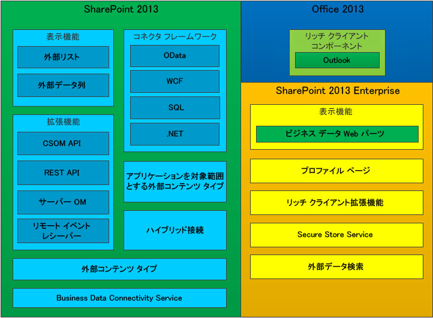

# SharePoint 2013 の Business Connectivity Services
Business Connectivity Services (BCS) の概要およびその機能と、SharePoint 2013での BCS アプリケーション開発に必要な情報を確認します。
SharePoint 2013は、さまざまな外部システムと連携する優れた生産性と共同作業ソリューションを作成するハブとして使用できます。Business Connectivity Services (BCS) は SharePoint 2013が外部システムから中央システムにデータを取り込むためのインフラストラクチャです。BCS には、外部システム データ ソースとその操作方法を記述する柔軟かつ拡張可能な手段があり、新しい SharePoint アドインおよび従来のビジネス システムを操作する中心的なインターフェイスとして SharePoint 2013を使用する説得力のある根拠となります。
  
    
    

## BCS の機能

BCS は、経験豊富なユーザー、開発者、ビジネス組織の IT 担当者が、次のような操作を簡単に実行できるメカニズムを提供します。
  
    
    

- 企業アプリケーション、Web サービス、SharePoint Server 2013とリッチ クライアント Office アプリケーションの OData サービスから外部データを公開する。
    
  
- Office タイプの動作 (連絡先、タスク、予定など) と機能を外部データとサービスに提供する。
    
  
- Office アプリケーションおよび SharePoint Server から基礎となる外部システム データおよびビジネス オブジェクトに書き戻す機能など、総合的なデータ操作を提供する。
    
  
- 外部データとプロセスのオフライン使用を有効にする。
    
  
- 構造化されていないドキュメントとユーザーの環境と、適切に構造化されているがロックされている外部システムのデータを統合する。
    
  

## BCS のコンポーネント

SharePoint 2013および Office 2013に含まれる機能を図 1 に示します。
  
    
    

**図 1: Business Connectivity Services の機能セット**

  
    
    

  
    
    

  
    
    

  
    
    

  
    
    

## BCS での外部コンテンツ タイプの使用

外部コンテンツ タイプは BCS の中心的な機能です。この機能を使用すると、顧客、注文などのビジネス エンティティのメタデータと動作を集中的に管理および再利用したり、ユーザーが効率的な方法でその外部データの操作や処理を実行できるようになります。
  
    
    
顧客などのビジネス エンティティを例に取ります。独自環境のデータベースからデータを取得して、そのデータを SharePoint で操作したり、外勤営業担当者が Outlook 2013を使用してオフラインでデータを取得したり、ユーザーが Microsoft Word で注文契約ドキュメントの顧客リストから顧客を選択したりできるようにするとします。こうした目的がある場合に、外部コンテンツ タイプを作成して、必要な場合に繰り返し使用できます。
  
    
    
BCS の外部コンテンツ タイプの使用方法の詳細については、「 [SharePoint 2013 の外部コンテンツ タイプ](external-content-types-in-sharepoint-2013.md)」を参照してください。
  
    
    

## BCS を使用したソリューションの開発

SharePoint 2013で BCS を使用し、さまざまなソリューションを作成できます。たとえば、元の機能をほとんどカスタマイズせずに使用する簡単なソリューションや、SharePoint 2013および Office 2013の機能のカスタマイズを要するやや高度なソリューション、複雑なシナリオや機能拡張されたリッチ アプリケーションを実現する高度なソリューションを作成できます。高度なソリューションには Visual Studio でのコード記述が必要です。高度なソリューションを作成する場合、完全なエンドツーエンド ソリューションにするか、再利用可能なコードベースのコンポーネントにするかを選択できます。
  
    
    
ビジネス ユーザーは BCS を使用して、Web ブラウザーや、Word、Excel などの Microsoft Office クライアント アプリケーションを使用して外部データを操作するさまざまなニーズに迅速かつ簡単に対応できます。BCS 機能を使用して、コードを記述することなく、Office クライアント アプリケーションや SharePoint サイトで、外部リスト、外部データ列、開発者が作成し IT 部門が承認した再利用可能な BCS コンポーネントなど、複合的なソリューションを作成できます。このようなソリューションを使用すると、ビジネス ユーザー (およびそのチーム) は、オフラインかオンラインかに関係なく SharePoint データと同じように外部データを簡単に操作したり、Office 2013で外部データを直接操作できます。
  
    
    
概要については、「 [SharePoint 2013 の BCS 開発環境のセットアップ](setting-up-a-development-environment-for-bcs-in-sharepoint-2013.md)」を参照してください。
  
    
    

## SharePoint 2013での Business Connectivity Services による OData の使用

Open Data Protocol (OData) は、HTTP、JavaScript Object Notation (JSON)、AtomPub などのテクノロジによってデータを Web に公開できるようにする Web プロトコルです。データ アクセスには特別に構成された URL が使用されます。このアーキテクチャにより、さまざまなテクノロジを使用してデータを操作できます。
  
    
    
詳細については、「 [SharePoint 2013 の Business Connectivity Services で OData ソースを使用する](using-odata-sources-with-business-connectivity-services-in-sharepoint-2013.md)」を参照してください。
  
    
    

## このセクションの内容

-  [SharePoint 2013 の Business Connectivity Services の新機能](what-s-new-in-business-connectivity-services-in-sharepoint-2013.md)
    
  
-  [SharePoint 2013 の Business Connectivity Services の概要](get-started-with-business-connectivity-services-in-sharepoint-2013.md)
    
  
-  [SharePoint 2013 の外部コンテンツ タイプ](external-content-types-in-sharepoint-2013.md)
    
  
-  [SharePoint 2013 の Business Connectivity Services で OData ソースを使用する](using-odata-sources-with-business-connectivity-services-in-sharepoint-2013.md)
    
  
-  [SharePoint 2013 の外部イベントおよびアラート](external-events-and-alerts-in-sharepoint-2013.md)
    
  
-  [アドイン スコープの外部コンテンツ タイプ (SharePoint 2013)](add-in-scoped-external-content-types-in-sharepoint-2013.md)
    
  
-  [SharePoint 2013 でクライアント オブジェクト モデルと外部データを使用する方法の概要](get-started-using-the-client-object-model-with-external-data-in-sharepoint-2013.md)
    
  
-  [SharePoint 2013 Business Connectivity Services プログラマー リファレンス](business-connectivity-services-programmers-reference-for-sharepoint-2013.md)
    
  

## その他の技術情報

-  [SharePoint 2013 機能の追加](add-sharepoint-2013-capabilities.md)
    
  
-  [SharePoint 2013 の BCS 開発環境のセットアップ](setting-up-a-development-environment-for-bcs-in-sharepoint-2013.md)
    
  
-  [SharePoint 2013 開発の概要](sharepoint-2013-development-overview.md)
    
  

