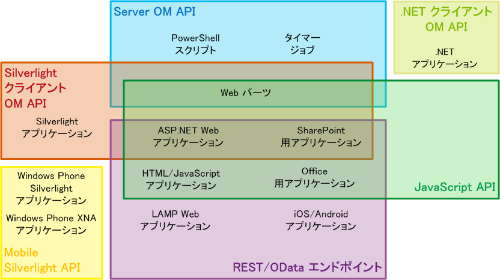
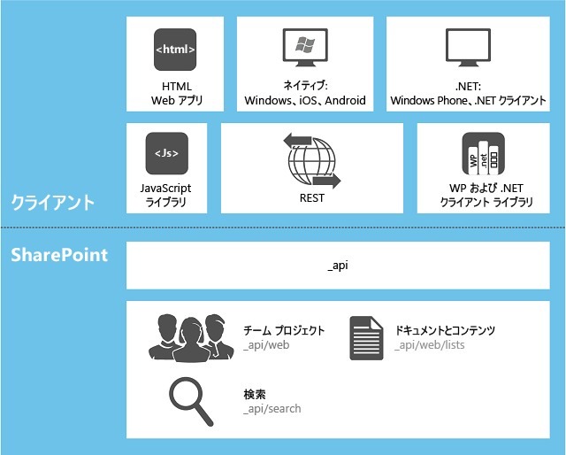

# SharePoint 2013 での適切な API セットの選択
SharePoint 2013で提供されるいくつかの API セットについて説明します。これには、サーバー側オブジェクト モデルや、さまざまなクライアント側オブジェクト モデル、REST/OData Web サービスなどが含まれます。
**ビデオを見る: SharePoint 2013 の SharePoint クライアント オブジェクト モデル (CSOM) および REST の戦略**

  
    
    

  
    
    

  
    
    

  
    
    

  
    
    

## どの API セットを使用するかを決める要素

SharePoint 2013 プラットフォームへアクセスするには、いくつもの API から選択できます。どの API を使用するかは、次の要素によって異なります。
  
    
    

- **アプリケーションの種類。**たとえば、次のものがありますが、相互に排他的なカテゴリではなく、これらに限定されません。SharePoint アドイン、SharePoint ページ上の Web パーツ、クライアント コンピューターまたはクライアント モバイル デバイスで実行される Silverlight アプリケーション、IFrame で SharePoint に表示されている ASP.NET アプリケーション、SharePoint サイト ページで実行される JavaScript、SharePoint アプリケーション ページ、クライアント コンピューターで実行される Microsoft .NET Framework アプリケーション、Windows PowerShell スクリプト、SharePoint サーバーで実行されるタイマー ジョブなどがあります。
    
  
- **ユーザーの既存のスキル。**SharePoint 2013でアプリケーションを作成するには、SharePoint のプログラミングに関する知識はそれほど必要ではありません。次のプログラミング モデルのいずれかに経験があれば、すぐに SharePoint 開発を開始できます。
    
  - JavaScript
    
  
  - ASP.NET
    
  
  - REST/OData
    
  
  - .NET Framework
    
  
  - Windows Phone
    
  
  - Silverlight
    
  
  - Windows PowerShell
    
  
- **コードが実行されるデバイス。**たとえば、SharePoint ファームのサーバー、クラウド上のサーバーのような外部のサーバー、クライアント コンピューター、モバイル デバイスなどがあります。
    
  
このトピックでは、SharePoint 2013 に用意されている各種 API セットの概要を説明します。図 1 は、13 の主な SharePoint 関連アプリケーションをそれぞれ開発するために使用できる API のセットを示します。多くのアプリケーションでは、使用する API を選択できます。
  
    
    

**図 1. 選択された SharePoint 拡張機能の種類と SharePoint の API セット**

  
    
    

  
    
    

  
    
    

  
    
    
次の表は、選択された主な SharePoint 拡張プロジェクトの一覧と使用する API のセットについてのガイダンスを提供します。このトピックの残りのセクションでは、各種 API のセットについて説明します。
  
    
    

|**開発の目標は...**|**使用する API は...**|
|:-----|:-----|
|SharePoint データに対して、または ASP.NET 外部コンテンツ タイプを使用して SharePoint で実行される外部データに対して、ファイアウォール経由で作成/読み取り/更新/削除 (CRUD) 操作を実行する、Microsoft Business Connectivity Services (BCS) Web アプリケーションを作成する    |JavaScript クライアント オブジェクト モデル    |
|SharePoint データに対して、または BCS 外部コンテンツ タイプを使用して SharePoint で実行される外部データに対して、SharePoint をファイアウォール経由で呼び出すことなく CRUD 操作を実行する、ASP.NET Web アプリケーションを作成する    |.NET Framework クライアント オブジェクト モデル、Silverlight クライアント オブジェクト モデル、または REST/OData エンドポイント    |
|BCS 外部コンテンツ タイプを使用して、SharePoint データまたは SharePoint で実行される外部データに対して CRUD 操作を実行する、LAMP Web アプリケーションを作成する    |REST/OData エンドポイント    |
|SharePoint データに対して CRUD 操作を実行する Windows Phone アプリケーションを作成する    |モバイル クライアント オブジェクト モデル    |
|Microsoft プッシュ通知サービスを使用して、モバイル デバイスに SharePoint のイベント発生を警告する、Windows Phone アプリケーションを作成する    |モバイル クライアント オブジェクト モデルおよびサーバー オブジェクト モデル    |
|SharePoint データに対して CRUD 操作を実行する iOS アプリまたは Android アプリを作成する    |REST/OData エンドポイント    |
|SharePoint データに対して CRUD 操作を実行する .NET Framework アプリケーションを作成する    |.NET Framework クライアント オブジェクト モデル    |
|SharePoint データに対して CRUD 操作を実行する Silverlight アプリケーションを作成する    |Silverlight クライアント オブジェクト モデル    |
|SharePoint データに対して CRUD 操作を実行する HTML/JavaScript アプリケーションを作成する    |JavaScript クライアント オブジェクト モデル    |
|SharePoint で機能する Office アドイン を作成する    |JavaScript クライアント オブジェクト モデル    |
|カスタム Windows PowerShell コマンドを作成する    |サーバー オブジェクト モデル    |
|タイマー ジョブを作成する    |サーバー オブジェクト モデル    |
|全体管理用の拡張機能を作成する    |サーバー オブジェクト モデル    |
|SharePoint ファーム全体に対して一貫したブランド化を行う    |サーバー オブジェクト モデル    |
|カスタム Web パーツ、アプリケーション ページ、または ASP.NET ユーザー コントロールを作成する    |サーバー オブジェクト モデル    > **重要**> お客様に提供する機能がサイト コレクションを超える範囲について SharePoint の管理向きでない場合は、サーバー オブジェクト モデルではなく、リモート SharePoint アドイン Web アプリケーションを含む ASP.NET と、必要に応じてカスタム Web パーツとユーザー コントロールを作成することをお勧めします。この表の最上部の 2 行を参照してください。           |
   

## サーバー オブジェクト モデル

最も多数の API のセットがマネージ クラスのサーバー オブジェクト モデルにあります。SharePoint Foundation 2013 のレベルでいうと、このオブジェクト モデルには、SharePoint Foundation の基本的なサイトやリスト構造のプログラム的な制御ができるクラスやメンバーが含まれます。これらのクラスの多くは、 [Microsoft.SharePoint](https://msdn.microsoft.com/library/Microsoft.SharePoint.aspx) 名前空間にあります。さらに、ワークフロー、アラート、Web パーツ、基本的な検索、Microsoft Business Connectivity Services (BCS)など、ほとんどすべての SharePoint Foundation コンポーネントはサーバー オブジェクト モデルを使用することで拡張できます。また、サーバー オブジェクト モデルには、SharePoint Foundation の管理やセキュリティ システムを拡張できる API のセットも含まれます。これらには、バックアップ、ファームの状態と診断、ログ、ファームと Web アプリケーションの管理、アップグレード、展開、キャッシュ、Windows PowerShell のカスタマイズなどがあります。
  
    
    
SharePoint Server 2013 のレベルでは、さらに多くのクラスが追加され、エンタープライズ コンテンツ管理 (ECM)、ユーザー プロファイル、分類、高度な検索、および SharePoint Server 2013 のその他の機能のプログラミングができるようになります。
  
    
    
 [LINQ to Objects](http://msdn.microsoft.com/ja-jp/library/bb397919.aspx) を使用すると、メモリにある **IEnumerable** コレクションを照会できます。ただし、 [LINQ to SharePoint プロバイダー](http://msdn.microsoft.com/library/3fa2dc5f-d308-4337-aefd-191a5df8dbbe%28Office.15%29.aspx)により、SharePoint コンテンツ データベースのリストを直接照会できます。厳密には、このプロバイダーはこのトピックで説明されているどの API セットにおいても利用できません。ただし、LINQ 構文を使用する方法はあります。
  
    
    
SharePoint 2013 がインストールされると、組み込みのサーバー側クラスを定義するアセンブリが、各サーバーのグローバル アセンブリ キャッシュにインストールされます。サーバー オブジェクト モデルに対してプログラミングを行うと、アセンブリは ファーム ソリューション としてグローバル アセンブリ キャッシュにインストールされます。
  
    
    

> **メモ**
> SharePoint アドインの開発をサポートすることで、SharePoint 2013 に対する新しい セキュリティで保護されたソリューション の開発は非推奨になりましたが、セキュリティで保護されたソリューション は引き続き SharePoint 2013のサイト コレクションにインストールできます。これらのソリューションのアセンブリは、サーバー上のフォルダーに一時的にインストールされているときなど、実際に使用されている場合を除いて、パッケージに残ります。詳細については、「 [サンドボックス ソリューション内のアセンブリが展開される場所](http://msdn.microsoft.com/library/dadbb20b-1bf7-442c-9eeb-bd9f01dbda45%28Office.15%29.aspx)」を参照してください。 
  
    
    

### サーバー オブジェクト モデルを使用する場合の制限事項

SharePoint アドイン のカスタム ロジックは、常にクライアントかクラウド (または SharePoint ファームの外部にあるサーバー) に配布されます。これらの配布モデルのすべてにおいて、クライアント オブジェクト モデルまたは REST/OData エンドポイントのどれかを使用する必要があります (SharePoint アドイン内のサーバー オブジェクト モデルは使用できません)。たとえば、アプリに SharePoint のホストされたページが含まれる場合は、これらのページから、JavaScript クライアント オブジェクト モデルを使用して SharePoint のデータにアクセスできます。このようなページでは、SharePoint 2013Silverlight クライアント オブジェクト モデルを使用している Silverlight アプリケーションを表示することもできます。SharePoint アドイン の詳細については、「 [SharePoint アドインのアーキテクチャおよび開発環境に関する重要な要素](http://msdn.microsoft.com/library/ae96572b-8f06-4fd3-854f-fc312f7f2d88%28Office.15%29.aspx)」を参照してください。
  
    
    

## マネージ コード用のクライアント オブジェクト モデル

SharePoint 2013には, .NET、Silverlight、モバイル というマネージ コード用の 3 つのクライアント オブジェクト モデルがあります。
  
    
    

### .NET クライアント オブジェクト モデル

.NET Framework 用の SharePoint 2013 オブジェクト モデルは、電話用でない Windows クライアント上で実行される .NET Framework アプリケーションで使用されます。次は、どれもそのようなクライアントです。
  
    
    

- ユーザーのコンピューター
    
  
- SharePoint 2013 ファームの外部にあるサーバー
    
  
- Microsoft Azure 上の Web ロールまたはワーカー ロール
    
  
サーバー オブジェクト モデルの主要なサイトやリストのほとんどすべてのクラスには, .NET Framework クライアント オブジェクト モデルに該当するクラスがあります。.NET Framework クライアント オブジェクト モデルでは、ECM、分類、ユーザー プロファイル、高度な検索、分析、BCS などの SharePoint Server 2013 の機能を拡張するための API のフル セットも公開されています。
  
    
    
パフォーマンスを向上するために, .NET Framework クライアント オブジェクト モデルに対して記述されたコード行は、バッチで SharePoint サーバーに送信され、そのバッチでサーバー側コードに変換されて実行されます。すると、クエリ結果やすべての変数の新しい状態がクライアントに返されます。開発者は、同期的または非同期的にバッチを実行するかを決めます。(同期的なバッチ実行では, .NET Framework アプリケーションがサーバーから返される結果を待って処理を続行します。非同期的なバッチ実行では、クライアント側の処理が直ちに続行され、クライアントのユーザー インターフェイス (UI) は応答可能な状態を維持します)。
  
    
    
クライアント コードで LINQ クエリ構文を使用すると、 **IEnumerable** を実装する SharePoint 2013 オブジェクトなどの **IEnumerable** オブジェクトを照会できます。ただし、これを行う場合、 [LINQ to SharePoint プロバイダー](http://msdn.microsoft.com/library/3fa2dc5f-d308-4337-aefd-191a5df8dbbe%28Office.15%29.aspx)ではなく  [LINQ to Objects](http://msdn.microsoft.com/ja-jp/library/bb397919.aspx) を使用していることになります。このため、前者のドキュメントはクライアント側コードにおいて必要ありません。
  
    
    
.NET Framework クライアント オブジェクト モデル用のアセンブリは、クライアント上にインストールする必要があります。これらのアセンブリは、再頒布可能パッケージに含まれていて、 [SharePoint クライアント コンポーネント](http://www.microsoft.com/ja-jp/download/details.aspx?id=35585)で入手可能です。
  
    
    
.NET Framework オブジェクト モデルの使用例については、「 [SharePoint 2013 のクライアント ライブラリ コードを使用して基本的な操作を完了する](http://msdn.microsoft.com/library/5a69c9e3-73bf-4ed5-bc19-182056bdb394%28Office.15%29.aspx)」を参照してください。
  
    
    

> **メモ**
> また, .NET Framework アプリケーションで SharePoint REST/OData エンドポイントを使用することもできます。.NET Framework クライアント オブジェクト モデルと SharePoint REST/OData エンドポイントとの比較については、後述の「 [REST/OData エンドポイント](#RESTOData)」を参照してください。 
  
    
    

### Silverlight クライアント オブジェクト モデル

Silverlight 用の SharePoint 2013 オブジェクト モデルは、コンパイルされた .xap ファイルが保存される場所にかかわらず、Silverlight アプリケーションで使用されます。その場所は、SharePoint 2013 Web サイト上のアセット ライブラリ内、クライアント コンピューター上、クラウドのストレージ内、外部サーバー上などの可能性があります。一般的に、Silverlight アプリケーションは  [SilverlightWebPart](https://msdn.microsoft.com/library/Microsoft.SharePoint.WebPartPages.SilverlightWebPart.aspx) オブジェクトの SharePoint 2013 で表示されます。SharePoint 2013 での Silverlight クライアント オブジェクト モデルは, .NET Framework クライアント オブジェクト モデルとほぼ同じで、同じ拡張領域をサポートします。大きく異なるのは、Silverlight バージョンでは、アプリケーションの UI がアクティブな状態を維持できるように、コマンドのバッチはすべて、サーバーに非同期的に送信されるということです。
  
    
    
Silverlight クライアント オブジェクト モデル用のアセンブリは、どの SharePoint 2013 サーバーでも %ProgramFiles%\\Common Files\\Microsoft Shared\\web server extensions\\15\\TEMPLATE\\LAYOUTS\\ClientBin で保持されます。これらのアセンブリは、Silverlight アプリケーションが実行されるコンピューターにインストールする必要はありません (インストールする選択肢はあります)。また、これらをアプリケーションの .xap ファイルにパッケージ化することもできます。
  
    
    
Silverlight の .xap ファイルは、SharePoint がホストされたアプリを含む SharePoint アドインに含まれます。前者の場合, .xap ファイルはアプリ Web 上のライブラリに展開されます (アプリ Web の詳細については、「 [SharePoint 2013 のホスト Web、アドイン Web、および SharePoint コンポーネント](http://msdn.microsoft.com/library/b791cdf5-8aa2-47fa-bc4c-aee437354759%28Office.15%29.aspx)」を参照)。カスタム サーバー側コードは SharePoint アドインでは使用できないため、Silverlight アプリケーションは、アプリにカスタム SharePoint コードを追加するための有用な方法になります。また、Silverlight の開発者は、既存のスキルを使用し、あまり学習に時間をかけずに SharePoint 2013 アプリケーションを作成できます。
  
    
    

> **メモ**
> また、Silverlight アプリケーションで SharePoint REST/OData エンドポイントを使用することもできます。Silverlight クライアント オブジェクト モデルと SharePoint REST/OData エンドポイントとの比較については、後述の「 [REST/OData エンドポイント](#RESTOData)」を参照してください。 
  
    
    

### モバイル オブジェクト モデル

Windows Phone 対応の端末では、Silverlight クライアント オブジェクト モデルの特別バージョンが利用できます。これには、電話にだけ関係のある追加の API が含まれます。たとえば、電話アプリが Microsoft プッシュ通知サービス からの通知を登録するための API などがあります。この特別バージョンは、すべての主要な SharePoint 2013 機能をサポートしますが、他の 2 つのマネージ コード用のクライアント オブジェクト モデルがサポートしている主要でない拡張領域はサポートしません。これらの主要でない拡張領域にアクセスするには、モバイル アプリケーション内で SharePoint REST/OData エンドポイントを使用します。後述の「 [REST/OData エンドポイント](#RESTOData)」を参照してください。
  
    
    
モバイル オブジェクト モデル用のアセンブリは、どの SharePoint 2013 サーバーでも %ProgramFiles%\\Common Files\\Microsoft Shared\\web server extensions\\15\\TEMPLATE\\LAYOUTS\\ClientBin で保持されます。これらのアセンブリは、Windows Phone アプリケーションの .xap ファイルにパッケージ化します。
  
    
    

## JavaScript オブジェクト モデル

SharePoint 2013 は、インライン スクリプトや別途作成した .js ファイルで使用するための JavaScript オブジェクト モデルを提供します。このモデルには, .NET Framework クライアント オブジェクト モデルや Silverlight クライアント オブジェクト モデルと同じ機能がすべて含まれます。カスタム サーバー側コードは SharePoint アドインでは使用できないため、JavaScript オブジェクト モデルは、Silverlight クライアント オブジェクト モデルのように、アプリにカスタム SharePoint コードを追加するための有用な方法になります。また、Web 開発者は、既存の JavaScript のスキルを使用し、あまり学習に時間をかけずに SharePoint アプリケーションを作成できます。
  
    
    
マネージ コード クライアント オブジェクト モデルと同様に、SharePoint 2013 用の JavaScript インフラストラクチャは、バッチでファーム サーバーとやり取りします。これらのバッチは、常に非同期的に実行されます。さらに、JavaScript を使ってドメインを超えて SharePoint のデータにアクセスできます (ただし、同じ親サイト コレクション内のデータのみに限ります)。これは以前のバージョンの SharePoint では実現できなかったことです。詳細については、「 [クロスドメイン ライブラリを使用してアドインから SharePoint 2013 のデータにアクセスする](http://msdn.microsoft.com/library/bc37ff5c-1285-40af-98ae-01286696242d%28Office.15%29.aspx)」を参照してください。データは、JavaScript Object Notation (JSON) でサーバーから返されます。
  
    
    
JavaScript オブジェクト モデルは、各サーバーの %ProgramFiles%\\Common Files\\Microsoft Shared\\web server extensions\\15\\TEMPLATE\\LAYOUTS にある一連の *.js ファイルで定義されています。
  
    
    
.NET Framework オブジェクト モデルの使用例については、「 [SharePoint 2013 の JavaScript ライブラリ コードを使用して基本的な操作を完了する](http://msdn.microsoft.com/library/29089af8-dbc0-49b7-a1a0-9e311f49c826%28Office.15%29.aspx)」を参照してください。
  
    
    

> **メモ**
> また、JavaScript アプリケーションで SharePoint REST/OData エンドポイントを使用することもできます。JavaScript クライアント オブジェクト モデルと SharePoint REST/OData エンドポイントとの比較については、次の「 [REST/OData エンドポイント](#RESTOData)」を参照してください。 
  
    
    

## REST/OData エンドポイント

JavaScript を使用せず, .NET Framework や Silverlight のプラットフォーム上に構築されていないクライアント環境から SharePoint エンティティにアクセスする必要があるシナリオでは、SharePoint 2013 は、 [OData プロトコル](http://www.odata.org/)を使用して SharePoint リスト データに対して CRUD 操作を実行する Representational State Transfer (REST) Web サービスの実装を提供します。さらに、クライアント オブジェクト モデルのほとんどすべての API には、対応する REST エンドポイントがあります。これにより、ユーザーのコードは、標準の HTTP 要求と応答をサポートする技術を使用することで SharePoint 成果物と直接やり取りできます。SharePoint 2013 に組み込まれている REST 機能を使用するには、目的のクライアント オブジェクト モデルの API に対応するエンドポイントに対しての REST 対応の HTTP 要求をコードに記述して作成します。client.svc Web サービスは HTTP 要求を処理し、Atom 形式か JSON 形式で応答をします。
  
    
    
REST/OData Web サービスの使用の詳細については、「 [SharePoint 2013 REST サービスを使用したプログラミング](use-odata-query-operations-in-sharepoint-rest-requests.md)」を参照してください。コード例について「 [SharePoint 2013 REST エンドポイントを使用して基本的な操作を完了する](http://msdn.microsoft.com/library/e3000415-50a0-426e-b304-b7de18f2f7d9%28Office.15%29.aspx)」のトピックを参照してください。
  
    
    

### REST/OData プログラミングとクライアント オブジェクト モデル プログラミングとの比較

状況によっては、特に、Windows 開発経験のない開発者の方は、SharePoint オブジェクト モデルが提供されているアプリケーションであっても、REST エンドポイントを使用した方がいい場合があります。以下に、Windows プラットフォーム上または JavaScript をサポートするプラットフォーム上で動作するアプリケーションを作成する開発者のために、この 2 つのプログラミング手法における主な機能の比較表を示します。
  
    
    

|**機能**|**.NET Framework または Silverlight オブジェクト モデル**|**JavaScript オブジェクト モデル**|**Windows プラットフォームまたは JavaScript から呼び出される REST/OData エンドポイント**|
|:-----|:-----|:-----|:-----|
|オブジェクト指向プログラミング    |はい    |はい    |いいえ    |
|バッチ処理    |はい    |はい    |はい    |
|条件処理および例外処理用の API    |はい    |いいえ    |いいえ    |
|LINQ 構文の使用    |はい    |いいえ    |いいえ    |
|異なる SharePoint Web アプリケーションからのリスト データの結合    |はい    |いいえ    |はい    |
|経験豊富な REST/OData 開発者にとっての習得のしやすさ    |いいえ    |いいえ    |はい    |
|Windows 以外のプログラミングまたは JavaScript プログラミングに対する類似性    |いいえ    |はい    |はい    |
|リスト アイテム フィールドの厳密な型指定    |いいえ ( LINQ と共に使用する場合を除く)    |いいえ    |はい (Windows プラットフォームの場合)          いいえ (JavaScript の場合)    |
|jQuery、Knockout、およびその他の JavaScript ライブラリの利用    |いいえ    |はい    |いいえ (Windows プラットフォームの場合)          はい (JavaScript の場合)    |
   

## WCF Data Services フレームワーク

.NET Framework クライアント アプリケーションおよび Silverlight クライアント アプリケーションで LINQ 構文を使用する場合、SharePoint 2013 は、LINQ プロバイダーとして  [WCF Data Services](http://msdn.microsoft.com/ja-jp/library/cc668792.aspx) をサポートします。ユーザーは、SharePoint Foundation の以前のバージョンでのように listdata.svc (リスト データのみ) を対象にできます。また、リスト データだけでなく OData インターフェイスのすべての SharaPoint エンティティへのアクセスをサポートする同じ client.svc も対象にできます。詳細については、「 [ADO.NET Data Services を使用して SharePoint Foundation のクエリを実行する](http://msdn.microsoft.com/library/3e3e16f7-620a-4710-a3f3-19d0236f4b4a%28Office.15%29.aspx)」を参照してください。
  
    
    
図 1 は、さまざまなクライアント API、さまざまな種類のクライアント アプリケーション、および SharePoint の関係を表しています。各種 _api* URL は、REST エンドポイントのファーム関連の URL です。詳細については、「 [SharePoint 15 REST サービスの詳細](get-to-know-the-sharepoint-2013-rest-service.md#bk_learnmore)」のトピックを参照してください。
  
    
    

**図 2. SharePoint でのクライアント アプリケーションと API**

  
    
    

  
    
    

  
    
    

  
    
    

  
    
    

## 非推奨の API セット

下位互換性を保つために SharePoint 2013 フレームワークでサポートされている API セットが 2 つありますが、これらの API セットは新規のプロジェクトに使用しないことをお勧めします。該当の API は、 [ASP.NET (asmx) Web サービス](http://msdn.microsoft.com/library/c587ee90-1f88-43f3-b1a7-5f3072d038f8%28Office.15%29.aspx)および  [owssvr.dll ファイルへの直接リモート プロシージャ コール (RPC)](http://msdn.microsoft.com/library/4aa5c82b-90fb-4be5-b30c-d35ecae42a81%28Office.15%29.aspx) です。
  
    
    

## その他の技術情報

-  [SharePoint 2013 開発の概要](sharepoint-2013-development-overview.md)
    
  
-  [SharePoint 2013 でのプログラミング モデル](programming-models-in-sharepoint-2013.md)
    
  
-  [SharePoint アドインと SharePoint ソリューションの比較](sharepoint-add-ins-compared-with-sharepoint-solutions.md)
    
  
-  [SharePoint 2013 REST サービスを使用したプログラミング](use-odata-query-operations-in-sharepoint-rest-requests.md)
    
  
-  [SharePoint 2013 REST エンドポイントを使用して基本的な操作を完了する](http://msdn.microsoft.com/library/e3000415-50a0-426e-b304-b7de18f2f7d9%28Office.15%29.aspx)
    
  
-  [SharePoint 2013 のクライアント ライブラリ コードを使用して基本的な操作を完了する](http://msdn.microsoft.com/library/5a69c9e3-73bf-4ed5-bc19-182056bdb394%28Office.15%29.aspx)
    
  
-  [SharePoint 2013 の JavaScript ライブラリ コードを使用して基本的な操作を完了する](http://msdn.microsoft.com/library/29089af8-dbc0-49b7-a1a0-9e311f49c826%28Office.15%29.aspx)
    
  
-  [ADO.NET Data Services を使用して SharePoint Foundation のクエリを実行する](http://msdn.microsoft.com/library/3e3e16f7-620a-4710-a3f3-19d0236f4b4a%28Office.15%29.aspx)
    
  

  
    
    
