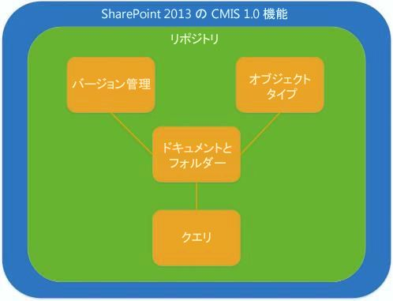
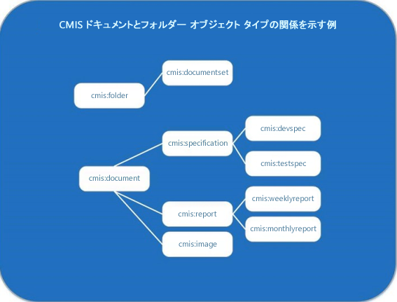

# SharePoint 2013 の Content Management Interoperability Service (CMIS)
SharePoint 2013 の OASIS Content Management Interoperability Services (CMIS) 規格のバージョン 1.0 の実装について説明します。
## SharePoint 2013 の CMIS の概要

SharePoint Server の  [OASIS Content Management Interoperability Services (CMIS) 規格](https://www.oasis-open.org/committees/tc_home.php?wg_abbrev=cmis) のバージョン 1.0 への準拠によって、SharePoint Server コンテンツ リポジトリとその他のエンタープライズ コンテンツ管理 (ECM) リポジトリ間の統合が可能になります。CMIS により、エンタープライズ内のドキュメント システム、パブリッシャー、レポジトリ間および会社間で、すべてベンダーに依存しない形式で、インターネット プロトコルを介して情報を共有できます。CMIS 規格は、作成、読み取り、更新、削除、チェックイン、チェックアウトなどの基本的なドキュメント管理操作をサポートします。規格はドキュメントのバージョンとそれらのメタデータの管理をサポートします。CMIS は、 **Content Management Interoperability Services (CMIS) プロデューサー**機能を [ **サイトの設定**] の [ **サイト機能の管理**] セクションでアクティブにした後に、社内の SharePoint 2013 サイトで使用できます。SharePoint 2013 では、SharePoint CMIS プロデューサーを使用できますが、既定ではすべての社内サイトでオフにされています。
  
    
    
CMIS は、それをサポートする API 間で相互運用性を提供しますが、ネイティブ API に置き換わるものではありません。CMIS がサポートするオブジェクトは、ドキュメントやフォルダーなど、SharePoint Server 開発者が一般的に操作するオブジェクトと重なっています。ただし、CMIS をサポートするアプリケーションを作成する開発者は、カスタム SharePoint Server コードを引き続き書く必要がある可能性があります。CMIS により、それを実装するソリューションの開発時間を 60 ～ 70 パーセント短縮できます。開発ツールボックスの他のツールでもこれを考慮してください。
  
    
    

## SharePoint 2013 の CMIS 実装の詳細

CMIS 仕様の一部は必須ですが、その他の多くの部分はオプションです。Microsoft などの多くのベンダーは、規格の必須部分およびそのオプションのコンポーネントの一部を実装しています。図 1 に SharePoint 2013 に実装されている CMIS 1.0 仕様に指定された機能を示します。
  
    
    
図 1. SharePoint 2013 に実装された CMIS 1.0 の機能
  
    
    

  
    
    

  
    
    
CMIS データ モデルは、オブジェクト型、バージョン管理、ドキュメントおよびフォルダー、およびクエリ機能など、その他の CMIS データ型を格納するリポジトリを定義します。
  
    
    

### CMIS リポジトリおよび SharePoint ドキュメント ライブラリ

CMIS リポジトリは、CMIS データ モデルの残りのコンテナーです。SharePoint 2013 では、ドキュメント ライブラリは CMIS リポジトリと同等です (SharePoint 2013 CMIS プロデューサーではリストはサポートされていません)。リポジトリにアクセスすることは通常、クライアント アプリケーションの起動ポイントになります。たとえば、CMIS のリポジトリと同等の複数のドキュメント ライブラリを格納する SharePoint Server サイトを考えてみます。CMIS 仕様では、必須サービス **getRepositories** について、SharePoint Serverでは現在の [SPWeb](https://msdn.microsoft.com/library/Microsoft.SharePoint.SPWeb.aspx) オブジェクトで有効なすべてのリポジトリ (ドキュメント ライブラリ) を取得すると説明しています。開発者は、 **getRepositories** サービスまたは **getRepositoryInfo** サービスを呼び出して、リポジトリに接続できます。 **getRepositoryInfo** は開発者によって指定されたリポジトリを取得します。
  
    
    
CMIS リポジトリには、CMIS によって指定されたドキュメントやフォルダ オブジェクトの種類、CMIS バージョン管理機能 (SharePoint Server のネイティブ バージョン管理機能によく似ている)、および SQL に似た構文で CMIS リポジトリの特定のデータをクエリする CMIS クエリ機能など、SharePoint Server がサポートするその他の CMIS 機能が含まれています。
  
    
    

### CMIS ドキュメント、フォルダー、およびその他のオブジェクトの種類

CMIS は、SharePoint Server のコンテンツ タイプ (具体的には  [SPContentType](https://msdn.microsoft.com/library/Microsoft.SharePoint.SPContentType.aspx) クラス) のアイデアと等しいオブジェクトの種類機能を定義しています。読み取り専用の各 CMIS オブジェクトの種類は、属性とプロパティの定義から構成されます。属性はオブジェクトがクエリ可能か、またはバージョン管理可能か、などを定義します。CMIS は、該当すれば、SharePoint 2013 の同等のオブジェクトの種類に関連付けられたプロパティのプロパティ定義をサポートします。たとえば、CMIS のドキュメント オブジェクトまたはフォルダー オブジェクトには、 **LastModifiedBy** プロパティがある場合があります。これは、 `cmis:LastModifiedBy` の構文を使用します。 **Document** オブジェクトに関連付けられた **Author** プロパティは `cmis:Author` と書かれます。CMIS 規格は、基本の種類として機能する 4 つのオブジェクトの種類を定義しています。表 1 に、CMIS オブジェクトの種類、それらが SharePoint 2013 でサポートされているかどうか、SharePoint の同等の機能 (ある場合) を説明しています。
  
    
    

  
    
    

**表 1. CMIS オブジェクトの種類の値と SharePoint 2013 の同等の機能**

|**CMIS オブジェクトの種類**|**SharePoint Server でサポートされているか**|**SharePoint 2013 の同等の機能**|**説明**|
|:-----|:-----|:-----|:-----|
|ドキュメント    |はい    |**Document** オブジェクト   |CMIS ドキュメント オブジェクトの種類は、SharePoint Server の **Document** オブジェクトに直接マッピングされます。   ドキュメントには、プロパティとプロパティに関連付けられたコンテンツ ストリームがあり、バージョン管理可能で、基本的な作成、読み取り、更新、削除 (CRUD) 操作をサポートします。    |
|フォルダー    |はい    | [SPFolder](https://msdn.microsoft.com/library/Microsoft.SharePoint.SPFolder.aspx) オブジェクト   |CMIS フォルダー オブジェクトの種類は、SharePoint Server の **SPFolder** オブジェクトに直接マッピングされます。   フォルダーにはドキュメントおよびその他のフォルダーを格納することができ、単一の親フォルダーを持つ必要があります。フォルダーにはプロパティが割り当てられており、ドキュメント オブジェクトがサポートする同じ CRUD 操作をサポートします。    CMIS フォルダーはバージョン管理できません。    |
|ポリシー    |いいえ    |なし    |CMIS ポリシー オブジェクトの種類は、SharePoint のポリシーの概念、または SharePoint オブジェクト モデルに定義されているどのポリシー オブジェクトとも異なります。    |
|関係    |いいえ    |なし    |サポートされません。    |
   

  
    
    
CMIS は、オブジェクトの種類を作成、変更、削除するためのメソッドを提供しません。SharePoint Server ドキュメント オブジェクトの種類またはフォルダー オブジェクトの種類を作成、変更、または削除する開発者は、独自の SharePoint Server オブジェクト モデルを使用して実行できます。
  
    
    
図 2 に、CMIS ドキュメント オブジェクトの種類とフォルダー オブジェクトの種類の間に存在する可能性のある関係の例を示します。この図では、SharePoint Server ドキュメント管理シナリオで見られるようなラベルを使用しています。たとえば、 **cmis:folder** という CMIS オブジェクトの種類は、 **cmis:documentset** というオブジェクトの種類の親です。 **cmis:documentset** には、 [DocumentSet](https://msdn.microsoft.com/library/Microsoft.Office.DocumentManagement.DocumentSets.DocumentSet.aspx) オブジェクトにまとめられたドキュメント オブジェクトを含めることができますが、必須ではありません。
  
    
    
CMIS ドキュメント オブジェクトの種類は、親/子関係もサポートします。たとえば、ここでは、 **cmis:document** オブジェクトの種類が **cmis:specification**、 **cmis:report**、および **cmis:image** ドキュメント オブジェクトの種類の親になっています。これらのドキュメントは SharePoint Server ドキュメント セットにまとめることができますが、CMIS ではそのような構造を定義していません。代わりに、CMIS は個々のオブジェクトを、ドキュメント オブジェクトの種類またはフォルダー オブジェクトの種類として、またはそれらの 2 つのオブジェクトの種類のいずれかのサブセットとして認識します。
  
    
    
図 2. CMIS ドキュメント オブジェクトの種類とフォルダー オブジェクトの種類の例
  
    
    

  
    
    

  
    
    

  
    
    

  
    
    

### SharePoint 2013 の CMIS クエリ

クエリは SharePoint Server がサポートする CMIS 仕様のオプションの部分です。CMIS クエリは、簡略化された SQL に似た構文を使用します。CMIS のすべてのクエリは、1 つのリポジトリにスコープ設定されるため、すべてのクエリ結果が、単一のリポジトリから、クエリのスコープ設定されたリポジトリに返されます。複数のリポジトリに対して複数のクエリを実行すると、実行されるクエリごとに、1 つのリポジトリから結果が返されますが、複数のリポジトリから結果が返されるのと同じです。表 2 に、基本的な CMIS クエリ ステートメントを示します。
  
    
    

  
    
    

**表 2. CMIS クエリ構文の例**

|**CMIS クエリ ステートメント**|**説明**|
|:-----|:-----|
| `SELECT * FROM cmis:document`   |リポジトリ内のすべてのドキュメントを選択します。    |
| `SELECT cmis:name, cmis:author FROM cmis:document WHERE cmis:author='Tina Makovec'`   |作成者が Tina Makovec に等しいリポジトリ内のドキュメントの名前と作成者を選択します。    |
| `SELECT * FROM cmis:document WHERE CONTAINS('4Q13')`   |これは、CONTAINS を使用した全文検索の例です。このクエリは語 4Q13 を含むリポジトリ内のドキュメントを返します。   |
   

  
    
    
SharePoint Server は結合をサポートしませんが、CMIS 1.0 仕様ではサポートします。SharePoint CMIS 以外のリポジトリは、CMIS クエリの実装で結合をサポートできます。CMIS クエリをサポートするすべてのリポジトリは、並べ替え、返すプロパティの選択、およびページングをサポートします。
  
    
    

### CMIS のバージョン管理と SharePoint のバージョン管理

CMIS のバージョン管理は SharePoint Server のドキュメントのバージョン管理と同じです。メジャーおよびマイナー バージョン管理とチェックインおよびチェックアウト操作は、CMIS でドキュメントに対してのみサポートされています。
  
    
    
フォルダーはバージョン管理できません。
  
    
    

### CMIS 変更ログのサポート

CMIS は変更ログの概念を規定しています。CMIS 変更ログは、オブジェクト ID とプロパティに関連付けられた基本的な作成、更新、および削除イベントをサポートします。作成、更新、または削除イベントが発生すると、プロパティがトリガーされます。変更ログはページングをサポートするため、開発者は独自の変更ログを任意の場所に保存できます。
  
    
    

## SharePoint 2013 の認証と CMIS

既定で、SharePoint Server は匿名認証、基本認証、NTLM 認証、ダイジェスト認証、Kerberos プロトコル トランジション/制約付き委任、Windows クレーム、クレーム マルチ認証、クレーム混合モードの認証をサポートしています。
  
    
    
Inbound OAuth はサポートしていません。
  
    
    

## SharePoint 2013 の CMIS プロデューサー

CMIS プロデューサーは、社内展開用に SharePoint Server で既定で使用できます。プロデューサーは CMIS 準拠のコンシューマー Web サービスが相互運用可能な CMIS 準拠のエンドポイントを作成します。CMIS のサポートおよび CMIS プロデューサー機能は、CMIS プロデューサー機能がアクティブにされているすべての社内 SharePoint Server 実装で使用できます。CMIS は SharePoint Online ではサポートされていません。
  
    
    

## CMIS のシナリオとアプリケーションのアイデア

SharePoint 2013 の CMIS 機能を使用して、開発者は SharePoint Serverとその他の CMIS 準拠のアプリケーションの両方からの CMIS 準拠のデータを組み込んだアプリケーションを作成できます。CMIS はベンダーに依存しない形式であるため、開発者はネイティブ アプリケーションの API に対するコードを書くことなく、CMIS 準拠のコンシューマー アプリケーションと共有可能な CMIS 準拠のエンドポイントを生成するコードを書くことができます。たとえば、既定の SharePoint 2013 CMIS プロデューサーは別のベンダーの写真編集アプリケーションと CMIS リポジトリ (たとえば、SharePoint Server ドキュメント ライブラリ) を共有できます。ユーザーは写真編集アプリケーション プロデューサーの CMIS リポジトリに保存されているイメージ ファイルを開いて、写真編集アプリケーション内から SharePoint Server にそれをチェックアウトできます。ユーザーは、変更を適用して保存した後に、写真編集アプリケーションから、最新のバージョンを SharePoint Server ドキュメント ライブラリにチェックインできます。CMIS 仕様では、SharePoint と同じように、メジャーおよびマイナー バージョンの観点でバージョン管理を定義しているため、写真編集アプリケーションのユーザーは SharePoint Server に見られるロジックと同じバージョン管理ロジックを使用して、CMIS リポジトリにバージョンへの変更を保存します。
  
    
    
アプリの作成時は、すべてのパラメーターを初期化する辞書を実装するコードを考慮してください。パラメーターはリポジトリの認証に使用され、使用中のバインディング (たとえば、REST、AtomPub、SOAP)、サーバーが REST エンドポイントにアクセスするための URL、ユーザー名、パスワード、および認証プロバイダー クラス (たとえば、基本認証) などのデータを指定します。パラメーターが設定されたら、開発者は **getRepositories** 呼び出しを使用して、各リポジトリに接続できます。
  
    
    
CMIS は、複数の CMIS プロデューサーからのデータを使用する幅広いアプリケーションの開発をサポートします。CMIS は、以下のような、企業のリッチでハイブリッドな環境の複数のコンテンツ管理システム間でコンテンツを管理する場合によく見られるシナリオをサポートするように設計されています。 
  
    
    

- 企業のコンテンツ管理システム間のデータ移行。
    
  
- 複数のコンテンツ リポジトリからのデータを読み取るアプリのグラフィカル ユーザー インターフェイス (GUI)。
    
  
- CMIS を使用して、企業内の複数のレガシ コンテンツ管理システムから個人データをまとめる SharePoint Web パーツ。
    
  
- 任意の ECM システムからのドキュメントにアクセスできるモバイル アプリケーション。
    
  
- ファイルをチェックインおよびチェックアウトする機能など、ECM 機能を有効にした CMIS リポジトリにファイルを保存する写真編集アプリケーション。
    
  
- レポート データを ECM リポジトリにエクスポートする基幹業務 (LOB) システム。
    
  
- SharePoint ユーザー インターフェイス (UI) 要素を使用して、複数の異なるシステムに契約を発行することができると同時に、中央の承認プロセスを管理できる契約承認アプリ。
    
  

### 例: Contoso Finances アプリ

複数の CMIS データ プロバイダーからのデータを使用する SharePoint Server Web パーツをアプリとして考えます (Contoso Finances アプリ)。Contoso Finances アプリは IBM サーバー、SharePoint Server を実行するサーバー、社内 Contoso サーバーの 3 台のサーバー間で分散された財務データを収集し、表にします。SharePoint Server アプリは、Web パーツを使用して、3 つすべてのデータ ソースからのデータを任意の SharePoint Server ページ内に表示します。このアプリでは、CMIS リポジトリ (SharePoint Server ドキュメント ライブラリ) の実装に固有のカスタム コードは必要ありません。
  
    
    

## CMIS および SharePoint オブジェクト モデル

SharePoint オブジェクト モデルは、開発者に、オブジェクトの種類の管理、サイトまたはリポジトリ列の管理、SharePointbに固有のキーワードおよび構文を使用するクエリ、ソーシャル タグ、およびアクセス制御エントリ (ACE) 用の API など、CMIS でサポートされていない多くの機能拡張オプションを提供します。 
  
    
    
CMIS の SharePoint Server 実装は、 [BlockedFileExtensions](https://msdn.microsoft.com/library/Microsoft.SharePoint.Administration.SPWebApplication.BlockedFileExtensions.aspx) プロパティを使用して、Web アプリケーションでサイトにアップロードまたはダウンロードできないファイル拡張子のリストを取得します。CMIS は [SharePoint が既定でブロックするファイルの種類](http://technet.microsoft.com/ja-jp/library/cc262496.aspx)を考慮します。
  
    
    
開発者は任意の言語で CMIS クライアントを書くことができます。たとえば、SharePoint 開発者は, .NET クライアント側オブジェクト モデル (CSOM) または JavaScript オブジェクト モデル (JSOM) を使用して、クライアントを作成できます。さらに、サーバー側コードを使用して、Microsoft Azure で自動ホストされるか、インターネット インフォメーション サービス (IIS) や Microsoft Azure など、任意のサーバーでプロバイダーによってホストされる SharePoint アプリケーションを開発することもできます。
  
    
    

## オープン ソース CMIS 実装による検索と相互運用

多くのオープン ソース プロジェクトが存在し、CMIS 1.0 規格の SharePoint 2013 の実装でテストできます。例として、 [Apache Chemistry プロジェクト](http://chemistry.apache.org)、 [Open CMIS プロジェクト](http://chemistry.apache.org/java/opencmis.mdl) (クライアントとサーバーの両方の CMIS 実装を Java でテスト)、 [DotCMIS](http://chemistry.apache.org/dotnet/dotcmis.mdl) プロジェクト (.NET クライアント用)、 [Python 用 CMIS クライアント ライブラリ cmislib](http://code.google.com/p/cmislib/)プロジェクト、および  [PHP 用 CMIS クライアント ライブラリ phpclient](http://chemistry.apache.org/php/phpclient.mdl) があります。
  
    
    
 [CMIS Workbench](http://chemistry.apache.org/java/developing/tools/dev-tools-workbench.mdl) は、CMIS リポジトリの参照および Open CMIS の CMIS 開発プロジェクトの対話によるテストをサポートする開発者向けの CMIS デスクトップ クライアント アプリケーションです。この Workbench はシステム プロパティによって構成可能です。開発者は、エキスパート ログイン ダイアログ ボックスを使用して、追加のプロパティを設定できます。
  
    
    

## CMIS 1.1 の機能

CMIS 1.1 は SharePoint 2013 でサポートされていませんが、CMIS 仕様の新しいバージョンには、認識しておくべき新しい機能がいくつか含まれています。次の注目すべき機能があります。
  
    
    

- **Type mutability**: コンテンツ タイプを作成し、変更する機能。
    
  
- **Repository features**: **getRepositoryInfo** サービスを拡張して、サポートする規格に機能拡張のリストを公開する機能。
    
  
- **Retention and hold**: 一定の期間または永久に、ドキュメントが削除されないように要求するサービス。
    
  
- **Browser binding**: Web ブラウザーで実行するアプリケーションをサポートするように明示的に設計された新しいオプションのバインディング。このバインディングは XML の代わりに JSON を使用し、常に HTTP GET コマンドおよび POST コマンドを使用します。
    
  
- **Secondary object types**: CMIS オブジェクトに動的に追加および削除できるプロパティの名前付きセット。
    
  
- **cmis:item type**: CMIS モデルのドキュメント、フォルダー、または関係オブジェクトの種類の定義に収まらないオブジェクトの種類を CMIS を介して公開する必要があるレポジトリの新しいトップレベル データ モデルの種類。
    
  
- **Bulk update properties**: 1 回のサービス呼び出し内で、一連のオブジェクトのプロパティの一括更新をサポートするメソッド。
    
  
- **Append to a stream**: コンテンツ ストリームへの付加のサポート。この機能により、クライアントはきわめて大きなドキュメント コンテンツのアップロードを多数の小さな呼び出しに分割できます。
    
  

## その他の技術情報

-  [SharePoint 2013 機能の追加](add-sharepoint-2013-capabilities.md)
    
  
-  [ブロックするファイルの種類を管理する](http://technet.microsoft.com/ja-jp/library/cc262496.aspx)
    
  
-  [OASIS Content Management Interoperability Specification (CMIS) バージョン 1.0](http://docs.oasis-open.org/cmis/CMIS/v1.0/os/cmis-spec-v1.0.mdl)
    
  
-  [OASIS Content Management Interoperability Specification (CMIS) バージョン 1.1](http://docs.oasis-open.org/cmis/CMIS/v1.1/cs01/CMIS-v1.1-cs01.mdl) (SharePoint 2013 ではサポートされません)
    
  

  
    
    

