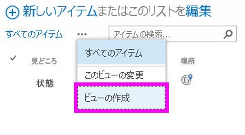
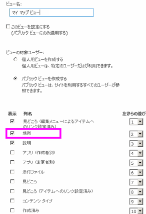
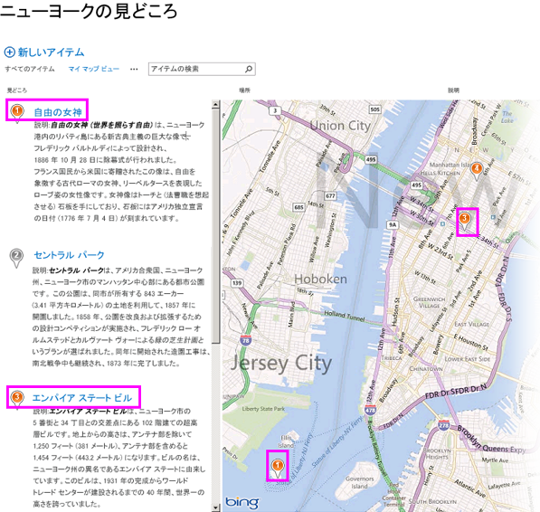
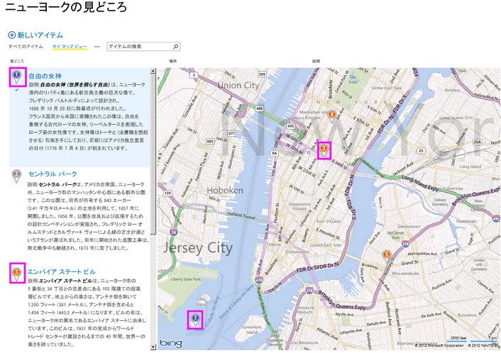
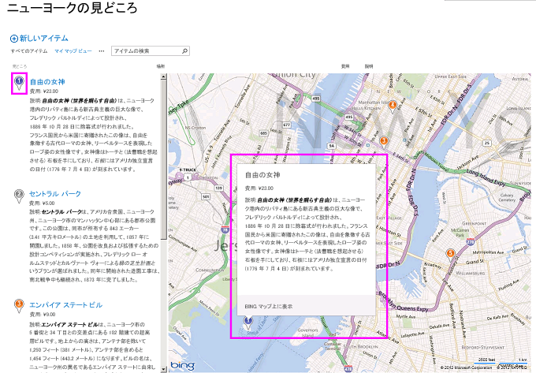

# SharePoint 2013 で地理位置情報フィールドのマップ ビューを作成する
SharePoint 2013のリストでマップ ビューを使用し、場所情報を表示する方法を説明します。マップ ビューの作成は、SharePoint のユーザー インターフェイス (UI) により手動で行うか、または、新しい **Geolocation** フィールド型を使用してプログラム的に行うことができます。
SharePoint 2013では、SharePoint リストに場所情報の注釈をつけられる **Geolocation** という名前の新しいフィールド型が導入されています。たとえば、リストを "場所対応" にすることができ、緯度と経度の座標を Bing Maps に表示できます。エントリは、通常、マップ ビュー上の画鋲として表示されます。
  
    
    

SharePoint リストでマップ ビューを表示するには、Bing Maps サービスを使用する必要があります。UI を使用してリストを作成すると、 **Geolocation** フィールドは利用できません。このフィールドはプログラム的に挿入する必要があります。このデータ型をプログラム的に表示および操作する方法の詳細については、「 [SharePoint 2013 でロケーションとマップ機能を組み込む](integrating-location-and-map-functionality-in-sharepoint-2013.md)」を参照してください。
 **Geolocation** フィールドおよびマップ ビューを使用すると、SharePoint のデータを Web アプリやモバイル アプリのマッピング機能に統合することによって、任意の情報に空間コンテキストを付与できます。この記事では、 **Geolocation** フィールドを表示する方法については説明しません。また、ここでは、場所ベースのモバイル アプリケーションを作成するための開発者向けガイダンスは掲載していません。この記事では、Bing Maps を使用して、プログラム的にマップ ビューを作成する手順および SharePoint の UI からマップ ビューを作成する手順を説明します。
  
    
    

リスト内の **Geolocation** フィールドの値やデータを参照するには、SQLSysClrTypes.msi という名前の MSI パッケージが、すべての SharePoint フロントエンド Web サーバー上にインストールされている必要があります。このパッケージは、新しいジオメトリ、地理、および階層 ID の種類を SQL Server 2008 に実装するコンポーネントをインストールします。既定では、このファイルは SharePoint Online 用にインストールされます。ただし、SharePoint Server 2013の社内展開にはインストールされません。この操作を実行するには、ファームの管理者グループのメンバーである必要があります。SQLSysClrTypes.msi をダウンロードするには、Microsoft ダウンロード センターで「 [Microsoft SQL Server 2008 R2 SP1 Feature Pack](http://www.microsoft.com/ja-jp/download/details.aspx?id=26728)」(SQL Server 2008 の場合) または「 [Microsoft SQL Server 2012 Feature Pack](http://www.microsoft.com/ja-jp/download/details.aspx?id=29065)」(SQL Server 2012 の場合) を参照してください。
## マップ ビュー作成の前提条件
<a name="SP15CreatingMapViews_Preqs"> </a>


- ビューの作成に十分な特権で、SharePoint 2013 リストにアクセスすること。
    
  
- **Geolocation** 列を含む SharePoint 2013 リスト
    
  
- ファームまたは Web レベルで有効な Bing Maps キー セット ( [Bing Maps Account Center](http://www.bingmapsportal.com/) から取得できます)
    
> **重要**
> Bing Maps キーの使用に適用される使用条件を遵守する責任があります。また、Bing Maps サービスに渡すデータに関して、アプリケーションのユーザーに開示する必要がある場合、その開示に責任があります。 
- Visual Studio 2012 または Visual Studio 2010
    
  

## マップ ビューとは
<a name="SP15CreatingMapViews_AMapView"> </a>

マップ ビューは、 **Geolocation** フィールド型の経度および緯度エントリを使用して、(Bing Maps サービスから取得したデータとともに) 地図を表示する SharePoint ビューです。 **Geolocation** フィールド型が SharePoint リストで利用できる場合、マップ ビューはプログラム的に、または、SharePoint の UI から作成できます。SharePoint 2013では、リスト内で、Bing Maps から提供される地図に場所を表示します。さらに、[ **マップ ビュー**] という名前の新しいビューの種類によって、リスト アイテムが Bing Maps AJAX Control V7 上で画鋲として表示され、左側のウィンドウ上にリスト アイテムがカードとして表示されます。
  
    
    

> **メモ**
> 任意の SharePoint 2013 リストに、最大 2 つの **Geolocation** 列を含めることができます。同じリストに 3 つ目の **Geolocation** 列を追加することはできません。マップ ビューには、 **Geolocation** 列を 1 つだけ含められます。 **Geolocation** 列の異なる複数のマップ ビューを作成できます。
  
    
    


## SharePoint の UI からマップ ビューを作成する
<a name="SP15CreatingMapViews_FromSharePointUI"> </a>

次の手順では、SharePoint 2013の UI からマップ ビューを作成する方法を示します。
  
    
    

1. **Geolocation** 列のある SharePoint 2013 リストを開きます。
    
  
2. 図 1 のように、ECB (編集コントロール ブロック) メニューから、[ **ビューの作成**] を選択します。
    
   **図 1. ECB メニューからビューを作成する**

  


  

  

  
3. [ **ビューの種類を選択してください**] ページで、図 2 のように [ **マップ ビュー**] を選択します。
    
   **図 2. ビューの種類を選択する**

  

![ビューの種類の一覧から [マップ ビュー] を選択](images/SPCon15_CreateMapView_ChooseViewType__fig2.png)
  

  

  
4. ビューの種類を選択した後、図 3 のように、マップ ビューに表示するさまざまなフィールドを選択できます。
    
   **図 3. マップ ビュー用のフィールドを選択する**

  


  

    
> **メモ**
> マップ ビューを作成するには、少なくとも 1 つの **Geolocation** フィールドが必要です。異なる 2 つの **Geolocation** フィールドを使用する 2 つのマップ ビューを別々に作成することはできますが、1 つのマップ ビューに複数の **Geolocation** フィールドを選択することはできません。

5. 必須の **Geolocation** フィールドと、必要なその他のフィールドを追加した後、[ **OK**] をクリックします。図 4 のようにマップ ビューが作成されます。
    
   **図 4. 完成したマップ ビュー**

  


  

  

  

## プログラム的にマップ ビューを作成する
<a name="SP15CreatingMapViews_ByProgramatically"> </a>

次の手順に従って、プログラム的に SharePoint リストのマップ ビューを作成します。
  
    
    

1. Visual Studio を起動します。
    
  
2. メニュー バーで、[ **ファイル**]、[ **新しいプロジェクト**] をクリックします。[ **新しいプロジェクト**] ダイアログ ボックスが開きます。
    
  
3. [ **新しいプロジェクト**] ダイアログ ボックスで、[ **インストールされているテンプレート**] ボックスの [ **C#**] を選択し、[ **コンソール アプリケーション**] テンプレートを選択します。
    
  
4. プロジェクトに名前をつけて、[ **OK**] をクリックします。
    
  
5. Visual Studio にプロジェクトが作成されます。次のアセンブリへの参照を追加して、[ **OK**] をクリックします。
    
  - Microsoft.SharePoint.Client.dll
    
  
  - Microsoft.SharePoint.Client.Runtime.dll
    
  
6. 既定の .cs ファイルでは、次のように **using** ディレクティブを追加します。
    
     `using Microsoft.SharePoint.Client;`
    
  
7. .cs ファイルの中の **Main** メソッドに次のコードを追加します。
    
    > **メモ**
      > JSLink プロパティは、アンケート リストやイベント リストではサポートされません。SharePoint の予定表は、イベント リストです。 

  ```cs
  
class Program
    {
        static void Main(string[] args)
        {
            CreateMapView ();
            Console.WriteLine("A map view is created successfully");
        }
        private static void CreateMapView()
        { 
         // Replace <Site URL> and <List Title> with valid values.
            ClientContext context = new ClientContext("<Site Url>"); 
            List oList = context.Web.Lists.GetByTitle("<List Title>");
            ViewCreationInformation viewCreationinfo = new ViewCreationInformation();
         // Replace <View Name> with the name you want for your map view.
             viewCreationinfo.Title = "<View Name>";
             viewCreationinfo.ViewTypeKind = ViewType.Html;
             View oView = oList.Views.Add(viewCreationinfo);
             oView.JSLink = "mapviewtemplate.js";
            oView.Update();
            context.ExecuteQuery();
        } 
    }
  ```

8.  _<Site Url>_ と _<List Title>_ は有効な値に置き換えます。
    
  
9. リストに移動します。前のコードで指定した名前のついた、新しく作成したビューが表示されます。
    
  

## マップ ビューの色分けされた画鋲を理解する
<a name="SP15CreatingMapViews_ColorCode"> </a>

マップ ビューには (図 5 に示すように) 3 色の画鋲があり、それぞれ異なるユーザー エクスペリエンスを提供します。地図上の画鋲は、左側のウィンドウにある対応するアイテムの画鋲と同じ色です。
  
    
    

- **オレンジ** そのアイテムの **Geolocation** フィールドが Bing Maps サービスでマッピングされていることを示します。
    
  
- **灰色** そのアイテムの **Geolocation** フィールドが空であることを示します。アイテムを Bing Maps サービスでマッピングできないので、このアイテムの画鋲は地図上に表示されません。
    
  
- **青** ユーザーがリスト アイテムをポイントすると、画鋲の色がオレンジから青に変わります。左側のウィンドウの画鋲と、対応する地図上の画鋲の両方の色が変わります。
    
  

**図 5. 異なる色の画鋲があるマップ ビュー**

  
    
    

  
    
    

  
    
    
マップ ビューを作成した後、すべてのアイテムが画鋲として表示されます。ユーザーは、画鋲をポイントすることによって、図 6 のようにアイテムに関する詳細情報を取得できます。
  
    
    

**図 6. マップ ビューの画鋲のユーザー エクスペリエンス**

  
    
    

  
    
    

  
    
    

  
    
    

  
    
    

## その他の技術情報
<a name="SP15CreatingMapViews_AdditionalResources"> </a>


-  [SharePoint 2013 でロケーションとマップ機能を組み込む](integrating-location-and-map-functionality-in-sharepoint-2013.md)
    
  
-  [[方法] SharePoint 2013 で地理位置情報列をプログラムでリストに追加する](how-to-add-a-geolocation-column-to-a-list-programmatically-in-sharepoint-2013.md)
    
  
-  [[方法] SharePoint 2013 で、Web およびファーム レベルで Bing Maps キーを設定する](how-to-set-the-bing-maps-key-at-the-web-and-farm-level-in-sharepoint-2013.md)
    
  
-  [方法: Windows Phone アプリおよび SharePoint 2013 リストに地図を統合する](how-to-integrate-maps-with-windows-phone-apps-and-sharepoint-2013-lists.md)
    
  
-  [モバイル アプリケーションで SharePoint 2013 の位置情報フィールドの種類を使用する](http://technet.microsoft.com/ja-jp/library/fp161355%28office.15%29.aspx)
    
  

