# Visual Studio 2012 を使用して SharePoint 用ワークフロー アプリを作成する
Microsoft Visual Studio 2012 を使用して SharePoint アドイン ワークフローを作成するプロセスについて説明します。
## 前提条件
<a name="bmPreReq"> </a>

この開発シナリオでは、SharePoint Server 2013 ファームとワークフロー マネージャー 1.0 ファームがインストールされ、ペアリングされていることを前提としています。これら 2 つのファームは、同じサーバー コンピューター、または別のサーバー コンピューターに配置することができます。さらに、このシナリオでは、ワークフローがリモートで開発される、つまり、いずれのサーバー コンピューターとも別のコンピューターで開発されること、そして Microsoft Visual Studio 2012 以降を使用することを前提としています。
  
    
    

- サーバー プラットフォーム上:
    
  - Windows Server 2008 R2。
    
  
  - Microsoft SharePoint Server 2013
    
  
  - ワークフロー マネージャー 1.0
    
  
- 開発プラットフォーム上:
    
  - Microsoft Visual Studio 2012 以降。
    
  
  - Office Developer Tools for Visual Studio 2013。
    
    > **メモ**
      > Office Developer Tools for Visual Studio 2013 は Visual Studio 2012 を使用する場合のみ必要です。それ以降のバージョンの Visual Studio には Office Developer Tools が含まれます。 
SharePoint ワークフロー開発環境のセットアップおよび構成のサポートについては、以下をご覧ください。
  
    
    

-  [SharePoint ワークフロー開発環境のセットアップと構成を準備する](prepare-to-set-up-and-configure-a-sharepoint-workflow-development-environment.md)
    
  
-  [SharePoint Server 2013 でワークフローを構成する](http://technet.microsoft.com/ja-jp/library/jj658586%28v=office.15%29)
    
  
-  [ビデオ シリーズ: SharePoint Server 2013 でワークフローをインストールおよび構成する](http://technet.microsoft.com/ja-jp/library/dn201724%28v=office.15%29)
    
  

## 作業の開始
<a name="bmGetStarted"> </a>

ビジネス シーンにおける一般的なワークフロー シナリオには、ドキュメントのレビューおよび承認プロセスがあります。このチュートリアルでは、SharePoint ワークフローを使用して、ドキュメントのルーティング、通知および承認 (または却下) を自動化する SharePoint アドイン を作成します。ここでは、Microsoft Visual Studio 2012 の SharePoint ワークフロー ​​デザイナーを使用してこのワークフローを作成します。
  
    
    
以下のフローチャートに、作成するワークフローの流れを示します。
  
    
    

**図 1. ドキュメント承認ワークフローを表すフローチャート。**

  
    
    

  
    
    
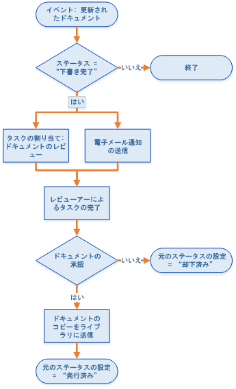
  
    
    
要約すると、このワークフローでは以下の処理を実行します。
  
    
    

  
    
    

1. 特定のドキュメント ライブラリに関連付けられたドキュメント変更イベントで、ワークフロー インスタンスを起動します。
    
  
2. ドキュメントの状態が [下書き完了] に設定されている場合、このワークフローでは事前に定義されたレビュー担当者に、タスクを割り当てて通知する電子メールが送信されます。
    
  
3. レビュー担当者がドキュメントの承認に失敗した場合、そのドキュメント ファイルは下書きドキュメント ライブラリに残りますが、ドキュメントの状態は [却下済み] に設定されます。
    
  
4. レビュー担当者がドキュメントを承認した場合、このワークフローではドキュメントを発行済みドキュメント ライブラリにコピーします。元のファイルは下書きドキュメント ライブラリに残りますが、状態は [発行済み] に設定されます。
    
  

    
> **重要**
> このチュートリアルを開始する前に、ワークフロー開発環境を適切にインストールおよび構成していることを確認します。詳細については、「 [SharePoint ワークフロー開発環境のセットアップと構成を準備する](prepare-to-set-up-and-configure-a-sharepoint-workflow-development-environment.md)」をご覧ください。また、ワークフローを開発できる SharePoint Server 2013 インスタンスがあることをご確認ください。詳細については、「 [SharePoint 2013 をインストールする](http://technet.microsoft.com/ja-jp/library/cc303424.aspx)」をご覧ください。 
  
    
    


## 環境の準備
<a name="bmPrepare"> </a>

最初の手順では、SharePoint サイトにこのワークフローで使用するドキュメント ライブラリを準備します。
  
    
    

1. Visual Studio 2012 を起動し、図 2 に示すように、[ **SharePoint 2013 用アプリ**] テンプレートを使用して新規プロジェクトを作成します。
    
    > **メモ**
      > このチュートリアルでは、ソリューション ファイルに「DocApprovalWorkflow1」という名前を付けています。同じ名前を使用することをお勧めします。ただし、ソリューション ファイルに別の名前を付けた場合は、以降の手順で必要な調整をお願いいたします。 

   **図 2. Visual Studio 2012 での新規プロジェクトの作成。**

  

![Visual Studio 2012 の [新しいプロジェクト] ダイアログ](images/ngGK_Fig02.png)
  

  

  
2. 関連付けられた SharePoint サイトで、以下の手順を実行して 2 つの新規ドキュメント ライブラリを作成します。
    
  - [ **ソリューション エクスプローラー**] で [DocApprovalWorkflow1] アイコンを右クリックし、[ **追加**] > [ **新しいアイテム**]、[ **リスト**] と選択します。
    
  
  - 表示された [ **SharePoint カスタマイズ ウィザード**] の名前フィールドに「下書きドキュメント」と入力します。図 3 に示すように、最初のラジオ ボタンの下のドロップダウン リストから [ドキュメント ライブラリ] を選択します。
    
  
  - [ **次へ**] をクリックし、既定の設定を受け入れて、[ **完了**] をクリックします。
    
   **図 3. リスト設定用の SharePoint カスタマイズ ウィザード。**

  

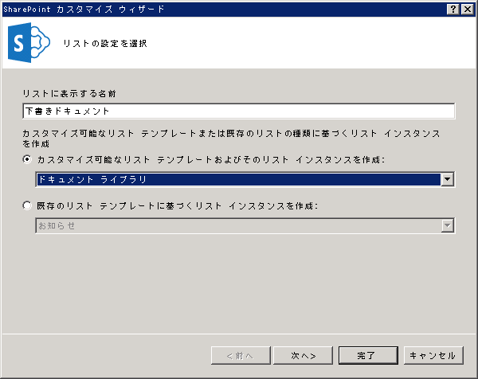
  

  

  
3. 上記と同じ手順で 2 つ目のドキュメント ライブラリを作成します。ただし、この 2 つ目のライブラリには「発行済みドキュメント」という名前を付けます。
    
  
4. 作成したばかりの新規ドキュメント ライブラリの **両方** に、カスタム列を 2 つずつ追加します。
    
  - 「承認者」という名前のカスタム列を作成し、リストの列の種類を [ **ユーザーまたはグループ**] にします。
    
  
  - 「ドキュメントの状態」という名前のカスタム列を作成し、リストの列の種類を [ **選択肢**] にします (図 4 をご覧ください)。
    
  
5. [ **ドキュメントの状態**] 列で、プロパティ グリッドの **Type** プロパティを展開し、 **Items** プロパティの省略記号ボタン ([ **…**]) をクリックして 5 つの選択肢を追加します。図 4 に示すように、表示されたダイアログ ボックスに選択肢の値を入力します。
    
  - 下書き中
    
  
  - 下書き完了
    
  
  - 発行承認済み
    
  
  - 却下済み
    
  
  - 発行済み
    
  

   ****

  

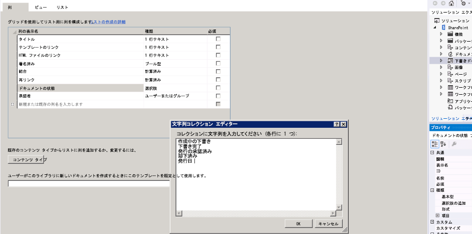
  

  

  

## 基本ワークフローの作成
<a name="bmCreateWorkflow"> </a>

ワークフロー自体を作成する準備ができました。
  
    
    

1. Visual Studio で、([ **ソリューション エクスプローラー**] 内の) [ **DocApprovalWorkflow1**] アイコンを右クリックし、[ **追加**] > [ **新しいアイテム**]、[ **ワークフロー**] と選択し、新規ワークフローを作成します (図 5 をご覧ください)。
    
   **図 5. [新しい項目の追加] > [ワークフロー] ウィザード。**

  

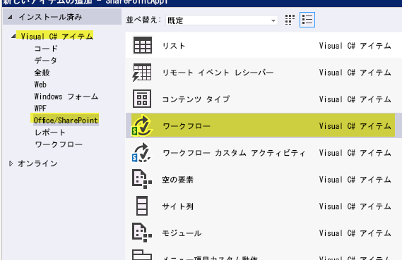
  

  

  
2. 入力を要求するメッセージが表示されたら、ワークフローに「DocumentApprovalWorkflow」という名前を付け、ワークフローの種類として [ **リスト ワークフロー**] を選択します (図 6 をご覧ください)。
    
   **図 6. ワークフローの名前と種類の指定。**

  


  

  

  
3. [ **SharePoint カスタマイズ ウィザード**] で、新規ワークフローを下書きドキュメント ライブラリに関連付けて、図 7 に示すように、新規履歴リストと新規ワークフロー タスク リストの作成を選択します。[ **次へ**] をクリックします。
    
   **図 7. 新規ワークフロー用の SharePoint カスタマイズ ウィザードの完了。**

  

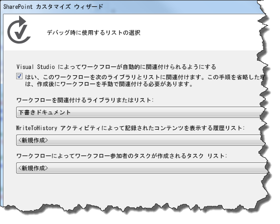
  

  

  
4. 下書きドキュメント ライブラリ内の項目が変更された場合に、ワークフローが自動で開始されるように設定します。また、選択したワークフローを手動で開始するためのチェック ボックスはそのままにします。こうれによって、ドキュメントを変更することなくワークフローを簡単にテストすることができます。図 8 をご覧ください。
    
   **図 8. ワークフローのアクティブ化パラメーターの設定。**

  

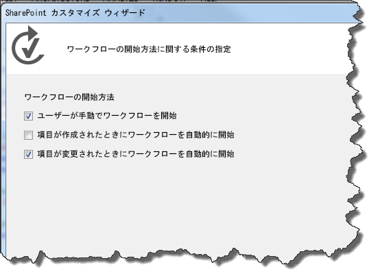
  

    
> **メモ**
> [ **ソリューション エクスプローラー**] で選択したワークフローにプロパティ グリッドを使用すると、ワークフローの作成後に、ワークフローの関連付けの種類を変更することができます (図 9 をご覧ください)。[ **完了**] をクリックします。 

   **図 9. ワークフローのプロパティ グリッド。**

  

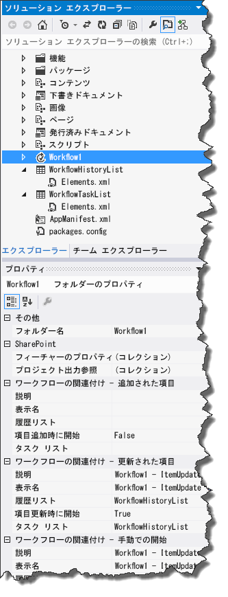
  

  

  
5. 最後に、SMTP サービスを使用して送信電子メールを管理する SharePoint Server を構成します。指示については、「 [SharePoint 2013 ファームの送信電子メールを構成する](http://technet.microsoft.com/ja-jp/library/cc263462.aspx)」をご覧ください。この作業は、ワークフローからワークフロー タスクに関連する電子メール通知を送信するために必要です。
    
  

## ワークフロー ロジックの実装
<a name="bmImplementLogic"> </a>

SharePoint Server をセットアップして基本ワークフローを作成すると、ワークフロー ロジックを設計することができます。
  
    
    

1. [ **ソリューション エクスプローラー**] のワークフロー プロジェクト項目をダブルクリックしてワークフロー デザイナーを開きます。ワークフロー デザイナー画面 (およびワークフロー ツールボックス) が表示され、デザイナーには [ **シーケンス**] という名前の初期ワークフロー ステージが表示されます。
    
  
2. 最初の手順では、ツールボックスから **LookupSPListItem** アクティビティを取得して (図 10 をご覧ください) デザイナー画面の [ **シーケンス**] ステージにドロップします。このアクティビティは、 **LookupSPListItem** アクティビティが、キーと値のペアとして一連の SharePoint リスト項目プロパティが含まれる [DynamicValue クラス](http://msdn.microsoft.com/ja-jp/library/windowsazure/microsoft.activities.dynamicvalue%28v=azure.10%29.aspx) オブジェクトとして返されたときに、いつでもドキュメントの状態を取得するときに使用します。
    
   **図 10. LookupSPListItem アクティビティ セレクター。**

  

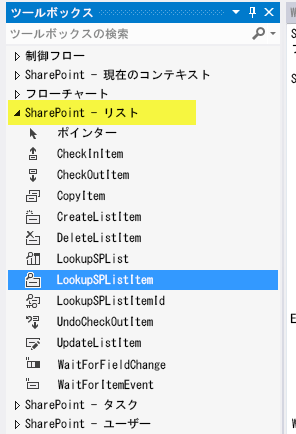
  

  

1. **LookupSPListItem** アクティビティを構成するには、まずデザイナーからアクティビティをクリックして選択します。これにより、アクティビティのプロパティ グリッドが実行されます。
    
  
2. 図 11 に示すように、[ **ItemId**] に [現在のアイテム] 、[ **ListId**] に [現在のリスト] を使用するには、プロパティ グリッドにあるコンボ ボックスで **LookupSPListItem** アクティビティを構成します。
    
   **図 11. LookupSPListItem プロパティの構成。**

  

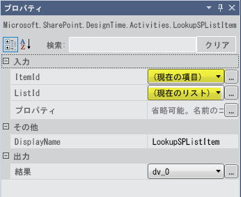
  

  

  
3. [ **LookupSPListItem**] アクティビティ タイルで、[ **プロパティの取得**] リンクをクリックします。これにより、以下の 2 つの重要な手順が実行されます。
    
1. まず、 **DynamicValue** 型の変数が作成され、 **LookupSPListItem** アクティビティの ( _Result_ という名前の) out 引数にバインドされます。リスト項目のプロパティはこの変数に格納されます。
    
  
2. 次に、 **GetDynamicValueProperties** という名前の新規アクティビティが追加され (図 12 をご覧ください)、新しく作成された **DynamicValue** 変数がこの新規アクティビティの in 引数として設定されます。このアクティビティにより、リスト項目プロパティを **DynamicValue** 変数から抽出することができます。
    
  
4. [ **GetDynamicValueProperties**] アクティビティで [ *定義…*  ] をクリックし、抽出するプロパティを選択するダイアログ ボックスを開きます。プロパティを選択する際には、図 12 をご覧ください。[ **プロパティ**] ダイアログ ボックスと結合したデザイナー画面の一部が表示されます。
    
   **図 12. 抽出する DynamicValue プロパティの選択。**

  

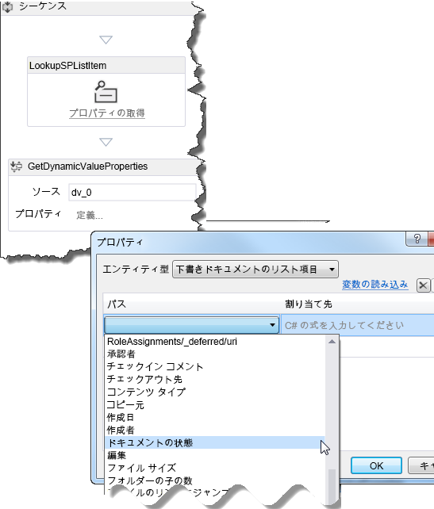
  

  

1. [ **エンティティ型**] で [ **下書きドキュメントのリスト項目**] を選択します。
    
  
2. データ グリッドの [ **パス**] 列で、[ *プロパティの作成*  ] をクリックし、下書きドキュメント ライブラリのリスト項目で使用可能なプロパティが含まれるコンボ ボックスを開きます。コンボ ボックスから [ **ドキュメントの状態**] を選択します。
    
  
3. データ グリッドの次の行で、[ *プロパティの作成*  ] を再度クリックします。今回は、コンボ ボックスから [ **承認者**] を選択します。
    
  
4. 次に、ダイアログ ボックスの [ **変数の作成**] リンクをクリックします。これにより、各行に適切なデータ型の変数が作成され、図 13 に示すように、データ グリッドの [ **割り当て先**] 列に割り当てられます。
    
   **図 13. ドキュメントの状態および Approver のプロパティの取得。**

  


  

  

  
5. これで必要なリスト項目の値の準備ができました。次の手順では、ドキュメントが "下書き完了" であるかどうかをチェックして、そうである場合に適切な処理を実行するようにワークフローを設定します。
    
1. ツールボックスからワークフロー デザイナー画面に [ **If**] アクティビティ をドラッグします ( **If** アクティビティはツールボックスの [ **制御フロー**] セクションにあります)。
    
  
2. 図 14 に示すように、 **If** 条件を `DocumentStatus.Equals("Ready for Review")` に設定します。
    
   **図 14. タスクを発生させる If/Then 句の作成。**

  

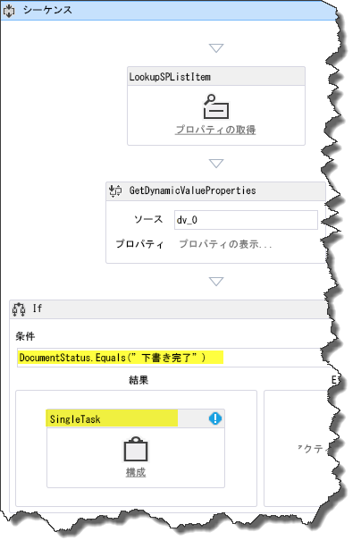
  

  

  
3. 次に、ツールボックスの [ **SharePoint - タスク**] セクションから [ **SingleTask**] アクティビティをドラッグし、[ **If**] アクティビティの [ **Then**] ボックスにドロップします。その結果、ドキュメントがレビュー準備完了である場合 ( **If**)、タスクを完了するように ( **Then**) ワークフローが構成されました。
    
  
6. 次の手順では、図 15 に示すように、設定ダイアログ ボックスを使用して作成したタスクを構成します。
    
   **図 15. タスク設定ダイアログ ボックス。**

  

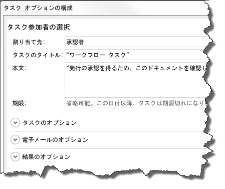
  

  

1. まず、タスクを承認者に割り当てます。そのためには、[ **SingleTask**] アクティビティ タイルの [ **構成**] リンクをクリックします。
    
  
2. [ **担当者**] フィールドを [承認者] に設定します。
    
  
3. [ **タスクのタイトル**] フィールドに "ワークフロー タスク" と自動的に入力されることにご注意ください。
    
  
4. [ **本文**] フィールドに、承認者への指示を含む簡単なメッセージ (「このドキュメントを確認して発行用にご承認ください。」など) を入力します。
    
  
5. [ **OK**] をクリックして保存します。
    
  

    この段階で、 **SingleTask** アクティビティに検証エラーが発生していることにご注意ください。[ **SingleTask**] タイルが選択された状態で、プロパティ グリッドの [ **担当者**] プロパティを確認するとエラー アイコンが表示されています。プロパティ名の上にカーソルを移動して、問題の内容を説明するヒントを表示します。[ **担当者**] プロパティには **String** 値の入力が求められます。しかし、 **Approver** 変数のデータ型は **Int32** です。
    
    このエラーを修正するには、図 16 に示すように、プロパティ グリッドの [ **担当者**] 行にある "Approver" に ".ToString()" を追加して、この変数を **String**データ型に変換します。
    

   **図 16. プロパティ グリッドで "Approver" 変数を文字列データ型に変換する。**

  

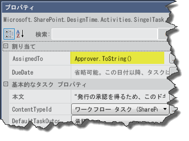
  

このチュートリアルの現段階では、次の 2 つの処理を実行するワークフローを作成、構成まで終えています。確認するドキュメントを設定して、タスクの割当先 (ここでは "承認者") に、タスクが割り当てられて処理待ちの状態であることを通知する電子メールを送信します。
    
  
7. **SingleTask** アクティビティのプロパティ グリッドについてさらに詳しく説明します。プロパティ グリッドの一番下までスクロールすると、[ **出力**] セクションに [ **結果**] と [ **TaskItemId**] という 2 つのプロパティがあります。これらは out 引数です。
    
    **結果** 変数の名前が _outcome_0_ (または類似の名前) であることにご注意ください。この変数を使用して、タスクの結果、つまり、承認者がドキュメントを承認したか、却下したかを確認します。
    
    > **メモ**
      > **Outcome** out 引数は、結果のインデックスに対応した **Int32** 値を返します。 **0** は "承認" に対応し、 **1** は "却下" に対応しています。これらの整数は、"タスクの結果" という名前の SharePoint サイトの組み込み列で提供される既定値です。
8. ワークフローでタスクの結果を確認するためには、図 17 に示すように、 **If** アクティビティをもう 1 つ追加して、 **SingleTask** アクティビティの後、ただし **Then** 領域の内部以外に配置する必要があります。 **If** 条件を `outcome_0 == 0` に設定することで、ドキュメントが承認されたかどうかが分かります。
    
   **図 17. IF アクティビティを使用してタスクの状態をチェック。**

  

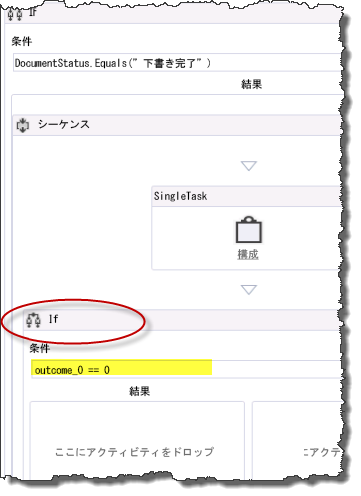
  

  

  
9. 承認者がタスクを "承認" に設定した場合、ドキュメントの状態を "発行承認済み" に更新し、ドキュメント ファイルを発行済みドキュメント ライブラリにコピーします。一方で、承認者がドキュメントを却下した場合、ドキュメントの状態を "却下" に設定する必要があります。
    
1. この新しい [ **If**] アクティビティ内で、[ **UpdateListItem**] アクティビティを [ **Then**] ボックスにドラッグします。
    
  
2. 図 18 に示すように、[ **ItemId**] が "(現在の項目)" に設定され、[ **ListId**] が "(現在のリスト)" に設定されるように、プロパティ グリッドで [ **UpdateListItem**] アクティビティを構成します。
    
  
3. 次に、[ **UpdateListItem**] アクティビティを選択した状態で、プロパティ グリッドの [ **ListItemPropertiesDynamicValue**] フィールドの隣にある省略記号ボタン ([ **…**]) をクリックします。この動作により、ダイアログ ボックスが開き、更新するリスト項目プロパティを指定することができます。
    
   **図 18. 更新するリスト項目プロパティの設定。**

  

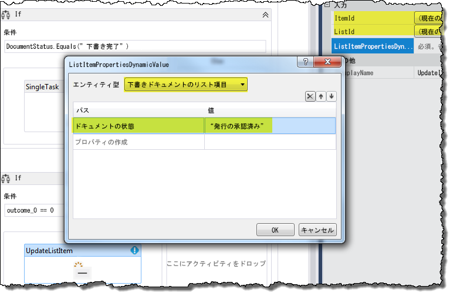
  

  

  
4. まず、図 18 に示すように、このダイアログ ボックスでコンボ ボックスを使用して [ **エンティティ型**] を [ **下書きドキュメントのリスト項目**] に設定します。次に、データ グリッドで [ **プロパティの作成**] をクリックして、ドロップダウン リストから [ドキュメントの状態] を選択します。その後、[ **値**] 列に「"発行承認済み"」 (引用符を含む) と入力し、[ **OK**] をクリックします。
    
  
10. 現在の [ **If**] アクティビティの [ **Then**] 領域で、図 19 に示すように、[ **CopyItem**] アクティビティをドラッグして [ **UpdateListItem**] アクティビティの直下に配置します。
    
   **図 19. ワークフローに CopyItem アクティビティを追加する。**

  

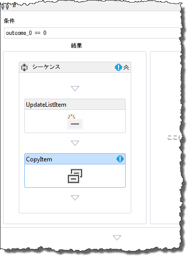
  

次に、図 20 に示すように、プロパティ グリッドで [ **CopyItem**] アクティビティのプロパティを構成すると、プロパティの値が強調表示されます。
    

   **図 20. CopyItem アクティビティの構成。**

  

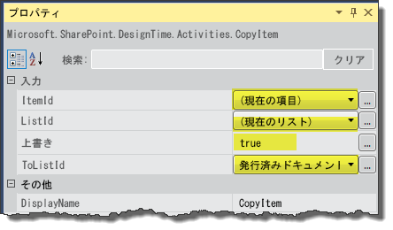
  

    
> **メモ**
> このチュートリアルでは、すべての発行済みドキュメントが下書きドキュメント ライブラリに入っていたことを前提とします。そのため、ここでは重複するファイル名の制御については考慮しません。 

11. 最後に、レビュー担当者がドキュメントを却下した場合を処理するアクティビティを追加する必要があります。そのためには、現在の [ **If**] アクティビティの [ **Else**] 領域に [ **UpdateListItem**] アクティビティを追加します。この [ **UpdateListItem**] アクティビティを、前述の手順 9(c) と同様に構成します。ただし、図 21 に示すように、今回はドキュメントの状態を "拒否" に設定します。
    
   **図 21. 却下されたドキュメントの UpdateListItem アクティビティのプロパティを構成する。**

  

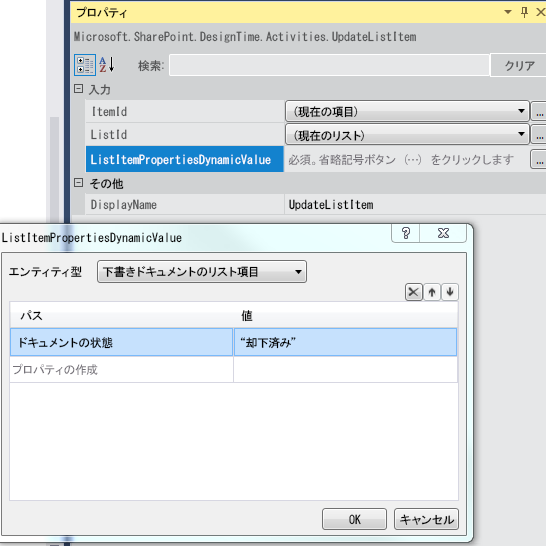
  

  

  
これで、"SharePoint ドキュメント承認ワークフローの作成" は完成です。完成したワークフローを図 22 に示します。
  
    
    

**図 22. 完成したドキュメント承認ワークフロー。**

  
    
    

  
    
    
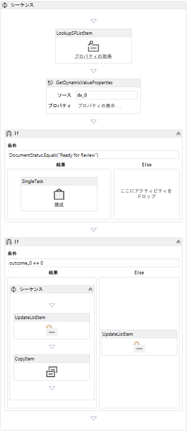
  
    
    

  
    
    

  
    
    

## ワークフローのパッケージ化と展開
<a name="bk_deploy"> </a>

ワークフローを SharePoint アドイン としてパッケージ化して展開するためのガイダンスを提供するリソースを以下に示します。
  
    
    

-  [SharePoint 用アプリの展開とインストール: 方法とオプション](http://msdn.microsoft.com/ja-jp/library/fp179933.aspx)
    
  
-  [SharePoint アプリの発行](http://msdn.microsoft.com/ja-jp/library/jj164070.aspx)
    
  
-  [[方法] サンドボックス ソリューションで宣言型ワークフローを作成および展開する](http://msdn.microsoft.com/ja-jp/library/gg615452%28v=office.14%29.aspx) (SharePoint Designer 2013 を使用)
    
  

> **注意**
> 統合されたワークフローを含む SharePoint アドイン (親 Web のリストと関連付けられる) は、アプリのパッケージにある  `workflowmanifest.xml` ファイルで次のタグを **true** に変更すると区別できます。
  
    
    


```XML

<SPIntegratedWorkflow xmlns="http://schemas.microsoft.com/sharepoint/2014/app/integratedworkflow">
    <IntegratedApp>true</IntegratedApp>
</SPIntegratedWorkflow>

```


## その他のリソース
<a name="bk_addresources"> </a>


-  [SharePoint 2013 のワークフロー](workflows-in-sharepoint-2013.md)
    
  
-  [SharePoint ワークフロー開発環境のセットアップと構成を準備する](prepare-to-set-up-and-configure-a-sharepoint-workflow-development-environment.md)
    
  
-  [SharePoint ワークフロー開発のベスト プラクティス](sharepoint-workflow-development-best-practices.md)
    
  
-  [Visual Studio を使用した SharePoint 2013 ワークフローの開発](develop-sharepoint-2013-workflows-using-visual-studio.md)
    
  

  
    
    

