# SharePoint 2013 ワークフロー プラットフォームを使用した引き上げられた権限でのワークフローの作成
SharePoint 2013 ワークフロー プラットフォームを使用して、引き上げられた権限でワークフローを作成する方法を説明します。
## SharePoint Server 2013 のアプリ カタログとワークフロー
<a name="section1"> </a>

この記事では、引き上げられた権限を必要とする SharePoint 内のオブジェクトにアクセスする SharePoint 2013 ワークフローを作成する方法について説明します。これらのソリューションでは、ワークフロー アプリへの権限の付与と、アプリ ステップでのアクションのラップという 2 つの機能を使用します。
  
    
    

> **重要**
> この記事では、SharePoint 2013 ワークフロー プラットフォームがインストールおよび構成されており、SharePoint 2013 がアプリ用に構成されているものとします。SharePoint 2013 ワークフローおよび SharePoint 2013 用のアプリのインストールと構成などの詳細については、「 [SharePoint 2013 のワークフロー](http://technet.microsoft.com/ja-jp/sharepoint/jj556245.aspx)」および「 [Install and manage apps for SharePoint 2013](http://msdn.microsoft.com/library/733647a3-a5d3-475b-967d-3bb627c2a0c2.aspx)」を参照してください。 
  
    
    


### 引き上げられた権限でのワークフローの作成の概要

SharePoint 管理者として、Office ストアからアプリを購入するユーザーの要求を管理するためのプロセスを定義する場合について考えます。最も簡単な場合として、ユーザーからアプリの要求があったら、確認応答の電子メールを送信します。さらに、要求承認プロセスに構造を追加します。
  
    
    
既定では、ワークフローにはアプリ要求カタログにアクセスするための権限はありません。SharePoint 内のカタログ リストには、所有者 (フル コントロール) の権限が必要です。通常、ワークフローは書き込みと同等の権限レベルで実行します。
  
    
    
これを解決するには、サイト コレクション サイトで以下の手順に従って引き上げられた権限を持つワークフローを作成する必要があります。
  
    
    

1. ワークフローにアプリの権限の使用を許可します。
    
  
2. ワークフローにフル コントロール権限を付与します。
    
  
3. ワークフローを作成してアプリ ステップの内部のアクションをラップします。
    
  

### SharePoint Server 2013 サイトでのアプリの権限の使用をワークフローに許可する

最初に、アプリの権限の使用をワークフローに許可します。ワークフローを実行する SharePoint Server 2013 サイトの [ **サイトの設定**] ページで、アプリの権限を使用するようにワークフローを構成します。以下の手順では、ワークフローがアプリの権限を使用することを許可するように SharePoint Server 2013 サイトを構成します。
  
    
    

> **重要**
> この手順は、[ **サイトの所有者**] 権限のあるユーザーが完了する必要があります。 
  
    
    


### ワークフローにアプリの権限の使用を許可するには


1. 図に示したように [ **設定**] アイコンをクリックします。
    
   **図: [サイトの設定] ページを開く**

  

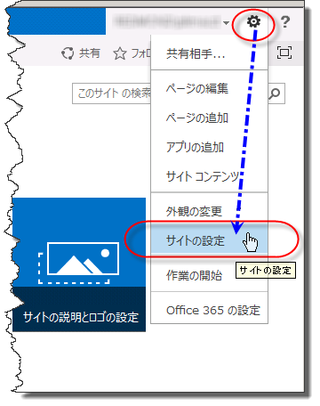
  

  

  
2. [ **サイトの設定**] に移動します。
    
  
3. [ **サイトの操作**] セクションで、[ **サイト機能の管理**] を選択します。
    
  
4. 次の図のように、[ **ワークフローでアプリの権限を使える**] という名前の機能を探し、[ **アクティブ化**] をクリックします。
    
    > **注意**
      > この機能は、SharePoint 2013 ワークフロー プラットフォームおよび SharePoint 用アプリが正しく構成されていないとアクティブになりません。 

   **図: サイト機能 "ワークフローでアプリの権限を使える"**

  

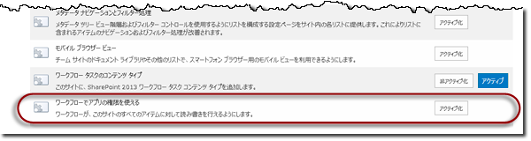
  

  

  

### ワークフローにフル コントロール権限を付与する

ワークフローが正しく機能するには、サイトでのフル コントロールを付与される必要があります。以下の手順では、フル コントロール権限をワークフローに付与します。
  
    
    

> **重要**
>  この手順では以下のことを想定します。


- この手順は、[ **サイトの所有者**] 権限のあるユーザーが完了する必要があります。


- ワークフローは既に SharePoint Server 2013 サイトに対して発行されている必要があります。
  
    
    


### ワークフローにフル コントロール権限を付与するには


1. 図に示したように [ **設定**] アイコンをクリックします。
    
   **図: [サイトの設定] ページを開く**

  


  

  

  
2. [ **サイトの設定**] に移動します。
    
  
3. [ **ユーザーと権限**] セクションで、[ **サイト アプリの権限**] を選択します。
    
  
4. [ **アプリ ID**] の **クライアント** セクションをコピーします。これは、図に示すように、ID の最後の "|" と "@" 記号の間の部分です。
    
   **図: アプリ ID の選択**

  

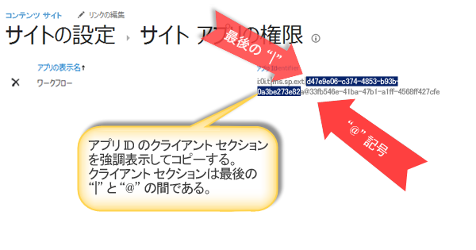
  

  

  
5. [ **アプリへの権限の付与**] ページに移動します。これは、サイトの appinv.aspx ページを参照することによって行う必要があります。
    
    例: http://{ホスト名}/{サイト コレクション}/_layouts/15/appinv.aspx。 
    
    > **メモ**
      > この手順での "アプリ" は、特定のワークフローだけではなく、一般的なワークフロー アプリを意味します。個々のワークフローをアクセス制御することはできません。アプリのアクセス許可を有効にすると、サイト コレクション内部のすべてのワークフローのアクセス許可が有効になります。 

    ワークフローを設定する方法の詳細については、Sympraxis コンサルティングからの  [ブログ記事を参照してください。SharePoint 2013 サイト ワークフロー内のコンテンツをループ](http://sympmarc.com/2016/01/14/looping-through-content-in-a-sharepoint-2013-site-workflow-part-1-introduction)
    
    次の図に例を示します。
    

   **図: appinv.aspx ページと URL の例**

  

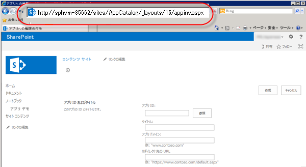
  

  

  
6. 次の図のように、クライアント ID を [ **アプリ ID**] フィールドに貼り付け、[ **参照**] をクリックします。
    
  
7. フル コントロール権限を付与するための次の **権限要求** XML を貼り付けます。
    
  ```
  
<AppPermissionRequests>
    <AppPermissionRequest Scope="http://sharepoint/content/sitecollection/web" Right="FullControl" />
</AppPermissionRequests>

  ```


> **注意**
> 上記の [ **範囲**] には プレース ホルダーがありません。これはリテラル値です。ここに示されているとおりに入力してください。 

次の図では、完全なページの例を示します。
    

   **図: アプリ ID の参照**

  

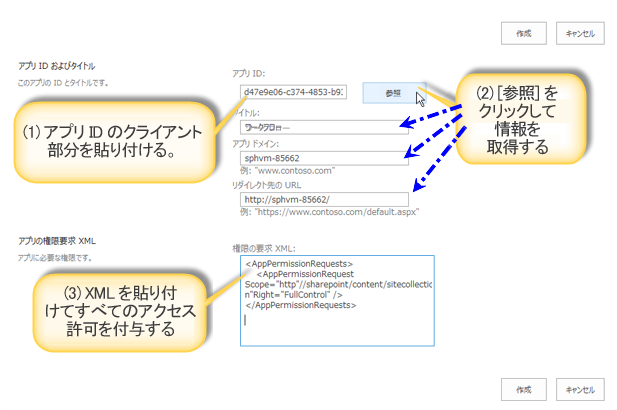
  

  

  
8. [ **作成**] をクリックします。
    
  
9. 図のように、ワークフロー アプリを信頼することを求められます。[ **信頼する**] をクリックします。
    
   **図: ワークフロー アプリを信頼する**

  

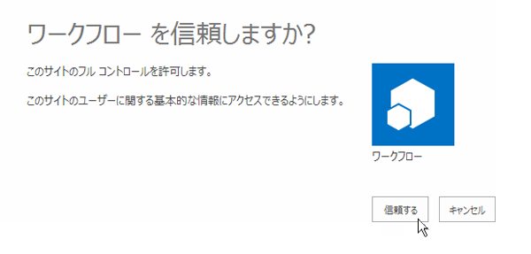
  

  

  

### アプリ ステップの内部のアクションをラップする

最後に、アプリ ステップの内部にあるワークフロー アクションをラップする必要があります。以下の手順では、アプリ ステップ内の **電子メールを送信する**アクションをラップしています。この例のワークフローでは、カスタム リストから確認応答の電子メール メッセージを送信します。
  
    
    

### アプリ ステップの内部のアクションをラップするには


1. SharePoint Designer 2013 でアプリ カタログ サイトを開きます。
    
  
2. ワークフローの実行対象となる新しいカスタム リストを作成します。この例では、リストの名前は **App Demo** です。
    
  
3. ナビゲーション ウィンドウの [ **ワークフロー**] をクリックします。
    
  
4. 図に示すように、App Demo リストに対する新しいリスト ワークフローを作成します。
    
   **図: 新しいリスト ワークフローを作成する**

  

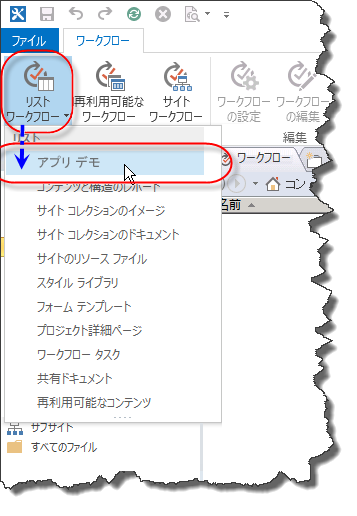
  

  

  
5. 図のように、[ **アプリ ステップ**] を挿入します。
    
   **図: アプリ ステップを追加する**

  

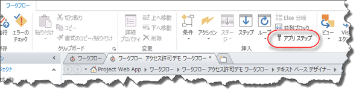
  

  

  
6. [ **電子メールを送信する**] アクションを [ **アプリ ステップ**] に挿入します。
    
  
7. [ **アドレス帳**] ボタンをクリックします。[ **宛先**] フィールドで [ **ユーザーのワークフロー参照**] を選択し、[ **追加**] をクリックします (図を参照)。
    
   **図: [ユーザーのワークフロー参照] を選択する**

  

![[ユーザーのワークフロー参照] を選択する](images/SPD15-WFAppPermissions9.png)
  

  

  
8. [ **作成者**] フィールドに参照値を入力します (図を参照)。
    
   **図: [ユーザーの参照] ダイアログ ボックス**

  

![[ユーザーの参照] ダイアログ](images/SPD15-WFAppPermissions10.png)
  

  

  
9. 電子メール メッセージの本文に、「App Demo リストからの電子メール」と入力します。
    
  
10. [ **OK**] をクリックしてワークフローに戻ります。完成したワークフローを図に示します。
    
   **図: アプリ ステップ内の電子メール アクション**

  

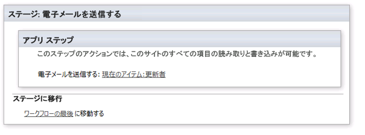
  

  

  
11. リボンの [ **ワークフロー設定**] アイコンをクリックします (図を参照)。
    
   **図: リボンの [ワークフロー設定] アイコン**

  

![リボンの [ワークフロー設定] アイコン](images/SPD15-WFAppPermissions12.png)
  

  

  
12. [ **現在のステージ名に合わせてワークフローの状態を自動的に更新する**] チェック ボックスをオフにし、[ **発行**] をクリックします (図を参照)。
    
   **図: 自動更新のチェック ボックスをオフにしてから発行する**

  

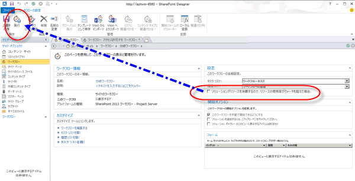
  

  

  

## 動作原理の概要
<a name="section2"> </a>

ワークフローの権限を引き上げる必要がある理由を理解するには、ワークフローは基本的に SharePoint 用のアプリであり、アプリ モデルと同じ承認ルールに従うことを考えてみてください。図のように、ワークフローの既定の構成では、ワークフローの有効な権限は、ユーザーの権限とアプリの権限の共通部分になります。
  
    
    

**図: 権限の図**

  
    
    

  
    
    
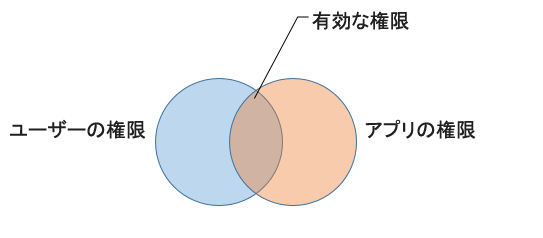
  
    
    
アプリ要求リストのワークフローを作成するために権限を引き上げる必要があるのは、次のような 2 つの理由によります。
  
    
    

- 既定では、ワークフローは書き込み権限だけを持ちます。
    
  
- ユーザーは権限を持っていません。
    
  
この問題を解決する最初のステップでは、アプリケーションがその ID だけを使用して承認できるようにし、ユーザーの承認を無視するようにします。次に、ワークフローにフル コントロール権限を付与します。
  
    
    
次の図は権限の変更を示したものです。
  
    
    

**図: 権限のマトリックス**

  
    
    

  
    
    
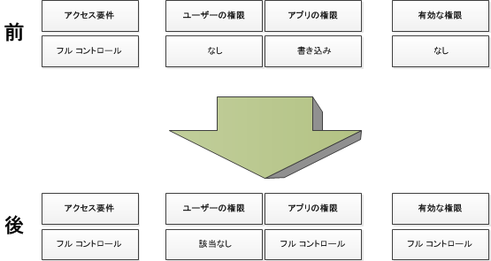
  
    
    

  
    
    

  
    
    

## その他の技術情報
<a name="section3"> </a>


-  [SharePoint 2013 のワークフロー](http://technet.microsoft.com/ja-jp/sharepoint/jj556245.aspx)
    
  
-  [Install and manage apps for SharePoint 2013](http://msdn.microsoft.com/library/733647a3-a5d3-475b-967d-3bb627c2a0c2.aspx)
    
  
-  [What's new in workflow in SharePoint Server 2013](http://msdn.microsoft.com/library/6ab8a28b-fa2f-4530-8b55-a7f663bf15ea.aspx)
    
  
-  [Getting started with SharePoint Server 2013 workflow](http://msdn.microsoft.com/library/cc73be76-a329-449f-90ab-86822b1c2ee8.aspx)
    
  
-  [SharePoint Designer および Visio でのワークフロー開発](workflow-development-in-sharepoint-designer-and-visio.md)
    
  
-  [ワークフロー アクション クイック リファレンス (SharePoint 2013 ワークフロー プラットフォーム)](workflow-actions-quick-reference-sharepoint-2013-workflow-platform.md)
    
  
-  [SharePoint Designer チームのブログ記事: ワークフロー パッケージと展開シナリオ](http://blogs.msdn.com/b/sharepointdesigner/archive/2012/08/30/packaging-list-site-and-reusable-workflow-and-how-to-deploy-the-package.aspx)
    
  
- Sympraxis コンサルティングからの  [ ブログ記事:SharePoint 2013 サイト ワークフロー内のコンテンツをループ](http://sympmarc.com/2016/01/14/looping-through-content-in-a-sharepoint-2013-site-workflow-part-1-introduction)
    
  

