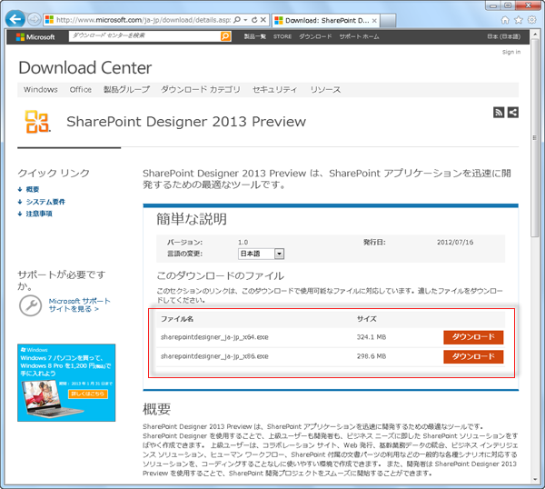
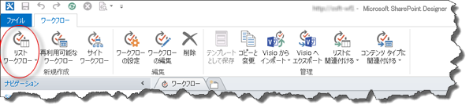
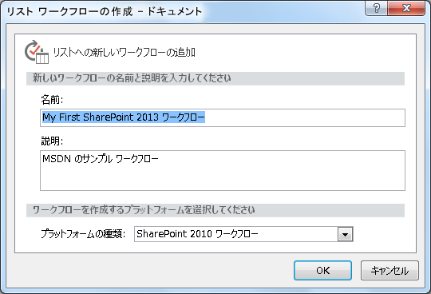
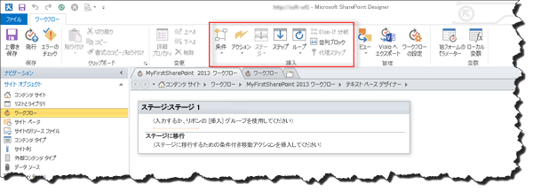

# SharePoint Designer 2013 および SharePoint 2013 Workflow プラットフォームを使用してワークフローを作成する
SharePoint Designer 2013および SharePoint 2013 ワークフロー プラットフォームを使用してワークフローをインストール、オープン、および作成する方法を学習します。 
||
|:-----|
||
   

## SharePoint Designer 2013をインストールする

SharePoint Designer 2013は無料でダウンロードできます。SharePoint Designer 2013をダウンロードしてインストールするには、以下のステップに従います。 
  
    
    

### SharePoint Designer 2013をインストールするには

1. Web ブラウザーを開いて Microsoft Download Center ( [http://www.microsoft.com/download/](http://www.microsoft.com/download/ja-jp.aspx)) に移動します。 
    
  
2. 検索フィールドに「 SharePoint Designer 2013」と入力します。
    
  
3. 「SharePoint Designer 2013」のリンクをクリックします。 
    
  
4. 概要、システム要件、およびインストール手順を読み、システムが対応していることを確かめます。 
    
  
5. 図で示されているようにプラットフォーム タイプ (64 ビット ( **x64**) または 32 ビット ( **x86**)) を選択します。 
    
  
6. 指示に従って SharePoint Designer 2013をインストールします。
    
  

**図: SharePoint Designer 2013 のダウンロード ページ**

  
    
    

  
    
    

  
    
    

  
    
    

  
    
    

## SharePoint Designer 2013を開いて SharePoint 2013 サイトに接続する

SharePoint Designer 2013は Office 2013 アプリケーションです。SharePoint Designer 2013を開いて SharePoint 2013 サイトに接続するには、次のステップに従います。 
  
    
    

### SharePoint Designer 2013を開いて SharePoint 2013 サイトに接続するには

1. [ **スタート**] メニューで選択することによって SharePoint Designer 2013を開きます。[ **スタート**] アイコンをクリックし、[ **すべてのプログラム**] をクリックし、[ **Microsoft Office 2013**] をクリックしてから、[ **SharePoint Designer 2013**] をクリックします。 
    
  
2. SharePoint Designer 2013のスタート ページで [ **サイトを開く**] をクリックします。
    
  
3. 接続先の SharePoint 2013 サイトを入力します。たとえば、「http://www.contoso.com/sites/a-sharepoint-site」と入力します。
    
  
4. [ **開く**] をクリックしてサイトを開きます。
    
  
5. メッセージによって求められた場合は、信用情報を入力します (サインインしているコンピューターにセキュリティが統合されていない場合は、信用情報を入力するように求めるメッセージが表示されます)。SharePoint 2013 サイトへのアクセス権を持っている信用情報を使用してください。
    
  

## SharePoint 2013 ワークフロー プラットフォームに基づくリスト ワークフローを作成する

SharePoint Designer 2013は多くの重要なタスクに使用できます。ナビゲーション ウィンドウは、SharePoint Designer 2013のさまざまな環境を切り替えるために使用します。SharePoint 2013 ワークフロー プラットフォームに基づく新規リスト ワークフローを作成するには、以下のステップに従います。
  
    
    

### SharePoint 2013 ワークフロー プラットフォームに基づくワークフローを作成するには

1. ナビゲーション ウィンドウで [ワークフロー] ノードをクリックします。
    
  
2. 図で示されているように、リボンの [ **新規作成**] セクションにある [ **リスト ワークフロー**] ボックスをクリックします。
    
  
3. 新規ワークフローと関連付けるリストを選択します。
    
  
4. [ **リスト ワークフローの作成**] ダイアログ ボックスで、ワークフローの名前と説明を入力し、図で示されているように [ **プラットフォームの種類**] が [ **SharePoint 2013 ワークフロー**] に設定されていることを確認します。
    
    > **メモ**
      > SharePoint 2013 ワークフローが使用可能なプラットフォームの種類として表示されない場合は、ワークフロー マネージャー が SharePoint Server 2013 ファームと連携するように構成されていません。 
5. [ **OK**] をクリックして、ワークフローを作成します。
    
  

**図: 新規リスト ワークフローを作成するためのリボン**

  
    
    

  
    
    

  
    
    

  
    
    

  
    
    

**図: [リストのワークフローの作成] ダイアログ ボックス**

  
    
    

  
    
    

  
    
    

  
    
    

  
    
    
ワークフローが作成されたら、アクション、条件、ステージ、ステップ、およびループを追加してワークフローを構築できます。これらのワークフロー コンポーネントは、図で示されているように SharePoint Designer 2013のリボンで使用できます。 
  
    
    

**図: SharePoint 2013 ワークフロー プラットフォーム用のワークフロー アイテム**

  
    
    

  
    
    

  
    
    

    
> **メモ**
> 上記の手順は、リスト ワークフローを作成するために使用します。再利用可能ワークフローやサイト ワークフローは、同じ手順を次のように変更して使用することによって作成できます。ワークフローの作成時にリボンで [リストのワークフロー] ボタンを選択する代わりに、[ **再利用可能なワークフロー**] または [ **サイトのワークフロー**] ボタンを選択します。 
  
    
    

ワークフロー開発で使用可能なコンポーネントの詳細については、「 [ワークフロー アクション クイック リファレンス (SharePoint 2013 ワークフロー プラットフォーム)](workflow-actions-quick-reference-sharepoint-2013-workflow-platform.md)」を参照してください。
  
    
    

## その他の技術情報

-  [What's new in workflow in SharePoint Server 2013](http://msdn.microsoft.com/library/6ab8a28b-fa2f-4530-8b55-a7f663bf15ea.aspx)
    
  
-  [Getting started with SharePoint Server 2013 workflow](http://msdn.microsoft.com/library/cc73be76-a329-449f-90ab-86822b1c2ee8.aspx)
    
  
-  [SharePoint Designer および Visio でのワークフロー開発](workflow-development-in-sharepoint-designer-and-visio.md)
    
  

  
    
    

