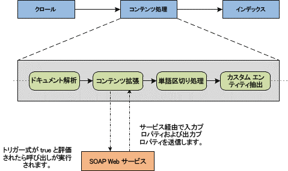

# コンテンツ エンリッチメント Web サービス呼び出しによるカスタム コンテンツ処理
SharePoint 2013のコンテンツ エンリッチメント Web サービス呼び出しについて説明します。この Web サービス呼び出しを使用することで、開発者はクロールされたアイテムの管理プロパティをコンテンツ処理中に変更するための外部 Web サービスを作成できます。
SharePoint 2013 の検索では、外部のコンテンツ エンリッチメント Web サービスの呼び出しによってインデックス作成が行われる前に、クロールされたアイテムの管理プロパティをユーザーが変更できます。コンテンツ処理中にアイテムの管理プロパティを変更できる機能は、データ クレンジング、エンティティ抽出、分類、タグ付けのようなタスクを実行する際に役立ちます。
  
    
    


**図 1. コンテンツ処理内のコンテンツ エンリッチメント**

  
    
    

  
    
    

  
    
    
図 1 に、コンテンツ処理コンポーネントで行われる処理の一部を示します。コンテンツ エンリッチメント Web サービスは、コンテンツ処理コンポーネント内部の Web サービス クライアントからの呼び出しを受け取るために作成できる SOAP ベースのサービスです。図 1 に基づき、Web サービス クライアントとは、コンテンツ処理コンポーネント内部のコンテンツ エンリッチメント オペレーターを指します。Web サービスとは、実装する SOAP Web サービスを指します。 この Web サービスは、コンテンツ処理コンポーネントからの構成可能なペイロードを受け取ります。その後、Web サービスから結果として生成される応答は、クロールされたアイテムにマージされたうえで、検索インデックスに追加されます。 この Web サービス クライアントは、入力プロパティまたは出力プロパティとして構成できる管理プロパティと連携して動作します。入力プロパティは Web サービスに送信されるプロパティであり、出力プロパティは Web サービスによって返されるプロパティです。管理プロパティには、非表示のものや、読み取り専用で Web サービスへの送信や Web サービスからの受信ができないものもあります。どの管理プロパティが読み取り専用であるかを確認する方法については、「 [コンテンツ エンリッチメント Web サービスのすべての読み取り専用管理プロパティをリストする方法](#SP15contentprocess_read-only_managed_properties)」を参照してください。
    
> **重要**
> コンテンツ エンリッチメント呼び出しステップは、単一の Web サービス エンドポイントのみを使用して構成できます。フォールト トレランスや、複数の実装をサポートするルーティング機能は、Web サービスを実装する開発者の側で対応する必要があります。また、開発者は、さまざまなエンドポイントに数多くの Web サービス実装をホストしている場合でも、構成で使用できるのは常にそれらのエンドポイントのいずれか 1 つのみです。 
  
    
    


## コンテンツ エンリッチメント Web サービス コントラクト
<a name="SP15webservcallout_enrich"> </a>

この Web サービス クライアントは、定義済みの動作を持つ SOAP (バージョン 1.1) RPC クライアントです。この Web サービス コントラクトには、次の特徴があります。
  
    
    

- コンテンツ処理コンポーネントは、HTTP 経由で SOAP RPC 呼び出しを構成可能なエンドポイントに送信します。
    
  
- このペイロードには、プロパティ オブジェクトの配列が含まれています。
    
  
- この Web サービスは、プロパティ オブジェクトの配列に対してカスタム ロジックを実行し、変更されたオブジェクトまたは新しいプロパティ オブジェクトの配列を返します。
    
  
- この Web サービスは、所定のタイムアウト時間内に Web サービス クライアントに応答を返す必要があります。
    
  
- このコントラクトの一部としてサポートされている特定の認証機構や暗号化機構は、存在しません。ただし、トランスポート機構に独自のセキュリティを適用できます。
    
  

## コンテンツ エンリッチメント Web サービス クライアントの構成
<a name="content_enrichment_configuration"> </a>

この Web サービス クライアントを構成するには、以下の Windows PowerShell コマンドレットを使用します。
  
    
    

-  [Get-SPEnterpriseSearchContentEnrichmentConfiguration](http://technet.microsoft.com/ja-jp/library/jj219783%28office.15%29.aspx)
    
  
-  [Set-SPEnterpriseSearchContentEnrichmentConfiguration](http://technet.microsoft.com/ja-jp/library/jj219659%28office.15%29.aspx)
    
  
-  [Remove-SPEnterpriseSearchContentEnrichmentConfiguration](http://technet.microsoft.com/ja-jp/library/jj219742%28office.15%29.aspx)
    
  
-  [New-SPEnterpriseSearchContentEnrichmentConfiguration](http://technet.microsoft.com/ja-jp/library/jj219502%28office.15%29.aspx)
    
  
表 1 に、上述の Windows PowerShell コマンドレットによって構成できるプロパティを示します。
  
    
    

**表 1. Windows PowerShell コマンドレットを使用してクライアント用に構成可能なプロパティ**


|**構成プロパティ**|**説明**|**既定値**|
|:-----|:-----|:-----|
|**Endpoint** <br/> |外部 Web サービスの URL を指定します。  <br/> |空。  <br/> |
|**InputProperties** <br/> |外部 Web サービスが受け取る管理プロパティです。  <br/> |空。  <br/> |
|**OutputProperties** <br/> |外部 Web サービスが返す管理プロパティです。  <br/> |空。  <br/> |
|**Timeout** <br/> |Web サービスがタイムアウトになる時間をミリ秒単位で指定します。  <br/> **FailureMode** に応じて、アイテムを処理できなくなったり、ULS ログへの警告の書き込みが行われたりします。 <br/> |5000 ミリ秒、有効な範囲は 100 ～ 30000。  <br/> |
|**SendRawData** <br/> |Web サービスへの生データの送信を有効または無効にします。  <br/> |False。  <br/> |
|**MaxRawDataSize** <br/> |Web サービスに送信される生データの最大サイズをキロバイト (KB) 単位で指定します。アイテムのバイナリ データがこの上限を超えた場合、そのアイテムは送信されません。このプロパティによって、 **InputProperties** の送信や **OutputProperties** の受信が妨げられることはありません。 <br/> |5120 KB。  <br/> |
|**FailureMode** <br/> |エラー発生時の Web サービス クライアントの動作を制御します。 **FailureMode** が **ERROR** に設定されている場合は、コンテンツ エンリッチメント処理中に発生したすべての問題によって該当する特定のアイテムに関する失敗のコールバックが送信されます。 <br/> **FailureMode** が **WARNING** の場合、Web サービスによる一切の変更なしにアイテムのインデックス作成が行われ、警告が ULS ログに書き込まれます。 <br/> |Error。  <br/> |
|**DebugMode** <br/> |このモードが **true** に設定されている場合、コンテンツ エンリッチメント クライアントは、プロパティが一切返されないものと予期して、すべての管理プロパティをクライアントに送信できます。構成されているすべての **Trigger** プロパティ、 **InputProperties** プロパティ、および **OutputProperties** プロパティは、無視されます。 <br/> |False。  <br/> |
|**Trigger** <br/> |クロールされたどのアイテムに対しても実行される **Boolean** 述語です。この述語が **true** と評価された場合、Web サービスにレコードが送信されます。それ以外の場合、アイテムは検索インデックスにパススルーされます。 <br/> |空。  <br/> |
   

### コンテンツ エンリッチメント Web サービスのすべての読み取り専用管理プロパティをリストする方法
<a name="SP15contentprocess_read-only_managed_properties"> </a>

一部の管理プロパティは、読み取り専用であり、Web サービスから出力できません。これらのプロパティは、 [Get-SPEnterpriseSearchServiceApplication](http://technet.microsoft.com/ja-jp/library/ff608050%28office.15%29.aspx) および [Get-SPEnterpriseSearchMetadataManagedProperty](http://technet.microsoft.com/ja-jp/library/ff607560%28office.15%29.aspx)Windows PowerShell コマンドレットを使用してリストできます (次の例を参照)。
  
    
    

```

$ssa = Get-SPEnterpriseSearchServiceApplication
Get-SPEnterpriseSearchMetadataManagedProperty -SearchApplication $ssa  | ?{$_.IsReadOnly -or $_.MappingDisallowed -or $_.DeleteDisallowed}

```


## Web サービス呼び出しを構成するためのトリガー条件について
<a name="SP15contentprocess_trigger"> </a>

トリガー条件とは、Web サービス呼び出しの構成に使用される式です。トリガー条件が **true** と評価された場合、Web サービス クライアントは該当するレコードの呼び出しを実行します。トリガー条件が **false** と評価された場合、Web サービス クライアントは呼び出しを実行せず、クロールされたアイテムを検索インデックスに渡します。また、トリガー条件が構成されていない場合は、すべてのアイテムが Web サービスに送信されます。
  
    
    
トリガー条件では、記述言語を使用して管理プロパティの値を参照します。Web サービス呼び出しを実行するタイミングを決定できるように、記述言語の演算子や関数を使用して、簡単なトリガー条件や複雑なトリガー条件を作成できます。 
  
    
    
表 2 に、トリガー条件の例を示します。
  
    
    

**表 2. コンテンツ エンリッチメント Web サービス呼び出しを構成するためのトリガー条件の例**


|**式**|**説明**|**要件**|
|:-----|:-----|:-----|
|MP1 > 2  <br/> |MP1 という管理プロパティの値が 2 より大きい場合、 **true** を返します。 <br/> |MP1 は数値型でなければなりません。  <br/> |
|IsNull(MP2)  <br/> |MP2 という管理プロパティがクロールされたアイテム用に存在しないか、空または null である場合、 **true** を返します。 <br/> |MP2 は任意の型をとることができます。  <br/> |
|StartsWith(MP1, "sample") AND MP2 != 18  <br/> |管理プロパティ MP1 の値が "sample" で始まっていて、管理プロパティ MP2 が 18 でない場合に **true** を返します。 <br/> |MP1 は **string** 型で、MP2 は数値型でなければなりません。 <br/> |
|IsDay(MP1, 2009, 12, 24)  <br/> |管理プロパティ MP1 に、2009 年 12 月 24 日に該当する **DateTime** が含まれているかどうかを確認します。 <br/> |MP1 は **DateTime** 型でなければなりません。 <br/> |
   
トリガーの式に使用できる要素と、サポートされている関数の一覧については、「 [SharePoint 2013 のトリガー表現構文](trigger-expressions-syntax-in-sharepoint-2013.md)」を参照してください。
  
    
    

## コンテンツ エンリッチメント外部 Web サービスの実装
<a name="SP15contentprocess_implement"> </a>

基本的な実装の場合は、以下の手順に従います。 
  
    
    

1.  `C:\\Program Files\\Microsoft Office Servers\\15.0\\Search\\Applications\\External` にある **Microsoft.Office.Server.Search.ContentProcessingEnrichment.dll** を参考用としてプロジェクトに含めます。
    
  
2. **IContentProcessingEnrichmentService** を Web サービスとして実装します。
    
  

## その他の技術情報
<a name="bk_addresources"> </a>


-  [SharePoint 2013 で検索を構成する](configure-search-in-sharepoint-2013.md)
    
  
-  [コンテンツ エンリッチメント Web サービス呼び出しによるカスタム コンテンツ処理](custom-content-processing-with-the-content-enrichment-web-service-callout.md)
    
  

