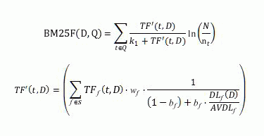
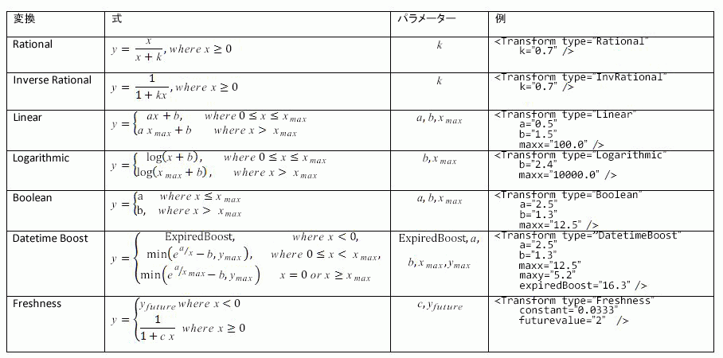
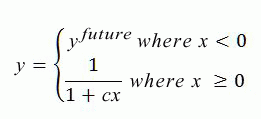
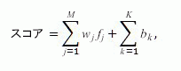
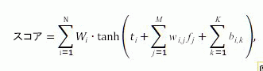
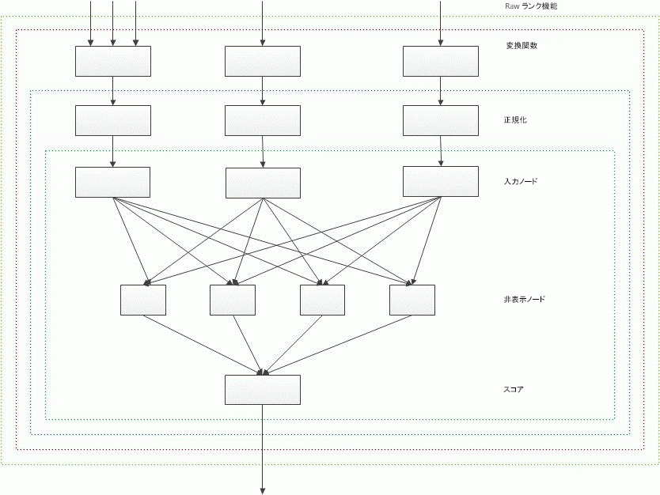

# SharePoint 2013 で関連性を向上させるためのランク付けモデルのカスタマイズ
SharePoint Server 2013 のランク機能を使用して、ランク付けモデルをカスタマイズして、ランク スコア (関連性ランク) を正確に計算することで、検索の関連性が向上します。
4 種類の方法で  [SharePoint 2013 の検索結果を並べ替え](sorting-search-results-in-sharepoint-2013.md)できます。そのうちの 1 つがランク スコアによる並べ替えです。ランク スコアで検索結果をソートする場合、SharePoint Server 2013 は検索結果セットの最上位に最も関連性の高い結果を配置します。
  
    
    

高いランク スコアを受信した場合、検索結果には関連性があるということです。ランク スコアは、ランク付けモデルを使った検索エンジンによって計算された具体的な数値のスコアです。ランク付けモデルは、一連のランク機能を含んでいる 1 つ以上のランク ステージのリストです。
ランク付けモデルは、検索エンジンがさまざまな要因を使って関連性ランクを計算する方法を定義します。これらの要因は、ランク付けモデル内でランク機能として表されます。関連性ランクの計算に使われる要因には以下に示しますが、これだけではありません。
  
    
    


- フルテキスト インデックスのクエリ用語の外観。ドキュメントのタイトルや本文などの情報が含まれます。
    
  
- ドキュメントのファイルの種類や URL の長さなど、特定のアイテムに関連付けられたメタデータ。
    
  
- 特定のアイテムを指している URL リンクに関連付けられたアンカー テキスト。
    
  
- 各アイテムのユーザー クリックに関する情報。
    
  
- ドキュメントの本文やタイトルのクエリ用語の近似。
    
  

## SharePoint ランク付けモデル テンプレートに基づく、ランク付けモデルのカスタマイズの開始
<a name="sp15_using_custom_ranking_model"> </a>

カスタマイズを簡単にするには、最初に SharePoint Server 2013 で既定のランク付けモデルの 1 つをテンプレートとして使用します。次に、そのランク付けモデルをデータ セットに合わせて変更します。
  
    
    
SharePoint Server 2013 には既定で 14 個のランク付けモデルが用意されています。 これらのランク付けモデルとその目的の詳細については、(TechNet 上の) 「 [ランク付けモデルとは](http://technet.microsoft.com/library/7c8ddec1-c8ff-4a90-afae-387b27a653f1.aspx#Ranking_Models)」を参照してください。
  
    
    

> **重要**
> 2013 年 8 月の SharePoint Server 2013 累積更新プログラムをインストールしている場合、カスタム ランク付けモデルのベース モデルとして、 **Search Ranking Model with Two Linear Stages** を使用することをお勧めします。 **Search Ranking Model with Two Linear Stages** は、ニューラル ネットワークの第 2 ステージの代わりに、線形の第 2 ステージを備えた **Default Search Model** のコピーです。
  
    
    

次の Windows PowerShell コマンドレットを使って、ランク付けモデルをカスタマイズします。
  
    
    

-  [Get-SPEnterpriseSearchRankingModel](http://technet.microsoft.com/ja-jp/library/ff607990.aspx)
    
  
-  [New-SPEnterpriseSearchRankingModel](http://technet.microsoft.com/ja-jp/library/ff607980.aspx)
    
  
-  [Remove-SPEnterpriseSearchRankingModel](http://technet.microsoft.com/ja-jp/library/ff608045.aspx)
    
  
-  [Set-SPEnterpriseSearchRankingModel](http://technet.microsoft.com/ja-jp/library/ff607940.aspx)
    
  

### 使用可能なすべてのランク付けモデルを一覧表示するには


1. 管理者として SharePoint 管理シェル を開きます。
    
  
2. Windows PowerShell コマンドレットの次のシーケンスを実行します。
    
  ```
  
$ssa = Get-SPEnterpriseSearchServiceApplication -Identity "Search Service Application"
$owner = Get-SPenterpriseSearchOwner -Level ssa
Get-SPEnterpriseSearchRankingModel -SearchApplication $ssa -Owner $owner
  ```


### テンプレートとして使用する既定のランク付けモデルを取得するには


1. 管理者として SharePoint 管理シェル を開きます。
    
  
2. Windows PowerShell コマンドレットの次のシーケンスを実行します。ここで、 *filename.xml*  は、ランク付けモデルを保存するファイル名です。
    
  ```
  
$ssa = Get-SPEnterpriseSearchServiceApplication
$owner = Get-SPenterpriseSearchOwner -Level ssa
$defaultRankingModel = Get-SPEnterpriseSearchRankingModel -SearchApplication $ssa -Owner $owner | Where-Object { $_.IsDefault -eq $True }
$defaultRankingModel.RankingModelXML > filename.xml

  ```

2013 年 8 月の SharePoint Server 2013 の累積更新プログラムをインストールする場合、次の手順を使って、カスタムのランク付けモデルのテンプレートとして使用する、2 つの線形ステージを持つ検索ランク付けモデルを取得できます。
  
    
    

### テンプレートとして使用する、2 つの線形ステージを持つ検索ランク付けモデルを取得するには


1. 管理者として SharePoint 管理シェル を開きます。
    
  
2. Windows PowerShell コマンドレットの次のシーケンスを実行します。ここで、 *filename.xml*  は、ランク付けモデルを保存するファイル名です。
    
  ```
  
$ssa = Get-SPEnterpriseSearchServiceApplication
$owner = Get-SPenterpriseSearchOwner -Level ssa 
$twoLinearStagesRankingModel = Get-SPEnterpriseSearchRankingModel -SearchApplication $ssa -Owner $owner -Identity 5E9EE87D-4A68-420A-9D58-8913BEEAA6F2 
$twoLinearStagesRankingModel.RankingModelXML > filename.xml

  ```


### カスタムのランク付けモデルを展開するには


1. 使用可能なランク付けモデルのリストから、テンプレートとして使用するランク付けモデルの GUID をコピーします (使用する Windows PowerShell コマンドレットのシーケンスについては、「 [使用可能なすべてのランク付けモデルを一覧表示するには](#sp15_list_available_ranking_models)」 を参照してください)。
    
  
2.  _<GUID>_ に対してステップ 1 でコピーした GUID を使って、Windows PowerShell コマンドレットの次のシーケンスを実行します。
    
  ```
  
$ssa = Get-SPEnterpriseSearchServiceApplication
$owner = Get-SPenterpriseSearchOwner -Level ssa
$rm = Get-SPEnterpriseSearchRankingModel -Identity <GUID> -SearchApplication $ssa -Owner $owner
$rm.RankingModelXML > myrm.xml 

  ```

3. XML エディタで  `myrm.xml` ファイルを編集します。 _RankModel2Stage_ 要素とすべての _RankingModel2NN_ 要素の **id** 属性に新しい GUID 値を使用する必要があります。新しい GUID 値を取得するには、たとえば次の Windows PowerShell コマンド、 `[guid]::NewGuid()` を使用します。
    
  
4. 次のコマンドを実行して、 [New-SPEnterpriseSearchRankingModel](http://technet.microsoft.com/ja-jp/library/ff607980.aspx) コマンドレットを使用して、新しいランク付けモデルを作成します。
    
  ```
  
$myRankingModel = Get-Content .\\myrm.xml
$myRankingModel = [String]$myRankingModel
$ssa = Get-SPEnterpriseSearchServiceApplication
$owner = Get-SPenterpriseSearchOwner -Level ssa
$newrm = New-SPEnterpriseSearchRankingModel -SearchApplication $ssa -Owner $owner -RankingModelXML $myRankingModel
  ```


### ランク詳細


> **重要**
> 便宜上、ランク詳細および付随する ExplainRank ページは、ユーザー独自のカスタム ランク モデルのチューニングとデバッグを支援する目的のためだけに提供されます。ランク詳細および付随する ExplainRank ページのコンテンツはサポート対象外で、将来のソフトウェア パッチおよび更新プログラムにおいて、予告なしに変更されることがあります。 
  
    
    

ランク詳細は、指定されたユーザー クエリと一致する単一のアイテムに関して、ランク スコアの計算に関する詳細情報を提供する XML ドキュメントです。 ランク詳細は、 **rankdetail** と呼ばれる特殊な管理プロパティに格納されます。
  
    
    
ランク付けモデルの各ランク機能には、ランク スコアの計算の詳細を表すランクの詳細に、個別の XML ノードがあります。ランク詳細は、検索結果が 100 アイテム以下のクエリに対してのみ提供されます。
  
    
    
概念上、ランク詳細の全体的な形式は、次の例のようになります。
  
    
    


```XML

<rank_log version='15.0.0000.1000' id='[internal guid of ranking model used for calculation]' >
    <query tree='[representation of user query used for ranking]'/>
    <stage type='linear'>
        [Details of rank calculation of the first ranking stage. One XML node for each rank feature.]
        <stage_model>
            [Definition of the first stage of the ranking model]
        </stage_model>
    </stage>
    <stage type='neural_net' >
        [Details of rank calculation of the second ranking stage. One XML node for each rank feature.]
        <stage_model>
            [Definition of the second stage of the ranking model]
        </stage_model>
    </stage>
</rank_log>
```

ランク詳細を取得するには、検索サービス アプリケーション (SSA) の管理者である必要があります。
  
    
    

### ランク詳細を取得するには


1. 管理者として SharePoint 管理シェル を開きます。
    
  
2. Windows PowerShell コマンドレットの次のシーケンスを実行し、 _<query_text>_ と _<url>_ に実際の値を代入します。
    
  ```
  
$app = Get-SPEnterpriseSearchServiceApplication
$searchAppProxy =  Get-spenterprisesearchserviceapplicationproxy | Where-Object { ($_.ServiceEndpointUri.PathAndQuery -like $app.Uri.PathAndQuery)}
$request = New-Object Microsoft.Office.Server.Search.Query.KeywordQuery($searchAppProxy)
$request.ResultTypes = [Microsoft.Office.Server.Search.Query.ResultType]::RelevantResults
$request.QueryText = "<query_text> AND path:""<url>"""
$request.SelectProperties.Add("rankdetail")
$searchexecutor = new-Object Microsoft.Office.Server.Search.Query.SearchExecutor 
$resultTables = $searchexecutor.ExecuteQuery($request) 
$resultTables[([Microsoft.Office.Server.Search.Query.ResultType]::RelevantResults)].Table

  ```


### ExplainRank ページを使用するランク スコア計算についての説明

SharePoint Server 2013 には **ExplainRank** ページが備わっています。それはレイアウト フォルダー ( `<searchCenter>/_layouts/15/`) にあります。このページには、指定の検索クエリ、ドキュメント ID、およびオプションのランク付けモデル ID に基づく、各ランク機能のランク スコアに関する詳細な情報が含まれています。 情報はランク詳細から取得されて解析されます。
  
    
    
 **ExplainRank** ページには、次の URL でアクセスします。
  
    
    
 `http://<searchCenter>/_layouts/15/ExplainRank.aspx?q={x}&amp;d={y}&amp;rm={z}`
  
    
    
ここで:
  
    
    

-  *x*  は、検索クエリです。
    
  
-  *y*  はドキュメント ID です。
    
  
-  *z*  は、オプションのランク付けモデル ID です。 ランク付けモデル ID が指定されていない場合、既定のランク付けモデルが使用されます。
    
  
ランク詳細の場合と同様に、 **ExplainRank** ページを参照するには、Search Service アプリケーション (SSA) の管理者でなければなりません。
  
    
    

## ランク付け機能を使ったランク付けモデルのチューニング
<a name="sp15_rank_features"> </a>

ランク機能は、ランク付けモデルに対して、チューニング ダイヤルのような働きをします。以降のセクションでは、既定のSharePoint Server 2013 ランク付けモデルで使用可能なランク機能と、ランク機能が関連性ランクの計算にどのように関係するかを説明します。
  
    
    

### BM25

BM25 ランク機能は、フルテキスト インデックスのクエリ用語の見た目に基づいて、ライテムをランク付けします。BM25 に対する入力には、フルテキスト インデックスの管理プロパティのどれでも使用できます。
  
    
    

> **メモ**
> このコンテキストで使われる BM25 ランク機能は、フィールド バージョン (BM25F) です。 
  
    
    

BM25 ランク機能は、次の式を使って関連性ランク スコアを計算します。
  
    
    

  
    
    

  
    
    
ここで:
  
    
    

-  _D_ は、タイトルや本文など、テキスト フィールドの一覧として表されるドキュメントです。
    
  
-  _Q_ は、クエリ用語 _t_ のリストとして表されるユーザー クエリです。
    
  
-  _S_ は、関連性ランク付けに関連するフィールドのリストを定義します。このリストは、ランク付けモデルによって定義されます。
    
  
-  _w_f は、フィールド  _f_ ∈ _S_ の相対的な重みを定義する数値です。この値は、ランク付けモデルによって定義されます。
    
  
-  _b_bf は、各フィールド  _f_ ∈ _S_ のドキュメント長の正規化を定義する数値です。
    
  
-  _TF_TFf _(t,D)_ は、ドキュメント _D_ のフィールド _f_ におけるクエリ用語 _t_ の出現回数です。
    
  
-  _DL_DLf _(D)_ は、ドキュメント _D_ のフィールド _f_ におけるワード総数です。
    
  
-  _N_ は、インデックス内のドキュメントの合計容量です。
    
  
-  _n_Nt は、プロパティの少なくとも 1 つに  _t_ という用語があるドキュメントの容量です。
    
  
-  _AVDL_AVDLf は、すべてのインデックス付きドキュメント全体の平均  _DL_f _(D)_ です。
    
  
-  _k_k1 は、スカラー パラメーターです。この値は、ランク付けモデルによって定義されます。
    
  
BM25 ランク機能に対してしようされる管理プロパティを、[ **検索可能の詳細設定の選択**] UI の既定のフルテキスト インデックスにマッピングする必要があります。
  
    
    
ユーザー クエリ内では、次の演算子の含まれるクエリ用語が、関連性ランク計算から除外されます。FQL の `NOT(…)`、KQL の  `NOT(…)`、および FQL の  `FILTER(…)` です。
  
    
    
さらに範囲内のクエリ用語 ( `title:apple AND body:orange` など) は、関連性ランク計算から除外されます。
  
    
    
 **BM25 ランク機能の定義例**
  
    
    


```XML

<BM25Main name="ContentRank" k1="1">
    <Layer1Weights>
        <Weight>0.26236235707678</Weight>
    </Layer1Weights>
    <Properties>
        <Property name="body" w="0.019391078235467" b="0.44402228898786156" propertyName="body" />
        <Property name="Title" w="0.36096989709360422" b="0.38179554361297785" propertyName="Title" />
        <Property name="Author" w="0.15808522836934547" b="0.13896219383271818" propertyName="Author" />
        <Property name="Filename" w="0.15115036355698144" b="0.96245017871125826" propertyName="Filename" />
        <Property name="QLogClickedText" w="0.3092664171701901" b="0.056446823262849853" propertyName="QLogClickedText" />
        <Property name="AnchorText" w="0.021768362296187508" b="0.74173561196103566" propertyName="AnchorText" />
        <Property name="SocialTag" w="0.10217215754116529" b="0.55968554315932328" propertyName="SocialTag" />
    </Properties>
</BM25Main>
```

 **BM25 ランク機能のランク詳細例**
  
    
    


```

<bm25 name='ContentRank'>
<schema pid_mapping='[1:content::7:%default] [2:content::1:%default] [3:content::5:%default] [56:content::2:%default] [100:content::3:link] [10:content::6:link] [264:content::14:link] ' pids_not_mapped=''/>
<query_term term='WORDS(content:integration, content:integrations, content:integrations)'>
    <index name='content' N='10035' n='8'
           avdl='1 2.98018 2.00427 1 1 2.39394 1 637.308 1 1 1 1 1 1 1 1 '>
        <group id='%default'
               ext_doc_id='55' int_doc_id='16' precalc='0' tf_prime='0.500486' weight='1'
               tf='0 1 1 0 0 0 0 11 0 0 0 0 0 0 0 0 '
               dl='0 4 9 0 0 2 0 1291 0 0 0 0 0 0 0 0 '/>
        <group id='link'/>
    </index>
    <rank score='2.37967' score_acc='2.37967' term_weight='7.13439'/>
</query_term>

<query_term term='WORDS(content:effort, content:efforts, content:efforts)'>
    <index name='content' N='10035' n='9'
           avdl='1 2.98018 2.00427 1 1 2.39394 1 637.308 1 1 1 1 1 1 1 1 '>
        <group id='%default'/>
        <group id='link'/>
    </index>
    <rank score='0' score_acc='2.37967' term_weight='7.01661'/>
</query_term>

<query_term term='PHRASE(content:fastserver, content:plugin)'>
    <index name='content' N='10035' n='3'
           avdl='1 2.98018 2.00427 1 1 2.39394 1 637.308 1 1 1 1 1 1 1 1 '>
        <group id='%default'
               ext_doc_id='55' int_doc_id='16' precalc='0' tf_prime='0.0399696' weight='1'
               tf='0 0 0 0 0 0 0 3 0 0 0 0 0 0 0 0 '
               dl='0 4 9 0 0 2 0 1291 0 0 0 0 0 0 0 0 '/>
        <group id='link'/>
    </index>
    <rank score='0.311896' score_acc='2.69157' term_weight='8.11522'/>
</query_term>
<final score='2.69157' transformed='2.69157' normalized='2.69157' hidden_nodes_adds='0.706166 '/>
</bm25>

```


#### 重みグループ

カスタム ランキング モデルでは、検索スキーマ内の同じ重みグループにマッピングされる管理プロパティを 2 つ以上持つことができます。このような場合、これらの管理プロパティの内容は、フルテキスト インデックスと組み合わされ、BM25 の計算で個別にランク付けすることはできません。その結果、検索スキーマ内の同じ重みグループにマッピングされた、管理プロパティの各グループ内の  _w_fおよび  _b_fパラメーターに対して、同じ値が設定されます。これを防ぐため、管理プロパティを、検索スキーマ内で使用可能な 16 の異なる重みグループのいずれかにマッピングしてください。
  
    
    
重みグループは、コンテキストとも呼ばれています。管理プロパティとそのコンテキストの関連性については、(TechNet 上の) 「 [検索スキームを使用して検索結果のランク付けに影響を与える](http://technet.microsoft.com/library/7c8ddec1-c8ff-4a90-afae-387b27a653f1.aspx#Ranking_Schema)」を参照してください。
  
    
    

### 静的

静的ランク機能は、検索インデックスに保存されている管理プロパティの数値に基づいてアイテムをランク付けします。静的ランク機能で関連性ランク計算に使われる管理プロパティの数値の型は  [Integer](https://msdn.microsoft.com/library/System.Integer.aspx) である必要があり、検索スキーマで [Refinable](https://msdn.microsoft.com/library/Microsoft.Office.Server.Search.Administration.ManagedProperty.Refinable.aspx) または [Sortable](https://msdn.microsoft.com/library/Microsoft.Office.Server.Search.Administration.ManagedProperty.Sortable.aspx) に設定する必要があります。複数の値をもつ管理プロパティを静的ランク機能と組み合わせて使用することは使用できません。
  
    
    
静的ランク機能を他のランク機能と集約する前に、各静的ランク機能は 1 回の変換により事前処理されます。表 1 に、サポートされているすべての変換関数を一覧表示します。
  
    
    

**表 1. 静的ランク機能および近接ランク機能でサポートされている変換関数**

  
    
    

  
    
    

  
    
    
 **静的ランク機能の定義例**
  
    
    


```XML

<Static name="clickdistance" default="5" propertyName="clickdistance">
    <Transform type="InvRational" k="0.27618729159042193" />
    <Layer1Weights>
        <Weight>0.616326852981262</Weight>
    </Layer1Weights>
</Static>

```

 **静的ランク機能のランク詳細例**
  
    
    


```

<static_feature name='clickdistance' property_name='clickdistance'
    used_default='1' raw_value='5' raw_value_transformed='5' 
    transformed='0.420003' normalized='0.420003'
    hidden_nodes_adds='0.258859 '/>

```


### バケット処理された静的

バケット処理された静的ランク機能では、ファイル タイプと言語に基づいて、ドキュメントがランク付けされます。ランク付けモデル内のバケット処理された静的ランク機能の定義は、ランク機能が線形モデルに含まれるか、ニューラル ネットワークに含まれるかによって決まります。次の例は、線形モデルにのみ適用されます。ニューラル ネットワークの場合、各バケットに対する  `<Add>` 属性の数は、ニューラル ネットワーク内の非表示ノードの数と一致する必要があります。
  
    
    
バケット処理された静的ランク機能で関連性ランク計算に使われる管理プロパティの数値の型は  [Integer](https://msdn.microsoft.com/library/System.Integer.aspx) である必要があり、検索スキーマで [Refinable](https://msdn.microsoft.com/library/Microsoft.Office.Server.Search.Administration.ManagedProperty.Refinable.aspx) または [Sortable](https://msdn.microsoft.com/library/Microsoft.Office.Server.Search.Administration.ManagedProperty.Sortable.aspx) に設定する必要があります。複数の値を持つ管理プロパティをバケット処理された静的ランク機能と組み合わせて使用することはできません。
  
    
    
 **ファイル タイプに対する、バケット処理された静的ランク機能定義の例**
  
    
    
各ドキュメントには、コンテンツ処理コンポーネントが検出し、検索インデックスに 0 を底とする整数値として保存された、関連するファイル タイプが存在します。バケット処理された静的ランク機能を使用して、ファイル タイプに基づいてドキュメントをランク付けした場合、各ドキュメント タイプは、特定の関連性ランク スコアと関連付けられます。たとえば、次の定義では、バケット **2** は .ppt ドキュメントに対応します。ノード `<Add>0.680984743282165</Add>` はすべての .ppt ドキュメントに対する関連性ランク スコアに追加される、追加のランク ポイントを定義します。
  
    
    


```XML

<BucketedStatic name="InternalFileType" default="0" propertyName="InternalFileType">
    <Bucket name="Html" value="0">
        <HiddenNodesAdds>
            <Add>0.464062832328107</Add>
        </HiddenNodesAdds>
    </Bucket>
    <Bucket name="Doc" value="1">
        <HiddenNodesAdds>
            <Add>0.551558196047853</Add>
        </HiddenNodesAdds>
    </Bucket>
    <Bucket name="Ppt" value="2">
        <HiddenNodesAdds>
            <Add>0.680984743282165</Add>
        </HiddenNodesAdds>
    </Bucket>
    <Bucket name="Xls" value="3">
        <HiddenNodesAdds>
            <Add>-0.143152682829863</Add>
        </HiddenNodesAdds>
    </Bucket>
    <Bucket name="Xml" value="4">
        <HiddenNodesAdds>
            <Add>-1.29219869408375</Add>
        </HiddenNodesAdds>
    </Bucket>
    <Bucket name="Txt" value="5">
        <HiddenNodesAdds>
            <Add>-0.456669562992298</Add>
        </HiddenNodesAdds>
    </Bucket>
    <Bucket name="ListItems" value="6">
        <HiddenNodesAdds>
            <Add>0.170944938307345</Add>
        </HiddenNodesAdds>
    </Bucket>
    <Bucket name="Message" value="7">
        <HiddenNodesAdds>
            <Add>-0.0666769377412764</Add>
        </HiddenNodesAdds>
    </Bucket>
    <Bucket name="Image" value="8">
        <HiddenNodesAdds>
            <Add>0.106988843357609</Add>
        </HiddenNodesAdds>
    </Bucket>
</BucketedStatic>
```

 **ドキュメント言語に対する、バケット処理される静的ランク機能定義の例**
  
    
    
コンテンツ処理コンポーネントは、各ドキュメントの言語を自動的に検出してから、ドキュメントを検索インデックスに追加します。バケット処理された静的ランク機能を使って、言語に基づいてドキュメントをランク付けする場合、自動検出されたドキュメントの言語がクエリの言語と一致するかどうかに基づいて、ランク スコアの計算方法を定義できます。
  
    
    
クエリ実行時に、ユーザーの言語に関する情報が、クエリ プロパティとして検索エンジンに書き込まれます。
  
    
    

### 近接性

近接ランク機能は、フルテキスト インデックス内のクエリ用語間の距離に基づいて、アイテムをランク付けします。2 つのクエリ用語がフルテキスト インデックス内の同じ管理プロパティ内に存在する場合、ランク スコアは大きく上昇します。近接計算は、ディスク アクティビティおよび CPU 消費の観点から見ると、コストがかかります。その結果、近接ブーストは既定の SharePoint Server 2013 ランク モデル (使用できる場合) の第 2 ステージ中にだけ実行されます。
  
    
    
表 2 に記述されている属性によって制御される、複数の異なるオプションを使用して、近接ランク機能を評価できます。
  
    
    

**表 2. 近接ランク機能の評価を制御する属性**


|**属性**|**説明**|
|:-----|:-----|
| `isExact=0` <br/> |このモードの場合、近接アルゴリズムは、ドキュメント内のクエリ用語のサブセットの最小スパン (距離) の検索を試みます。  <br/> 近接アルゴリズムでは、ユーザー クエリの表示順と同じ順番でクエリ用語が含まれるフラグメントが考慮されます。すべてのクエリ用語に対してフラグメントがまったく存在しない場合、近接アルゴリズムは、フラグメントにクエリ用語が 1 つしか含まれないと見なします。フラグメントの長さが  `maxMinSpan` を超えるまで、毎回クエリ用語の数を減らしながらこのプロセスが繰り返されます。 <br/>  `maxMinSpan` は近接ランク機能内の属性で、フラグメントの最大長を定義するしきい値を指定します。 <br/> 理想的なフラグメントとは、すべてのクエリ用語を含みながら、 `maxMinSpan` より小さいフラグメントです。 <br/> |
| `isExact=1` <br/> |このモードでは、近接アルゴリズムは、すべてのクエリ用語 (またはクエリ フレーズ) を含む、ドキュメントの連続スニペットの検出を試みます。  <br/> |
| `isDiscounted` <br/> |この属性は、 `isExact=1` と `isExact=0` の両方に適用できます。 `isDiscounted` を有効にすると、近接値に次の比率が乗算されます。(最適フラグメントまたは正確なヒットの発生回数) / (このコンテキスト内で最もまれなクエリ用語の発生回数) <br/> |
| `proximity="complete"` <br/> |このモードでは、近接ランク機能は、ユーザーのクエリ テキスト全体が特定の管理プロパティ内で発生するドキュメントだけをブーストします。  <br/> |
| `proximity="perfect"` <br/> |このモードは  `complete` モードに似ていますが、 **title** などの短いフィールドに適用されます。 近接ランク機能は、ユーザー クエリテキスト全体が特定の管理プロパティ内の **title** と正確に一致するドキュメントだけをブーストします。 **title** にユーザー クエリ以外の追加用語が含まれる場合、近接アルゴリズムでこのアイテムは考慮されません。 <br/> |
| `default` <br/> |この属性は、単一用語クエリにだけ適用されます。クエリ用語を含むアイテムの場合、 `default` 値が近接ランク機能によって出力されたランク スコアとして使われます。 <br/>  `perfect` 近接は、このルールの例外です。 `perfect` 近接の場合、既定値が使用されることはありません。その代わり、単一用語クエリが他のクエリと同じように処理されます。 <br/> |
   
 **近接ランク機能の定義例**
  
    
    
次の例は、既定の SharePoint Server 2013 ランク モデルから抜粋しました。 このモデルでは、近接機能は、第 2 ステージ計算の一部にすぎません。この計算にはニューラル ネットワークが関与しています。 このため、この例には複数の重み要素  `<LayerWeights>` が含まれています。これは、ニューラル ネットワークの非表示レイヤー内のニューロンの数に相当します。
  
    
    


```XML

<MinSpan name="Title_MinSpanExactDiscounted" default="0.43654446989518952" maxMinSpan="1" isExact="1" isDiscounted="1" propertyName="Title">
    <Normalize SDev="0.20833333333333334" Mean="0.375" />
    <Transform type="Linear" a="1" b="0" maxx="10000" />
    <Layer1Weights>
        <Weight>0.0399835450090479</Weight>
        <Weight>-0.00693681478614802</Weight>
        <Weight>0.0286196612755843</Weight>
        <Weight>0.11775902923563</Weight>
        <Weight>0.0885860088190342</Weight>
        <Weight>0.102859503886488</Weight>
    </Layer1Weights>
</MinSpan>

```

近接ランク機能で使われる管理プロパティを、検索スキーマ内の既定のフルテキスト インデックスにマッピングする必要があります。
  
    
    
 **近接ランク機能のランク詳細例**
  
    
    


```XML

<proximity_feature name='Title_MinSpanExactDiscounted' pid='2'
                   proximity_type='exact_discounted' 
                   used_default='0' raw_value='0' transformed='0'
                   normalized='-1.8' 
                   hidden_nodes_adds='-0.0719704 0.0124863 -0.0515154 -0.211966 -0.159455 -0.185147 ' />

```


### 動的

動的ランク機能は、クエリ プロパティが指定された管理プロパティと一致するかどうかに応じて、アイテムをランク付けします。一致がある場合、アイテムのランク スコアは特定の値と乗算され、対象となる特定のアイテムを識別します。重み属性は、この機能がランク スコア全体にどの程度の影響を与えるかを制御します。
  
    
    

> **メモ**
> 動的ランク機能はカスタマイズできません。内部使用専用です。ただし、2013 年 8 月の SharePoint Server 2013 累積更新プログラムをインストールした場合、AnchortextComplete ランク機能は、既定のランク モデルに含まれる、カスタマイズ可能な動的ランク機能となります。 
  
    
    

 **動的ランク機能の定義例**
  
    
    


```XML

<Dynamic name="AnchortextComplete" pid="501" default="0" property="AnchortextCompleteQueryProperty">
    <Transform type="Rational" k="0.91495552365614574" />
        <Layer1Weights>
            <Weight>0.715419978898093</Weight>
        </Layer1Weights>
</Dynamic>
```


### Freshness

既定の SharePoint 2013 ランク付けモデルは、検索結果のランクを freshness に基づいてアップさせません。これを実現するには、freshness 変換関数を使って、 **DateTimeUtcNow** クエリ プロパティを備えた **LastModifiedTime** 管理プロパティからの情報を組み合わせる、新しい静的ランク機能を追加します。 freshness 変換関数は、この freshness ランク機能に使用できる唯一の変換です。これはこの関数が内部表現から日数へアイテムの経過時間を変換するためです。
  
    
    
freshness 変換は、次の式に基づいています。
  
    
    

  
    
    

  
    
    
ここで:
  
    
    

-  _c_ と _y_futureは、ランク付けモデルで定義されます。
    
  
-  _x_ は、アイテムの経過時間 (日数) です。
    
  
-  _y_.futureの値は、 **LastModifiedTime** が現在の日付と時間より大きいアイテムに対する freshness ブーストを定義します。
    
  
 **freshness ランク機能の定義例**
  
    
    


```XML

<Static name='freshboost' propertyName='LastModifiedTime' default='-1' convertPropertyToDatetime='1' rawValueTransform='compare' property='DateTimeUtcNow'>
    <Transform type="Freshness" constant="0.0333" futureValue="2" />
    <Layer1Weights>
        <Weight>1.0</Weight>
    </Layer1Weights>
</Static>
```

 **(約 580 日が経過した) 古いドキュメントを使った、freshness ランク機能のランク詳細例**
  
    
    


```XML

<static_feature name='freshboost' property_name='LastModifiedTime' raw_value_transform='compare' used_default='0' property_value_found='1' property_value='9807115930137649186' raw_value='9.80661e+018' raw_value_transformed='-5.03135e+014' transformed='0.0490396' normalized='0.0490396' hidden_nodes_adds='0.0490396 '/>

```

 **(経過時間が 1 日未満の) 新しいドキュメントを使った、freshness ランク機能のランク詳細例**
  
    
    


```XML

<static_feature name='freshboost' property_name='LastModifiedTime' raw_value_transform='compare' used_default='0' property_value_found='1' property_value='9807115934928966979' raw_value='9.80712e+018' raw_value_transformed='-2.55529e+011' transformed='0.990248' normalized='0.990248'hidden_nodes_adds='0.990248 '/>

```


## ランク機能の集約
<a name="sp15_aggregation_of_rank_features"> </a>

ランク付けモデルは、ランク スコアの計算に関わると見なされる様々なランク機能から構成されます。
  
    
    

### 2 ステージのランク付けモデル

ランク付けモデルには 2 つのランク ステージが存在します。最初のステージでは、ランク付けモデルは比較的コストが安い機能を適用して、結果のランク総計を取得します。第 2 ステージでは、ランク付けモデルは追加のランク機能とより高額なランク機能を、最高のランク スコアが付けられたアイテムに適用します。
  
    
    
SharePoint Server 2013 の既定のランク付けモデルは、2 ステージのランク付けモデルの例です。 このモデルでは、第 1 ステージによって得られた最高のランク スコアをもつ上位 1,000 個のアイテムで、第 2 ステージが実行されます。
  
    
    
第 1 ステージのランク付けプロセスが完了すると、第 2 ステージから除外されたアイテムを含め、検索エンジンがすべてのアイテムをソートし直します。その結果、第 2 ステージのアイテムのランク スコアは、第 1 ステージのアイテムと比較した場合、通常は低くなります。
  
    
    
ただし、検索エンジンによりアイテムが正しくソートされたことを確認するには、第 2 ステージのアイテムのランク スコアは、第 1 ステージのアイテムよりも高い必要があります。 このジレンマを解決するため、第 2 ステージのランク スコアはブーストされます。検索エンジンは、ランク機能の組み合わせに基づいて、計算を自動実行します。
  
    
    

> **メモ**
> 2013 年 8 月の SharePoint Server 2013 累積更新プログラムをインストールしている場合、既定のランク付けモデルは線形の第 1 ステージとニューラル ネットワークの第 2 ステージを使用します。 **The Search Ranking Model with Two Linear Stages**は、2 つの線形ステージを持つ **Default Search Model** のコピーです。 線型モデルはニューラル ネットワークを含むモデルと比べてチューニングが簡単なため、カスタムのランク付けモデルの基本モデルとして、このモデルを使用することをお勧めします。
  
    
    


#### 線形モデル

線形モデルは、ランク機能から得られたランク スコアの線形の組み合わせを定義します。
  
    
    
線形モデルが提供するランク スコアは、次の式を使って計算されます。
  
    
    

  
    
    

  
    
    

  
    
    

  
    
    
ここで:
  
    
    

-  _score_ は、線型モデルが生成する出力ランク スコアです。
    
  
-  _M_ は、バケット処理された静的ランク機能を除いた、ランク機能の数です。
    
  
-  _K_ は、バケット処理された静的ランク機能の数です。
    
  
-  _f_fj は、 変換後の _j_ 番目の機能の値です。
    
  
-  _w_j 線形結合に対する _j_ 番目の機能の貢献度です。
    
  

#### ニューラル ネットワーク

ニューラル ネットワークは、ランク機能から得られたランク スコアの非線形の組み合わせを定義します。現在、SharePoint Server 2013 は、最大 8 つのニューロンを持つ 1 つの非表示レイヤーに制限されたニューラル ネットワークをサポートします。
  
    
    
ニューラル ネットワークが生成するランク付けスコアは、次の式を使って計算されます。
  
    
    

  
    
    

  
    
    

  
    
    

  
    
    
ここで、
  
    
    

-  _score_ は、ニューラル ネットワークが生成する出力ランク スコアです。
    
  
-  _N_ は、ニューラル ネットワークの非表示レイヤー内のニューロンの数です。
    
  
-  _M_は、バケット処理された静的ランク機能を除いた、ランク機能の数です。
    
  
-  _K_ は、バケット処理された静的ランク機能の数です。
    
  
-  _W_i _i_ 番目の非表示のニューロンの貢献度です。
    
  
-  _t_i _i_ 番目の非表示のニューロンのしきい値です。
    
  
-  _W_i,j _i_ 番目の非表示のニューロンの _j_ 番目の機能の貢献度です。
    
  
-  _b_i,k _k_ 番目のバケット処理された静的機能から _i_ 番目の非表示のニューロンへの追加です。
    
  
2 つのレイヤーのニューラル ネットワーク使ったランク スコア計算の全体的なスキーマを、次の図に示します。この図では、バケット処理された静的ランク機能が考慮されていません。バケット処理された静的ランク機能は、カスタム値を直接非表示ノードに追加することでニューラル ネットワークに寄与します。変換や正規化は行われません。
  
    
    

**図 1. 2 つのレイヤーのニューラル ネットワークを使ったランク スコア計算の全体的なスキーマ**

  
    
    

  
    
    

  
    
    

  
    
    

  
    
    

## BM25 の事前計算と静的ランク機能
<a name="sp15_precalculation_BM25_static_rank_features"> </a>

ランク付けモデルでは、アイテム内で頻繁に実行されるクエリ用語のクエリ遅延を改善するための事前計算を行うと、BM25 と静的ランク機能でメリットがあります。このクエリ遅延の改善は、検索インデックスが使用するディスク容量と CPU の使用率の両方で、追加のインデックスを作成することで実現されます。
  
    
    
事前計算が使用できるのは、ランク付けモデルの第 1 ステージだけです。そのため、事前計算が有効の場合、第 1 ステージのランク詳細は完了しません。
  
    
    
事前計算を有効にするには、ランク ステージ定義で  `precalcEnabled` 属性を **1** に設定します。ランク付けモデルでは、事前計算を 1 回だけ使用できます。
  
    
    

## クエリ プロパティ
<a name="sp15_query_properties_ranking"> </a>

クエリ プロパティは、ランク スコア計算に役立つ追加情報を提供するランク付けメカニズムです。たとえば、クエリ実行時に、クエリ プロパティは時刻と日付になることがあります。この情報は freshness ランク機能で使用できます。表 3 にランク付けに使用可能なクエリ プロパティを一覧表示します。クエリ プロパティを構成することはできません。
  
    
    

**表 3. ランク付け用のクエリ プロパティ**


|**クエリ プロパティ**|**説明**|
|:-----|:-----|
|AnchortextCompleteQueryProperty  <br/> |アンカー テキスト全体をブーストします。  <br/> |
|DateTimeUtcNow  <br/> |現在の日付と時刻。このクエリ プロパティは、freshness ランク機能で使うことができます。  <br/> |
|DetectedLanguageRanking  <br/> |クエリ言語の ID。このクエリ プロパティは、 **DetectedLanguageRanking** ランク機能によって使われます。 <br/> |
|PersonalizationData  <br/> |個人用データをランク付けします。  <br/> |
|RecommendedforQueryProperty  <br/> |ランクの推奨。  <br/> |
   

## 例 1: 単一の静的ランク機能を含む線形の 1 ステージを使用する基本ランク付けモデル
<a name="sp15_example_1_ranking"> </a>

このランク付けモデルでは、顧客が **CustomRating** という名前の管理プロパティを作成したことを前提としています。静的ランク機能では、 **CustomRating** が [Integer](https://msdn.microsoft.com/library/System.Integer.aspx) のデータ型であり、検索スキーマで [Sortable](https://msdn.microsoft.com/library/Microsoft.Office.Server.Search.Administration.ManagedProperty.Sortable.aspx) または [Refinable](https://msdn.microsoft.com/library/Microsoft.Office.Server.Search.Administration.ManagedProperty.Refinable.aspx) として設定する必要があります。結果セット内の各ドキュメントについて、このランク付けモデルが生成するランク スコアは、そのドキュメントの **CustomRating** の値と等しくなります。このモデルの効果は、 **CustomRating** 管理プロパティのすべての検索結果の並び順 (降順) と似たものになります。
  
    
    

```XML

<?xml version="1.0"?>
<RankingModel2Stage name="RankModel1"
    description="Rank model -- example 1"
    id="D3FAF680-D213-4916-A95A-0409031643F8"
    xmlns="urn:Microsoft.Search.Ranking.Model.2NN">
    <RankingModel2NN id="619F2ECD-24F7-41CD-824C-234FC2EFDDCA" precalcEnabled="0" >
        <HiddenNodes count="1">
            <Thresholds>
                <Threshold>0</Threshold>
            </Thresholds>
            <Layer2Weights>
                <Weight>1</Weight>
            </Layer2Weights>
        </HiddenNodes>
        <RankingFeatures>
            <Static name="CustomRating" propertyName="CustomRating" default="0.0">
                <Transform type="Linear" a="1" b="0" maxx="1000"/>
                    <Layer1Weights>
                        <Weight>1.0</Weight>
                    </Layer1Weights>
            </Static>
        </RankingFeatures>
    </RankingModel2NN>
</RankingModel2Stage>
```


## 例 2: 1 つの線形ステージと 4 つのランク機能を持つ、より複雑なランク付けモデル
<a name="sp15_example_2_ranking"> </a>

1 つの線形ステージがあるこのランク付けモデルには、以下の 4 つのランク機能が含まれています。
  
    
    

-  `BM25` このランク付け機能は、管理プロパティ **Title** と **body** に基づいています。 **title** の `w` 属性は、 **Title** のクエリ用語のヒットが、 **body** のクエリ用語のヒットより 2 倍重要となるように設定されます。
    
  
-  `UrlDepth` このランク機能は **UrlDepth** 管理プロパティに基づいています。このプロパティは既定で、SharePoint インストールで使用できます。 **UrlDepth** には、ドキュメントの URL の円記号 (\\) の数が含まれます。Inverse Rational ( `InvRational`) 変換では、URL が短いドキュメントにより高いランク スコアが付けられます。
    
  
-  `TitleProximity` このランク機能は、一部のクエリ用語がドキュメントの **title** 内で相互に近い場所で発生すると、ドキュメントをブーストします。
    
  
-  `InternalFileType` このランク機能は、HTML、DOC、XLS、または PPT の各タイプのドキュメントをブーストします。ランク モデルの定義内のバケット名は、読みやすくするためだけに提供されます。
    
    > **メモ**
      >  `InternalFileType` 管理プロパティ (既定で使用可能) は値 0 ( `0`) を使って、HTML ドキュメント (DOC の場合は値  `1`、XLS の場合は値  `2` など) をエンコードします。 **FileType** 管理プロパティで使われるすべてのファイル タイプのリストについては、既定の SharePoint ランク モデルの定義を参照してください。

```XML

<?xml version="1.0"?>
<RankingModel2Stage name=" RankModel2"
                    description="Rank model -- example 2"
                    id="DE48A3A1-67CE-44A2-9712-E8A5128787CF"
                    xmlns="urn:Microsoft.Search.Ranking.Model.2NN">
    <RankingModel2NN id="A0A030D1-805D-437E-A001-CC151ED7473A" precalcEnabled="0">
        <HiddenNodes count="1">
            <Thresholds>
                <Threshold>0</Threshold>
            </Thresholds>
            <Layer2Weights>
                <Weight>1</Weight>
            </Layer2Weights>
        </HiddenNodes>
        <RankingFeatures>
            <BM25Main name="BM25" k1="1">
                <Layer1Weights>
                    <Weight>1</Weight>
                </Layer1Weights>
                <Properties>
                    <Property name="Title" propertyName="Title" w="2" b="0.5" />
                    <Property name="body" propertyName="body" w="1" b="0.5" />
                </Properties>
            </BM25Main>
            <Static name="UrlDepth" propertyName="UrlDepth" default="1">
                <Transform type="InvRational" k="1.5"/>
                <Layer1Weights>
                    <Weight>0.5</Weight>
                </Layer1Weights>
            </Static>
            <MinSpan name="TitleProximity" propertyName="Title" default="0" maxMinSpan="1" isExact="0" isDiscounted="0">
                <Normalize SDev="1" Mean="0"/>
                <Transform type="Linear" a="1" b="-0.5" maxx="2"/>
                <Layer1Weights>
                    <Weight>1.2</Weight>
                </Layer1Weights>
            </MinSpan>
            <BucketedStatic name="InternalFileType" propertyName="InternalFileType" default="0">
                <Bucket name="http" value="0">
                    <HiddenNodesAdds>
                        <Add>1.5</Add>
                    </HiddenNodesAdds>
                </Bucket>
                <Bucket name="doc" value="1">
                    <HiddenNodesAdds>
                        <Add>2.5</Add>
                    </HiddenNodesAdds>
                </Bucket>
                <Bucket name="ppt" value="2">
                    <HiddenNodesAdds>
                        <Add>0.5</Add>
                    </HiddenNodesAdds>
                </Bucket>
                <Bucket name="xls" value="3">
                    <HiddenNodesAdds>
                        <Add>-3.5</Add>
                    </HiddenNodesAdds>
                </Bucket>
            </BucketedStatic>
        </RankingFeatures>
    </RankingModel2NN>
</RankingModel2Stage>

```


## その他の技術情報
<a name="bk_addresources"> </a>


-  [SharePoint 2013 の検索](search-in-sharepoint-2013.md)
    
  
-  [キーワード クエリ言語 (KQL) 構文のリファレンス](keyword-query-language-kql-syntax-reference.md)
    
  
-  [FAST クエリ言語 (FQL) 構文のリファレンス](fast-query-language-fql-syntax-reference.md)
    
  
-  [SharePoint Server 2013 での検索結果の概要](http://technet.microsoft.com/library/7c8ddec1-c8ff-4a90-afae-387b27a653f1.aspx)
    
  
-  [Ranking Model Tuning アプリ](http://office.microsoft.com/ja-jp/office365-sharepoint-online-enterprise-help/create-a-custom-ranking-model-by-using-the-ranking-model-tuning-app-HA104104860.aspx?CTT=1) を使用して、カスタム ランキング モデルを作成する
    
  

  
    
    

