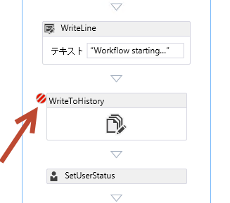
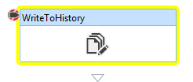
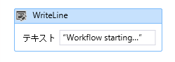
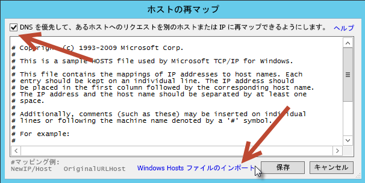
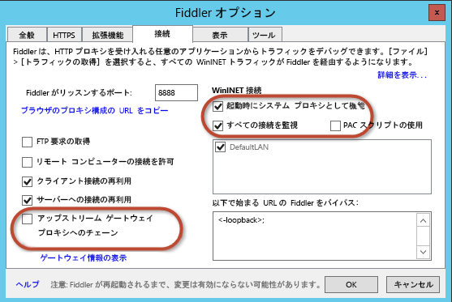
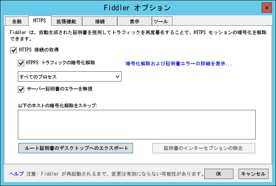
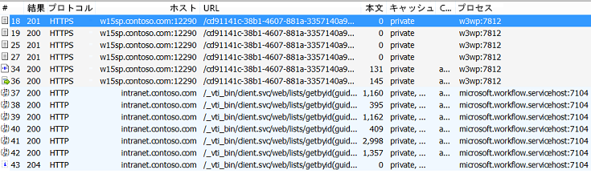
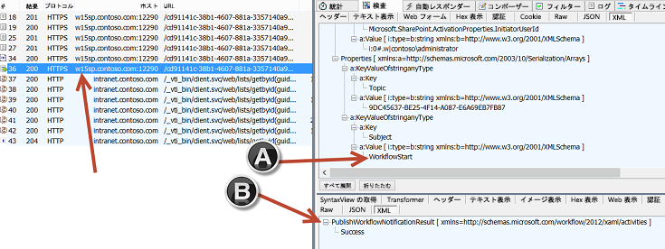
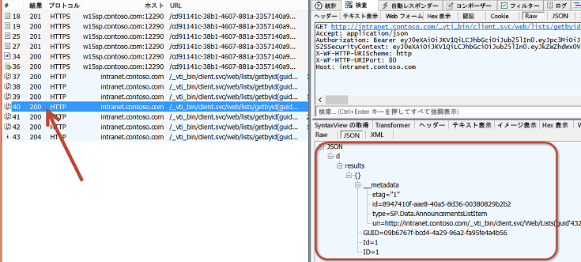
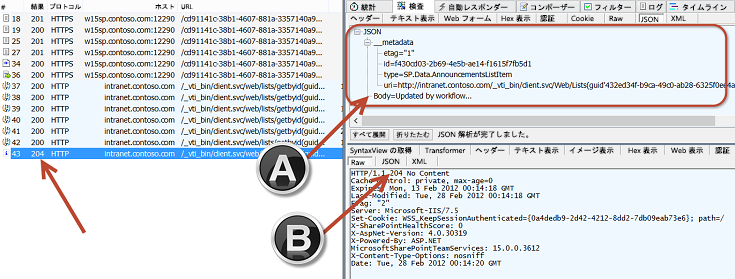

# SharePoint Server 2013 ワークフローをデバッグする
SharePoint Server 2013 がすべてのワークフロー処理および管理を現在ではどのようにしてワークフロー マネージャー 1.0 に依存しているのかを説明し、デバッグ オプションについて説明します。
 **執筆者:** [Andrew Connell](http://social.msdn.microsoft.com/profile/andrew%20connell%20%5bmvp%5d/)、 [www.AndrewConnell.com](http://www.andrewconnell.com)
  
    
    


## 

Microsoft では、SharePoint Server 2013 に以前の SharePoint とは異なるアプローチを採用しています。ワークフロー チームは Azure チームと協力し、ワークフロー マネージャーという新しい製品を作成しました。ワークフロー マネージャーは最新バージョンの Windows Workflow Foundation ランタイムと必要なすべてのサービスを使用可能かつスケーラブルな方法でホストします。パフォーマンスとスケーラビリティのために Microsoft Azure のサービス バスが活用されており、展開すると、Office 365 と同様に、社内展開でクラウドとまったく同じように実行されます。その後、SharePoint 2013 はすべてのワークフロー実行と関連タスクをワークフロー マネージャー ファームに渡すように接続および構成されます。
  
    
    
このアーキテクチャの変更により、顧客がカスタム ワークフローの作成に使用していた 2 つの主要なワークフロー作成ツール (SharePoint Designer 2013 と Visual Studio 2012) に対していくつかの変更が必要になりました。しかし、SharePoint 2007 と SharePoint 2010 で開発者が採用したデバッグ方法は引き続き適用されます。新しいアーキテクチャでは、SharePoint Designer 2013 または Visual Studio 2012 のいずれかを使用して作成されたワークフローにおいて、Fiddler を使用して SharePoint Server 2013 とワークフロー マネージャー間のトラフィックを監視できる新しいオプションが可能になります。
  
    
    

## SharePoint 2013 ワークフロー デバッグの概要

SharePoint Server 2013 用に作成されたカスタム ワークフローのデバッグは、SharePoint 2010 や SharePoint 2007 などの以前のバージョンのものと似ています。使用できる一部のデバッグ オプションは、ワークフローの作成に使用するツール (SharePoint Designer 2013 または Visual Studio 2012) と、SharePoint の展開の種類 (社内または (ホストされた) Office 365 など) によって異なります。
  
    
    
ワークフロー作成者が利用できるワークフローのデバッグ方法は次の 4 つです。
  
    
    

- ワークフローの履歴リストにログを記録する
    
  
- ブレークポイントを設定する
    
  
- デバッグ メッセージをコンソールに送信する
    
  
- Fiddler を使用して SharePoint とワークフロー マネージャー間のトラフィックを監視する
    
  
それぞれのオプションには長所と短所があります。2 つのワークフロー作成ツール (SharePoint Designer 2013 または Visual Studio 2012) を使用した場合にできることとワークフローの展開の種類 (社内または Office 365) を理解しておくと役に立ちます。次の表は、作成ツールおよび展開先と、各シナリオで利用できるオプションを示しています。
  
    
    


||**SharePoint 2013 社内**|**Office 365 SharePoint Online**|
|:-----|:-----|:-----|
|SharePoint Designer 2013, SharePoint Online  <br/> | 履歴リストに記録する <br/>  Fiddler <br/> | 履歴リストに記録する <br/> |
|Visual Studio 2012  <br/> | 履歴リストに記録する <br/>  ブレークポイント <br/>  コンソールのデバッグ メッセージ <br/>  Fiddler <br/> | 履歴リストに記録する <br/>  ブレークポイント <br/> |
   

## ワークフローの履歴リストを使用したデバッグ

あらゆる種類の SharePoint 2013 展開で利用できる唯一のデバッグ オプションは、ワークフローの履歴リストにログ メッセージを書き込む方法です。この方法を用いて SharePoint Designer 2013 の [ **履歴リストに記録する**] アクションまたは Visual Studio 2012 の **WriteToHistory** アクティビティのいずれかを使用すると、ワークフローの関連付けで指定された、すべての履歴ログ メッセージのコンテナーとなるリストに文字列メッセージを新しいアイテムとして書き込むことができます。これらは単純な文字列にすることも、ワークフロー内の変数の内容を連結して作成することもできます。
  
    
    
履歴リストをデバッグ ツールとして使用する方法は、ユーザーがメッセージを見ることができるため理想的ではありません。したがって、デバッグ セッションが完了してワークフローが運用に使用されたら、ワークフロー開発者はデバッグと展開の間に追加ステップを作成し、これらのメッセージを削除します。それでも、この方法はワークフローの作成に使用するツールや SharePoint 2013 展開の種類に関係なく、あらゆるシナリオで利用できる唯一のオプションとなります。
  
    
    

## Visual Studio 2012 のブレークポイントを使用したデバッグ

もう 1 つのデバッグ オプションは、ブレークポイントを利用することです。ブレークポイントは Visual Studio 2012 を使用して作成されたワークフローでのみ利用できます。これは、SharePoint Designer 2013 にはブレークポイントを設定したり実行中のプロセスにデバッガーをアタッチする機能がないためです。ブレークポイントは、SharePoint 2013 の社内展開とホストされた展開 (Office 365 など) の両方で利用できます。このシナリオでは、ワークフロー内のアクティビティにブレークポイントを設定してからデバッグ モードでワークフローを開始します。
  
    
    

**図 1. ワークフローの開始**

  
    
    

  
    
    

  
    
    
Visual Studio はターゲットの SharePoint 環境にワークフローを展開し、デバッガーをアタッチします。ブレークポイントが設定されているアクティビティにワークフロー プロセスが到達すると、Visual Studio がフォーカスを取り戻し、ユーザーはワークフローの変数の値を調べ、次の図に示すように Visual Studio 2012 から各アクティビティを順に実行できるようになります。
  
    
    

**図 2. ワークフローのブレークポイント**

  
    
    

  
    
    

  
    
    

  
    
    

  
    
    

## デバッグ メッセージとテスト サービス ホストを使用したワークフローのデバッグ

ワークフロー マネージャーを SharePoint 2013 ワークフローのストーリーに導入すると、Visual Studio 2012 を使用してカスタム ワークフローを作成しているときと、それらを社内展開でテストしているときに利用できる 2 つの新しいデバッグ機会が取り入れられます。Visual Studio 2012 には、単一の文字列ベースのメッセージを入力として受け付ける **WriteLine** アクティビティが含まれます。
  
    
    

**図 3. WriteLine アクティビティ**

  
    
    

  
    
    

  
    
    
このアクティビティは、標準の .NET Windows コンソール アプリケーションの **System.Diagnostics.Debug.WriteLine()** メソッドに似たメッセージを書き込みます。ワークフロー マネージャー 1.0 の開発ツールには **Test Service Host** という名前のコンソール ユーティリティが含まれ、新しいデバッグ セッションの開始時と社内 SharePoint 2013 展開でのテスト時に Visual Studio 2012 によって開かれます。このコンソール ユーティリティ **Microsoft.Workflow.TestServiceHost.exe** は、 **C:\\Program Files (x86)\\Workflow Manager Tools\\1.0** にあり、登録したワークフロー マネージャーインスタンスにアタッチされ、次の図に示すように **WriteLine** アクティビティを使用して書き込まれたメッセージをリッスンします。
  
    
    

**図 4. WriteLine アクティビティのメッセージ**

  
    
    

  
    
    

  
    
    
これらのメッセージは、コンソール アプリケーションのコード コメントやデバッグ メッセージに似ています。ワークフローの履歴リストへの書き込みと異なり、これらのメッセージはワークフローを運用に展開する前に削除する必要がありません。 **Test Service Host** ユーティリティがワークフロー マネージャーに接続されない限り、メッセージは無害です。
  
    
    
このデバッグ オプションは、 **WriteLine** アクティビティにマップされるアクションがないため、SharePoint Designer 2013 を使用して作成されたワークフローでは利用できません。残念ながら、このデバッグ オプションは SharePoint 2013 の社内インストールに対してのみ利用できます。Test Service Host ユーティリティによって使用されるポートは通常、社内ネットワークの外部からパブリックにアクセスできないためです。これは Office 365 の場合にも当てはまります。SharePoint がワークフロー マネージャーへの接続に使用するポートは Test Service Host が使用するポートと同じであり、それらのポートは信頼されたネットワーク内でのみアクセスできます。ただし、このことは、ワークフローを変更して Office 365 への展開前にあらゆる **WriteLine** アクティビティを削除する必要があるということにはなりません。これらのアクティビティは、 **Test Service Host** がワークフロー マネージャーに接続されていない限り表示されないため、ワークフローに残しておいても構いません。
  
    
    

## Fiddler を使用して HTTP トラフィックを監視するデバッグ

SharePoint Server 2013 ワークフローの最後のデバッグ オプションは、現在のプラットフォームでのワークフローの処理方法が変更されたためにワークフロー開発者に新しく追加されたものです。SharePoint Server 2013 ではすべてのワークフロー処理が外部製品であるワークフロー マネージャー 1.0に渡されることを思い出してください。ワークフローの現在の状態の更新、SharePoint サイトのアイテムまたはユーザーからのデータの収集、タスクの操作時など、ワークフローが SharePoint と通信する必要がある場合、ワークフロー マネージャーのアクティビティは SharePoint 2013 REST API を利用してこれらの操作を実行します。SharePoint は、ワークフロー マネージャーによって公開された REST サービスに対するプロキシとして機能するクライアント ライブラリを使用してワークフロー マネージャーと通信します。SharePoint 2013 とワークフロー マネージャーはどちらも、標準の HTTP プロトコルおよび HTTPS プロトコルを使用してお互いに通信します。
  
    
    
このアーキテクチャは、ワークフローの作成者に新しいデバッグ オプションをもたらします。HTTP デバッグ プロキシ ツールの Fiddler を使用すると、2 製品間のすべての要求と対応する応答を監視できます。また、Visual Studio 2012 の **HttpSend** アクティビティまたは SharePoint Designer 2013 の対応する **Call HTTP Web Service** アクションを使用してカスタム ワークフローによって呼び出される任意のカスタム サービスも Fiddler で監視および調査することができます。このデバッグ モデルも、カスタム ワークフローの作成に使用するツール (SharePoint Designer 2013 または Visual Studio 2012) に関係なく利用できます。
  
    
    
このオプションが利用できない唯一の場合は、SharePoint 2013 の Office 365 展開を使用してワークフローをテストするときです。SharePoint Server 2013 とワークフロー マネージャー間のトラフィックはすべてサーバー側で発生するため、Office 365 のサーバーの 1 つに接続してコンソールから Fiddler を起動することはできません。
  
    
    
この新しいオプションは、SharePoint Server 2013 以前のバージョンの SharePoint でワークフローを開発するときには不可能だったワークフロー エンジンに対する透明性と洞察を提供します。
  
    
    
たとえば、Web サービスの呼び出しにおけるワークフロー マネージャーまたは SharePoint Server 2013 からの生の応答を確認することができます。時にはワークフロー マネージャーが詳しいエラー メッセージで応答することもあります。SharePoint Server 2013 にはわかりやすいエラー メッセージが含まれますが、これらのメッセージでは十分に詳しくないことがあります。Fiddler を使うと、問題のトラブルシューティングに役立つ正確なエラー メッセージを確認することができます。
  
    
    
もう 1 つの使用例は、成功した Web サービスの呼び出しからの応答を調べることです。ワークフローで Web サービスを操作するときは、作成ツールに関係なく、応答に含まれる値の正確なプロパティ名 (および複雑な応答の場合はパス) を知る必要があります。Fiddler を使用すると、完全な応答データを確認することができます。
  
    
    

### Fiddler を使用したデバッグのために SharePoint とワークフロー マネージャーについて理解する

Fiddler を使用して SharePoint 2013 とワークフロー マネージャー 1.0 でデバッグするには、デバッグの前に開発者の環境で構成と設定の手順をいくつか実行する必要があります。手順を完了する前に、Fiddler の仕組みと SharePoint 2013 におけるワークフローの仕組みを理解しておくと役立ちます。
  
    
    

#### Fiddler はローカル サーバーからのトラフィックのみを調査できる

Fiddler が取得して調査できるトラフィックは、Fiddler が起動されたローカル サーバーからの要求のみです。このことは、SharePoint Server 2013 ワークフローのデバッグ ツールとして Fiddler を使用する場合の課題となります。
  
    
    
SharePoint Server 2013 とワークフロー マネージャー 1.0 がそれぞれ別のサーバーにインストールされており、Fiddler が SharePoint Server から起動される場合、Fiddler が表示するトラフィックは、SharePoint から要求が発生したトラフィックのみです。ワークフロー マネージャー 1.0 から発生するトラフィックは、SharePoint Server を対象としている場合であっても取得されません。
  
    
    
したがって、ワークフローを開発するとき、SharePoint Server 2013 とワークフロー マネージャー 1.0 が両方とも同じサーバーにインストールされている場合はデバッグが簡単です。これは必要条件ではありません。同じワークフロー プロセスについて 2 台のサーバー上で 2 つのインスタンスを監視することはより複雑になりますが、SharePoint Server とワークフロー マネージャー サーバーの両方で Fiddler を起動できます。
  
    
    

#### Fiddler は現在ログオンしているユーザーからのトラフィックのみを調査できる

Fiddler は現在ログオンしているユーザーからのトラフィックのみを取得して調査できます。SharePoint から発生したトラフィックを表示するには、ワークフローを開始する SharePoint サイトの Web アプリケーションをホストするアプリケーション プールの ID として構成されている Windows アカウントを使用して SharePoint Server にログオンする必要があります。
  
    
    
同じことがワークフロー マネージャーにも当てはまります。ワークフロー マネージャーから発生するトラフィックを取得して調査するには、ワークフロー マネージャーのサービス アカウントとしてワークフロー マネージャー ファームのプロビジョニング時に構成された Windows ID を使用してサーバーにログオンする必要があります。
  
    
    
Fiddler を使用してワークフローをデバッグするとき、ワークフロー マネージャーと SharePoint Server 2013 の両方が同じサーバーにインストールされ構成されているだけでなく、サービス アカウントと同じ Windows ID を使用している場合はデバッグが簡単です。ワークフロー マネージャーと SharePoint Server 2013 の両方からのすべてのトラフィックを Fiddler で取得して調査できます。
  
    
    

#### SharePoint は Fiddler の証明書を信頼する必要がある

SharePoint Server 2013 ワークフローのデバッグに Fiddler を使用する前に、暗号化されたトラフィックがどのように処理されるのか理解する必要があります。HTTPS として知られている HTTP を介した暗号化されたトラフィックは、データを暗号化してから別の受信者に送信するために証明書の秘密キーを使用して実装されます。受信者は、秘密キーと対になっている証明書の公開キーを持っています。受信者は要求を受信すると、暗号化された内容の署名が公開キーと一致する (証明書の秘密キーで暗号化された場合にのみ真となります) ことから、要求が送信者から来たことを検証できます。
  
    
    
Fiddler は HTTPS トラフィックを取得し、ツールによる検査で人間が判読できる形式にするために復号化するように構成できます。要求を表示したら、Fiddler は独自の証明書を使用してトラフィックを再び暗号化し、目的の受信者に送信します。しかし、これは問題となることがあります。受信者は元の応答を受信しますが、この応答は元の送信者の証明書を使用してセキュリティ保護されていないためです。これは、SharePoint ワークフローをデバッグするときに、Fiddler の証明書が SharePoint によって信頼されていないために問題になることがあります。したがって、Fiddler を使用して SharePoint Server 2013 とワークフロー マネージャー間の HTTPS トラフィックを取得して調査するためには、Fiddler の証明書が SharePoint によって信頼される必要があります。
  
    
    

### Fiddler を使用したワークフローのデバッグのために SharePoint Server 2013 とワークフロー マネージャー 1.0 を構成する

次のセクションでは、ワークフローのデバッグのために Fiddler と SharePoint を構成する方法について説明します。
  
    
    

#### .NET Framework の既定のプロキシ構成を設定する

最初の手順は、まず .NET Framework の既定のプロキシ構成を定義することです。これらの変更により、Fiddler は SharePoint Server 2013 とワークフロー マネージャーの両方からのトラフィックを取得できるようになります。次の両方の場所にある **machine.config** ファイルを開きます。
  
    
    

-  `%systemdrive%\\Windows\\Microsoft.NET\\Framework\\v4.0.30319\\Config\\machine.config`
    
  
-  `%systemdrive%\\Windows\\Microsoft.NET\\Framework64\\v4.0.30319\\Config\\machine.config`
    
  
次に、各ファイルの下部、終了要素 **<configuration>** の直前に次のマークアップを追加します。
  
    
    


```

<system.net>
  <defaultProxy enabled="true">
    <proxy bypassonlocal="false" usesystemdefault="true" />
  </defaultProxy>
</system.net>
```

変更内容を保存し、ファイルを閉じます。
  
    
    

#### HTTPS トラフィックを取得して調査するように Fiddler を構成する

次の手順は、暗号化されたトラフィックを取得して構成のために復号化するように Fiddler を構成することです。
  
    
    

1. Fiddler を起動します。
    
  
2. ローカルの HOSTS ファイルを使用している場合は、[ **Tools] -> [HOSTS**] メニュー オプションを選択して Fiddler にエントリが含まれていることを確認します。
    
  
3. [ **Enable remapping of requests for one host to a different host or IP, overriding DNS**] チェック ボックスをオンにします。
    
  
4. [ **Import Windows Hosts File**] をクリックし、[ **Save**] ボタンをクリックします。
    
  

**図 5. ホスト再マッピング**

  
    
    

  
    
    

  
    
    
次に、Fiddler の接続オプションを構成します。
  
    
    

  
    
    

1. [ **Tools] -> [Fiddler Options**] メニュー を選択します。
    
  
2. [ **Connections**] タブをクリックします。
    
  
3. [ **Chain to upstream gateway proxy**] チェック ボックスをオフにします。
    
  
4. 次の図のように、[ **Act as system proxy on startup**] および [ **Monitor all connections**] のチェック ボックスをオンにします。
    
   **図 6. Fiddler 接続オプション**

  


  

  

  
5. [ **Fiddler Options**] ダイアログで [ **HTTPS**] タブをクリックします。
    
  
6. [ **Capture HTTPS CONNECTs**] チェック ボックスをオンにします。
    
  
7. [ **Decrypt HTTPS Traffic**] チェックボックスをオンにします。
    
  
8. [ **… from all processes**] を選択します。
    
  
9. [ **Ignore server certificate errors**] チェックボックスをオンにします。
    
  
10. [ **Export Root Certificate to Desktop**] ボタンをクリックします。
    
  
11. 警告のプロンプトが表示されたら、[ **Yes**] をクリックして Fiddler ルート証明書を信頼します ([ **Trust the Fiddler Root certificate**])。
    
  
このプロセスでは、SharePoint でまだ信頼されていない証明書を Windows が信頼するように構成します。
  
    
    

**図 7. HTTPS タブ**

  
    
    

  
    
    

  
    
    
 **注意**: Fiddler 証明書を信頼しないように指示するメッセージのあるセキュリティ警告が表示された場合は、[ **Yes**] をクリックして証明書のインストールを続行します。
  
    
    

#### 証明書を信頼するように SharePoint を構成する

最後の手順は、前の手順でエクスポートされた Fiddler 証明書を信頼するように SharePoint を構成することです。
  
    
    

1. SharePoint ファーム管理者としてログオンします。
    
  
2. SharePoint 2013 管理シェルを起動します。
    
  
3. SharePoint 2013 スナップインを読み込みます。
    
  ```
  
PS C:\\> Add-PSSnapIn Microsoft.SharePoint.PowerShell
  ```

4. 証明書ユーティリティを使用して Fiddler 証明書をインストールします。
    
  ```
  PS C:\\> $fidderCertificatePath = [full path to exported FiddlerRoot.cer certificate file]
PS C:\\> certutil.exe -addstore -enterprise -f -v root $fidderCertificatePath
PS C:\\> $fiddlerCertificate = Get-PfxCertificate -FilePath $fidderCertificatePath
PS C:\\> New-SPTrustedRootAuthority -Name "Fiddler" -Certificate $fiddlerCertificate

  ```

5. IISRESET を実行し、SharePoint が証明書の信頼の変更に対応するようにします。
    
  

### チュートリアル: Fiddler を使用した SharePoint 2013 ワークフローのデバッグ

このシンプルなチュートリアルでは、Visual Studio 2012 を使用して作成された SharePoint Server 2013 ワークフローの Fiddler によるデバッグについて説明します。ワークフローが開始されると、カスタム リストのフィールドから顧客 ID が取得されます。この顧客 ID は、パブリックにアクセスできるサービスに照会して顧客に関する追加の詳細情報を取得するために使用されます。その後、ワークフローはこれらの値を使用して元のリスト アイテムを更新します。ワークフローは、MSDN コード サンプル「 [SharePoint 2013 ワークフロー: 外部 Web サービスを呼び出す](http://code.msdn.microsoft.com/ja-jp/officeapps/SharePoint-2013-workflow-48ea87d4.aspx)」に示されています。
  
    
    
このチュートリアルの前提条件を以下に示します。
  
    
    

- SharePoint Server 2013 とワークフロー マネージャー 1.0 が同じサーバーにインストールされている。
    
  
- Windows ID **CONTOSO\\SP_Content** が、ワークフローを開始する SharePoint サイトを提供する Web アプリケーションをホストするアプリケーション プール ID に対して構成されている。
    
  
- ワークフローの開始に使用する SharePoint Server 2013 サイトが **http://intranet.contoso.com** である。
    
  
- ワークフロー マネージャー 1.0 ファームのエンドポイントが **w15sp.contoso.com** である。
    
  
- SharePoint Server 2013 とワークフロー マネージャー 1.0 が HTTP を介した Oauth を許可するように構成されている。
    
    > **注意**
      > これはテストおよびデバッグ目的でのみ実行し、運用サーバーでは実行しないでください。 

1. ワークフロー マネージャー 1.0 ファーム アカウントおよび SharePoint 2013 アプリケーション プール ID として構成されている Windows ID を使用して、ワークフロー マネージャーと SharePoint 2013 がインストールされているサーバーにログオンします。
    
  
2. Fiddler を起動します。Fiddler が現在のユーザーからのトラフィックを取得する間に既存の接続または実行中のプロセスがあった場合、接続が最初に確立されたときに Fiddler が実行されていなかったためにこれらを見逃すことがあります。ワークフロー マネージャーと SharePoint Server がリサイクルされ、お互いのトラフィックが Fiddler で取得されるようにするには、IISRESET を実行して SharePoint をリサイクルし、Windows サービス **Workflow Manager Backend** を停止してから起動してワークフロー マネージャをリサイクルします。これは、管理コマンド プロンプトで次の 2 つのコマンドを使用して実行できます。
    
  ```
  
PS C:\\> IISRESET
PS C:\\> net stop WorkflowServiceBackend
PS C:\\> net start WorkflowServiceBackend

  ```

3. ワークフローを開始します。
    
  
以下の図で、SharePoint 2013 から発生したセッション #18 ～ 36 と、ワークフロー マネージャーから発生した #37 ～ 43 に注目してください。
  
    
    

**図 8. ワークフローの開始**

  
    
    

  
    
    

  
    
    
セッション #36 では、SharePoint Server 2013 はワークフロー マネージャーがワークフローを開始し (図の [A])、ワークフロー マネージャーが "Success" メッセージで応答すること (図の [B]) を要求しています。
  
    
    

**図 9. "Success" メッセージ応答**

  
    
    

  
    
    

  
    
    
セッション #40 は、ワークフロー マネージャーが SharePoint からリスト アイテム ID と GUID を取得しているところです。
  
    
    

**図 10. アイテム ID と GUID の取得**

  
    
    

  
    
    

  
    
    
セッション #43 は、ワークフロー マネージャーが、JavaScript Object Notation (JSON) オブジェクト (図の [A]) をペイロードと共に渡すことにより、SharePoint のリスト アイテムをお知らせアイテムの [ **Body**] フィールドの新しい値に更新しているところです。SharePoint は HTTP ステータス 204 で応答し、要求を正常に処理したが応答にメッセージがないことを示します。
  
    
    

**図 11. リスト アイテムの更新**

  
    
    

  
    
    

  
    
    

  
    
    

  
    
    

## まとめ

SharePoint Server 2013 リリースのワークフロー ストーリーでは、新しい抽象層となるワークフロー マネージャー 1.0 を導入しました。この新しいアーキテクチャによりワークフローの処理方法が変わりました。SharePoint Server 2013 はすべてのワークフロー処理および管理をワークフロー マネージャー 1.0 に依存するようになりました。
  
    
    
ワークフローでカスタム アプリケーションとビジネス プロセスを作成するときに実行する必要がある 1 つのタスクは、作業をデバッグすることです。SharePoint Server 2013 の新しいワークフロー アーキテクチャでは、以前の SharePoint と同じデバッグ オプションを提供しています。ただし、新しいアーキテクチャでは、新しいアーキテクチャを使用してカスタム ワークフローを作成する場合に 2 つの新しいオプションも提供しています。この記事では、以前のデバッグ オプションに加え、 **WriteLine** アクティビティを使用する新しいオプション、Fiddler を使用して SharePoint Server 2013 とワークフロー マネージャー 1.0 間のトラフィックを取得して調査する新しいオプションについて説明しました。
  
    
    

## その他のリソース
<a name="bk_addresources"> </a>


-  [Fiddler](http://fiddler2.com/home)
    
  

  
    
    

