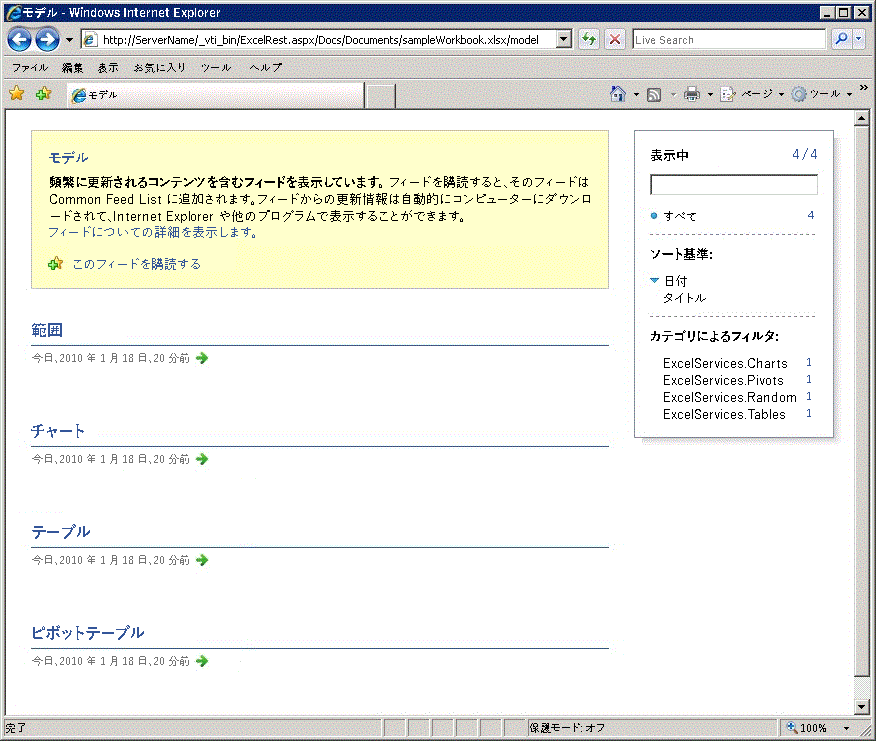
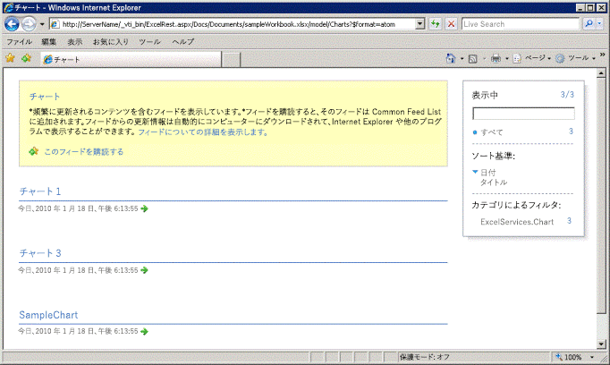
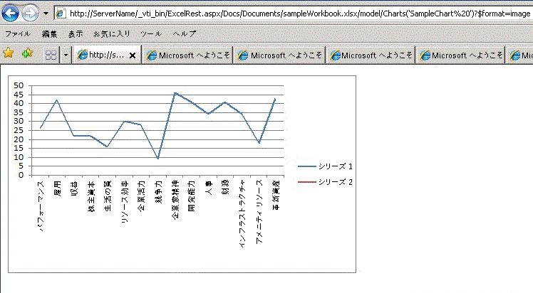

# Excel Services REST API での検出

このトピックでは Excel Services REST API に組み込まれた検出メカニズムについて説明します。
  
    
    


> **メモ**
> Excel Services REST API は、SharePoint 2013 および SharePoint 2016 オンプレミスに適用されます。Office 365 Education、Business、および Enterprise の各アカウントには、 [Microsoft Graph](http://graph.microsoft.io/ja-jp/docs/api-reference/v1.0/resources/excel
) エンドポイントの一部である Excel REST API を使用します。
  
    
    


## 検出ベース URL と検出例

検出では、開発者とユーザーが手動またはプログラミングにより、ブックについての情報とブックの内容を検出できるようにします。検出メカニズムは、ブック内のリソースについての情報を含む  [Atom](http://tools.ietf.org/html/rfc4287) フィードを提供します。検出を使用することにより、ブック内のリソースを確認して表示することができます。確認してアクセスすることができるリソースは、範囲、グラフ、表、およびピボットテーブルです。
  
    
    
ブック内の特定の要素に対する REST URL の構造を次に示します。
  
    
    


```

http://<ServerName>/_vti_bin/ExcelRest.aspx/<DocumentLibrary>/<FileName>/<ResourceLocation>
```

「 [基本的な URI 構造およびパス](basic-uri-structure-and-path.md)」トピックで説明されているように、以下は **sampleWorkbook.xlsx** という名前のブックにアクセスし、さらに **SampleChart** という名前のグラフを表示するための REST URL です。
  
    
    


```
http://<ServerName>/_vti_bin/ExcelRest.aspx/Docs/Documents/sampleWorkbook.xlsx/model/Charts('SampleChart')
```

検出によってブックを開き、ブック内のリソースを確認および表示するには、この例の後の URI を使用してモデル ページを参照してください。
  
    
    


```
http://<ServerName>/_vti_bin/ExcelRest.aspx/<DocumentLibrary>/<FileName>/model
```

"sampleWorkbook.xlsx" の例を使用する場合は、次の URI になります。
  
    
    


```
http://<ServerName>/_vti_bin/ExcelRest.aspx/Docs/Documents/sampleWorkbook.xlsx/model
```

以下はモデル ページのスクリーン ショットです。
  
    
    

**Excel Services REST モデル URL**

  
    
    

  
    
    

  
    
    
モデル ページへの URL が、検出を始める場所です。モデル ページは Excel Services REST API が現在サポートする 4 つのリソース コレクションを表示します。リソース コレクションは、範囲、グラフ、テーブル、またはピボットテーブルです。モデル ページで　[ **範囲**]、[ **グラフ**]、[ **テーブル**]、または [ **ピボットテーブル**] をクリックすることによって、特定のブック内のそれらのリソースを確認できます。
  
    
    
たとえば、検出を使用してブック内のグラフにアクセスするには、次の操作を実行します。
  
    
    

  
    
    

1. モデル ページで [ **グラフ**] をクリックします。[ **グラフ**] リンクをクリックすると別の Atom フィードが表示されます。この結果のフィードは sampleWorkbook.xlsx ブックで使用可能なすべてのグラフを列挙します。sampleWorkbook.xlsx ブックには、 **Chart 1**、 **Chart 3**、および **SampleChart** という名前の 3 つのグラフが含まれます。このため、次のスクリーン ショットのように、3 つのグラフ名が一覧表示されます。
    
   **Excel Services REST のグラフ検出リスト**

  


  

  

  
2. モデル ページで [ **SampleChart**] をクリックします。これにより、次のスクリーン ショットで示されるように、 **sampleWorkbook.xlsx** 内の **SampleChart** という名前のグラフが表示されます。
    
   **REST を使用したグラフの表示**

  


  

  

  
3. 同様に、[ **Chart 1**] または [ **Chart 3**] をクリックすると、対応する名前のグラフが表示されます。[ **SampleChart**] をクリックすると、実際のグラフ URL に移動します。以下は **SampleChart** 画像 (スクリーン ショットを参照) の URL です。
    
  ```
  http://<ServerName>/_vti_bin/ExcelRest.aspx/Docs/Documents/sampleWorkbook.xlsx/model/Charts('SampleChart%20')?$format=image
  ```


## Atom フィード

REST API が提供する  [Atom](http://tools.ietf.org/html/rfc4287) フィードを使用すると、興味あるデータを簡単に入手できます。Web ページのソースを表示すると、XML を取得できます。 **sampleWorkbook.xlsx** のグラフの例を以下に示します。
  
    
    
XML に示されているように、フィードにはブック内にどんな要素が存在するかコードが検出できるようにする、トラバース可能な要素が含まれます。それぞれの Atom エントリは、アクセス可能なグラフに対応します。この同じメカニズムは範囲、テーブル、およびピボットテーブルの検出にも当てはまります。
  
    
    


```XML
<?xml version="1.0" encoding="utf-8" standalone="yes"?>
<feed xmlns="http://www.w3.org/2005/Atom" xmlns:x="http://schemas.microsoft.com/office/2008/07/excelservices/rest" xmlns:d="http://schemas.microsoft.com/ado/2007/08/dataservice" xmlns:m="http://schemas.microsoft.com/ado/2007/08/dataservices/metadata">
  <title type="text">Charts</title>
  <id>http://ServerName/_vti_bin/ExcelRest.aspx/Docs/Documents/sampleWorkbook.xlsx/model/Charts</id>
  <updated>2010-01-19T19:32:53Z</updated>
  <author>
    <name />
  </author>
  <link rel="self" href="http://ServerName/_vti_bin/ExcelRest.aspx/Docs/Documents/sampleWorkbook.xlsx/model/Charts?$format=atom" title="Charts" />
  <entry>
    <category term="ExcelServices.Chart" scheme="http://schemas.microsoft.com/ado/2007/08/dataservices/scheme" />
    <title>Chart 1</title>
    <id>http://ServerName/_vti_bin/ExcelRest.aspx/Docs/Documents/sampleWorkbook.xlsx/model/Charts('Chart%201')</id>
    <updated>2010-01-19T19:32:53Z</updated>
    <author>
      <name />
    </author>
    <link rel="alternate" title="Chart 1" href="http://ServerName/_vti_bin/ExcelRest.aspx/Docs/Documents/sampleWorkbook.xlsx/model/Charts('Chart%201')?$format=image" />
    <content type="image/png" src="http://ServerName/_vti_bin/ExcelRest.aspx/Docs/Documents/sampleWorkbook.xlsx/model/Charts('Chart%201')?$format=image" />
  </entry>
  <entry>
    <category term="ExcelServices.Chart" scheme="http://schemas.microsoft.com/ado/2007/08/dataservices/scheme" />
    <title>Chart 3</title>
    <id>http://ServerName/_vti_bin/ExcelRest.aspx/Docs/Documents/sampleWorkbook.xlsx/model/Charts('Chart%203')</id>
    <updated>2010-01-19T19:32:53Z</updated>
    <author>
      <name />
    </author>
    <link rel="alternate" title="Chart 3" href="http://ServerName/_vti_bin/ExcelRest.aspx/Docs/Documents/sampleWorkbook.xlsx/model/Charts('Chart%203')?$format=image" />
    <content type="image/png" src="http://ServerName/_vti_bin/ExcelRest.aspx/Docs/Documents/sampleWorkbook.xlsx/model/Charts('Chart%203')?$format=image" />
  </entry>
  <entry>
    <category term="ExcelServices.Chart" scheme="http://schemas.microsoft.com/ado/2007/08/dataservices/scheme" />
    <title>SampleChart </title>
    <id>http://ServerName/_vti_bin/ExcelRest.aspx/Docs/Documents/sampleWorkbook.xlsx/model/Charts('SampleChart%20')</id>
    <updated>2010-01-19T19:32:53Z</updated>
    <author>
      <name />
    </author>
    <link rel="alternate" title="SampleChart" href="http://ServerName/_vti_bin/ExcelRest.aspx/Docs/Documents/sampleWorkbook.xlsx/model/Charts('SampleChart%20')?$format=image" />
    <content type="image/png" src="http://ServerName/_vti_bin/ExcelRest.aspx/Docs/Documents/sampleWorkbook.xlsx/model/Charts('SampleChart%20')?$format=image" />
  </entry>
</feed>
```


## 関連項目


#### 概念


  
    
    
 [Excel Services REST API のリソース URI](resources-uri-for-excel-services-rest-api.md)
