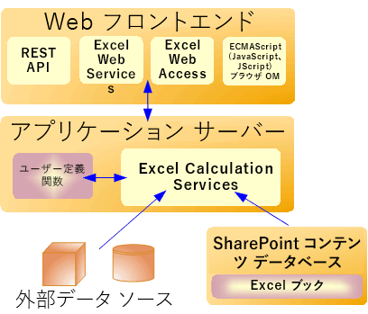

# Excel Services のアーキテクチャ

Excel Services は Microsoft SharePoint Server 2010 の一部です。Excel Services は ASP.NET および SharePoint Foundation テクノロジ上に構築されています。Excel Services の中心となるコンポーネントは次のとおりです。
  
    
    

- Excel Web Access
    
  
- Excel Web Services
    
  
- ユーザー定義関数 (UDF)
    
  
- ECMAScript (JavaScript, JScript)
    
  
- REST (Representational State Transfer) サービス
    
  
- Excel Calculation Services
    
  

> **メモ**
> Office Online の一部である Microsoft Excel Online も、ブラウザーで Excel ブックをサポートしています。 Excel Online について詳しくは、 [Office Web Apps に関するドキュメント](https://technet.microsoft.com/ja-jp/library/ee855124.aspx)をご覧ください。 
  
    
    

Excel Web Access、Excel Web Services、UDF、JavaScript、REST サービス、Excel Calculation Services コンポーネントは、主に 2 つのグループ、フロントエンド サーバー (「Web フロント エンド」としても知られる) 上のコンポーネントおよびバックエンド アプリケーション サーバー上のコンポーネントに分かれます。
**Web フロント エンドおよびバックエンド アプリケーション サーバーのコンポーネント**

  
    
    

  
    
    

  
    
    

  
    
    

  
    
    

## Web フロントエンド サーバーとバックエンド アプリケーション サーバー

Excel Web Access、Excel Web Services、UDF、JavaScript、REST サービス、Excel Calculation Services コンポーネントは、Web フロントエンド サーバー上のコンポーネントと、バックエンド アプリケーション サーバー上のコンポーネントに分かれます。Web フロント エンドには、Excel Web Access、JavaScript、REST サービス、Excel Web Services などがあります。Excel Calculation Services コンポーネントは、管理者が追加した UDF アセンブリと共に、バックエンド アプリケーション サーバー上にあります。
  
    
    
SharePoint Server 2010 の最も簡単な構成、つまり、スタンドアロンのインストールとして SharePoint Server 2010 を実行する 1 台のコンピューターでは、5 つのコンポーネントすべてが同じコンピューターにインストールされます。しかし、多数のユーザーがいる一般的な企業環境では、Web フロントエンド サーバー上のコンポーネントとバックエンド アプリケーション サーバー上のコンポーネントは、ファーム構成になった別のコンピューターにあります。Web フロントエンド サーバーをバックエンド アプリケーション サーバーから独立させてスケール アウトすることが可能です。たとえば、組織のニーズによって、Web フロントエンド サーバーを追加したり、バックエンド サーバーを追加することができます。
  
    
    
Excel Services トポロジ、スケーラビリティ、パフォーマンス、セキュリティについて詳しくは、 [TechNet](http://technet.microsoft.com/ja-jp/library/cc303422%28office.14%29.aspx) の SharePoint Server 2010 ドキュメントをご覧ください。
  
    
    

## Excel Web Access

Excel Web Access はビューアー ページで、SharePoint Server 2010 の Web パーツ ページに追加できる Excel Services の Web パーツです。Excel Web Access は、Web ページ上にライブの Excel ブックを表示 (言い換えると、HTML を作成) します。また、ユーザーがブックを操作し、探索できるようにします。Excel Web Access は、ユーザーにとって表示可能な Excel Services のコンポーネントです。Excel Web Access は、SharePoint Server 2010 にあるその他すべての Web パーツと同じように使用することができます。Excel Web Access では、ユーザーはクライアント コンピューターに何もインストールする必要がありません。
  
    
    
Excel Web Access の Web パーツのプロパティもカスタマイズできます。詳細は、 [Microsoft.Office.Excel.Server.WebUI](https://msdn.microsoft.com/library/Microsoft.Office.Excel.Server.WebUI.aspx) 名前空間のリファレンス ドキュメントを参照してください。
  
    
    

## Excel Web Services

Excel Web Services は、Web サービスにプログラムを使用してアクセスできるようにする Excel Services のコンポーネントです。Excel Web Services を呼び出して、ブックから値の計算、設定、抽出を行うとともに、外部のデータ接続を更新できるアプリケーションを開発することができます。Excel Web Services を使用すると、サーバー側のブックのロジックをアプリケーションに組み込み、Excel ブックの更新を自動化できるとともに、サーバー側の Excel の計算に関連するアプリケーション固有のユーザー インターフェイスを作成することができます。 
  
    
    

> **メモ**
> たとえば Excel Web Services を使用して範囲に値を設定するなど、ブックに対する変更はその特定のセッションでのみ保持されます。この変更は元のブックに保存されることはありません。現在のブックのセッションが終了する際 (例: **CloseWorkbook** メソッドを呼び出したとき、またはセッションがタイム アウトになったとき)、行われた変更は失われます。> ブックに対して行った変更を保存する場合は、 **GetWorkbook** メソッドを使用してから、ブックを保存します。詳細は「 [Microsoft.Office.Excel.Server.WebServices](https://msdn.microsoft.com/library/Microsoft.Office.Excel.Server.WebServices.aspx) 」を参照してください。ブックを編集モードで開いて変更を保存しても構いません。
  
    
    

Excel Web Services について、詳細は「 [Excel Services の開発ロードマップ](excel-services-development-roadmap.md)」を参照してください。
  
    
    

## ユーザー定義関数 (UDF)

Excel Services の UDF では、セル内で数式を使用して、マネージ コードで記述され、SharePoint Server 2010 に配置されたカスタム機能を呼び出すことができます。Excel Services における UDF について、詳細は「 [Excel Services UDF の理解](understanding-excel-services-udfs.md)」を参照してください。
  
    
    

## ECMAScript (JavaScript、JScript)

Excel Services にある JavaScript オブジェクト モデルにより、開発者はページ上で Excel Web Access の Web パーツ コントロールをカスタマイズし、自動化し、動かすことができます。JavaScript オブジェクト モデルを使用すると、ページ上の 1 つ以上の Excel Web Access Web パーツ コントロール、またはページ上のスクリプト付き **iframe** で操作する、マッシュアップおよびその他の統合ソリューションを作成できます。また、ブックの機能および関連するコードをさらに追加することもできます。
  
    
    
Excel Services の JavaScript オブジェクト モデルについて、詳細は  [Ewa](http://msdn.microsoft.com/library/6fe73191-3213-b986-1ad6-2c3b918a2241%28Office.15%29.aspx) 名前空間のリファレンス ドキュメントを参照してください。
  
    
    

## REST API

Excel Services の REST API では、URL を介して直接ブックのパーツや要素にアクセスできます。URL には「マーカー」パスがあります。これは, .aspx ページ、ブックのファイルの場所、ブック内の要求された要素へのパスに対するエントリ ポイントです。 
  
    
    
Excel Services の REST API に組み込まれた探索メカニズムにより、開発者とユーザーは、手動で、またはプログラムを使用してブックの内容を探索できます。 
  
    
    
Excel Services の REST API について、詳細は「 [Excel Services の REST API](excel-services-rest-api.md)」を参照してください。 
  
    
    

## Excel Calculation Services

Excel Calculation Services の役割は、ブックの読み込み、ブックの計算、カスタム コード (UDF) の呼び出し、外部データの更新です。また、対話機能のためのセッション状態も維持します。Excel Calculation Services は、ユーザーまたは呼び出し元が同じブックで対話する期間セッションを維持します。セッションは、呼び出し元が明示的に終了したり、サーバー上でセッションがタイム アウトになると終了します。複数のユーザーが同じ一連のブックにアクセスする場合、パフォーマンス向上のため、Excel Services は、開かれた Excel ブック、計算状態、外部データのクエリ結果をキャッシュに入れます。
  
    
    

## 負荷分散

複数サーバーの構成では、Excel Services は、ファーム構成における複数の Excel Calculation Services の発生全体で要求の負荷分散を行います。インストールに複数のアプリケーション サーバーが含まれる場合、Excel Services は、要求によって過負荷になるアプリケーション サーバーがないように負荷を分散します。
  
    
    
管理者は、負荷分散の動作を構成できます。
  
    
    

## 関連項目

#### 概念

  
    
    
 [Excel Services の概要](excel-services-overview.md)
  
    
    
 [Excel Services の開発ロードマップ](excel-services-development-roadmap.md)
  
    
    
 [サポートされる機能とサポートされない機能](supported-and-unsupported-features.md)
#### その他の技術情報

  
    
    
 [チュートリアル: Excel Web Services を使用してカスタム アプリケーションを開発する](walkthrough-developing-a-custom-application-using-excel-web-services.md)
