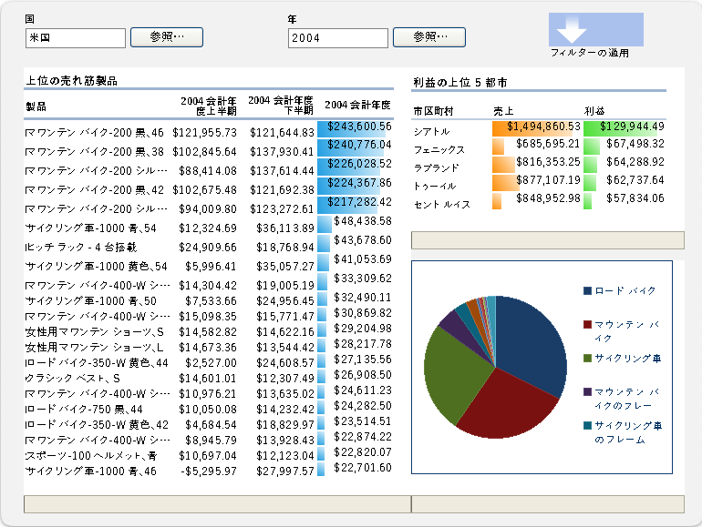

# Excel Services の概要

Excel Services は、 Microsoft SharePoint 2013 で Microsoft Excel ブックを読み込み、計算、表示できるサービス アプリケーションです。Excel Services は Microsoft Office SharePoint Server 2007 で初めて導入されました。
  
    
    

Excel Services を使用することにより、SharePoint 2013 ポータルおよびダッシュボードで Excel ブックを再利用し、共有できます。たとえば、財務アナリスト、事業プランナー、エンジニアは Excel でコンテンツを作成し、SharePoint 2013 ポータルとダッシュボードを使用して、カスタム コードを作成しないで、他の人とそれを共有できます。表示するデータを制御でき、また、Excel ブックの 1 つのバージョンを維持できます。 
Excel Services には 4 つの主なインターフェイスがあります。 
  
    
    

- Excel Web Access Web パーツ。ブラウザーで実際のブックを表示して操作することができます 
    
  
- プログラムによるアクセス用の Excel Web Services
    
  
- ECMAScript (JavaScript, JScript) オブジェクト モデル。Excel Web Access の自動化とカスタマイズを行って駆動し、より強力な統合されたソリューションと、ECMAScript (JavaScript, JScript) オブジェクト モデルを拡張するユーザー定義関数を作成する機能をユーザーに与えます。
    
  
- URL 経由でブック パーツに直接アクセスするための REST (Representational State Transfer) API
    
  

> **メモ**
> Excel 対話型ビュー機能は使用できなくなりました。Web サイトからこの機能を削除する方法について詳しくは、「 [Web ページからの Excel 対話型ビューの削除](removing-excel-interactive-view-from-a-webpage.md)」をご覧ください。 
  
    
    

ユーザー定義関数 (UDF) を使用して Excel Calculation Services を拡張することもできます。
> **メモ**
> Excel Calculation Services の詳細については、「 [Excel Services のアーキテクチャ](excel-services-architecture.md)」を参照してください。 
  
    
    

Excel Services を使用すると、ブラウザーのみを使用してライブのインタラクティブ ブックを表示できます。つまり、ポータル サイト内から Excel ブックを保存したり、操作したりできます。ピボットテーブルの並べ替え、フィルター処理、展開、または縮小を行い、パラメーターを渡すことで、Excel ベースのデータを操作することもできます。これにより、発行されたブック上で分析を実行できます。発行されたブックを変更しなくても、ブックを操作できます。これは、レポートの作成者とコンシューマーにとって役に立つ機能です。Excel Services は、外部データ ソースに接続されているブックをサポートします。外部データ ソースへの接続文字列は、ブックに埋め込むか、データ接続ライブラリ ファイルに集中的に保存できます。名前付き範囲 (パラメーター) にすることによって、ワークシート内の選択したセルを編集可能にすることもできます。表示可能にするように選択したアイテムは、Excel Services に保存するときに、Excel Web Access の [ **パラメーター**] ウィンドウに表示されます。[ **パラメーター**] ウィンドウでこれらの名前付き範囲の値を変更し、ブックを更新することができます。ポータルのフィルター Web パーツを使用して、いくつかの Web パーツ (Excel Web Access およびその他の種類の Web パーツ) に共にフィルターを適用することもできます。 ただし、Excel Services を使用して新しいブックを作成したり、既存のブックを編集することはできません。Excel Services で使用できるブックを作成するには、Microsoft Excel 2013 を使用します。
> **メモ**
> Office Online の一部である Microsoft Excel Online は、ブラウザーでの Excel ブックもサポートしています。Excel Online の詳細については、「 [新しい Office の概要](https://support.office.com/ja-jp/Article/Office-2013-Quick-Start-Guides-4a8aa04a-f7f3-4a4d-823c-3dbc4b8672a1)」を参照してください。 
  
    
    

Excel Services には Web サービスもあります。Excel Web Services を使用してブックを読み込み、セルと範囲に値を設定し、外部データ接続を更新し、ワークシートを計算し、計算結果 (セルの値、計算済みブック全体、ブックのスナップショットを含む) を抽出できます。SharePoint 2013 では Excel Web Services を使用して保存、コピーの保存、共同の編集セッションへの参加も可能です。
> **メモ**
> スナップショットの詳細については、「 [方法: ブック全体またはスナップショットの取得](how-to-get-an-entire-workbook-or-a-snapshot.md)」を参照してください。 
  
    
    

Excel Services は UDF をサポートします。UDF を使用して、Excel Calculation Services の機能を拡張することができます (たとえば、カスタム計算ライブラリを実装したり、Excel Services によってネイティブでサポートされていない Web サービスおよびデータ ソースからデータを読み取ったりします)。Excel Services は、Excel との機能および計算の再現性を提供する、拡張性と堅牢性を備えたエンタープライズ クラスのサーバーになるように設計されています。
## シナリオおよび機能

Excel Services は多数の異なるシナリオをサポートとします。このセクションでは、そのうちのいくつかについて説明します。 
  
    
    

### ビジネス インテリジェンス ポータルおよびブック分析

ビジネス インテリジェンス ポータルは、スコアカードおよびレポートを表示し、ユーザーがブラウザーのみを使用してデータを探索できるようにします。SharePoint Server の **BI センター**機能には、ビジネス インテリジェンス ポータルおよびダッシュボード機能が含まれています。図 1 は、レポートのライブラリ、グラフ、および主要業績評価指標 (KPI) が既にセットアップされているレポート センター ダッシュボードを示しています。
  
    
    
Excel Services には、サーバー上のデータを計算する機能もあります。Excel Services は、Excel ベースのコンテンツを統合された BI ダッシュボード上で計算および公開できるようにすることで、 **BI センター**に参加します。Excel Web Access Web パーツを使用して Excel ブックを表示し、外部データ ソースに接続し、ブック内のデータをさらに操作することができます。 
  
    
    
 図 1 は、フィルター Web パーツを含むダッシュボード、および Excel Web Access Web パーツを使用して表示される Excel ブックを示しています。
  
    
    

**図 1. フィルター処理と Excel コンテンツを含むダッシュボード**

  
    
    

  
    
    

  
    
    
統合ダッシュボードへの参加に加えて、Excel Services を使用すると、Excel ブックのすべてまたは一部を表示できるため、ユーザーはそのコンテンツを使い慣れた Excel ユーザー インターフェイスで操作できます。図 2 は、表示される範囲、およびパラメーターの入力として表示されるセルを示しています。特定のセルをパラメーターとして指定すると、ユーザーは右側のウィンドウの編集ボックスを使用して、ワークシート内のこれらのセルの値を変更できます。Excel Services は、新しい値に基づいてワークシートを再計算します。
  
    
    
Excel の特定の機能を使用する必要がある場合や、すべての Excel 機能を使用してブックを分析する必要がある場合は、[ **Excel で開く**] をクリックしてブックを Excel で開くことができます。また、印刷やオフライン作業を行うために、Excel でブックを開くこともできます。
  
    
    

    
> **メモ**
> [ **Excel で開く**] コマンドを使用してブックを開くには、"開く" 権限を持っている必要があります。詳細については、次のセクションの「 **ブックの管理**」、および  [TechNet](http://technet.microsoft.com/ja-jp/library/cc263215%28office.14%29.aspx) の「 [ユーザー権限とアクセス許可レベル (SharePoint Server 2010)](http://technet.microsoft.com/ja-jp/library/cc721640%28office.14%29.aspx)」を参照してください。"開く" 権限を持っていなくても、ユーザーは、Excel でスナップショットを開くことができます。 
  
    
    

**図 2. [パラメーター] ウィンドウの使用**

  
    
    

  
    
    
![[パラメーター] ウィンドウの使用](images/65926095-d833-4eb2-b899-9efe40e2d540.GIF)
  
    
    
Excel Web Access を使用してデータの分析、ピボット、および操作を行うこともできます。
  
    
    
Excel Services について、および SharePoint 2013 のビジネス インテリジェンスについて詳しくは、SharePoint Server のヘルプのビジネス インテリジェンス文書を参照してください。 
  
    
    

### ブックを管理する

Excel Services のブック管理およびロックダウン機能により、次のことを行うことができます。
  
    
    

- 各ユーザーのコンピューターに複数のコピーを保持するのではなく、セキュリティで保護された中心的な場所に、信頼できる作成者によって作成および変更されるブックのコピーを 1 つだけ保持します。ワークシートの正しいバージョンを、Excel、SharePoint、その他のアプリケーション内から、より簡単に検索、共有、および使用することができます。 
    
  
- ブック モデルおよびバックエンド データをセキュリティで保護します。ユーザーには "参照のみ" の権限を与えて、ブックへのアクセスを制限することができます。たとえば、ユーザーが Excel を使用してブックを開くことができないようにしたり、ユーザーが表示することを許可されるブック内の項目を制御したりすることができます。ユーザーは、作成者が共有することを望むブックのコンテンツにブラウザー ベースでアクセスできますが、ブックを Excel クライアントで開いたり、式を表示したり、ブックに含まれる場合のあるサポート コンテンツや他の知的財産を表示したりできません。 
    
  
- ブックのスナップショットを作成します。
    
  
Excel Services は、多くのユーザーおよび多くのブックに応じて最適化されます。また、サーバー ファーム間で計算を負荷分散することもできます。
  
    
    
Excel Services を使用したブックの管理について詳しくは、 [TechNet](http://technet.microsoft.com/ja-jp/library/ee424405%28office.14%29.aspx) の SharePoint Server に関するドキュメントや SharePoint Server ヘルプを参照してください。
  
    
    

### カスタムの .NET アプリケーションによるプログラムのアクセス

次の処理を行うカスタム アプリケーション (ASP.NET アプリケーションなど) を作成できます。
  
    
    

- Excel Web Services を呼び出してブックのアクセス、パラメータ化、および計算を行います。
    
  
- 開く、外部データを更新する、セルまたは範囲を設定する、再計算する、他のアプリケーションまたはユーザーとのグループ作業による編集セッションに参加する、保存する、名前を付けて保存する、などの処理を行います。 
    
  
- カスタム ワークフローを使用して、計算操作のスケジュールや電子メール通知の送信を行います (これには、SharePoint 機能が使用されます。これは、Excel Services のネイティブな部分ではありません)。
    
  

### ユーザー定義関数 (UDF)

Excel Services UDF を使用することもできます。これにより、セル内の式を使用して、マネージ コードで作成され SharePoint Server に展開されたカスタム関数を呼び出せます。
  
    
    
Excel Services の UDF の詳細については、「 [Excel Services UDF の理解](understanding-excel-services-udfs.md)」を参照してください。
  
    
    

### ECMAScript (JavaScript、JScript)

Excel Services の JavaScript オブジェクト モデルを使用して、Excel Web Access Web パーツ コントロールを自動化、カスタマイズ、および実行することもできます。JavaScript オブジェクト モデルを使用して、より魅力的な統合ソリューションを構築できます。
  
    
    

### JavaScript のユーザー定義関数 (UDF)

Microsoft Excel Services および Microsoft SharePoint 2013 の新機能である ECMAScript (JavaScript, JScript) UDF により、OneDrive または SharePoint の Excel Web AccessExcel Web Access Web パーツで埋め込みの Excel ブックを使用しているときに、カスタム関数を Excel に追加できます。Excel で使用する組み込み関数のほかに、JavaScript UDF を使用して、 の式内から直接呼び出せる、独自のカスタム関数を追加できます。
  
    
    
JavaScript UDF は、 Microsoft Excel に作成できる  [UDF](http://msdn.microsoft.com/ja-jp/library/ms499792.aspx) に似ています。違いは、JavaScript UDF は Web ページに埋め込まれたブックでのみ使用され、その Web ページだけに存在することです。
  
    
    

### JavaScript オブジェクト モデル

Excel Services JSOM API では次の機能がサポートされました。
  
    
    

- 埋め込まれたブックの再読み込み機能。埋め込まれたブックを基になるブック ファイルのデータにリセットできます。
    
  
- ユーザー作成の浮動オブジェクト。EwaControl オブジェクトに、ユーザーが作成した浮動オブジェクトを追加/削除する新しいメソッドが追加されました。
    
  
- Ewa コントロールの表示領域のより詳細な制御。
    
  
- SheetChanged イベント。このイベントは、セルの更新、セルの削除または消去、範囲のコピー/カット/貼り付け、元に戻す/やり直し操作など、シートが何か変更されたときに発生します。
    
  
- データの入力規則のサポート。ユーザーが入力したデータを検証できます。
    
  

### REST API

Excel Services の REST API を使用して、ブック パーツまたは要素に URL 経由で直接アクセスできます。Excel Services REST API に組み込まれた検出メカニズムを使用すると、開発者とユーザーは手動またはプログラムによってブックのコンテンツを探査できます。 
  
    
    
Excel Services の REST API の詳細については、「 [Excel Services REST API](excel-services-rest-api.md)」を参照してください。
  
    
    

### REST ODATA

Microsoft Excel Services および Microsoft SharePoint 2013 の新機能で、Excel Services REST API の新しい OData 機能を使用することにより、Excel ブック内のテーブルを OData として要求できます。たとえば REST 呼び出しを使用して SampleWorkbook.xlsx ブック内の使用可能なリソースに関する Excel メタデータを要求するには、次の構文を使用します。
  
    
    
http://<ServerName>/_vti_bin/ExcelRest.aspx/Docs/Documents/SampleWorkbook.xlsx/model REST API の詳細については以下を参照してください。 
  
    
    
SharePoint 2013 SDK ドキュメントの  [Excel Services 2010 REST API](http://msdn.microsoft.com/ja-jp/library/ee556413.aspx) の資料。
  
    
    
OData を使用して SampleWorkbook.xlsx ブック内の利用可能なリソースについてのメタデータを要求するには、次の要求のように同じ REST 構文を使用しますが、/Model を /Odata に置き換えます。 
  
    
    
http://<ServerName>/_vti_bin/ExcelRest.aspx/Docs/Documents/sampleWorkbook.xlsx/OData
  
    
    
その後 OData システム クエリ オプションを使用してブック内のテーブルについての特定の情報を取得できます。
  
    
    

## その他の技術情報

-  [Excel Services の開発ロードマップ](excel-services-development-roadmap.md)
    
  
-  [Excel Services のアーキテクチャ](excel-services-architecture.md)
    
  
-  [JavaScript ユーザー定義関数の概要](javascript-user-defined-functions-overview.md)
    
  
-  [SharePoint 2013 の Excel Services REST で OData を使用する](using-odata-with-excel-services-rest-in-sharepoint-2013.md)
    
  
-  [チュートリアル: Excel Web Services を使用してカスタム アプリケーションを開発する](walkthrough-developing-a-custom-application-using-excel-web-services.md)
    
  
-  [Excel Services UDF に関するよく寄せられる質問](frequently-asked-questions-about-excel-services-udfs.md)
    
  
-  [Excel Services でサポートされない機能](http://msdn.microsoft.com/library/5868e672-4786-4fed-9168-07ff538f6f5c%28Office.15%29.aspx)
    
  
-  [Excel Services ブログ、フォーラム、リソース](excel-services-blogs-forums-and-resources.md)
    
  

