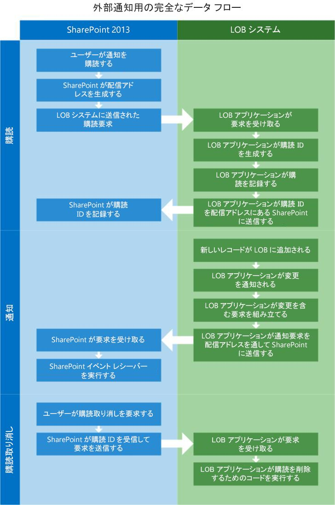
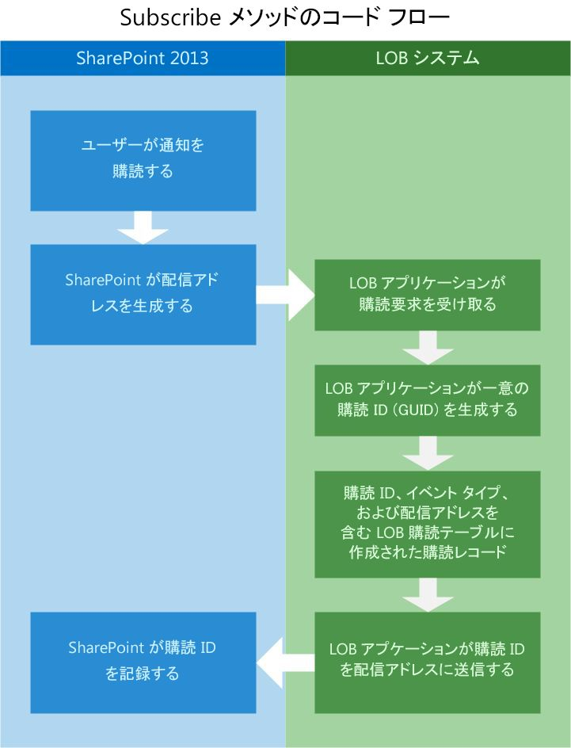
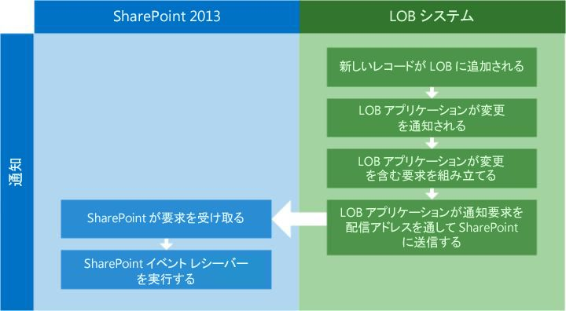
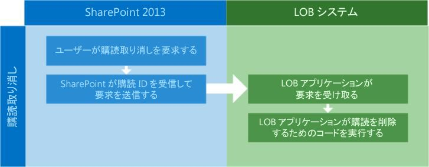

# SharePoint 2013 の外部イベントおよびアラート
外部リストへの接続が可能で、リストが表す外部データの更新時に実行される、SharePoint 2013 のリモート イベント レシーバーの作成の背後にある概念について説明します。
## イベント レシーバーとは
<a name="Externalevents_overview"> </a>

イベント レシーバーは、追加、移動、削除、チェックイン、チェックアウトなどの SharePoint トリガ イベントに応答するマネージ コードです。これらのイベントが発生し、イベント レシーバーの条件が満たされると、追加の機能を提供するために書いたコードが実行されます。リスト、ワークフロー、機能などの SharePoint オブジェクトは、これらのイベントの発生を待機するように設定され、イベント ホストと呼ばれます。 
  
    
    
イベント レシーバーを使用すると、特定のイベントの発生時にビジネス ロジックを実行できます。本質的に、イベント レシーバーは特定の条件の処理、通知、他のシステムの更新を実行するなどのコードを作成できるフックになります。イベント レシーバーを作成すると、DLL が生成されます。その DLL をグローバル アセンブリ キャッシュ内に配置し、外部システムの変更への応答として、イベント レシーバーが呼び出されるようにすることができます。
  
    
    
次の例は、リストに新しい項目が追加されたときに実行される C# での簡単な外部イベント レシーバーです。
  
    
    


```cs

public class EntryContentEventReceiver : SPItemEventReceiver
{
   public override void ItemAdded(SPItemEventProperties properties)
   {
      base.ItemAdded(properties);

      // properties.ExternalNotificationMessage holds the message sent by the external 
      // system.
   }
```

外部イベント レシーバーは、エンティティ イベント レシーバーに対して機能し、社内または Microsoft Azure のサービスとして展開されるリモート イベント レシーバーとして拡張することもできます。 
  
    
    

## リモート イベント レシーバーとは
<a name="WhatIsARemoteEventReceiver"> </a>

リモート イベント レシーバーは SharePoint 2013 の新機能です。従来の SharePoint ソリューションでは、イベント レシーバーを使用して、ユーザーによるリストまたはリスト内のアイテムの作成や削除などのイベントを処理します。SharePoint アドイン では、リモート イベント レシーバーを使用して同様のイベントを処理します。リモート イベント レシーバーは、通常のイベント レシーバーと同じように動作しますが、違う点として、リモート イベント レシーバーは、SharePoint アドインがホスト Web アプリケーションとは別のシステム上にある場合に発生するイベントを処理します。
  
    
    
Business Connectivity Services (BCS) では外部リストおよびエンティティに接続されているリモート イベント レシーバーを使用して、外部システムでホストされているデータの変更に反応できるコードを書くことができます。
  
    
    
これに対応するため、BDC モデルのスキーマに **EventSubscriber** と **EventUnsubscriber** の 2 つのステレオタイプが追加されています。
  
    
    

> **メモ**
> イベント レシーバーはサンドボックス ソリューションではサポートされていません。 
  
    
    


## 新しい外部イベント レシーバー インフラストラクチャが提供する機能
<a name="FeaturesAddedWithRER"> </a>

SharePoint 2013 イベント レシーバーの使用と機能の拡張によって、BCS はアラート、外部リスト イベント レシーバー、およびエンティティ レシーバーを追加して、拡張機能を提供することができます。
  
    
    

- **アラート:** アラートは、SharePoint のいくつかのバージョンで不可欠な部分ですが、SharePoint 2013 までは、外部リストと連携しませんでした。現在、ユーザーは、標準 SharePoint リストのアラートと同じように動作するアラートを外部リストに作成できるようになりました。
    
  
- **外部リスト イベント レシーバー:**イベント レシーバーを標準リストと同じように、外部リストに接続できるようになりました。 これにより、特定の時間に実行するコードを書くことができる拡張メカニズムを利用できます。
    
  
- **エンティティ イベント レシーバー:** エンティティ イベント レシーバーは、データをフィルター処理するためのユーザー コンテキストを提供するなど、その他の操作を可能にするより堅牢なコードをユーザーが書けるようにすることで、柔軟性を提供します。これにより、個人用設定とカスタマイズしたセキュリティが可能になります。
    
  
SharePoint 2013 のリモート イベントにより、いくつかの興味深いシナリオが可能になります。たとえば、新しいセールス リードが外部リード アプリケーションに入力されたときに、営業チームに通知できる "セールス リード追跡" アプリケーションを使用できます。新しいセールス リードが入力されると、リード アプリケーションの一部である通知システムによって、SharePoint に通知されます。SharePoint は通知を受信し、指定した営業担当者が新しい各リードをフォローする新しいタスクを作成します。外部システム上のセールス リード エンティティ アプリケーションで、新しい各リードの作成時に、SharePoint に通知を送信するように設定することによって、SharePoint は完全に最新の状態に維持されます。
  
    
    

## 外部リストにイベント レシーバーを使用するための前提条件
<a name="bkmk_Prerequisites"> </a>

外部リストにイベント レシーバーを使用するには、次の内容が必要です。
  
    
    

- SharePoint 2013
    
  
- Visual Studio 2012
    
  
SharePoint 2013 開発環境のセットアップの詳細については、「 [SharePoint 2013 の一般的な開発環境の設定](set-up-a-general-development-environment-for-sharepoint-2013.md)」を参照してください。
  
    
    

## SharePoint に外部イベントを通知するように外部システムを設定する
<a name="Externalevents_components"> </a>

外部イベントが機能するためには、SharePoint ホストと外部システムの両方にいくつかのコンポーネントがインストールされ、設定されている必要があります。
  
    
    
次のことを実行できるように外部システムを設定する必要があります。
  
    
    

- **基盤のデータが変更されるタイミング判断する。**変更が行われたときに、外部システムに知らせるには、特定の変更をポーリングするメカニズムを作成する必要があります。これは、特定の間隔でデータ ソースをポーリングする時間サービスを使用することで実行できます。
    
  
- **変更通知へのサブスクリプションの要求を受け取り、記録する。**外部システムは、変更通知を受け取る必要があるユーザーを保存できるように、サブスクリプション ストアを実装する必要があります。最も簡単なソリューションは、おそらくデータベース テーブルです。テーブル (または選択したメカニズム) に、SubscriptionID、配信アドレス、イベントの種類、エンティティ名を記録する必要があります。
    
  
- **REST (Representational State Transfer) エンドポイントに通知を投稿する。**SharePoint サブスクライバーに変更が発生したことを知らせるには、外部システム アプリケーションは、サブスクリプション ストアに記録されている配信アドレスに HTTP WebRequest を送信する必要があります。この配信アドレスは、SharePoint によってサブスクリプション プロセス時に生成される REST 対応のエンドポイントです。
    
  

## SharePoint 2013 を外部システムと通信できるように設定する
<a name="bkmk_configureSP"> </a>

外部システムと通信できるようにするには、次の内容を使用して、SharePoint を設定する必要があります。
  
    
    

- **EventSubscriber** および **EventUnsubscriber** ステレオタイプが設定された BDC モデル
    
  
- イベント レシーバー
    
  

### 外部イベントを有効にする方法

SharePoint 2013 で外部イベントを有効にするには、[ **サイトの設定**] から行うか、または次のカスタム機能 ID をプロジェクトに追加します。
  
    
    

```XML

<ActivationDependency FeatureTitle="BCSEvents" FeatureId="60c8481d-4b54-4853-ab9f-ed7e1c21d7e4" />
```

外部システムのイベントは、SharePoint によって配信アドレスが作成され、そのアドレスがサブスクライブ プロセス中に外部システムに送信されたときに有効になります。
  
    
    

## SharePoint と外部システム間の外部イベントの全体のフロー
<a name="bkmk_overallflow"> </a>

図 1 で、外部イベント レシーバーを使用する場合に、サブスクライブ、通知、サブスクライブ解除の 3 つの手順が含まれることに注目してください。
  
    
    

**図 1 外部通知の完全なデータ フロー**

  
    
    

  
    
    

  
    
    

  
    
    

  
    
    

## EventSubscriber: 通知へのサブスクライブ
<a name="bkmk_eventsubscriber"> </a>

基盤のデータの変更時にユーザー (SharePoint オブジェクト) が通知を受け取るためには、エンティティの通知にサブスクライブする必要があります。これを可能にするため、 **Subscribe** ステレオタイプを含むように、BDC モデル スキーマが拡張されました。 **Subscribe** ステレオタイプは、SharePoint によって、送信者が基盤のデータの変更について通知されるように要求していることを外部システムに知らせるために使用されます。
  
    
    
図 2 に、サブスクライブ プロセス時の SharePoint と外部システム間の情報のフローを示します。
  
    
    

**図 2. サブスクライブ プロセス フロー**

  
    
    

  
    
    

  
    
    
以下に、サブスクリプション プロセスの一般的なフローを説明します。
  
    
    

  
    
    

1. **ユーザーが通知のサブスクリプションを要求する。**SharePoint はカスタム ユーザー インターフェイス（ページまたはリボン上のボタン) を使用して、外部システム アプリに通知の要求を開始します。
    
  
2. **SharePoint が配信アドレスを生成する。**SharePoint はサブスクライブ プロセスの一部として、通知が配信される REST エンドポイントを作成します。
    
  
3. **サブスクリプション要求が外部システムに送信される。**次に、SharePoint は要求元の情報と動的に生成された REST URL をカプセル化し、外部システムに Web 要求を送信します。
    
  
4. **外部システムが要求を受信する。**サブスクリプション ストアにはさまざまな実装が可能です。この例では、SQL Server データベース テーブルを使用します。
    
  
5. **外部システムが SubscriptionID を生成する。**基幹業務 (LOB) アプリケーションのコードを使用して、新しい **subscriptionId** が生成されます。 **subscriptionId** は GUID である必要があります。
    
  
6. **外部システムがサブスクリプションを記録する。**外部システム アプリケーションは、 **subscriptionId**、配信アドレス、イベントの種類、および SharePoint から送信されたその他の情報をサブスクリプション ストアに記録します。
    
  
7. **外部システムが SubscriptionID を SharePoint に返送する。**SharePoint が外部システムによって送信される更新を正しくルーティングするために、 **subscriptionId** が SharePoint に返送され、SharePoint はその情報をデータベースに記録します。
    
    BDC モデルは、 **Subscribe** 関数インポートに対して機能します。この例の関数インポートのメタデータを示します。
    


  ```XML
  FunctionImport
 
<EntityType Name="EntitySubscribe">
   <Key>
      <PropertyRef Name="SubscriptionId" />
   </Key>
   <Property Name="SubscriptionId" Type="Edm.Int32" Nullable="false" 
      p6:StoreGeneratedPattern="Identity" 
      xmlns:p6="http://schemas.microsoft.com/ado/2009/02/edm/annotation" />
   <Property Name="EntityName" Type="Edm.String" MaxLength="250" FixedLength="false" 
      Unicode="true" />
   <Property Name="DeliveryURL" Type="Edm.String" MaxLength="250" FixedLength="false" 
      Unicode="true" />
   <Property Name="EventType" Type="Edm.Int32" />
   <Property Name="UserId" Type="Edm.String" MaxLength="50" FixedLength="false" 
      Unicode="true" />
   <Property Name="SubscribeTime" Type="Edm.Binary" MaxLength="8" FixedLength="true" 
      p6:StoreGeneratedPattern="Computed" 
      xmlns:p6="http://schemas.microsoft.com/ado/2009/02/edm/annotation" />
   <Property Name="SelectColumns" Type="Edm.String" MaxLength="10" FixedLength="false" 
      Unicode="true" />
</EntityType>

  ```


### コード例: Subscribe を含む BDC モデル

次に、 **Subscribe** メソッドが追加されている BDC モデルの例を示します。
  
    
    

```XML

<Method Name="SubscribeCustomer" DefaultDisplayName="Customer Subscribe" IsStatic="true">
   <Properties>
     <Property Name="ODataEntityUrl" Type="System.String">/EntitySubscribes</Property>
     <Property Name="ODataHttpMethod" Type="System.String">POST</Property>
     <Property Name="ODataPayloadKind" Type="System.String">Entry</Property>
     <Property Name="ODataFormat" Type="System.String">application/atom+xml</Property>
     <Property Name="ODataServiceOperation" Type="System.Boolean">false</Property>
   </Properties>
   <AccessControlList>
      <AccessControlEntry Principal="NT Authority\\Authenticated Users">
         <Right BdcRight="Edit" />
         <Right BdcRight="Execute" />
         <Right BdcRight="SetPermissions" />
         <Right BdcRight="SelectableInClients" />
      </AccessControlEntry>
   </AccessControlList>
   <Parameters>
      <Parameter Direction="In" Name="@DeliveryURL">
         <TypeDescriptor TypeName="System.String" Name="DeliveryURL" >
            <Properties>
               <Property Name="IsDeliveryAddress" Type="System.Boolean">true</Property>
            </Properties>
         </TypeDescriptor>
      </Parameter>
      <Parameter Direction="In" Name="@EventType">
         <TypeDescriptor TypeName="System.Int32" Name="EventType" >
            <Properties>
               <Property Name="IsEventType" Type="System.Boolean">true</Property>
            </Properties>
         </TypeDescriptor>
      </Parameter>
      <Parameter Direction="In" Name="@EntityName">
         <TypeDescriptor TypeName="System.String" Name="EntityName" >
            <DefaultValues>
               <DefaultValue MethodInstanceName="SubscribeCustomer" 
                  Type="System.String">Customers</DefaultValue>
            </DefaultValues>
      </TypeDescriptor>
    </Parameter>
    <Parameter Direction="In" Name="@SelectColumns">
      <TypeDescriptor TypeName="System.String" Name="SelectColumns" >
        <DefaultValues>
          <DefaultValue MethodInstanceName="SubscribeCustomer" Type="System.String">*</DefaultValue>
        </DefaultValues>
      </TypeDescriptor>
    </Parameter>
    <Parameter Direction="Return" Name="SubscribeReturn">
      <TypeDescriptor Name="SubscribeReturnRootTd" TypeName="Microsoft.BusinessData.Runtime.DynamicType">
        <TypeDescriptors>
          <TypeDescriptor Name="SubscriptionId" TypeName="System.String" >
            <Properties>
              <Property Name="SubscriptionIdName" Type="System.String">Default</Property>
            </Properties>
            <Interpretation>
              <ConvertType LOBType="System.Int32" BDCType="System.String"/>
            </Interpretation>
          </TypeDescriptor>
          <TypeDescriptor Name="DeliveryURL" TypeName="System.String" />
          <TypeDescriptor Name="SelectColumns" TypeName="System.String" >
          </TypeDescriptor>
          <TypeDescriptor Name="EntityName" TypeName="System.String" />
          <TypeDescriptor Name="EventType" TypeName="System.Int32" />
          <TypeDescriptor Name="UserId" TypeName="System.String" />
          <!--TypeDescriptor Name="SubscribeTime" TypeName="System." /-->
        </TypeDescriptors>
      </TypeDescriptor>
    </Parameter>
  </Parameters>
  <MethodInstances>
    <MethodInstance Type="EventSubscriber" ReturnParameterName="SubscribeReturn" ReturnTypeDescriptorPath="SubscribeReturnRootTd" Default="true" Name="SubscribeCustomer" DefaultDisplayName="Customer Subscribe">
      <AccessControlList>
        <AccessControlEntry Principal="NT Authority\\Authenticated Users">
          <Right BdcRight="Edit" />
          <Right BdcRight="Execute" />
          <Right BdcRight="SetPermissions" />
          <Right BdcRight="SelectableInClients" />
        </AccessControlEntry>
      </AccessControlList>
    </MethodInstance>
  </MethodInstances>
</Method>
```

表 1 に **Subscribe** ステレオタイプを機能させるために必要な BDC モデルの重要な属性を一覧表示します。
  
    
    

**表 1. BDC モデルの属性**


|**属性**|**説明**|
|:-----|:-----|
|**IsDeliveryAddress** <br/> |**TypeDescriptor** で使用される、指定された配信アドレスを通知の配信に使用するかどうかを示す **Boolean** フラグ。 <br/> |
|**IsEventType** <br/> |指定されたイベントの種類をイベントの種類として使用するかどうかを示す、 **TypeDescriptor** で使用される **Boolean** フラグ。有効なイベントの種類は、 **ItemAdded**、 **ItemUpdated**、 **ItemDeleted** などです。 <br/> |
|**SubscriptionIdName** <br/> |**subscriptionId** 部の名前を表す、 **TypeDescriptor**で使用される文字列。  <br/> |
   

## 通知
<a name="bkmk_notifications"> </a>

SharePoint 2013 では、イベント処理インフラストラクチャが拡張され、外部システムの情報が変更されたときに、外部データ ソースから SharePoint に通知できます。次に、SharePoint が通知を受信すると、SharePoint 外部リストまたはエンティティに関連付けられたイベント レシーバーが、指定したアクションを実行するコードを実行できます。
  
    
    
サブスクリプションが作成されたら、特定のエンティティで発生した変更について外部システムから SharePoint に伝える方法が必要です。外部システムが、OData Atom 書式のペイロードを使用して、サブスクライブ プロセス時に、SharePoint が外部システムに提供した配信アドレスへの通知を配信します。
  
    
    
図 3 に外部システムのデータに新しいレコードが追加されたときの外部システムと SharePoint 間の通信フローを示します。
  
    
    

**図 3 通知プロセス**

  
    
    

  
    
    

  
    
    

  
    
    

1. **新しいレコードが外部システムに追加される。**この例では、アプリケーション ユーザー インターフェイスを使用して、外部システムに追加されるか、データベースに直接追加されます。
    
  
2. **外部システム アプリケーションに変更が通知される。**外部システム アプリケーションは、基盤のデータに発生している変更を認識する必要があります。これを実行する方法はさまざまです。特定のテーブルのデータが変更されたときに発生する SQL トリガを使用したり、変更についてデータ ストアをクエリするポーリング メカニズムを作成したりすることができます。これを実現する方法は他にもありますが、パフォーマンスを考慮して各方法を評価する必要があります。
    
  
3. **外部システムが配信アドレスを通じて、SharePoint に通知要求を送信する。**変更を伝えるには、Atom 書式の要求を、LOB アプリケーションのサブスクリプション ストアに格納されている配信アドレスに送信する必要があります。
    
  

### 通知ペイロード

LOB システムは、通知の構築中に、変更されたアイテムの完全な詳細か、または変更されたアイテムの ID だけを含む HTTP ペイロードを作成する必要があります。
  
    
    

- **ID:** ID としてペイロードが送信されると、ペイロードは、変更されたアイテムの ID に関する情報のみを持つことが期待されます。たとえば、顧客エンティティの顧客の場合、ペイロードには、変更された顧客の ID のみが含まれます。
    
  
- **アイテム全体:** この場合、ペイロードは外部システムで変更されたレコード全体です。顧客を例にとると、変更された顧客レコード全体が含まれます。
    
  

> **メモ**
> アイテム全体は、OData コネクタを使用する場合に限りサポートされます。 
  
    
    

外部システムによって送信されるペイロードの種類は、サブスクリプション プロセス時に指定する必要があります。
  
    
    
次は、通知に使用される BDC モデル プロパティの例です。
  
    
    


```XML

<Property Name="NotificationParserType" Type="System.String">
   ODataEntryContentNotificationParser
</Property>

```

これが指定されていない場合、既定のペイロードは、ID ペイロードです。
  
    
    

### 通知配信アドレス (仮想アドレス)

SharePoint から開始されたサブスクリプション プロセスは、結果として SharePoint が作成した仮想アドレスになるため、外部システムのエントリ ポイントで通知を投稿できます。配信アドレスは、外部システムがそれらの通知を投稿するために使用します。また、配信アドレスもサブスクリプション要求時に外部システムに渡されます。
  
    
    

## EventUnsubscriber: 通知リストからサブスクリプションを削除する
<a name="bkmk_eventunsubscriber"> </a>

 **Unsubscribe** 操作は通知リストからサブスクリプションを削除します。
  
    
    
 図 4 に **UnSubscribe** メソッドの方がはるかに簡単であることを示します。サブスクリプション ID が SharePoint に返送され、SharePoint がそれを記録しているため、正しいサブスクリプション ID で UnSubscribe 要求を送信すればいいだけです。
  
    
    

**図 4 UnSubscribe メソッドのコード フロー**

  
    
    

  
    
    

  
    
    

### Unsubscribe の BDC モデル

次の XML 例に、外部システム イベント通知からサブスクライブ解除する BDC モデルを作成する方法を示します。
  
    
    

```XML

<Method Name="UnSubscribeExpenseReport" DefaultDisplayName="ExpenseReport
    Unsubscribe">
    <Properties>
        <Property Name="ODataEntityUrl" Type="System.String">
            /Subscriptions(@ID)</Property>
        <Property Name="ODataHttpMethod" Type="System.String">DELETE</Property>
        <Property Name="ODataPayloadKind" Type="System.String">Property</Property>
        <Property Name="ODataServiceOperation" Type="System.Boolean">false</Property>
    </Properties>
    <AccessControlList>
        <AccessControlEntry Principal="NT Authority\\Authenticated Users">
            <Right BdcRight="Edit" />
            <Right BdcRight="Execute" />
            <Right BdcRight="SetPermissions" />
            <Right BdcRight="SelectableInClients" />
        </AccessControlEntry>
    </AccessControlList>
    <Parameters>
        <Parameter Name="@ID" Direction="In">
            <TypeDescriptor Name="ID" TypeName="System.Int32">
                <Properties>
                    <Property Name="SubscriptionIdName" Type="System.String">ID</Property>
                </Properties>
                <Interpretation>
                    <ConvertType LOBType="System.Int32" BDCType="System.String" />
                </Interpretation>
            </TypeDescriptor>
        </Parameter>
    </Parameters>
    <MethodInstances>
        <MethodInstance Name="UnSubscribeExpenseReport" DefaultDisplayName="ExpenseReport 
             Unsubscribe" Type="EventUnsubscriber" Default="true">
            <AccessControlList>
                <AccessControlEntry Principal="NT Authority\\Authenticated Users">
                    <Right BdcRight="Edit" />
                    <Right BdcRight="Execute" />
                    <Right BdcRight="SetPermissions" />
                    <Right BdcRight="SelectableInClients" />
                </AccessControlEntry>
            </AccessControlList>
        </MethodInstance>
    </MethodInstances>
</Method>


<Method IsStatic="false" Name="Unsubscribe">
    <AccessControlList>
        <AccessControlEntry Principal="NT AUTHORITY\\Authenticated Users">
            <Right BdcRight="Edit" />
            <Right BdcRight="Execute" />
            <Right BdcRight="SetPermissions" />
            <Right BdcRight="SelectableInClients" />
        </AccessControlEntry>
    </AccessControlList>
    <Parameters>
        <Parameter Direction="In" Name="subscriptionId">
            <TypeDescriptor TypeName="System.String" Name="subscriptionId" 
                IsSubscriptionId="true" />
         </Parameter>
    </Parameters>
    <MethodInstances>
        <MethodInstance Type="EventUnsubscriber" Default="true" Name="Unsubscribe" 
            DefaultDisplayName="UnSubscriber">
            <Properties>
                <Property Name="LastDesignedOfficeItemType" Type="System.String">None</Property>
            </Properties>
            <AccessControlList>
                <AccessControlEntry Principal=" NT AUTHORITY\\Authenticated Users ">
                    <Right BdcRight="Edit" />
                    <Right BdcRight="Execute" />
                    <Right BdcRight="SetPermissions" />
                    <Right BdcRight="SelectableInClients" />
                </AccessControlEntry>
            </AccessControlList>
        </MethodInstance>
    </MethodInstances>
</Method>

```


## コード例: イベント レシーバーを外部リストに接続する
<a name="AttachingRER"> </a>

次のコードは、イベント レシーバーを外部リストに接続する方法の例を示しています。イベント レシーバーは、接続後、外部システムのネイティブ データについて実行された更新、追加、および削除についての通知を待機します。
  
    
    

```XML

private static void AddEventReceiver(string siteUrl, string listTitle)
{ 
   string assembly = "SampleEventReceiver, Culture=neutral, Version=1.0.0.0, 
      PublicKeyToken=1bfafa687d2e46a7";
   string className = "SampleEventReceiver.EntryContentEventReceiver"; 
   
   try
   {
      using (SPSite site = new SPSite(siteUrl)) 
      { 
         using (SPWeb web = site.OpenWeb()) 
         {
            SPList list = web.Lists[listTitle]; 
            list.EventReceivers.Add(SPEventReceiverType.ItemAdded, 
               assembly, className); 
         }
      }
   }
   catch (Exception e) 
   { 
      Console.WriteLine(e); 
   }
}

```


## 次の手順: 外部イベント レシーバーの使用について詳しく学習する
<a name="Externalevents_Learnmore"> </a>

外部イベントおよびアラートの詳細については、次を参照してください。
  
    
    

**表 2. 外部イベント レシーバーとの連携の高度な概念**


|**記事**|**説明**|
|:-----|:-----|
| [BCS 外部システムとして使用する OData データ サービスを作成する方法](how-to-create-an-odata-data-service-for-use-as-a-bcs-external-system.md) <br/> |基礎となるデータが変更されたときに OData を使用して SharePoint 2013 に通知を送る、インターネット アドレスの指定が可能な Windows Communication Foundation (WCF) サービスの作成方法について説明します。これらの通知は、外部リストに接続されたイベントをトリガーするために使用されます。  <br/> |
   

## その他の技術情報
<a name="Externalevents_Addres"> </a>


-  [SharePoint 2013 の Business Connectivity Services の新機能](what-s-new-in-business-connectivity-services-in-sharepoint-2013.md)
    
  
-  [SharePoint 2013 の Business Connectivity Services](business-connectivity-services-in-sharepoint-2013.md)
    
  
-  [SharePoint 2013 Business Connectivity Services プログラマー リファレンス](business-connectivity-services-programmers-reference-for-sharepoint-2013.md)
    
  
-  [[方法] 外部イベント レシーバーの作成](how-to-create-external-event-receivers.md)
    
  

