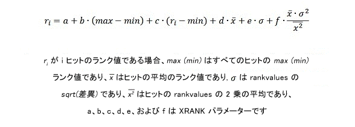

# FAST クエリ言語 (FQL) 構文のリファレンス
FAST クエリ言語 (FQL) を使用した SharePoint 2013 の検索 の複雑な検索クエリの構築について説明します。このリファレンスでは、FQL クエリの要素について、および FQL クエリでプロパティーの指定、トークン式、および演算子を使用する方法について説明します。
## SharePoint Server 2013の FQL およびクエリ言語のサブ式と式の概要
<a name="SP15FQL_about"> </a>

FAST クエリ言語 (FQL) は、開発者が、完全一致の検索を実行したり、検索範囲を特定の管理プロパティまたはフルテキスト インデックスに属する値に狭めたりするのを可能にする強力なクエリ言語です。
  
    
    
クエリ言語式には、表 1 で説明するように、クエリ用語、プロパティの指定、および演算子を含む、ネストされたサブ式を含めることができます。
  
    
    

**表 1. クエリ言語式のサブ式**


|**アイテム**|**説明**|
|:-----|:-----|
|トークン式  <br/> |クエリで検索する、1 つ以上のクエリ用語、語句、または数値。  <br/> |
|プロパティの指定  <br/> |関連する式と照合するプロパティまたはフルテキスト インデックス。  <br/> |
|演算子  <br/> |ブール演算子 ( **AND**、 **OR** など) またはオペランドに対する他の制約 ( **FILTER** など) を指定するキーワード。 <br/> |
   

### FQL クエリの例

以下の FQL クエリ例は、インデックス化されたアイテムの **body** 管理プロパティで、用語 "hello" と "world" を検索します。
  
    
    
 `body:string("hello world", mode="and")`
  
    
    
例:
  
    
    

-  `body:` は、クエリ範囲をアイテム内の body 管理プロパティに限定します。
    
  
-  `"hello world"` は、 **STRING** 演算子へのオペランドで、検索する用語を示します。
    
  
-  `mode="and"` は、論理クエリ演算子 **AND** が `"hello world"` に適用されることを示します。
    
  
FAST クエリ言語のクエリの長さは 2,048 文字に制限されています。
  
    
    

## FQL でのプロパティの指定
<a name="property_specification"> </a>

プロパティの指定によって、関連する式の範囲が、インデックス付きコンテンツの特定領域に限定されます。このような領域は、フルテキスト インデックスまたは管理プロパティによって特定できます。 
  
    
    
 **Text** 型および **YesNo** 型の管理プロパティは、テキストとして評価されます。 **Datetime** 型を含む他のすべての管理プロパティの型は、数値として評価されます。
  
    
    
式にプロパティの指定を含めない場合、検索エンジンは、インデックス スキーマで定義された既定のフルテキスト インデックスを照会しようとします。
  
    
    
プロパティの名前の後には必ずコロンを付ける必要があります ( **In** 演算子)。また数値演算子には必ずプロパティの指定が含まれます。
  
    
    
プロパティの指定 ( **In** 演算子) は、以下のクエリ エンティティに適用できます。
  
    
    

- 以下のような、1 つの用語または語句。
    
     `author:shakespeare`
  
    
    
 `title:"to be or not to be"`
    
  
- 以下のような演算子 ( **STRING** 演算子など)
    
  ```
  
title:string("to be or not to be")
  ```


    この場合、プロパティの指定は完全な演算子式に適用されます。
    
  

### 例

以下の各式は、 **title** 管理プロパティの "much" と "nothing" の両方を持つアイテムを照合します。
  
    
    
 `title:and(much, nothing)`
  
    
    
 `and(title:much, title:nothing)`
  
    
    
 `title:string("much nothing", mode="and")`
  
    
    

## FQL でのトークン式
<a name="token_expressions"> </a>

トークン式は、インデックスに対して照合される単語、語句、または数値です。
  
    
    
テキスト トークン式は、二重引用符で囲まれた 1 つの単語または語句です。
  
    
    
数値トークン式は、1 つの値または値の範囲の式です。
  
    
    

### ワイルドカード式

ワイルドカード式とは、アスタリスク (" *****") 文字を含む 1 つの用語または語句のことです。アスタリスクは、0 個以上の文字の一致を意味し、空白は含みません。FQL では、個々のテキスト管理プロパティとフルテキスト インデックスについてプレフィックス検索をサポートします。
  
    
    

#### ワイルドカード式の例

次に、FQL で有効なワイルドカード式の使用方法を示します。
  
    
    

-  `text*`
    
  
-  `string("this examp*")`
    
  

### 数値用語の式
<a name="fql_token_numeric"> </a>

各数値用語の式には、互換性のあるインデックス スキーマのデータ型のプロパティ指定を入れる必要があります。表 2 に、FQL で使用できる数値データ型を示します。 
  
    
    

**表 2. FQL で使用できる数値データ型**


|**FQL の型**|**互換性のあるインデックス スキーマの型**|**説明**|
|:-----|:-----|:-----|
|**Int** <br/> |**Integer** <br/> |64 ビット整数。  <br/> |
|**Float** <br/> |**Double** <br/> |64 ビット (倍精度) 浮動小数点。  <br/> |
|**Decimal** <br/> |**Decimal** <br/> |128 ビット 10 進数  <br/> |
|**Datetime** <br/> |**Datetime** <br/> |日付と時刻の値。  <br/> FQL で日付と時刻がサポートされるので、他の数値と同じ数値演算を日付と時刻の値に対して実行できます。  <br/> |
   

#### 日付と時刻のクエリ式
<a name="fql_token_datetime"> </a>

FQL には、日付と時刻用に **datetime** データ型が用意されています。
  
    
    
次の ISO 8601 互換の **datetime** 形式がクエリでサポートされます。
  
    
    

- YYYY-MM-DD 
    
  
- YYYY-MM-DDThh:mm:ss 
    
  
- YYYY-MM-DDThh:mm:ssZ 
    
  
- YYYY-MM-DDThh:mm:ssfrZ
    
  
これらの **datetime** 形式では、
  
    
    

- YYYY には、4 桁の年を指定します。
    
    > **メモ**
      > サポートされるのは、4 桁の年だけです。 
- MM には、2 桁の月を指定します。たとえば、01 は 1 月を意味します。
    
  
- DD には、2 桁の日 (01 ～ 31) を指定します。
    
  
- T には、文字 "T" を指定します。
    
  
- hh には、2 桁の時間 (00 ～ 23) を指定します。A.M. と P.M. は使用できません。
    
  
- mm には、2 桁の分 (00 ～ 59) を指定します。
    
  
- ss には、2 桁の秒 (00 ～ 59) を指定します。
    
  
-  _fr_ には、秒 _ss_ の省略可能な小数部を指定します。秒の後の **.** に続けて 1 ～ 7 桁で指定します。たとえば、2012-09-27T11:57:34.1234567 のように指定します。
    
  
すべての日付と時刻の値は、UTC (協定世界時) (GMT (グリニッジ標準時) とも呼ばれます) タイム ゾーンに従って指定する必要があります。UTC タイムゾーンの識別子 (末尾の "Z" 文字) はオプションです。
  
    
    

### 予約語、特殊文字、エスケープ
<a name="fql_token_numeric"> </a>

次の単語は、FQL で予約されています。
  
    
    
 `and, or, any, andnot, count, decimal, rank, near, onear, int, in32, int64, float, double, datetime, max, min, range, phrase, scope, filter, not, string, starts-with, ends-with, equals, words, xrank.`
  
    
    
上記のいずれかの単語をクエリ式の用語として使用する場合は、次の例に示すように、その単語を二重引用符で囲む必要があります。 
  
    
    

-  `or("any", "and", "xrank")`
    
  
-  `string("any and xrank", mode="OR")`
    
  
-  `phrase(this, is, a, "phrase")`
    
  

> **ヒント**
> 予約語と予約文字は、大文字と小文字が区別されませんが、将来の互換性のために、小文字を使用することをお勧めします。 
  
    
    

FQL では、文字列を必ず二重引用符で囲む必要があるわけではありません。たとえば、 `and(cat, dog)` は、 `cat` と `dog` は二重引用符で囲まれていませんが、有効な FQL です。ただし、予約語との競合を避けるために、二重引用符を使用することをお勧めします。
  
    
    
クエリの用語は、ユーザーのロケール設定に従ってトークン化されます。トークン化処理では、特定の特殊文字が削除されます。特殊文字が削除されるので、次の 2 つの FQL 式は同値です。
  
    
    
 `and("[king]", "<queen>")`
  
    
    
 `and("king", "queen")`
  
    
    
クエリに、ユーザー入力または別のアプリケーションからの用語を追加する場合は、 `string("<query terms>", mode="AND|OR|PHRASE")` 演算子を使用して、クエリ言語の予約語と競合しないようにする必要があります。また、ユーザー指定のクエリから可能な二重引用符を削除する必要があります。
  
    
    

## FQL の演算子
<a name="fql_operators"> </a>

FAST クエリ言語 (FQL) 演算子は、ブール演算やその他の制約をオペランドに指定するキーワードです。FQL 演算子の構文は次のとおりです。
  
    
    
 `[property-spec:]operator(operand [,operand]* [, parameter="value"]*)`
  
    
    
構文の詳細:
  
    
    

- property-spec は、オプションのプロパティ指定であり、その後に "in" 演算子が続きます。
    
  
- operator は、実行する演算を指定するキーワードです。
    
  
- operand は、項表現または別の演算子です。
    
  
- parameter は、演算子の動作を変更する値の名前です。
    
  
- value は、パラメーター名で使用する値です。
    
  
演算子名、パラメーター名、パラメーター テキストの各値は大文字と小文字を区別しません。演算子の本文内に空白を含めることはできますが、二重引用符で囲まれていない場合、空白は無視されます。FAST クエリ言語のクエリの長さは 2,048 文字に制限されています。
  
    
    
表 3 では、FQL でサポートされている演算子の型の一覧を示します。 
  
    
    

**表 3. FQL でサポートされている演算子の型**


|**型**|**説明**|**演算子**|
|:-----|:-----|:-----|
|文字列型 (String)  <br/> |用語の文字列に対するクエリ操作を指定できます。これはテキスト用語で使用する最も一般的な演算子です。  <br/> | [STRING](fast-query-language-fql-syntax-reference.md#fql_string_operator) <br/> |
|ブール型 (Boolean)  <br/> |クエリ内で用語とサブ式を組み合わせることができます。  <br/> | [AND](fast-query-language-fql-syntax-reference.md#fql_and_operator)、 [または](fast-query-language-fql-syntax-reference.md#fql_or_operator)、 [ANY](fast-query-language-fql-syntax-reference.md#fql_any_operator)、 [ANDNOT](fast-query-language-fql-syntax-reference.md#fql_andnot_operator)、 [NOT](fast-query-language-fql-syntax-reference.md#fql_not_operator)、 [COUNT](fast-query-language-fql-syntax-reference.md#fql_count_operator)、 [COUNT](fast-query-language-fql-syntax-reference.md#fql_count_operator) <br/> |
|近接  <br/> |対応する一連のテキストでクエリ用語の近接を指定できます。  <br/> | [NEAR](fast-query-language-fql-syntax-reference.md#fql_near_operator)、 [ONEAR](fast-query-language-fql-syntax-reference.md#fql_onear_operator)、 [PHRASE](fast-query-language-fql-syntax-reference.md#fql_phrase_operator)、 [STARTS-WITH](fast-query-language-fql-syntax-reference.md#fql_startswith_operator)、 [ENDS-WITH](fast-query-language-fql-syntax-reference.md#fql_endswith_operator)、 [EQUALS](fast-query-language-fql-syntax-reference.md#fql_equals_operator) <br/> |
|数値型 (Numeric)  <br/> |クエリで数値的条件を指定できます。  <br/> | [RANGE](fast-query-language-fql-syntax-reference.md#fql_range_operator)、 [INT](fast-query-language-fql-syntax-reference.md#fql_int_operator)、 [FLOAT](fast-query-language-fql-syntax-reference.md#fql_float_operator)、 [DATETIME](fast-query-language-fql-syntax-reference.md#fql_datetime_operator)、 [DECIMAL](#fql_decimal_operator) <br/> |
|関連性  <br/> |クエリの関連性の検証に影響を与えることができます。  <br/> | [XRANK](fast-query-language-fql-syntax-reference.md#fql_xrank_operator) および [FILTER](fast-query-language-fql-syntax-reference.md#fql_filter_operator) <br/> |
   
表 4 では、サポートされている演算子の一覧を示します。
  
    
    

**表 4. FQL でサポートされている演算子**


|**演算子**|**説明**|**型**|
|:-----|:-----|:-----|
| [AND](fast-query-language-fql-syntax-reference.md#fql_and_operator) <br/> |すべての **AND** オペランドに一致するアイテムのみを返します。 <br/> |ブール型 (Boolean)  <br/> |
| [ANDNOT](fast-query-language-fql-syntax-reference.md#fql_andnot_operator) <br/> |1 番目のオペランドに一致し、それ以降のオペランドに一致しないアイテムのみを返します。  <br/> |ブール型 (Boolean)  <br/> |
| [ANY](fast-query-language-fql-syntax-reference.md#fql_any_operator) <br/> |**OR** 演算子と似ていますが、動的ランク (結果セット内の関連性スコア) は、一致するオペランド数やアイテム内の用語間の距離に影響されません。 <br/> |ブール型 (Boolean)  <br/> |
| [COUNT](fast-query-language-fql-syntax-reference.md#fql_count_operator) <br/> |結果として返すアイテムに含まれている必要のあるクエリ用語の出現回数を指定できます。オペランドに指定できるのは、1 つのクエリ用語、語句、またはワイルドカード クエリ用語です。  <br/> |ブール型 (Boolean)  <br/> |
| [DATETIME](fast-query-language-fql-syntax-reference.md#fql_datetime_operator) <br/> |数値の明示的な入力を提供します。  <br/> 明示的な型変換はオプションであり、通常は必要ありません。クエリ用語の型はターゲットの数値管理プロパティの型に従って検出されます。  <br/> |数値型 (Numeric)  <br/> |
| [DECIMAL](fast-query-language-fql-syntax-reference.md#fql_decimal_operator) <br/> |数値の明示的な入力を提供します。  <br/> 明示的な型変換はオプションであり、通常は必要ありません。クエリ用語の型はターゲットの数値管理プロパティの型に従って検出されます。  <br/> |数値型 (Numeric)  <br/> |
| [ENDS-WITH](fast-query-language-fql-syntax-reference.md#fql_endswith_operator) <br/> |単語または語句が管理プロパティの末尾に出現する必要があることを指定します。  <br/> |近接  <br/> |
| [EQUALS](fast-query-language-fql-syntax-reference.md#fql_equals_operator) <br/> |単語、用語、または語句が、管理プロパティと完全にトークン一致する必要があることを指定します。  <br/> |近接  <br/> |
| [FILTER](fast-query-language-fql-syntax-reference.md#fql_filter_operator) <br/> |メタデータまたはその他の構造化データのクエリを実行するために使用します。  <br/> |関連性  <br/> |
| [FLOAT](fast-query-language-fql-syntax-reference.md#fql_float_operator) <br/> |数値の明示的な入力を提供します。  <br/> 明示的な型変換はオプションであり、通常は必要ありません。クエリ用語の型はターゲットの数値管理プロパティの型に従って検出されます。  <br/> |数値型 (Numeric)  <br/> |
| [INT](fast-query-language-fql-syntax-reference.md#fql_int_operator) <br/> |数値の明示的な入力を提供します。  <br/> 明示的な型変換はオプションであり、通常は必要ありません。クエリ用語の型はターゲットの数値管理プロパティの型に従って検出されます。  <br/> |数値型 (Numeric)  <br/> |
| [NEAR](fast-query-language-fql-syntax-reference.md#fql_near_operator) <br/> |特定の互いの距離内で  `N` 個の用語を持つアイテムに結果セットを制限します。 <br/> |近接  <br/> |
| [NOT](fast-query-language-fql-syntax-reference.md#fql_not_operator) <br/> |オペランドを含まないアイテムのみを返します。  <br/> |ブール型 (Boolean)  <br/> |
| [ONEAR](fast-query-language-fql-syntax-reference.md#fql_onear_operator) <br/> |**NEAR** の順序指定付きのバリエーション。用語の順序が一致する必要があります。 **ONEAR** 演算子を使用して、特定の互いの距離内で `N` 個の用語を持つアイテムに結果セットを制限できます。オペランドに一致しないアイテムのみ返します。オペランドは任意の有効な FQL 式にすることができます。 <br/> |近接  <br/> |
| [または](fast-query-language-fql-syntax-reference.md#fql_or_operator) <br/> |1 つ以上の **OR** オペランドに一致するアイテムのみを返します。 **OR** オペランドに一致する数が多くなると、一致するアイテムの動的ランク (結果セット内の関連性スコア) が高くなります。 <br/> |ブール型 (Boolean)  <br/> |
| [PHRASE](fast-query-language-fql-syntax-reference.md#fql_phrase_operator) <br/> | トークンの完全な文字列に一致するアイテムのみを返します。 <br/> |近接  <br/> |
| [RANGE](fast-query-language-fql-syntax-reference.md#fql_range_operator) <br/> | 範囲一致式を有効にします。 **RANGE** 演算子は、数値管理プロパティおよび日時管理プロパティで使用します。 <br/> |数値型 (Numeric)  <br/> |
| [STARTS-WITH](fast-query-language-fql-syntax-reference.md#fql_startswith_operator) <br/> |単語または語句が管理プロパティの先頭に出現する必要があることを指定します。  <br/> |近接  <br/> |
| [STRING](fast-query-language-fql-syntax-reference.md#fql_string_operator) <br/> |テキスト文字列に対するブール型の一致条件を定義します。  <br/> |文字列型 (String)  <br/> |
| [XRANK](fast-query-language-fql-syntax-reference.md#fql_xrank_operator) <br/> |特定の用語出現回数に基づいてアイテムの動的ランクを上げることができます。どのアイテムがクエリに一致するかに変更はありません。 **XRANK** 式には、一致する必要のある 1 つのコンポーネント、および動的ランク付けのみに貢献する 1 つ以上のコンポーネントが含まれます。 <br/> |関連性  <br/> |
   

> **メモ**
> SharePoint 2013では、 **RANK** 演算子は非推奨になり、効果がなくなりました。代わりに **XRANK** を使用します。
  
    
    


### AND
<a name="fql_and_operator"> </a>

すべての **AND** オペランドに一致するアイテムのみを返します。オペランドに指定できるのは、1 つの用語か任意の有効な FQL サブ式です。
  
    
    

#### 構文

 `and(operand, operand [, operand]*)`
  
    
    

#### パラメーター

該当なし。
  
    
    

#### 例

次の式は、既定のフルテキスト インデックスに "cat"、"dog"、および "fox" が含まれるアイテムに一致します。
  
    
    
 `and(cat, dog, fox)`
  
    
    

### ANDNOT
<a name="fql_andnot_operator"> </a>

1 番目のオペランドに一致し、それ以降のオペランドに一致しないアイテムのみを返します。オペランドに指定できるのは、1 つの用語か任意の有効な FQL サブ式です。
  
    
    

#### 構文

 `andnot(operand, operand [,operand]*)`
  
    
    

#### パラメーター

該当なし。
  
    
    

#### 例

 **例 1.** 次の式は、既定のフルテキスト インデックスに "cat" が含まれて "dog" が含まれないアイテムに一致します。
  
    
    
 `andnot(cat, dog)`
  
    
    
 **例 2.** 次の式は、既定のフルテキスト インデックスに "dog" が含まれて "beagle" と "chihuahua" が含まれないアイテムに一致します。
  
    
    
 `andnot(dog, beagle, chihuahua)`
  
    
    

### ANY
<a name="fql_any_operator"> </a>


> **メモ**
> SharePoint Server 2013では、 **ANY** 演算子が非推奨になっています。代わりに **OR** 演算子を使用します。
  
    
    

 [または](fast-query-language-fql-syntax-reference.md#fql_or_operator) 演算子と似ていますが、動的ランク (結果セット内の関連性スコア) は、一致するオペランド数やアイテム内の用語間の距離に影響されません。オペランドに指定できるのは、1 つの用語か任意の有効な FQL サブ式です。
  
    
    
クエリのこの部分の動的ランク付けコンポーネントは、 **ANY** 式内で最も適切に一致する用語に基づきます。
  
    
    

> **メモ**
> **OR** との違いは、結果セット内でのランク付けにのみ関連します。クエリには同じアイテム セットが一致します。
  
    
    


#### 構文

 `any(operand, operand [,operand]*)`
  
    
    

#### パラメーター

該当なし。
  
    
    

#### 例

 次の式は、既定のフルテキスト インデックスに "cat" または "dog" が含まれるアイテムに一致します。
  
    
    
インデックスに "cat" と "dog" の両方が含まれ、"cat" のほうがより良い一致とみなされる場合、アイテムの動的ランクは "cat" に基づきます。"dog" は考慮されません。
  
    
    
 `any(cat, dog)`
  
    
    

### COUNT
<a name="fql_count_operator"> </a>

結果として返すアイテムに含まれている必要のあるクエリ用語の出現回数を指定します。オペランドに指定できるのは、1 つのクエリ用語、語句、またはワイルドカード クエリ用語です。
  
    
    

#### 構文

 `property-spec:count(operand [,from=<numeric value>, to=<numeric value>])`
  
    
    

#### パラメーター


|**パラメーター**|**値**|**説明**|
|:-----|:-----|:-----|
| _From_ <br/> |<numeric_value>  <br/> | _from_ パラメーターの値には、指定したオペランドに一致する必要のある最小回数を示す正の整数を指定する必要があります。 <br/>  _from_ パラメーターを指定しない場合、下限がなくなります。 <br/> |
| _to_ <br/> |<numeric_value>  <br/> | _to_ パラメーターの値には、指定したオペランドに一致する必要のある包含的でない最大回数を示す正の整数を指定する必要があります。たとえば、 _to_ 値の **11** は、10 回以下を示します。 <br/>  _to_ パラメーターを指定しない場合、上限がなくなります。 <br/> |
   

#### 例

 **例 1.** 次の式は、単語 "cat" が 5 回以上出現する場合に一致します。
  
    
    
 `count(cat, from=5)`
  
    
    
 **例 2.** 次の式は、単語 "cat" が 5 回以上かつ 10 回未満出現する場合に一致します。
  
    
    
 `count(cat, from=5, to=10)`
  
    
    
 **例 3.** 次の各式は、特定の単語が 3 回以上出現する場合に一致し、その単語は "cat" または "dog" のいずれかです。
  
    
    
 `count(or(cat, dog), from=3)count(string("cat dog", mode="or"), from=3)`
  
    
    
次の表に、管理プロパティの文字列値の例と、その文字列値が例 3. の 2 つの式に一致するかどうかを示します。
  
    
    


|**一致**|**テキスト**|
|:-----|:-----|
|はい  <br/> |My cat likes my dog, but my dog hates my cat.  <br/> |
|いいえ  <br/> |My bird likes my newt, but my dog hates my cat.  <br/> |
   

### DATETIME
<a name="fql_datetime_operator"> </a>

日時の数値の明示的な入力を提供します。オペランドは、 [FQL でのトークン式](fast-query-language-fql-syntax-reference.md#token_expressions)に指定された構文に従って書式設定された日時文字列です。
  
    
    
明示的な型変換はオプションであり、通常は必要ありません。クエリ用語の型はターゲットの数値管理プロパティの型に従って検出されます。
  
    
    

#### 構文

 `datetime(<date/time string>)`
  
    
    

#### パラメーター

該当なし。
  
    
    

### DECIMAL
<a name="fql_decimal_operator"> </a>

10 進値の明示的な入力を提供します。オペランドは、 [FQL でのトークン式](fast-query-language-fql-syntax-reference.md#token_expressions)に指定された構文に従う 10 進値です。
  
    
    
明示的な型変換はオプションであり、通常は必要ありません。クエリ用語の型はターゲットの数値管理プロパティの型に従って検出されます。
  
    
    

#### 構文

 `decimal(<decimal point value>)`
  
    
    

#### パラメーター

該当なし。
  
    
    

### ENDS-WITH
<a name="fql_endswith_operator"> </a>

単語または語句が管理プロパティの末尾に出現する必要があることを指定します (境界一致)。
  
    
    
境界一致は数値管理プロパティでサポートされません。数値管理プロパティは、常に、完全一致または値範囲の一致に従います。 
  
    
    
用途によっては、ユーザーが管理プロパティの完全一致を実行できることが必要になる場合があります。たとえば、これには **product name** 管理プロパティが考えられます。1 つの製品の完全名が別の製品名のサブ文字列になっている場合があります。
  
    
    

#### 構文

 `ends-with(<term or phrase>)`
  
    
    

#### パラメーター

該当なし。
  
    
    

#### 例

次の式は、"author" 管理プロパティに値 "Mr Adam Jones" および "Adam Jones" が含まれるアイテムに一致します。値 "Adam Jones sr" が含まれるアイテムには一致しません。
  
    
    
 `author:ends-with("adam jones")`
  
    
    

#### 注釈

境界一致は、管理プロパティのすべてのテキスト、または文字列値のリスト (名前のリストなど) を含む管理プロパティ内の個々の文字列に適用できます。この場合、各文字列の完全な内容の一致を実行したり、文字列境界を超えるクエリ一致を回避したりできます。 
  
    
    
境界一致クエリを適用するには、関連する管理プロパティをインデックス スキーマに構成する必要があります。 
  
    
    
管理プロパティの境界一致機能を有効にすることで、以下の処理を行うことができます。 
  
    
    

- 明示的な境界一致クエリを使用する。 
    
  
- 文字列境界を超えて語句が一致しないようにする。複数の文字列を含む管理プロパティでこの機能を使用すると、文字列は、境界指示の前または後ろで単語に一致しません。
    
  

### EQUALS
<a name="fql_equals_operator"> </a>

単語または語句が、管理プロパティと完全にトークン一致する必要があることを指定します。
  
    
    

#### 構文

 `equals(<term or phrase>)`
  
    
    

#### パラメーター

該当なし。
  
    
    

#### 例

次の例は、"author" 管理プロパティに値 "Adam Jones" が含まれるアイテムに一致します。値 "Adam Jones sr" または "Mr Adam Jones" が含まれるアイテムには一致しません。
  
    
    
 `author:equals("adam jones")`
  
    
    

#### 注釈

「 [ENDS-WITH](fast-query-language-fql-syntax-reference.md#fql_endswith_operator)」も参照してください。
  
    
    

### FILTER
<a name="fql_filter_operator"> </a>

メタデータまたはその他の構造化データのクエリを実行するために使用します。 
  
    
    
 **FILTER** 演算子を使用すると、指定したクエリに対して以下の処理が自動的に行われます。
  
    
    

- 言語的機能が linguistics="OFF" に設定されます。
    
  
- ランク付けが無効になります。
    
  
- クエリ結果において、検索語句を強調する要約でクエリの強調表示が使用されません。
    
  

> **ヒント**
> **FILTER** 式内で **STRING** 演算子を使用する場合、既定で言語的機能が無効になります。言語的処理を有効にするには、 **FILTER** 内の各 **STRING** 式内でオペランド `linguistics="ON"` を使用します。
  
    
    


#### 構文

 `filter(<any valid FQL operator expression>)`
  
    
    

#### パラメーター

該当なし。
  
    
    

#### 例

次の式は、"sonata" が含まれる **Title** 管理プロパティおよびトークン "audio" のみが含まれる **Doctype** 管理プロパティを持つアイテムに一致します。"audio" で言語的一致は実行されません。 **FILTER** トークンが "audio" の一致に使用されるため、そのテキストは、検索語句を強調表示する要約で強調表示されません。
  
    
    
 `and(title:sonata, filter(doctype:equals("audio")))`
  
    
    

#### 注釈

数値プロパティで、1 つ以上の大きな整数値セットを照合するようにクエリを制限する必要がある場合、機能的に等しい次の 2 つの方法でこの式を表現できます。 
  
    
    

-  `and(string("hello world"), filter(property-spec:or(1, 20, 453, ... , 3473)))`
    
  
-  `and(string("hello world"), filter(property-spec:int("1 20 453 ... 3473", mode="or")))`
    
  
2 番目の例は、一連の数値を二重引用符で囲んだ文字列を使用して、 **INT** 演算子を使用しています。大きな数値セットを使用してフィルター処理を行う場合は、これによりクエリのパフォーマンスが大幅に向上します。
  
    
    
大きな値セットをフィルター処理する必要がある場合、文字列値の代わりに数値の使用を考慮し、最適化された構文を使用してクエリを表現する必要があります。
  
    
    

### FLOAT
<a name="fql_float_operator"> </a>

浮動小数点数値の明示的な入力を提供します。オペランドは、 [FQL でのトークン式](fast-query-language-fql-syntax-reference.md#token_expressions)に指定された構文に従う浮動小数点値です。
  
    
    
明示的な型変換はオプションであり、通常は必要ありません。クエリ用語の型はターゲットの数値管理プロパティの型に従って検出されます。
  
    
    

#### 構文

 `float(<floating point value>)`
  
    
    

#### パラメーター

該当なし。
  
    
    

### INT
<a name="fql_int_operator"> </a>

整数値の明示的な入力を提供します。オペランドは、 [FQL でのトークン式](fast-query-language-fql-syntax-reference.md#token_expressions)に指定された構文に従う整数値です。
  
    
    
明示的な型変換はオプションであり、通常は必要ありません。クエリ用語の型はターゲットの数値管理プロパティの型に従って検出されます。
  
    
    
 **INT** 演算子を使用して、一連の整数値をブール型の FQL 演算子への引数として表現することもできます。これにより、パフォーマンス効率の高い方法で、一連の整数値をクエリに提供することができます。 **INT** 演算子を使用して渡される値は、FQL クエリ パーサーで解析されず、クエリ一致コンポーネントに直接渡されるためです。
  
    
    

#### 構文

 `int(<integer value>)`
  
    
    
 `int("value, value, … , value")`
  
    
    
1 番目の構文では、1 つの整数が指定されています。2 番目の構文では、二重引用符で囲まれた整数値のコンマ区切りのリストが指定されています。
  
    
    

#### パラメーター

該当なし。
  
    
    

#### 例

数値プロパティで、1 つ以上の大きな整数値セットを照合するようにクエリを制限する必要がある場合、 **INT** 演算子を使用してこれを表現できます。
  
    
    
 `and(string("hello world"), filter(id:int("1 20 49 124 453 985 3473", mode="or")))`
  
    
    

### NEAR
<a name="fql_near_operator"> </a>

特定の互いの距離内で  _N_ 個の用語を持つアイテムに結果セットを制限します。
  
    
    
照合では、クエリ用語の順序は重要ではありません。重要なのは距離だけです。 
  
    
    
任意の数の用語を **NEAR** 演算子と組み合わせることができます。
  
    
    
 **NEAR** オペランドに指定できるのは、1 つの用語、語句、またはブール型の **OR** あるいは **ANY** 演算子式です。ワイルドカードも使用できます。
  
    
    
 **NEAR** 演算子の複数のオペランドが同じインデックス付きトークンに一致する場合、それらは互いに近いとみなされます。
  
    
    

#### 構文

 `near(arg, arg [, arg]* [, N=<numeric value>])`
  
    
    

#### パラメーター


|**パラメーター**|**値**|**説明**|
|:-----|:-----|:-----|
| _N_ <br/> |<numeric_value>  <br/> |用語間で出現可能な単語の最大数を指定します (明示的な近接)。  <br/> **NEAR** に 3 つ以上のオペランドが含まれる場合、用語間で出現可能な単語の最大数 ( _N_) は式全体内でカウントされます。  <br/> 既定値: **4** <br/> |
   

#### 例

 **例 1.** 次の式は、"cat" と "dog" の両方を含む文字列のうち、4 つ以下のインデックス付きトークン (既定) でそれらが区切られている文字列に一致します。
  
    
    
 `near(cat, dog)`
  
    
    
 **例 2.** 次の式は、"cat"、"dog"、"fox"、および "wolf" を含む文字列のうち、4 つ以下のインデックス付きトークンでそれらが区切られている文字列に一致します。
  
    
    
 `near(cat, dog, fox, wolf)`
  
    
    
次の表に、管理プロパティの文字列値の例と、その文字列値が前述の例 2. の式に一致するかどうかを示します。
  
    
    


|**一致**|**テキスト**|
|:-----|:-----|
|はい  <br/> |The picture shows a cat, a dog, a fox, and a wolf.  <br/> |
|はい (ステミングを使用)  <br/> |Dogs, foxes, and wolves are canines, but cats are felines.  <br/> |
|いいえ  <br/> |The picture shows a cat with a dog, a fox, and a wolf.  <br/> |
   
次の式は、前述の表のすべての文字列に一致します。
  
    
    
 `near(cat, dog, fox, wolf, N=5)`
  
    
    

#### 注釈

 **NEAR/ONEAR の用語距離に関する考慮事項**
  
    
    
 _N_ は、アイテムの一致セグメント内のクエリ用語間で出現可能な単語の最大数を示します。 **NEAR** または **ONEAR** に 3 つ以上のオペランドがある場合、クエリ用語間で出現可能な単語の最大数 ( _N_) は、 **NEAR** または **ONEAR** のすべての用語に一致するアイテムのセグメント内でカウントされます。
  
    
    
 **NEAR** または **ONEAR** はトークン化されたテキストで動作します。つまり、コンマ (" **,** ")、ピリオド (" **.** ")、コロン (" **:** ")、セミコロン (" **;** ") など、特殊文字は空白として処理されます。用語 "距離" は、インデックス付きのテキスト内のトークンに関係します。
  
    
    
 **ONEAR** または **NEAR** を等号オペランドと共に使用する場合、演算子は次のように機能します。
  
    
    
 `near(a, a, n=x)`
  
    
    
1 つ以上の '' `a`'' のインスタンスがコンテキスト内に出現する場合、このクエリは常に **true** を返します。また、これは、 **NEAR** を **COUNT** 演算子として使用できないことも意味します。用語の出現回数のカウント方法については、 [COUNT](fast-query-language-fql-syntax-reference.md#fql_count_operator) 演算子を参照してください。
  
    
    
語句に適用される **NEAR** は、テキスト内の重複する語句にも一致します。
  
    
    
一致セグメント内のトークンが **NEAR** または **ONEAR** 式の複数のオペランドに一致する場合は、一致セグメント内の不一致トークンの数が **NEAR** または **ONEAR** 演算子式の ' _N_' の値を超える場合でも、クエリは一致する場合があります。たとえば、重複は重複する語句になりえます。トークンの重複一致の数が ' `O`' の場合、' `N+O`' を超える不一致トークンがアイテムの一致セグメント内に出現しない場合、クエリは一致します。 
  
    
    
 ** **NEAR** または **ONEAR** と **NOT****
  
    
    
 **NOT** 演算子を **NEAR** または **ONEAR** 演算子内で使用することはできません。次の FQL 構文は誤りです。
  
    
    
 `near(audi,not(bmw),n=2)`
  
    
    

### NOT
<a name="fql_not_operator"> </a>

オペランドに一致しないアイテムのみを返します。オペランドに指定できるのは、任意の有効な FQL 式です。
  
    
    

#### 構文

 `not(operand)`
  
    
    

#### パラメーター

該当なし。
  
    
    

### ONEAR
<a name="fql_onear_operator"> </a>

 **NEAR** の順序指定付きのバリエーション。用語の順序が一致する必要があります。 **ONEAR** 演算子を使用して、特定の互いの距離内で _N_ 個の用語を持つアイテムに結果セットを制限できます。
  
    
    

#### 構文

 `onear(arg, arg [, arg]* [, N=<numeric value>])`
  
    
    

#### パラメーター


|**パラメーター**|**値**|**説明**|
|:-----|:-----|:-----|
| _N_ <br/> |<numeric_value>  <br/> |用語間で出現可能な単語の最大数を指定します (明示的な近接)。  <br/> **ONEAR** に 3 つ以上のオペランドが含まれる場合、用語間で出現可能な単語の最大数 ( _N_) は式全体内でカウントされます。  <br/> 既定値: **4** <br/> |
   

#### 例

 **例 1.** 次の式は、単語 "cat"、"dog"、"fox"、および "wolf" のすべてが順序どおりに出現するもののうち、4 つ以下のインデックス付きトークンでそれらの単語が区切られている場合に一致します。
  
    
    
 `onear(cat, dog, fox, wolf)`
  
    
    
次の表に、管理プロパティの文字列値の例と、その文字列値が前述の式に一致するかどうかを示します。
  
    
    


|**一致**|**テキスト**|
|:-----|:-----|
|はい  <br/> |The picture shows a cat, a dog, a fox, and a wolf.  <br/> |
|いいえ  <br/> |Dogs, foxes, and wolves are canines, but cats are felines.  <br/> |
|いいえ  <br/> |The picture shows a cat with a dog, a fox, and a wolf.  <br/> |
   
 **例 2.** 次の式は、前述の表の 2 番目の行のテキストに一致 (ステミングを使用) します。
  
    
    
 `onear(dog, fox, wolf, cat, N=5)`
  
    
    
 **例 3.** 次の式は、前述の表の 1 番目と 3 番目の行のテキストに一致します。
  
    
    
 `onear(cat, dog, fox, wolf, N=5)`
  
    
    

#### 注釈

「 [NEAR](fast-query-language-fql-syntax-reference.md#fql_near_operator)」も参照してください。
  
    
    

### または
<a name="fql_or_operator"> </a>

1 つ以上の **OR** オペランドに一致するアイテムのみを返します。 **OR** オペランドに一致する数が多くなると、一致するアイテムの動的ランク (結果セット内の関連性スコア) が高くなります。オペランドに指定できるのは、1 つの用語か任意の有効な FQL サブ式です。
  
    
    

#### 構文

 `or(operand, operand [,operand]*)`
  
    
    

#### パラメーター

該当なし。
  
    
    

#### 例

次の式は、既定のフルテキスト インデックスに "cat" または "dog" が含まれるすべてのアイテムに一致します。アイテムの既定のフルテキスト インデックスに "cat" と "dog" の両方が含まれる場合、そのアイテムは一致し、そのトークンの 1 つのみが含まれる場合よりも動的ランクが高くなります。
  
    
    
 `or(cat, dog)`
  
    
    

### PHRASE
<a name="fql_phrase_operator"> </a>

トークンの完全な文字列を検索します。 
  
    
    
 **PHRASE** オペランドに指定できるのは、1 つの用語です。ワイルドカードも使用できます。
  
    
    

#### 構文

 `phrase(term [, term]*)`
  
    
    

#### パラメーター

該当なし。
  
    
    

#### 注釈

「 [STRING](fast-query-language-fql-syntax-reference.md#fql_string_operator)」も参照してください。
  
    
    

### RANGE
<a name="fql_range_operator"> </a>

 **RANGE** 演算子は、数値管理プロパティおよび日時管理プロパティで使用します。この演算子を使用すると、範囲一致式を指定できます。
  
    
    

#### 構文

 `range(start, stop [,from="GE"|"GT"] [,to="LE"|"LT"])`
  
    
    

#### パラメーター


|**パラメーター**|**値**|**説明**|
|:-----|:-----|:-----|
| _start_ <br/> |<numeric_value>|<date/time_value>  <br/> |範囲の開始値。  <br/> 範囲に下限がないことを指定するには、予約語の **min** を使用します。 <br/> |
| _stop_ <br/> |<numeric_value>|<date/time_value>  <br/> |範囲の終了値。  <br/> 範囲に上限がないことを指定するには、予約語の **max** を使用します。 <br/> |
| _from_ <br/> |**GE|GT** <br/> | 開かれた開始間隔または閉じられた開始間隔を示すオプションのパラメーター。 <br/>  有効な値: <br/> **GE** 開始値よりも大きいまたは等しい (>= 間隔の開始)。 <br/> **GT** 開始値よりも大きい (> 間隔の開始)。 <br/>  既定値: **GE** <br/> |
| _to_ <br/> |**LE|LT** <br/> | 開かれた終了間隔または閉じられた終了間隔を示すオプションのパラメーター。 <br/>  有効な値: <br/> **LE** 終了値よりも小さいまたは等しい (<= 間隔の終了)。 <br/> **LT** 終了値よりも小さい (< 間隔の終了)。 <br/>  既定値: **LT** <br/> |
   

#### 例

次の式は、サイズが 10000 バイト以上のアイテム内に出現する語句 "olympic games" で始まる Description プロパティに一致します。
  
    
    
 `and(size:range(10000, max), description:starts-with("olympic games"))`
  
    
    

### STARTS-WITH
<a name="fql_startswith_operator"> </a>

管理プロパティの先頭に出現する必要がある単語または語句を指定します。
  
    
    

#### 構文

 `starts-with(<term or phrase>)`
  
    
    

#### パラメーター

該当なし。
  
    
    

#### 例

次の式は、 **author** 管理プロパティに値 "Adam Jones sr" および "Adam Jones" が含まれるアイテムに一致します。値 "Mr Adam Jones" が含まれるアイテムには一致しません。
  
    
    
 `author:starts-with("adam jones")`
  
    
    

#### 注釈

境界一致の詳細については、「 [ENDS-WITH](fast-query-language-fql-syntax-reference.md#fql_endswith_operator)」を参照してください。
  
    
    

### STRING
<a name="fql_string_operator"> </a>

テキスト文字列に対するブール型の一致条件を定義します。
  
    
    
オペランドは、照合するテキスト文字列 (1 つ以上の用語) です。文字列の後にはゼロ個以上のパラメーターが続きます。 
  
    
    
 **STRING** 演算子を型変換として使用することもできます。たとえば、クエリ `string("24.5")` は、数値の "24.5" をテキスト文字列として処理します。
  
    
    

#### 構文

 `string("<text string>"`
  
    
    
 ` [, mode=<mode>]`
  
    
    
 ` [, n=<near>]`
  
    
    
 ` [, weight=<n>]`
  
    
    
 ` [, linguistics=<on|off>]`
  
    
    
 ` [, wildcard=<on|off>])`
  
    
    

#### パラメーター


|**パラメーター**|**値**|**説明**|
|:-----|:-----|:-----|
| _mode_ <br/> |<mode>  <br/> | _mode_ パラメーターは、<text string> 値の評価方法を指定します。次の一覧に有効な値を示します。 <br/> **"PHRASE"** - `phrase(term [,term]*)` <br/> |**Mode**|**同等の演算子式**|
|:-----|:-----|
|**"PHRASE"** <br/> | `phrase(term [,term]*)` <br/> |
|**"AND"** <br/> | `and(term, term [,term]*)` <br/> |
|**"OR"** <br/> | `or(term, term [,term]*)` <br/> |
|**"ANY"** <br/> | `any(term, term [,term]*)` <br/> |
|**"NEAR"** <br/> | `near(term, term [,term]*, N)` <br/> |
|**"ONEAR"** <br/> | `onear(term, term [,term]*, N)` <br/> |
   
 既定値: **"PHRASE"** <br/> |
| _n_ <br/> |<numeric_value>  <br/> |このパラメーターは、 _mode_= **"NEAR"** または _mode_= **"ONEAR"** の最大用語距離を示します。 <br/> 次の式は同等です。  <br/>  `string("hello world", mode="NEAR", n=5)` <br/>  `near(hello, world, n=5)` <br/> 既定値: **4** <br/> |
| _weight_ <br/> |<numeric_value>  <br/> |このパラメーターは、動的ランク付けで使用する用語の重みを示す正の数値です。  <br/> 低い値は、ランクへの用語の貢献度が低くなることを示します。高い値は、ランクへの用語の貢献度が高くなることを示します。重みパラメーターの値がゼロの場合、用語は動的ランクに影響しません。  <br/>  _weight_ パラメーターは、 **STRING** 式のすべての用語に適用されます。 <br/> > **ヒント**> 重みパラメーターは、フルテキスト インデックス クエリにのみ影響します。           既定値: **100** 。 <br/> |
| _linguistics_ <br/> |**on|off** <br/> |文字列の言語的機能 (見出し語化、類義語、スペル チェック) がクエリで有効な場合、それらのすべての機能を有効/無効にします。  <br/> このパラメーターを使用すると、ランクへの特定の用語または文字列の貢献を維持したまま、その用語または文字列の言語的処理をオフに切り替えることができます。  <br/> 既定値: **"ON"** <br/> |
| _wildcard_ <br/> |**on|off** <br/> | このパラメーターは、 _<text string>_ 内で用語のワイルドカード拡張を制御します。この設定は、クエリ パラメーター内のすべてのワイルドカード設定を上書きします。また、この設定を使用して、クエリの特定の部分で、拡張されたワイルドカード文字を有効または無効にできます。 <br/>  有効な値は次のとおりです。 <br/> **"ON"** 文字 " *****" をワイルドカードとして評価することを指定します。文字 " *****" は、0 個以上の文字に一致します。  <br/> **"OFF"** 文字 " *****" をワイルドカードとして評価しないことを指定します。  <br/>  既定値: **"ON"** <br/> |
   

> **メモ**
> SharePoint 2013 では、 **STRING** 演算子のパラメーター _minexpansion_、 _maxexpansion_、 _annotation_class_ は廃止されました。
  
    
    


#### 例

 **例 1.** 既定の文字列モードは " **PHRASE** " のため、次の各式は同じ結果を返します。
  
    
    
 `"what light through yonder window breaks"string("what light through yonder window breaks")string("what light through yonder window breaks", mode="phrase")phrase(what, light, through, yonder, window, breaks)`
  
    
    
 **例 2.** 次の文字列トークン式と **AND** 演算子式は同じ結果を返します。
  
    
    
 `string("cat dog fox", mode="and")and(cat, dog, fox)`
  
    
    
 **例 3.** 次の文字列トークン式と **OR** 演算子式は同じ結果を返します。
  
    
    
 `string("coyote saguaro", mode="or")or(coyote, saguaro)`
  
    
    
 **例 4.** 次の文字列トークン式と **ANY** 演算子式は同じ結果を返します。
  
    
    
 `string("coyote saguaro", mode="any")any(coyote, saguaro)`
  
    
    
 **例 5.** 次の文字列トークン式と **NEAR** 演算子式は同じ結果を返します。
  
    
    
 `string("coyote saguaro", mode="near")near(coyote, saguaro)`
  
    
    
 **例 6.** 次の文字列トークン式と **NEAR** 演算子式は同じ結果を返します。
  
    
    
 `string("cat dog fox wolf", mode="near", N=4)near(cat, dog, fox, wolf, N=4)`
  
    
    
 **例 7.** 次の文字列トークン式と **ONEAR** 演算子式は同じ結果を返します。
  
    
    
 `string("cat dog fox wolf", mode="onear")onear(cat, dog, fox, wolf)`
  
    
    
 **例 8.** 次の文字列トークン式は、単語 "nobler" に一致し、言語的機能を無効にします。したがって、ステミングを使用しても、この単語の他の語形 ("ennobling" など) には一致しません。
  
    
    
 `string("nobler", linguistics="off")`
  
    
    
 **例 9.** 次の式は、"cat" または "dog " が含まれるアイテムに一致しますが、"dog" が含まれるアイテムの動的ランクは "cat" が含まれるアイテムよりも高くなります。
  
    
    
 `or(string("cat", weight="200"), string("dog", weight="500"))`
  
    
    

#### 注釈

 **動的ランクにおける関連性の重み**
  
    
    
 **weight** パラメーターの主な効果は **OR** クエリで発揮されます。また、 **AND** クエリにも一部の効果が与えられます。動的ランク アルゴリズムは、アイテム内のどの場所で用語の一致が発生するかによって、用語によりランク貢献度が異なることを暗黙に示す可能性があります。
  
    
    
ランク貢献度の差は、用語の頻度と、逆のアイテムの頻度に基づくこともできます。次に例を示します。
  
    
    

- クエリ:  `and(string("a"), string("b", weight=200))`
    
  
- インデックス スキーマ: **title** 管理プロパティは、 **body** 管理プロパティよりも高い重みを持っている。
    
  
- インデックス アイテム 1 のタイトルには用語 "a" が含まれ、本文には用語 "b" が含まれる。 
    
  
- インデックス アイテム 2 の本文には用語 "a" が含まれ、タイトルには用語 "b" が含まれる。 
    
  
この例では、アイテム 2 の合計ランクが最高になります。高い動的ランクの貢献を持つアイテムは、ランクがさらにアップするためです。
  
    
    

> **ヒント**
> 間連用語のブースト (正または負) は、合計ランクの動的ランク コンポーネントに適用されます。ただし、近接ブースト (単語間の距離) のランク計算は、用語の重みによる影響を受けません。関連性の重み付けは、必ずしも、特定のパーセンテージによってアイテムの合計ランクが変更されることを意味するとは限りません。 > 次のクエリは、用語 "peter"、"paul"、または "mary" を検索します。ここで、"peter" には、他の 2 つの用語よりも 2 倍のランク貢献度が与えられます。 >  `or(peter, string("paul mary", mode="OR", weight=50))`
  
    
    

 **特殊文字を含む文字列の処理**
  
    
    
コンマ (",")、セミコロン (";")、コロン (":")、ピリオド (".")、マイナス ("-")、下線 ("_")、スラッシュ ("/") などの特殊文字は、二重引用符で囲まれた文字列式内では空白として処理されます。これは、トークン化処理に関連します。これらの文字は、これらの文字によって区切られるトークンの暗黙的な句法も意味します。 
  
    
    
次のクエリ式は同等です。
  
    
    
 `title:string("animals birds", mode="phrase")title:"animals/birds"title:string("animals/birds", mode="and")title:string("animals/birds", mode="or")`
  
    
    
次のクエリ式は同等です。
  
    
    
 `title:or(string("animals birds", mode="phrase"), string("animals insects", mode="phrase"))title:string("animals/birds animals/insects", mode="or")`
  
    
    
次のクエリ式は同等です。
  
    
    
 `body:string("help contoso com", mode="phrase")body:string("help@contoso.com")`
  
    
    
 **トークン化された語句の一致**
  
    
    
トークンの完全な文字列を検索するには、 _mode_="phrase" 付きの **STRING** 演算子、または **PHRASE** 演算子を使用します。
  
    
    
すべてのこのような語句操作は、トークン化された語句の一致を暗黙的に示します。つまり、コンマ (" **,** ")、セミコロン (" **;** ")、コロン (" **:** ")、下線 (" **_** ")、マイナス (" **-** ")、スラッシュ (" **/** ") などの特殊記号は、空白として処理されます。これは、トークン化処理に関連します。
  
    
    

### XRANK
<a name="fql_xrank_operator"> </a>

 _match expression_ 内の特定の用語の出現に基づいてアイテムの動的ランクをアップします。どのアイテムがクエリに一致するかに変更はありません。 **XRANK** 式は、一致する必要のある 1 つのコンポーネントである _match expression_と、動的ランク付けのみに貢献する 1 つ以上のコンポーネントである _rank expression_から構成されます。XRANK 式を有効にするには、 _n_ を除く **1** つ以上のパラメーターを指定する必要があります。
  
    
    
 _Match expressions_に指定できるのは、入れ子の **XRANK** 式を含む任意の有効な FQL 式です。 _Rank expressions_に指定できるのは、 **XRANK** 式を除く任意の有効な FQL 式です。FQL クエリに複数の **XRANK** 演算子がある場合、最後の動的なランク値はすべての **XRANK** 演算子の合計として計算されます。
  
    
    

> **メモ**
> SharePoint Server 2010 では、 **XRANK** 演算子には _boost_ と _boostall_ の 2 つのパラメーターがあり、構文は `xrank(operand, rank-operand [, rank-operand]* [,boost=n] [,boostall=yes])` でした。この構文とそのパラメーターは、SharePoint Server 2013では非推奨になりました。代わりに、新しい構文とパラメーターを使用することをお勧めします。
  
    
    


#### 構文

 `xrank(<match expression> [, <rank-expression>]*, rank-parameter[, rank-parameter]*)`
  
    
    

#### 数式


  
    
    

  
    
    

  
    
    

  
    
    

#### パラメーター


|**パラメーター**|**値**|**説明**|
|:-----|:-----|:-----|
| _N_ <br/> |<integer_value>  <br/> |統計を計算する結果の数を指定します。  <br/> このパラメーターは、動的ランクが貢献する結果の数には影響しません。統計の計算から無関係なアイテムを除外するだけです。  <br/> 既定値: **0** 。ゼロの値は、すべてのドキュメントのセマンティックを引き継ぎます。 <br/> |
| _Nb_ <br/> |<float_value>  <br/> | _nb_ パラメーターは、正規化されたブーストを表します。このパラメーターは、結果セットのランク値の差異および平均スコアの積に乗算する係数を指定します。 <br/> XRANK 数式の  _f_。  <br/> |
   
通常、正規化されたブーストである  _nb_ は、変更される唯一のパラメーターです。このパラメーターは、標準偏差を考慮せずに、特定のアイテムの昇格または降格に必要なコントロールを提供します。
  
    
    

#### 詳細パラメーター

次の詳細パラメーターも使用可能ですが、通常は使用しません。
  
    
    


|**パラメーター**|**値**|**説明**|
|:-----|:-----|:-----|
| _cb_ <br/> |<float_value>  <br/> | _cb_ パラメーターは定数ブーストを表します。 <br/> 既定値: **0** 。 <br/> XRANK 数式の  _a_。  <br/> |
| _stdb_ <br/> |<float_value>  <br/> | _stdb_ パラメーターは標準偏差ブーストを表します。 <br/> 既定値: **0** 。 <br/> XRANK 数式の  _e_。  <br/> |
| _avgb_ <br/> |<float_value>  <br/> | _avgb_ パラメーターは平均ブーストを表します。この係数は、結果セットの平均ランク値に乗算されます。 <br/> 既定値: **0** 。 <br/> XRANK 数式の  _d_。  <br/> |
| _rb_ <br/> |<float_value>  <br/> | _rb_ パラメーターは範囲ブーストを表します。この係数は結果セットのランク値の範囲に乗算されます。 <br/> 既定値: **0** 。 <br/> XRANK 数式の  _b_。  <br/> |
| _pb_ <br/> |<float_value>  <br/> | _pb_ パラメーターはパーセンテージ ブーストを表します。この係数は、集成内の最小値と比較されるアイテム自身のランクに乗算されます。 <br/> 既定値: **0** 。 <br/> XRANK 数式の  _c_。  <br/> |
   

#### 例

 **例 1.** 次の式は、既定のフルテキスト インデックスに "cat" または "dog" が含まれるアイテムに一致します。定数ブーストが 100 で "thoroughbred" も含まれるアイテムについては、動的ランクが上昇します。
  
    
    
 `xrank(or(cat, dog), thoroughbred, cb=100)`
  
    
    
 **例 2.** 次の式は、既定のフルテキスト インデックスに "cat" または "dog" が含まれるアイテムに一致します。正規化されたブーストが 1.5 で "thoroughbred" も含まれるアイテムについては、動的ランクが上昇します。
  
    
    
 `xrank(or(cat, dog), thoroughbred, nb=1.5)`
  
    
    
 **例 3.** 次の式は、既定のフルテキスト インデックスに "cat" または "dog" が含まれるアイテムに一致します。定数ブーストが 100、正規化されたブーストが 1.5 で、"thoroughbred" も含まれるアイテムについては、動的ランクが上昇します。
  
    
    
 `xrank(or(cat, dog), thoroughbred, cb=100, nb=1.5)`
  
    
    
 **例 4.** 次の式は、"animals" が含まれるすべてのアイテムに一致し、次のように、動的ランクを上げます。
  
    
    

- "dogs" を含むアイテムの動的ランクは、100 ポイント上昇します。
    
  
- "cats" を含むアイテムの動的ランクは、200 ポイント上昇します。
    
  
- "dogs" および "cats" を含むアイテムの動的ランクは、300 ポイント上昇します。
    
  
 `xrank(xrank(animals, dogs, cb=100), cats, cb=200)`
  
    
    

## その他の技術情報
<a name="SP15FQL_addlresources"> </a>


-  [SharePoint 2013 で検索クエリを作成する](building-search-queries-in-sharepoint-2013.md)
    
  
