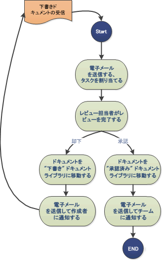
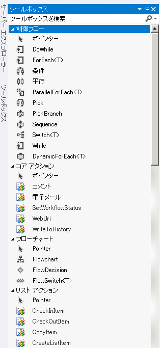

# SharePoint 2013 ワークフローの概要
SharePoint 2013のワークフローのインフラストラクチャを提供する新しく設計された ワークフロー マネージャー クライアント 1.0についてと、SharePoint ワークフローと新しい SharePoint アドイン用のモデルを統合する方法について確認します。
> **重要**
> SharePoint Server 2013および Microsoft Azure の設定および構成の手順については、「 [SharePoint 2013 ワークフロー マネージャーをセットアップおよび構成する](set-up-and-configure-sharepoint-2013-workflow-manager.md)」を参照してください。 
  
    
    

## SharePoint 2013のワークフローの概要

SharePoint 2013のワークフローを使用すると、ビジネス プロセスをモデル化および自動化できます。ワークフローでは、単一の承認者 (図 1 に示されます) によるドキュメント承認プロセスのように単純なものから、Web サービスの呼び出しやデータベースのサポートを使用する顧客向けの製品カタログなどの複雑なもの、多くの条件、ループ、ユーザー入力、タスク、カスタム アクションを使用した構造化ビジネス プロセスなど、実質的にどのようなビジネス プロセスにも対応します。
  
    
    

**図 1. 単純な SharePoint ワークフロー**

  
    
    

  
    
    

  
    
    

  
    
    
SharePoint 2013では、ワークフロー マネージャー クライアント 1.0の導入は Visual Studio ワークフローの新しい強力な基盤となります。Windows Workflow Foundation 4 を基礎とする ワークフロー マネージャー クライアント 1.0は、SharePoint の SharePoint アドイン用のモデルとクラウドベースのコンピューティングへの対応強化を反映し、以前のバージョンよりも機能が強化されています。これらの変更については、「 [SharePoint 2013 ワークフローの新機能](what-s-new-in-workflows-for-sharepoint-2013.md)」および「 [SharePoint 2013 ワークフローの基盤](sharepoint-2013-workflow-fundamentals.md)」を参照してください。
  
    
    
ワークフロー作成者にとって最も重要と思われるワークフローの作成方法は、大幅に進歩して単純化されています。現在、ワークフローは完全な宣言型 (設計者ベースでコードなしのワークフロー) であるだけでなく、主要なワークフロー作成環境である Visual Studio 2012 と SharePoint Designer 2013は両方とも単純化および合理化されています。
  
    
    
SharePoint 2013のワークフローの主な強化機能は以下のとおりです。SharePoint 2013のワークフローの新機能の概要について詳しくは、「 [SharePoint 2013 ワークフローの新機能](what-s-new-in-workflows-for-sharepoint-2013.md)」を参照してください。
  
    
    

- 接続性の強化により、ワークフローのクラウドベースの実行が使用可能になりました。SharePoint 2013では、社内のワークフローと Office 365 ベースのワークフローはまったく同等です。
    
  
- SharePoint 2013 のワークフローと SharePoint 2010 のワークフローの間には、 [SharePoint ワークフロー相互運用機能 ](sharepoint-2013-workflow-fundamentals.md#bkm_InteropBridge) による完全な相互運用性があります。
    
  
- Visual Studio のイベントとアクション、Web サービス、従来のプログラミング構造をすべて宣言型でコードなしの環境で使用でき、作成時の表現力が強化されました。
    
  
- Office 365 およびクラウド アプリケーション モデルの要件を満たすスケーラビリティと堅牢さ
    
  
- 接続性の強化により、高度に機能的な統合システムが実現しています。あらゆる外部システムから、ワークフローの呼び出しと制御が行えます。さらに、HTTP、SOAP、オープン データ プロトコル (OData)、REST (Representational State Transfer) などの一般的なプロトコルを使用して、任意のストリームおよびデータ ソースに対してワークフローから Web サービスの呼び出しを実行できます。
    
  
- SharePoint Designer 2013の開発者以外のユーザー向けの作成機能の強化と、Visio のワークフロー ロジックを作成する機能。
    
  
- カスタム ワークフロー アクションのサポート、宣言型環境における迅速な開発、一手順の開発、SharePoint アドインの開発のサポートなど、Visual Studio の強化、単純化されたワークフロー開発。
    
  
- ワークフローがビジネス プロセス管理の中間階層として機能する、ワークフロー主導の SharePoint アドインの完全サポート。
    
  

## ワークフロー マネージャー クライアント 1.0および SharePoint アドイン用のモデル

Visual Studio 2012 は、ワークフロー主導の SharePoint アドインの開発と、SharePoint アドイン用のモデルの強力な機能と柔軟性を最大限に活用するために最適化されています。SharePoint ワークフロー オブジェクト モデルを使用すると、SharePoint アプリの基盤としてワークフロー ロジックを利用できます。たとえば、ユーザーが目にするのはアプリ画面自体で、その裏ではワークフロー ロジックによってアプリが実行されている形になります。
  
    
    
また、Visual Studio 2012 は Microsoft Office アプリケーションの内部からワークフローを実行できるため、Office アドインの開発には理想的です。
  
    
    

## SharePoint 2013 ワークフローの作成

ワークフロー マネージャー クライアント 1.0の主要な作成環境には、SharePoint Designer 2013および Visual Studio の 2 つがあります。さらに、技術者以外の IT 担当者は Visio を使用してワークフロー ロジックを構築し、SharePoint Designer にインポートして SharePoint ワークフロー プロジェクトにアセンブルできます。
  
    
    
ただし、主要な作成環境は Visual Studio 2012 および SharePoint Designer 2013です。これらのうちどちらが要件に適合するかを判断するには、「 [SharePoint Designer と Visual Studio の比較](develop-sharepoint-2013-workflows-using-visual-studio.md#bkm_Comparing)」の表を参照してください。
  
    
    

## ワークフロー作成ツールとしての SharePoint Designer 2013

SharePoint Designer 2013はさまざまな側面から見て、SharePoint ワークフローの作成ツールとして最適です。高度なタスク (カスタム アクションの作成など) の中には、開発者が Visual Studio を使用して介入する必要があるものもありますが、SharePoint Designer 2013は幅広いワークフロー作成者にとって柔軟なワークフロー開発が可能な環境となります。
  
    
    

## Visual Studio 2012 を使用したワークフローの作成

Visual Studio 2012 には、SharePoint 2013 ワークフローのプロジェクトの種類が組み込まれています。Visual Studio で SharePoint ワークフロー プロジェクトを作成するには、次の手順で行います。
  
    
    

### Visual Studio を使用してワークフローを作成するには

1. Visual Studio 2012 を開いて新しいプロジェクトを作成します。[ **新しいプロジェクト**] ダイアログ ボックスで、図 2 に示すように [ **テンプレート**]、[ **Visual C#**]、[ **Office SharePoint**]、[ **SharePoint ソリューション**]、[ **SharePoint 2013 プロジェクト**] の順に選択します。
    
   **図 2. [新しいプロジェクト] ダイアログ ボックス**

  

![[新しいプロジェクト] ダイアログ ボックス](images/wfNewProject_b2.png)
  

  

  
2. プロジェクトが作成できたら、[ **プロジェクト**] メニューから [ **新しいアイテムの追加**] を選択し、図 3. のように [ **Office SharePoint**] アイテムの下の [ **ワークフロー**] を選択します。
    
   **図 3. [新しいアイテムの追加] ダイアログ ボックス**

  

![[新しいアイテムの追加] ダイアログ ボックス](images/wfAddNewItemDialog_b2.png)
  

  

  
3. ワークフロー プロジェクトが作成できたら、ワークフローを作成するデザイン領域が表示されます。ワークフロー開発環境には、ワークフロー作成要素を表示する大きなパレットを備えたカスタム ツールボックスがあります。
    
   **図 4. Visual Studio のワークフロー作成ツールボックス**

  

  

  

  

## その他の技術情報

 **SharePoint アドイン** の詳細については、以下のリンクを参照してください。
  
    
    

-  [SharePoint アドイン](http://msdn.microsoft.com/library/cd1eda9e-8e54-4223-93a9-a6ea0d18df70%28Office.15%29.aspx)
    
  
-  [SharePoint アドインの設計オプションを考慮するときの 3 つの方法](http://msdn.microsoft.com/library/0942fdce-3227-496a-8873-399fc1dbb72c%28Office.15%29.aspx)
    
  
-  [SharePoint アドインのアーキテクチャおよび開発環境に関する重要な要素](http://msdn.microsoft.com/library/ae96572b-8f06-4fd3-854f-fc312f7f2d88%28Office.15%29.aspx)
    
  
-  [SharePoint 2013 の外部データの操作](http://msdn.microsoft.com/library/1534a5f4-1d83-45b4-9714-3a1995677d85%28Office.15%29.aspx)
    
  
 **Visual Studio 2012** および **SharePoint Designer 2013** を使用したワークフローの開発の詳細については、以下のリンクを参照してください。
  
    
    

-  [Visual Studio を使用した SharePoint 2013 ワークフローの開発](develop-sharepoint-2013-workflows-using-visual-studio.md)
    
  
-  [SharePoint Designer および Visio でのワークフロー開発](workflow-development-in-sharepoint-designer-and-visio.md)
    
  
Windows Workflow Foundation 4 の詳細については、以下のリンクを参照してください。 
  
    
    

-  [A Developer's Introduction to Windows Workflow Foundation (WF) in .NET 4](http://msdn.microsoft.com/ja-jp/library/ee342461.aspx)
    
  
-  [Windows Workflow Foundation の新機能](http://msdn.microsoft.com/ja-jp/library/dd489410.aspx)
    
  
-  [Beginner's Guide to Windows Workflow Foundation](http://msdn.microsoft.com/ja-jp/vstudio/first-steps-with-wf.aspx)
    
  
-  [The Workflow Way: Understanding Windows Workflow Foundation](http://msdn.microsoft.com/ja-jp/library/dd851337.aspx)
    
  
-  [Introduction to the Windows Workflow Foundation Rules Engine](http://msdn.microsoft.com/ja-jp/library/dd554919.aspx)
    
  
-  [Windows Workflow Foundation integration with Windows Communication Foundation](http://msdn.microsoft.com/ja-jp/library/cc626077.aspx)
    
  

