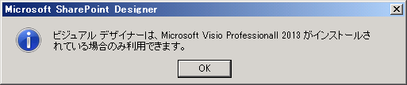
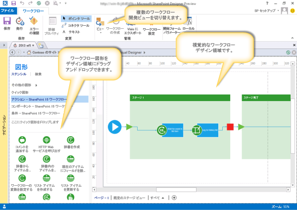
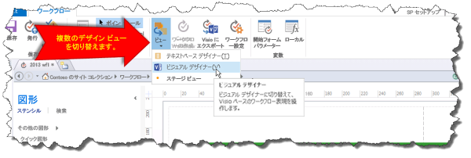

# SharePoint Designer 2013 のワークフロー開発用ビジュアル デザイナーについて
SharePoint Designer 2013 のビジュアル デザイナーの基本機能について説明します。
## SharePoint Designer 2013のビジュアル デザイナーの概要

SharePoint Designer 2013には、ビジュアル デザイナーという新しいワークフロー デザイン サーフェイスが追加されました。ビジュアル デザイナーを使用すると、デザイン サーフェイス上に図形をドラッグしてワークフローを開発できます。
  
    
    

> **重要**
> ビジュアル デザイナーを使用するには、SharePoint Designer 2013と同じコンピューター上に Visio Professional 2013がインストールされている必要があります。Visio がインストールされていないと、次の図で示すようなエラーが表示されます。 
  
    
    

**図: ビジュアル デザイナーを使用するには Visio 2013 Professional が必要**

  
    
    

  
    
    

  
    
    
左側の [ **図形**] ウィンドウには、ワークフローを作成するためにデザイン サーフェイスへドラッグできるワークフロー図形が含まれています。ワークフローの作成には、次の 3 つのカテゴリの図形を使用できます。 
  
    
    

- **アクション:** ワークフローで実行できる特定のアクション。たとえば、HTTP Web サービスを呼び出す、コメントを追加する、リストを更新するなどがあります。
    
  
- **コンポーネント:** ワークフロー アクションの構造化環境を提供するために追加できる汎用コンポーネント。たとえば、ステージ コンテナー、条件付きループ、ワークフロー開始図形などがあります。
    
  
- **条件:** 特定の条件に基づくワークフロー パスを提供するために使用できる条件ロジック図形。たとえば、ある値と別の値が等しいかどうか、あるユーザーが有効な SharePoint ユーザーであるかどうか、あるアイテムが特定の日時以内に作成されたものかどうかなどを確認する条件があります。
    
  

    
> **ヒント**
> SharePoint Designer 2013で使用できる図形の一覧については、「 [Visio の SharePoint Server ワークフロー テンプレートの図形](shapes-in-the-sharepoint-server-workflow-template-in-visio.md)」を参照してください。 
  
    
    

次の図は、ビジュアル デザイナーのワークフローを示します。
  
    
    

**SharePoint Designer 2013 のビジュアル デザイナー**

  
    
    

  
    
    

  
    
    

  
    
    

  
    
    

## SharePoint 2013のビジュアル デザイナーの使用方法

SharePoint Designer 2013のビジュアル デザイナーは、[ **ワークフロー**] タブの [表示] ドロップダウン メニューから開きます。ワークフローの開発に使用できるビューには次の 3 種類があります。
  
    
    

- **テキストベース デザイナー:** テキストベースのワークフロー開発環境。
    
  
- **ビジュアル デザイナー:** デザイン サーフェイスへ図形をドラッグしてワークフローを開発できるビジュアル ワークフロー開発環境 (Visio Professional 2013 が必要です)。
    
  
- **ステージ ビュー:** ワークフローの各ステージの関係を示す高レベルのビジュアル デザイン サーフェイスを表示します。 **ビジュアル デザイナー** ビューと似ていますが、図形レベルの詳細は表示されません (Visio Professional 2013 が必要です)。
    
  
次の図で示すように、[ **ワークフロー**] リボンの [ **管理**] グループの [ **ビュー**] でビューを切り替えることができます。
  
    
    

**SharePoint Designer 2013 のデザイン ビューの切り替え**

  
    
    

  
    
    

  
    
    
ワークフローは、テキストベース デザイナー、ビジュアル デザイナー、またはその両方を使用して開発できます。たとえば、テキストベース デザイナーを使用してワークフローを開発しているときに、ビジュアル デザイナーにビューを切り替えて引き続き同じワークフローを開発できます。同様に、ビジュアル デザイナーを使用してワークフローの開発を開始した後、テキストベース デザイナーにビューを切り替えて引き続き同じワークフローを開発することもできます。ビューを自由に行き来できるので、柔軟なワークフロー開発ができます。
  
    
    

## その他の技術情報

-  [SharePoint 2013 のワークフロー](http://technet.microsoft.com/ja-jp/sharepoint/jj556245.aspx)
    
  
-  [What's new in workflow in SharePoint Server 2013](http://msdn.microsoft.com/library/6ab8a28b-fa2f-4530-8b55-a7f663bf15ea.aspx)
    
  
-  [Getting started with SharePoint Server 2013 workflow](http://msdn.microsoft.com/library/cc73be76-a329-449f-90ab-86822b1c2ee8.aspx)
    
  
-  [SharePoint Designer および Visio でのワークフロー開発](workflow-development-in-sharepoint-designer-and-visio.md)
    
  
-  [ワークフロー アクション クイック リファレンス (SharePoint 2013 ワークフロー プラットフォーム)](workflow-actions-quick-reference-sharepoint-2013-workflow-platform.md)
    
  

