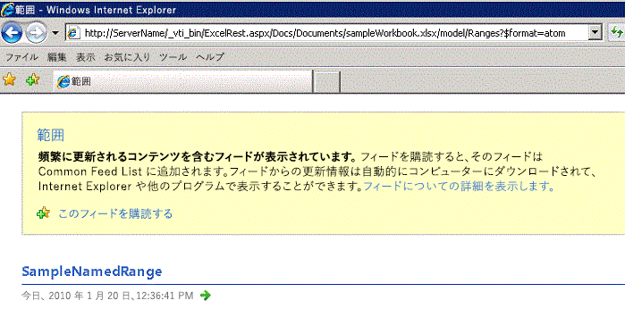
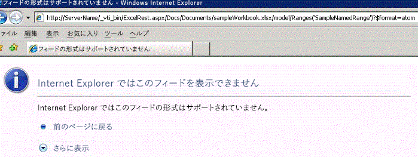
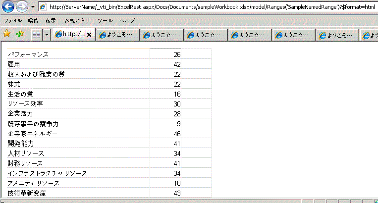

# Atom フィードおよび HTML フラグメントを使用して範囲を取得する

このトピックでは、Excel Services で REST API を使用して範囲にアクセスする 2 つの方法、つまり Atom フィードと HTML フラグメントについて説明します。
  
    
    


> **メモ**
> Excel Services REST API は、SharePoint 2013 および SharePoint 2016 オンプレミスに適用されます。Office 365 Education、Business、および Enterprise の各アカウントには、 [Microsoft Graph](http://graph.microsoft.io/ja-jp/docs/api-reference/v1.0/resources/excel
) エンドポイントの一部である Excel REST API を使用します。
  
    
    


## 範囲へのアクセス

Excel Services の REST API では、範囲を取得する 2 つのメカニズムがサポートされています。1 つ目の方法は、主としてアプリケーションがブックの未加工のデータ (シートの生の数値または値) を取得できるようにするために使用されます。2 つ目は、ブラウザー内から HTML フラグメントを取得する方法です。
  
    
    
「 [Excel Services REST API での検出](discovery-in-excel-services-rest-api.md)」のトピックで説明しているように、検出を使用するモデル ページへの REST URL は次のとおりです。
  
    
    


```

http://<ServerName>/_vti_bin/ExcelRest.aspx/<DocumentLibrary>/<FileName>/model
```

したがって、 `http://` _<ServerName>_ `/Docs/Documents/sampleWorkbook.xlsx` に保存した **sampleWorkbook.xlsx** というファイル名のブックの場合、モデル ページへの URI は次のとおりです。
  
    
    


```
http://<ServerName>/_vti_bin/ExcelRest.aspx/Docs/Documents/sampleWorkbook.xlsx/model
```

「 [Excel Services REST API での検出](discovery-in-excel-services-rest-api.md)」で説明されている検出メカニズムを使用する場合、サーバー上のモデル ページ ( `http://` _<ServerName>_ `/_vti_bin/ExcelRest.aspx/Docs/Documents/sampleWorkbook.xlsx/model`) の [ **範囲**] Atom フィードをクリックすると、ブック内のすべての名前付き範囲を示すページが表示されます。次のスクリーン ショットに示されているとおり、 **sampleWorkbook.xlsx** には 1 つの名前付き範囲が含まれています。
  
    
    

> **重要**
> 検出によって返される範囲だけでなく、任意の範囲を指定することもできます。コロン ":" は、"|" に置き換える必要があります。たとえば、"A1:G5" の代わりに "A1|G5" を使用します。 
  
    
    


> **メモ**
> "?" や "#" などの文字はサポートされていません。特別な文字を含むシート名を正しく参照するための基本的な指針は、特別な文字を含むシートを指す数式を参照するときには "Excel クライアントが見るものを見る" こと、そしてその例に従うことです。 
  
    
    


**Excel Services REST による名前付き範囲の検出**

  
    
    

  
    
    

  
    
    

### Atom フィードを使用した範囲へのアクセス

範囲検出ページで [ **SampleNamedRange**] をクリックすると、次の URL にナビゲートします。
  
    
    

```
http://<ServerName>/_vti_bin/ExcelRest.aspx/Docs/Documents/sampleWorkbook.xlsx/model/Ranges('SampleNamedRange')?$format=atom
```

なお、Internet Explorer では、生成されたページがエラーのように見えることに注意してください (次のスクリーン ショットを参照)。
  
    
    

**Atom を使用した Excel Services REST 範囲の検出**

  
    
    

  
    
    

  
    
    
Internet Explorer では、項目が 1 つの Atom フィード項目を表示できません。しかし、ページのソースを表示すると、フィード項目を含む XML を見ることができます。
  
    
    


```XML
<?xml version="1.0" encoding="utf-8"?>
<entry xmlns:x="http://schemas.microsoft.com/office/2008/07/excelservices/rest" xmlns:d="http://schemas.microsoft.com/ado/2007/08/dataservice" xmlns:m="http://schemas.microsoft.com/ado/2007/08/dataservices/metadata" xmlns="http://www.w3.org/2005/Atom">
  <title type="text">SampleNamedRange</title>
  <id>http://ServerName/_vti_bin/ExcelRest.aspx/Docs/Documents/sampleWorkbook.xlsx/model/Ranges('SampleNamedRange')</id>
  <updated>2010-01-20T21:28:10Z</updated>
  <author>
    <name />
  </author>
  <link rel="self" href="http://ServerName/_vti_bin/ExcelRest.aspx/Docs/Documents/sampleWorkbook.xlsx/model/Ranges('SampleNamedRange')?$format=atom" title="SampleNamedRange" />
  <category term="ExcelServices.Range" scheme="http://schemas.microsoft.com/ado/2007/08/dataservices/scheme" />
  <content type="application/xml">
    <x:range name="SampleNamedRange">
      <x:row>
        <x:c>
          <x:fv>Performance</x:fv>
        </x:c>
        <x:c>
          <x:v>26</x:v>
          <x:fv>26</x:fv>
        </x:c>
        <x:c />
      </x:row>
      <x:row>
        <x:c>
          <x:fv>Employment</x:fv>
        </x:c>
        <x:c>
          <x:v>42</x:v>
          <x:fv>42</x:fv>
        </x:c>
        <x:c />
      </x:row>
      <x:row>
        <x:c>
          <x:fv>Earnings And Job Quality</x:fv>
        </x:c>
        <x:c>
          <x:v>22</x:v>
          <x:fv>22</x:fv>
        </x:c>
        <x:c />
      </x:row>
    ... XML truncated for brevity. 
      <x:row>
        <x:c>
          <x:fv>Innovation Assets</x:fv>
        </x:c>
        <x:c>
          <x:v>43</x:v>
          <x:fv>43</x:fv>
        </x:c>
        <x:c />
      </x:row>
      <x:row>
        <x:c />
        <x:c>
          <x:fv>State</x:fv>
        </x:c>
        <x:c />
      </x:row>
    </x:range>
  </content>
</entry>
```

フィード項目には、範囲内のデータを表す XML が含まれています。注目するべき XML 要素は、次のとおりです。
  
    
    

- **<range>** 範囲要素。返された範囲のコンテナーを表します。
    
  
- **<row>** 行要素。範囲内の各行を表します。
    
  
- **<c>** セル要素。行内の各セルを表します。
    
  
- **<fv>** 書式設定された値要素。Excel によって書式設定された値を表します。値がブック内で string 型である場合は、書式設定された値要素が **<c>** 以下の唯一の要素になります。
    
  
- **<v>** 値要素。数値を表します。セル内の値が文字列ではなく数値である場合は、値要素にその情報が入ります。
    
  
XML を使用するのは、Excel の範囲からデータを取得する簡便な方法です。これをアプリケーションの中で使用できます。
  
    
    

### HTML を使用した範囲へのアクセス

Atom フィードを使用して名前付き範囲にアクセスする URL を見ると、URL の最後の部分に  `$format` というパラメーターがあり、その値が `atom` に設定されていることがわかります。このパラメーターは `html` という値をとることもできます。 `atom` という値を `html` に変更した URL は、Atom フィードの代わりに HTML フラグメントを返します。URL の例を次に示します。
  
    
    

```

http://<ServerName>/_vti_bin/ExcelRest.aspx/Docs/Documents/sampleWorkbook.xlsx/model/Ranges('SampleNamedRange')?$format=html
```

Internet Explorer では、このページは次の図のように表示されます。
  
    
    

> **メモ**
> この HTML は、 **IFRAME** に直接取り込むことができます。または、JavaScript を使用してシームレスな表示を作成することもできます。
  
    
    


  
    
    

  
    
    

  
    
    

  
    
    

## 関連項目


#### 概念


  
    
    
 [Excel Services REST API のリソース URI](resources-uri-for-excel-services-rest-api.md)
