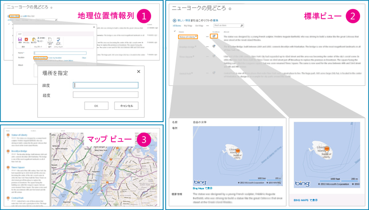

# [方法] SharePoint 2013 で地理位置情報列をプログラムでリストに追加する
SharePoint 2013のリストに、プログラムによって [地理位置情報] 列を追加する方法について説明します。新機能の地理位置情報フィールドは、独自の位置情報に基づいたフィールド タイプを作成します。このフィールドを使用することで、SharePoint リスト内の位置情報と地図を、位置情報に基づく Web サイトに統合します。
SharePoint 2013には、新しいフィールド タイプである地理位置情報が導入され、SharePoint リストに位置情報の注釈を含めることができるようになりました。[地理位置情報] タイプの列では、位置情報として緯度と経度から成る座標値を 10 進数の度数を使用して入力したり、ブラウザーに W3C Geolocation API が実装されている場合はブラウザーからユーザーの現在位置の座標を取得したりできます。[地理位置情報] 列の詳細については、「 [SharePoint 2013 でロケーションとマップ機能を組み込む](integrating-location-and-map-functionality-in-sharepoint-2013.md)」を参照してください。既定では、[地理位置情報] 列が SharePoint リストに含まれていません。[地理位置情報] 列を SharePoint リストに追加するには、コードを記述する必要があります。この記事では、SharePoint クライアント オブジェクト モデルを使用してプログラムによって地理位置情報フィールドをリストに追加する方法について説明します。
  
    
    

地理位置情報フィールドの値またはデータをリストに表示するには、SQLSysClrTypes.msi という MSI パッケージをすべての SharePoint フロントエンド Web サーバーにインストールする必要があります。このパッケージは、新しい図形座標、地理、および階層 ID の種類を SQL Server 2008 に実装するコンポーネントをインストールします。既定では、このファイルが SharePoint Online 用にインストールされます。ただし、SharePoint Server 2013の社内設置型の展開用ではありません。この操作を実行するためには、Farm Administrators グループのメンバーである必要があります。SQLSysClrTypes.msi をダウンロードするには、Microsoft ダウンロード センターの「 [Microsoft SQL Server 2008 R2 SP1 Feature Pack](http://www.microsoft.com/ja-jp/download/details.aspx?id=26728)」(SQL Server 2008 用) または「 [Microsoft SQL Server 2012 Feature Pack](http://www.microsoft.com/ja-jp/download/details.aspx?id=29065)」(SQL Server 2012 用) を参照してください。
## [地理位置情報] 列の追加の前提条件
<a name="SP15addgeo_prereq"> </a>


  
    
    

- Access to a SharePoint 2013リストへのアクセス、列を追加するのに必要な特権。
    
  
- ファーム レベルまたは Web レベルでの有効な Bing Maps キーセット。これは、 [Bing Maps Account Center](https://www.bingmapsportal.com/) から入手できます。
    
    > **重要**
      > Bing Maps キーの使用にあたっては、利用規約を遵守する義務を負い、Bing Maps サービスに渡されたデータに関しては、アプリケーションの使用者への開示義務を負うものとします。 
- Visual Studio 2010。
    
  

## コード例: プログラムによって [地理位置情報] 列をリストに追加する
<a name="SP15addgeo_addcolumn"> </a>

SharePoint 2013クライアント オブジェクト モデルを使用するリストに [地理位置情報] 列を追加するには、次の手順に従います。
  
    
    

### クライアント オブジェクト モデルを使用するリストに [地理位置情報] 列を追加するには


1. Visual Studio を起動します。
    
  
2. メニュー バーで、[ **ファイル**]、[ **新しいプロジェクト**] の順にクリックします。[ **新しいプロジェクト**] ダイアログ ボックスが開きます。
    
  
3. [ **新しいプロジェクト**] ダイアログ ボックスの [ **インストールされているテンプレート**] ボックスで [ **C#**] 言語を選択し、[ **コンソール アプリケーション**] テンプレートを選択します。
    
  
4. プロジェクトに名前を付けて、[ **OK**] をクリックします。
    
  
5. Visual Studio によってプロジェクトが作成されます。次のアセンブリへの参照を追加し、[ **OK**] を選択します。
    
    Microsoft.SharePoint.Client.dll
    
    Microsoft.SharePoint.Client.Runtime.dll
    
  
6. 既定の .cs ファイル内で **using** ディレクティブを次のように追加します。
    
     `using Microsoft.SharePoint.Client;`
    
  
7. .cs ファイル内の **Main** メソッドに次に示すコードを追加します。
    
  ```cs
  
class Program
    {
        static void Main(string[] args)
        {
            AddGeolocationField();
            Console.WriteLine("Location field added successfully");
        }
        private static void AddGeolocationField()
        { 
         // Replace site URL and List Title with Valid values.
            ClientContext context = new ClientContext("<Site Url>"); 
            List oList = context.Web.Lists.GetByTitle("<List Title>");
            oList.Fields.AddFieldAsXml("<Field Type='Geolocation' DisplayName='Location'/>",true, AddFieldOptions.AddToAllContentTypes);                                        
            oList.Update();
            context.ExecuteQuery();
        } 
    }
  ```

8. <Site Url> と <List Title> を有効な値で置き換えます。
    
  
9.  [プロジェクトのプロパティ] で対象のフレームワークを .NET Framework 4.0 または 3.5 に設定し、コード例を実行します。
    
  
10. リストに移動します。リスト内に、地理位置情報タイプの [ **場所**] という列があるはずです。この列に値を入力し、動作を確かめることができます。図 1 に、リスト内に表示される既定の位置と地図機能を示します。
    
   **図 1. 既定の位置と地図機能の概要図**

  


  

  

  

## プログラムによって、地理位置情報フィールド値を持つリスト アイテムを SharePoint リストに追加する
<a name="SP15addgeo_addlistitem"> </a>

SharePoint リストに地理位置情報フィールドを追加したら、そのリスト アイテムをリストにプログラムによって追加することができます。リスト アイテムをリストにプログラムによって追加するには、2 とおりの方法があります。1 つは **FieldGeolocationValue** オブジェクトを地理位置情報フィールドを渡す方法で、もう 1 つは **Raw 値** を地理位置情報フィールドに渡す方法です。
  
    
    

### メソッド A: FieldGeolocationValue オブジェクトを地理位置情報フィールドに渡す


- 次のメソッドは、地理位置情報フィールド値をオブジェクトに渡すことで、リスト アイテムを追加します。
    
  ```cs
  
private void AddListItem()
        {   // Replace site URL and List Title with Valid values.
            ClientContext context = new ClientContext("<Site Url>");
            List oList = context.Web.Lists.GetByTitle("<List Name>");

            ListItemCreationInformation itemCreationInfo = new ListItemCreationInformation();
            ListItem oListItem = oList.AddItem(itemCreationInfo);

            oListItem["Title"] = "New Title";

            FieldGeolocationValue oGeolocationValue = new FieldGeolocationValue();
            oGeolocationValue.Latitude = (double)17.4;
            oGeolocationValue.Longitude = (double)78.4;
            oListItem["location"] = oGeolocationValue;

            oListItem.Update();
            context.ExecuteQuery();
        }

  ```


### メソッド B: 新しい Raw 値を地理位置情報フィールドに渡す


- 次のメソッドは、Raw 値を地理位置情報フィールド値に渡すことで、SharePoint リストに項目を追加します。
    
  ```cs
  
private void AddListItem()
        {   // Replace site URL and List Title with Valid values.
            ClientContext context = new ClientContext("<Site Url>");
            List oList = context.Web.Lists.GetByTitle("<List Name>");

            ListItemCreationInformation itemCreationInfo = new ListItemCreationInformation();
            ListItem oListItem = oList.AddItem(itemCreationInfo);

            oListItem["Title"] = "New Title";
             // Data in WKT (World Known Text) format.
            oListItem["location"] = "POINT (78.4 17.4)" ; 

            oListItem.Update();
            context.ExecuteQuery();
        }

  ```


## その他の技術情報
<a name="SP15addgeo_addlresources"> </a>


-  [SharePoint 2013 でロケーションとマップ機能を組み込む](integrating-location-and-map-functionality-in-sharepoint-2013.md)
    
  
-  [[方法] SharePoint 2013 で、Web およびファーム レベルで Bing Maps キーを設定する](how-to-set-the-bing-maps-key-at-the-web-and-farm-level-in-sharepoint-2013.md)
    
  
-  [方法: クライアント側レンダリングを使用して地理位置情報フィールド型を拡張する](how-to-extend-the-geolocation-field-type-using-client-side-rendering.md)
    
  
-  [SharePoint 2013 で地理位置情報フィールドのマップ ビューを作成する](create-a-map-view-for-the-geolocation-field-in-sharepoint-2013.md)
    
  
-  [方法: Windows Phone アプリおよび SharePoint 2013 リストに地図を統合する](how-to-integrate-maps-with-windows-phone-apps-and-sharepoint-2013-lists.md)
    
  
-  [モバイル アプリケーションの場所を使用する (SharePoint 2013 プレビュー)](http://technet.microsoft.com/ja-jp/library/fp161355%28office.15%29.aspx)
    
  

