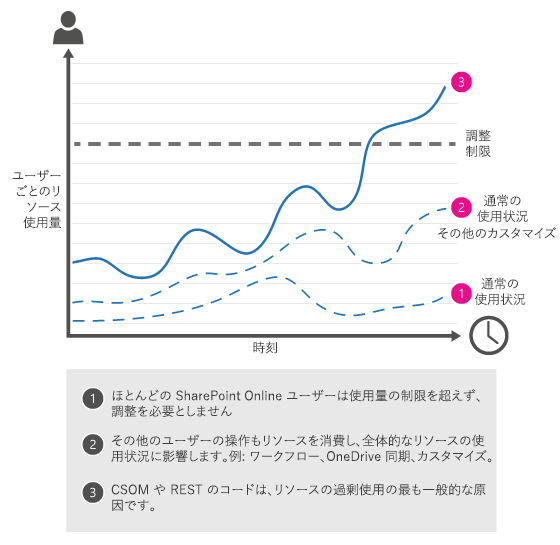
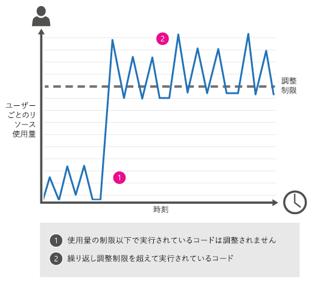
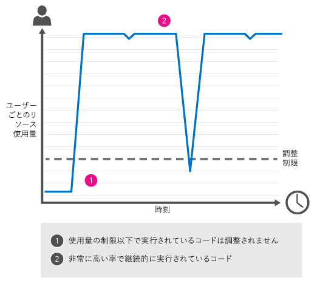

# SharePoint Online で調整またはブロックを回避する方法
SharePoint Online での調整と、調整とブロックを回避する方法を説明します。より簡単に作業するための CSOM および REST のサンプル コードも示します。
 *この記事の内容:* 
  
    
    


-  [調整について](how-to-avoid-getting-throttled-or-blocked-in-sharepoint-online.md#BKMK_Whatisthrottling)
    
  
-  [SharePoint Online での一般的な調整シナリオ](how-to-avoid-getting-throttled-or-blocked-in-sharepoint-online.md#BKMK_Commonthrottlingscenarios)
    
  
-  [正確な調整制限を設定できない理由](how-to-avoid-getting-throttled-or-blocked-in-sharepoint-online.md#BKMK_Whycantyoujusttellmetheexactthrottlinglimits)
    
  
-  [調整に対応するベスト プラクティス](how-to-avoid-getting-throttled-or-blocked-in-sharepoint-online.md#BKMK_Bestpracticestohandlethrottling)
    
  
-  [GitHub CSOM コード サンプル: SharePoint Online 調整](how-to-avoid-getting-throttled-or-blocked-in-sharepoint-online.md#BKMK_GitHubCSOMandRESTcodesamplesSharePointOnlineThrottling)
    
  
-  [SharePoint Online でブロックが生じた場合の対処方法](how-to-avoid-getting-throttled-or-blocked-in-sharepoint-online.md#BKMK_Whatshouldyoudoifyougetblocked)
    
  
-  [その他の技術情報](how-to-avoid-getting-throttled-or-blocked-in-sharepoint-online.md#BKMK_Additionalresources)
    
  

SharePoint Online でファイルを移行するときなどに CSOM プロセスが実行されるものの調整されていることがよくありますか。さらに悪いことに、完全にブロックされることさえあります。このような状況の詳細と、これを回避する方法を説明します。
  
    
    


## 調整について
<a name="BKMK_Whatisthrottling"> </a>

SharePoint Online は、SharePoint Online サービスの最適なパフォーマンスと信頼性を維持する目的で調整を使用します。調整では、リソースの過剰な使用を防ぐため、ユーザー アクションまたは (スクリプトまたはコードによる) 同時呼び出しの数が制限されます。
  
    
    
ただし、ユーザーが SharePoint Online で調整されるケースは非常に稀です。サービスは堅牢であり、非常に大量のボリュームにも対処できるように設計されています。調整が発生する場合、99% の割合でその原因はカスタム コードにあります。この原因以外に調整が発生することがないというわけではありませんが、そのような状況は一般的ではありません。たとえば 10 台のマシンをスピンアップし、10 台すべてのマシンでクライアント同期が実行され、各マシンで 1TB のコンテンツが同期されるとします。このような状況では調整が発生する可能性があります。
  
    
    

  
    
    

  
    
    

### SharePoint Online で調整が発生する状況

あるユーザーが使用制限を超えると、そのユーザー アカウントからさらに送られる要求は SharePoint Online によって短時間、調整されます。調整が有効な間、ユーザー操作はすべて調整されます。
  
    
    

- ユーザーがブラウザーで直接実行する要求の場合、SharePoint Online により調整情報ページにリダイレクトされ、要求は失敗します。
    
  
- その他すべての要求の場合 (CSOM または REST 呼び出しを含む)、SharePoint Online は HTTP ステータス コード 429 (「要求が多すぎます」) を返し、要求は失敗します。
    
  
問題のあるプロセスが使用制限を超過し続けている場合、SharePoint Online はプロセスを完全にブロックすることがあります。その場合、HTTP ステータス コード 503 (「サービスを使用できません」) が表示されることがあり、Office 365 メッセージ センターからブロックの通知があります。このエラー メッセージを次に示します。
  
    
    

  
    
    
![[503 サーバーを利用できません] というメッセージ](images/e70a43c1-43ba-4f5c-b25f-e3995f18dd16.png)
  
    
    
503 「サービスを使用できません」メッセージ。
  
    
    

## SharePoint Online での一般的な調整シナリオ
<a name="BKMK_Commonthrottlingscenarios"> </a>

SharePoint Online でユーザー単位の調整が生じる最も一般的な原因は、クライアント側オブジェクト モデル (CSOM) コードまたは Representational State Transfer (REST) コードで実行される操作の頻度と数が多すぎることです。
  
    
    

- **散発的なトラフィック**
    
    一時点でのトラフィック量は多くないものの、実行期間中にかなりの量のトラフィックが発生すると、断続的に調整が発生することがあります。
    
  - たとえば、ファイルを SharePoint Online へ移行した後に、ファイルのメタデータを更新するカスタム CSOM または REST スクリプトを実行するとします。CSOM/REST スクリプトは多数のファイルを非常に高い頻度で更新するため、調整が発生します。同様に、REST サービスを使用するオートコンプリート UI ウィジェットは、各エンド ユーザー操作中にリストの呼び出しを多数実行するため、同時にリソースを消費するその他の操作によっては、調整が発生することがあります。
    

  

  

  
- **圧倒的な大量トラフィック**
    
    1 つのプロセスが、長期にわたって継続的に調整制限を大幅に超過します。
    
  - Web サービスを使用して、ユーザー プロファイル プロパティを同期するツールを作成したとします。このツールは、基幹業務 (LOB) 人事 (HR) システムの情報に基づいてユーザー プロファイルのプロパティを更新します。このツールが呼び出しを実行する頻度が高すぎます。
    
  
  - SharePoint Online でロード テスト用のスクリプトを実行すると、調整が生じます。SharePoint Online ではロード テストはできません。
    
  
  - SharePoint Online のチーム サイトをカスタマイズし、ステータス インジケーターをホーム ページに追加しました。このステータス インジケーターが頻繁に更新されて、そのページで SharePoint Online サービスに対する呼び出しが多くなりすぎ、調整が発生します。
    

  

  

  

## 正確な調整制限を設定できない理由
<a name="BKMK_Whycantyoujusttellmetheexactthrottlinglimits"> </a>

調整制限を設定して公表するということは容易に聞こえますが、実際には最良の方法ではありません。SharePoint Online でのリソース使用状況を継続的に監視しており、SharePoint Online のパフォーマンスと信頼性を損なわずにユーザーが最大数のリソースを使用できるように、使用状況に応じて調整を細かく調整しています。この点から、調整に対応するため、CSOM コードと REST コードに増分バックオフを組み込むことが非常に重要なのです。これによりコードはいつでも可能な限り高速に実行され、調整制限に達するとコードは「過不足のない」状態にバックオフできます。この記事の後半に、増分バックオフの使用法を示すコード サンプルが記載されています。
  
    
    

## 調整に対応するベスト プラクティス
<a name="BKMK_Bestpracticestohandlethrottling"> </a>


- 要求あたりの操作数を削減する
    
  
- 呼び出し頻度を削減する
    
  
- 増分バックオフを使用して、調整が発生しない状態になるまで呼び出しの回数と頻度を削減する
    
  
増分バックオフは、調整されたコードを再度実行するまで、再試行のたびに徐々に長くなる待機を使用します。この記事で後述する GitHub コード サンプルを使用できます。このコード サンプルはコードに増分バックオフを追加する拡張メソッドとして作成されています。
  
    
    
バックオフは調整に対処する最速の方法ですが、それはユーザーが調整されている間に SharePoint Online がリソース使用量のログへの記録を続けるためです。つまり、呼び出しが失敗しても使用制限に対して加算されることに変わりはないため、積極的な再試行は不利に働きます。バックオフが早ければ早いほど、使用制限の超過を早く止めることができます。 
  
    
    
SharePoint Online アクティビティの監視方法について詳しくは、「 [Diagnosing performance issues with SharePoint Online](http://msdn.microsoft.com/library/93502df4-552f-409b-971b-2e9b0f38588f.aspx)」をご覧ください。
  
    
    
Microsoft Cloud での調整についてのより一般的な説明については、「 [Throttling Pattern](http://msdn.microsoft.com/library/4baf5af2-32fc-47ab-8569-3e5c59a5ebd5.aspx)」を参照してください。
  
    
    

## GitHub CSOM コード サンプル: SharePoint Online 調整
<a name="BKMK_GitHubCSOMandRESTcodesamplesSharePointOnlineThrottling"> </a>

 [Office 365 デベロッパー パターンとプラクティスのリポジトリ](http://github.com/OfficeDev/PnP)の  [CoreThrottling ](https://github.com/OfficeDev/PnP/tree/dev/Samples/Core.Throttling) は、増分バックオフの技法を示すコード サンプルです。この技法では、必要なコード変更を最小限にとどめることができます。
  
    
    
このコード サンプルを実行する前に、次の操作を実行してください。
  
    
    

- **Program.cs** を開き、 **Main** メソッドに次の情報を入力します。
    
  - Office 365 開発者アカウントの資格情報
    
  
  - Office 365 開発者向けサイトの URL
    
  
  - Office 365 開発者向けサイトにあるテスト ドキュメント ライブラリの名前
    
  
- **App.Config** ファイルが無効というエラーが出る場合は、 **ソリューション エクスプローラー** で **App.config** を右クリックし、[ **プロジェクトから除外** ] を選択してください。
    
  
ユーザーのみ承認ポリシーを使用するコンソール アプリケーションとして **Core.Throttling** が実行される場合、このコード サンプルは、現在のユーザーのアクセス許可を使用することになります。Program.cs の **Main** メソッドでは、while ループを使用してテスト ドキュメント ライブラリに新しいフォルダーが繰り返し作成されます。その後、 **ctx.ExecuteQueryWithExponentialRetry** が呼び出され、CSOM を使用して **ExecuteQuery** メソッドが実行されます。 **ExecuteQueryWithExponentialRetry** は、 [ClientContext](https://msdn.microsoft.com/library/office/microsoft.sharepoint.client.clientcontext%28v=office.15%29.aspx) オブジェクトの拡張メソッドであり、 **ClientContextExtension.cs** 内で定義されています。
  
    
    
SharePoint Online が **ExecuteQuery** ステートメントを調整する場合、 **ExecuteQueryWithIncrementalRetry** により、次のようにして増分バックオフの技法が開始されます。
  
    
    

- **WebException** をキャッチし、 **HttpWebResponse.StatusCode** をチェックします。SharePoint Online が **ExecuteQuery** ステートメントを調整した場合は、 **HttpWebResponse.StatusCode** は 429 になります。
    
  
- 現在のスレッドが、 **backoffInterval** で指定された時間だけ中断します。
    
  
- 現在のスレッドが再開されると、 **backoffInterval** が 2 倍に設定され、実行した再試行の数 ( **retryAttempts** ) がインクリメントされます。 **backoffInterval** が 2 倍になるため、SharePoint Online によって調整されたコードを再試行するまでコードが活動を中断する時間が長くなります。
    
  
- **ExecuteQuery** ステートメントが正常に実行されるか、または許容される試行回数 ( **retryCount** ) を超えるまで、この処理が繰り返されます。
    
  

### CSOM コード サンプル: 増分バックオフと再試行 (この記事の後半に記載されている ExecuteQueryWithIncrementalRetry メソッドを呼び出す)


```

using (var ctx = new ClientContext(serverUrl))
       {
           //Provide account and pwd for connecting to the source
           var passWord = new SecureString();
           foreach (char c in password.ToCharArray()) passWord.AppendChar(c);
           ctx.Credentials = new SharePointOnlineCredentials(login, passWord);
            try
           {
               int number = 0;
               // This loop will be executed 1000 times, which will cause throttling to occur
               while (number < 1000)
               {
                   // Try to create new folder based on Ticks to the given list as an example process
                   var folder = ctx.Site.RootWeb.GetFolderByServerRelativeUrl(listUrlName);
                   ctx.Load(folder);
                   folder = folder.Folders.Add(DateTime.Now.Ticks.ToString());
                   // Extension method for executing query with throttling checks
                   ctx.ExecuteQueryWithIncrementalRetry(5, 30000); //5 retries, with a base delay of 30 secs.
                   // Status indication for execution.
                   Console.WriteLine("CSOM request successful.");
                   // For loop handling.
                   number = number + 1;
               }
           }
           catch (MaximumRetryAttemptedException mex)
           {
               // Exception handling for the Maximum Retry Attempted
               Console.WriteLine(mex.Message);
           }
       }

```


### CSOM コード サンプル: ExecuteQueryWithIncrementalRetry メソッド


```

public static void ExecuteQueryWithIncrementalRetry(this ClientContext context, int retryCount, int delay)
        {
            int retryAttempts = 0;
            int backoffInterval = delay;
            if (retryCount <= 0)
                throw new ArgumentException("Provide a retry count greater than zero.");
           if (delay <= 0)
                throw new ArgumentException("Provide a delay greater than zero.");
           while (retryAttempts < retryCount)
            {
                try
                {
                    context.ExecuteQuery();
                    return;
                }
                catch (WebException wex)
                {
                    var response = wex.Response as HttpWebResponse;
                    if (response != null &amp;&amp; response.StatusCode == (HttpStatusCode)429)
                    {
                        Console.WriteLine(string.Format("CSOM request exceeded usage limits. Sleeping for {0} seconds before retrying.", backoffInterval));
                        //Add delay.
                        System.Threading.Thread.Sleep(backoffInterval);
                        //Add to retry count and increase delay.
                        retryAttempts++;
                        backoffInterval = backoffInterval * 2;
                    }
                    else
                    {
                        throw;
                    }
                }
            }
            throw new MaximumRetryAttemptedException(string.Format("Maximum retry attempts {0}, have been attempted.", retryCount));
       }

```


## SharePoint Online でブロックが生じた場合の対処方法
<a name="BKMK_Whatshouldyoudoifyougetblocked"> </a>

ブロックは、最も極端な形式の調整です。SharePoint Online サービスの全体的な正常性に深刻な影響を及ぼす可能性がある、長期にわたる非常に大量のトラフィックが発生している場合を除き、テナントをブロックすることは非常に稀です。ブロックは、非常に大量のトラフィックによって SharePoint Online のパフォーマンスと信頼性が低下することを防ぐために適用されます。通常テナンシー レベルで適用されるブロックは、問題が解決されるまでの間、問題のあるプロセスの実行を阻止します。サブスクリプションがブロックされる場合、問題のあるプロセスに変更を加えるための処置をとらないと、ブロックを除去できません。
  
    
    
サブスクリプションがブロックされると、HTTP ステータス コード 503 が表示され、Office 365 メッセージ センターでブロックされたことについて通知されます。このメッセージには、ブロックの原因、問題を解決するための方法のガイダンス、およびブロックを除去するための連絡先が記されています。
  
    
    

## その他の技術情報
<a name="BKMK_Additionalresources"> </a>


-  [Diagnosing performance issues with SharePoint Online](http://msdn.microsoft.com/library/93502df4-552f-409b-971b-2e9b0f38588f.aspx)
    
  
-  [Capacity planning and load testing SharePoint Online](http://msdn.microsoft.com/library/22fa7e7e-7554-4987-b56f-b39bbf303a0a.aspx)
    
  
-  [GitHub: SharePoint Online の調整のコード サンプル](https://github.com/OfficeDev/PnP/tree/dev/Samples/Core.Throttling)
    
  

