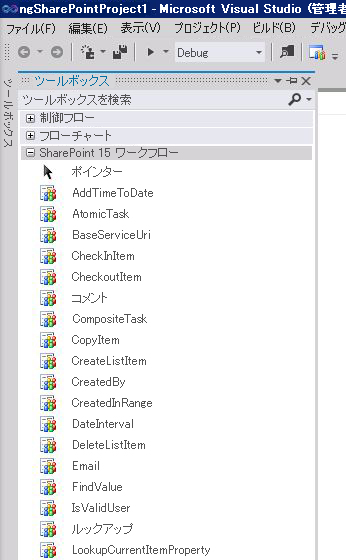
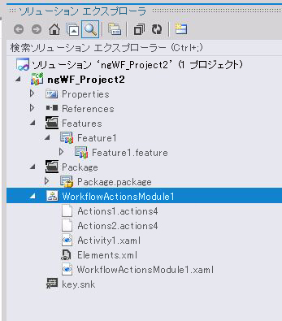

# [方法] ワークフローのカスタム アクションを作成および展開する
SharePoint 2013でカスタム ワークフロー アクションを作成することによって、SharePoint Designer のワークフロー アクションの既存のライブラリでは要件が満たされないビジネス プロセスをモデル化する方法を確認します。
SharePoint Designer は、ワークフロー ​​デザイナーのユーザー インターフェイス (UI) によって使用できる一連のワークフロー アクションを提供します。SharePoint Designer に含まれるワークフロー アクションは非常に広範囲に及びますが、限りがあります。場合によっては、SharePoint Designer で使用可能なワークフロー アクションの既存のライブラリでは要件が満たされないビジネス プロセスをモデル化する必要があります。
  
    
    

ビジネス プロセスには多くの場合に特別な要件があることを考慮し、SharePoint 2013ではカスタム ワークフロー アクションを作成できます。これらのカスタム アプリケーションは Visual Studio を使用して開発でき、その後それらをパッケージ化して SharePoint に展開できます。その時点で、カスタム アクションは SharePoint Designer のワークフロー作成者から使用可能となり、既存のアクションのライブラリに含まれているものと同様になります。この機能を使用すると、ワークフロー作成環境の機能を特殊なビジネス プロセスに対応するようにカスタマイズできます。
> **メモ**
> カスタム アクションの作成を例示したサンプルが提供されています。このサンプルは、Readme ファイルと共に次のサイトから入手できます。 [SharePoint 2013 workflow: Create a custom action](http://code.msdn.microsoft.com/SharePoint-2013-workflow-41e5c0f9) (http://code.msdn.microsoft.com/SharePoint-2013-workflow-41e5c0f9)
  
    
    

## カスタム ワークフロー アクションの主要なシナリオ

カスタム ワークフロー アクションの主要なシナリオを例示します。
  
    
    

1. ビジネス アナリストや、その他の技術者ではない IT 担当者が SharePoint Designer を使用してワークフローを作成し、内部ビジネス プロセス (ドキュメント承認プロセスなど) をモデル化するとします。ただし、この会社では、最終的な承認時に実行されるプロセスの最終段階は、指定された印刷部数のドキュメントを印刷して製本する外部印刷業者にドキュメントを自動的に送信する処理です。 
    
  
2. SharePoint Designer 2013 に含まれるワークフロー アクションの中には、外部印刷業者へのドキュメントの送信をサポートするものはありません。したがって、経営陣は社内の IT 担当者向けのこのカスタム アクション (社内では "Send Files to Printer (印刷業者へのファイルの送信)" アクションという名前) を自社で開発することを決定しました。
    
  
3. 各ベンダーが公開している印刷 Web サービスを利用するために、開発者はカスタムの **印刷業者へのファイルの送信** アクションを作成して **SendFilesToPrinter** という名前を付けます。開発者が作成するのは宣言型のワークフロー "アクティビティ" です。開発者はさらに、ワークフロー アクションを作成して SharePoint Designer のアクション用のドラッグ アンド ドロップ UI を提供します。
    
  
4. 開発者は、 **SendFilesToPrinter** アクティビティと **印刷業者へのファイルの送信** アクションの両方を SharePoint ソリューション パッケージ (.wsp) ファイルにパッケージ化し、サイト コレクション機能として SharePoint ファームに展開します。
    
  
5. この機能を展開してアクティブ化すると、IT 担当者の使用する SharePoint Designer UI に [ **Send Files to Printer** ] (印刷業者へのファイルの送信) という新しいカスタム アクションが通常のすべてのアクションと共に表示され、他のすべてのアクションと同様に使用できます。
    
  

## カスタム アクションの概要

アクションは、基になっている SharePoint Designer のアクティビティの機能を抽象化するラッパーです。実行時には、アクション自体ではなく基になっているアクティビティが Windows Server AppFabric で実行されます。そういう意味でアクションは、基になっている機能を SharePoint Designer ワークフロー作成環境で設計時に抽象化し、SharePoint Designer ユーザー インターフェイスの要素としただけのものといえます。
  
    
    
すべてのアクションと同様に、カスタム アクションは "Web 範囲に" あります。つまり、SharePoint Web サイト、言い換えれば **SharePoint.SPWeb** インスタンスのレベルでアクティブ化されるということです。
  
    
    
アクションは、ファイル名に拡張子 .actions4 が付く XML 定義ファイルに定義されています。一方、基になっている 1 つまたは複数のアクティビティは XAML ファイルに定義されています。
  
    
    

## Visual Studio 2012 でのカスタム アクティビティの記述

Visual Studio 2012 は現在、SharePoint プロジェクトの内部で "ワークフロー カスタム アクティビティ" というアイテム型を提供しています。このアイテム型を使用すると、カスタム アクティビティを作成して SharePoint Designer 2013でカスタム アクションとしてインポートできます。
  
    
    

## 例: カスタム アクティビティの作成、パッケージ化、および展開

### ワークフロー カスタム アクティビティを作成するには

1. 最初に Visual Studio 2012 を開いて、図 1. のように **SharePoint 2013 Project** タイプの新しい Visual C# プロジェクトを作成します。
    
   **図 1. [新しいプロジェクト] ダイアログ ボックス**

  

![[新しいプロジェクト] ダイアログ](images/wfVS_NewProjectDialog.JPG)
  

  

  
2. **ソリューション エクスプローラー**で、プロジェクト名ノードを右クリックして [ **追加**]、[ **新しいアイテム**] の順に選択します。図 2. のような [ **新しいアイテムの追加**] ダイアログ ボックスが表示されます。
    
   **図 2. [新しいアイテムの追加] ダイアログ ボックス**

  

![[新しいアイテム] ダイアログ ボックス](images/wfVS_NewItem.JPG)
  

    
    
  
3. [ **新しいアイテムの追加**] ダイアログ ボックスで、[ **ワークフロー カスタム アクティビティ**] アイテム型を選択してわかりやすい名前を付けます。図では、"WorkflowActionsModule1" という名前になっています。次に、[ **追加**] を選択します。新しいアイテムが作成されて、アクティビティ設計領域が表示されます。
    
  
4. [ **ツールボックス**] タブがまだ表示されていない場合は、クリックしてツールボックス ノードを開きます。[ **SharePoint 2013 Workflow**] (SharePoint 15 ワークフロー) ノードをクリックしてワークフロー開発オブジェクトを表示します。図 3. のワークフロー ツールボックスにはオブジェクトの一部が示されています。
    
   **図 3. SharePoint ワークフロー ツールボックスの一部の表示**

  

  

    
    
  
5. 新しいアクション (.actions4) およびアクティビティ (.xaml) のファイルを、必要に応じてワークフロー モジュールに追加します。これらのファイルを追加するには、 **ソリューション エクスプローラー**でアクション モジュール アイコンを右クリックして [ **追加**] を選択し、[ **アクションの追加**] (新しい action4 ファイルを追加する場合) または [ **新しいアクティビティ**] (新しいアクティビティを追加する場合) を必要に応じて選択します。
    
  
アクション モジュールを作成してアクション ファイルとアクティビティ ファイルを追加したら、プロジェクトは図 5. のように表示されます。追加したアクションごとに 1 つの .actions4 ファイルが表示され、追加したアクティビティごとに 1 つの .xaml ファイルが表示されます。その他に、Elements.xml ファイルとモジュールの .xaml ファイルも表示されます。
  
    
    

**図 5. ソリューション エクスプローラーのワークフロー アクション モジュール**

  
    
    

  
    
    

  
    
    
カスタム ワークフロー アクティビティを作成したら、パッケージ化して展開できます。展開が完了したら、カスタム アクティビティは SharePoint Designer 2013 でカスタム アクションとして使用できます。
  
    
    
カスタム アクションは、SharePoint ソリューション パッケージ (.wsp) ファイルの SharePoint 機能としてパッケージ化および展開されます。ソリューション パッケージには、SharePoint に展開されているファイルのセットである "カスタム アクション モジュール" が含まれます。カスタム アクション モジュールにはワークフロー アクティビティの定義をいくつでも含めることができ、それぞれの定義は .xaml ファイルとなります。カスタム アクション モジュールにはアクション (.actions4) ファイルも含まれます。各アクション ファイルには複数のアクションが含まれていて、モジュール内のアクティビティを参照するものや、既定の SharePoint インストールで使用可能なネイティブのアクティビティを参照するものがあります。
  
    
    
ソリューション パッケージ (.wsp) ファイルをターゲットの Web サイト (すなわち SharePoint サイト コレクション) にアップロードしてアクティブ化したら、パッケージに含まれる機能がインストールされてアクティブ化できるようになります。カスタム アクションをアクティブ化すると、ワークフロー内で使用できるようになります。 
  
    
    

## カスタム アクションの更新および削除

カスタム アクションを展開した後、それらを簡単に更新または削除することができます。Visual Studio でアクティビティ プロジェクトを開き、必要な変更を加えて前述の手順でパッケージ化および再展開するだけです。カスタム アクションを削除するには、ターゲット サイト コレクションの機能をアンインストールします。
  
    
    

### 機能のアクティブ化

サイト コレクションの (すなわち **SPWeb** インスタンスの) カスタム アクション機能のアクティブ化は、Azure/ ワークフロー マネージャー クライアント 1.0 (マルチテナント ワークフロー エンジン) が正しく構成されている場合のみ成功します。正しく構成するために役立つ、次の 2 つのトラブルシューティング ヒントがあります。
  
    
    

- [サイトの機能] ページにアクセスして、カスタム アクションを含む機能がアクティブ化されていることを確認します。
    
  
- ワークフロー マネージャー クライアント 1.0 データベースを照会してアクティビティが正しく展開されていることを確認します。
    
  

## その他の技術情報

-  [SharePoint 2013 ワークフローの基盤](sharepoint-2013-workflow-fundamentals.md)
    
  
-  [SharePoint 2013 ワークフローのアクションとアクティビティのリファレンス](workflow-actions-and-activities-reference-for-sharepoint-2013.md)
    
  
-  [Visual Studio を使用した SharePoint 2013 ワークフローの開発](develop-sharepoint-2013-workflows-using-visual-studio.md)
    
  

