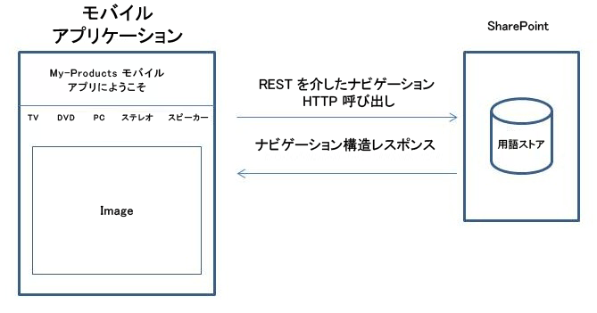
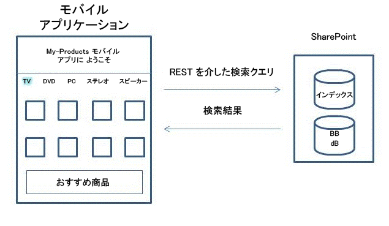
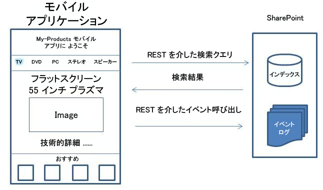

# [方法] ナビゲーションとイベント記録の REST インターフェイスを備えた検索利用モバイル アプリを作成する
SharePoint Server 2013 にはナビゲーションとイベント ログの REST インターフェイスが搭載されており、Android や iOS などの Windows 以外のオペレーティング システムで実行される電話やタブレットといったモバイル デバイス向けの検索型モバイル アプリを作成することができます。
## アプリと製品カタログが連携する仕組み
<a name="mobile_app_and_product_catalog"> </a>

製品カタログは、さまざまな方法でモバイル デバイスに表示できます。従来より、SharePoint 内で製品カタログのモバイル チャネルを構成することができます。モバイル チャネルを作成することにより、モバイル デバイスのどんな画面サイズにも適合するように外観を調整することができます。生成されるページは、モバイル デバイスの Web ブラウザーを使用して .ASPX 形式で表示されます。ページの構造とその対応するロジックは、SharePoint を実行しているサーバーによって処理されます。それに対し、ナビゲーションとイベントログの REST インターフェイスによって作成されるアプリは、検索型であり、製品カタログ構造をナビゲートするフロントエンドとして動作します。
  
    
    
アプリはスタンドアロン プログラムではありませんが、既存の SharePoint インストールでセットアップされている製品カタログと連携して動作します。アプリは、その特定の SharePoint インストールで製品カタログが変更された場合、ナビゲーション構造を動的に更新することができます。また、ユーザーによるクリック イベントは SharePoint が実行されているサーバーに返送され、製品カタログによって作成されるおすすめ候補の全体的な品質が改善されます。
  
    
    
アプリは、ユーザーが Web ブラウザーを使用せずに製品カタログを表示するのに必要なページを構築します。マスター ページ、ページ レイアウト、および製品カタログを表示するページを構築するためのロジックは、アプリとしてデバイスにダウンロードされます。これらのページは、ユーザーがそのアプリを実行するときにはいつでも再使用されます。ユーザーが製品カタログをナビゲートする間、アプリは同時に、ナビゲーション構造を構築するとともにページをセットアップします。関連ページにアイテムのコンテンツを取り込むため、SharePoint の製品カタログに検索クエリが送信されます。対応する検索結果はその後、ページにコンテンツを取り込むために使用されます。
  
    
    

## 例: ホーム ページ、カテゴリ ページ、およびアイテムの詳細ページで構成される検索型モバイル アプリの作成
<a name="example_search_driven_mobile_app"> </a>

3 種類のページ (ホーム ページ、カテゴリ ページ、およびアイテムの詳細ページ) で構成されるモバイル アプリがあるとします。以降のセクションでは、ナビゲーション、イベント ログ、および検索の REST インターフェイスを使用してページを作成する方法を説明します。
  
    
    

### 検索型モバイル アプリのホーム ページ

通常、アプリの起動時には **ホーム** ページが表示されます。 **ホーム** ページには、図 1 に示すように、製品カタログ メニュー、テキスト、および静的イメージが表示されます。
  
    
    

**図 1. 検索型モバイル アプリのホーム ページ**

  
    
    

  
    
    

  
    
    
このページを構築するため、アプリは SharePoint が実行されているサーバーにナビゲーション REST 呼び出しを送信して製品カタログのナビゲーション構造を要求します。次にアプリは、応答データを使用して正しい分類またはメニュー構造をセットアップし、製品カタログの正しい用語名を表示します。ページ レイアウト、タイトル テキスト、および静的イメージなどの追加コンテンツは、アプリ自体に保存されます。その後に分類が変更された場合、アプリは、実行されるときにナビゲーション REST 呼び出しによって更新できます。
  
    
    
一般的なナビゲーション REST 呼び出しの例を以下に示します。
  
    
    


```

GET http://server/_api/navigation/menustate?mapprovidername='GlobalNavigationSwitchableProvider'

```

対応する応答については、「 [モバイル アプリのナビゲーション REST 呼び出しに対する応答例](how-to-build-search-driven-mobile-apps-with-the-navigation-and-event-logging-res.md#response_navigation_rest)」を参照してください。
  
    
    

### 検索型モバイル アプリのカテゴリ ページ

 **カテゴリ** ページには、選択したカテゴリの多くのアイテムが表示されます。1 つのカテゴリの一覧にある各アイテムは、通常、タイトル、イメージ、および価格などのいくつかの関連するアイテムのデータによって表すことが可能です。このデータは、図 2 に示すように、SharePoint の検索 REST サービスによる検索クエリを使用することによって、製品カタログから収集されます。
  
    
    

**図 2. 検索型モバイル アプリのカテゴリ ページ**

  
    
    

  
    
    

  
    
    
前の図でカタログの 1 つ ([ **TV** ] など) を選択すると、 **カテゴリ** ページが表示されます。
  
    
    
特定のカテゴリのコンテンツを取得する一般的な検索 REST クエリの例を以下に示します。
  
    
    


```

GET http://server/_api/search/query?querytext='owstaxidProductCatalogItemCategory:#0<TermGuid>'

```

対応する応答については、「 [モバイル アプリの検索 REST クエリに対する応答例](how-to-build-search-driven-mobile-apps-with-the-navigation-and-event-logging-res.md#response_search_rest)」を参照してください。
  
    
    
SharePoint Server 2013 のクエリ処理コンポーネントが特定のカテゴリのデータを含む検索結果を返し、アプリは **カテゴリ** ページにそのデータを表示します。選択したカテゴリに関連付けられたおすすめのコンテンツがある場合は、クエリ処理コンポーネントがこの関連付けを検出し、図で **BB** というラベルの [おすすめコンテンツ] データベースからおすすめコンテンツのデータを抽出します。その後検索結果は、[おすすめコンテンツ] データベースからの結果と混合され、アプリの結果テーブルに返送されます。アプリには、テーブルから結果の異なる部分を抽出し、専用の場所におすすめコンテンツを表示する役割があります。
  
    
    

### 検索型モバイル アプリのアイテムの詳細ページ

カテゴリ内のアイテムを選択すると、 **アイテムの詳細**ページが表示されます。このページでは、タイトル、製品イメージ、技術的説明、価格、および配信情報などのデータを表示して、アイテムの詳細が示されます。その他のおすすめ候補または評価がある場合は、それらの情報も表示されます。 **アイテムの詳細**ページを構築するため、アプリは、図 3 に示すように 2 つのクエリ (アイテムのデータを取得するためのクエリと、アイテムに関連したおすすめ候補を取得するための別のクエリ) を送信します。 
  
    
    

**図 3. 検索型モバイル アプリの [アイテムの詳細] ページ**

  
    
    

  
    
    

  
    
    
特定のアイテムのコンテンツを取得するための一般的な検索 REST クエリの例を以下に示します。
  
    
    


```

GET http://server/_api/search/query?querytext='ProductCatalogItemNumberOWSTEXT:1234567'
```

おすすめ候補は、アプリ自体ではなく SharePoint で計算されます。ユーザー イベント (この特定のアプリだけでなく、製品カタログによって収集されるすべてのユーザー イベントを含む) に基づいておすすめ候補を作成するため、アプリは、ユーザー イベントが発生すると、定常的にイベント呼び出しを介して SharePoint の製品カタログにそのイベントを返送します。これらのユーザー イベントはイベント ログに保管され、その特定のアイテムに関連付けられた他のユーザー イベントと同様に処理されます。製品カタログからアプリにコールバックが送信されることはありません。計算されるおすすめ候補は、SharePoint 検索 REST サービスを介してアプリケーションで利用できます。
  
    
    
次の例は、イベント ログの一般的な **POST** 呼び出しを示しています。
  
    
    


```
POST http://server/_api/events/logevent
{
      "usageEntry": {
            "__metadata": {
                  "type": "Microsoft.SharePoint.Administration.UsageEntry"
            },
            "EventTypeId": 1,
            "ItemId": "an item fb7c-4196-8123-e54eee5f4787",
            "ScopeId": "61141c0e-fb7c ",
            "Site": "61141c0e- 
-4196-8123-e54eee5f4787",
            "User": "johndoe"
      }
}
```

このサービスは標準の HTTP 戻りコードに従います。HTTP 200 応答は、要求に成功したことを示します。イベント ログ REST インターフェイスの製品カタログからの応答はありません。
  
    
    

## モバイル アプリのナビゲーション REST 呼び出しに対する応答例
<a name="response_navigation_rest"> </a>


```

<?xml version="1.0" encoding="utf-8"?>
<d:MenuState xmlns:d="http://schemas.microsoft.com/ado/2007/08/dataservices" xmlns:m="http://schemas.microsoft.com/ado/2007/08/dataservices/metadata" xmlns:georss="http://www.georss.org/georss" xmlns:gml="http://www.opengis.net/gml" m:type="SP.MenuState">

  <d:FriendlyUrlPrefix>/sites/contoso/</d:FriendlyUrlPrefix>
  <d:Nodes>
    <d:element m:type="SP.MenuNode">
      <d:CustomProperties m:null="true" />
      <d:FriendlyUrlSegment>electronics</d:FriendlyUrlSegment>
      <d:Hidden m:type="Edm.Boolean">false</d:Hidden>
      <d:Key>16c4c3c8-0309-47f7-9d9b-17e699febce8</d:Key>
      <d:Nodes>
        <d:element m:type="SP.MenuNode">
          <d:CustomProperties m:null="true" />
          <d:FriendlyUrlSegment>audio</d:FriendlyUrlSegment>
          <d:Hidden m:type="Edm.Boolean">false</d:Hidden>
          <d:Key>3e2d5c67-3fad-4cfa-8e1c-8c74fdf3a34b</d:Key>
          <d:Nodes>
            <d:element m:type="SP.MenuNode">
              <d:CustomProperties m:null="true" />
              <d:FriendlyUrlSegment>car-audio</d:FriendlyUrlSegment>
              <d:Hidden m:type="Edm.Boolean">false</d:Hidden>
              <d:Key>e3d271a4-dcbf-464d-a557-23848ccaa54f</d:Key>
              <d:Nodes />
              <d:NodeType m:type="Edm.Int32">1</d:NodeType>
              <d:SimpleUrl></d:SimpleUrl>
              <d:Title>Car audio</d:Title>
            </d:element>
            <d:element m:type="SP.MenuNode">
              <d:CustomProperties m:null="true" />
              <d:FriendlyUrlSegment>headphones</d:FriendlyUrlSegment>
              <d:Hidden m:type="Edm.Boolean">false</d:Hidden>
              <d:Key>7ad146d0-61b5-4b55-9da0-db7eaaa20f4a</d:Key>
              <d:Nodes />
              <d:NodeType m:type="Edm.Int32">1</d:NodeType>
              <d:SimpleUrl></d:SimpleUrl>
              <d:Title>Headphones</d:Title>
            </d:element>
            <d:element m:type="SP.MenuNode">
              <d:CustomProperties m:null="true" />
              <d:FriendlyUrlSegment>mp3</d:FriendlyUrlSegment>
              <d:Hidden m:type="Edm.Boolean">false</d:Hidden>
              <d:Key>7387fe97-52fa-464b-878a-b05d04e7032e</d:Key>
              <d:Nodes />
              <d:NodeType m:type="Edm.Int32">1</d:NodeType>
              <d:SimpleUrl></d:SimpleUrl>
              <d:Title>MP3</d:Title>
            </d:element>
            <d:element m:type="SP.MenuNode">
              <d:CustomProperties m:null="true" />
              <d:FriendlyUrlSegment>speakers</d:FriendlyUrlSegment>
              <d:Hidden m:type="Edm.Boolean">false</d:Hidden>
              <d:Key>65da907c-9565-45f6-a278-cbce7f74ab3d</d:Key>
              <d:Nodes />
              <d:NodeType m:type="Edm.Int32">1</d:NodeType>
              <d:SimpleUrl></d:SimpleUrl>
              <d:Title>Speakers</d:Title>
            </d:element>
          </d:Nodes>
          <d:NodeType m:type="Edm.Int32">1</d:NodeType>
          <d:SimpleUrl></d:SimpleUrl>
          <d:Title>Audio</d:Title>
        </d:element>
      </d:Nodes>
      <d:NodeType m:type="Edm.Int32">1</d:NodeType>
      <d:SimpleUrl></d:SimpleUrl>
      <d:Title>Electronics</d:Title>
    </d:element>
  </d:Nodes>
  <d:SimpleUrl m:null="true" />
  <d:SPSitePrefix>/sites/contoso/</d:SPSitePrefix>
  <d:SPWebPrefix>/sites/contoso/</d:SPWebPrefix>
  <d:StartingNodeKey>2168423f-3fea-4324-a5cb-90be8f079750</d:StartingNodeKey>
  <d:StartingNodeTitle>contoso</d:StartingNodeTitle>
  <d:Version>2012-05-29T12:00:04.4747484Z</d:Version>
</d:MenuState>

```


## モバイル アプリの検索 REST クエリに対する応答例
<a name="response_search_rest"> </a>


```

<d:query xmlns:d="http://schemas.microsoft.com/ado/2007/08/dataservices" xmlns:m="http://schemas.microsoft.com/ado/2007/08/dataservices/metadata" xmlns:georss="http://www.georss.org/georss" xmlns:gml="http://www.opengis.net/gml" m:type="Microsoft.Office.Server.Search.REST.SearchResult">
  <d:ElapsedTime m:type="Edm.Int32">4640</d:ElapsedTime>
  <d:PrimaryQueryResult m:type="Microsoft.Office.Server.Search.REST.QueryResult">
    <d:CustomResults m:null="true"/>
    <d:QueryId>7fea4ced-5789-4067-beab-8f807410b29e</d:QueryId>
    <d:QueryRuleId m:type="Edm.Guid">00000000-0000-0000-0000-000000000000</d:QueryRuleId>
    <d:RefinementResults m:null="true"/>
    <d:RelevantResults m:type="Microsoft.Office.Server.Search.REST.RelevantResults">
      <d:GroupTemplateId m:null="true"/>
      <d:ItemTemplateId m:null="true"/>
      <d:Properties>
        ...
      </d:Properties>
      <d:ResultTitle m:null="true"/>
      <d:ResultTitleUrl m:null="true"/>
      <d:RowCount m:type="Edm.Int32">10</d:RowCount>
      <d:Table m:type="SP.SimpleDataTable">
        <d:Rows>
          ...
        </d:Rows>
      </d:Table>
      <d:TotalRows m:type="Edm.Int32">2048964</d:TotalRows>
      <d:TotalRowsIncludingDuplicates m:type="Edm.Int32">2048964</d:TotalRowsIncludingDuplicates>
    </d:RelevantResults>
    <d:SpecialTermResults m:null="true"/>
  </d:PrimaryQueryResult>
  <d:Properties>
    ...
  </d:Properties>
  <d:SecondaryQueryResults m:null="true"/>
  <d:SpellingSuggestion/>
  <d:TriggeredRules>
  </d:TriggeredRules>
</d:query>
```


## その他の技術情報
<a name="bk_addresources"> </a>


-  [SharePoint 2013 にアクセスする Windows Phone アプリの作成](build-windows-phone-apps-that-access-sharepoint-2013.md)
    
  
-  [SharePoint 2013 REST サービスを使用したプログラミング](use-odata-query-operations-in-sharepoint-rest-requests.md)
    
  

