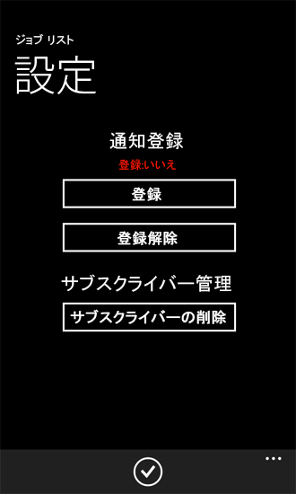
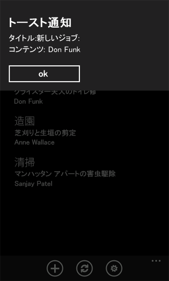
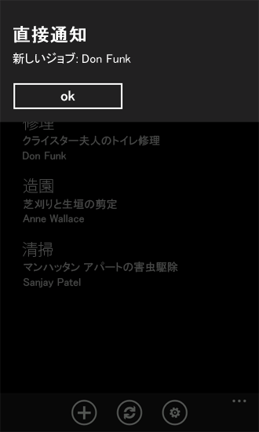
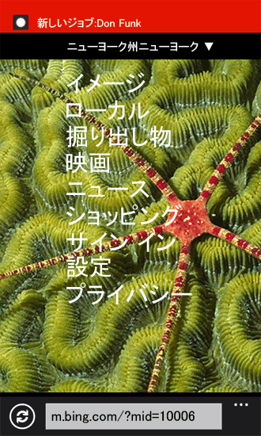

# [方法] Windows Phone 用 SharePoint 2013 アプリでプッシュ型通知を構成および使用する
SharePoint Server でプッシュ通知を送信するためのソリューションを作成し、通知を受信する Windows Phone アプリを開発します。
Microsoft プッシュ通知サービス (MPNS) を使用することにより、Windows Phone アプリは Microsoft SharePoint Server で発生したイベントの通知をインターネット経由で受信できます。この電話アプリは、たとえばその基となるリストのアイテムなど、変更があるかどうかについてサーバーをポーリングする必要がありません。Windows Phone アプリはサーバーから通知を受信するための登録を行うことができ、イベント レシーバーは、通知を開始してそれを処理する受信側のアプリに送信します。プッシュ通知は、MPNS によって Windows Phone デバイスに中継されます。
  
    
    

Windows Phone 7 は、複数アプリの同時実行に対応していません。Windows Phone オペレーティング システム (OS) 自体のコンポーネントを除いて、任意の時点で実行可能なアプリは 1 つだけです。アプリが電話のフォアグラウンドで実行されていない場合 (つまり、アプリが廃棄状態になっているか閉じられている場合) は、所定の電話アプリに関係するイベント (たとえば、リストにリスト アイテムが追加されたなど) が発生する可能性があります。サーバーのリストに変更があるかどうかチェックする定期タスクを実行する電話のバックグラウンド サービスを開発できますが、この方法だと電話のリソース (ネットワーク帯域幅やバッテリ電力) を消耗します。MPNS、および Windows Phone 7 OS に組み込まれた通知をサポートするコンポーネントにより、電話自体は、所定のアプリが実行されていなくてもそのアプリのコンテキストに関係する通知を受信することができ、ユーザーにはその通知に応じた関連アプリを起動する機会が与えられます (通知の詳細については、MSDN ライブラリの「 [Windows Phone のプッシュ通知の概要](http://msdn.microsoft.com/ja-jp/library/ff402558%28VS.92%29.aspx)」を参照してください)。
このトピックでは、アプリの基となるリストでの変更に基づいて電話アプリにプッシュ通知を送信する、サーバー側のソリューションを作成します。その後、それらの通知を受信する電話アプリを作成します。
  
    
    


## リスト アイテム イベントに基づいてプッシュ通知を送信するサーバー側ソリューションの作成
<a name="BKMK_ServerSideSolution"> </a>

サーバー側ソリューションは、分離された **SPWeb** オブジェクトに展開されている SharePoint アプリか、Web を対象範囲とするフィーチャーを含んだ SharePoint ソリューション パッケージ (つまり, .wsp ファイル) としてパッケージングされた SharePoint ファーム ソリューションのいずれかです。このセクションの手順では、Windows Phone アプリが使用するターゲット リストを作成し、サーバーでのプッシュ通知メカニズムをアクティブ化する簡単な SharePoint ソリューションを開発します。続くセクションでは、サーバー側ソリューションから通知を受信する Windows Phone アプリを開発します。
  
    
    

### サーバー側オブジェクトを作成するには


1. [ **開発者として実行**] オプションを使用して Visual Studio 2012 を開始します。
    
  
2. [ **ファイル**]、[ **新規**]、[ **プロジェクト**] を選択します。
    
    [ **新しいプロジェクト**] ダイアログ ボックスが表示されます。
    
  
3. [ **新しいプロジェクト**] ダイアログ ボックスの [ **Visual C#**] の下で [ **SharePoint**] を展開し、[ **15**] ノードを選択します。
    
  
4. [ **テンプレート**] ウィンドウで [ **SharePoint 2013 Project**] を選択し、そのプロジェクトの名前 (PushNotificationsList など) を指定します。
    
  
5. [ **OK**] ボタンをクリックします。SharePoint カスタマイズ ウィザードが表示されます。このウィザードを使用して、プロジェクトの開発とデバッグを行うターゲット サイトと、ソリューションの信頼レベルを選択できます。
    
  
6. SharePoint Server サイトの URL を指定します。後ほど、Windows Phone 用の SharePoint リスト アプリの開発で使用できるサイトを選択します。
    
  
7. [ **ファーム ソリューションとして配置する**] を選択し、[ **完了**] をクリックしてプロジェクトを作成します。
    
  
次に、クラス ファイルをプロジェクトに追加し、プッシュ通知をカプセル化および管理するクラスを 2 つ作成します。
  
    
    

### プッシュ通知を管理するクラスを作成するには


1. [ **ソリューション エクスプローラー**] で、プロジェクトを表すノード (ここでの手順で使用した命名規則に従えば "PushNotificationsList" という名前) を選択します。
    
  
2. [ **プロジェクト**] メニューの [ **クラスの追加**] を選択します。[ **新しい項目の追加**] ダイアログ ボックスが表示され、C# の [ **クラス**] テンプレートが既に選択されています。
    
  
3. ファイル名を「PushNotification.cs」と指定して、[ **追加**] をクリックします。クラス ファイルがソリューションに追加され、編集用に開かれます。
    
  
4. ファイルのコンテンツを次のコードで置き換えます。
    
  ```cs
  
using System;
using System.Collections.Generic;
using System.IO;
using System.Linq;
using System.Net;
using System.Text;
using Microsoft.SharePoint;

namespace PushNotificationsList
{
    internal static class WP7Constants
    {
        internal static readonly string[] WP_RESPONSE_HEADERS = 
            {
                "X-MessageID",
                "X-DeviceConnectionStatus",
                "X-SubscriptionStatus",
                "X-NotificationStatus"
            };
    }

    public enum TileIntervalValuesEnum
    {
        ImmediateTile = 1,
        Delay450SecondsTile = 11,
        Delay900SecondsTile = 21,
    }

    public enum ToastIntervalValuesEnum
    {
        ImmediateToast = 2,
        Delay450SecondsToast = 12,
        Delay900SecondsToast = 22,
    }

    public enum RawIntervalValuesEnum
    {
        ImmediateRaw = 3,
        Delay450SecondsRaw = 13,
        Delay900SecondsRaw = 23
    }

    public enum NotificationTypeEnum
    {
        Tile = 1,
        Toast = 2,
        Raw = 3
    }

    class PushNotification
    {
        public PushNotificationResponse PushToast(SPPushNotificationSubscriber subscriber, string toastTitle, string toastMessage, string toastParam, ToastIntervalValuesEnum intervalValue)
        {
            // Construct toast notification message from parameter values.
            string toastNotification = "<?xml version=\\"1.0\\" encoding=\\"utf-8\\"?>" +
            "<wp:Notification xmlns:wp=\\"WPNotification\\">" +
               "<wp:Toast>" +
                    "<wp:Text1>" + toastTitle + "</wp:Text1>" +
                    "<wp:Text2>" + toastMessage + "</wp:Text2>" +
                    "<wp:Param>" + toastParam + "</wp:Param>" +
               "</wp:Toast> " +
            "</wp:Notification>";

            return SendPushNotification(NotificationTypeEnum.Toast, subscriber, toastNotification, (int)intervalValue);
        }

        public PushNotificationResponse PushRaw(SPPushNotificationSubscriber subscriber, string rawMessage, RawIntervalValuesEnum intervalValue)
        {
            return SendPushNotification(NotificationTypeEnum.Raw, subscriber, rawMessage, (int)intervalValue);
        }

        private PushNotificationResponse SendPushNotification(NotificationTypeEnum notificationType, SPPushNotificationSubscriber subscriber, string message, int intervalValue)
        {
            // Create HTTP Web Request object.
            string subscriptionUri = subscriber.ServiceToken;
            HttpWebRequest sendNotificationRequest = (HttpWebRequest)WebRequest.Create(subscriptionUri);

            // MPNS expects a byte array, so convert message accordingly.
            byte[] notificationMessage = Encoding.Default.GetBytes(message);
            
            // Set the notification request properties.
            sendNotificationRequest.Method = WebRequestMethods.Http.Post;
            sendNotificationRequest.ContentLength = notificationMessage.Length;
            sendNotificationRequest.ContentType = "text/xml";
            sendNotificationRequest.Headers.Add("X-MessageID", Guid.NewGuid().ToString());

            switch (notificationType)
            {
                case NotificationTypeEnum.Tile:
                    sendNotificationRequest.Headers.Add("X-WindowsPhone-Target", "token");
                    break;
                case NotificationTypeEnum.Toast:
                    sendNotificationRequest.Headers.Add("X-WindowsPhone-Target", "toast");
                    break;
                case NotificationTypeEnum.Raw:
                    // A value for the X-WindowsPhone-Target header is not specified for raw notifications.
                    break;
            }            

            sendNotificationRequest.Headers.Add("X-NotificationClass", intervalValue.ToString());

            // Merge byte array payload with headers.
            using (Stream requestStream = sendNotificationRequest.GetRequestStream())
            {
                requestStream.Write(notificationMessage, 0, notificationMessage.Length);
            }

            string statCode = string.Empty;
            PushNotificationResponse notificationResponse;

            try
            {
                // Send the notification and get the response.
                HttpWebResponse response = (HttpWebResponse)sendNotificationRequest.GetResponse();
                statCode = Enum.GetName(typeof(HttpStatusCode), response.StatusCode);

                // Create PushNotificationResponse object.
                notificationResponse = new PushNotificationResponse((int)intervalValue, subscriber.ServiceToken);
                notificationResponse.StatusCode = statCode;
                foreach (string header in WP7Constants.WP_RESPONSE_HEADERS)
                {
                    notificationResponse.Properties[header] = response.Headers[header];
                }                
            }
            catch (Exception ex)
            {
                statCode = ex.Message;
                notificationResponse = new PushNotificationResponse((int)intervalValue, subscriber.ServiceToken);
                notificationResponse.StatusCode = statCode;
            }

            return notificationResponse;
        }
    }     

    /// <summary>
    /// Object used for returning notification request results.
    /// </summary>
    class PushNotificationResponse
    {
        private DateTime timestamp;
        private int notificationIntervalValue;
        private string statusCode = string.Empty;
        private string serviceToken;
        private Dictionary<string, string> properties;

        public PushNotificationResponse(int numericalIntervalValue, string srvcToken)
        {
            timestamp = DateTime.UtcNow;
            notificationIntervalValue = numericalIntervalValue;
            serviceToken = srvcToken;
            properties = new Dictionary<string, string>();
        }

        public DateTime TimeStamp
        {
            get { return timestamp; }
        }

        public int NotificationIntervalValue
        {
            get { return notificationIntervalValue; }
        }

        public string StatusCode
        {
            get { return statusCode; }
            set { statusCode = value; }
        }

        public string ServiceToken
        {
            get { return serviceToken; }
        }

        public Dictionary<string, string> Properties
        {
            get { return properties; }
        }
    }
}
  ```

5. ファイルを保存します。
    
  
このコードにおいて、 **PushToast** および **PushRaw** メソッドは、送信する所定の種類の通知に適切なパラメーター引数を取り、それらの引数を処理し、Microsoft プッシュ通知サービス を使用して通知の送信処理を実行する **SendPushNotification** メソッドを呼び出します (このサンプル コードには、タイル通知を送信するメソッドは実装されていません)。 **PushNotificationResponse** クラスは、通知要求から受信した結果をカプセル化するためのメカニズムにすぎません。ここでこのクラスは、 **HttpWebRequest** オブジェクトの **GetResponse** メソッドによって返された ( **HttpWebResponse** オブジェクトとしてキャストされる) オブジェクトに情報を追加します。以下の手順で作成するイベント レシーバーは、 **PushNotificationResponse** クラスを使用してサーバーの通知結果リストを更新します。
  
    
    
次に、プッシュ通知を受信するように登録されているデバイスにプッシュ通知を送信するイベント レシーバー クラスを作成します (このイベント レシーバーは、以降の手順で作成されるジョブ リストにバインドします)。
  
    
    

### リストのイベント レシーバー クラスを作成するには


1. [ **ソリューション エクスプローラー**] で、プロジェクトを表すノードを選択します。
    
  
2. [ **プロジェクト**] メニューの [ **クラスの追加**] をクリックします。[ **新しい項目の追加**] ダイアログ ボックスが表示され、C# の [ **クラス**] テンプレートが既に選択されています。
    
  
3. ファイル名を「ListItemEventReceiver.cs」と指定して、[ **追加**] をクリックします。クラス ファイルがソリューションに追加され、編集用に開かれます。
    
  
4. ファイルのコンテンツを次のコードで置き換えます。
    
  ```cs
  
using System;
using System.Security.Permissions;
using System.Text;
using Microsoft.SharePoint;
using Microsoft.SharePoint.Utilities;

namespace PushNotificationsList
{
    /// <summary>
    /// List Item Events
    /// </summary>
    public class ListItemEventReceiver : SPItemEventReceiver
    {
        internal static string ResultsList = "Push Notification Results";

        /// <summary>
        /// An item was added.
        /// </summary>
        public override void ItemAdded(SPItemEventProperties properties)
        {
            SPWeb spWeb = properties.Web;
            SPPushNotificationSubscriberCollection pushSubscribers = spWeb.PushNotificationSubscribers;
            PushNotification pushNotification = new PushNotification();

            SPListItem listItem = properties.ListItem;

            string jobAssignment = "[Unassigned]";

            // This event receiver is intended to be associated with a specific list,
            // but the list may not have an "AssignedTo" field, so using try/catch here.
            try
            {
                jobAssignment = listItem["AssignedTo"].ToString();
            }
            catch { }

            PushNotificationResponse pushResponse = null;

            foreach (SPPushNotificationSubscriber ps in pushSubscribers)
            {
                // Send a toast notification to be displayed on subscribed phones on which the app is not running.
                pushResponse = pushNotification.PushToast(ps, "New job for:", jobAssignment, string.Empty, ToastIntervalValuesEnum.ImmediateToast);
                UpdateNotificationResultsList(spWeb, ps.User.Name, pushResponse);

                // Also send a raw notification to be displayed on subscribed phones on which the app is running when the item is added.
                pushResponse = pushNotification.PushRaw(ps, string.Format("New job for: {0}", jobAssignment), RawIntervalValuesEnum.ImmediateRaw);
                UpdateNotificationResultsList(spWeb, ps.User.Name, pushResponse);
            }

            base.ItemAdded(properties);
        }

        private void UpdateNotificationResultsList(SPWeb spWeb, string subscriberName, PushNotificationResponse pushResponse)
        {
            SPList resultsList = spWeb.Lists.TryGetList(ResultsList);

            if (resultsList == null)
                return;

            try
            {
                SPListItem resultItem = resultsList.Items.Add();
                resultItem["Title"] = subscriberName;
                resultItem["Notification Time"] = pushResponse.TimeStamp;
                resultItem["Status Code"] = pushResponse.StatusCode;
                resultItem["Service Token"] = pushResponse.ServiceToken;

                StringBuilder builder = new StringBuilder();
                foreach (string key in pushResponse.Properties.Keys)
                {
                    builder.AppendFormat("{0}: {1}; ", key, pushResponse.Properties[key]);
                }
                resultItem["Headers"] = builder.ToString();

                resultItem["Interval Value"] = pushResponse.NotificationIntervalValue;
                resultItem.Update();
            }
            catch
            {
                // Could log to ULS here if adding list item fails.
            }
        }
    }
}
  ```

5. ファイルを保存します。
    
  
このコードでは、イベント レシーバーのバインド先のリストにアイテムが追加された後、通知を受信するように登録されているサブスクライバーにプッシュ通知が送信されます。追加されたリスト アイテムの AssignedTo フィールドの値は、サブスクライバーに送信される通知メッセージに組み込まれます。トースト通知の場合、(前の手順で定義した **PushToast** メソッドの) **toastTitle** パラメーターと **toastMessage** パラメーターの値が設定されます。これらの値は、トースト通知を定義する XML スキーマの **Text1** プロパティと **Text2** プロパティに対応します。
  
    
    
空の文字列は、単なる **toastParam** パラメーターの値として渡され、これはトースト通知の XML スキーマにおける **Param** プロパティに対応します。このパラメーターを使用して、ユーザーが電話で通知をクリックするときに開かれる電話アプリのページなどを指定できます。このトピックの以降の部分で開発する、サーバーからの通知を受信するサンプル電話アプリでは、 **Param** プロパティを使用しません。ユーザーが通知をクリックすると、アプリのリスト フォーム (List.xaml) が開きます。
  
    
    

> **メモ**
> トースト通知の **Param** プロパティは、Windows Phone OS バージョン 7.1 以上でのみサポートされます。
  
    
    

このサンプルの直接通知では、追加されたリスト アイテムからの AssignedTo フィールドの値を含んだ文字列が渡されます。
  
    
    
トースト通知は、購読済みの電話に表示され (通知の送信対象となる電話アプリが実行されていない場合)、表示されるメッセージは、約 41 文字より長い場合には切り捨てられます。MPNS での直接通知の制限は 1024 バイト (1 キロバイト) です (送信可能な正確な文字数は、UTF-8 などの使用されるエンコードの種類に応じて決まります)。タイル通知にもサイズ制限が適用されます。いずれの種類の通知を使用する場合でも、大量のデータは送信できません。これらの通知は、データを転送するときのメカニズムとしてではなく、電話で特定のアクションを実行することができるよう、購読済みの電話にショート メッセージを送信するための手段として使用するのが最適です。サーバーからのデータを反映させて電話のリストを更新するなどのアクションには、Windows Phone アプリの設計によっては大量のデータが関係することがあります。
  
    
    
通知要求から返される **PushNotificationResponse** オブジェクトは、 **UpdateNotificationResultsList** メソッドに渡されます。このメソッドは、要求に関する情報を "Push Notification Results" という名前の SharePoint リスト (リストが存在する場合) に追加します。これは、返されるオブジェクトの使用法の一例にすぎません。返されるオブジェクトは、運用環境のソリューションにおいてより洗練された処理で使用できます。たとえば、指定されたユーザー (AssignedTo フィールドでの割り当てに指名されたユーザーなど) に通知が送信されるときに特定のステータス コードがないかどうか返されたオブジェクトを調べ、適切なアクションを実行できます。運用アプリケーションでは、おそらくサーバーのリストにこの情報すべてを格納することはありません。この情報は、MPNS 通知に関連付けられているプロパティについて理解できるようにするためにここに格納されます。
  
    
    
次に、名前が Jobs で、ジョブのカテゴリ、ジョブの説明、およびジョブを割り当てられた人についての情報を含む簡単な SharePoint リストを作成します。また、購読済み電話に送信される通知要求に関連した情報を格納する、Push Notification Results という名前の補助リストも作成します。
  
    
    
次の手順では、サーバーでソリューションがアクティブ化されるときに Jobs リストを作成および構成する **CreateJobsList** メソッドが組み込まれた **ListCreator** クラスを作成します。このクラスも、(前に **ListItemEventReceiver** クラスで作成された) **ItemAdded** イベント レシーバーを、リストに関連付けられている **EventReceivers** コレクションに追加します。 **ListCreator** クラスには、Push Notification Results SharePoint リストを作成するためのメソッドも組み込まれています。
  
    
    

### リストを追加および構成するためのクラスを作成するには


1. [ **ソリューション エクスプローラー**] で、プロジェクトを表すノード (ここでの手順で使用した命名規則に従えば、ここでも "PushNotificationsList" という名前) を選択します。
    
  
2. [ **プロジェクト**] メニューの [ **クラスの追加**] をクリックします。[ **新しい項目の追加**] ダイアログ ボックスが表示され、C# の [ **クラス**] テンプレートが既に選択されています。
    
  
3. ファイル名を「ListCreator.cs」と指定して、[ **追加**] をクリックします。クラス ファイルがソリューションに追加され、編集用に開かれます。
    
  
4. ファイルのコンテンツを次のコードで置き換えます。
    
  ```cs
  
using System;
using System.Collections.Generic;
using System.Linq;
using System.Text;
using System.Xml;
using Microsoft.SharePoint;

namespace PushNotificationsList
{
    class ListCreator
    {
        internal void CreateJobsList(SPWeb spWeb)
        {
            string listTitle = "Jobs";
            string listDescription = "List of jobs and assignments.";
            Dictionary<string, SPFieldType> columns = new Dictionary<string, SPFieldType>();

            // The "Title" column will be added based on the GenericList template. That field
            // will be used as the category name for the job (e.g., Shopping), so only need to add
            // the remaining fields.
            columns.Add("Description", SPFieldType.Text);
            columns.Add("AssignedTo", SPFieldType.Text);

            // Creating list (or retrieving GUID for list if it already exists).
            Guid listId = CreateCustomList(spWeb, listTitle, listDescription, columns, false);
            if (listId.Equals(Guid.Empty))
                return;

            SPList list = spWeb.Lists[listId];

            // Add event receiver (if the current Jobs list is not already associated with the receiver).
            bool ReceiverExists = false;
            string receiverClassName = "PushNotificationsList.ListItemEventReceiver";

            for (int i = 0; i < list.EventReceivers.Count; i++)
            {
                SPEventReceiverDefinition rd = list.EventReceivers[i];
                if (rd.Class == receiverClassName &amp;&amp; rd.Type == SPEventReceiverType.ItemAdded)
                {
                    ReceiverExists = true;
                    break;
                }
            }

            if (ReceiverExists == false)
            {
                SPEventReceiverDefinition eventReceiver = list.EventReceivers.Add();
                // Must specify information here for this specific assembly.
                eventReceiver.Assembly = "PushNotificationsList,
                    Version=1.0.0.0, Culture=Neutral,
                    PublicKeyToken=[YOUR TOKEN VALUE HERE]";
                eventReceiver.Class = receiverClassName;
                eventReceiver.Name = "ItemAdded Event";
                eventReceiver.Type = SPEventReceiverType.ItemAdded;
                eventReceiver.SequenceNumber = 10000;
                eventReceiver.Synchronization = SPEventReceiverSynchronization.Synchronous;
                eventReceiver.Update();
            }
        }

        internal void CreateNotificationResultsList(SPWeb spWeb)
        {
            string listTitle = "Push Notification Results";
            string listDescription = "List for results from push notification operations.";

            Dictionary<string, SPFieldType> columns = new Dictionary<string, SPFieldType>();
            columns.Add("Notification Time", SPFieldType.Text);
            columns.Add("Status Code", SPFieldType.Text);
            columns.Add("Service Token", SPFieldType.Text);
            columns.Add("Headers", SPFieldType.Text);
            columns.Add("Interval Value", SPFieldType.Integer);

            // Creating the list for storing notification results.
            CreateCustomList(spWeb, listTitle, listDescription, columns, true);
        }

        /// <summary>
        /// Creates a SharePoint list (based on the Generic List template).
        /// </summary>
        /// <param name="spWeb">The target Web site for the list.</param>
        /// <param name="listTitle">The title of the list.</param>
        /// <param name="listDescription">A description for the list.</param>
        /// <param name="columns">A Dictionary object containing field names and types.</param>
        /// <param name="replaceExistingList">Indicates whether to overwrite an existing list of the same name on the site.</param>
        /// <returns>A GUID for the created (or existing) list.</returns>
        internal Guid CreateCustomList(SPWeb spWeb, string listTitle, string listDescription, Dictionary<string, SPFieldType> columns, bool replaceExistingList)
        {
            SPList list = spWeb.Lists.TryGetList(listTitle);

            if (list != null)
            {
                if (replaceExistingList == true)
                {
                    try
                    {
                        list.Delete();
                    }
                    catch
                    {
                        return Guid.Empty;
                    }
                }
                else
                {
                    return list.ID;
                }
            }

            try
            {
                Guid listId = spWeb.Lists.Add(listTitle, listDescription, SPListTemplateType.GenericList);
                list = spWeb.Lists[listId];
                SPView view = list.DefaultView;

                foreach (string key in columns.Keys)
                {
                    list.Fields.Add(key, columns[key], false);
                    view.ViewFields.Add(key);
                }
                
                list.Update();
                view.Update();

                return listId;
            }
            catch
            {
                return Guid.Empty;
            }
        }
    }
}
  ```


    必ず、アセンブリに固有の適切な公開キー トークン値を指定してください。アセンブリの公開キー トークン値を取得するためのツールを Visual Studio に追加する方法については、MSDN ライブラリの「 [[方法] アセンブリの公開キーを取得するツールを作成する](http://msdn.microsoft.com/ja-jp/library/ee539398.aspx)」を参照してください。出力アセンブリの公開キー トークン値を取得するには、少なくとも 1 度はプロジェクトをコンパイルする必要があります。
    
  
5. ファイルを保存します。
    
  
このコードでは、 **ListCreator** クラスの **CreateJobsList** メソッドがリストを作成し (または、サーバーに存在する場合はそのリストを取得し)、リストに関連付けられている **EventReceivers** クラスに追加することにより、前の手順で作成したイベント レシーバーをそのリストにバインドします。 **CreateNotificationResultsList** メソッドは Push Notification Results リストを作成します。
  
    
    
次に、ソリューションが展開されてアクティブ化されたときに初期化操作を実行するため、フィーチャーをプロジェクトに追加しますイベント レシーバー クラスをそのフィーチャーに追加して、 **FeatureActivated** イベントと **FeatureDeactivating** イベントを処理します。
  
    
    

### プロジェクトにフィーチャーを追加するには


1. Visual Studio 2012 の [ **表示**] メニューで、[ **その他のウィンドウ**] をポイントして [ **パッケージング エクスプローラー**] をクリックします。
    
  
2. [ **パッケージング エクスプローラー**] で、プロジェクトを表すノードを右クリックし、[ **フィーチャーの追加**] をクリックします。新しいフィーチャー (既定の名前は "Feature1") が [ **フィーチャー**] ノード ([ **ソリューション エクスプローラー**] 内) の下のプロジェクトに追加されます。
    
  
3. 次に、[ **ソリューション エクスプローラー**] の [ **フィーチャー**] ノードの下で、新規追加したフィーチャー (つまり " **Feature1**") を右クリックし、[ **イベント レシーバーの追加**] をクリックします。イベント レシーバー クラス ファイル (Feature1.EventReceiver.cs) が [フィーチャー] に追加され、編集用に開かれます。
    
  
4. **Feature1EventReceiver** クラスの実装内 (左かっこと右かっこで区切られた部分) で、次のコードを追加します。
    
  ```cs
  
internal const string PushNotificationFeatureId = "41E1D4BF-B1A2-47F7-AB80-D5D6CBBA3092";
  ```


    この文字列変数には、サーバーのプッシュ付通知フィーチャーの ID が格納されます。
    
    > **ヒント**
      > SharePoint Server のフィーチャーの一意の識別子のリストは、次の Windows PowerShell コマンドレットを実行することによって取得できます。 >  `Get-SPFeature | Sort -Property DisplayName`> Push Notification Feature は、このコマンドレットによって返される結果に "PhonePNSubscriber" として表示されます。 
5. イベント レシーバー クラス ファイルは、フィーチャーのイベントを宣言するいくつかの既定のメソッド宣言によって作成されます。ファイル内のメソッド宣言は、初めはコメント アウトされています。ファイルの **FeatureActivated** メソッドを次のコードで置き換えてください。
    
  ```cs
  public override void FeatureActivated(SPFeatureReceiverProperties properties)
{
    base.FeatureActivated(properties);
    SPWeb spWeb = (SPWeb)properties.Feature.Parent;

    ListCreator listCreator = new ListCreator();
    listCreator.CreateJobsList(spWeb);
    listCreator.CreateNotificationResultsList(spWeb);

    // Then activate the Push Notification Feature on the server.
    // The Push Notification Feature is not activated by default in a SharePoint Server installation.
    spWeb.Features.Add(new Guid(PushNotificationFeatureId), false);
}
  ```

6. ファイルの **FeatureDeactivating** メソッドを次のコードで置き換えます。
    
  ```cs
  
public override void FeatureDeactivating(SPFeatureReceiverProperties properties)
{
    base.FeatureDeactivating(properties);
    SPWeb spWeb = (SPWeb)properties.Feature.Parent;

    // Deactivate the Push Notification Feature on the server
    // when the PushNotificationsList Feature is deactivated.
    spWeb.Features.Remove(new Guid(PushNotificationFeatureId), false);
}
  ```

7. ファイルを保存します。
    
  
ここでの **FeatureActivated** イベント ハンドラーの実装では、リストが作成される場所としてフィーチャーが展開およびアクティブ化される **SPWeb** を使用して、 **ListCreator** クラスのインスタンスがインスタンス化され、その **CreateJobsList** メソッドと **CreateNotificationResultsList** メソッドが呼び出されます。また、SharePoint Server の標準インストールではプッシュ通知機能が既定で有効にされないため、このイベント ハンドラーがサーバーでのプッシュ通知フィーチャーをアクティブにします。 **FeatureDeactivating** イベント ハンドラーでは、アプリケーションが非アクティブ化されたときに、プッシュ通知機能も非アクティブになります。このイベントを処理する必要はありません。サーバーでのプッシュ通知は、インストール環境の状況およびターゲット サイトの他のアプリケーションがプッシュ通知を利用するかどうかに応じて、アプリケーションが非アクティブ化されたときに非アクティブにしてもしなくてもかまいません。
  
    
    

## プッシュ通知を受信する Windows Phone SharePoint リスト アプリの作成
<a name="BKMK_NotificationPhoneApp"> </a>

このセクションでは、前のセクションで作成した SharePoint リストをアプリのターゲット リストとして指定して、Windows Phone SharePoint リスト アプリケーション テンプレートから Windows Phone アプリを作成します。次に、プッシュ通知を購読し、通知イベントのハンドラーを実装し、電話についての通知に関連した情報を格納するための **Notifications** クラスを開発します。また、ユーザーがプッシュ通知を登録または登録解除できるようにするコントロールを配置した XAML ページをアプリに追加します。
  
    
    
このセクションの手順を実行するには、まず、「 [[方法] Windows Phone 用の SharePoint 2013 リスト アプリを作成する](how-to-create-a-windows-phone-sharepoint-2013-list-app.md)」の説明にある手順に従い、前のセクションでプロジェクトのターゲット SharePoint リストとして作成した Jobs リストを使用して、Windows Phone SharePoint リスト アプリケーション テンプレートから Visual Studio プロジェクトを実行してください。このセクションに示す手順の目的を考慮し、プロジェクトに指定する名前を SPListAppForNotifications と想定しています。
  
    
    

### 購読および受信通知を管理するクラスを作成するには


1. [ **ソリューション エクスプローラー**] で、(SPListAppForNotifications という名前の) プロジェクトを表すノードを選択します。
    
  
2. [ **プロジェクト**] メニューの [ **クラスの追加**] をクリックします。[ **新しい項目の追加**] ダイアログ ボックスが表示され、C# の [ **クラス**] テンプレートが既に選択されています。
    
  
3. ファイル名を「Notifications.cs」と指定して、[ **追加**] をクリックします。クラス ファイルがソリューションに追加され、編集用に開かれます。
    
  
4. ファイルのコンテンツを次のコードで置き換えます。
    
  ```cs
  
using System;
using System.Linq;
using System.Net;
using System.Windows;
using Microsoft.Phone.Notification;
using Microsoft.SharePoint.Client;
using System.Diagnostics;
using System.Collections.Generic;
using Microsoft.Phone.Shell;
using System.IO;
using System.IO.IsolatedStorage;

namespace SPListAppForNotifications
{
    public class Notifications
    {
        static HttpNotificationChannel httpChannel;
        private const string RegStatusKey = "RegistrationStatus";
        public static string DeviceAppIdKey = "DeviceAppInstanceId";
        public static string ChannelName = "JobsListNotificationChannel";
        public static ClientContext Context { get; set; }

        public static void OpenNotificationChannel(bool isInitialRegistration)
        {
            try
            {
                // Get channel if it was created in a previous session of the app.
                httpChannel = HttpNotificationChannel.Find(ChannelName);

                // If channel is not found, create one.
                if (httpChannel == null)
                {
                    httpChannel = new HttpNotificationChannel(ChannelName);

                    // Add event handlers. When the Open method is called, the ChannelUriUpdated event will fire.
                    // A call is made to the SubscribeToService method in the ChannelUriUpdated event handler.                    
                    AddChannelEventHandlers();
                    httpChannel.Open();
                }
                else
                {
                    // The channel exists and is already open. Add handlers for channel events.
                    // The ChannelUriUpdated event won't fire in this case.
                    AddChannelEventHandlers();

                    // If app instance is registering for first time
                    // (instead of just starting up again), then call SubscribeToService.
                    if (isInitialRegistration)
                    {
                        SubscribeToService();
                    }
                }
            }
            catch (Exception ex)
            {                
                ShowMessage(ex.Message, "Error Opening Channel");
                CloseChannel();
            }
        }

        private static void AddChannelEventHandlers()
        {
            httpChannel.ChannelUriUpdated += new EventHandler<NotificationChannelUriEventArgs>(httpChannel_ChannelUriUpdated);
            httpChannel.ErrorOccurred += new EventHandler<NotificationChannelErrorEventArgs>(httpChannel_ExceptionOccurred);
            httpChannel.ShellToastNotificationReceived += new EventHandler<NotificationEventArgs>(httpChannel_ShellToastNotificationReceived);
            httpChannel.HttpNotificationReceived += new EventHandler<HttpNotificationEventArgs>(httpChannel_HttpNotificationReceived);
        }

        private static void httpChannel_ChannelUriUpdated(object sender, NotificationChannelUriEventArgs e)
        {
            UpdateChannelUriOnServer();
            SubscribeToService();
        }

        private static void httpChannel_ExceptionOccurred(object sender, NotificationChannelErrorEventArgs e)
        {
            // Simply showing the exception error.
            ShowMessage(e.Message, "Channel Event Error");
        }

        static void httpChannel_ShellToastNotificationReceived(object sender, NotificationEventArgs e)
        {
            if (e.Collection != null)
            {
                Dictionary<string, string> collection = (Dictionary<string, string>)e.Collection;
                ShellToast toast = new ShellToast();
                toast.Title = collection["wp:Text1"];
                toast.Content = collection["wp:Text2"];

                // Note that the Show method for a toast notification won't
                // display the notification in the UI of the phone when the app
                // that calls the method is running (as the foreground app on the phone).
                // toast.Show();
               //Toast and Raw notification will be displayed if user is running the app. Be default only Toast notification
               // will be displayed when the app is tombstoned                                               

                // Showing the toast notification with the ShowMessage method.
                ShowMessage(string.Format("Title: {0}\\r\\nContent: {1}", toast.Title, toast.Content), "Toast Notification");
            }
        }

        static void httpChannel_HttpNotificationReceived(object sender, HttpNotificationEventArgs e)
        {
            Stream messageStream = e.Notification.Body;
            string message = string.Empty;

            // Replacing NULL characters in stream.
            using (var reader = new StreamReader(messageStream))
            {
                message = reader.ReadToEnd().Replace('\\0', ' ');
            }

            // Simply displaying the raw notification.
            ShowMessage(message, "Raw Notification");
        }

        private static void SubscribeToService()
        {
            Guid deviceAppInstanceId = GetSettingValue<Guid>(DeviceAppIdKey, false);

            Context.Load(Context.Web, w => w.Title, w => w.Description);

            PushNotificationSubscriber pushSubscriber = Context.Web.RegisterPushNotificationSubscriber(deviceAppInstanceId, httpChannel.ChannelUri.AbsoluteUri);

            Context.Load(pushSubscriber);

            Context.ExecuteQueryAsync
                (
                    (object sender, ClientRequestSucceededEventArgs args) =>
                        {
                            SetRegistrationStatus(true);

                            // Indicate that tile and toast notifications can be
                            // received by phone shell when phone app is not running.
                            if (!httpChannel.IsShellTileBound)
                                httpChannel.BindToShellTile();

                            if (!httpChannel.IsShellToastBound)
                                httpChannel.BindToShellToast();

                            ShowMessage(
                                string.Format("Subscriber successfully registered: {0}", pushSubscriber.User.LoginName),
                                "Success");
                        },
                    (object sender, ClientRequestFailedEventArgs args) =>
                        {
                            ShowMessage(args.Exception.Message, "Error Subscribing");
                        });
        }

        private static void UpdateChannelUriOnServer()
        {
            Guid deviceAppInstanceId = GetSettingValue<Guid>(DeviceAppIdKey, false);

            Context.Load(Context.Web, w => w.Title, w => w.Description);            

            PushNotificationSubscriber subscriber = Context.Web.GetPushNotificationSubscriber(deviceAppInstanceId);

            Context.Load(subscriber);

            Context.ExecuteQueryAsync(
                    (object sender1, ClientRequestSucceededEventArgs args1) =>
                    {
                        subscriber.ServiceToken = httpChannel.ChannelUri.AbsolutePath;
                        subscriber.Update();
                        Context.ExecuteQueryAsync(
                            (object sender2, ClientRequestSucceededEventArgs args2) =>
                                {
                                    ShowMessage("Channel URI updated on server.", "Success");
                                },
                            (object sender2, ClientRequestFailedEventArgs args2) =>
                                {
                                    ShowMessage(args2.Exception.Message, "Error Upating Channel URI");
                                });
                    },
                   (object sender1, ClientRequestFailedEventArgs args1) =>
                   {
                       // This condition can be ignored. Getting to this point means the subscriber
                       // doesn't yet exist on the server, so updating the Channel URI is unnecessary.
                       //ShowMessage("Subscriber doesn't exist on server.", "DEBUG");
                   });
        }

        public static void UnSubscribe()
        {
            Context.Load(Context.Web, w => w.Title, w => w.Description);
            Guid deviceAppInstanceId = GetSettingValue<Guid>(DeviceAppIdKey, false);

            Context.Web.UnregisterPushNotificationSubscriber(deviceAppInstanceId);

            Context.ExecuteQueryAsync
                (
                    (object sender, ClientRequestSucceededEventArgs args) =>
                    {
                        CloseChannel();
                        SetRegistrationStatus(false);
                        //SetInitializationStatus(false);
                        ShowMessage("Subscriber successfully unregistered.", "Success");
                    },
                    (object sender, ClientRequestFailedEventArgs args) =>
                    {
                        ShowMessage(args.Exception.Message, "Error Unsubscribing");
                    });
        }

        public static void ClearSubscriptionStore()
        {
            Context.Load(Context.Web, w => w.Title, w => w.Description);
            List subscriptionStore = Context.Web.Lists.GetByTitle("Push Notification Subscription Store");
            Context.Load(subscriptionStore);
            ListItemCollection listItems = subscriptionStore.GetItems(new CamlQuery());
            Context.Load(listItems);

            Context.ExecuteQueryAsync
                (
                    (object sender1, ClientRequestSucceededEventArgs args1) =>
                    {
                        foreach (ListItem listItem in listItems.ToList())
                        {
                            listItem.DeleteObject();                            
                        }                        
                        Context.ExecuteQueryAsync(
                                (object sender2, ClientRequestSucceededEventArgs args2) =>
                                {
                                    // Close channel if open and set registration status for current app instance.
                                    CloseChannel();
                                    SetRegistrationStatus(false);

                                    ShowMessage("Subscriber store cleared.", "Success");
                                },
                                (object sender2, ClientRequestFailedEventArgs args2) =>
                                {
                                    ShowMessage(args2.Exception.Message, "Error Deleting Subscribers");
                                });
                    },
                    (object sender1, ClientRequestFailedEventArgs args1) =>
                    {
                        ShowMessage(args1.Exception.Message, "Error Loading Subscribers List");
                    });
        }

        private static void CloseChannel()
        {
            if (httpChannel == null) return;
            try
            {
                httpChannel.UnbindToShellTile();
                httpChannel.UnbindToShellToast();
                httpChannel.Close();
            }
            catch (Exception ex)
            {
                ShowMessage(ex.Message, "Error Closing Channel");
            }
        }

        public static void SaveDeviceAppIdToStorage()
        {
            if (!IsolatedStorageSettings.ApplicationSettings.Contains(DeviceAppIdKey))
            {
                Guid DeviceAppId = Guid.NewGuid();
                SetSettingValue<Guid>(DeviceAppIdKey, DeviceAppId, false);
            }
        }

        public static bool GetRegistrationStatus()
        {
            bool status = GetSettingValue<bool>(RegStatusKey, false);
            return status;
        }

        private static void SetRegistrationStatus(bool isRegistered)
        {
            SetSettingValue<bool>(RegStatusKey, isRegistered, false);
        }

        private static T GetSettingValue<T>(string key, bool fromTransientStorage)
        {
            if (fromTransientStorage == false)
            {
                if (IsolatedStorageSettings.ApplicationSettings.Contains(key))
                    return (T)IsolatedStorageSettings.ApplicationSettings[key];
                return default(T);
            }

            if (PhoneApplicationService.Current.State.ContainsKey(key))
                return (T)PhoneApplicationService.Current.State[key];
            return default(T);
        }

        private static void SetSettingValue<T>(string key, T value, bool toTransientStorage)
        {
            if (toTransientStorage == false)
            {
                if (IsolatedStorageSettings.ApplicationSettings.Contains(key))
                    IsolatedStorageSettings.ApplicationSettings[key] = value;
                else
                    IsolatedStorageSettings.ApplicationSettings.Add(key, value);

                IsolatedStorageSettings.ApplicationSettings.Save();
            }
            else
            {
                if (PhoneApplicationService.Current.State.ContainsKey(key))
                    PhoneApplicationService.Current.State[key] = value;
                else
                    PhoneApplicationService.Current.State.Add(key, value);
            }
        }

        // Method for showing messages on UI thread coming from a different originating thread.
        private static void ShowMessage(string message, string caption)
        {
            Deployment.Current.Dispatcher.BeginInvoke(() =>
            {
                MessageBox.Show(message, caption, MessageBoxButton.OK);
            });
        }
    }
}
  ```

5. ファイルを保存します。
    
  
このコードでは、 **OpenNotificationChannel** が MPNS から通知を受信するための通知チャネルを作成します。イベント ハンドラーは、通知イベントを処理するチャネル オブジェクトに接続され、それからチャネルが開かれます。このサンプルでは、 **HttpNotificationReceived** イベント (直接通知を受信) が実装されます。直接通知は、電話アプリが実行されているときにのみ受信できます。 **ShellToastNotificationReceived** イベント (トースト通知を受信) のハンドラーも、その使用法を示すためここで実装します。タイル通知は、購読電話アプリが実行されていない場合にのみ受信できるため、タイル通知を受信するためのイベント ハンドラーをアプリに実装する必要はありません。
  
    
    
 **SubscribeToService** メソッドは、(電話アプリを識別する値と、通知チャネルに関連付けられた URI 値を渡して) **SPWeb** オブジェクトの **RegisterPushNotificationSubscriber** メソッドを非同期で実行して、プッシュ通知を受信する SharePoint Server に登録します。登録が正常に行われると、Windows Phone シェルは、電話アプリ自体が実行されていないときに、SharePoint Server に登録された特定の通知チャネルでトースト通知とタイル通知を受信 (および表示) するように設定されます。
  
    
    
このコードの **UnSubscribe** メソッドは、SPWeb オブジェクトの **UnregisterPushNotificationSubscriber** メソッドを呼び出します。Windows Phone アプリの開発ガイドラインでは、プッシュ通知を購読するかどうかをユーザーが選択できるようにするよう勧めています。以降の手順では、ユーザーが通知に関する登録または登録解除を行い、その登録状態がアプリのセッション間で保持され、アプリの起動時に毎回登録するかどうか尋ねなくてもよいようにするメカニズムを追加します。 **GetRegistrationStatus** メソッドを使用できるようになるため、電話アプリでは、ユーザーが (前のセッションで) プッシュ通知を受信するように登録したかどうかと、通知チャネルがその後開かれたかどうかを判別することができます。 **SaveDeviceAppIdToStorage** は、所定の Windows Phone 上のアプリ インスタンスの識別子 (GUID として表示) を、分離された記憶域に保存します。
  
    
    
 **ClearSubscriptionStore** メソッドがここに組み込まれているのは、SharePoint Server 上の購読ストアからサブスクライバーをクリアする方法の 1 つを示すためです。プッシュ通知のサブスクライバーは、"Push Notification Subscription Store" という名前の SharePoint リストに格納されます。 **Notifications** クラスのこのメソッドを呼び出すためのボタンは、後の手順でアプリに追加する通知設定ページに追加します。
  
    
    
SharePoint Server にアクセスして設定を構成したり、通知の準備をしたりすることが関係する操作 ( **RegisterPushNotificationSubscriber** メソッドなど) には、ネットワークの状態とサーバーのアクセス性に応じて、完了するのに時間を要する可能性があります。そのためこれらの操作は、アプリで他のプロセスを続行し、ユーザーに対する UI の応答を維持するため、非同期で実行されます (特に、 **ClientContext** オブジェクトの **ExecuteQueryAsync** メソッドを使用して実行されます)。
  
    
    
次に、ユーザーがサーバーからのプッシュ通知を受信するよう登録または登録解除できるようにするコントロールを配置したページをアプリに追加します。
  
    
    

### アプリに通知設定ページを追加するには


1. [ **ソリューション エクスプローラー**] で、プロジェクトを表すノード (この手順の命名規則に従えば「SPListAppForNotifications」という名前) を選択します。
    
  
2. [ **プロジェクト**] メニューで、[ **新しいアイテムの追加**] をクリックします。[ **新しいアイテムの追加**] ダイアログ ボックスが表示されます。
    
  
3. [ **テンプレート**] ウィンドウで、[ **Windows Phone Portrait Page**] テンプレートを選択します。ページのファイル名を「Settings.xaml」と指定して、[ **追加**] をクリックします。ページがプロジェクトに追加され、編集用に開かれます。
    
  
4. ページの XAML 表示で、 **PhoneApplicationPage** 要素を定義する XML タグの右かっこと、その要素の終了タグ ( `</phone:PhoneApplicationPage>`) の間のコンテンツを次のマークアップで置き換えます。
    
  ```
  
<Grid x:Name="LayoutRoot" Background="Transparent">
    <Grid.RowDefinitions>
        <RowDefinition Height="Auto"/>
        <RowDefinition Height="*"/>
    </Grid.RowDefinitions>

    <!--TitlePanel contains the name of the application and page title-->
    <StackPanel x:Name="TitlePanel" Grid.Row="0" Margin="12,17,0,28">
        <TextBlock x:Name="ApplicationTitle" Text="JOBS LIST" Style="{StaticResource PhoneTextNormalStyle}"/>
        <TextBlock x:Name="PageTitle" Text="Settings" Margin="9,-7,0,0" Style="{StaticResource PhoneTextTitle1Style}"/>
    </StackPanel>

    <!--ContentPanel - place additional content here-->
    <Grid x:Name="ContentPanel" Grid.Row="1" Margin="12,0,12,0">
        <StackPanel Margin="0,5,0,5">
            <StackPanel Orientation="Vertical" Margin="0,5,0,5">
                <TextBlock TextWrapping="Wrap" HorizontalAlignment="Center" Style="{StaticResource PhoneTextTitle2Style}">Notification Registration</TextBlock>
                <StackPanel Orientation="Vertical" Margin="0,5,0,5">
                    <TextBlock x:Name="txtRegistrationStatus" TextWrapping="Wrap" HorizontalAlignment="Center" Text="Registered: No" Style="{StaticResource PhoneTextAccentStyle}" Foreground="{StaticResource PhoneAccentBrush}" />
                    <Button x:Name="btnRegister" Content="Register" Height="71" Width="260" Click="OnRegisterButtonClick" />
                    <Button x:Name="btnUnregister" Content="Unregister" Height="71" Width="260" Click="OnUnregisterButtonClick" />
                </StackPanel>
            </StackPanel>
            <StackPanel Orientation="Vertical" Margin="0,5,0,5">
                <TextBlock TextWrapping="Wrap" HorizontalAlignment="Center" Style="{StaticResource PhoneTextTitle2Style}">Subscriber Management</TextBlock>
                <Button x:Name="btnDeleteSubscribers" Content="Delete Subscribers" Height="71" Width="260" Click="OnDeleteSubscribersButtonClick" />
            </StackPanel>
        </StackPanel>
    </Grid>
</Grid>
 
<!--Sample code showing usage of ApplicationBar-->
<phone:PhoneApplicationPage.ApplicationBar>
    <shell:ApplicationBar IsVisible="True" IsMenuEnabled="False">
        <shell:ApplicationBarIconButton x:Name="btnOK" IconUri="/Images/appbar.check.rest.png" Text="OK" Click="OnOKButtonClick" />
    </shell:ApplicationBar>
</phone:PhoneApplicationPage.ApplicationBar>
  ```

5. [ **ソリューション エクスプローラー**] で Settings.xaml ファイルが選択された状態でF7を押し、関連する分離コード ファイル Settings.xaml.cs を編集用に開きます。
    
  
6. 分離コード ファイルのコンテンツを次のコードで置き換えます。
    
  ```cs
  
using System;
using System.Collections.Generic;
using System.Linq;
using System.Net;
using System.Windows;
using Microsoft.Phone.Controls;
using Microsoft.SharePoint.Client;

namespace SPListAppForNotifications
{
    public partial class Settings : PhoneApplicationPage
    {
        private const string RegisteredYesText = "Registered: Yes";
        private const string RegisteredNoText = "Registered: No";

        public Settings()
        {
            InitializeComponent();
        }

        protected override void OnNavigatedTo(System.Windows.Navigation.NavigationEventArgs e)
        {
            this.txtRegistrationStatus.Text = (Notifications.GetRegistrationStatus()) ? RegisteredYesText : RegisteredNoText;
        }

        private void OnOKButtonClick(object sender, EventArgs e)
        {
            NavigationService.Navigate(new Uri("/Views/List.xaml", UriKind.Relative));
        }

        private void OnRegisterButtonClick(object sender, RoutedEventArgs e)
        {
            Notifications.OpenNotificationChannel(true);
            // Navigating back to List form. User will be notified when process is complete.
            NavigationService.Navigate(new Uri("/Views/List.xaml", UriKind.Relative));
        }

        private void OnUnregisterButtonClick(object sender, RoutedEventArgs e)
        {
            Notifications.UnSubscribe();
            // Navigating back to List form. User will be notified when process is complete.
            NavigationService.Navigate(new Uri("/Views/List.xaml", UriKind.Relative));
        }

        private void OnDeleteSubscribersButtonClick(object sender, RoutedEventArgs e)
        {            
            Notifications.ClearSubscriptionStore();
            // Navigating back to List form. User will be notified when process is complete.
            NavigationService.Navigate(new Uri("/Views/List.xaml", UriKind.Relative));
        }
    }
}
  ```

7. ファイルを保存します。
    
  
8. プロジェクトに、Settings.xaml ファイルで宣言した **ApplicationBar** ボタン (btnOK) のイメージ ファイル (appbar.check.rest.png) を追加するには、[ **ソリューション エクスプローラー**] で Images フォルダー ノードを選択します。
    
  
9. [ **プロジェクト**] メニューで、[ **既存の項目の追加**] をクリックします。[ **ファイル ブラウザー**] ウィンドウが開きます。
    
  
10. Windows Phone SDK 7.1 によって標準の Windows Phone アイコン イメージがインストールされたフォルダーに移動します。
    
    > **メモ**
      > 明るい前景と暗い背景のイメージは、SDK の標準インストールの %PROGRAMFILES%(x86)\\Microsoft SDKs\\Windows Phone\\v7.1\\Icons\\dark にあります。 
11. appbar.check.rest.png という名前のイメージ ファイルを選択して [ **追加**] をクリックします。イメージ ノードの下のプロジェクトに画像が追加されます。
    
  
12. [ **ソリューション エクスプローラー**] で追加したイメージ ファイルを選択し、ファイルの [ **プロパティ ウィンドウ**] で、イメージ ファイルの [ **ビルド アクション**] プロパティを [コンテンツ] に設定し、[ **出力ディレクトリにコピー**] プロパティを [新しい場合はコピーする] に設定します。
    
  
次に、プロジェクトのリスト フォーム (List.xaml) にボタンを追加し、前の手順で作成した [設定] ページに移動するためのボタンの **Click** イベント ハンドラーを実装します。また、(ユーザーがプッシュ通知を購読することを選択した場合は) 通知チャネルを開くように **OnViewModelInitialization** イベント ハンドラーを変更します。
  
    
    

### リスト フォームを変更するには


1. [ **ソリューション エクスプローラー**] の [ **ビュー**] ノードで、List.xaml ファイルをダブルクリックします。そのファイルが編集用に開かれます。
    
  
2. 次の例に従って、ファイルの **ApplicationBar** 要素で追加ボタンを宣言するマークアップを追加します。
    
  ```
  
...
    <phone:PhoneApplicationPage.ApplicationBar>
        <shell:ApplicationBar IsVisible="True" IsMenuEnabled="True">
            <shell:ApplicationBarIconButton x:Name="btnNew" 
                   IconUri="/Images/appbar.new.rest.png" Text="New" 
                    Click="OnNewButtonClick" />
            <shell:ApplicationBarIconButton x:Name="btnRefresh" 
                    IconUri="/Images/appbar.refresh.rest.png" Text="Refresh" IsEnabled="True" 
                    Click="OnRefreshButtonClick" />
            <shell:ApplicationBarIconButton x:Name="btnSettings" IconUri="/Images/appbar.feature.settings.rest.png" Text="Settings" IsEnabled="True" Click="OnSettingsButtonClick" />
        </shell:ApplicationBar>
    </phone:PhoneApplicationPage.ApplicationBar>
...
  ```

3. [ **ソリューション エクスプローラー**] で List.xaml ファイルが選択された状態でF7を押し、関連付けられた分離コード ファイル List.xaml.cs を編集用に開きます。
    
  
4. **ListForm** 部分クラスを実装するコード ブロック内 (左かっこと右かっこで区切られる) 内で、次のイベント ハンドラーをファイルに追加します。
    
  ```cs
  
private void OnSettingsButtonClick(object sender, EventArgs e)
{
    NavigationService.Navigate(new Uri("/Settings.xaml", UriKind.Relative));
}
  ```

5. List.xaml.cs ファイルで **OnViewModelInitialization** を見つけ、前に作成した **Notifications** クラスの **OpenNotificationChannel** メソッドの呼び出しを追加します。変更されたハンドラーの実装は次のコードのようになります。
    
  ```cs
  
private void OnViewModelInitialization(object sender, InitializationCompletedEventArgs e)
{
    this.Dispatcher.BeginInvoke(() =>
    {
        //If initialization has failed, show error message and return
        if (e.Error != null)
        {
            MessageBox.Show(e.Error.Message, e.Error.GetType().Name, MessageBoxButton.OK);
            return;
        }

        App.MainViewModel.LoadData(((PivotItem)Views.SelectedItem).Name);
        this.DataContext = (sender as ListViewModel);
    });

    // Open notification channel here if user has chosen to subscribe to notifications.
    if (Notifications.GetRegistrationStatus() == true)
        Notifications.OpenNotificationChannel(false);
}
  ```

6. ファイルを保存します。
    
  
7. プロジェクトに、List.xaml ファイルで宣言した **ApplicationBar** ボタン (btnSettings) のイメージ ファイル (appbar.feature.settings.rest.png) を追加するには、[ **ソリューション エクスプローラー**] で Images フォルダー ノードを選択します。
    
  
8. [ **プロジェクト**] メニューで、[ **既存の項目の追加**] をクリックします。[ **ファイル ブラウザー**] ウィンドウが開きます。
    
  
9. Windows Phone SDK 7.1 によって標準の Windows Phone アイコン イメージがインストールされたフォルダーに移動します。(SDK の標準インストールでイメージ ファイルの場所にある前の手順のノートを参照してください。)
    
  
10. appbar.feature.settings.rest.png という名前のイメージ ファイルを選択して [ **追加**] をクリックします。イメージ ノードの下のプロジェクトに画像が追加されます。
    
  
11. [ **ソリューション エクスプローラー**] で追加したイメージ ファイルを選択し、ファイルの [ **プロパティ ウィンドウ**] で、イメージ ファイルの [ **ビルド アクション**] プロパティを [コンテンツ] に設定し、[ **出力ディレクトリにコピー**] プロパティを [新しい場合はコピーする] に設定します。
    
  
最後に、App.xaml.cs ファイルの **Application_Launching** イベント ハンドラーにコードを追加し、前の手順で作成した **Notifications** クラスのプロパティとメソッドを使用して、プッシュ通知を受信できるようアプリの準備を整えます。
  
    
    

### App.xaml.cs ファイルにコードを追加するには


1. [ **ソリューション エクスプローラー**] のプロジェクトを表すノードの下で、App.xaml ファイルを選択します。
    
  
2. F7を押して、関連付けられた分離コード ファイル App.xaml.cs を編集用に開きます。
    
  
3. ファイルで **Application_Launching** イベント ハンドラーを見つけます (Windows Phone SharePoint リスト アプリケーション テンプレートから作成した新しいプロジェクトの場合は、 **Application_Launching** イベントを処理するメソッドの署名が含まれていますが、メソッドに実装されたロジックはありません)。
    
  
4. **Application_Launching** イベント ハンドラーを次のコードで置き換えます。
    
  ```cs
  
private void Application_Launching(object sender, LaunchingEventArgs e)
{
    // Get set up for notifications.
    Notifications.Context = App.DataProvider.Context;
    Notifications.SaveDeviceAppIdToStorage();
}
  ```

5. ファイルを保存します。
    
  
プロジェクトをコンパイルし、アプリを Windows Phone エミュレーターに展開して実行する場合は、 **アプリケーション バー**の [ **設定**] ボタンをクリックして、プッシュ通知を登録するためのページを表示できます (図 1)。
  
    
    

**図 1. 通知登録の設定ページ**

  
    
    

  
    
    

  
    
    
PushNotificationsList ソリューション (このトピックの「 [リスト アイテム イベントに基づいてプッシュ通知を送信するサーバー側ソリューションの作成](#BKMK_ServerSideSolution)」セクションで開発) をターゲットの SharePoint Server に展開してアクティブ化した場合、および通知を受信するための電話からの登録が正常に行われた場合は、サーバーの Jobs リストにアイテムを追加することができます。これにより、ユーザーはトースト通知 (図 2) を受信し、アイテムがリストに追加されたときにアプリが電話で実行されていれば直接通知 (図 3) も受信します。
  
    
    

**図 2. トースト通知 (アプリ実行中)**

  
    
    

  
    
    

  
    
    
アプリが実行中でトースト通知を受信したときに表示されるメッセージは、アプリへの **ShellToastNotificationReceived** イベント ハンドラーの実装方法に応じて異なります。このサンプルの **Notifications** クラスでは、単にメッセージのタイトルとコンテンツがユーザーに対して表示されます。
  
    
    

**図 3. 直接通知**

  
    
    

  
    
    

  
    
    
アイテムがリストに追加されるときにアプリが実行されていない場合でも、電話にはトースト通知 (図 4) が表示されます。
  
    
    

**図 4. トースト通知 (アプリ停止中)**

  
    
    

  
    
    

  
    
    
アイテムを Jobs SharePoint リストに追加すると、そのリストに関連付けられているイベント レシーバーのコードは、MPNS を使用して購読済み電話への通知の送信を試みますが、ネットワークの状態と他の要因によっては、電話が指定の通知を受信しないことがあります。サーバーの Push Notification Results リスト、特に [Status Code] 列と [Headers] 列を調べることにより、個々の通知に関連したステータスと結果を判断することができます。
  
    
    

## その他の技術情報
<a name="SP15Configurepushnot_addlresources"> </a>


-  [SharePoint 2013 にアクセスする Windows Phone アプリの作成](build-windows-phone-apps-that-access-sharepoint-2013.md)
    
  
-  [Windows Phone のプッシュ通知の概要](http://msdn.microsoft.com/ja-jp/library/ff402558%28VS.92%29.aspx)
    
  
-  [[方法]: SharePoint 用モバイル アプリの開発環境をセットアップする](how-to-set-up-an-environment-for-developing-mobile-apps-for-sharepoint.md)
    
  
-  [Windows Phone SDK 8.0](http://www.microsoft.com/ja-jp/download/details.aspx?id=35471)
    
  
-  [Microsoft SharePoint SDK for Windows Phone 8](http://www.microsoft.com/ja-jp/download/details.aspx?id=36818)
    
  
-  [Windows Phone SDK 7.1](http://www.microsoft.com/ja-jp/download/details.aspx?id=27570)
    
  
-  [Microsoft SharePoint SDK for Windows Phone 7.1](http://www.microsoft.com/ja-jp/download/details.aspx?id=30476)
    
  

